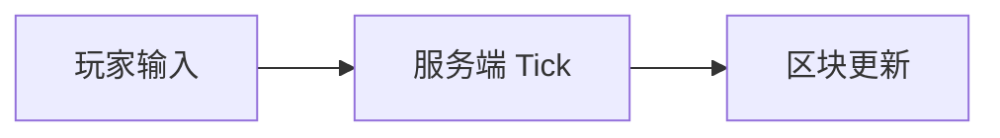

# Fumadocs MDX 文档编写

为 **Thinking-In-Minecraft** 项目编写 `.mdx` 文档时使用本 skill。组件注册见 `components/mdx.tsx`，MDX 插件见 `source.config.ts`。

## 快速决策

| 意图 | 组件 |
|------|------|
| 补充说明，不打断主线 | `<Note>` |
| 警告 / 易错点 | `<Callout type="warning">` |
| 成功 / 确认 | `<Callout type="success">` |
| 错误 / 反例 | `<Callout type="error">` |
| 另一种设计 / 对比方案 | `<Alternative title="...">` |
| 亲历 / 轶事 / 行业观察 | `<Memoir title="...">` |
| 实现细节，读者可跳过 | `<Impl title="...">` |
| 设计约束 + 评判 + 因果链 | `<Constraint name verdict chain>` |
| 流程 / 分步论证 | `<Steps>` + `<Step>`（需注册，见下） |
| 多方案 / 多语言并列 | `<Tabs>` 或 `<CodeBlockTabs>` |
| 架构 / 流程图 | ` ```mermaid ` 代码块 |
| 公式 | KaTeX `$...$` / `$$...$$` |
| 引用来源 | 脚注 `[^n]` |
| 章节索引 | `<Cards>` + `<Card>` |
| 全书交互目录 | `<BookToc />`（仅 toc 页） |

**原则**：组件是排版工具，不是内容替代品。优先保证 prose 可读；只在信息类型确实需要视觉区分时才加组件。一章内同类组件不宜过多（通常 ≤3 个）。

## 文件约定

文档位于 `docs/**/*.mdx`。每篇开头必须有 frontmatter：

```yaml
---
title: 章标题
description: 一句话摘要，用于 SEO 与卡片预览
---
```

可选字段：

- `full: true` — 全宽布局（如 `docs/toc.mdx`）

正文用标准 Markdown（`##` 起笔，避免跳级）。标题自动带锚点（Fumadocs Heading 组件）。

## 已注册组件（直接可用）

### 项目定制块 — `components/mdx/blocks.tsx`

**Note** — 蓝色 info 补充：

```mdx
<Note>
  这里是对正文的补充，不打断阅读主线。
</Note>
```

**Alternative** — 对比 / 另一种做法（默认标题「另一种做法」）：

```mdx
<Alternative title="连续空间得到什么、失去什么">
  若放弃体素，你会得到……
</Alternative>
```

**Memoir** — 亲历记（默认标题「亲历记」，正文斜体）：

```mdx
<Memoir title="2011 年的某次更新">
  当时社区的反应是……
</Memoir>
```

**Impl** — 折叠的实现细节（默认标题「实现细节」）：

```mdx
<Impl title="NBT 存储格式">
  展开后才看到的内容……
</Impl>
```

**Constraint** — 设计约束卡片：

```mdx
<Constraint name="方块即世界" verdict="地基" chain="体素 → 可修改 → 涌现">
  正文说明……
</Constraint>
```

`verdict` 取值：`地基`（绿）| `凑合`（灰）| `待定`（黄）。`chain` 写因果链，用 ` → ` 分隔。

**BookToc** — 仅用于全书目录页：

```mdx
<BookToc />
```

### Fumadocs 内置 — `fumadocs-ui/mdx`

**Callout** — 通用提示框：

```mdx
<Callout type="info" title="提示">内容</Callout>
<Callout type="warning" title="注意">内容</Callout>
<Callout type="error" title="错误">内容</Callout>
<Callout type="success" title="结论">内容</Callout>
<Callout type="idea" title="思路">内容</Callout>
```

也可用底层 API：`<CalloutContainer>` + `<CalloutTitle>` + `<CalloutDescription>`。

**Card / Cards** — 索引页导航：

```mdx
<Cards>
  <Card title="设计约束" href="/design/constraints" description="为什么 MC 长这样" />
  <Card title="Tick 循环" href="/impl/tick" description="世界如何推进" />
</Cards>
```

**CodeBlockTabs** — 多语言代码对比：

```mdx
<CodeBlockTabs items={['Java', 'Bedrock']}>
  <CodeBlockTab value="Java">

```java
// Java 版
```

  </CodeBlockTab>
  <CodeBlockTab value="Bedrock">

```cpp
// Bedrock 版
```

  </CodeBlockTab>
</CodeBlockTabs>
```

普通 fenced code block 自动获得语法高亮与复制按钮，无需额外包装。

**Tabs / Tab** — 方案并列（已注册）：

```mdx
<Tabs items={['MDA', 'Rational Game Design', '二阶设计']} groupId="sky-island">
  <Tab value="MDA">从规则走到体验。</Tab>
  <Tab value="Rational Game Design">把难度和教学排进表。</Tab>
  <Tab value="二阶设计">规则是你的，玩是玩家的。</Tab>
</Tabs>
```

**Steps / Step** — 分步方法（已注册）：

```mdx
<Steps>
  <Step>

### 第一步

钉住场面。

  </Step>
  <Step>

### 第二步

写出你在问的那一句。

  </Step>
</Steps>
```

**Accordions / Accordion** — 词条或可跳过的对照（已注册）。`Impl` 内部也走这一套。

### Mermaid

````mdx

````

渲染走 `components/mdx/mermaid.tsx`，主题色跟随站点 CSS 变量。

### KaTeX 数学

行内：`$E = mc^2$`

块级：

```mdx
$$
\Delta t = \frac{1}{20}\ \text{s}
$$
```

### 脚注

```mdx
这句话需要引用[^1]。

[^1]: 脚注内容。标签已本地化为「注释」。
```

## 未注册但可用的 Fumadocs 组件

以下在 `fumadocs-ui` 中存在，但 **未** 写入 `components/mdx.tsx`。若文档需要，先注册再使用：

| 组件 | 导入路径 | 典型用途 |
|------|----------|----------|
| TypeTable | `fumadocs-ui/components/type-table` | API / 参数表 |
| InlineTOC | `fumadocs-ui/components/inline-toc` | 长文页内目录 |

`Tabs` / `Steps` / `Accordions` / `Files` 已在 `components/mdx.tsx` 注册，直接用。

注册方式 — 在 `components/mdx.tsx` 的 `getMDXComponents` 中 spread 或逐项加入。

## 写作风格（本书特有）

1. **现象开篇**：先描述玩家/开发者可观察到的现象，再展开分析。
2. **约束优先**：设计讨论用 `<Constraint>` 或 `<Alternative>` 呈现权衡，避免纯罗列。
3. **实现可折叠**：技术细节默认放 `<Impl>`，正文保持论证主线。
4. **双版本口径**：Java / Bedrock 差异用 `<Tabs>` 或 `<CodeBlockTabs>` 并列，不要混在一段 prose 里来回切换。
5. **中文为主**：组件 title / 正文用中文；代码标识符、API 名保持英文。

## 常见错误

- 在 `<Note>` 里写长段正文 — 应拆回 prose，Note 只留关键一句。
- 滥用 `<Constraint>` — 仅用于有明确 name / verdict / chain 的设计约束。
- Mermaid 节点文字过长 — 保持简短，细节放 prose。
- 未注册组件直接用 — 会渲染为 FallbackBlock（带边框的 plain div），无样式语义。
- MDX 中大括号 — JSX 属性用 `{['a','b']}` 时注意引号；markdown 特殊字符在 JSX 内需要转义。

## 扩展组件

若反复需要某 Fumadocs 组件，在 `components/mdx.tsx` 注册：

```tsx
import * as TabsComponents from 'fumadocs-ui/components/tabs';

const mapped: MDXComponents = {
  ...defaultMdxComponents,
  ...TabsComponents,
  // ...
};
```

项目定制块加在 `components/mdx/blocks.tsx`，然后在 `mdx.tsx` 中 import 注册。

## 更多示例

见 [examples.md](examples.md)。
