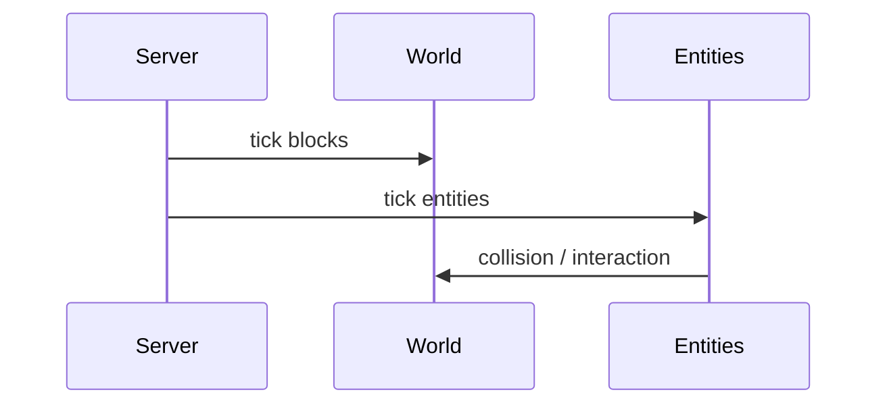

# Fumadocs MDX 示例

完整片段，可直接复制到 `docs/**/*.mdx` 后改内容。

---

## 设计章：约束 + 对比 + 折叠细节

```mdx
---
title: 体素作为原语
description: 为什么 Minecraft 选择方块而不是连续空间。
---

## 现象

玩家能放置、破坏、替换任意可见方块——这是整个游戏动词链的起点。

<Constraint name="方块即世界" verdict="地基" chain="体素 → 可修改 → 涌现">
  世界不是背景贴图，而是可逐格改写的数据结构。这一选择决定了后续所有系统（存储、同步、渲染、模组）的形态。
</Constraint>

<Alternative title="连续空间得到什么、失去什么">
  连续地形 + 体素破坏（如 Teardown）在物理模拟上更自由，但**修改粒度**与**多人同步成本**会急剧上升。Minecraft 选择了可管理的离散格。
</Alternative>

<Impl title="区块与 Section 的存储关系">
  一个区块 16×256×16，内部分为 16 个 Section（高 16 格）……
</Impl>
```

---

## 历史章：亲历记 + 脚注

```mdx
<Memoir title="Beta 1.7 前后">
  那时活塞还未进原版，社区已经用 Mod 实现了几乎相同的机制。**收编**从此成为 Mojang 与模组生态之间的固定节奏。
</Memoir>

Notch 在博客中描述过类似思路[^blog]。

[^blog]: https://example.com — 原文已不可考，此处仅作方法说明示例。
```

---

## 实现章：Mermaid + 多语言代码

````mdx
## Tick 流水线



<CodeBlockTabs items={['Java', 'Bedrock']}>
  <CodeBlockTab value="Java">

```java
public void tick() {
    this.level.tickBlockEntities();
}
```

  </CodeBlockTab>
  <CodeBlockTab value="Bedrock">

```cpp
void Level::tick() {
    mBlockTickQueue.process();
}
```

  </CodeBlockTab>
</CodeBlockTabs>
````

---

## 索引页：卡片导航

```mdx
---
title: 卷二 · 设计
description: 从玩家动词出发，理解 Minecraft 的设计约束。
---

<Cards>
  <Card title="约束即深度" href="/design/constraints" description="不真实的物理往往更好玩" />
  <Card title="体素原语" href="/design/voxel-primitive" description="方块如何定义世界" />
  <Card title="涌现" href="/design/emergence" description="简单规则如何产生复杂行为" />
</Cards>
```

---

## 教程式：Steps（注册后可用）

```mdx
<Steps>
  <Step>

### 读取 level.dat

世界元数据在存档根目录的 `level.dat`，NBT 格式。

  </Step>
  <Step>

### 解析维度数据

每个维度对应 `DIM-N` 目录下的 region 文件……

  </Step>
  <Step>

### 加载区块

按玩家位置按需加载，超出视距的区块写回磁盘。

  </Step>
</Steps>
```

---

## Tabs：方案对比（注册后可用）

```mdx
<Tabs items={['Forge 模组', '数据包', '行为包']} groupId="mod-approach">
  <Tab value="Forge 模组">Java 字节码注入，能力最强，版本升级成本最高。</Tab>
  <Tab value="数据包">原版 JSON + 函数，无代码，适合内容作者。</Tab>
  <Tab value="行为包">Bedrock 侧的数据驱动扩展，与 Java 数据包不同构。</Tab>
</Tabs>
```

`groupId` 使同页或多页同名 Tab 组保持选中同步；加 `persist` 可写入 localStorage。

---

## Callout 类型对照

```mdx
<Callout type="info" title="背景">补充上下文，不打断论证。</Callout>
<Callout type="warning" title="注意">易错点、版本差异、破坏性变更。</Callout>
<Callout type="error" title="反例">明确不推荐的用法或已废弃路径。</Callout>
<Callout type="success" title="结论">一段论证的收束判断。</Callout>
<Callout type="idea" title="思路">尚未证实的假设或设计灵感。</Callout>
```

---

## 数学公式

```mdx
单 tick 时长为 $\Delta t = 1/20\ \text{s}$。

区块加载概率可建模为：

$$
P(\text{load}) = \min\left(1,\ \frac{v}{v + d}\right)
$$

其中 $v$ 为视距，$d$ 为距离。
```

---

## TypeTable（注册后可用）

```mdx
<TypeTable
  type={{
    blockState: {
      description: '方块的当前状态（朝向、含水等）',
      type: 'BlockState',
      required: true,
    },
    tickRate: {
      description: '随机 tick 间隔，仅对部分方块生效',
      type: 'number',
      default: '3',
    },
  }}
/>
```

---

## 目录树（注册后可用）

```mdx
<Files>
  <Folder name="saves/MyWorld" defaultOpen>
    <File name="level.dat" />
    <Folder name="region">
      <File name="r.0.0.mca" />
      <File name="r.0.1.mca" />
    </Folder>
    <Folder name="data">
      <File name="scoreboard.dat" />
    </Folder>
  </Folder>
</Files>
```
