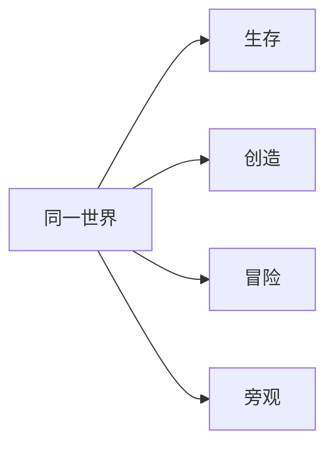

> **本章命题**：四种模式是同一世界上的四种权限，不是四个游戏。创造取消稀缺和死亡的牙齿，不取消格子、物理和那只手；它看起来仍像 Minecraft，正因为寄生在生存的度量上。一旦把创造做成离开身体的编辑器，家就变成文件。

## 问题

创造里盖的那座房子，切回生存还能住：门还是两格，水还会流，TNT 还会炸，夜里没灯仍会黑。关卡编辑器里摆好的关卡，通常搬不回去当家——它本来就不是为了被住，是为了被玩一局。

上一章（[《生存作为意义机器》](/design/survival)）把生存写成节拍器。创造把节拍器的几根针拔掉：饥饿不催，伤害几乎不来，方块要多少有多少。拔完之后，许多人仍说自己在玩 Minecraft，而不说自己在用 World Editor。本章要回答：四种模式是四种游戏，还是四种权限？可被证伪的说法是：创造只是「关了生存的作弊」，玩家喜欢它，是因为懒得挖。只要还存在创造里仍按三高五宽说话、仍被水淹、仍用同一套红石、仍能把作品运进生存世界给别人住的经验，这句话就不成立。懒得挖是真的。懒得挖解释不了为什么编辑器软件不能替代这一种懒。

Beta 1.8 把创造写成正式权限，不是写成另一款产品（见[《Mojang 成立、Beta 与正式版》](/history/mojang-beta)）。权限一公开，官方就很难再假装只有一种正确的玩。后来的冒险和旁观，是同一条立法继续往下写：谁能改世界，谁只能走在别人写好的世界里，谁只能看。

## 为什么创造模式仍像在玩 Minecraft

因为身体还在。你还是第一人称，还是那一米格，还是挖和放，只是挖变成瞬间，放变成无限。飞是走的权限升级，不是摄像机从眼睛里被摘走。准星仍对着格。格仍吸附。水仍按规则流动，沙仍会掉，红石仍占一格。[^creative] 创造删的是生存的牙齿，不是生存的语法。语法还在，口令还在，误用还在：你仍能用无限的方块做出一台会卡服的机器，仍能把地形挖成别人无法口述的洞。无限没有废除原语。无限把原语的份数旋钮拧到头。

还像的另一半是：创造默认不离开「正在住的这份世界」。你不是打开另一份关卡文件再导出。你在存档里改存档。创造物品栏看起来像资产浏览器，拖出来的东西立刻成为格，而不是场景树里要命名、要层级的节点。格只要地址。改完，邻居可以进来走。走的时候用的是生存的脚，哪怕他暂时也开着飞。同一份世界能切换权限，这是模式作为权限而不是作为游戏的证据。若创造是另一种游戏，切换应当等于换存档、换物理、换口令。它没有。

Bedrock 的创造连虚空都不杀你，Java 的创造仍会被虚空和 `/kill` 打死。[^creative] 分叉很烦，很有用：连「怎么死」都可以产品化，两边仍把创造认成同一种权限包——无限、瞬间、飞行、几乎不疼。口音不同，权限同类。

<Callout type="warning" title="创造不是关了生存的作弊">
作弊打开的是命令。创造打开的是一套被公开承认的权限：你仍在玩这套规则，只是稀缺和死亡暂时不下场。把创造听成作弊，会把后来的创造服、展览和地图工业一并说成不正当。这些东西当然有治理上的问题，但问题在治理，不在这套权限本身。
</Callout>

## 创造寄生于生存规则

寄生不是骂人。寄生是说：创造的每一格意义，都从生存借来。两格门洞之所以是门洞，因为生存里的人高 1.8。水流之所以还要你想一想，因为生存里桶是动词放大器。红石之所以在创造里仍然好玩，因为信号走的是建造用的格，不是编辑器的逻辑图。上一章的资源阶梯在创造里被跳过，阶梯教过的尺度没有被跳过。你不再需要木镐，你仍在用木镐教过你的那把尺。

若把寄生解开——创造里的方块不再是生存的方块，重力可关成「美工选项」，尺度改成自由笔刷，放置不再吸附——玩家得到的是更强的关卡编辑器。更强。也更不像。方法章给过证伪句：若创造一旦去掉生存的方块、尺度和物理，玩家仍然觉得自己在玩 Minecraft，这句话要改。至今，Bedrock 自己把「更强的编辑」另做成了别的东西：编辑器，一个独立于游戏模式的工具。官方仓库写明：它不是新的游戏模式，是给创作者用的工具。[^editor] 官方都肯分家，说明创造必须停在寄生里，才能继续叫创造模式。

结构方块、填充命令、模组里的选区，是寄生之上的工具层。工具层可以很像编辑器，仍要写回同一套方块 ID 和同一套格。写不回，就导出成别的引擎。能写回，才是 Minecraft 的工地，而不是 DCC 创作软件里的场景。创造里的 TNT 仍炸生存认的方块，活塞仍推格。若官方另做一套「创造专用无物理积木」，展览会更快，口令会立刻分成两种。交卷标准来自寄生：别人能否用生存的脚走一遍。Java 的模组工地和 Bedrock 的附加包工地分叉在工具怎么装；不分叉在写回哪一种世界。写回哪一种世界，决定你还在不在寄生。

飞行值得单独说一句。飞取消的是垂直稀缺：生存里的高是爬、是搭、是掉。创造把高变成走。高变成走之后，建筑的社会意义变了——大厅可以先长出屋顶——但高的单位没变。单位没变，飞就还是走的权限，不是正交摄像机。正交摄像机是编辑器的眼睛。创造拒绝那只眼睛，是为了让你盖完还能用同一双眼睛去住。

<Constraint name="创造寄生生存" verdict="地基" chain="同一格子 → 同一物理 → 同一口令">
无限改的是份数，不是对象的种类。对象一旦改种，创造就毕业成编辑器，毕业证上不再写 Minecraft。能抄的是权限旋钮；抄不走的是被生存教过的那把尺。
</Constraint>

## 无限资源的社会意义：展示、协作、大厅

稀缺一取消，建造从「我能否活过今晚」变成「我能否被看见」。看见需要观众。观众在单人档里是未来的自己和影像；在服务器里是过路的人。创造服把无限做成城市：地皮、出生点展览、合作盖的宫殿、给小游戏当大厅的那座岛。三种社会（见[《服务器即新游戏》](/history/servers)）里，创造社会的宪法最干净，冲突从饥饿转到占地和审美。干净不是无政治。谁的作品配留在出生点附近，谁的被清，仍是政治。只是政治不再假装成生存。

影像工业吃的也是无限。延时摄影、周刊建筑、梦核巡游，镜头需要世界在白天停留、需要方块不要算账。创造满足摄影棚，同时还保持可走：观众进世界之后，用的仍是那七个动词，而不是时间轴。Marketplace 的地图常常在创造里生产，在冒险里出售，在生存里被误认为「原版长这样」。[^adventure] 生产、出售、误认，三条链都靠无限把劳动从采集里解放出来。解放之后，劳动变成设计。设计可以卖。卖是卷一的商业问题。本章只要承认：无限改变的不是「能不能盖」，是盖给谁看、谁有权把看见收成商品。

协作也变。生存里的协作要先活着，创造里的协作从第一秒就是共同作者。家庭档里常常是一人飞、一人走，同盖一座丑房子；权限可以一人一把地发，不用编译，也不必重开世界。共同作者仍需要那把尺：三高五宽、选区、结构方块。没有尺，无限会变成每人一把笔刷的噪声。有尺，无限才是并行的工地。WorldEdit 和投影模组在 Java 上把工地加速；Bedrock 用结构、命令和后来的编辑器加速。加速是工具。工具吃的是无限权限，吐回的仍是生存能认的方块。吐不回，协作就离开这款游戏。

可被证伪的说法是：无限让建造失去意义，真正的建造只发生在生存。创造服的十年展览、教育里的课堂模型、家庭档里家长和小孩同一晚盖完的那座丑房子，都在反驳。教育版把创造收成课堂：无限是为了让一节课盖得完，不是为了取消格子。格子还在，课才能用口令上。意义从稀缺挪到了展示和关系。挪走不是堕落。堕落的是自己已经把意义挪到了展示上，还拿着生存那套稀缺和死亡去嘲笑别人「不是真 Minecraft」。牙齿可以不开；不开牙齿的人，用的仍是同一套原语。

## 四种权限

生存、创造、冒险、旁观，是同一世界的四把钥匙。硬核不是第五种模式，是生存上的一枚锁：难度锁死，死了不能以生存者回来。[^hardcore] 创建世界时的默认模式往往只在生存和创造之间选；进门之后，命令或设置再把个人权限拧到另外两档。[^gamemode] 拧的是人，不是世界。世界还是那份存档。人换钥匙。

| 权限 | 生存 | 创造 | 冒险 | 旁观 |
| --- | --- | --- | --- | --- |
| 改地形（挖 / 放） | 要时间、要工具 | 瞬间、无限 | 默认不能，除非物品带「可破坏 / 可放置」标签 | 不能 |
| 稀缺 | 有，背包是界 | 无，创造物品栏 | 有，通常由地图作者配好 | 无交互 |
| 身体 | 走、摔、饿、死 | 飞、几乎不疼 | 走、摔、饿、死 | 穿墙飞，不被看见 |
| 目标从哪来 | 节奏装置 + 自建 | 展示、协作、工地 | 作者写好的遭遇 | 看别人的遭遇 |
| 典型社会 | 生存服、单人档 | 创造服、摄影棚 | 地图、Marketplace 模板 | 管理、回放、硬核死后 |

表要经得起边角。创造不是绝对不死：Java 虚空仍杀。冒险不是绝对不能动手：标签把挖和放变成作者发给你的许可证。旁观不是另一种创造：你不能伸手，只能穿过。Bedrock 的旁观到 1.19.50 才从实验里转正，Java 的旁观从 1.8 就在；[^spectator] 转正早晚不同，钥匙形状同类。冒险在 Marketplace 模板里常常是默认权限，[^adventure] 因为商品需要世界不被顾客拆掉。商品逻辑是卷一的事。设计上它暴露了冒险的职责：把创造生产出来的世界，锁成可玩不可任意改写的文本。

四种钥匙可以在同一房间里同时存在。管理员旁观，建筑师创造，玩家生存，地图旅客冒险。钥匙也可以临时借：修完地形再拧回生存，世界不必导出成另一份工程。关卡编辑器里的「给策划开权限」，通常意味着另一份文件。Minecraft 把工程和存档做成同一个东西，所以借钥匙不必离开家。这是权限模型，不是分屏四款游戏。分屏四款游戏会要求四套物理。这里只有一套物理，四套许可证。

<Note>
Java 用调试快捷键切模式；Bedrock 在世界设置里改「个人游戏模式」，并多一档「默认」，跟世界走。入口不同，四把钥匙是同一串。
</Note>

<Impl title="硬核是锁，不是第五把钥匙">
硬核锁难度为困难，禁止以生存者重生；多人里死者进旁观，别人继续住。Java 很早就有；Bedrock 1.21.40 做成创建世界时的开关。它不新增动词，只收紧生存这把钥匙的后果。把硬核写成独立游戏，会把权限模型讲乱。[^hardcore]
</Impl>

## 对照：Studio、GMod、关卡编辑器

对照是为了看创造停在哪一条边界上。

<Alternative title="三种离开身体的造法">
Bedrock 编辑器把多选、填充、撤销和自由鼠标做成工具模式；准星模式才长得像创造，并且可以穿墙。官方说它不是游戏模式。[^editor] 你得到专业工地，失去的是「我一直住在这份权限里」：项目要导出，测试要另开一份临时世界。它诚实。诚实的代价是分家。

《Garry's Mod》的生成菜单和物理枪让沙盒停在道具层：东西是模型，世界是舞台，焊接是约束。你得到会倒的塔和会跑的车。你失去的是把舞台本身当成库存来搬。创造模式搬的是格；GMod 摆的是演员。演员很自由。演员不是地形。[^gmod]

传统关卡编辑器——Hammer 那一类——让你在游戏外面编辑，编译后再进去玩。进出是仪式。仪式保护了专业工具链，也把「住」从工序里删掉。Minecraft 的创造拒绝这份仪式：不编译，不导出，改完就能走。走得了，才还是权限，不是流水线的上一站。
</Alternative>

创造停在身体里，是为了让无限仍然可住。离线编辑器离开身体，是为了让无限可生产。两条河可以灌溉同一座地图工业：在工具里生产，在创造里巡视，在冒险里交付，在生存里被误用。工业会把创造压成流水线。压的时候，原语仍是检验：交付出去的东西，还认不认一米格、还能不能被没打开过编辑器的人走一遍。认，它还是 Minecraft 的地图。不认，它是别的引擎借了方块皮肤。

工具层不是原罪。游戏里叠在世界上的笔刷和选区、离线的地形软件、Replay 和动画模组，都是创作者和服主已经在用的第二只手。它们可以很强，也可以轻量，还可以让还在场的人立刻看见改动。缺席它们，地图工业和创造服会变穷，不是更纯。本章拒绝的是另一件事：把这只手叫做创造模式，用它顶替那具还在走的身体。创造继续寄生；工地可以另开窗口——只要写回去的仍是同一套格。后文写模组方法和作者性时再展开这条河。

所以开发者不能只抄「创造模式：无限方块 + 飞行」。那是旋钮。要抄的是权限模型：同一世界、同一物理、四把钥匙，以及创造必须继续寄生。抄成独立编辑器加独立运行时，你会得到更强的内容管线。管线很值钱。管线不是这四种权限叠在同一份存档上的那种社会。社会需要人在无限里仍会碰到水、仍会用口令、仍能把权限拧回去变成生存。拧得回去，才叫同一款游戏。拧不回去，你做了两款，只是共用一个图标。

## 这一章留下什么

- **爱好者**：创造不是偷懒的生存，冒险不是残废的生存，旁观不是鬼。四把钥匙开同一扇门。你在创造里盖的东西若还能被生存的脚走一遍，它就还在 Minecraft 里；若只能在编辑器的视口里成立，它已经搬走了。
- **开发者**：能抄走的是「模式即权限」——在同一世界上拧稀缺、牙齿、改写权和可见性，而不是做四个子系统。抄不走的是：这把尺已经被生存教成常识，创造一旦脱离格子和身体，二十年的口令、创造服和地图工业会立刻要求你另做一套软件。无限好做。寄生难做。寄生做不成时，不要把编辑器叫做创造模式。

[^creative]: 创造模式：无限物品、瞬间破坏、飞行、无饥饿条；绝大多数伤害无效。Java 仍可死于虚空、`/kill` 等；Bedrock 创造对虚空也免疫（维度底部另有屏障）。见 [Creative](https://minecraft.wiki/w/Creative)、[Game mode](https://minecraft.wiki/w/Game_mode)。创造作为正式权限写入 Java Edition Beta 1.8。

[^editor]: Mojang：「Editor is not a new gamemode. It is a tool to assist creators in their worldbuilding workflows。」见 [Mojang/minecraft-editor](https://github.com/Mojang/minecraft-editor)。工具模式提供多选与界面；准星模式接近创造操作。见 Microsoft Learn，[Editor Tool Mode](https://learn.microsoft.com/en-us/minecraft/creator/documents/bedrockeditor/editortoolmode)。

[^adventure]: 冒险模式默认不能破坏或放置，除非物品带有可破坏 / 可放置类标签；常作为地图与 Marketplace 世界模板的默认权限。见 [Game mode](https://minecraft.wiki/w/Game_mode)。冒险模式加入于 Java Edition 1.3.1。

[^hardcore]: 硬核是生存上的状态锁，不是第五种 `gamemode`。Java 死亡后旁观或离开；Bedrock 1.21.40 起可在创建世界时打开。见 [Game mode](https://minecraft.wiki/w/Game_mode)。

[^gamemode]: 四种游戏模式为生存、创造、冒险、旁观。Bedrock 另有「默认」，跟随世界默认模式。见 [Game mode](https://minecraft.wiki/w/Game_mode)。

[^spectator]: 旁观：穿墙飞行、不可交互、对非旁观玩家不可见。Java Edition 1.8 加入；Bedrock 1.19.50 起无需实验开关。见 Mojang，《1.19.50 Update Available on Bedrock》，<https://www.minecraft.net/en-us/article/1-19-50-update-available-bedrock>；[Game mode](https://minecraft.wiki/w/Game_mode)。

[^gmod]: 《Garry's Mod》是建立在 Source 引擎上的沙盒，玩家生成道具并以物理约束组合。见 Wikipedia，[Garry's Mod](https://en.wikipedia.org/wiki/Garry%27s_Mod)。
