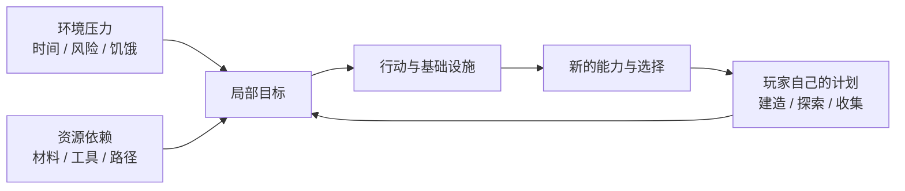

新建一个 Survival 世界时，屏幕上通常不会弹出一张“第一章：建造庇护所”的任务表。

你只是出现在一个陌生地方，背包几乎是空的。天会变黑，受伤会掉血，很多资源需要工具才能有效取得；如果想在这里待久一点，就得开始处理这些事情。

于是玩家很快会自己说出一串目标：

> 先弄点木头。  
> 做工具。  
> 找吃的。  
> 天黑前找个地方待着。  
> 明天再去挖矿。

这些目标并不是凭空出现的，也不完全来自某一套隐藏任务系统。这一章要讨论的，正是它们从哪里来。

> **Minecraft 为什么不需要持续告诉玩家“下一步做什么”，仍然能够让很多人自然产生下一步？生存条件在其中究竟起了多大作用？**

## Minecraft 不是“完全没有目标”

先纠正一个很容易说过头的说法：Minecraft 并不是一款“完全不给目标”的游戏。现代版本会用配方解锁、提示、Java Edition 的 Advancements、Bedrock Edition 的 Achievements 等方式告诉玩家一些可能去做的事情；官方的新手材料也会直接教玩家如何度过第一晚、制作床、建立安全位置和管理食物。[^advancements][^first-night]

所以真正有意思的并不是：

> Minecraft 为什么什么都不告诉玩家？

而是：

> **为什么这些提示通常不需要变成一条强制主线，玩家仍然能继续行动？**

Advancement 可以建议你去做一件事，却通常不会因为你没有完成它，就禁止你盖房子、挖矿、旅行或和朋友一起玩。于是，“官方给出的目标”和“玩家自己决定的目标”可以同时存在。

## 第一晚为什么这么容易产生目标

第一晚是观察这件事最方便的地方。它当然不是 Minecraft 的完整设计，也不需要被神化成一套精密的新手关卡，但它把几个条件压缩在了很短的时间里：

- 玩家刚进入世界，资源很少；
- 白天不会永久持续；
- 黑暗区域可能出现危险；
- 食物、生命与工具效率都会影响之后的行动；
- 世界又允许玩家直接挖、放和改造环境。

这些条件不会告诉玩家“必须盖一栋 5×5 的木屋”，但会不断制造一些很朴素的问题：

> 我现在安全吗？  
> 我手里的东西够不够？  
> 如果继续往前走，会不会来不及回来？

于是“找木头”“做火把”“挖一个洞”“搭一间房”“做一张床”都可能成为答案。这和传统任务有一个很明显的区别：任务系统通常先定义目标，再要求玩家完成；Minecraft 很多时候是先给出**环境状态与资源条件**，让目标从玩家对这些条件的回应里出现。

这张图不是说所有玩家都遵循同一条循环，而是说明一个常见现象：**外部压力可以启动目标，资源关系可以延长目标，而玩家自己的计划会逐渐接过方向盘。**

## 生存压力提供的是优先级，不是人生目标

黑夜、饥饿和怪物当然会影响玩家接下来做什么，但它们并不能解释 Minecraft 里所有目标。更准确地说，生存条件不断改变的是**优先级**：你本来想继续盖屋顶，天黑以后可能先去补照明；本来准备远行，食物不足时可能改成先种田；下矿很深以后，发现装备快坏了，又会重新考虑是否继续。

这些系统会打断计划、增加成本、制造紧迫感，却通常不会告诉玩家最终应该成为谁。

同一份压力可以得到完全不同的回应：

- 怕夜晚，可以睡过去，也可以留下来打怪；
- 食物不足，可以打猎、种田、钓鱼、交易，或者继续迁徙；
- 觉得地下危险，可以先升级装备，也可以直接绕开洞穴；
- 死亡成本太高，也可以调整难度或世界规则。

因此，与其说“生存给了玩家目标”，不如说：

> **生存条件不断改变什么事情现在更值得处理。**

这也是为什么 Peaceful 并不会让 Minecraft 突然失去一切目标。官方本身就把 Peaceful、Easy、Normal、Hard 作为 Survival 可选难度；这些设置会改变敌对生物、伤害、饥饿和恢复等条件，但建造、探索、收集、运输和长期经营依然存在。[^what-is-minecraft]

## 资源依赖把一个目标变成下一串目标

除了压力，Minecraft 还有另一种很重要的目标来源：**依赖关系。** 假设玩家突然决定：

> 我想去远一点的地方探索。

这个愿望很快可能拆成更多问题：

> 要不要带食物？  
> 有没有床？  
> 背包够不够？  
> 需要船还是矿车？  
> 要不要先准备更好的工具？

而每一个准备又会继续指向材料、合成、存储和基础设施。这种目标链与任务链看起来很像，但有一个关键区别：它通常不是系统提前写好的固定顺序。玩家可以跳步、换方法、绕路，甚至决定不做。

想得到铁制工具，需要先找到铁并完成必要的加工；但你可以在不同地点寻找，可以从结构或交易中获得资源，也可以暂时不用更好的工具。

这种“想做 A，于是发现还需要 B 和 C”的关系，会在下一章[《物品、合成与库存》](/design/items-crafting-inventory)里详细展开。

这里重要的是：

> **资源系统不仅奖励完成目标，也不断制造新的中间目标。**

## 临时应对为什么会变成长期基础设施

生存里的很多东西，一开始只是为了处理眼前问题。第一间庇护所可能只是因为天快黑了；第一个箱子只是背包满了；最初的一小块农田只是食物不够；床可能只是为了跳过夜晚并设置新的重生点。[^first-night]

但这些临时解决方案很容易留下来，并继续参与之后的游戏：箱子变成仓库，农田变成稳定食物来源，矿洞有了固定入口，临时房子逐渐扩成基地。

于是目标出现了一个很重要的变化：

> **玩家不再只是解决一次问题，而是在降低同一类问题以后再次出现的成本。**

这也是“基础设施”开始出现的地方。储存让未来采集更方便，床让行动半径更稳定，照明让一部分空间更安全，交通设施让远处资源更容易进入基地。

生存压力因此不只是不断消耗玩家。玩家也可以通过改造世界，逐渐把反复出现的麻烦变成已经解决的问题。于是世界开始出现明显的时间层次：刚出生时什么都缺；住久以后，很多早期问题已经被自己的建筑和设施消化掉。

这些设施还会引出另一个更大的问题：当玩家不再只是满足生存需求，而开始主动决定世界应该变成什么样时，创造为什么会成为一种独立的玩法？这会留给[《创造为何成为玩法》](/design/creation-as-play)继续讨论。

## 死亡让目标有风险，但通常不会重置整个世界

Survival 需要某种失败成本，否则很多准备也会失去作用。Minecraft 默认的死亡处理很有代表性：玩家会失去当前位置，物品通常会掉落，随后从重生点继续；但世界本身不会因为一次死亡被重新生成。[^death]

这意味着失败主要打断的是**玩家当前的行动和携带资源**，而不是之前所有建设。你可能在远处死掉，丢失一批装备，但基地、道路、农田和已经挖出的矿道仍然存在。因此死亡会让“要不要继续深入”“要不要带最好的装备”“需不需要先设置重生点”这些决定变得有重量，却通常不会把一个长期世界直接变回零。

Hardcore 则把这项规则推到另一端：死亡后不能再以正常 Survival 方式继续该世界，只能旁观等受限方式访问。[^death] 它证明死亡成本可以被显著提高，但这种高成本是一个明确的模式选择，而不是 Survival 唯一正确的形态；另一边，`keepInventory` 等规则又可以明显降低死亡损失。

这些选项共同说明：

> **“生存感”不是由某一个固定惩罚强度决定的。**

不同玩家和服务器可以保留资源限制、探索与建造，同时对死亡、敌对生物和其他风险采用不同设置。

## 当早期压力退去以后，目标从哪里来

如果生存系统只会不断提醒玩家吃饭、躲怪和补装备，那么一个发展成熟的世界应该越来越无聊。实际情况往往相反：当食物稳定、装备完善、基地安全以后，很多最紧迫的压力反而会减弱，玩家已经不必每天为第一晚那种问题忙碌。

这时目标来源会逐渐变化。有人开始修更大的基地，有人收集稀有物品，有人修铁路和传送网络，有人研究自动化，有人探索新地形，也有人把击败 Ender Dragon 当成阶段目标。这些目标和生存仍然有关系——资源成本、旅行风险、物品损失还在——但它们越来越明显地来自**玩家自己的计划**。

Java 的 Advancements 很适合观察这种关系。它们既有能够帮助新玩家理解基本流程的分支，也有明显属于挑战或探索性质的目标；完成其中一项通常不会把未完成的其他路径锁住。[^advancements] 因此，Minecraft 并不是简单地“把目标全部丢给玩家”。更准确的说法可能是：

> **游戏提供压力、依赖、提示和可能性，但允许玩家决定哪些东西值得继续追。**

这也是为什么两个都在 Survival 的玩家，几年后可能拥有完全不同的世界。

## 生存和其他玩法为什么很难切开

生存之所以很难和物品、探索、怪物、建造甚至多人完全分开，是因为 Survival 本来就不是一个孤立子系统。它更像是几类条件叠在同一个世界上：

- 资源不是无限的；
- 玩家可能受伤和死亡；
- 时间、距离和环境会增加成本；
- 很多能力需要通过材料、装备或基础设施获得；
- 世界又允许这些问题被玩家自己的工程逐渐解决。

这些条件彼此纠缠，却不需要由“生存”一章全部解释。这里关注的是它们怎样影响目标形成；具体的资源循环会在物品章展开，怪物和战斗怎样制造空间压力留给生物章，官方 progression、Nether、End 和游戏后期留给进度章，建造为什么产生地方感则留给建造章。

## 这一章留下什么

这一章目前可以留下几件比较具体的判断：

- **Minecraft 并非没有官方提示或目标，但大多数提示不会把玩家锁进单一路线。**
- **生存压力主要改变优先级：它让某些问题现在更值得处理，却很少规定最终目标。**
- **资源和工具之间的依赖会把一个愿望拆成多个中间目标，同时仍允许绕路和跳步。**
- **玩家可以通过建筑和基础设施减少重复压力，因此世界会从“不断应付问题”逐渐变成“拥有自己解决方案的地方”。**
- **默认死亡会打断玩家并造成损失，但通常不会抹掉整个世界；风险因此可以与长期积累并存。**
- **当早期生存压力逐渐被解决，目标会越来越多地来自玩家自己的计划，而不是环境催促。**

下一章[《物品、合成与库存》](/design/items-crafting-inventory)会接着看其中一条最重要的链：世界里的材料怎样进入玩家手中，又怎样通过工具、合成、存储与资源循环不断产生新的可能。

[^what-is-minecraft]: Mojang Studios，[《What is Minecraft?》](https://www.minecraft.net/en-us/article/what-minecraft)，2026 年 10 月 4 日访问。官方说明 Survival 中的难度会影响敌对生物生成、伤害、饥饿消耗和生命恢复等因素。

[^first-night]: Mojang Studios，[《How to survive your first night in Minecraft》](https://www.minecraft.net/en-us/article/how-survive-your-first-night-minecraft)，2026 年 10 月 4 日访问。官方新手指南把庇护所、床、食物和熔炉等作为早期 Survival 常见准备，同时也明确存在多种度过夜晚的方式。

[^death]: Mojang Studios，[《Spawning and dying in Minecraft》](https://www.minecraft.net/en-us/article/spawning-and-dying)，2026 年 10 月 4 日访问；以及 Minecraft Help，[《All Game Modes in Minecraft》](https://help.minecraft.net/hc/en-us/articles/360058743992-Minecraft-Differences-Between-Creative-Survival)。官方说明普通模式下玩家死亡后可以重生，而 Hardcore 将死亡设置为不可正常重生的高风险模式。

[^advancements]: Minecraft Wiki 编者，[《Advancement》](https://minecraft.wiki/w/Advancements)，2026 年 10 月 4 日访问。Advancements 被描述为逐步引导新玩家并提供挑战的系统；其树状目标可以跨探索、农业、Nether、End 等不同方向展开。