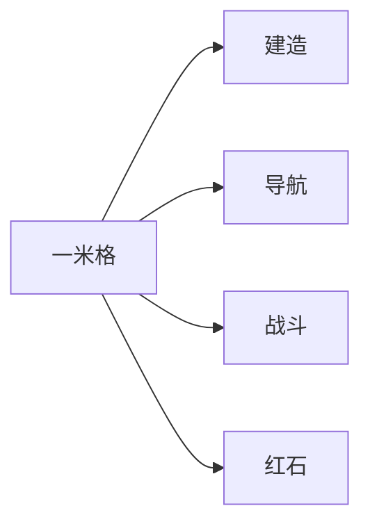

> **本章命题**：Minecraft 的原语不是 16×16 像素，是一套可操作的一米网格。世界被切成可破坏、可放置、可计数的格子之后，建造、导航、战斗和红石才能说同一种话。丢掉网格，留下方块画风，得到的不是 Minecraft。

## 问题

两个人对着同一座没封顶的房子说话，不需要打开编辑器。

「两格高留门。」「隔四格插火把。」「坑挖三格，跳不出来。」对方点头。洞没挖对、门没留够，错是整数的错，能用手指指着那一格复述。影像章写过：240p 的第一夜和 4K 的第一夜教的是同一套指令。[《影像、教育与一代人的媒介》](/history/media-education) 把这件事写成传播。本章要问机制：1 米立方体凭什么同时服务建造、走路、打架和红石？

外行有一句现成的贬义：方块游戏。意思是穷、老、像玩具。可被证伪的说法是：Minecraft 好玩，是因为它长得像像素风积木；把贴图换成照片级，或者把方块换成平滑地形，它仍然是同一个游戏。资源包和光线追踪已经换过皮；换皮之后，人口头说的还是「那一格」。皮换了，话没换。话没换，是因为被操作的不是像素，是格子。

起源章记下过一句更硬的话：世界即库存。[《从 Infiniminer 到 Cave Game》](/history/infiniminer) 那是减法之后剩下的循环。卷二从这里起笔，不是为了再讲一遍 2009 年，是为了把那句话冻成后文所有「Minecraft 味」判断的地板。地板不稳，生存、创造、红石、模组方法都会滑成品味。

## 「方块游戏」为什么不是贬义

贬义假定：多边形越多，游戏越多。Minecraft 看起来像少做了半个三维。少做的那一半，如果是光滑的有机曲面，它确实没有。它没有换成的，是另一套更贵的东西：所有人共用的空间语法。

语法的单位是格子，不是纹素。默认材质是 16×16，因为 2009 年一张贴图要小，远看还要能认。这是预算。预算会被改：32、64、128 的资源包活了十几年；光线追踪和后来的高清光照改的是样子，不是寻址。[^respack] 改完之后，门还是两格高，火把还是插在格子上。若原语真是像素风，高清包会把游戏玩成另一个东西。它没有。它只是让同一套格子更好看或更难看。

更干净的反例在碰撞，不在贴图。玩家模型按材质算大约两格高，缩放之后视觉身高约 1.875 米；碰撞箱却是 1.8 米高、0.6 米宽。[^player] 你看见的人和你撞到的人不是同一个尺寸。潜行、游泳、鞘翅会改碰撞，不改「Steve 有几像素」。Bedrock 的角色创建器甚至允许视觉上高矮四种身材，碰撞箱仍是同一份。[^skin] 美术在表演。规则认的是箱子。箱子对齐的是格子。所以：像素是皮肤，碰撞和占据才是原语。把 Minecraft 收成「马赛克美学」，等于把度量衡收成字体。

<Callout type="warning" title="原语不是画风">
16×16 可以换。一米格不能换。后文凡是说「Minecraft 味」，默认指格子上的可操作性：能指、能挖、能放、能数。味道若只在滤镜里，资源包早该把游戏换种。
</Callout>

方块作为贬义，还偷换了另一件事：它把「离散」听成「简陋」，把「简陋」听成「没有设计」。离散是设计。连续空间的沙盒往往更像工作室——你要先学会工具，再做出一个别人难以口述的形状。Minecraft 把工作室藏进那只手：没有「进入建造模式」的仪式，下一章会写为什么这个缺席是对的。本章先钉死：手抓到的对象必须能被叫出来。叫得出来的对象，是有地址的格子。

可被证伪的说法是：玩家真正爱的是方块的「可爱」。若有一天官方把世界改成可随意揉捏的黏土，只要还叫 Minecraft、还是第一人称，社区会觉得更自由、而不是失语。只要还存在「三高五宽」这种无法翻译成连续曲面的口令，这句话就不成立。失语不是少了方块贴图。失语是少了那一格。

## 离散空间：负担换表达力

连续空间把位置写成实数。精确，也昂贵：你要决定对准哪一个无限小的点，别人要猜你对准的是哪一个。离散空间把位置写成整数。世界是三维数组。每一格有地址，地址能说、能写、能截图、能在语音里喊。Java 按 F3、Bedrock 打开显示坐标，看见的不是调试彩蛋，是这套地址被做成了第一等公民。[^coords] 坐标的单位就是一格，一格被当成一米。[^block]

负担在表达力的另一头。你画不出圆得像圆的圆。楼梯、台阶、栅栏、雪层占不满一格，却仍吸附在格上——它们细化度量，不废除度量。[^block] 曲面被拒绝了。拒绝换来的是组合：同样的格子可以是墙、是台阶、是红石通路、是把怪物卡死的坑。组合不需要新工具，需要的是同一套加法。儿童能学，不是因为规则幼稚，是因为加法和口述用的是同一个单位。

粒度必须贴着身体。体素可以更细：把一米再切十刀，圆会好看，口令会变贵。「两格高留门」变成「二十格」，整数还在，手已经比划不动。更粗也不行。两米一格，0.6 宽的人变成永远偏细的虫子，一格宽的走廊变成大厅，一格的缝不再是会掉下去的威胁。一米格刚好卡在人体上：门两格、身一格出头、跳一格出头、一格宽能走也能坠。更细的格还会把库存胀破——一座小屋的报价会跳一个数量级，64 一组的尺子突然不够用。所以原语不是任意分辨率的「体素」，是和这具碰撞箱对齐的那一刀。换分辨率等于换语言。你可以换材质，不能偷偷换格的大小，还假装玩家在说同一种话。

这里有一刀必须切开，否则后文会把玩家也写成方块。

**世界是离散的。人不是。** 玩家是一个连续移动的碰撞箱，在格子里滑动、起跳、擦边。宽 0.6 米，所以一格宽的走廊能过，一格宽的洞也能掉下去。高 1.8 米，所以两格的门洞能过，一格的门洞要爬。跳跃大约 1.25 格[^player]：一格高的台能上，两格高的墙要搭。潜行把身高收到 1.5 格，并且让你在边缘不掉下去——建造向外悬挑的那只手，靠的是这句碰撞，不是灵感。[^sneak]

人是连续的，世界是离散的：这不是实现凑合，是两套尺度在同一场里打架。打架的结果是手感。你对准的是格子（方块轮廓在准星里亮起来），身体却在格子之间的缝里。跑酷把缝说成语言；普通生存把缝说成「差点掉下去」。两种说法认的是同一份合同：地址在格上，运动在格间。

<Note>
Java 与 Bedrock 共用这张合同，数字有分叉。生存里方块触及距离 Java 默认 4.5 格、Bedrock 键鼠 5 格，触屏更长；跳跃高度 Java 约 1.2522 格，Bedrock 约 1.24919 格。[^reach][^player] 跑酷和 PVP 会把小数当成护照。护照证明产品线分裂，不证明原语不同。原语仍是：人连续、格离散、对准那一格。
</Note>

整数坐标还有一层社会后果。建造可以远程指挥。「往东再挖七格」是可执行的命令，不是艺术指导。模组作者给方块起名、数据包给结构标原点、服务器用区块管领地——全都寄生在同一套寻址上。连续网格若只存在于引擎内部、从不成为口语，共同作者会少一种共同语言。语言先于模组 API。API 只是后来把口语写进程序。

<Impl title="格子、占据、碰撞不是同一件事">
一格是 1×1×1 米的单元格。实心方块通常占满它；台阶、地毯、栅栏占一部分体积，但仍以该格为地址。流体也占格。玩家和生物不占格，他们带着自己的碰撞箱在格里走。挖掉一格，是把这个地址上的方块状态改成空气，并（通常）掉出一个物品。对准，是从眼睛射出一条有限长的线，命中某个格或某个碰撞箱。Java 用线框标出被对准的格，Bedrock 可用线框或高亮。[^reach] 卷三再写区块和调色板。设计上只要记住：地址、体积、碰撞箱可以不一致；不一致时，规则认碰撞，口语认地址。
</Impl>

## 世界即库存

挖不是特效。挖是搬运的开始：世界的一部分离开原位，变成你能带走的东西。放不是「进入建造」。放是搬运的另一半：手里的东西回到某个地址，成为过一会儿还能再挖的东西。地上的方块和背包里的方块是同一种对象的两种位置。角色几乎透明。没有技能树把「我更强了」写成数字；强是因为地形被你改过，箱子里有你挪来的山。

这句话要经得起反例。熔炉把卵石烧成石头，对象变了，单位没变：仍是一份一份地数。时运多掉矿，精准采集让玻璃回家，它们改的是「这一格变成几份什么」，不改「世界和背包共用一份离散对象」。潜影盒把箱子做成可搬运的格子，是世界即库存的加强，不是例外。经验值、附魔、状态效果看起来像 RPG，成长仍附着在物品和位置上：更好的镐、套着附魔的胸甲、放在那里的信标。人还是那个人。变的是他搬得动的世界。

可计数，是这套原语的第三只脚。一格是一份。64 个一份叠成一组，组进箱子，箱子进盒。建造能报价：「这座塔八百块石头。」报价能被核对。核对能被直播。直播能被照着做。连续网格的雕塑很难报价——你要说体积、拓扑、笔刷半径，听的人没有同一把尺。Minecraft 把尺焊在世界上。尺一旦共用，误用才有材料：红石要数延迟，刷怪塔要数格，冰道要数距离。没有可数的格，计算机搭不起来，不是因为玩家不会电路，是因为没有可对齐的节拍器。

<Constraint name="世界即库存" verdict="地基" chain="可破坏 → 可放置 → 可计数">
格子若只能看不能挖，世界是背景。只能挖不能放，世界是矿。能挖能放而不能数，世界是泥。三件事同时成立，世界才变成可搬的库存，库存才变成可住的地方。后文的生存、创造、红石，都坐在这张凳子上。
</Constraint>

创造模式看起来像反例：无限的库存，还要格子干什么？正是因为格子还在。无限的是份数，不是形状的自由度。创造取消的是稀缺，不是寻址。所以创造必须寄生在生存的度量上——下一章写动词，创造那一章会回来打这口钉。这里先挡住一种懒惰：别把「无限方块」听成「没有原语」。没有原语的无限，是画布。有原语的无限，仍是可复述的世界。

## 一套度量，四种玩法

若建造用一把手，走路用另一把尺，打架进第三套碰撞，红石再开电路图，Minecraft 会变成四个并排的工具。它没有。四种玩法共用一米格，所以一只手能从盖房滑进挖坑，从挖坑滑进埋炸药，从埋炸药滑进接线。仪式越少，误用越多。

**建造**认的是组合。两格高的门洞对应 1.8 米的人。火把间距是照明在格子上的口语，不是光度学。地图画是把像素放大成格子；建筑是把格子收成房间。别人能接手你的世界，因为接手的人认同一把尺。尺一丢，接手变成重新建模。

**导航**认的是通过与坠落。一格宽能走，因为人宽 0.6。两格高能过。一格深的坑能跳出来；两格深，没有辅助就上不来——跳跃只有大约一格出头。口语里常说「挖三格」，那是余量，不是另一套物理。台阶让你自动跨上 0.6 格以内的高度差。[^block] 跑酷不是另做一个运动游戏，是把这套通过关系说快、说准。它能成为社区语言，正因为失败也是整数的：差半格，大家看见的是同一半格。

**战斗**认的是占据。方块是掩体、是柱、是把人隔开的墙，也是把床和水晶放上去的底座。PVP 里「打块」不是美工，是把建造动词临时借给伤害。击退把人沿空间推开，推开的终点仍是某一格的边缘或某一坑的底。弓箭和水晶会飞，飞完仍要撞格或撞碰撞箱。没有格子，掩体要另做一套覆盖系统；有了格子，盖房的手就是打架的手。

**红石**认的是传导。尘、中继器、比较器、活塞各占一格。信号沿格走，强度按格衰减，活塞推的是格里的方块。家和计算机用同一批砖。这不是修辞。这是为什么红石能从「门上的灯」长成可误用的虚拟机：它没有自己的舞台，它寄生在建造用的度量上。卷二后文会把红石写成物理；本章只要一句：若红石画在另一张图上，门和机器会分家，误用会窄一圈。

Java 与 Bedrock 在这一层开始分叉的，是红石怎么传导，不是红石占不占格。[《两条产品线：Java 与 Bedrock》](/history/java-bedrock) 写过准连接只活在一边。那是因果分叉。度量仍共用。共用才构成债：同一张示意图，两边的灯不一样亮。若两边从一开始就用不同的空间单位，债不会以「这还是不是红石」的形式出现，会出现成「这是不是同一个游戏」。债的形状，暴露了原语还在。

<Memoir title="三高五宽">
口令因服而异，结构一样：用格数说话。两格高过身，三格高较松，一格宽侧身能过，五格宽的大厅是气派不是科学。火把「隔四格」是照明的民谣。民谣能错，错了能改，改完仍是格数。连续空间里对等的口令是「大概这么高，再圆一点」——指挥到此结束，执行变成品味。
</Memoir>

一套度量还有一个容易被忽略的后果：失败可共享。洞挖浅了，人人看见浅在哪一格。红石没亮，人人能数从哪里断。共享失败，才有共同排错，才有教程，才有第二作者。连续沙盒的失败常常是「手感不对」，排错无法截图成一张整数的图。Minecraft 把排错做成公共事务，不是社区性格温和，是格子强迫错误显形。

第二作者用的也是这把尺。Java 上，选区指令和原理图模组操作的是格的范围，不是笔刷半径；Bedrock 上，结构方块、填充命令和附加包模板认的是同一套地址。教程视频报「再往左三格」，听的人不用打开时间轴。服务器把小游戏地图画在格子上，所以一张平面图能被另一张世界抄过去——抄过去会在红石语义上折损，折损发生在怎么传导，不发生在那一格在哪。影像章写过教学链便宜。便宜的原因在这里：教材的单位和世界的单位是同一个。

## 连续空间得到什么、失去什么

对照不是为了贬低别人。对照是为了看清 Minecraft 付了什么账。

<Alternative title="GMod 与 Dreams：自由在哪一层">
《Garry's Mod》把 Source 的道具、布娃娃和焊接交给玩家。物体带自己的网格和物理，位置是连续的，约束是弹簧和碰撞。你得到车辆、机关、会倒的塔，以及一种把现成模型当积木的自由。你失去的是「往左七格」这种命令：复制一座别人的房子，等于在连续变换里重新对准，口语帮不上忙。沙盒发生在物理层，不发生在世界层——世界不是库存，是舞台。[^gmod]

《Dreams》更进一步：创作从雕刻工具长出来，用简单体做 CSG，再用粒子式的笔触变成可揉的形状。逻辑是小工具和连线，创作是工作室模式。你得到有机的形、可表演的动画、接近数字艺术软件的表达力。你失去的是那只边走边改的手：住和造被拆成两种姿势，口述必须换成演示。别人难以在语音里重建你的山。山不是格。[^dreams]
</Alternative>

自由在连续空间里向上走：形更像、物理更闹、艺术品更个人。Minecraft 的自由向旁边走：同一种形被四种玩法共用，同一种口令被一代人共用。它当不成好的雕刻软件，也当不成好的布娃娃实验室。它当得成一种可居住的规则，正因为穷在曲面上，富在语法上。

还有一类对照更近：同样是体素，合同不同。《Teardown》把体素炸成碎片，碎片按连续物理飞。可破坏被加强成烟尘，世界不再稳定地回到库存里的一份一份。好看，也可玩。它不要求你用「七格」指挥别人把房子盖回去。Minecraft 的体素不是「看起来一块一块」，是「一块一块仍能被数着放回去」。炸碎若变成默认，居住会变轻——家不再是可复述的地址堆，是一次爆破的现场。[^teardown]

可被证伪的说法是：只要保留方块外观，换成连续编辑器，玩家会感谢「终于能做圆屋顶了」，游戏会更 Minecraft。圆屋顶确实会更容易。更容易的代价是，屋顶不再能被一个没打开过编辑器的人用口令盖出来。口令一死，影像作为教材会变厚：你必须展示过程，不能只报格数。传播章写过的那条便宜的教学链，会断在这里。

所以开发者不能只抄「体素渲染」。渲染是皮肤。要抄的是合同：离散、可破坏、可放置、可计数，并且让人在格子里连续地走。四条里拿掉一条，得到的是别的好游戏。四条都在，才轮得到后文的最小动词——手抓的是格子，才不必再发明建造模式。

## 这一章留下什么

- **爱好者**：你早就在用原语，只是把它叫成盖房和挖矿。「方块游戏」不是穷，是一把共用的尺。高清材质换不掉这把尺；换掉的是皮。下一章要写的手，抓的就是这把尺。
- **开发者**：能抄走的是「可操作的离散空间当度量衡」——地址能说、世界能搬、失败能指，四种玩法才共用一只手。抄不走的是：1.8 米高、0.6 米宽、一米格、二十年口语和影像已经把这组数字教成常识；你换一套数字，等于让玩家重新学说话。你若只抄 16×16 和第一人称，抄到的是皮肤。皮肤不是原语。原语是格子还在不在、那只手还抓不抓得住。

[^block]: 方块排列在边长 1 米的三维网格上；部分方块（台阶、雪层、楼梯、栅栏等）看起来只占单元格的一部分。多数实心方块高 1 米；自动上台阶的高度差上限为 0.6 格。见 [Block](https://minecraft.wiki/w/Block)。

[^player]: 玩家碰撞箱默认高 1.8 格、宽 0.6 格；潜行高 1.5 格；游泳 / 鞘翅 / 爬行时为 0.6 格立方。无跳跃提升时，跳跃高度 Java Edition 约 1.2522 格，Bedrock Edition 约 1.24919 格。模型视觉身高经 0.9375 缩放后约 1.875 米，与碰撞箱不一致。见 [Player](https://minecraft.wiki/w/Player)。

[^skin]: Bedrock Edition 1.13 起角色创建器提供高、中、小、更小四种视觉身材，碰撞箱不变。见 [Player](https://minecraft.wiki/w/Player) 的 Bedrock 1.13.0.15 记录。

[^coords]: 坐标轴的单位长度等于一格的边长，并按米制理解。Java 用调试屏显示坐标，Bedrock 用「显示坐标」选项或 `/gamerule showcoordinates`。见 [Coordinates](https://minecraft.wiki/w/Coordinates)。

[^respack]: 默认材质分辨率 16×16；资源包可提供更高分辨率的纹理与模型，不改变方块网格本身。见 [Resource pack](https://minecraft.wiki/w/Resource_pack)。

[^reach]: 交互距离（触及）。Java：生存等模式下方块 4.5 格、实体 3 格，创造模式均为 5 格。Bedrock：键鼠 / 手柄下方块 5 格；触屏生存 6 格、创造 12 格。被对准的方块在 Java 以线框标出，Bedrock 可用线框或高亮。见 [Interaction range](https://minecraft.wiki/w/Interaction_range)。

[^sneak]: 潜行时，玩家不会从超过半格的落差跌下，常用于水平向外搭建。Java 与 Bedrock 均有此行为；名称标签的显示分叉。见 [Player](https://minecraft.wiki/w/Player) 的 Sneaking 节。

[^gmod]: 《Garry's Mod》是建立在 Source 引擎上的沙盒，玩家生成道具、布娃娃并以物理约束组合。见 Wikipedia，[Garry's Mod](https://en.wikipedia.org/wiki/Garry%27s_Mod)。

[^dreams]: 《Dreams》（Media Molecule，2020）以雕刻 / CSG 和「Flecks」粒子式渲染为核心创作工具，另有小工具连线做逻辑；创作发生在 Edit Mode。见 Wikipedia，[Dreams (video game)](https://en.wikipedia.org/wiki/Dreams_(video_game))；工具设计综述见 Game Developer，<https://www.gamedeveloper.com/design/how-media-molecule-designed-a-fun-and-robust-toolset-for-i-dreams-i->。

[^teardown]: 《Teardown》以体素场景的完全可破坏与碎片物理为卖点。见 Wikipedia，[Teardown (video game)](https://en.wikipedia.org/wiki/Teardown_(video_game))。
