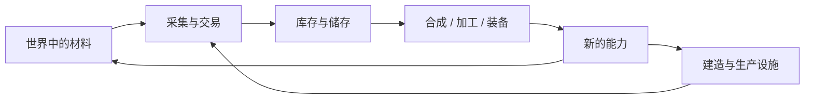

挖下一棵树以后，木头不会只留在原地作为一段“采集动画”。它会变成可以捡起、带走、堆叠、合成、存进箱子，最后又重新回到世界里的东西。

这一步很关键。上一章讨论的是玩家为什么会自然产生“我接下来要做什么”；这一章要继续问：**当玩家决定去做一件事以后，世界里的材料怎样变成真正可以支配的资源？**

Minecraft 的很多成长都发生在这条链上：

> **世界中的材料 → 进入库存 → 被合成或加工 → 变成新的工具、物品和设施 → 再反过来改变世界**

它不是唯一的成长方式，但确实是 Survival 最稳定的一条主线。

## 材料如何变成能力

### 物品把世界变成可以携带的资源

Minecraft 里很多方块和材料都可以离开原来的位置，进入玩家手中。木头从树上下来以后，可以变成木板、木棍、工作台、箱子和工具；铁矿最终可以变成铁锭，再变成镐、桶、剪刀或铁轨。材料不只属于“发现它的地点”，还可以被带到别处重新组合。

这让采集和建造直接连在一起。玩家不是在地图上获得一个抽象的“木材 +10”，而是把具体材料装进有限的格子里。背包满了以后，就必须决定哪些东西值得带走、哪些留在箱子里、哪些干脆扔掉。

这种有限性非常朴素，却会不断影响行动。一次短途采矿时，库存可能不是问题；走得足够远以后，它会直接决定你还能带多少矿石、食物、木材和战利品。一个原本只是“去看看那边有什么”的旅行，也会因为背包逐渐塞满而开始出现返程压力。

所以 Inventory 不只是 UI。它也是资源从世界进入玩家控制范围时，第一层很具体的边界。

### 合成把“拥有材料”变成“拥有能力”

收集材料本身还不是最终目的。玩家真正关心的通常是：

> 我拿这些东西能做什么？

这就是合成系统最直接的职责。

官方的 Minecraft 合成指南把这件事讲得很简单：玩家需要配方和材料，早期可以直接在背包里的小型合成格操作，更复杂的配方则需要工作台。配方书又会把已经可用的配方组织出来，减少纯记忆负担。[^crafting]

从设计上看，合成最重要的不是“九宫格很有仪式感”，而是它建立了一张**资源转换关系**。木头可以变成木板，木板和木棍可以变成工具；矿石经过熔炼变成金属，再进入装备、桶、剪刀、轨道或其他系统。玩家想得到某种能力，就需要追溯它依赖哪些材料和加工步骤。

这正好解释了上一章里那种“目标会自己长出下一层”的现象。想去深矿区，不一定有一条任务写着“制造铁镐”；但如果某些资源需要更合适的工具，玩家自然会开始寻找材料、制作工具，再继续向下。

官方关于 Pickaxe 的介绍也直接体现了这种层级：木镐让玩家更容易取得石头，石镐进一步进入铁资源，铁镐又能获取更高层材料；工具等级同时影响挖掘能力、效率和耐久。[^pickaxe]

不过这里不需要把这条顺序神化成某种完美 progression。真正值得注意的是：**很多能力不是永久写进角色，而是由当前拥有和携带的物品提供。**

你拿着更好的镐，可以更快地处理某些方块；把镐交给另一个玩家，他立刻也获得这部分能力。装备、工具和消耗品因此既是成长，也是财产。

这和角色等级制并不矛盾。很多 RPG 同样会把能力放在装备里，很多 Minecraft Mod 也会加入技能、职业或属性成长。Minecraft 原版只是把相当大一部分发展过程放在了**物品、设施和世界本身**上。

### 为什么还保留合成格

早期 Minecraft 的合成很容易给老玩家留下“把形状背下来”的印象：镐是什么形状，剑是什么形状，工作台怎么摆。但现代版本已经有 Recipe Book，可以搜索配方，并在满足条件时帮助玩家把材料放进合成格。[^crafting]

所以真正值得问的不是“配方还有没有价值”。任何资源转换系统都需要某种规则告诉玩家“这些材料能变成什么”。更具体的问题是：

> **既然配方已经可以搜索，甚至可以自动填充，为什么 Minecraft 还保留 2×2 / 3×3 的合成格，而不是直接变成一个“选中配方 → 扣除材料”的列表？**

这里也要先区分两件事。Minecraft 既有要求材料位置关系的 **shaped recipe**，也有只要求材料组合、不要求具体位置的 **shapeless recipe**；所以“九宫格”并不等于“所有配方都靠形状记忆”。

合成格今天更像是配方系统的一个**操作层**。对熟悉配方的玩家，它允许直接摆放；对不想记忆的玩家，Recipe Book 又可以承担检索和填充。两种方式最后落到同一个工作区，而不是拆成两套完全不同的生产系统。

形状配方仍然保留了一些可读性：工具、容器等物品常能从摆放关系里看出一点结构；但这种价值不该被夸大。随着配方越来越多，搜索与自动填充显然比“把几百种形状全部背下来”更重要。

真正没有消失的是**资源关系和资源选择**。同一批铁，可以做镐，也可以做桶、盾、剪刀、铁轨或其他设施。资源不够时，玩家面对的不是“这道题答案是什么”，而是：

> **我现在更需要哪种能力？**

因此，Recipe Book 降低的是记忆和操作成本，不会消除“材料应该花到哪里”的决策。至于合成格这种空间交互是否仍然值得保留，则更像一个历史、可读性和操作习惯共同形成的问题，而不是合成系统成立的必要条件。

### 工具让同一个世界出现不同的处理方式

工具经常被描述成“更快地挖东西”，但这只是其中一层。不同工具会改变玩家怎样面对同一片环境。

镐让矿物和石质结构更容易处理，斧改变木材获取效率，铲处理土、沙等材料，剪刀、桶、钓竿等又打开完全不同的资源操作。某些资源的有效获取甚至依赖正确工具或特殊附魔。[^crafting]

这让工具不像传统动作游戏里的“新技能键”，更像是：

> **对已有世界提供新的处理方式。**

而且工具不是永久能力。它会消耗耐久，可以丢失，可以修理，可以交易，也可以被别人捡走。附魔进一步改变工具的行为：例如 Unbreaking 延长使用寿命，Mending 可以利用经验修复装备，Silk Touch 会改变一部分方块被采集后的结果。[^enchantments]

Netherite 的设计也很能说明“成长写在物品上”的特点。Mojang 在介绍 Netherite 时明确提到，他们不希望新材料简单让 Diamond 失去价值，因此选择让 Netherite 作为对现有 Diamond 装备的升级；升级后原本的耐久、附魔和自定义名称等信息可以保留。[^netherite]

这类设计的重点并不是“Minecraft 反对角色成长”，而是：

> **已经投入在某件物品上的价值可以继续沿着物品本身积累。**

工具会逐渐从一次性用品变成长期资产。

## 库存如何限制与扩展

### 库存为什么有限

如果所有东西都可以无限携带，资源管理会简单很多。但那也会让很多现在很自然的行为失去理由：玩家不需要箱子，不需要仓库，不需要整理，不需要考虑远征准备，也很少需要为了运送材料修建交通设施。

有限库存制造了一种非常具体的压力：

> **世界里的东西比你一次能带走的多。**

这种压力并不总是有趣。Minecraft 长期存在一个很现实的问题：随着方块、植物、装饰物和战利品越来越多，玩家经常不是“没有容量”，而是被大量不同种类、每种只有几个的物品占满格子。

Bundle 就是对这个问题的一次直接回应。官方在 Bundles of Bravery 更新中把 Bundle 描述成一种可以在同一格里混装多种物品的容器，总容量仍然大致相当于一个普通 stack；开发者还明确提到，他们希望 Bundle 足够早期、足够容易制作，让玩家在刚开始探索时就能用它处理零碎物品。[^bundle]

这个设计很有意思，因为它没有简单把玩家背包扩大十倍。它主要缓解的是**物品种类碎片化**：

> 我有很多不同的小东西，但每一种都不够一整组。

也就是说，官方并没有完全删除库存压力，而是在重新调整哪一种压力值得保留。

### 从背包到箱子：储存也是一种进度

玩家很快就会发现，个人库存解决不了长期积累，于是箱子出现了。

它看上去只是一个容器，但会改变玩家和空间的关系：材料第一次不必跟着角色走，可以稳定地留在某个地点。只要储存开始集中，一个“家”就不只是睡觉的地方，也开始变成资源中心。

接下来会自然出现更复杂的需求：哪个箱子放矿物，哪个箱子放食物，建筑材料放在哪里，远征回来以后怎么快速卸货，大型工程需要怎样准备几箱材料。后来这些问题甚至会继续长成仓库、分类系统和自动物流。

所以储存不是单纯增加容量。它把成长从：

> **我身上有什么**

扩展成：

> **我已经在这个世界里建立了什么资源基础。**

这也是 Minecraft 和许多纯角色养成游戏差异很明显的地方之一。一个已经住了几百小时的世界，它的“强度”往往不只体现在玩家身上的装备，还体现在基地、农场、仓库、交通和大量备用资源里。

### Shulker Box 改变的是“家和远方”的边界

Shulker Box 是很晚才出现的储存工具，但它非常适合观察库存设计怎样影响游戏阶段。

普通箱子把资源固定在一个地点；Shulker Box 则允许容器连同里面的物品一起被搬走。官方介绍里也把它直接作为储存选择来介绍。[^shulker]

这相当于把一部分“基地仓库”装进了玩家的移动能力里。大型建筑需要成箱材料时，远征需要带备用装备时，Shulker Box 会显著减少来回搬运的次数。它并没有让库存真正无限——玩家仍然只有有限格子，需要管理多个盒子——但它改变了后期游戏对距离的感受。

早期更像是在问：

> 我要考虑这趟到底能带多少东西回来。

后期则逐渐变成：

> 我要带几只盒子、每只装什么，以及回去以后怎样整理。

压力没有消失，只是层级改变了。这和 Elytra、Ender Chest 等后期能力类似：它们不会简单删除空间和运输，而是让一个发展成熟的世界拥有更高效率的物流方式。

### 库存压力什么时候会变成纯粹的麻烦

有限库存能制造选择，但不意味着“越难整理越好”。

当物品种类不断增加，库存管理很容易从：

> 我应该带什么？

退化成：

> 我只是没有足够的格子装这些零碎东西。

这两种体验并不一样。前者是选择；后者往往只是整理成本。

Bundle 的出现，本身就说明 Mojang 也在不断调整这条边界。官方开发说明里明确谈到它要解决早期探索时不同物品无法堆在同一格造成的浪费，同时又刻意没有把 Bundle 做成一个巨大的移动箱子。[^bundle]

Shulker Box 则把大量搬运能力放到更后期。这形成了一条很合理、但并不完美的梯度：

> **早期有限携带 → 基地储存 → Bundle 整理零碎物 → 后期移动储存**

它既保留了一些物流问题，又允许玩家随着世界发展逐渐减少重复劳动。

这里没有必要得出“Minecraft 的库存设计就是最佳答案”。恰恰相反，Inventory 是 Minecraft 最容易随着内容增长而积累摩擦的系统之一。真正值得保留的问题是：

> **有限携带究竟应该制造什么选择？又有哪些整理劳动已经不再服务于玩法？**

这个问题对任何内容不断增长的沙盒都很重要。

## 资源怎样进入长期循环

### 稀缺资源和可再生资源会导向不同的行为

库存只解决“怎样保存”，还没有回答另一个更重要的问题：

> **资源会不会用完？**

Minecraft 里的材料并不是同一种经济。有些东西主要依赖探索和开采；另一些可以通过种植、繁殖、刷怪、交易或自动化反复获得。

胡萝卜就是最简单的例子。官方介绍里直接展示了它怎样从少量作物通过种植不断扩大产量，同时又可以进入繁殖、食物、交易和其他配方。[^carrot]

这类资源一旦稳定下来，玩法会从“到处寻找”慢慢转向“建立生产”。树木、农作物、动物和许多掉落物都可以进入类似循环。于是长期 Survival 中很常见的一件事，就是玩家开始把原本偶然获得的资源改造成**稳定供应**。

这也是自动农场为什么会自然出现的前提之一。如果一种资源每次都只能靠随机探索获得，玩家只能不断外出；如果它可以被再生产，就值得为它修建农场、运输和储存设施。

Villager Trading 又在这个循环上增加了一层交换。Emerald 本身就被官方描述成 Minecraft 村民交易中的交换媒介；玩家可以用农作物、材料或其他商品换取 Emerald，再换取工具、装备、食物和其他资源。[^emerald]

这让“资源从哪里来”不再只有采矿和采集一种答案。同一个目标可能有很多路径：自己挖、自己种、自己合成、找结构、打怪，或者和村民交换。

这正是长期世界越来越像一张经济网络，而不只是资源点清单的地方。

### 当资源循环稳定以后，玩家真正积累的是什么

玩到后期以后，一个玩家的“实力”很难只用装备栏解释。一把顶级镐当然重要，但如果背后没有经验来源、修理方式、备用装备、食物、交通、仓库和材料供应，它仍然只是单件装备。

反过来，一个长期经营的基地即使玩家身上只穿普通装备，也可能拥有巨大的生产能力。

所以 Minecraft 的成长更适合被看成分布在几个位置：

| 成长放在哪里 | 例子 |
| --- | --- |
| **玩家携带物** | 工具、武器、装备、食物、药水 |
| **个人储存** | 背包、Bundle、Ender Chest |
| **基地资源** | 箱子、Shulker Box、仓库、备用装备 |
| **生产设施** | 农田、牧场、交易所、自动农场 |
| **世界基础设施** | 矿道、道路、铁路、传送网络 |

这几个层级会不断互相转化。玩家用工具取得材料，材料扩建基地，基地生产更多资源，更多资源又支持更远的探索和更大的工程。

这不是一条必须照着走的流程。它只是说明，Minecraft 的很多“成长”没有集中在一个角色面板里，而是分散在**物品、库存、建筑和资源网络**之间。

## 这一章留下什么

这一章可以留下几件相对具体的判断：

- **物品让世界中的材料进入玩家的控制范围，并把采集、合成、建造和交易连接起来。**
- **合成的核心不只是记住配方，而是建立资源之间的转换关系；Recipe Book 可以降低记忆成本，却不会消除资源选择。**
- **Minecraft 的很多能力附着在工具和装备上，因此可以丢失、交易、修理、升级和转交，但这并不意味着角色成长在所有沙盒里都不成立。**
- **有限库存会制造携带和远征取舍，但物品种类过多时，也可能退化成单纯的整理负担。**
- **箱子、Bundle、Shulker Box 等容器不是单纯增加容量，它们分别改变了基地储存、零碎物管理和移动物流。**
- **可再生资源、交易和自动化会把长期玩法从“找到资源”逐渐推向“建立稳定供应”。**
- **玩家真正积累的能力往往分散在随身物品、储存、生产设施和整个世界的基础设施里。**

下一章[《世界生成与探索》](/design/worldgen-exploration)会从资源之外继续看另一个问题：一个由算法不断生成的世界，为什么仍然能让玩家觉得“前面值得去看看”？

[^crafting]: Mojang Studios，[《How to craft》](https://www.minecraft.net/en-us/article/how-craft)，2023 年。官方指南说明 Inventory 与 Crafting Table 中的合成、Recipe Book 搜索和配方材料关系；本文用它说明现代 Minecraft 的合成已经同时包含手动网格与配方检索。

[^pickaxe]: Mojang Studios，[《Taking Inventory: Pickaxe》](https://www.minecraft.net/ru-ru/article/taking-inventory-pickaxe)，2018 年。官方介绍了木、石、铁、钻石等镐的资源层级，以及不同材质在耐久和挖掘效率上的变化。

[^enchantments]: Minecraft Help，[《All Enchantments in Minecraft》](https://help.minecraft.net/hc/en-us/articles/360058730912)，2026 年访问。该页面列出 Mending、Unbreaking、Silk Touch 等附魔对工具与装备行为的影响。

[^netherite]: Mojang Studios，[《Taking Inventory: Netherite Ingot》](https://www.minecraft.net/en-us/article/taking-inventory--netherite-ingot)，2020 年。Jens Bergensten 在官方文章中解释，Netherite 被设计成对 Diamond 装备的升级，而不是让 Diamond 直接失去价值；升级会保留原物品的耐久、附魔和自定义名称等信息。

[^bundle]: Mojang Studios / Java Team，[《Minecraft: Java Edition 1.21.2 - Bundles of Bravery》](https://feedback.minecraft.net/hc/en-us/articles/31261174284557-Minecraft-Java-Edition-1-21-2-Bundles-of-Bravery) 与 [24w33a Bundle 开发说明](https://feedback.minecraft.net/hc/en-us/articles/29296154589581-Minecraft-Java-Edition-Snapshot-24w33a)，2024 年。Bundle 可以在一个普通 stack 的容量内混装多种物品；开发者明确表示希望它足够早期、易获得，用于探索时整理零碎物品。

[^shulker]: Mojang Studios，[《Block of the Week: Shulker Box》](https://www.minecraft.net/en-us/article/block-week--shulker-box)，2020 年。官方介绍 Shulker Box 作为可以保存内部物品并整体搬运的储存容器。

[^carrot]: Mojang Studios，[《Taking Inventory: Carrot》](https://www.minecraft.net/en-us/article/taking-inventory--carrot)，2020 年。官方展示了胡萝卜如何通过种植扩大产量，并进入食物、繁殖、合成和村民交易等多种用途。

[^emerald]: Mojang Studios，[《Taking Inventory: Emerald》](https://www.minecraft.net/en-us/article/taking-inventory--emerald)，2019 年。官方把 Emerald 描述为村民与 Wandering Trader 交易使用的交换媒介，并介绍通过交易获取 Emerald 的主要方式。

[executed on device: DESKTOP-9K2FEID (2ac0db25-d0d8-41a6-9056-faf06c5230c3)]