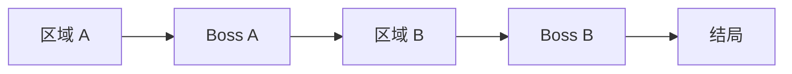
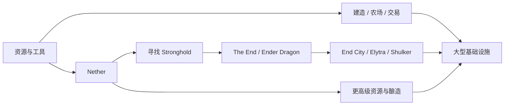

第一次击败 Ender Dragon 时，游戏确实会给出一种很明确的“结束感”。

经验球铺满地面，中央出现返回 Overworld 的出口，跳进去以后会看到 End Poem 和 credits。Minecraft 官方自己也会把这一刻称作游戏的官方“End”，甚至直接说如果想“officially complete”游戏，就需要前往 The End。[^ender-dragon][^end-portal]

所以“通关 Minecraft”并不是一句空话。

真正特别的地方在后面。

字幕结束以后，原来的世界仍然在那里。基地没有消失，农场没有重置，Nether 里的路还在，已经挖出的矿洞也不会因为你完成了一条目标线而失去意义。更重要的是，击败龙以后反而会打开 End Gateway，通往外岛、End City、Shulker Shell 和 Elytra。[^ender-dragon][^end-city]

于是 Minecraft 同时拥有两件看起来有点矛盾的东西：

> **它可以被通关，却不会因为通关而结束。**

这一章要讨论的，就是这两件事怎样同时成立。

## 玩家怎样感觉自己在前进

Minecraft 没有传统 RPG 那样统一的角色等级，也没有一条必须按顺序完成的主线，但这并不等于它没有 progression。

玩家仍然会不断获得新的材料、工具、交通方式、维度入口和基础设施。区别只是这些成长没有全部压进一根经验条里。

### 从“能不能做”到“做起来有多容易”

早期 progression 很容易被看见：木制工具、石制工具、铁、Diamond，以及后来的 Netherite，会改变玩家能高效处理哪些材料、装备有多耐用、战斗和采集成本有多高。

但 Minecraft 的成长并不只发生在工具等级上。

一张床会改变夜晚和重生；一个稳定食物来源会减少反复觅食；箱子和仓库扩大资源容量；村民交易提供另一条获取装备与附魔的路径；交通设施又会逐渐压低长距离移动的成本。

所以成长更像从：

> **我现在能不能做到这件事？**

逐渐转成：

> **我已经把这件事做得多稳定、多便宜、多方便？**

这和前几章自然连在一起。物品章讨论能力怎样附着在工具、储存和资源网络上；世界生成章讨论距离怎样让探索产生成本；到了 progression，这些成本会被玩家一点点改写。

### 同一个目标常常有不止一条路径

传统线性 progression 很容易画成：

Minecraft 当然也存在依赖：没有进入 Nether，就很难按正常流程制作 Eyes of Ender；没有找到 Stronghold，就进不了 The End。

但在大量中间阶段里，玩家仍然可以换路。

想获得更好装备，可以自己采矿、附魔、交易、探索结构；想提高移动效率，可以先修道路、用马、坐船、做 Nether 交通，后来再取得 Elytra。某些路线更高效，却未必是所有玩家都必须走的唯一顺序。

因此比较适合 Minecraft 的不是一根严格的直线，而是带有几个明显门槛的网络：

图里有顺序，但也有旁路。玩家可以很早打龙，也可以在 Overworld 住很久以后再去；可以几乎不碰红石，也可以在进 End 之前已经修出复杂工厂。

这也是为什么“玩到哪了”在 Minecraft 里经常不容易只用一个等级回答。

## 维度为什么不只是更高级的地图

Nether 和 The End 都会进入 progression，但把它们理解成“第二关”和“最后一关”会漏掉很多东西。

它们更像是在同一套基本操作之上，换掉一部分环境规则、资源分布和旅行条件。

### Nether 同时是险境、资源区和交通层

第一次进 Nether 时，很多熟悉经验会失效。

普通床不能像在 Overworld 那样提供睡眠与重生，Respawn Anchor 才能在 Nether 设置重生点；官方在 Nether Update 的介绍里也特意提醒玩家不要随便使用普通床。[^nether-update][^spawn-death]

Nether 还拥有完全不同的地形、资源、生物和结构。1.16 Nether Update 加入 Crimson Forest、Warped Forest、Basalt Deltas、Piglin、Hoglin、Bastion Remnant、Ancient Debris、Respawn Anchor 等内容，把原本相对单一的维度扩展成了可以长期探索和居住的空间。[^nether-update]

更特别的是，它还会改变 Overworld 的交通。

Nether Portal 的坐标换算使玩家能够把 Nether 作为远距离旅行网络；于是“去 Nether”不再只是为了取 Blaze Rod 或 Ancient Debris，也可能是为了修交通。

这说明一个维度可以同时承担多个职责：

- 给 progression 提供新材料和新条件；
- 改变已有资源的获取方式；
- 提供新的探索空间；
- 重新定义不同地点之间的距离。

如果它只是“数值更高的第二张地图”，这些关系就会弱很多。

### The End 既有高潮，也有后续空间

The End 的结构更有意思，因为它确实承担了“结尾”。

玩家通过 Stronghold 进入中央岛，面对 Ender Dragon。击败龙后出现返回 Overworld 的出口，同时生成 End Gateway，允许玩家前往外岛。[^ender-dragon]

这一步把“结局”和“解锁”放在了同一个事件里。

End City 只会出现在外岛，其中又有 Shulker、Shulker Shell，以及只在 End Ship 中获得的 Elytra。Minecraft 官方在 2025 年的 End City 介绍里甚至直接用一句很直白的话开场：打完龙、看完 credits 并不意味着 Minecraft 就结束了；外岛还有大量值得寻找的东西。[^end-city]

所以击败龙并不是“所有内容都已经消费完”的信号。

它更像一个非常清晰的阶段节点：

> **你完成了一条官方目标线，同时获得了新的探索和移动能力。**

这比简单说“The End 不是最后一关”更准确。它当然可以被当作最后一关来玩；只是 Minecraft 没有强迫整个存档也跟着结束。

## 官方目标怎样提供方向

除了材料和维度，Minecraft 也确实存在明确的目标提示。

Java Edition 的 Advancements 会逐步引导新玩家，并提供探索、Nether、End、冒险和农业等不同挑战；它们按世界保存，还可以通过数据包自定义。[^advancements]

Bedrock Edition 则保留独立的 Achievement 体系。两者不应该直接当成同一个系统：Java Advancements 更接近世界内的进度树，而 Bedrock Achievements 更偏账号 / 平台成就，并且启用某些作弊设置会影响成就解锁。[^bedrock-achievements]

### 提示目标，不等于锁住路线

Advancements 的重要之处，不只是“告诉玩家还有什么没做”。

它们也展示了一种比较轻的目标设计：系统可以把方向摆在玩家面前，却不要求玩家把整个世界按这棵树依次解锁。

你完全可以不完成某个 Advancement，继续建造、探索或进行多人游戏；而对于想收集的人，这套系统又能把一些原本松散的行为重新组织成挑战。

所以官方目标和玩家目标并不是二选一。

比较准确的关系是：

> **官方提供一部分可见的里程碑，玩家决定这些里程碑在自己的世界里有多重要。**

有人把击败龙当成第一次存档的终点，有人把 All Advancements 当成长期挑战，也有人几乎不看 Advancements 页面。

同一套系统因此可以既是新手指引，也是 completionist 的清单。

## “通关”为什么既真实又不封存世界

这里最容易走向两个极端。

一种说法是：“Minecraft 根本没有通关。”

这不准确。官方明确把 Ender Dragon、credits 和 The End 当成一种完成节点；社区的 Any% speedrun 也把这条路径变成了非常成熟的竞技类别。Speedrun.com 到现在仍然把 Any%、Any% Glitchless、All Advancements 等作为 Minecraft: Java Edition 的主要分类。[^speedrun]

另一种说法是：“打完龙以后，游戏就只剩自由建造。”

这也不准确，因为很多重要能力和内容恰恰在之后才更容易展开。

### 一个终点可以只结束一条目标线

Ender Dragon 很适合说明这一点。

打败它以后，玩家获得大量经验、Dragon Egg、返回 Overworld 的出口和 End Gateway；龙还可以通过 End Crystals 再次召唤。[^ender-dragon]

这意味着这场战斗既能成为高潮，也没有把它设计成不可回头的一次性世界结算。

对于速通玩家，credits 就可以是清晰终点。

对于普通 Survival 玩家，它可能只是一个阶段完成。

对于服务器，它甚至可能只是某次集体活动。

这些解释可以同时成立，因为“什么算完成”不必只有一个尺度。

### 结束一场 run，不等于结束一个 world

这是 Minecraft 和很多线性游戏最明显的区别之一。

线性游戏的一次 run 和一个存档往往高度重合：最后 Boss 倒下，主要内容也随之结束。

Minecraft 里则可以把它们分开：

| 尺度 | 可能的“终点” |
| --- | --- |
| **一次速通 run** | credits / 对应分类的计时条件 |
| **一条官方目标线** | 击败 Ender Dragon |
| **收集挑战** | All Advancements / 自定收集目标 |
| **一次服务器赛季** | 赛季活动、重置或社区约定的结束日期 |
| **一个长期世界** | 没有系统强制给出的统一终点 |

于是“结束”从一个单一按钮，变成了可以发生在不同层次上的事情。

这对沙盒很重要，因为玩家不用为了拥有高潮，就必须接受整个世界被判定为“已经没用了”。

## 游戏后期真正发生了什么

打完龙以后，Minecraft 并没有突然进入一个明确叫做 Endgame 的菜单。

但玩家的活动确实会发生变化。

### 后期能力经常降低的是旧成本

Elytra 是最典型的例子。

它只能在 End City 的 End Ship 中获得。单独使用时是滑翔装备，配合烟花以后会极大改变长距离和垂直移动方式。[^end-city][^elytra]

Shulker Box 同样来自 End 的后续探索，它允许容器连同内部物品一起搬运，于是大型建造和长途运输的成本被显著降低。[^end-city]

Beacon 则来自 Wither 掉落的 Nether Star，需要玩家进一步投入大量矿物搭建金字塔，最后为一定范围提供增益。Mojang 对 Beacon 的介绍也直接把它称为能显著增强基地范围内玩家能力的建筑。[^beacon]

这几种奖励有一个共同特点：

> **它们通常不是打开一套全新的主游戏，而是在已经熟悉的世界里降低旧成本、放大旧能力。**

Elytra 让旅行更快，Shulker Box 让搬运更轻，Beacon 让某些基地活动更高效。

于是后期成长越来越像在提高整个世界的运营效率。

### 基础设施会逐渐接过 progression

到了长期世界里，“下一件升级”不一定还是官方物品。

它可能是一条 Nether 交通干线，一个更大的仓库，一套自动分类系统，一片已经被照明和规划好的城区，也可能只是把几个旧基地真正连起来。

这些项目没有统一顺序，也没有官方要求。

但它们会产生很真实的 progression：

- 原本几分钟的路变成几十秒；
- 原本需要反复采集的材料变成稳定供应；
- 原本散乱的箱子变成可维护的物流；
- 原本危险的区域变成长期可用的空间。

这也是为什么 Minecraft 的游戏后期很难只靠“新增更强装备”描述。

玩家正在升级的，越来越多是**整个存档的能力**。

### 后期也可能来自玩家自己定义的结束方式

开放式后期不代表所有人都想无限玩下去。

有些玩家会在打完龙以后停档；有些人会完成一座城市、一张地图、一个 All Advancements 挑战以后离开；多人服务器还可能人为设定赛季，在某个时间点举行活动、归档或重置。

这些终点同样真实。

区别只是它们不必全部由游戏本体预先规定。

所以“长期世界”最有意思的地方不是拒绝结局，而是**允许玩家自己选择什么事情足以构成一个结局。**

## Progression 最难平衡的几组关系

一款沙盒如果完全没有 progression，很容易让玩家缺少方向；但 progression 太强，又会把所有玩法压成“赶紧去下一个阶段”。Minecraft 长期存在的张力，大致可以放在几组关系里：

| 关系 | 一边过头 | 另一边过头 |
| --- | --- | --- |
| **方向 vs 自由** | 玩家不知道下一步能做什么 | 所有活动都变成主线前置 |
| **新能力 vs 旧内容** | 升级没有明显价值 | 新装备让旧世界和旧工具全部失效 |
| **终点 vs 持续世界** | 缺少阶段高潮 | 通关以后存档失去继续存在的理由 |
| **稀有奖励 vs 必刷路线** | 后期缺少期待 | 所有人都被迫走同一条最优路径 |
| **降低成本 vs 删除问题** | 后期仍充满重复劳动 | 新能力直接让距离、物流和风险失去意义 |

Netherite 为什么设计成升级 Diamond 而不是完全替代它，Bundle 为什么没有直接变成无限背包，Elytra 为什么需要先到 End 外岛，这些都可以放进这组张力里理解。

它们不一定是完美答案，但都在尝试让“变强”与“原来的世界仍然值得继续使用”同时成立。

## 这一章留下什么

这一章可以留下几件相对具体的判断：

- **Minecraft 确实存在 progression：材料、工具、维度、官方目标和基础设施都会改变玩家能做什么，以及做这些事的成本。**
- **Nether 与 The End 不只是难度更高的地图，它们通过不同环境规则、资源与交通关系改变原有玩法。**
- **击败 Ender Dragon 可以合理地被称为“通关”，但它结束的是一条官方目标线，而不是强制结束整个世界。**
- **Java Advancements 与 Bedrock Achievements 都能提供目标，但它们的存储方式和产品职责不同，不能简单合写。**
- **Elytra、Shulker Box、Beacon 等后期能力往往是在降低旅行、搬运和基地运营的旧成本，而不是把玩家带进一套完全不同的游戏。**
- **长期 Survival 的 progression 会越来越多地转移到基础设施和整个存档上，而不只存在于角色装备栏。**
- **沙盒不需要拒绝终点；更关键的是允许“一个目标结束”与“世界继续存在”同时发生。**

下一章[《建造与空间》](/design/building-space)会进入卷二第三部。前六章一直在讨论玩家如何生存、获得资源、探索、面对生物并不断发展；接下来要看的是另一件更核心的事：这些资源和能力最后为什么会变成房屋、道路、基地和城市，以及一块随机生成的土地怎样逐渐变成“自己的地方”。

[^ender-dragon]: Mojang Studios，Duncan Geere，《Ender Dragon》，Minecraft.net，2025 年。官方说明击败 Ender Dragon 后会获得经验、Dragon Egg、End Gateway 与返回 Overworld 的出口；进入出口会看到 End Poem 与 credits，文章把它称为官方的“End”，同时明确说明世界仍可继续游玩，龙也可再次召唤。https://www.minecraft.net/pt-pt/article/ender-dragon

[^end-portal]: Mojang Studios，Duncan Geere，《Block of the Week: End Portal Frame》，Minecraft.net，2021-12-02。官方说明前往 The End 并击败相应目标是“officially complete” Minecraft 的路径之一。https://www.minecraft.net/en-us/article/block-week--end-portal-frame

[^end-city]: Mojang Studios，Duncan Geere，《Building Blocks: End City》，Minecraft.net，2025-07-18。官方说明 End City 位于 End 外岛，End Ship 是 Elytra 的唯一获取地点，并直接指出击败龙和看完 credits 以后仍有大量后续探索内容。https://www.minecraft.net/en-us/article/end-city

[^nether-update]: Mojang Studios，Adrian Östergård，《Nether Update out today on Java》，Minecraft.net，2020-06-23。发布说明列出 Nether Update 新增的多个群系、Piglin、Hoglin、Netherite、Bastion Remnant、Respawn Anchor 等，并提醒玩家普通床在 Nether 中并不安全。https://www.minecraft.net/en-us/article/nether-update-java

[^spawn-death]: Mojang Studios，《Spawning and dying in Minecraft》，Minecraft.net，2023 年。官方说明 Overworld 使用床设置重生点，Nether 则使用需要 Glowstone 充能的 Respawn Anchor。https://www.minecraft.net/en-us/article/spawning-and-dying

[^advancements]: Minecraft Wiki 编者，《Advancement》，2026 年访问。页面说明 Advancements 为 Java Edition 独有，用于逐步引导新玩家并提供挑战，按世界保存，也可以通过数据包与命令扩展。https://minecraft.wiki/w/Advancements

[^bedrock-achievements]: Minecraft Wiki 编者，《Tutorial: Menu screen/Bedrock Edition》与《Tutorial: Achievement guide》，2026 年访问。Bedrock Achievements 与 Java Advancements 分属不同体系，启用 Cheats 等设置会使该世界无法继续解锁成就。https://minecraft.wiki/w/Tutorial:Menu_screen/Bedrock_Edition

[^speedrun]: Speedrun.com，《Minecraft: Java Edition》排行榜，2026 年 10 月访问。主排行榜长期包含 Any%、Any% Glitchless、All Advancements 等不同完成条件，说明社区会把不同“终点”组织成独立竞赛类别。https://www.speedrun.com/mc

[^elytra]: Mojang Studios，Duncan Geere，《Taking Inventory: Elytra》，Minecraft.net，2019-12-14。官方介绍 Elytra 在 Survival 中提供滑翔能力，并说明其基本飞行控制。https://www.minecraft.net/de-de/article/taking-inventory--elytra

[^beacon]: Mojang Studios，Duncan Geere，《Taking Inventory: Corrupted Beacon》，Minecraft.net，2026-02-20。文章在介绍 Minecraft Dungeons 的 Corrupted Beacon 前概括原版 Beacon：由 Glass、Obsidian 与 Nether Star 制作，配合金字塔可为一定范围内玩家提供显著增益。https://www.minecraft.net/zh-hans/article/-corrupted-beacon