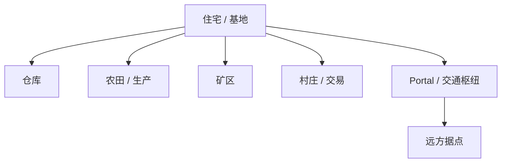

很多 Minecraft 世界里的第一座建筑都谈不上“建筑”。

它可能只是山壁上挖出来的一个洞，门口插两支火把；也可能是一间方方正正的木屋，箱子、熔炉和床全部挤在里面。几天以后，玩家开始往旁边扩仓库，屋后出现农田，矿洞有了固定入口，门前多出一条路。再过一段时间，原本那个临时庇护所已经被包进更大的基地里，甚至只剩下一面舍不得拆的旧墙。

这类变化很难只用“盖得越来越漂亮”解释。

建筑确实可以是一种视觉表达，但在 Minecraft 里，它还会同时承担储存、生产、交通、安全、展示和记忆。玩家不是先设计一张完整蓝图，再把成品放进世界；很多空间是在长期使用中一点点长出来的。

所以建造真正有意思的问题并不是“为什么玩家喜欢盖房子”，而是：

> **为什么如此粗粒度、逐块放置的建造方式，仍然能产生强烈的空间表达？又为什么一块随机生成的土地，会随着建造和使用逐渐变成‘自己的地方’？**

## 从庇护所到基地

### 建造最初常常是在解决问题

在 Survival 里，第一座建筑经常不是从审美开始，而是从需求开始。

夜晚需要一个更安全的位置，物品需要箱子，熔炉需要地方放，床需要一个不会半夜被打断的角落。官方的新手材料甚至直接把 shelter 当成第一晚最基本的准备之一；而官方对 Survival / Creative 的介绍也很清楚：Survival 中的建筑材料需要玩家自己取得，Creative 则直接提供无限资源。[^survival-creative]

这些需求会自然给空间分配职责。

一间只有床和箱子的屋子，和后来拥有仓库、农田、附魔区、交易区、矿井入口的基地，区别不只是面积。玩家开始回答越来越多空间问题：

- 什么东西应该离门近一点？
- 哪些材料需要集中储存？
- 哪条路每天都会走？
- 哪些危险应该被挡在外面？
- 哪些机器会制造噪音、怪物或拥堵？

建筑因此从“有一个壳”逐渐变成**组织日常行为的方式**。

### 基地会随着使用不断改写

Minecraft 的建筑很少需要一次定稿。

仓库不够了可以向地下挖，农田挡路了可以搬走，新的版本加入一种方块以后可以重新装修；甚至一开始完全没有规划的基地，也能靠不断扩建慢慢形成自己的结构。

这种可修改性很重要，因为它允许建筑和玩家的生活一起变化。

传统关卡里的房间通常在玩家进入以前就已经完成，玩家只是使用它；Minecraft 里的房间则可能在使用以后继续被改。功能不是建筑师提前全部写好的，很多功能是住进去以后才长出来的。

这条路径当然不是所有玩家都会经历，但它说明了 Minecraft 建造一个很常见的特点：**空间往往先被使用，再被继续设计。**

## 方格为什么仍然能产生丰富的空间表达

第一章已经讨论过方格带来的可指认性和粗粒度。到了建造，这种取舍会变得更直观。

### 粗粒度迫使玩家用比例和轮廓思考

Minecraft 的完整方块很大。

如果想做一个真实尺寸的椅背、窗框、圆柱或斜屋顶，固定网格很快就会暴露限制。玩家只能用楼梯、台阶、栅栏、活板门等已有形状近似，或者干脆把整栋建筑放大，让细节有足够空间展开。

这会形成一种很特别的建造思路：

> **先处理轮廓、比例和重复，再处理细节。**

一面墙不是连续曲面，而是一串可数的格子；窗户隔几格一个，柱子每隔多少格重复，屋顶坡度怎样通过楼梯和台阶近似，都可以直接数出来。

这并不意味着方格天然比自由建模更适合建筑。更细的编辑单位当然可以做出更精确的形状，Chisels & Bits、Rising World 等系统已经证明了这一点。

但粗网格有一个很现实的好处：它把复杂建筑压缩成了大量可以重复的局部决定。玩家不需要会操作专业 3D 软件，也可以通过“这里再退一格”“每五格放一根柱子”来组织大型结构。

### 材料同时是结构，也是视觉语言

建筑方块还有另一个特点：它们不是纯粹的几何体。

木板、石砖、铜、玻璃、混凝土、羊毛、陶瓦等材料会带来颜色、纹理和文化联想。即使几何形状完全一样，换一种材料，建筑也可能从仓库变成神殿，从工业厂房变成住宅。

官方展示玩家建筑时也经常以 block palette 来描述作品。Minecraft 官方的现代住宅专题直接谈到建筑者会先考虑用哪些方块组成自己的 palette；Creative 模式下材料取得几乎没有成本，而 Survival 中同样的材料选择可能意味着数小时的采集。[^modern-house]

所以方块有两种角色同时存在：

| 角色 | 玩家关心什么 |
| --- | --- |
| **空间单位** | 这里占几格、能不能走、墙多厚、楼梯怎么接 |
| **材料单位** | 颜色、纹理、稀有度、取得成本、和周围环境是否协调 |

这也是为什么“同样是一面墙”在 Survival 和 Creative 里会有不同含义。形状相同，材料背后的成本和选择却不同。

### 重复让大尺度结构变得可完成

方格很适合重复。

一段城墙设计好以后可以继续延伸；桥墩可以按固定间隔重复；道路可以沿地形不断铺；一套立面模块可以长成整条街。

大型建筑因此并不一定要求每一格都独一无二。很多时候，规模来自一个局部模式被重复几十次、几百次。

官方关于 Mega Build 的介绍也强调，大尺度会带来和小建筑不同的问题：比例、重复、远距离轮廓会比局部细节更重要。[^mega-build]

这种可重复性后来还会和 Structure Block、WorldEdit、Axiom、Bedrock Editor 等工具连接起来，但工具本身留给下一章。这里先保留一个简单事实：**Minecraft 的方格既限制细节，也让模式很容易复制和扩张。**

## 建筑怎样把空间组织起来

一座房子当然可以被当作作品看，但 Minecraft 里的建造往往不会停在单体建筑。

### 墙、门和房间会给空间分配角色

当玩家筑起一面墙时，他不只是增加几个方块，也开始划分“里面”和“外面”。

门把两个区域连接起来，围栏决定动物应该待在哪里，仓库把物资集中到一个位置，农田规定了一片土地主要用于生产。照明、道路、楼梯、桥梁同样会告诉玩家：这里可以安全经过，那里是入口，这边是公共区域，那边是私人房间。

这些边界并不需要游戏引擎理解“厨房”或“客厅”是什么。

对引擎来说，它们仍然只是方块和实体；对玩家来说，空间已经获得了用途。

这就是建造很容易超出纯视觉装饰的地方：**玩家会主动给世界分区，并通过使用让这些分区变得真实。**

### 道路和桥梁改变的是地点之间的关系

如果房屋主要在组织一个地点，那么道路、桥梁、铁路和 Nether 通道则在组织多个地点之间的关系。

一座远处村庄原本只是地图上的另一个位置。修好一条路以后，它开始进入日常活动范围；两座基地通过铁路或 Nether 通道连接以后，距离的意义就会改变。

建筑因此也可以是一种空间压缩。

它不能真的让坐标变短，却可以降低重复旅行的摩擦，让原本彼此孤立的地点成为一个网络。

从这个角度看，Minecraft 的“建筑”其实包含很多不太像传统建筑的东西：道路、码头、隧道、矿井、路标、照明网络、桥梁，甚至只是一排火把。

它们未必适合截图，却会真正改变玩家怎样使用世界。

## Survival 与 Creative 让建造拥有不同的成本

建筑能在 Survival 和 Creative 中同时成立，是 Minecraft 很重要的一点。

官方把两种模式的区别说得很直接：Survival 要自己采集资源，还会受伤、饥饿并面对敌对生物；Creative 则拥有无限资源、飞行和快速破坏能力，可以把注意力更多放在建造本身。[^survival-creative]

但这并不意味着只有其中一种“更真实”或“更有意义”。

### Survival 会把建筑和资源历史绑在一起

Survival 里的大型工程往往带着明显的成本记录。

一面铜墙意味着铜从哪里来，一座石英建筑会把玩家带去 Nether，大面积混凝土需要染料、沙子和砂砾，大型玻璃结构又会消耗燃料和时间。材料选择因此不仅是颜色选择，也会改变玩家接下来要做的事情。

建造和采集互相推动：

> 想盖东西 → 缺材料 → 建农场 / 去探索 / 做运输 → 材料变多 → 又能盖更大的东西

所以 Survival 的建筑很容易同时成为资源系统的结果。

这也是为什么一座并不漂亮的老基地仍可能让玩家舍不得拆。它保存的不只是造型，还保存着“当时只能拿到这些材料”“这条路是手挖出来的”这样的经历。

### Creative 把成本从材料转移到选择

Creative 则取消了大量资源和生存成本。

玩家可以直接取得方块、飞到任何高度、快速拆除错误部分。Mojang 自己在比较 Creative 和 Survival 时也指出，两种模式里的 building 基本仍是同一件事，只是 Creative 一开始就能访问所有方块，而 Survival 会被材料、危险和采集时间不断打断。[^survival-creative]

资源限制被拿掉以后，问题会转向别处：

- 我到底想盖什么？
- 比例是不是对的？
- 哪种材料更合适？
- 这一面是不是太平？
- 大规模结构应该怎样重复，才不会显得单调？

也就是说，Creative 并没有把建造变成“没有成本”。它只是把主要成本从**资源取得**转向**构思、选择、迭代和时间**。

官方的 Dream House 活动很能说明这种差异：同样是在 Creative 中建住宅，不同作者会因为风格、材料、颜色、布局和想象完全做出不同结果。[^dream-house]

因此，更准确的比较不是“Survival 建造有意义、Creative 建造没意义”，而是：

| Survival 更强调 | Creative 更强调 |
| --- | --- |
| 材料取得与物流 | 快速试错与迭代 |
| 风险与施工条件 | 规模与造型自由 |
| 建筑作为长期资源投入 | 建筑作为设计与表达 |
| 与基地运营互相咬合 | 与创作工具互相咬合 |

两种模式都可能产生长期作品，只是作品背后的故事不同。

## 一个地方是怎样被“住出来”的

建筑最难只靠截图解释的一部分，是地方感。

### 地方感来自重复使用，而不只来自造型

第一次搭完一栋房子时，它只是刚完成的建筑。

真正住了一段时间以后，玩家开始形成习惯：从哪个门出去，回来先把矿石丢进哪个箱子，哪条楼梯通向附魔室，晚上习惯从哪个窗户看外面。

这些习惯并不会写进方块数据，却会改变玩家对空间的理解。

因此“家”并不等于最漂亮的建筑。

有些玩家会在大型新基地建好以后，仍然频繁回到那个布局混乱、材料杂乱的早期木屋，因为那里保存了更长时间的使用记录。

### 修改痕迹会变成世界的时间层

Minecraft 的持久性让空间能够留下历史。

旧农田可能已经不用，第一条矿道可能效率很低，曾经的城墙后来被城市包进去，一座桥旁边又出现更快的新桥。只要玩家没有主动清理，这些旧结构就会继续留在世界里。

于是同一片空间可以同时保存多个时期。

这和一张每次重新开始的竞技地图很不一样。竞技地图的主要价值通常在“现在怎样玩”；长期存档还会多一层“这里以前发生过什么”。

卷一最后讨论保存 Minecraft 时已经看到，一个世界之所以值得保存，不只是因为地形文件本身，而是因为玩家投入在其中的建筑、道路、资源和关系会长期累积。建造正是这种累积最直接的可见形式。

### 并不是所有痕迹都应该被优化掉

当玩家学会更高效的布局以后，很容易产生一种冲动：把旧基地全部重做，让道路更直、仓库更整齐、每一块空间都更合理。

有时这当然会让世界更好用。

但如果所有旧痕迹都被清理，空间也可能失去时间感。一条绕远的旧路、一间塞满杂物的老房子、被新城区吞进去的第一座农场，都可能比完美规划更能说明这个世界是怎样长出来的。

这里没有必要把“保留旧建筑”变成设计原则。

更值得注意的是：**长期沙盒里的空间价值，不只有效率和视觉质量，还可能包含历史。**

## 多人让空间变成共同作品

一旦有第二个玩家进入，建筑会再多一层含义。

房子不再只需要自己看得懂，道路也不再只服务自己的路线。公共仓库、出生点、交通枢纽、商店、广场、活动场地，都需要让别人知道怎样使用。

### 公共空间需要一种共享的可读性

单人基地可以极其随意。

玩家知道第三个箱子里为什么放的是圆石，也知道屋后那个没有标牌的洞通向哪里。多人世界则会很快暴露这些私人习惯的局限。

于是玩家会开始加路标、统一道路、划分公共区域，甚至形成大家约定俗成的建筑尺度和风格。

这时建筑不只是个人表达，也是一种交流。

一条铺好的主路是在告诉后来的人“这里经常通行”；一个中央车站是在告诉大家“这些地方已经被连起来”；出生点附近的纪念建筑则可能在告诉新玩家“这个服务器过去发生过什么”。

### 谁维护、谁改造，也会成为社会问题

共同空间一旦长期存在，就会出现维护和修改的问题。

一条道路该不该扩宽？别人留下的旧建筑能不能拆？公共仓库是谁补货？新版本加入更好的材料以后，要不要把十年前的大厅重装修？

这些问题已经开始接近多人规则和治理，所以不会在这里展开。它们会留给后面的[《多人游戏与共同世界》](/design/multiplayer-world)。

但建造章需要先看到一件事：**多人空间会把建筑从物体变成约定。**

大家之所以把某处叫作“主城”“老家”“交易区”，并不是因为游戏代码里存在这些地点类型，而是因为玩家反复使用和承认它们。

## 建造什么时候会遇到工具边界

逐块放置可以支撑很大的创作，但它并不是对所有规模都高效。

一座小屋逐块放很自然；如果要把同一段城墙复制两百米，或者把整个山体向右平移十格，继续一块一块操作就会迅速变成机械劳动。

这也是为什么 Minecraft 社区和官方长期发展出了更高层的创作工具：Structure Block、WorldEdit、Axiom、WorldPainter，以及今天的 Bedrock Editor。

Mojang 现在对 Editor 的描述非常直接：它允许创作者在 Minecraft 中批量选择、复制、移动和精确操作方块，以更快地进行大型 worldbuilding。[^creator-tools]

这不会让逐块建造突然失去价值。

它只是暴露了一个尺度问题：

> **当设计意图已经明确，重复劳动还应该占多少比例？**

Survival 可能愿意保留更多施工成本，因为取得和放置本身就是玩法的一部分；Creative 和专业创作流程则更有理由削减重复操作。

下一章会专门讨论这条边界：Creative Mode、WorldEdit、Axiom、Structure Block、WorldPainter 和 Bedrock Editor 分别解决什么问题，以及什么时候“游戏里的建造”已经开始变成“创作工具链”。

## 这一章留下什么

建造是 Minecraft 最显眼的活动之一，但它的价值不只来自“能盖很多东西”。目前比较可靠的判断有这些：

- **建造经常从解决生存问题开始，但会随着长期使用逐渐变成空间组织和表达。**
- **粗网格限制细节，却也让比例、重复和局部规则容易理解，因此大型结构可以由许多简单决定逐步完成。**
- **方块既是空间单位，也是材料单位；同一种形状会因为颜色、纹理、稀有度和取得成本产生不同意义。**
- **建筑不只组织单个房间，道路、桥梁、仓库和交通设施还会重新组织地点之间的关系。**
- **Survival 与 Creative 都能产生有意义的建造，只是前者更容易把作品和资源投入绑在一起，后者则把注意力更多转向设计、选择和迭代。**
- **一个地方之所以逐渐像“家”，往往不只因为它被建得好看，还因为它被反复使用、修改，并保留了过去的痕迹。**
- **多人世界会让建筑获得公共含义：空间开始需要共享可读性、维护和共同记忆。**
- **逐块建造在规模扩大后会遇到明显的工具边界，因此专业编辑工具不是对建造的否定，而是另一层创作需求。**

下一章[《创造模式与创作工具》](/design/creative-tools)会沿着最后这个问题继续：如果玩家不再受资源和生存成本限制，甚至开始使用批量选择、复制、笔刷和离线地形工具，Minecraft 的“建造”究竟在哪一点开始变成更专业的 worldbuilding？

[^survival-creative]: Mojang Studios，《Creative vs Survival Mode》，Minecraft.net，2022 年。官方对比两种模式时明确指出：Survival 的建造受材料取得、敌对生物和生存条件影响；Creative 则直接提供所有方块、飞行和近乎无伤害的环境。https://www.minecraft.net/en-us/article/creative-vs-survival-mode

[^modern-house]: Mojang Studios，Emily Richardson，《Modern Houses》，Minecraft.net，2018 年。文章在介绍玩家现代建筑时直接讨论 block palette、材料选择，以及 Survival 中收集大量材料相较 Creative 的额外成本。https://www.minecraft.net/en-us/article/modern-houses

[^mega-build]: Mojang Studios，Kate Gray，《How to do MEGA builds》，Minecraft.net，2021-10-19。官方建筑专题以大型项目为例，强调尺度扩大以后需要重新考虑比例和构造方式。https://www.minecraft.net/en-us/article/how-do-mega-builds

[^dream-house]: Mojang Studios，Kristina Horner，《Welcome to Your Dream House》，Minecraft.net，2021-09-17。官方团队在同一 Creative 建造挑战中展示了树屋、现代住宅、彩色住宅、旅店等完全不同的风格与材料选择。https://www.minecraft.net/en-us/article/welcome-your-dream-house

[^creator-tools]: Mojang Studios，《Minecraft Creator Tools》，2026 年访问。官方把 Editor 描述为可以在 Minecraft 中直接选择、复制、移动和精确操作方块的创作工具，用于更大规模的 worldbuilding。https://www.minecraft.net/en-us/creator/tools