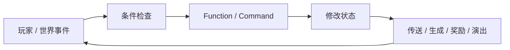

import { Accordion, Accordions } from 'fumadocs-ui/components/accordion';

有些 Minecraft 地图打开以后，第一眼已经不像普通 Minecraft。

玩家可能出生在大厅里，面前有职业选择、任务目标和倒计时；进入副本后，某个区域会锁门，击败一批敌人才继续；死亡以后回到检查点，完成目标又会弹出标题、播放声音、更新积分。底层仍然是 Minecraft 的移动、方块、实体和物品，但玩家面对的已经是一套由作者安排过的流程。

这种创作和上一章的红石不太一样。红石主要通过方块之间的因果组织机器；命令、函数和数据驱动工具则允许作者更直接地表达：**当某件事发生时，检查什么条件，修改什么状态，再触发什么结果。**

所以这一章不写命令大全，也不把 Data Pack 或 Add-On 简化成“轻量模组”。真正要回答的是：

> **Minecraft 怎样让玩家在不完全重写游戏的情况下，开始编排事件、规则和关卡？这些官方扩展层分别能改到哪里，又为什么仍然需要地图、脚本、模组和服务器插件等不同工具？**

## 从命令到玩法编排

### 从管理命令到玩法逻辑

命令最容易被理解成管理员工具：传送玩家、改变时间、给予物品、修改游戏规则。只要这些操作必须由人在聊天栏里输入，它们主要还是一种管理界面；真正改变创作方式的是，命令后来可以被世界和脚本自动调用。

#### Command Block 把命令留在世界里

Command Block 可以保存一条命令，再通过红石或自身的执行模式触发。于是原本需要管理员临时输入的操作，可以固定在地图里：踩过某个位置时传送、进入区域时生成敌人、完成机关后打开下一扇门。Minecraft 官方今天仍然把 Command Block 直接列为制作 Adventure Map 和自定义玩法的重要工具。[^command-block]

这种方式有一个很直观的特点：逻辑仍然有**空间位置**。作者可以走到机关后面，看见一排 Command Block 怎样串在一起；但地图一旦复杂，成百上千个方块也会让逻辑变得难以查找、复用和维护。

#### Function 把一串命令从建筑里抽出来

Function 解决了另一层问题：当多条命令本来就属于同一段逻辑时，不必再让每一句都占一个 Command Block。Bedrock 官方文档直接把 Function 定义为“一次调用一组命令”的方式，并指出它能减少 Redstone 与 Command Block 组合带来的繁琐。[^bedrock-function]

Java 的 Data Pack 同样可以组织 `.mcfunction` 文件，并通过函数、标签、Advancement 等机制调用它们。这里不必深究两边语法差异，重要的是创作单位发生了变化：作者开始从“这一格方块执行什么”转向“这一段逻辑执行什么”。



这已经很接近普通游戏脚本最常见的结构：事件、条件、状态、结果。区别在于，它仍然建立在 Minecraft 已有的命令和世界对象之上。

### 地图作者开始直接安排玩家经历什么

有了命令还不等于有一张好地图。真正重要的是，作者终于可以把原本开放的世界收束成一段更明确的体验。

#### Adventure Mode 改变的是权限，而不是世界材质

Adventure Mode 很适合说明这种变化。官方对它的定义就是让创作者为访客制作特定体验：玩家默认不能像 Survival 那样随意破坏和放置方块，只有满足作者指定条件的物品才可以进行有限交互。[^adventure]

这让地图作者能够把同一座 Minecraft 建筑从“随时可以挖穿的房子”变成真正的关卡空间。墙终于可以被当成墙，钥匙可以真的控制哪扇门能开，路线也不必担心玩家拿镐子从旁边绕过去。

但 Adventure Mode 并没有让 Minecraft 变成另一台引擎。移动、碰撞、实体、物品和大量交互仍然来自原版；作者只是重新规定了玩家在这张地图里拥有多少修改权。

#### 状态让任务和关卡可以持续推进

地图如果只是“进门传送一次”，很快就会遇到更复杂的问题：玩家已经完成哪一步？这个 Boss 是否被击败？队伍现在多少分？这一轮比赛还剩多久？

Scoreboard、Tag、Advancement、Function 等工具可以承担不同形式的状态记录。它们让作者不必把所有逻辑都藏在建筑结构里，而是可以保存“这个玩家现在处于哪一个阶段”，再据此触发下一段内容。

于是很多常见地图结构都变得可行：检查点、任务链、波次、倒计时、计分、职业状态、一次性事件、分支条件。它们不一定需要新增一种底层移动或战斗系统，却可以重新组织原本已有的系统。

#### 演出层把规则变化解释给玩家

一套隐藏逻辑如果没有反馈，玩家只会觉得世界突然发生了什么。Title、Boss Bar、Sound、Particle、对话文本、资源包等工具会把后台状态转成玩家能理解的演出：任务更新了、时间快到了、Boss 进入第二阶段、某个区域已经解锁。

所以地图创作并不只是“写规则”。它还需要把规则变化变成可读的体验，这也是为什么很多成熟地图同时需要建筑、脚本、资源、美术和测试。

## 数据驱动怎样扩展内容

### 从命令到数据驱动

命令适合描述“做一件事”，但 Minecraft 还有大量内容并不适合每次运行时用命令临时拼出来。配方、战利品、标签、世界生成规则、附魔定义等更适合直接作为数据存在。

#### Java Data Pack 不再只是几张 JSON 表

Java Data Pack 最初让配方、Loot Table、Advancement、Function、Tag 等内容可以随世界加载，后来扩展面持续增加。到 1.21，Painting Variant、Jukebox Song、Enchantment 与 Enchantment Provider 等也已经数据驱动；之后的版本还继续调整 Item Component、Loot Table、Worldgen 等格式。[^java-datapack-121][^java-datapack-1212]

这说明 Data Pack 的边界不是一条永远不动的线。Mojang 可以把原本写死在程序里的某类内容逐步搬到 Registry、JSON 或其他数据定义中，创作者也就获得新的修改位置。

不过“可以数据驱动”不等于“任何玩法都只需写 JSON”。Function 仍然依赖现有 Command，数据定义也受游戏公开出来的 Registry、Component、Predicate、Loot Function 等能力限制。需要什么能力，取决于当前版本究竟把哪一层开放成数据。

#### 数据驱动的价值在于把内容和执行机制分开

以 Loot Table 为例，作者更关心“什么条件下掉什么、概率是多少”，并不需要自己重新编写实体死亡和物品生成的底层流程。配方也类似：作者描述输入和输出，Crafting 系统负责匹配、展示和执行。

这种分工可以减少重复实现，也让自定义内容更容易继续使用原版已有的 UI、同步、存档和其他规则。数据驱动最有价值的地方，不是“JSON 比代码高级”，而是**某类变化可以在不重新实现整个系统的前提下被表达出来。**

### Java Data Pack 与 Bedrock Add-On 不是同一个层级

旧讨论最容易犯的错误，是把 Java Data Pack 和 Bedrock Behavior Pack 都归成“官方数据层”，然后得出一套共同的能力边界。今天这样写已经不准确。

#### Bedrock Behavior Pack 本身覆盖更多运行时行为

Microsoft 当前的 Creator 文档把 Behavior Pack 定义为承载实体行为、Loot、Spawn Rule、Item、Recipe、Trade Table 等内容的包；Entity Behavior 还可以通过 Components 和 Events 组合实体状态。[^behavior-pack][^entity-behavior]

Function 也可以直接放进 Behavior Pack，由 `/function` 调用，或者通过 Tick 机制周期执行。与 Java Data Pack 相似的地方，是大量内容和逻辑可以跟随世界或 Add-On 分发，而不要求玩家去修改游戏本体。

#### Script API 又把 Bedrock 推到了真正的程序扩展

Bedrock 现在还有 Script API。Microsoft 的官方介绍明确把 Script 描述成程序：它可以响应事件、操纵实体、方块和物品、修改世界，甚至创建新的游戏机制。[^bedrock-script]

Custom Components 又把脚本和方块 / 物品的数据定义连接起来。作者可以注册自己的组件，在某个方块被踩到、某件物品被使用等事件发生时执行 JavaScript；新版组件还支持从 JSON 向脚本传参数。[^custom-components]

所以“数据只能改内容，程序才能增加新动词”最多只能描述某些具体扩展层，不能拿来概括今天的整个 Minecraft 创作生态。Bedrock Add-On 本身就可能同时包含数据、资源和脚本。

更准确的比较是：

| 扩展层 | 更适合做什么 | 主要边界 |
| --- | --- | --- |
| **Command / Command Block** | 触发操作、管理状态、编排事件 | 受现有命令能力和权限约束 |
| **Java Data Pack** | Function、Recipe、Loot、Advancement、Tag、部分 Registry / Worldgen 等 | 能力随版本公开的数据与命令接口变化 |
| **Bedrock Behavior / Resource Pack** | 实体、物品、方块、配方、资源表现与大量行为配置 | 受 Add-On Schema 与运行时支持范围约束 |
| **Bedrock Script API / Custom Components** | 事件逻辑、世界操作、自定义行为和新机制 | 受官方 Script API、版本与实验性能力约束 |
| **Java Mod / Loader** | 修改或加入更底层程序行为 | 客户端 / 服务端部署、版本兼容和冲突成本更高 |

#### 如果真的打开文件夹，它们大概长什么样

上面的表格讲的是能力边界。如果只想先建立一个工程直觉，可以把它们想成三种很不一样的项目：**Java Data Pack 主要是 JSON + `.mcfunction`；Bedrock Add-On 通常由 Behavior Pack 与 Resource Pack 组成；需要更复杂的运行时逻辑时，Behavior Pack 里还可以加入 Script API 的 JavaScript。**[^datapack-layout][^addon-layout]

<Accordions type="single">
  <Accordion title="Java Data Pack：JSON + .mcfunction">

```text
my_datapack/
├── pack.mcmeta
└── data/
    └── example/
        ├── function/
        │   └── start.mcfunction
        ├── recipe/
        │   └── special_item.json
        ├── loot_table/
        │   └── chests/reward.json
        ├── advancement/
        │   └── first_step.json
        └── tags/
            └── function/
                └── load.json
```

Data Pack 的入口是 `pack.mcmeta`，真正内容放在 `data/<namespace>/...`。其中 Recipe、Loot Table、Advancement、Tag 等主要是 **JSON 数据定义**；Function 则是逐行执行 Minecraft Command 的 `.mcfunction` 文件。

它没有一套类似 Node.js 的通用 JavaScript 运行时。能做什么，取决于当前版本开放了哪些数据类型、命令和函数能力。值得注意的是，**Java 1.21 起很多 Data Pack 目录从复数改成了单数**，例如 `functions/` → `function/`、`recipes/` → `recipe/`、`loot_tables/` → `loot_table/`。[^datapack-layout]

```text
# data/example/function/start.mcfunction
tellraw @a {"text":"Map started","color":"gold"}
scoreboard players set @a stage 1
```

  </Accordion>

  <Accordion title="Bedrock Add-On：Behavior Pack + Resource Pack">

Add-On 更像一个总称。最典型的项目会把**行为**和**表现**拆成两个 Pack：

```text
MyAddon/
├── behavior_pack/
│   ├── manifest.json
│   ├── blocks/
│   ├── entities/
│   ├── items/
│   ├── recipes/
│   ├── loot_tables/
│   ├── spawn_rules/
│   ├── trading/
│   └── functions/
│       └── start.mcfunction
└── resource_pack/
    ├── manifest.json
    ├── textures/
    ├── models/
    ├── sounds/
    ├── animations/
    └── render_controllers/
```

两个 Pack 都用 `manifest.json` 声明名称、UUID、版本和模块。**Behavior Pack** 主要描述方块、实体、物品、配方、掉落、生成规则和行为；**Resource Pack** 主要负责纹理、模型、声音、动画与渲染表现。官方当前列出的 Behavior Pack 目录仍然使用 `functions/`、`recipes/`、`loot_tables/` 这类复数命名，不要和 Java Data Pack 1.21 后的单数目录混在一起。[^addon-layout]

大部分 Behavior Pack 内容仍然是 JSON，例如一个实体会通过 `components` 与 `events` 组合行为；`.mcfunction` 则继续用于执行成组命令。

  </Accordion>

  <Accordion title="Bedrock Script API：在 Behavior Pack 里运行 JavaScript">

需要事件驱动、动态状态或 JSON 很难直接表达的逻辑时，Behavior Pack 可以再声明一个 `script` module：

```text
behavior_pack/
├── manifest.json
└── scripts/
    └── main.js
```

`manifest.json` 会把脚本入口指向 `scripts/main.js`，并声明对 `@minecraft/server` 等模块的依赖。官方运行时执行的是 **JavaScript**；项目也可以用 TypeScript 开发，再编译成 JavaScript 放进 `scripts/`。[^script-layout]

```json
{
  "modules": [
    {
      "type": "script",
      "language": "javascript",
      "entry": "scripts/main.js",
      "uuid": "...",
      "version": [1, 0, 0]
    }
  ],
  "dependencies": [
    {
      "module_name": "@minecraft/server",
      "version": "..."
    }
  ]
}
```

脚本写法已经很接近普通事件驱动程序：

```js
import { world } from "@minecraft/server";

world.afterEvents.playerSpawn.subscribe((event) => {
  if (event.initialSpawn) {
    event.player.sendMessage("Welcome!");
  }
});
```

Script API 可以监听玩家、实体和方块事件，读取或修改世界状态；Custom Components 还可以让 JSON 中定义的方块 / 物品组件与 JavaScript 回调连接起来。因此 Bedrock Add-On 并不能简单理解成“只有 JSON 的数据包”。[^script-layout]

  </Accordion>
</Accordions>

这些目录只是建立直觉，不是完整规范；Minecraft 更新后字段和版本要求仍可能变化。更重要的是看出三者的形态区别：**Java Data Pack 主要在已有系统里声明数据和命令逻辑；Bedrock Behavior / Resource Pack 用 JSON 组合行为与表现；Script API 则在官方 Add-On 框架里再加入真正的程序逻辑。**

这些层级有重叠，并不存在一条“越往下越高级”的单向梯子。地图作者需要的是能完成作品且便于分发的工具，模组作者则可能需要原版接口没有开放的底层能力。

## 地图怎样长成另一种游戏

### 地图为什么可以长成另一种游戏

当命令、状态、数据和权限都可以被作者重新组织以后，Minecraft 地图不再只是“一块漂亮的建筑”。

#### Adventure Map 把世界变成一次被安排过的旅程

Adventure Map 最直观：作者提前设计路线、机关、战斗、叙事和检查点，玩家主要负责经历它。因为底层移动和空间仍然来自 Minecraft，作者可以把主要精力放在“这段旅程应该怎样展开”，而不是重新写角色控制器。

CTM 则会把探索和战斗重新组织成“收集指定目标并完成 Monument”；Parkour Map 会把跳跃、速度和方块碰撞推到极端；Puzzle Map 会把红石、空间观察、物品规则或命令状态变成谜题。

这些类型共享 Minecraft 的一部分基础系统，却会通过权限、目标和关卡布局把注意力推向完全不同的地方。

#### RPG 与小游戏更依赖状态和规则编排

RPG 地图常见的问题不是“有没有剑”，而是怎样让剑成为一套职业、属性、任务和奖励结构的一部分。Scoreboard、Function、Loot、Advancement、Item Component、资源包等工具可以承担其中很多工作；Bedrock Add-On / Script API 又能进一步扩展实体、物品和事件行为。

小游戏也是类似。比赛开始、队伍分配、胜负判断、计分、重置和下一轮都属于规则状态，而不是建筑本身。到了大型服务器，这些逻辑往往会交给 Plugin 或专门的服务端程序，但小型作品完全可以在官方创作层里完成相当多的内容。

地图之所以能看起来像“另一款游戏”，并不是因为 Minecraft 的原系统完全消失了，而是因为作者把其中一部分系统**重新排序、限制、组合并赋予新的目标**。

### 创作工具也会改变作品怎样被分发

创作不是只看“能不能做出来”，还要看玩家怎样拿到作品。

#### 世界本身可以成为交付物

地图创作一个很强的特点，是逻辑可以和世界一起被保存。Command Block 本来就在存档里；Java Data Pack 可以随世界放在对应目录；Bedrock 的 Behavior / Resource Pack 也可以绑定到创作内容。玩家得到的不是一串教程，而是一份已经配置好的世界。

这降低了某些作品的进入成本。相比要求每个玩家先安装完整 Mod Loader 与一组依赖，一张自包含地图更容易表达“下载、打开、开始玩”。当然，一旦作品依赖特定资源包、服务器插件或客户端模组，部署成本又会重新增加。

#### 版本兼容会成为作品维护的一部分

官方接口并不代表永远不变。Java 的 Data Pack 有持续变化的 Pack Version；1.21.9 以后甚至进一步区分 major / minor pack version，并明确 minor increment 可以保持同一 major 内的向后兼容。[^pack-version]

Bedrock Add-On 同样有 `format_version`、Manifest、Script API 版本和实验性能力。作品越依赖具体 Schema、Component 或 Command 行为，升级游戏时就越可能需要重新测试。

因此官方扩展层通常能降低“修改程序本体”的成本，却不会消灭版本维护。对于一张长期运营的服务器地图或大型 RPG，这已经是工程工作的一部分。

## 扩展层的边界与代价

### 能做出来，不等于适合这样做

官方扩展层不断增强以后，一个很容易出现的问题是：既然 Function 或 Script 最终能模拟很多东西，是不是就应该把所有系统都塞进去？

#### 用每 Tick 扫描模拟机制，和真正拥有机制并不一样

假设作者想做一种特殊区域效果。最直接的方法可能是每 Tick 检查所有相关玩家的位置，再给予 Effect、修改 Score、生成 Particle。少量使用完全可行；地图越来越大以后，这种逻辑会变成持续运行的查询与维护成本。

同一种玩法如果已经有官方 Component、Predicate、Event 或专门 API，通常更适合使用那个层级。这里的区别不是“命令不专业”，而是**表达方式是否与问题匹配**。

上一章讨论 WorldEdit 时说过，操作粒度应该尽量接近设计意图；这里也一样。如果作者想表达的是“这种方块踩上去触发行为”，Bedrock Custom Component 比每 Tick 扫描全世界更直接；如果只需要一次传送，写完整 Script Framework 又可能过重。

#### 新机制、内容配置和关卡逻辑是三种不同需求

很多争论之所以混乱，是因为大家把它们都叫“Modding”。

关卡逻辑关心的是：什么时候发生什么；数据配置关心的是：现有系统里有哪些内容和参数；新机制则可能需要以前不存在的事件、物理或底层行为。

它们之间没有绝对边界，但可以用一个简单问题判断：

> **我是在重新安排已有系统，还是缺少一种能够直接表达当前设计意图的能力？**

如果已有 Command、Data Pack、Add-On 或 Script API 足够直接，继续改更底层程序未必有收益；如果所有方案都只能靠大量轮询、替身实体和脆弱约定模拟，Mod、Plugin 或新的官方 API 可能才是更合适的层。

### 官方创作层最难平衡的几组关系

命令和数据驱动系统越强，越容易遇到新的取舍：

| 关系 | 一边过头 | 另一边过头 |
| --- | --- | --- |
| **低门槛 vs 表达能力** | 只能做少数固定模板 | 工具复杂到必须先成为程序员 |
| **数据配置 vs 程序逻辑** | 每个新需求都要写代码 | 复杂行为被迫塞进难维护的配置 |
| **世界自包含 vs 外部依赖** | 接口能力受限 | 玩家安装和版本管理成本不断增加 |
| **运行时自由 vs 性能预算** | 作者做不出动态玩法 | 每 Tick 脚本和查询拖慢整个世界 |
| **稳定接口 vs 持续扩展** | 创作者长期缺少新能力 | 每次版本升级都让旧作品需要重写 |
| **Java / Bedrock 共名工具 vs 产品线差异** | 教程和作品难跨版本 | 为统一而牺牲两边各自成熟的扩展方式 |

这些关系也解释了为什么 Minecraft 没有一个“万能官方模组系统”能够替代所有其他工具。地图、Data Pack、Add-On、Script、Plugin 和 Mod 面向的部署环境、作者技能和改动深度本来就不同。

## 这一章留下什么

命令和数据驱动工具真正扩展的，是玩家能够直接编排的层级：从改造世界，进一步走向安排事件、状态和规则。

- **Command Block 让命令从临时管理操作变成可以固定在世界里的关卡逻辑，Function 又把成组逻辑从大量实体方块中抽离出来。**
- **Adventure Mode、Scoreboard、Function 与反馈工具让作者能够组织路线、任务、检查点、计分和演出，而不必重写 Minecraft 的移动与世界基础。**
- **Java Data Pack 的能力边界会随版本变化；1.21 以后越来越多 Registry 与内容进入数据驱动，因此不能把它写成一套固定不变的“小型功能表”。**
- **Bedrock Add-On 不等于 Java Data Pack：Behavior Pack、Script API 与 Custom Components 已经可以承载程序逻辑和新的 gameplay behavior。**
- **Adventure、CTM、Puzzle、Parkour、RPG 和小游戏之所以能成立，常常不是因为原版系统消失，而是因为作者重新限制、排序和组合了它们。**
- **官方扩展层可以降低分发与集成成本，但 Pack Version、Schema、Script API 和命令变化仍然会形成长期维护成本。**
- **能用命令或脚本模拟出来，不等于那就是最合适的实现；应让扩展层尽量接近设计意图，而不是为了坚持某一种工具把所有逻辑塞进同一层。**

下一章[《模组与玩法扩展》](/design/mods-expansion)会把这条线继续向外推：如果作者不仅重新安排已有规则，而是开始加入完整的工业、魔法、RPG、科技树和新世界系统，Minecraft 为什么还能被改造成如此不同的游戏？

[^command-block]: Mojang Studios，《Minecraft Creator Tools》，2026 年访问。官方说明 Command Block 可以运行传送、生成物品、修改 Game Rule 等命令，并常用于 Adventure Map 和自定义体验。https://www.minecraft.net/en-us/creator/tools

[^bedrock-function]: Microsoft Learn，《Introduction to Functions》，2026 年访问。Bedrock Function 使用 `.mcfunction` 文件把多条命令组织成一次调用，官方教程明确把它作为减少 Redstone / Command Block 繁琐度的方式。https://learn.microsoft.com/en-us/minecraft/creator/documents/functionsintroduction?view=minecraft-bedrock-stable

[^adventure]: Minecraft Help，《All Game Modes in Minecraft》，2026 年访问。官方把 Adventure Mode 定位为供创作者制作独特世界体验的模式，访客默认不能随意放置或破坏方块，除非持有被允许操作特定方块的物品。https://help.minecraft.net/hc/en-us/articles/360058743992-Minecraft-Differences-Between-Creative-Survival

[^java-datapack-121]: Mojang Studios，《Minecraft: Java Edition 1.21》，2024 年。1.21 的 Data Pack 版本把 Painting Variant、Jukebox Song、Enchantment、Enchantment Provider 等进一步数据驱动化，并继续扩展 Loot、Predicate 与 Worldgen 数据。https://feedback.minecraft.net/hc/en-us/articles/27547857163917-Minecraft-Java-Edition-1-21-Tricky-Trials

[^java-datapack-1212]: Mojang Studios，《Minecraft Java Edition 1.21.2》，2024 年。发布说明继续扩展 Data Pack 的 Item Component、Loot Table、Advancement、Enchantment Effect 与 Trial Spawner Configuration 等能力。https://www.minecraft.net/de-de/article/minecraft-java-edition-1-21-2

[^behavior-pack]: Microsoft Learn，《Introduction to Behavior Packs》，2026 年访问。Behavior Pack 可以定义或修改实体行为、Loot、Spawn Rule、Item、Recipe、Trade Table 等内容。https://learn.microsoft.com/en-us/minecraft/creator/documents/behaviorpack?view=minecraft-bedrock-stable

[^entity-behavior]: Microsoft Learn，《Entity Behavior Introduction》，2026 年访问。Bedrock 实体 JSON 通过 Component 与 Event 组织生命值、碰撞、AI 等行为，并属于 Behavior Pack 的一部分。https://learn.microsoft.com/en-us/minecraft/creator/documents/entitybehaviorintroduction?view=minecraft-bedrock-stable

[^bedrock-script]: Microsoft Learn，《Introduction to Scripting in Minecraft》，2026 年访问。官方说明 JavaScript Script API 可以响应事件，控制实体、方块、物品与世界，并创建新的 gameplay mechanics。https://learn.microsoft.com/en-us/minecraft/creator/documents/scripting/introduction?view=minecraft-bedrock-stable

[^custom-components]: Microsoft Learn，《Introducing Custom Components》，2026 年访问。Custom Components 把方块 / 物品 JSON 与 Script API 连接，使作者可以为指定内容注册事件回调；Version 2 还支持从 JSON 向脚本传递参数。https://learn.microsoft.com/minecraft/creator/Documents/CustomComponents

[^pack-version]: Mojang Studios，《Minecraft Java Edition 1.21.9》，2025 年。Java Data Pack / Resource Pack 的版本开始支持 major / minor version；同一 major 内的 minor increment 被定义为向后兼容。https://www.minecraft.net/en-us/article/minecraft-java-edition-1-21-9

[^datapack-layout]: Mojang Studios，《Minecraft: Java Edition - Snapshot 24w21b》，2024 年；Minecraft Wiki，《Data pack directory》，2026 年访问。1.21 开发周期把一批旧的复数目录改为与 Registry 名称一致的单数，例如 `functions` → `function`、`recipes` → `recipe`、`loot_tables` → `loot_table`；典型 Data Pack 以 `pack.mcmeta` 和 `data/<namespace>/...` 组织 JSON 与 `.mcfunction`。https://feedback.minecraft.net/hc/en-us/articles/27439697297421-Minecraft-Java-Edition-Snapshot-24w21b https://minecraft.wiki/w/Template:Data_pack_directory

[^addon-layout]: Microsoft Learn，《Comprehensive List of Pack Contents》与《manifest.json for Behavior/Resource/Skin Packs and World Templates》，2026 年访问。Behavior / Resource Pack 都以 `manifest.json` 作为入口；Behavior Pack 常见目录包括 `blocks/`、`entities/`、`items/`、`functions/`、`recipes/`、`loot_tables/` 等，而 Resource Pack 主要组织纹理、模型、声音、动画和渲染资源。https://learn.microsoft.com/en-us/minecraft/creator/documents/comprehensivepackcontents?view=minecraft-bedrock-stable https://learn.microsoft.com/minecraft/creator/reference/content/addonsreference/examples/addonmanifest

[^script-layout]: Microsoft Learn，《Pack Manifest Documentation - minecraft:module》《Introduction to Scripting in Minecraft》与《Introducing Custom Components》，2026 年访问。Behavior Pack 可以声明 `type: "script"` 的 module，并通过 `entry` 指向 JavaScript 入口；脚本可导入 `@minecraft/server`、订阅世界事件，也可以注册与 JSON 方块 / 物品定义连接的 Custom Components。TypeScript 通常在开发阶段编译成 JavaScript 后部署。https://learn.microsoft.com/en-us/minecraft/creator/reference/content/manifestreference/module?view=minecraft-bedrock-stable https://learn.microsoft.com/en-us/minecraft/creator/documents/scripting/introduction?view=minecraft-bedrock-stable https://learn.microsoft.com/minecraft/creator/Documents/CustomComponents