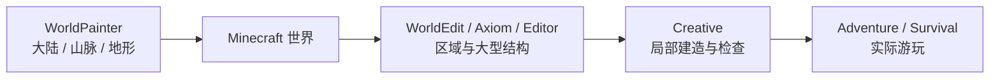

在 Creative Mode 里盖一栋房子时，玩家仍然会对准一块地，放下一块方块，再放下一块。不同的是，很多原本会打断施工的事情消失了：不需要先砍树，不需要搭脚手架爬到屋顶，不需要担心从高处摔死，也不用因为石英不够再跑一次 Nether。官方对 Creative 的描述一直很直接：无限资源、飞行、近乎不受伤害、瞬间破坏方块，让玩家把注意力更多放在建造本身。[^creative]

但如果要修一座几百米长的城墙，问题很快又会出现。设计已经想好了，接下来只是把同一段结构复制几十次；山坡的形状也已经决定，只差把几万块土石推成正确轮廓。继续逐块放置并不会增加新的设计判断，只会增加鼠标点击。

于是 Minecraft 的创作世界里出现了越来越多不同的工具：Structure Block、WorldEdit、Axiom、WorldPainter，以及今天的 Bedrock Editor。它们看上去都在“帮助玩家更快地盖东西”，但实际上解决的并不是同一个问题。

> **Creative Mode 为什么存在？什么时候逐块建造已经不够，需要更高层的选择、复制、笔刷、变换甚至外部地形工具？这些工具应该怎样分工，而不是互相取代？**

## Creative Mode 改变了什么

### Creative Mode 首先改变的是成本

上一章已经比较过 Survival 与 Creative 中建造的意义。这里更具体地看 Creative 做了什么。

#### 它没有发明另一套建筑系统

Creative 最重要的一点，恰恰是它并没有要求玩家学习另一套世界表示。

玩家仍然面对同样的方块、同样的坐标、同样的碰撞与大部分环境规则。建筑最终仍然写进普通 Minecraft 世界，之后可以被 Survival 玩家走进去、拆掉、使用。

变化主要发生在玩家身上：

- 方块不再需要先采集；
- 大部分伤害和饥饿压力消失；
- 可以飞行，施工不再依赖脚手架和地形；
- 方块可以迅速拆除并重新尝试。[^creative]

所以 Creative 更像是在降低**施工成本**，而不是把 Minecraft 切换成另一种几何系统。

这也是为什么从 Survival 切到 Creative 后，一座门仍然是那座门，一段红石线路仍然可以工作，水和沙也不会因为玩家获得无限资源就变成纯装饰。

#### 飞行改变的不只是移动速度

飞行尤其重要。在 Survival 里，建筑高度会带来真实的施工成本：玩家要搭脚手架、垫方块、爬梯子，还可能因为失足掉下来。Creative 的飞行把这些成本大幅压低，也让玩家可以不断切换观看尺度。

近看时调整窗框，退后几十格看整体比例，再飞到屋顶检查轮廓，这种移动本身就变成了设计工具。但它仍然是第一人称 / 第三人称世界中的移动，而不是传统 3D 编辑器里完全脱离玩家身体的自由视口。这个差别说明 Creative 的职责比较克制：**让玩家更自由地处在世界里建造，而不是一次解决所有 worldbuilding 问题。**

### 逐块建造什么时候开始变慢

Creative 很适合快速试错，但“无限资源 + 飞行”并不会自动解决规模问题。

#### 重复劳动和设计劳动不是同一件事

假设一座城墙的塔楼已经设计完成。

第一次搭塔楼，需要决定比例、材料、窗洞、屋顶、楼梯和内部空间；第二十次把完全相同的塔楼再搭一遍，绝大部分决定已经消失了。

这两种劳动都需要时间，却不是同一种创作。

同样的问题还会出现在：

- 把一整栋建筑向左移动十格；
- 把所有石砖替换成另一种材料；
- 把一片森林清空；
- 把同一栋房子复制成村庄；
- 把山坡整体削平或抬高；
- 发现整个大厅少算了一格，需要整体平移。

这时逐块编辑的优势——简单、直观、每一步都能看懂——开始反过来变成成本。

于是创作工具的基本问题出现了：

> **能不能让玩家直接表达“我要改这一片区域”，而不必把这个意图拆成几千次单块操作？**

从这里开始，编辑单位就从“一个方块”逐渐上升到“一个结构、一个选区、一片地形”。

## 编辑单位怎样逐渐扩大

### 从方块到结构：复用已经做好的东西

#### Structure Block 把建筑变成可复用的片段

Structure Block 可以保存一块区域中的方块与实体，再把它加载到别处；加载时还可以进行旋转、镜像等处理。Bedrock 官方教程甚至直接用“保存一栋木屋，再不断复制它形成村庄”作为示例。[^structure]

这会改变一个很基础的工作流：逐块建造时，作品只能通过再次施工来复制；有了 structure 以后，一栋房子可以先成为一个**可复用片段**。

这里并没有出现新的地形表示。被保存和重新放置的仍然是普通方块，只是玩家不再需要每次从零开始。

因此 Structure Block 很适合**模块化复用**：房间、塔楼、树木、装饰、机关片段，都可以先做成一个局部，再组合成更大结构。

#### 复用也会改变创作思维

一旦知道结构可以复制，玩家就会开始主动设计“可重复单元”。

一座大城不一定从头到尾逐块设计，而可以由几种住宅、几段街道、几种屋顶和装饰组合出来；地图作者也可以把一次性搭建转成模块库。

这和游戏开发里的 prefab 思维有一点相似，但不要把两者直接等同。

Minecraft 的 Structure 仍然受方块、实体和结构格式约束，也没有自动提供复杂的层级、参数化组件或完整的场景对象模型。

它解决的是一个更具体的问题：**已经做好的这一块东西，能不能不用重新做一遍？**

### 从结构到选区：直接表达“改这一片”

Structure Block 适合复用现成结构，但如果问题是“把这整个区域的石头换成空气”，就需要另一类工具。

WorldEdit 是这条路线最典型的社区工具。

#### WorldEdit 把区域本身变成操作对象

WorldEdit 的核心不是某一条命令，而是 **selection / region**。

玩家先选中一片区域，再对整个区域执行 fill、replace、copy、paste、rotate、brush 等操作。官方文档把 selection 称为 WorldEdit 的基础能力，并提供 cuboid、polygon、ellipsoid、cylinder 等不同选区形式。[^worldedit-selection]

于是玩家表达意图的方式发生变化：

> “在这里放一块石头”

变成：

> “把这整个选区替换成石头。”

或者：

> “复制这一片，然后旋转 90° 粘到那边。”

WorldEdit 官方文档本身就把“几秒内创建、替换或删除成千上万的方块”“复制、粘贴、保存 schematic”“用 brush 雕出山体”等列为主要能力。[^worldedit] 这类工具最直接的价值不是“更强”，而是让**操作粒度和设计粒度重新对齐**：当作者想的是一面墙，就可以操作一面墙；想的是整片山坡，就不必假装自己仍然只想改一个方块。

#### 命令式工具也有自己的摩擦

WorldEdit 很高效，但大量能力通过命令、参数、pattern、mask 和选区表达。熟悉以后这非常精确；刚接触时，却需要先把“脑中的形状”翻译成工具语言。

复杂编辑如果缺少可视化反馈，还容易产生另一类错误：选区到底选到哪里、paste 的原点在哪、mask 会不会误伤其他材料。这也是为什么后来出现了越来越多强调可视化编辑界面的工具。

### 从命令到可视化编辑：Axiom 与 Bedrock Editor

Axiom 和 Bedrock Editor 虽然来源完全不同，却都能说明 Minecraft worldbuilding 正在出现更接近专业编辑器的交互。

#### Axiom 把许多编辑操作搬到图形界面里

Axiom 把自己描述为 Minecraft world editing 的 all-in-one tool，提供自定义 Editor UI，以及 Magic Select、Box Select、Freehand Select、Painter、Biome Painter、Sculpt、Smooth、Flatten、Extrude 等大量工具。[^axiom]

这类界面最大的变化，是玩家不必把所有意图先写成命令。可以先看见选区，再拖动、雕刻、平滑或绘制；“我想把这面山修圆一点”开始更接近直接操作，而不是寻找一条合适的命令。

它仍然工作在 Minecraft 世界里，仍然编辑普通方块，却借用了很多 DCC / level editor 已经成熟的交互语言：选择、变换、笔刷、预览。

这说明一个很现实的趋势：

> **方块世界并不要求创作工具永远也必须是“一块一块放”。**

世界的数据粒度和用户操作的粒度可以不同。

#### Bedrock Editor 把这种工具层正式带进官方生态

Bedrock Editor 更值得注意的地方，不只是功能，而是它来自 Mojang 自己。

官方 Creator Tools 页面目前把 Editor 作为专门的 worldbuilding 工具提供，支持 multiblock selection、brush、Undo / Redo、复制、移动和形状操作；官方说明强调，修改会直接出现在世界中。[^editor-tools]

它还有明显区别于普通 Creative 的 **Tool Mode**。

Selection Tool 可以选中空气与方块，支持 marquee、freehand brush、Magic Select；选区可以 fill、transform、nudge。Brush Tool 则可以用不同形状和尺寸连续绘制方块。[^editor-selection][^editor-brush]

这些能力已经非常接近专业关卡编辑器的常见语言。

但 Bedrock Editor 又保留了 Crosshair Mode，让创作者可以在更接近普通 Minecraft 的方式里进入世界观察和操作；Tool Mode 与 Crosshair Mode 可以切换。[^editor-mode]

因此，Creative 和 Editor 并不是只能二选一。

更自然的关系反而是：

> **在 Tool Mode 里处理大尺度编辑，在玩家视角里检查它真正走起来是什么样。**

这种往返很重要，因为现实的创作流程本来就会在不同视角之间切换：大尺度编辑需要更高层的工具，最终体验却仍然要回到玩家实际行走、观察和互动的世界中。

### 地图级创作可以发生在游戏之外

到这里仍然是在直接编辑 Minecraft 世界，WorldPainter 则把创作再往外移了一层。

#### WorldPainter 主要解决的是地形生成，而不是普通建筑编辑

WorldPainter 官方把自己称为 Minecraft Java Edition 的 interactive map generator：像使用绘图软件一样，绘制地形、材料、树木、雪和冰，再把结果导出为 Minecraft 地图。[^worldpainter]

它自己的 FAQ 甚至特意强调：

> **WorldPainter is a map generator, not an editor.**[^worldpainter-faq]

这句话很重要。

WorldPainter 更适合在宏观尺度上决定“这座大陆是什么形状、山脉在哪、河流怎么走”，而不是进入已经完成的房间里把窗户向右挪一格。

它内部使用的 World 还是一种比真实 Minecraft 地图更简化、更抽象的表示；导出时才根据这些信息生成实际方块。[^worldpainter-concepts]

所以它的优势来自**暂时不受游戏运行时的操作方式限制**。

这也意味着它和 Creative / WorldEdit 的职责不同。

一个典型流程完全可以是：

这不是唯一工作流，也不是工具排名。

它只是说明：**创作者面对的尺度不同，最合适的交互也会不同。**

## 专业创作工具改变了什么

### 编辑单位需要匹配设计意图

把这些工具放在一起以后，比“哪个最强”更有意思的是它们各自让玩家直接操作什么。

| 层级 | 直接操作的对象 | 典型问题 |
| --- | --- | --- |
| **Creative Mode** | 单个方块与物品 | 这里应该放什么？形状和细节对不对？ |
| **Structure Block** | 一块已完成结构 | 这一段能不能保存、复制、旋转后复用？ |
| **WorldEdit** | 选区与规则化操作 | 能不能一次替换、填充、复制这一整片？ |
| **Axiom / Bedrock Editor** | 可视化选区、笔刷、形状与变换 | 能不能直接雕刻、移动、平滑和预览？ |
| **WorldPainter** | 地形与地图级抽象 | 整片大陆、山脉和生物群系应该怎样分布？ |

工具越往下，操作粒度通常越大，但这并不意味着越下面就越适合所有任务。

用 WorldPainter 调整一扇窗户很荒谬，用 Creative 手工塑造一整片几千格山脉也很低效。真正需要匹配的是：

> **作者此刻脑中正在做的是哪一种决定？**

如果决定是“这里用深色木板还是石砖”，单块编辑很自然；如果决定是“这条山脉整体向西延伸”，笔刷或地图级工具更接近意图。

这也是创作软件普遍会不断增加层级工具的原因：不是为了让低层操作消失，而是让用户不必永远把高层意图手动翻译成最小动作。

### Undo 改变的是试错成本

Creative 可以瞬间拆方块，但“拆回去”不等于真正的 Undo。如果玩家刚刚误删了一大块复杂建筑，手工重建原状可能非常痛苦。

专业创作工具通常会把历史记录当成基本能力。Bedrock Editor 的 Tool Mode 明确提供 Undo / Redo，官方快捷键也是标准的 Ctrl+Z / Ctrl+Y；WorldEdit 也长期维护 edit session 与 history，用于撤销大范围操作。[^editor-mode][^worldedit]

当错误可以低成本回退，创作者更愿意尝试大范围变换；当每次尝试都可能不可逆地破坏几个小时的作品，工具会自然让人保守。

所以创作自由不仅来自“你能不能做某种操作”，还来自：

> **做错以后能不能安全回来。**

这也是为什么把专业编辑器理解成“Creative 加几个更快的按钮”并不够。选择、预览、历史记录、变换、结构库共同改变了创作过程本身。

### 大尺度编辑也需要更明确的权限

批量修改世界非常方便，也意味着一次操作可以破坏更多东西。

Creative 玩家误挖一块墙，影响有限；WorldEdit 的一个错误选区可能删除整座城市。服务器里如果所有人都拥有大范围编辑权限，性能、破坏和责任边界都会迅速变成问题。

WorldEdit 文档本身就把大量操作绑定到 permission；Bedrock Editor 则以专门的 Editor 项目和 Creator Tools 工作流提供，而不是把全部能力直接放进每一个普通 Survival 世界。[^worldedit][^editor-tools]

所以“更强的工具”通常也意味着“更明确的权限”。这会和后面的多人章节连接起来：谁有权批量修改世界，谁可以撤销谁的改动，公共服务器怎样区分普通玩家、建筑师和管理员，都是工具设计最终会遇到的社会问题。

这里先留下一个比较简单的判断：

> **编辑能力越接近世界级操作，权限就越不能只靠‘大家别乱用’维持。**

## 游戏模式和创作工具应该怎样分工

把 Creative、Editor、WorldEdit、WorldPainter 全部看完以后，Creative 的位置反而更清楚了：它不需要承担所有专业创作需求。

### Creative 的优势是“立刻进入世界”

Creative 没有复杂的项目设置，也不要求先定义选区、导出地图或组织资产库。玩家想到一个小房子，可以立刻开始搭；想试一种墙面，可以随手放出来；完成以后马上就在同一个世界里走进去看。

这种低门槛非常重要。如果所有建造都必须先进入 Editor，Minecraft 最日常的创造活动反而会变重。

所以 Creative 最适合保留的是：

> **低门槛、直接、和普通游玩连续的建造。**

### 专业工具负责减少已经没有设计价值的重复劳动

当项目越来越大，工具可以逐步接管另一类工作：复制、替换、平移、批量地形、结构管理和安全撤销。这并不会自动让作品变得更好。WorldEdit 可以一秒铺满十万块石头，但“这里到底该不该有一堵石墙”仍然需要作者决定；WorldPainter 可以很快生成山脉，却不能替创作者决定这片地形是否适合实际玩法。

因此，工具真正应该减少的，不是所有劳动，而是那些**设计判断已经完成、剩下只有机械重复**的劳动。这个边界在 Survival 中又会不同：玩家可能恰恰把“亲手挖完一座山”“自己铺完一条铁路”视为作品意义的一部分，对这种玩法来说，效率并不是唯一目标。

所以不能从专业地图制作反推“所有 Minecraft 都应该默认有 WorldEdit”。

创作工具的职责取决于活动本身：

- **在玩 Survival**：施工成本可能就是体验；
- **在 Creative 自由建造**：快速试错通常比资源成本更重要；
- **在制作大型地图或服务器场景**：重复劳动很可能只是在拖慢设计；
- **在制作宏观地形**：甚至需要离开普通游戏视角，用地图级工具思考。

这比把“游戏模式”和“编辑器”争论成谁更纯粹，更接近真实的 Minecraft 创作生态。

## 这一章留下什么

Creative Mode 与专业创作工具并不处在一条简单的升级链上。更准确地说，它们在不同尺度上处理不同问题：

- **Creative Mode 主要取消资源、伤害和移动限制，让玩家仍以普通 Minecraft 的方式更自由地逐块建造。**
- **当设计意图已经明确，继续逐块重复同一操作就可能从创作变成机械劳动。**
- **Structure Block 把已经完成的局部变成可复用结构；WorldEdit 则把选区和批量操作提升为直接编辑对象。**
- **Axiom 与 Bedrock Editor 说明，Minecraft 世界可以继续保持方块表示，同时使用选择、笔刷、变换、预览等更接近专业编辑器的交互。**
- **WorldPainter 解决的是更宏观的地形生成问题，它甚至明确把自己定位为 map generator，而不是普通世界编辑器。**
- **Undo / Redo、预览和历史记录降低了大尺度试错成本，是专业工具和普通逐块建造之间很重要的差别。**
- **工具越能一次改动大片世界，权限和治理就越重要；强编辑能力不适合无条件地交给每一个玩家。**
- **最合适的工具取决于创作者当前思考的尺度，而不是工具本身的‘强弱排名’。**

下一章[《红石、机器与自动化》](/design/redstone-automation)会从“改造空间”进入“编排因果”：方块不再只是组成墙和道路，还会传递信号、保存状态、推动其他方块，最后长成自动农场、交通系统甚至计算机。

[^creative]: Mojang Studios，《What is Minecraft?》与《Creative vs Survival Mode》，Minecraft.net。官方把 Creative 描述为拥有无限资源、飞行、近乎无伤害和瞬间破坏方块的模式，主要让玩家专注于创造。https://www.minecraft.net/en-us/article/what-minecraft https://www.minecraft.net/en-us/article/creative-vs-survival-mode

[^structure]: Microsoft Learn，《Structure Blocks and the Structure Command Tutorial》，2026 年访问。官方教程演示通过 Structure Block 保存一栋建筑，再进行加载、旋转与重复放置，用于快速组成更大的场景。https://learn.microsoft.com/en-us/minecraft/creator/documents/structures/structureblockscommandtutorial

[^worldedit-selection]: EngineHub，《Selection - WorldEdit Documentation》，2026 年访问。文档把 region selection 作为 WorldEdit 的基础，并列出 cuboid、polygon、ellipsoid、cylinder 等不同选区模式。https://worldedit.enginehub.org/en/latest/usage/regions/selections

[^worldedit]: EngineHub，《WorldEdit Documentation》，2026 年访问。官方文档列出批量创建 / 替换 / 删除方块、copy / paste、schematic、brush、terrain sculpting 与历史恢复等主要能力。https://worldedit.enginehub.org/en/latest/

[^axiom]: Moulberry，《Axiom》，2026 年访问。项目把自己描述为 Minecraft 世界编辑工具，提供 Editor UI、Selection、Painter、Biome Painter、Sculpt、Flatten、Smooth、Extrude 等可视化工具。https://axiom.moulberry.com/

[^editor-tools]: Mojang Studios，《Minecraft Creator Tools》，2026 年访问。官方 Editor 支持 Multiblock Selection、Brush Tools、Undo / Redo，以及对世界区域的复制、移动和形状编辑。https://www.minecraft.net/en-us/creator/tools

[^editor-selection]: Microsoft Learn，《Minecraft Bedrock Editor Selection Tool》，2026 年访问。Selection Tool 支持 Marquee、Freehand Brush 与 Magic Select，并可对选区执行 Fill、Transform、Nudge 等操作。https://learn.microsoft.com/en-us/minecraft/creator/documents/bedrockeditor/editorselectiontool

[^editor-brush]: Microsoft Learn，《Minecraft Bedrock Editor Brush Tool》，2026 年访问。Brush Tool 可以用不同形状与尺寸绘制方块，用于快速塑造地形和形状。https://learn.microsoft.com/en-us/minecraft/creator/documents/bedrockeditor/editorbrushtool

[^editor-mode]: Microsoft Learn，《Minecraft Bedrock Editor Modes》，2026 年访问。Editor 区分 Tool Mode 与 Crosshair Mode；Tool Mode 提供 selection、brush、paste preview、Undo / Redo 等编辑能力，两种模式可以切换。https://learn.microsoft.com/en-us/minecraft/creator/documents/bedrockeditor/editortoolmode

[^worldpainter]: WorldPainter，《WorldPainter》，2026 年访问。项目把自己描述为 Minecraft Java Edition 的 interactive map generator，可以像绘图软件一样绘制地形、材料、植被、雪与冰，再导出为 Minecraft 地图。https://www.worldpainter.net/

[^worldpainter-faq]: WorldPainter，《FAQ》，2026 年访问。官方明确写道“WorldPainter is a map generator, not an editor”，并建议对现有世界进行建筑级修改时使用 Creative、WorldEdit 等工具。https://www.worldpainter.net/trac/wiki/FAQ

[^worldpainter-concepts]: WorldPainter，《Manual / Concepts》，2026 年访问。WorldPainter 的 World 是比实际 Minecraft map 更简化的抽象表示，导出时才根据高度、地表类型、图层等信息生成真实方块。https://www.worldpainter.net/trac/wiki/Manual/Concepts