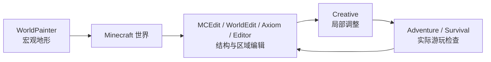

在 Creative Mode 里盖一栋房子时，玩家仍然会对准一块地，放下一块方块，再放下一块。不同的是，很多原本会打断施工的事情消失了：不需要先砍树，不需要搭脚手架爬到屋顶，不需要担心从高处摔死，也不用因为石英不够再跑一次 Nether。官方对 Creative 的描述一直很直接：无限资源、飞行、近乎不受伤害、瞬间破坏方块，让玩家把注意力更多放在建造本身。[^creative]

但如果要修一座几百米长的城墙，问题很快又会出现。设计已经想好了，接下来只是把同一段结构复制几十次；山坡的形状也已经决定，只差把几万块土石推成正确轮廓。继续逐块放置并不会增加新的设计判断，只会增加鼠标点击。

于是 Minecraft 的创作世界里出现了越来越多不同的工具：Structure Block、WorldEdit、Axiom、WorldPainter，以及今天的 Bedrock Editor。它们看上去都在“帮助玩家更快地盖东西”，但实际上解决的并不是同一个问题。

> **Creative Mode 为什么存在？什么时候逐块建造已经不够，需要更高层的选择、复制、笔刷、变换甚至外部地形工具？这些工具应该怎样分工，而不是互相取代？**

## Creative Mode 改变了什么

### Creative Mode 首先改变的是成本

上一章已经比较过 Survival 与 Creative 中建造的意义。这里更具体地看 Creative 做了什么。

#### 它没有发明另一套建筑系统

Creative 最重要的一点，恰恰是它并没有要求玩家学习另一套世界表示。

玩家仍然面对同样的方块、同样的坐标、同样的碰撞与大部分环境规则。建筑最终仍然写进普通 Minecraft 世界，之后可以被 Survival 玩家走进去、拆掉、使用。

变化主要发生在玩家身上：

- 方块不再需要先采集；
- 大部分伤害和饥饿压力消失；
- 可以飞行，施工不再依赖脚手架和地形；
- 方块可以迅速拆除并重新尝试。[^creative]

所以 Creative 更像是在降低**施工成本**，而不是把 Minecraft 切换成另一种几何系统。

这也是为什么从 Survival 切到 Creative 后，一座门仍然是那座门，一段红石线路仍然可以工作，水和沙也不会因为玩家获得无限资源就变成纯装饰。

#### 飞行改变的不只是移动速度

飞行尤其重要。在 Survival 里，建筑高度会带来真实的施工成本：玩家要搭脚手架、垫方块、爬梯子，还可能因为失足掉下来。Creative 的飞行把这些成本大幅压低，也让玩家可以不断切换观看尺度。

近看时调整窗框，退后几十格看整体比例，再飞到屋顶检查轮廓，这种移动本身就变成了设计工具。但它仍然是第一人称 / 第三人称世界中的移动，而不是传统 3D 编辑器里完全脱离玩家身体的自由视口。这个差别说明 Creative 的职责比较克制：**让玩家更自由地处在世界里建造，而不是一次解决所有 worldbuilding 问题。**

### 逐块建造什么时候开始变慢

Creative 很适合快速试错，但“无限资源 + 飞行”并不会自动解决规模问题。

#### 重复劳动和设计劳动不是同一件事

假设一座城墙的塔楼已经设计完成。

第一次搭塔楼，需要决定比例、材料、窗洞、屋顶、楼梯和内部空间；第二十次把完全相同的塔楼再搭一遍，绝大部分决定已经消失了。

这两种劳动都需要时间，却不是同一种创作。

同样的问题还会出现在：

- 把一整栋建筑向左移动十格；
- 把所有石砖替换成另一种材料；
- 把一片森林清空；
- 把同一栋房子复制成村庄；
- 把山坡整体削平或抬高；
- 发现整个大厅少算了一格，需要整体平移。

这时逐块编辑的优势——简单、直观、每一步都能看懂——开始反过来变成成本。

于是创作工具的基本问题出现了：

> **能不能让玩家用更接近设计意图的尺度和动作来编辑世界，而不必把所有想法都拆成一次次单块点击？**

这里的变化并不只有“从一块变成一片”。有些工具把编辑尺度放大到结构、选区和整片地形，有些工具反而把一块方块继续切细；还有一些工具根本不改变世界的数据粒度，而是增加笔刷、雕刻、平滑、变换和预览等新的编辑动作。

## 从逐块建造到世界编辑

Creative Mode 仍然保留 Minecraft 最直接的建造方式：站在世界里，看准位置，再一块一块放下去。它的优势是低门槛、直观，而且作品从一开始就处在真实游戏空间里。

但大型创作很快会遇到另一个问题：作者脑中想操作的，往往已经不是“这一块方块”。

### Structure Block：让结构可以复用

Structure Block 是一个很自然的第一步。

它可以保存一片区域中的方块与实体，再把这段内容加载到别处；加载时还能旋转、镜像。Bedrock 官方教程甚至直接用“保存一栋木屋，再不断复制它形成村庄”作为示例。[^structure]

于是，一栋房子不再只能靠重新施工来复制，而可以先成为一个**可复用的结构片段**。

这种变化很重要，因为它第一次把“我已经做好的这一部分”变成一个可以继续操作的对象。地图作者可以先做几种住宅、街道、塔楼和机关，再把它们组合成更大的场景。

它有一点类似 prefab 思维，但不要直接等同。Structure 仍然只是方块与实体区域，没有复杂的层级、参数化组件和完整对象模型。它解决的是一个更具体的问题：

> **已经设计好的这一段，能不能不用再做一遍？**

### WorldEdit：让区域本身成为操作对象

Structure Block 擅长复用完整片段，但很多编辑意图并不是“复制这栋房子”，而是：

- 把这一整片石头换成空气；
- 把大厅整体向左移动十格；
- 把同一种材料批量替换；
- 复制一片城区；
- 用 Brush 修整一整面山坡。

WorldEdit 的核心因此不是某一条命令，而是 **Selection / Region**。玩家先选中一片区域，再对它执行 Fill、Replace、Copy、Paste、Rotate、Brush 等操作。官方文档把 Selection 作为 WorldEdit 的基础能力，并提供 Cuboid、Polygon、Ellipsoid、Cylinder 等不同选区形式。[^worldedit-selection]

原本的意图：

> “在这里放一块石头。”

可以变成：

> “把这一整个区域替换成石头。”

或者：

> “复制这一片，旋转 90°，再粘到那边。”

WorldEdit 官方文档本身就把批量创建、替换、删除大量方块、Schematic、Brush 和 Terrain Sculpting 列为主要能力。[^worldedit] 它真正减少的，是那些设计已经完成、却还需要手工重复几百次甚至几万次的操作。

### Axiom 与 Bedrock Editor：从命令走向直接操作

WorldEdit 很强，但大量能力需要通过命令、Pattern、Mask 和 Selection 表达。熟悉以后很精确，刚接触时却需要把脑中的空间意图先翻译成工具语言。

Axiom 和 Bedrock Editor 展示了另一条路线：**让这些操作更多地变成可视化的直接编辑。**

Axiom 把自己描述为 Minecraft world editing 的 all-in-one tool，提供自定义 Editor UI，以及 Magic Select、Box Select、Freehand Select、Painter、Biome Painter、Sculpt、Smooth、Flatten、Extrude 等工具。[^axiom]

这里重要的不只是“能一次改更多方块”。Painter、Sculpt、Smooth、Extrude 这些能力本身就是新的编辑动作。作者想的是“把山坡修圆一点”时，不必一定把问题翻译成一串 Replace / Mask / Selection 命令，而可以直接对形状进行绘制和塑形。

Bedrock Editor 则把类似的编辑语言正式带进 Mojang 自己的 Creator Tools。官方目前提供 Multiblock Selection、Brush、Undo / Redo、复制、移动和形状操作；Selection Tool 可以使用 Marquee、Freehand Brush 与 Magic Select，并对选区执行 Fill、Transform、Nudge。[^editor-tools][^editor-selection][^editor-brush]

这说明 Minecraft 的世界仍然可以保持普通方块数据，但创作界面并不需要永远停留在“一块一块放”。

### MCEdit：把整个存档当成可编辑世界

在 Mojang 推出今天的 Bedrock Editor 很久以前，社区已经尝试过把 Minecraft 世界放进一个更接近传统地图编辑器的界面里。

MCEdit 从 2010 年前后开始发展，定位就是 Minecraft 的 world / saved-game editor。它可以直接打开已有世界，在独立的 3D 视图里选择大范围方块，进行 Clone、Fill、Replace、导入 / 导出 Schematic、创建或删除 Chunk、移动出生点等操作；后来的 MCEdit 2 还继续扩展了 Brush、不同形状的 Selection 和对实体 / Block Entity 的编辑。[^mcedit]

这和 WorldEdit 有一个很直观的差别：WorldEdit 通常仍然发生在运行中的 Minecraft 世界里，而 MCEdit 把存档本身拿到游戏之外编辑。作者不需要先以“玩家”的身份站在现场，再通过命令改变世界；世界数据本身就是编辑器的对象。

MCEdit 今天已经不再是现代 Minecraft 制作流程的主流工具，原始 1.x 代码也明确停止开发，MCEdit 2 最终停留在早期版本阶段。[^mcedit-status] 但它在历史上非常重要，因为它很早就证明了：

> **Minecraft 世界既可以被“玩”，也可以像关卡或地图资产一样被单独打开、观察和编辑。**

### WorldPainter：地图生成和世界编辑并不是一回事

WorldPainter 和 MCEdit 看起来都在游戏之外处理世界，但它们解决的是不同问题。

WorldPainter 官方把自己称为 Minecraft Java Edition 的 **interactive map generator**：像使用绘图软件一样绘制地形、材料、植被、雪和冰，再把结果导出成 Minecraft 地图。[^worldpainter] 它自己的 FAQ 甚至特意强调：

> **WorldPainter is a map generator, not an editor.**[^worldpainter-faq]

它更适合在宏观尺度上决定“大陆是什么形状、山脉在哪里、河流怎么走”，而不是打开一个已经完成的房间，把窗户向右挪一格。WorldPainter 内部的 World 也是一种比真实 Minecraft 地图更简化、更抽象的表示，导出时才根据这些信息生成实际方块。[^worldpainter-concepts]

因此，MCEdit 和 WorldPainter 正好代表两种不同的“游戏之外创作”：

| 工具 | 更像什么 | 主要用途 |
| --- | --- | --- |
| **MCEdit** | 世界 / 存档编辑器 | 打开已有世界，直接修改方块、结构、Chunk 与实体数据 |
| **WorldPainter** | 地图 / 地形生成器 | 在导入游戏以前设计大陆、山脉、材料与宏观地形 |

把它们和 Creative、WorldEdit、Axiom、Bedrock Editor 放在一起以后，Minecraft 的创作工具就不再是一条简单的“从小到大”升级线，而是不同工作方式之间的分工。

## 专业工具怎样改变创作过程

前面的工具解决的是“作者可以直接做什么”；到了这里，另一个问题开始变重要：**作者怎样试、怎样改，以及做错以后怎样回来。**

### 命令、可视化和玩家视角各有用途

WorldEdit 的命令式工作流精确、可复制，也很适合熟练用户；Axiom 和 Bedrock Editor 则更强调直接选择、拖动、绘制和预览。两种方式并不是谁取代谁，而是不同表达方式。

Bedrock Editor 还保留了 Crosshair Mode，让创作者可以在更接近普通 Minecraft 的方式里进入世界观察和操作；Tool Mode 与 Crosshair Mode 可以切换。[^editor-mode]

于是创作流程可以在几种视角之间往返：

这不是固定流程，也不是工具排名。它只是说明：大型世界创作往往需要在**高层编辑**和**真实玩家体验**之间反复切换。

### Undo、预览和历史记录改变试错成本

Creative 可以瞬间拆方块，但“拆回去”并不等于真正的 Undo。如果刚刚误删的是一大块复杂建筑，手工重建原状会非常痛苦。

专业创作工具通常把历史记录当作基本能力。Bedrock Editor 的 Tool Mode 明确提供 Undo / Redo；WorldEdit 也长期维护 Edit Session 与 History，用于撤销大范围操作；早期 MCEdit 同样提供 Undo。[^editor-mode][^worldedit][^mcedit]

当错误可以低成本回退，创作者更愿意尝试整体移动、替换和大范围塑形；当每一次尝试都可能不可逆地毁掉几个小时的作品，工具会自然让人保守。

所以创作自由不只来自：

> “你能不能做这个操作？”

还来自：

> **“做错以后能不能安全回来？”**

### 编辑能力越强，安全边界也越重要

批量修改世界非常方便，也意味着一次操作可以破坏更多东西。Creative 误挖一块墙，影响有限；WorldEdit 或 Editor 的错误选区可能一次删除整座城市。

服务器里如果所有人都拥有这种能力，性能、破坏和责任边界都会迅速变成问题。WorldEdit 文档本身就把大量操作绑定到 Permission；Bedrock Editor 也以专门的 Editor 项目和 Creator Tools 工作流提供，而不是把全部能力直接放进每一个普通 Survival 世界。[^worldedit][^editor-tools]

因此，专业编辑能力最终一定会碰到权限问题：谁可以批量修改世界，谁能撤销谁的改动，普通玩家、建筑师和管理员之间应该怎样区分。

## 游戏模式和创作工具应该怎样分工

把 Creative、Editor、WorldEdit、WorldPainter 全部看完以后，Creative 的位置反而更清楚了：它不需要承担所有专业创作需求。

### Creative 的优势是“立刻进入世界”

Creative 没有复杂的项目设置，也不要求先定义选区、导出地图或组织资产库。玩家想到一个小房子，可以立刻开始搭；想试一种墙面，可以随手放出来；完成以后马上就在同一个世界里走进去看。

这种低门槛非常重要。如果所有建造都必须先进入 Editor，Minecraft 最日常的创造活动反而会变重。

所以 Creative 最适合保留的是：

> **低门槛、直接、和普通游玩连续的建造。**

### 专业工具负责减少已经没有设计价值的重复劳动

当项目越来越大，工具可以逐步接管另一类工作：复制、替换、平移、批量地形、结构管理和安全撤销。这并不会自动让作品变得更好。WorldEdit 可以一秒铺满十万块石头，但“这里到底该不该有一堵石墙”仍然需要作者决定；WorldPainter 可以很快生成山脉，却不能替创作者决定这片地形是否适合实际玩法。

因此，工具真正应该减少的，不是所有劳动，而是那些**设计判断已经完成、剩下只有机械重复**的劳动。这个边界在 Survival 中又会不同：玩家可能恰恰把“亲手挖完一座山”“自己铺完一条铁路”视为作品意义的一部分，对这种玩法来说，效率并不是唯一目标。

所以不能从专业地图制作反推“所有 Minecraft 都应该默认有 WorldEdit”。

创作工具的职责取决于活动本身：

- **在玩 Survival**：施工成本可能就是体验；
- **在 Creative 自由建造**：快速试错通常比资源成本更重要；
- **在制作大型地图或服务器场景**：重复劳动很可能只是在拖慢设计；
- **在制作宏观地形**：甚至需要离开普通游戏视角，用地图级工具思考。

这比把“游戏模式”和“编辑器”争论成谁更纯粹，更接近真实的 Minecraft 创作生态。

## 这一章留下什么

Creative Mode 与各种创作工具并不处在一条简单的升级链上。更准确地说，它们承担的是不同的创作任务，并提供不同的编辑能力与工作流：

- **Creative Mode 主要取消资源、伤害和移动限制，让玩家仍以普通 Minecraft 的方式更自由地逐块建造。**
- **当设计意图已经明确，继续逐块重复同一操作就可能从创作变成机械劳动。**
- **Structure Block 让已经完成的局部可以保存、复制和旋转；WorldEdit 则进一步把选区、批量替换、Brush 与 Schematic 变成日常世界编辑能力。**
- **Axiom 与 Bedrock Editor 说明，Minecraft 世界可以继续保持方块表示，同时使用选择、笔刷、变换、预览等更接近专业编辑器的交互。**
- **MCEdit 曾把完整 Minecraft 存档带进独立的 3D 世界编辑器；WorldPainter 则更专注于地图与宏观地形生成。两者说明“游戏之外创作”本身也存在不同工具分工。**
- **Undo / Redo、预览和历史记录降低了大尺度试错成本，是专业工具和普通逐块建造之间很重要的差别。**
- **工具越能一次改动大片世界，权限和治理就越重要；强编辑能力不适合无条件地交给每一个玩家。**
- **最合适的工具取决于创作者此刻要完成什么：局部搭建、结构复用、批量世界编辑、可视化塑形、离线存档修改或宏观地形生成，而不是单纯追求“更强”的工具。**

下一章[《红石、机器与自动化》](/design/redstone-automation)会从“改造空间”进入“编排因果”：方块不再只是组成墙和道路，还会传递信号、保存状态、推动其他方块，最后长成自动农场、交通系统甚至计算机。

[^creative]: Mojang Studios，《What is Minecraft?》与《Creative vs Survival Mode》，Minecraft.net。官方把 Creative 描述为拥有无限资源、飞行、近乎无伤害和瞬间破坏方块的模式，主要让玩家专注于创造。https://www.minecraft.net/en-us/article/what-minecraft https://www.minecraft.net/en-us/article/creative-vs-survival-mode

[^structure]: Microsoft Learn，《Structure Blocks and the Structure Command Tutorial》，2026 年访问。官方教程演示通过 Structure Block 保存一栋建筑，再进行加载、旋转与重复放置，用于快速组成更大的场景。https://learn.microsoft.com/en-us/minecraft/creator/documents/structures/structureblockscommandtutorial

[^worldedit-selection]: EngineHub，《Selection - WorldEdit Documentation》，2026 年访问。文档把 region selection 作为 WorldEdit 的基础，并列出 cuboid、polygon、ellipsoid、cylinder 等不同选区模式。https://worldedit.enginehub.org/en/latest/usage/regions/selections

[^worldedit]: EngineHub，《WorldEdit Documentation》，2026 年访问。官方文档列出批量创建 / 替换 / 删除方块、copy / paste、schematic、brush、terrain sculpting 与历史恢复等主要能力。https://worldedit.enginehub.org/en/latest/

[^axiom]: Moulberry，《Axiom》，2026 年访问。项目把自己描述为 Minecraft 世界编辑工具，提供 Editor UI、Selection、Painter、Biome Painter、Sculpt、Flatten、Smooth、Extrude 等可视化工具。https://axiom.moulberry.com/

[^editor-tools]: Mojang Studios，《Minecraft Creator Tools》，2026 年访问。官方 Editor 支持 Multiblock Selection、Brush Tools、Undo / Redo，以及对世界区域的复制、移动和形状编辑。https://www.minecraft.net/en-us/creator/tools

[^editor-selection]: Microsoft Learn，《Minecraft Bedrock Editor Selection Tool》，2026 年访问。Selection Tool 支持 Marquee、Freehand Brush 与 Magic Select，并可对选区执行 Fill、Transform、Nudge 等操作。https://learn.microsoft.com/en-us/minecraft/creator/documents/bedrockeditor/editorselectiontool

[^editor-brush]: Microsoft Learn，《Minecraft Bedrock Editor Brush Tool》，2026 年访问。Brush Tool 可以用不同形状与尺寸绘制方块，用于快速塑造地形和形状。https://learn.microsoft.com/en-us/minecraft/creator/documents/bedrockeditor/editorbrushtool

[^editor-mode]: Microsoft Learn，《Minecraft Bedrock Editor Modes》，2026 年访问。Editor 区分 Tool Mode 与 Crosshair Mode；Tool Mode 提供 selection、brush、paste preview、Undo / Redo 等编辑能力，两种模式可以切换。https://learn.microsoft.com/en-us/minecraft/creator/documents/bedrockeditor/editortoolmode

[^mcedit]: MCEdit Project，《MCEdit》与《About MCEdit 2.0》，2016 年存档，2026 年访问。MCEdit 把 Minecraft 存档视为可直接打开的 3D 世界，支持大范围 Selection、Clone、Fill / Replace、Schematic 导入导出、Chunk 创建 / 删除、Brush 与部分实体 / Block Entity 编辑。https://www.mcedit.net/ https://www.mcedit.net/about.html https://github.com/mcedit/mcedit/blob/master/README.html

[^mcedit-status]: MCEdit Project，GitHub repositories，2026 年访问。MCEdit 1.x 仓库明确标注 no longer developed；MCEdit 2 是后续重写项目，但官方站点长期停留在旧 Java 版本支持与 2016 年 Beta 阶段。https://github.com/mcedit/mcedit https://github.com/mcedit/mcedit2 https://www.mcedit.net/archive.html

[^worldpainter]: WorldPainter，《WorldPainter》，2026 年访问。项目把自己描述为 Minecraft Java Edition 的 interactive map generator，可以像绘图软件一样绘制地形、材料、植被、雪与冰，再导出为 Minecraft 地图。https://www.worldpainter.net/

[^worldpainter-faq]: WorldPainter，《FAQ》，2026 年访问。官方明确写道“WorldPainter is a map generator, not an editor”，并建议对现有世界进行建筑级修改时使用 Creative、WorldEdit 等工具。https://www.worldpainter.net/trac/wiki/FAQ

[^worldpainter-concepts]: WorldPainter，《Manual / Concepts》，2026 年访问。WorldPainter 的 World 是比实际 Minecraft map 更简化的抽象表示，导出时才根据高度、地表类型、图层等信息生成真实方块。https://www.worldpainter.net/trac/wiki/Manual/Concepts