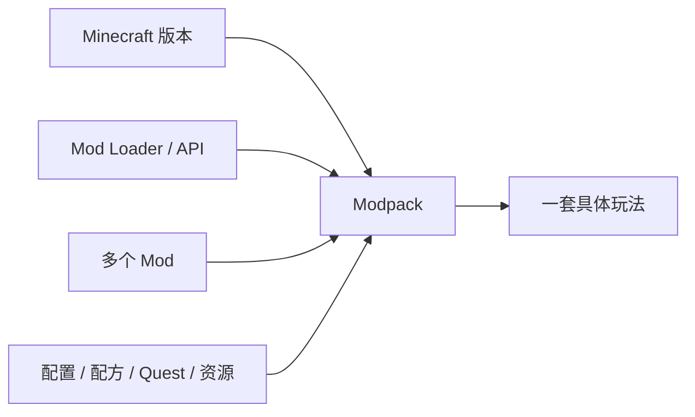

给 Minecraft 装上一个新矿物，世界看起来还是很像原来的 Minecraft；装上一套工业系统以后，玩家可能开始围绕产线、电力和物流安排整个基地；再换成 RPG 或生物收集模组，原本熟悉的探索、战斗和成长又会被重新解释。

这些变化都叫“Mod”，但它们显然不是同一种改动。

上一章讨论了 Command、Data Pack 和 Add-On 怎样在官方扩展层里编排事件、数据和玩法。模组再往前走一步：它可以直接修改或扩展游戏程序本身，因此不再只受现有 Command、Registry、Component 或 Script API 的能力边界约束。Fabric 的官方文档对这一点说得很直接：Mod 可以给原版增加新功能，也可以改变已有机制；Forge 与 NeoForge 同样提供面向 Java Edition 的模组 API 和加载体系。[^fabric][^forge][^neoforge]

但“能改得更深”并不等于“模组天然更高级”。真正值得研究的是：

> **当创作者可以改变更多底层规则以后，Minecraft 为什么能被改造成截然不同的玩法？这些变化怎样重新组织玩家目标，而模组生态又为什么必须付出版本、依赖和兼容成本？**

## 模组到底改变了什么

把 Mod 分成“加内容”和“加系统”很有帮助，但这条二分仍然不够。很多作品会同时新增方块、改配方、加入界面、修改世界生成，还提供一套完全新的资源循环。更准确的做法，是看它究竟动到了原游戏的哪一层。

### 内容扩展让已有结构变得更丰富

最容易理解的是增加内容：新的方块、植物、生物、结构、装备、装饰和变体。玩家面对的基本问题仍然相似，只是选择更多、世界更丰富。

这类模组并不“浅”。建筑模组可以极大改变玩家的表达空间，新的地形和生物也会改变探索体验。只是从设计关系上看，玩家仍然主要在使用原有的动词：采集、放置、合成、战斗、探索。

### 规则修改会改变熟悉行为的意义

另一类模组不一定增加很多内容，却会修改原有规则。饥饿更严厉、死亡惩罚更高、方块受重力影响、世界生成完全不同、战斗节奏重新设计，都会让玩家重新理解原本熟悉的东西。

这类改动最适合提醒我们：Minecraft 的体验并不只由“有哪些东西”决定。哪怕方块列表几乎没变，移动速度、资源分布、耐久、伤害、生成和掉落关系一变，玩家的目标和节奏也可能完全不同。

### 系统扩展会加入新的因果和资源循环

再往前一步，是加入原版里并不存在的完整系统：新的能量、机器、法术、能力、技能、物流、生态或生物养成。此时玩家不只是多了一件物品，而是多了一套需要学习和利用的关系。

Create 是一个很直观的例子。项目本身把重点放在 Building、Decoration 和 Aesthetic Automation，并明确强调它不希望玩家只在一堆 GUI 里点按钮，而是让齿轮、传动和运动机构直接存在于世界中。[^create] 这里新增的不只是“几台机器”，而是一整套关于旋转、传动、机械加工和自动化的新因果。

Botania 则走了另一条路线。它以自然魔法为主题，却明确把自己描述成 tech mod：核心围绕 Mana、花朵和装置，同时刻意限制管线、GUI 和数字显示，鼓励玩家在世界里搭建和理解系统。[^botania] 这说明“工业 / 魔法”更多是题材差异；真正影响玩法的是系统要求玩家学习什么、操作什么、优化什么。

从这个角度看，Mod 的深度可以粗略写成：

| 改动层级 | 主要改变什么 |
| --- | --- |
| **内容** | 世界里有哪些对象与选择 |
| **规则** | 已有对象怎样行动、生成、消耗和互动 |
| **系统** | 增加新的资源循环、状态和因果关系 |
| **整体玩法** | 重新安排目标、进度、节奏甚至核心循环 |

这些层级会重叠，但它们比“这个模组加了多少东西”更能解释为什么两个体量相近的 Mod 会带来完全不同的游戏。

## 系统模组怎样重新组织玩家目标

模组最有意思的时候，通常不是增加一个孤立功能，而是让玩家开始用新的方式理解“接下来该做什么”。

### 工业系统把资源问题变成生产问题

原版里缺铁，最直接的答案往往是继续寻找、开采，或者建立某种已有资源生产方式。工业类模组会进一步追问：资源能不能自动运输、加工、倍增、缓存，生产过程怎样供能，产线能不能继续扩张。

一旦这些问题成立，基地布局也会变化。仓库旁边需要物流，机器之间需要连接，新的生产设施又会制造新的材料需求。玩家的注意力从“找到一批资源”逐渐转向“设计一套持续运行的生产系统”。

这并不意味着工业玩法比原版更先进，只是目标结构发生了变化。原版自动化也会出现工程问题，但完整工业模组通常会把这种工程关系做得更密、更连续、更容易成为长期主线。

### 魔法系统可以重新定义什么叫资源和进步

魔法模组表面上可能只是在把电力换成 Mana，但好的系统往往会连获取方式、空间布置、风险和成长节奏一起改变。

Botania 就很适合作为对照：它刻意让大量交互留在世界里，Mana 生产和装置布局仍然需要玩家安排空间，而不是单纯打开菜单购买技能。[^botania] 因此“魔法”不必等于角色面板；它同样可以是一套世界规则。

这也说明模组提供的设计空间很大。同样叫“魔法”，可以做成法术快捷栏、研究树、仪式系统，也可以做成类似工程的资源网络。题材不会自动决定玩法结构。

### RPG 与生物收集会把成长重新写回角色和队伍

另一类 Mod 则会把重心明显移向角色：等级、职业、属性、技能、任务、Boss、装备稀有度，甚至伙伴和生物收集。此时原版以世界、物品和基础设施为主的成长，会与更传统的 RPG progression 并存，甚至被它覆盖。

这类玩法不需要被解释成“填补原版缺失”。它只是证明 Minecraft 的世界、存档和交互基础可以承载另一种目标结构。玩家仍然住在方块世界里，但每天上线的理由可能已经从建基地变成练级、抓生物、刷装备或推进任务。

所以模组对原版最有价值的启发之一，不是告诉我们“原版应该加 RPG”，而是让我们看见：

> **同一个底层世界，可以承载多种彼此冲突的进度结构。**

原版做出的选择只是其中一种。

## 整合包为什么本身也是设计

如果一个 Mod 已经能改变玩法，那么几十个甚至几百个 Mod 同时存在时，问题就不再是“把它们都装上”这么简单。

### 兼容不等于组合得好

两个 Mod 能同时启动，只能说明它们没有立刻崩溃，不代表它们形成了好的游戏。

不同模组可能重复矿物、拥有彼此独立的能量体系、给出完全不同的装备强度，也可能让一个系统轻易跳过另一个系统原本设计的 progression。一个单独看很平衡的机器，放到另一套资源循环里可能立即失去意义。

所以 Modpack 作者做的不只是依赖管理。他需要决定哪些系统共存、怎样修改配方、哪些资源应当稀缺、玩家应该先接触哪一套系统，以及不同模组的终局怎样互相连接。

### Quest Book 可以把开放系统重新编排成路线

现代大型整合包经常使用任务系统来解释和组织大量 Mod。这里的 Quest 不一定只是“做十个齿轮奖励五块铁”，更重要的作用是告诉玩家：这一堆互不相识的系统应该按什么顺序被理解。

这会形成和原版很不同的体验。原版允许玩家长时间不知道下一步；一些整合包则会明确安排科技阶段、门槛、跨模组配方和后期目标。

两者没有谁天然更正确。整合包的价值恰恰在于它可以针对一群已经主动选择这套体验的玩家，做比原版默认设计更激进的取舍。

### Modpack 是一种“配置后的 Minecraft”

FTB 官方应用目前仍把 Modpack 当作独立的可创建、安装、更新和分享的体验；CurseForge 也按游戏版本、Mod Loader 和类别管理大量整合包。[^ftb][^curseforge]

这意味着玩家实际启动的往往不是“Minecraft + 一堆 Mod”，而是一份被固定过的组合：特定 Minecraft 版本、特定 Loader、特定 Mod 版本，再加配置、脚本、资源包和任务。

可以把它理解成：

因此，策展和集成并不是模组开发完成后的附属工作，它本身就在重新设计游戏。

## 模组生态为什么总伴随着版本和依赖成本

模组可以改变更深的程序层，也就更容易受到程序变化影响。这个代价不能等到卷三才第一次出现，因为它直接影响玩家怎样选择和理解 Mod。

### Mod 不只依赖 Minecraft，还依赖 Loader 和 API

今天 Java Edition 的主流模组生态并不是一个统一接口。Forge、NeoForge、Fabric 等工具链各自提供加载机制、事件、API 和开发工具。Fabric 官方文档把生态拆成 Loader、Fabric API 与 Loom；NeoForge 也有自己的 Mod API 和开发工具。[^fabric][^neoforge]

这意味着一个 Mod 的“版本”至少需要回答几个问题：支持哪一个 Minecraft 版本、使用哪套 Loader、还依赖哪些 API 或其他 Mod。Fabric 的玩家文档也明确提醒，同一个 Mod 必须匹配正确的 Minecraft 版本和 Loader。[^fabric-install]

因此，Mod 不是一个脱离环境的内容包，而是软件依赖图中的一个节点。

### 更新 Minecraft 可能等于一次移植

Minecraft 的类、Registry、网络、渲染和内部行为会持续变化。Loader 与 API 又会跟着变化，所以一个旧 Mod 不能默认在新版本直接运行。Fabric 当前甚至为相邻版本提供专门的 Porting Guide；NeoForge 也维护 Minecraft 版本之间的 Migration Primer。[^fabric-port][^neoforge]

对玩家来说，这会形成非常现实的选择：升级到新版本，还是留在已经成熟的 Modpack；等待某个核心 Mod 更新，还是寻找替代品。很多 Modded Minecraft 社区因此长期停留在某个版本，并不是因为那个版本本身“最好”，而是因为周围已经形成稳定的工具链和内容生态。

### 依赖越多，组合空间越大，故障空间也越大

整合包把很多 Mod 放进同一进程，系统之间就可能出现配方冲突、注册冲突、Mixin 冲突、性能叠加和行为假设不一致。Loader 可以管理依赖，却无法自动判断两个设计是否逻辑兼容。

所以 Modpack 开发会逐渐接近一种真正的软件集成工作：固定版本、测试更新、排查日志、调整配置，还要确保旧存档升级后不会直接失效。NeoForge 甚至把 Modpack Development 单独作为官方文档的一部分。[^neoforge]

这部分的技术细节会留给卷三[《模组与插件架构》](/impl/modding)。在设计卷里只需要先承认：**模组自由并不是免费的，它把一部分官方维护成本转移给了作者、整合包维护者和玩家。**

## 官方扩展层、模组与插件并不是一条强弱排名

经过前几章，很容易画出一条看似合理的梯子：Command < Data Pack < Add-On < Mod，然后得出“越底层越强，越值得用”。真实创作并不是这样。

### 选择扩展层首先取决于作品怎样被使用

一张冒险地图如果用 Data Pack 就能完成，改成要求玩家安装特定 Loader 和几十个客户端 Mod，反而会提高进入门槛。一个纯服务端小游戏如果 Plugin 已经足够，也未必需要修改客户端。

反过来，如果设计真的需要全新的渲染、输入、网络协议或底层实体行为，硬把它塞进 Command 和每 Tick 扫描，也会让实现变得脆弱。

所以工具的选择仍然服从上一章那条原则：

> **尽量让扩展层接近设计意图，同时考虑作品怎样部署和维护。**

### Java Mod 与 Bedrock Add-On 的边界也在变化

尤其不能把“Mod = Java、官方扩展 = 只能改数据”写成固定事实。上一章已经看到，Bedrock Script API 和 Custom Components 可以执行程序逻辑；Java Data Pack 也在不断开放更多 Registry 和数据定义。

Java Mod 的优势仍然是能够更深入地修改客户端和游戏程序，但官方扩展面的能力会随版本变化。今天必须写 Mod 才能完成的需求，未来可能被一个正式 API 覆盖；反过来，某些底层行为仍然只有 Mod Loader 能触及。

因此“原版 / 官方扩展 / 模组”的边界不是一条永恒技术线，而是一条不断移动的产品边界。

## Modding 对理解原版真正有什么帮助

旧稿很容易把这一章写成“哪些好 Mod 应该被 Mojang 收编”。这个问题当然可以讨论，但它并不是 Modding 对设计研究最重要的价值。

### 模组像一组大规模设计实验

原版只能同时选择一种默认规则，而模组可以同时试很多种答案。

一种工业 Mod 可以把物流和加工推到中心，另一种刻意减少 GUI；一个 RPG Mod 可以让角色等级主导成长，另一个生存 Mod 可以让温度、疾病和体力成为主要压力。它们彼此冲突也没关系，因为玩家可以选择安装哪一种。

所以模组生态很像一个巨大的实验空间：

- 如果自动化更强，玩家会怎样组织基地？
- 如果成长更多写进角色，建造和物品还剩多少重要性？
- 如果世界生成更危险，探索会不会重新成为核心？
- 如果引入完整任务线，玩家还会不会自己设定目标？

这些实验不一定给出普遍答案，但它们能帮助我们看见原版究竟做了哪些取舍。

### “受欢迎”不能直接推出“适合成为默认”

某个 Mod 很成功，只能证明有大量玩家愿意主动选择它，不能自动证明所有新世界都应该默认拥有同样的系统。

默认内容需要考虑新玩家学习成本、不同玩法的兼容、服务器性能、跨平台实现、长期存档，以及它会不会让原有系统失去作用。Mod 则可以明确面向某个兴趣群体，甚至要求玩家先接受完全不同的 progression。

但反过来，也不能因为“这是 Mod”就认为官方永远不该吸收其中的想法。Minecraft 历史上本来就存在社区创作、官方功能与工具生态互相影响的过程；卷一已经在[《模组作为第二作者》](/history/mods-as-authors)里讨论过这些历史。

更稳妥的判断不是给 Mojang 一张收编清单，而是逐项问：

> **这个想法如果成为默认，会改变谁的玩法？它解决了什么问题，又会引入什么新的学习、兼容和维护成本？**

### 有时最值得吸收的不是功能，而是接口

模组反复解决同一种问题时，官方不一定要把某个具体 Mod 整套搬进游戏。另一种可能，是把更稳定的数据接口、事件、组件、创作工具或扩展点开放出来，让不同作者继续给出不同答案。

这一点正好连接前两章：Structure Block、Editor、Data Pack、Script API、更多数据驱动 Registry，都是“增加创作者可表达空间”的方式。它们不会替代 Modding，却可以减少一些需求必须侵入底层程序才能实现的情况。

于是 Modding 对原版的反馈不只有“这个功能很好，请加入”，还有另一种更基础的形式：

> **这里长期有人想改，但现有扩展层表达不了。**

这类信号对于一个长期平台同样重要。

## 模组与玩法扩展最难平衡的几组关系

Modding 提供巨大自由，也把很多原版不需要直接面对的矛盾暴露出来：

| 关系 | 一边过头 | 另一边过头 |
| --- | --- | --- |
| **内容丰富 vs 系统一致** | 世界显得贫乏 | 大量系统彼此重复、互相跳过 |
| **作者自由 vs 玩家可理解性** | 只能做官方预设的变化 | 每个 Mod 都需要重新学习一款游戏 |
| **深度改写 vs 兼容稳定** | 很多设计无法实现 | 每次版本更新都像重新移植 |
| **Mod 独立性 vs 组合能力** | 只能单独玩 | 为兼容其他 Mod 牺牲自身设计 |
| **整合包自由 vs progression 清晰** | 组合空间有限 | 几百个系统同时出现，玩家无从下手 |
| **官方吸收 vs 生态多样性** | 官方长期忽视高频需求 | 默认系统不断膨胀，第三方答案反而失去空间 |

没有一条简单原则能替这些关系做决定。Create 选择让机械过程尽量存在于世界里，Botania 则主动限制管线、GUI 和数值显示；两者都可以形成成熟玩法，却给出了完全不同的系统答案。[^create][^botania]

模组生态真正有价值的地方，恰恰是这些答案不需要互相消灭。

## 这一章留下什么

模组让 Minecraft 的可扩展性从“重新安排已有内容”继续走向“重新定义系统和目标”。从这一章目前能留下的，是几件相对有限的判断：

- **Mod 不只是增加内容，它还可以修改规则、加入新的系统，甚至重新组织整个 progression；判断影响深度时，比统计新增物品数量更应该看它改动了哪一层关系。**
- **工业、魔法、RPG 等并不是原版设计的“缺失答案”，而是同一个 Minecraft 世界可以承载的不同目标结构。**
- **Modpack 不只是很多 Mod 的集合；版本选择、配方调整、任务、配置和系统排序会共同形成一套新的玩法，因此整合本身就是设计工作。**
- **Java Modding 依赖 Minecraft 版本、Loader、API 和其他 Mod，更新与组合自由会直接转化为兼容和维护成本。**
- **Command、Data Pack、Add-On、Plugin 与 Mod 各自适合不同部署和改动深度，不应该只按“谁更强”排序。**
- **模组最适合作为原版取舍的对照实验：它能证明另一种设计可以成立，却不能仅凭受欢迎程度证明那种设计应该成为所有玩家的默认。**
- **官方从 Modding 中吸收的不一定是完整功能，也可能是新的扩展接口、数据层和创作工具，让社区继续给出多种答案。**

到这里，第三部“创造与扩展”也告一段落。下一章[《多人游戏与共同世界》](/design/multiplayer-world)会把视线从“一个玩家怎样改造和扩展游戏”转向“多个玩家进入同一个世界以后发生什么”：合作、交换、财产、信任、冲突和共同规则，为什么会从同一套方块机制里自然出现。

[^fabric]: Fabric Documentation，[Developer Guides](https://docs.fabricmc.net/develop/)，2026 年访问。官方把 Fabric 描述为 Minecraft: Java Edition 的轻量模组工具链，并明确说明 Mod 可以增加新功能或改变现有机制；生态核心包括 Fabric Loader、Fabric API 与 Loom。

[^forge]: MinecraftForge Documentation，[Forge Documentation](https://docs.minecraftforge.net/en/latest/)，2026 年访问。Forge 官方文档将其定义为 MinecraftForge 的 Modding API，并提供事件、注册、数据生成、配置等开发能力。

[^neoforge]: NeoForged，[NeoForged Documentation](https://docs.neoforged.net/)，2026 年访问。官方文档将 NeoForge 定义为 Minecraft Modding API，并单独提供 Modpack Development 与跨版本 Migration Primer。

[^create]: Create Team，[Create](https://modrinth.com/mod/create)，2026 年访问。项目把 Create 描述为面向 Building、Decoration 与 Aesthetic Automation 的技术 Mod，并强调通过世界中的动态机械组件组合 contraption，而不是主要依赖 GUI。

[^botania]: Vazkii 等，[Botania](https://modrinth.com/mod/botania)，2026 年访问。项目把 Botania 描述为自然魔法主题的 tech mod，围绕 Mana、花朵与装置展开；其公开设计说明明确强调减少 Pipes、GUI 和数值显示，并鼓励自动化与 sandbox contraption。

[^ftb]: Feed The Beast，[FTB App](https://www.feed-the-beast.com/ftb-app)，2026 年访问。官方应用把 Modpack 作为可创建、安装、更新和分享的独立体验，并提供 FTB 与 CurseForge Pack 的管理能力。

[^curseforge]: CurseForge Support，[Installing Minecraft Mods and Modpacks](https://support.curseforge.com/support/solutions/articles/9000196984-installing-minecraft-modpacks)，2025 年更新。文档把 Modpack 作为独立安装与管理单位，并支持按版本、Mod Loader 与类别筛选。

[^fabric-install]: Fabric Documentation，[Installing Mods](https://docs.fabricmc.net/players/installing-mods)，2026 年访问。官方提醒 Mod 必须匹配目标 Minecraft 版本、正确的 Mod Loader 与 Java Edition；大量 Fabric Mod 还依赖 Fabric API。

[^fabric-port]: Fabric Documentation，[Porting](https://docs.fabricmc.net/develop/porting/)，2026 年访问。官方为 Minecraft 新版本提供移植指南，要求同步更新 Minecraft、Loader、Loom、Fabric API 并处理代码变化，说明版本升级对 Mod 可能构成实际迁移工作。