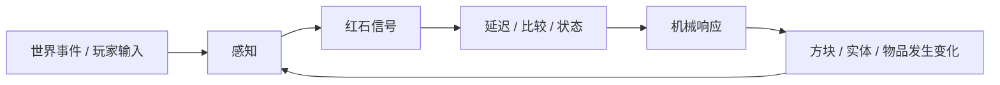
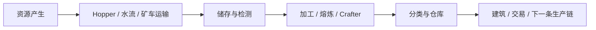

一扇铁门接上按钮，是红石最容易理解的样子。按下按钮，信号出现，门打开；过一会儿，信号消失，门关上。这里几乎没有什么需要“懂红石”的地方，只是一段很直接的因果。

但把视线往后拉，Minecraft 里会出现完全不同的东西：甘蔗成熟后被 Observer 察觉，Piston 把它推掉，水流把掉落物送进 Hopper，物品经过分类系统进入仓库；到了 1.21，Crafter 甚至可以在收到红石脉冲后自动执行合成。[^observer][^hopper][^crafter] 这些机器没有脱离最开始那套方块世界，按钮、线、容器、活塞和作物仍然占据真实空间，也仍然可以被玩家拆掉。

真正值得解释的是：

> **为什么一组相对局部、离散的规则，能够从“按按钮开门”一路长成机器、物流、自动化，甚至计算？哪些能力来自红石本身，哪些又来自其他世界系统和玩家长期发现？**

## 从信号到机器

### 红石先把世界里的变化变成信号

红石常被类比成电路，这个类比在很多时候很好用，但不需要把它当成完整物理模型。Minecraft 并不模拟真实电流、功率和电阻；对玩家更重要的是一套离散、可观察的关系：某个东西产生信号，信号沿一定方式传播，其他方块读取信号，再作出反应。

#### 输入、传输和输出形成最小因果链

按钮、拉杆、压力板、侦测器、Sculk Sensor 等都可以让世界状态转成红石信号；Redstone Dust、Repeater 等负责传播或调整信号；Lamp、Door、Piston、Dispenser、Dropper 等则把信号重新变成可见动作。

从设计上看，最重要的不是这些方块分别长什么样，而是它们可以接成一条链：

只要每一段关系足够稳定，玩家就能把复杂问题拆成很多局部问题：这个事件有没有被侦测到，信号有没有传到这里，这个活塞为什么没动。这种**可以沿空间追踪的因果**，是红石能够被学习和排错的重要前提。

#### Comparator 让机器开始“读取状态”

红石不只有开和关。Comparator 可以比较或相减不同信号强度，还可以读取许多容器和方块的状态。Mojang 对 Comparator 的介绍就以箱子为例：箱子越满，Comparator 输出越强，从空箱的 0 到满箱的 15。[^comparator]

这一步很重要，因为机器第一次不只是响应一个按钮，而是开始根据**世界当前处于什么状态**作出反应。仓库快满时亮灯，熔炉里有没有东西影响后续流程，Crafter 哪些槽位被占用也可以被 Comparator 读取；机器不必理解“库存”这个抽象概念，只需要把某些状态映射成稳定信号。

### 机器为什么能从几块方块继续长大

红石机器的复杂度并不是因为单个方块特别复杂。恰恰相反，很多元件只做一件很小的事，复杂度来自这些小关系可以继续连接。

#### 状态让机器不必只活在当前一刻

如果每个装置只能对当前输入立即反应，那么很多东西只能是机关。机器开始变复杂，需要能够记住：刚才发生过什么，现在应该处在哪一种状态。

玩家可以用反馈回路、Torch、Repeater、Comparator、Piston 结构等方式构造锁存和存储；某些后来加入的方块又提供更直接的状态变化。具体电路并不需要在这里展开，重要的是红石允许**当前输出影响未来输入**。有了状态，门可以记住锁没锁，计数器可以记住已经发生多少次事件，排序和加工系统也可以等待条件满足以后再继续。

#### 时间让动作可以被安排顺序

机器还需要回答另一个问题：

> 哪件事先发生？哪件事后发生？

Repeater 提供可调延迟，Observer 会在侦测到变化后输出短脉冲，很多装置又会利用方块更新和其他时序关系安排动作。[^observer]

于是红石不只是把信号从 A 搬到 B，还可以组织**顺序、节奏和等待**。活塞门为什么能够先收回一层、再移动另一层；物品为什么不会在分类器里一起冲过去；自动农场为什么能隔一段时间才触发，都离不开时间关系。

卷三会具体讨论 tick、更新顺序和实现细节。这里更重要的是玩家层面的事实：**时间同样可以被机器利用。**

#### 机械元件把信号重新接回世界

如果红石只能点亮灯，它仍然可以做逻辑实验，但不会这么深地进入 Survival。Piston、Dispenser、Dropper、Hopper、Minecart 等元件让信号直接影响方块、物品和实体，一个逻辑结果可以推动墙、放出水、发射物品、改变运输方向。

因此红石并没有停在“电路”层，而会不断回到玩家原本就在使用的世界：门、农田、仓库、铁路、熔炉和建筑。这也是为什么红石机器经常既是**逻辑结构**，又是**空间结构**。

## 从机器到自动化

### 自动化把机器接进资源循环

红石真正改变长期 Survival 的地方，往往不是计算机，而是自动化。

前面的[《物品、合成与库存》](/design/items-crafting-inventory)已经讨论过：长期世界会从“找到资源”逐渐走向“建立稳定供应”。红石和物流元件让这个过程进一步从稳定供应走向**减少重复人工操作**。

#### Hopper 让物品运输变成规则

Hopper 是其中最关键的元件之一。Mojang 在 2025 年的官方介绍里仍然把它称作 automation enthusiasts 的核心方块：它可以从容器取出物品、把物品送进其他容器，也能和熔炉、Composter 等系统连接。Hopper 最初在 2013 年的 Redstone Update 中与 Comparator 等一起加入。[^hopper]

这意味着“把东西从这里拿到那里”不再必须由玩家亲手完成。自动熔炉就是最直观的例子：输入物、燃料、输出可以分别由容器和 Hopper 管理。没有任何一个方块理解“工厂”是什么，但物品转移规则拼起来以后，一段重复劳动已经可以交给系统。

#### Comparator 让物流可以根据库存做决定

一旦 Hopper 能运输，Comparator 能读取容器状态，机器就可以根据资源多少调整行为，于是分类器、满载提示、分流和条件加工自然出现。

这类系统最值得注意的地方，是它们把之前分散的章节重新接起来：

- 世界生成提供材料；
- 生物和农场提供可再生资源；
- 库存和容器保存资源；
- Hopper 负责移动；
- Comparator 读取状态；
- 红石信号安排动作。

自动化不是一个独立小游戏，而是**把已有系统之间的缝隙接起来**。

#### Crafter 补上了长期缺失的一环

很长一段时间里，Minecraft 可以自动采集、运输、熔炼和分类许多资源，但常规 crafting 本身仍然需要玩家操作 Crafting Table。Crafter 改变了这一点：1.21 中的 Crafter 可以从 Hopper、Dropper 等接收物品，并在收到新的红石脉冲时执行配方、把结果从正面输出；槽位还可以被禁用，以控制物品怎样进入合成格。[^crafter]

这让许多生产链第一次可以把“合成”也纳入红石控制。

从设计上看，Crafter 的意义不只是多一个红石方块，而是扩大了“哪些重复步骤可以被基础设施接管”的边界。

### 自动农场为什么不只是“少点几下鼠标”

自动化最容易被理解成节省时间，但在长期世界里，它还会改变目标本身。

#### 玩家会从找资源转向设计供应

缺铁时，早期玩家可能直接去挖矿。

玩得更久以后，问题可能变成：

> 有没有办法让铁稳定地产生？

再往后，又可能变成：

> 产量够不够？物品怎么运走？仓库会不会堵？机器怎样在不用时关闭？

同一种资源问题，逐渐从**探索问题**变成**工程问题**。

这正是自动化能够形成长期玩法的原因之一：解决旧问题以后，不是所有目标都会消失，部分目标会换一个尺度重新出现。

#### 一次工程投入可以不断降低未来劳动

修自动农场的时间往往比手工收一轮资源更长，玩家之所以仍然愿意做，是因为它把一次性设计和施工成本换成了未来的持续收益。这种关系和前面谈过的道路、仓库、Nether 交通很相似：基础设施的价值并不只体现在“完成那一刻”，而体现在以后每次使用时少付出一点成本。

所以红石机器最终会进入“长期世界为什么越来越像被玩家经营过的地方”这个大问题。一个成熟世界里最昂贵的东西，未必是玩家身上的装备，也可能是一套已经稳定运行很久的生产与物流系统。

## 红石怎样长出更高层的工程

### 红石不只有逻辑电路

红石社区很容易让人想到逻辑门、锁存器、ALU 和计算机。

这些作品非常重要，因为它们展示了系统表达能力的上限；但如果用它们来定义红石，就会忽略绝大多数玩家真正使用红石的方式。

#### 数字逻辑是一种很有用的阅读方式

Redstone Torch 可以组合出类似逻辑反相的行为，信号有明确的有 / 无状态，Repeater 提供方向和延迟。玩家因此很自然地借用了 AND、OR、NOT、Latch、Clock、Memory 等数字电路术语。

这些术语很有力量，因为它们让复杂装置可以被拆分、教学和复用。

一个玩家不需要重新观察几百次 Torch 行为，只要知道某个模块承担什么逻辑功能，就能把它接进更大的机器。

社区甚至可以用这些元件建造加法器、显示器、内存和可编程计算机。

但这里更准确的说法是：

> **红石的一部分行为可以被组织成数字逻辑，而不是红石存在的唯一目的就是模拟数字电路。**

自动农场、活塞门、音乐装置、交通系统和物品分类器都可能大量使用红石，却不需要作者先把它们想成计算机。

#### 计算机是表达能力的压力测试

红石计算机真正有意思的地方，不是它比现实 CPU 有用；恰恰相反，它巨大、缓慢、昂贵。它的价值在于证明：当信号、时间、状态和机械响应足够稳定以后，玩家可以在这些规则之上继续建立更抽象的机器。

这种“从小元件到高层结构”的能力，才是值得设计者关注的部分。同样重要的是代价：每一位存储都可能占据真实空间，每一段线路都需要布线，复杂度会很快转成体积和维护成本。红石的表达能力因此不是免费的。

### 机器占据真实空间，也会进入建筑设计

红石没有独立的电路编辑器，线路通常就埋在墙后、地板下、机器旁边。这个事实看似只是美术问题，实际上会改变设计。

#### 紧凑性为什么会成为技术玩家的追求

一台机器如果需要十倍体积，就很难塞进原本的基地。

于是玩家会追求更短的线路、更少的延迟、更紧凑的活塞布局。所谓“compact design”并不只是炫技，它是在真实空间约束下优化机器。

这让建筑和工程不断互相影响：

- 想做隐藏门，就要在墙后留出机械空间；
- 想做自动仓库，就要先决定物品物流从哪里经过；
- 想把机器完全藏起来，建筑体积可能反而要更大；
- 想让线路容易维护，又可能需要故意留出检修通道。

红石因此把一种新的尺度带进建造：**可见空间之外，还有机器占用的空间。**

#### 可观察性和紧凑性会互相冲突

线路越紧凑，往往越难看懂。一个刚学红石的人更容易理解摊在地上的长线路；高手把它压进几层方块以后，外观更干净，排错却可能更困难。

所以机器设计并不是“越小越好”，还要在体积、速度、资源成本、可维护性和可读性之间取舍。

这个问题和真实软件、电子和机械工程很像，但 Minecraft 给它加了一层非常直观的结果：坏掉的线路就在墙里面，你真的需要把墙拆开。

## Java 与 Bedrock 共享概念，却不共享全部因果

红石是 Java / Bedrock 差异最容易直接影响玩家作品的领域之一。

这部分必须克制，因为具体更新顺序和实现细节属于卷三；但在设计卷里，至少要看见一个事实：**同样的方块名称，并不保证同样的机器行为。**

### Observer 已经能说明差异不是理论问题

Mojang 在 Observer 的官方介绍中就直接提醒：Java 与 Bedrock 的 Observer 检测行为不同，有些变化只会被其中一个版本侦测到。[^observer]

这意味着一张看起来完全相同的机器，可能因为“什么算一次变化”不同而产生不同结果。

对于普通玩家，这可能只是教程照抄以后机器不工作；对于长期技术社区，它会进一步形成不同的设计传统。

### Quasi-connectivity 是更典型的分叉

微软当前的 Java / Bedrock 创作者文档明确指出：Bedrock 不支持 quasi-connectivity，而 Java 支持；Piston 的时序和更新方式也存在差异，因此较复杂的红石电路未必能直接跨版本工作。[^edition-differences]

Quasi-connectivity 让 Java 的 Piston、Dispenser、Dropper 可以受到“上方那个位置本来会被供电”的信号影响，即使信号没有直接接触元件。这个行为后来被正式视为 Java 的既有特性；Bedrock 则没有同样规则。[^quasi]

这里不需要判断哪一边“更正确”。真正值得注意的是兼容代价：

> **一旦玩家已经围绕某套因果关系建造大量机器，改变因果就不只是修一个局部规则，也是在改变已有作品的运行条件。**

这会在卷三[《红石的实现》](/impl/redstone)里继续展开。

## 历史行为什么时候会变成玩家依赖

旧红石讨论很容易走向两个极端：一种是“只要玩家利用了，就永远不能改”，另一种是“只要不是最初设计意图，就可以当 bug 随时清理”。真实情况通常介于两者之间。

### Observer 展示了系统怎样获得更明确的接口

在 Observer 出现以前，玩家已经能利用更复杂的装置侦测方块更新。Mojang 的官方介绍也明确提到，1.11 加入 Observer 后，这类检测终于有了一个专门方块，不再必须依赖复杂机制。[^observer]

这说明一个系统可以逐渐把某种常见需求变成更明确、更易读的元件。

但“增加正式元件”不意味着旧行为自动失去价值。

旧机器可能更紧凑，可能利用不同延迟，也可能已经成为大量地图和存档的一部分。

### 稳定行为会慢慢获得兼容成本

一个边缘行为刚被发现时，修改它的成本可能很低；如果几年以后已经有 Wiki 条目、教程、服务器机器、存档和一整套社区术语依赖它，情况就不同了。这并不意味着开发者失去修改权，更准确的是：**行为的社会依赖会成为修改成本的一部分。**

因此红石特别适合提醒游戏开发者：兼容性不只来自公开 API。

一个系统只要足够稳定、可观察，而且玩家能够长期把作品保存下来，社区就可能主动把行为当作接口使用。

## 自动化也会带来新的代价

自动化听起来总是像“更方便”，但它并不是无条件的进步；它只是把一部分问题换成了另一部分问题。

### 机器会把资源问题变成维护问题

自动农场建好以后，玩家不用再频繁手工收获，却可能开始面对新的麻烦：

- 产量超过仓库容量；
- 运输系统堵塞；
- 新版本让某段机制失效；
- 机器只在特定区块加载条件下工作；
- 多台机器同时运行影响服务器性能。

这些具体实现问题会留给卷三，但设计层面的变化已经很清楚：

> **自动化没有把所有问题删除，而是把部分重复劳动换成了设计、维护和规模管理。**

对于喜欢工程的玩家，这种交换本身就是乐趣。

### 最优机器不一定是最好玩的机器

技术社区会自然追求产量、体积、速度和效率，但 Minecraft 并没有要求所有玩家都把世界经营成工厂。有人会因为一台机器效率低但外观好看而保留它；有人坚持手工耕作；多人服务器也可能因为性能、公平或经济规则主动限制某些农场。

所以自动化不能简单写成 progression 的终极形态。它更像一种可选的解题方式：把时间和资源投入工程，换取未来重复劳动的减少；这个选择在不同玩家、服务器和玩法里可以拥有完全不同的价值。

## 红石系统最难平衡的几组关系

红石之所以能存在这么久，也意味着它不断在几组互相拉扯的目标之间调整：

| 关系 | 一边过头 | 另一边过头 |
| --- | --- | --- |
| **简单元件 vs 表达能力** | 新手看不懂基本因果 | 系统只能做少数预设机关 |
| **紧凑性 vs 可读性** | 机器巨大、难以融入建筑 | 线路过密，难以维护和学习 |
| **稳定兼容 vs 规则清理** | 历史怪癖不断累积 | 旧机器频繁失效，社区不敢长期依赖 |
| **自动化收益 vs 手工价值** | 所有重复劳动都变成刷时间 | 最优机器让其他获取方式完全失去意义 |
| **跨版本一致 vs 产品线历史** | Java / Bedrock 作品难互通 | 为统一规则而破坏任一侧大量既有设计 |
| **工程规模 vs 性能成本** | 大型系统难以成立 | 无限堆叠机器让世界和服务器承受过高成本 |

没有一条原则可以一次解决这些关系。

Crafter 就是一个很好的例子：它扩大了自动化能力，但仍然需要玩家先安排配方槽位、输入物流和触发时机；它没有把整个生产链收成一个“自动制造”按钮。[^crafter]

这类新增元件真正有意思的地方，是它们既增加能力，又继续把能力留在原有的方块、库存和信号系统中。

## 这一章留下什么

红石最值得研究的不是某一台传奇机器，而是局部规则怎样逐渐支持更大的工程。

- **红石首先建立了可观察的因果链：世界事件可以被感知、转成信号，再通过延迟、比较和机械响应改变世界。**
- **状态与时间让机关能够变成机器；机器不只立即反应，还能记忆、等待并安排动作顺序。**
- **Hopper、Comparator 与 Crafter 把红石接进库存和资源循环，使自动化从开门点灯扩展到运输、加工、分类和生产。**
- **数字逻辑是理解红石的一种强大抽象，但不是红石唯一的用途；计算机更适合作为表达能力的上限案例。**
- **机器占据真实空间，因此工程会反过来影响建筑、维护、紧凑性和可读性。**
- **Java 与 Bedrock 共享大量红石概念，却不共享全部因果；Observer、quasi-connectivity 和 Piston 时序差异会直接影响作品可移植性。**
- **稳定行为即使不是公开 API，也可能在长期社区实践中积累兼容成本；修改时需要考虑已经存在的机器和知识。**
- **自动化不会单纯删除劳动，而会把一部分劳动转换成工程、维护与规模管理；是否值得这样做，是玩家可以选择的玩法。**

下一章[《命令、数据驱动与地图创作》](/design/commands-data-maps)会进入另一条创作路径：红石主要通过世界里的方块和因果编排机器，而命令、函数、数据包和 Add-On 则开始直接编排事件、规则和玩法。

[^observer]: Mojang Studios，Duncan Geere，《Block of the Week: Observer》，Minecraft.net，2017-11-10。官方介绍 Observer 用于侦测方块变化并输出红石脉冲，同时明确指出 Java 与 Bedrock 对部分变化的侦测并不相同。https://www.minecraft.net/zh-hans/article/block-week-observer

[^hopper]: Mojang Studios，Duncan Geere，《Block of the Month: Hopper》，Minecraft.net，2025-04-12。官方介绍 Hopper 可在容器与多种方块之间转移物品，并回顾其在 2013 Redstone Update 中与 Comparator 等一起加入。https://www.minecraft.net/en-us/article/hopper

[^crafter]: Mojang Studios，《Minecraft: Java Edition 1.21》，2024 年。Crafter 可以从 Hopper / Dropper 接收物品，在收到新的红石脉冲后执行配方并输出结果；槽位可被禁用，以控制物品进入方式。https://www.minecraft.net/pt-pt/article/minecraft-java-edition-1-21

[^comparator]: Mojang Studios，Duncan Geere，《Taking Inventory: Redstone Comparator》，Minecraft.net，2020-05-07。官方说明 Comparator 可以比较和相减信号强度，也能读取容器等方块状态；箱子从空到满可映射为 0–15 的输出。https://www.minecraft.net/da-dk/article/taking-inventory--redstone-comparator

[^edition-differences]: Microsoft Learn，《Differences between Minecraft Bedrock Edition and Minecraft Java Edition》，2026 年访问。官方创作者文档指出较复杂红石电路可能无法直接跨版本工作：Bedrock 不支持 quasi-connectivity，Piston 回缩和更新行为也与 Java 有差异。https://learn.microsoft.com/en-us/minecraft/creator/documents/differencesbetweenbedrockandjava?view=minecraft-bedrock-stable

[^quasi]: Minecraft Wiki 编者，《Tutorial: Quasi-connectivity》，2026 年访问。Quasi-connectivity 是 Java Edition 中 Piston、Dispenser 与 Dropper 的既有行为，允许它们受到“上方空间”供电影响；对应工单 MC-108 长期被视为 Works as Intended。https://minecraft.wiki/w/Tutorial%3AQuasi-connectivity