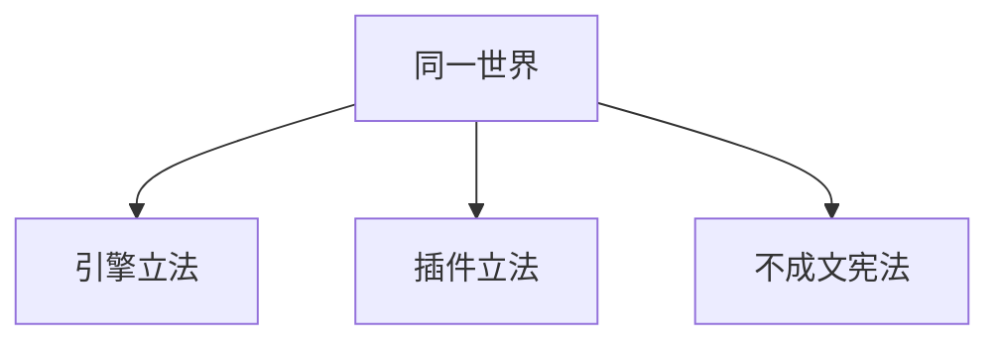

> **本章命题**：设计师不只坐在 Mojang。关掉掉落、装上领地、或只靠一句「别拆我家」，玩的已经是三套不同的立法。真正的设计师是此刻正在写规则的那一层。

## 问题

上一章把单人写成延迟的多人，并把强领地——WorldGuard 那种把误用收成违法的东西——留到这一章。[《多人是默认状态》](/design/multiplayer) 缺省是格子没有主人。有人把缺省当真，有人用命令拧旋钮，有人用插件写产权。三种人都会说自己还在玩 Minecraft。他们玩的法律已经不是同一份。

本章要回答：谁才是真正的设计师？可被证伪的说法是：规则只由 Mojang 在更新说明里制定；玩家改的是偏好，服主改的是配置，都不算设计。只要还存在「这个世界关了怪物掉落之后，农场不再是同一件事」、只要换插件等于换游戏、只要一句「我们这不服作弊」能比任何 gamerule 更硬，这句话就不成立。设计权会离开斯德哥尔摩。离开之后，它落在三层上：引擎、插件、不成文的宪法。

<Cards>
  <Card title="半径先于法律" href="/design/multiplayer" description="公开进程里，未上锁的箱子从家具变成政治。" />
  <Card title="立法权在 IP 里" href="/history/servers" description="服主是设计师。客服不写宪法。" />
  <Card title="命令是钥匙" href="/design/commands-datapacks" description="能改规则的人，已经不是普通居民。" />
</Cards>

## 关掉怪物掉落之后，还是不是同一款游戏

第一夜的意义，一大半写在尸体上。怪物死，掉东西；东西让你敢走得更远，也让你愿意再出去一趟。[《生存作为意义机器》](/design/survival) 把威胁写成节拍器。节拍器要有奖赏，掉落就是奖赏。

引擎给了一条命令：关掉怪物掉落。[^gamerule] 灯还是会暗，苦力怕还是会走过来，第一夜还在。农场不在了。刷怪塔从产线变成噪音发生器。交易、烤鸡肉、骨粉、火药——一整条「出去一趟值得」的账，被一句布尔值拆掉。挖、放、看还在。玩的还叫生存。循环已经换了。

同类旋钮很多。保留物品：死还在，课少了一截，你失去的是位置，不是那座山。和平：牙齿拔掉，房子还要盖，只是盖给展示看，不像盖给今晚。永远白天：气候停了，摄影棚亮了。每一条都不必换客户端，不必等年度更新。世界主人在聊天栏立法，玩法当场改写。

所以「还是不是同一款游戏」没有纯洁答案，只有立法深度。关掉落，是改经济。关生成，是改威胁。关日夜，是改呼吸。三道都关，你得到创造的穷亲戚：无限没来，生存的针已经拔完。针还在时，你仍在 Minecraft 的生存光谱上。针拔完，品牌还在，设计师已经换人——换成那个敲命令的人。Mojang 提供的是立法机关，不是每一条法律。

可被证伪的说法是：gamerule 只是辅助选项，不改变游戏是什么。只要还存在「我们服关了掉落，所以不玩刷塔、改玩建筑」这种把选项听成宪法的经验，这句话就不成立。选项一旦成为共同生活的前提，它就是设计。

## 引擎立法：gamerule、难度、权限

引擎立法是官方承认你能拧的那一层。拧完，仍是原版。原版的意思是：进门的人不必另装程序。

**难度**更老。和平、简单、普通、困难，在 gamerule 出现之前就已经是一张官方菜单：伤害、饥饿、怪物的脾气。硬核不是第五种模式，是生存上的锁。[《创造模式不是关卡编辑器》](/design/creative-mode) 难度证明立法可以长在创建世界的那一页上，而不必先发明命令。

**游戏规则**把菜单收成可脚本的法律。Java 1.4 把 `/gamerule` 做成命令；最初那一批里已经有掉落、生成、火焰蔓延、生物破坏、死亡是否留背包。[^gamerule] 后来的百分比睡觉、袭击巡逻、是否必须解锁配方才能合成，都是同一支笔继续往下写。Bedrock 也有规则，名字和默认值并不总与 Java 对齐；教育版还多一叠课堂开关。[^gamerule] 删掉产品线，句子会断。合同仍是同一句：官方把一部分设计权做成旋钮，旋钮的钥匙是作弊和操作员。

**权限**是谁有权拧。Java 的操作员分档：绕过出生点保护是一档，改模式、放命令方块、改规则是更高一档，封禁和停服还要再往上。[^perm] 单人开作弊，你就是立法者。服务器上，OP 是立法席。Bedrock 把作弊写进世界设置，把操作员绑在账号上；没有「任意 IP 上的控制台」那么随手，仍有人能改规则。钥匙本身是设计：谁能改规则，决定规则能改得多快。冒险模式把挖和放从居民手里收回，交给地图作者——那是权限立法，不是又做了一款游戏。

命令方块把立法焊进地形。[《命令、数据包与地图》](/design/commands-datapacks) 某一格在某一刻说话，运营者变成关卡设计师。数据包把数据层也收成可分发的法律：掉落、配方、进度。数据仍是引擎承认的河。它改内容，很少加新的「挖」。引擎立法的天花板在这里：你可以关针、改掉落、换进度，你不能用一条 gamerule 长出电网。电网要另一层作者。

<Constraint name="引擎只提供立法机关" verdict="地基" chain="旋钮 → 钥匙 → 仍是原版">
官方承认的设计权停在「进门不必另装程序」。旋钮很强，强到能把生存拧成摄影棚。它仍然不是全部法律。全部法律还包括别人写的插件，以及没写下来的那一句。
</Constraint>

## 插件立法

插件改的是这台进程上的法律，尽量不强迫进门的人改装客户端。[《模组作为第二作者》](/history/mods-as-authors) 第二条河从 hMod、Bukkit 长到 Spigot、Paper。河岸上出现的不是「服主工具」，是法典。

领地把格子登记成财产：这块你能挖，那块不能。WorldGuard 一类插件把「同意」写成坐标和优先级，原版那句空法律在这台进程上作废。[^wg] 经济把钻石从物品变成货币。权限插件把人分成能进哪里、能用哪条命令、死了回不回档。小游戏插件把无限切成一局。反作弊把「能做」收成「做了就驱逐」。每一样都比 gamerule 更像在做另一款游戏，因为它们改的是同意：谁有权对哪一格伸手。引擎拒绝预装同意。插件专门来装。

于是换服等于换游戏。同一客户端、同一账号、不同宪法。[《服务器即新游戏》](/history/servers) 写过职业：服主手里是 OP、插件文件夹、备份、名单。本章只要钉死设计位置：插件作者和服主才是这一层的设计师。Mojang 提供运行时。运行时可以很赚钱。法律在 IP 里。

Bedrock 几乎没有这条河。附加包能改行为和外观，Realm 能关命令、能选难度，精选服能自带一套被审核过的玩法。没有 Bukkit 那种「任意地址上一份私人法典」。立法权更靠近引擎和账号，更不像院子里的政权。[《两条产品线：Java 与 Bedrock》](/history/java-bedrock) 所以「插件立法」不能安到手机默认的 Minecraft 头上。安上去，会把 Marketplace 的商品听成 WorldGuard。商品有审核。法典没有——直到服主自己发明审核。

<Note>
Java 的插件立法可以在玩家只装官方客户端时生效。这是它强过模组的地方：法律跟着服务器走，不跟着启动器走。强，也脆。2014 年桌子塌过一次。脆证明这一层是设计，不是皮肤。
</Note>

<Alternative title="若原版预装领地">
每格默认有主人，出生点附近自动划地皮，箱子带锁。公开进程会立刻好住：grief 变成违法，而不是气候。你会得到公寓。公寓可以很好。你失去的是缺省那句空法律：任何有许可证的手，对每一格的权力相同。协作会变成申请；摧毁会变成客服工单。Minecraft 把产权留给插件，不是因为懒，是因为预装同意会把开放世界先收成物业管理。物业管理是一种设计。它不是这个缺省。
</Alternative>

## 不成文宪法

还有一层哪条命令都拧不动。

朋友档里那句「别拆我家」「矿是公共的、钻石先说一声」「今晚不开作弊」。创造服出生点附近「只放完成的作品」。生存服「不许透视、不许复制、死了自己捡」。建筑服「风格要统一，配色用这一套」。没有插件，没有 gamerule 叫 `doNotBeAJerk`。有人违反时，司法是瞪一眼、踢出语音、从白名单拿掉。房间半径里，瞪一眼就够。[《多人是默认状态》](/design/multiplayer) 邀请名单里，宪法写在「请谁进来」上。公开进程里，不成文的东西若不物化，就会被引擎那句空法律吃掉。

审美也是宪法。什么叫「原版风」，什么叫「太像模组」，什么叫出生点该有一座大厅。没有一条官方规则规定大厅必须对称。对称是一群人看了十年影像之后的共识。[《影像、教育与一代人的媒介》](/history/media-education) 共识能比插件更硬：插件可以关，群里的嘲笑关不掉。嘲笑是设计。它决定什么东西配留在地图上。

作弊的边界也在这里。引擎允许你开旁观、允许你用客户端看矿。服可以装反作弊，也可以不装。不装的时候，真正挡住透视的，是一句「我们这不服这个」。这句话是设计选择：你们要公平的稀缺，还是要各自的效率。选择写在人与人之间。写下来之前，它已经在生效。

可被证伪的说法是：没有写成命令或插件的东西，就不是规则，只是礼貌。只要还存在礼貌一破、世界立刻不能玩——不是因为炸了，是因为没人愿意再上线——这句话就不成立。能让人下线的，就是法律。法律可以不进 `plugins` 文件夹。

## 三层立法

三层同时有效。不是升级路线。同一份世界上，引擎在转日夜，插件在看你有没有权挖，群里在看你今晚那一墙丑不丑。

| | 引擎立法 | 插件立法 | 不成文宪法 |
| --- | --- | --- | --- |
| 谁写 | Mojang 提供机关；世界主人 / OP 拧旋钮 | 插件作者写法典；服主决定装哪几部 | 住在里面的人 |
| 改什么 | 难度、gamerule、模式、命令权限、数据包 | 领地、经济、小游戏、回档、封禁、反作弊 | 不破坏、不作弊、审美、分配、什么叫「还在玩」 |
| 进门要什么 | 官方客户端 | Java 上常常仍是官方客户端；法律在服务端 | 被接受进入这个圈 |
| 失败形态 | 旋钮拧尽，生存变成摄影棚，仍叫原版 | 换插件等于换游戏；桌子一塌，法律编译不过去 | 共识一破，人走；人走，世界还在转，游戏已经停 |
| Bedrock 口音 | 规则和作弊在；课堂还有一叠开关 | 几乎没有 Bukkit 这条河；附加包和精选服更像产品 | 同样存在；名单和家长控制先替一部分宪法说话 |

设计师的座位因此有三把。Mojang 设计的是哪一层被允许存在：旋钮、空的产权、可被插件替换的服务端。服主设计的是今晚生效的法典。玩家设计的是还没有写成命令的那一句。问「谁才是真正的设计师」，答案随你问的是哪一把椅子。三把同时有人坐，才是这套规则被居住之后的形状。

## 2b2t：极限实验，不是猎奇

把引擎那层空法律当真，世界会变成什么？2b2t 把这个问题问了十几年。[^2b2t]

几乎不立法：破坏、欺骗、修改客户端，只要不把进程玩崩，多半算玩法。出生点是废墟，远行是政治，历史是谁还记得坐标。插件立法被抽到接近零。不成文宪法也被抽得很薄：没有「别拆我家」，因为家能被拆是气候。剩下的那一点「宪法」，往往是小团体内部的——某座基地自己的规矩——对服务器整体无效。服主偶尔管的是进程活着，不是公平。

不要把它写成景点。景点会把废墟当奇观，把欺骗当笑话。实验问的是设计：缺省若不补上第二、第三层，开放世界会不会自己长出乌托邦？答案是不会。答案是记忆成为战场，信任贵到必须藏。Hypixel 把插件立法用到极限，做出另一款游戏；2b2t 把插件立法弃到极限，让旧世界露出骨头。[《服务器即新游戏》](/history/servers) 两边都不是猎奇。两边都在回答本章：设计师可以坐在大厅的匹配队列里，也可以坐在决定今晚还开不开机、却几乎不写法律的那个人身上。弃权也是立法。弃权之后，引擎的空法律和玩家的残忍发明，填满空出来的席。

日常不发生在这一端。日常发生在中间：有一点 gamerule，有一点插件，有一句群规。中间那些选择，才是大多数人真正玩的 Minecraft。极限只负责把光谱的刻度刻清楚。没有 2b2t，有人仍会把「原版多人」听成友谊。友谊不是缺省。缺省是同等的挖和放。宪法是后来发明的奢侈品。发明它的人，就是设计师。

可被证伪的说法是：无规则服证明 Minecraft 不需要设计师，规则会自己消失。规则没有消失。消失的是官方和插件那两层。第三层碎成碎片，碎片仍在：公路该怎么挖、复制物品算不算玩法、出生点是不是该被永远炸。碎，不等于无。碎，说明没有共同作者时，每个人都在为自己的小世界立法，只是立法管不到邻居。

下一章问正作该吸收什么。吸收会改引擎这一层。改之前，要先承认另外两层已经存在，而且常常比更新说明更有决定权。

## 这一章留下什么

- **爱好者**：你进的那个世界，法律可能写在规则里、写在插件里、或只写在一句「我们不这样玩」。三层都能把同一套挖和放变成不同的游戏。2b2t 那种地方不是 Minecraft 的真面目，是缺省被当真之后的极限。你日常的真面目，是你和服主、和朋友一起写过的那几条。
- **开发者**：能抄走的是三层立法——引擎给旋钮但不预装同意；进程上允许别人写法典；把没写下来的共识当成真正生效的法律。抄不走的是：你没有一条被十年服务器养过的插件河，也没有一代人已经会执行的「别拆我家」。你若只抄 gamerule 列表，会以为设计权在菜单里。菜单是立法机关。游戏在哪一层正在被执行。

[^gamerule]: `/gamerule` 于 Java Edition 快照 12w32a（2012 年 8 月 2 日）加入，随 1.4.2 正式放出。最初规则包括 `doFireTick`、`doMobLoot`、`doMobSpawning`、`doTileDrops`、`keepInventory`、`mobGriefing`。见 [Java Edition 12w32a](https://minecraft.wiki/w/Java_Edition_12w32a)、[Game rule](https://minecraft.wiki/w/Game_rule)。Bedrock 亦有游戏规则，标识与默认值不总与 Java 相同；教育版另有课堂相关开关。

[^perm]: Java 操作员权限分 1–4 级（另有 0 为非操作员）：改游戏模式与 gamerule、使用命令方块等约在 2 级；封禁、给予操作员约在 3 级；停服等约在 4 级。见 [Permission level](https://minecraft.wiki/w/Permission_level)。Bedrock 以世界作弊开关加操作员权限实现同类钥匙，档位与命令方言不同。

[^2b2t]: 2b2t（2builders2tools）于 2010 年 12 月作为 Minecraft 无政府服出现，以几乎不设规则、允许破坏与作弊客户端著称。见 Wikipedia，[2b2t](https://en.wikipedia.org/wiki/2b2t)。设计取义与 [《服务器即新游戏》](/history/servers) 同一条：弃权也是立法，不是猎奇景点。

[^wg]: WorldGuard 与 WorldEdit 同属 sk89q 一线，把区域保护做成服务端法律：按选区禁止建造、进入、使用。见 EngineHub，<https://enginehub.org/worldguard/>。此处只取「同意被物化」这一层，不写配置。
