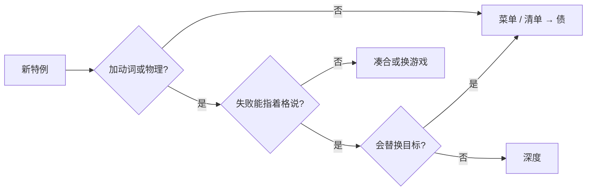

> **本章命题**：深度来自约束，不来自更像真世界。重力例外和离散流体让误用可口述；把留白填成菜单、清单和「正确物理」，深度会变成内容债。设计者该停手的时刻，是下一刀只增加界面、不再增加那只手。

## 问题

上一章把涌现写成约束下的必然：穷、空、硬，组合才会从普通手里长出来（[《留白、涌现与玩家作者性》](/design/emergence)）。必然有一个难听的推论——空隙看起来像没做完。没做完会招来两种善意：把物理做真，把空白填满。两种都像进步。进步之后，把物理做真，灯更老实，机器变少；把结构填密，内容更多，迷茫变少；把操作做成菜单，选项更全，那只手——玩家手上那几个动词——更闲。

本章要回答：设计者何时该停手？可被证伪的说法是：更真实、更现代、更满的版本，默认更 Minecraft；玩家的反对只是怀旧。只要 1.9 的战斗改动仍被许多玩家听成背叛、只要「修掉准连接等于阉了红石」这句话仍有听众、只要盔甲纹饰发完之后，玩家的口述里仍不需要那一套菜单，这句话就不成立。停手不是保守。停手是保护必然寄生的那几根梁。

本章是卷二的枢纽。原语、生存、创造、红石、生成、收编，都已经把材料放在桌上。这里给出判据，不能只凭口味。口味会说「我就喜欢沙子掉下来」。判据要说：沙子为什么必须掉、石头为什么必须不掉，以及哪一种特例是深度、哪一种是债。卷四会把偶然从本质里剥开；本章不提前判哪些方块是 2009 年的凑合。本章只给一把设计上的停手尺：不问新不新、真不真，只问下一刀加的是动词，还是界面。

<Cards>
  <Card title="穷约束才必然" href="/design/emergence" description="涌现不是奇迹。空隙是梁。" />
  <Card title="红石怕正确信号" href="/design/redstone" description="清成说明书，灯老实，机器少。" />
  <Card title="收编加手不加文明" href="/design/mods-as-method" description="完整答案会换主语。" />
</Cards>

## 「更真实」为什么常常更不好玩

把游戏往「真」推，是一种昂贵的礼貌：账单由玩法来付。真实的重力让所有东西掉；真实的水有连续的压力、旋涡、表面张力；真实的红石不存在——电不是粉。每往真的方向推一刀，都像在还一笔旧债：我们终于不像玩具了。玩具的指控来自「方块游戏」那句贬义（背景见[《体素作为设计原语》](/design/voxel-primitive)）。贬义假定：越像真世界，越好玩。Minecraft 的深度走反路。它好玩，是因为大量不真实被做成可数的因果。

不真实不是随机。随机的不真实是 bug：有时掉、有时不掉，无法口述。设计过的不真实是法律：沙掉，石头不掉，水占格，信号走十五档。法律能被误用，因为你能指着那一格说「这里不该这样，所以我可以这样」。真世界很难给这种句子。真世界的水不会停在你用桶装出来的那一格里当你的电梯。

更真实还会偷走共享失败。连续流体的失败是「手感不对」。格子流体的失败是「源没放对」。能截图成整数的失败，才有教程，才有第二作者。把流体做成导航网格上的连续场，教学会变贵：你必须把过程播出来，不能只报「源放在第几格」——口语便宜到什么程度，影像教学就依赖到什么程度（[《影像、教育与一代人的媒介》](/history/media-education)）。便宜的口语是不真实换来的。还成真，口语变贵。

还有一层产品礼貌：家长和评测喜欢听「物理升级了」。升级能进预告片。预告片很难拍「我们决定继续让大多数方块浮在空中」。浮在空中看起来像没做完。没做完是承重墙。下一节把它拆开。

生存自己也是不真实的代谢。饥饿不是卡路里。黑夜不是天体力学。死亡掉落背包、不删除区块，是克制，不是「更真的生存」。更真的生存会把家和世界一起收走——死亡为什么必须是节奏而不是清算，[《生存作为意义机器》](/design/survival)给过证伪句：若有一个版本把背包、末影箱、地皮和区块一并行刑，而社区认为这才是真正的生存，克制要改。至今社区把硬核当可选口味，把删档当事故。克制能成立，正因为疼是节奏，不是写实主义。写实主义会把节奏装置收成惩罚模拟。惩罚模拟可以很硬核。硬核不是这台机器的定义。

可被证伪的说法是：玩家真正想要的是更像真的沙、水和电；官方只是技术上还没追上。只要还存在飘在空中的岛屿被当成家、水电梯被当成交通、红石被当成计算机，而当事人觉得一旦做成真物理，家会变难住、交通会变难说、计算机会变少，这句话就不成立。真可以很好玩。真是另一款游戏的好玩。

## 不真实的物理：重力例外、流体

两根最老的梁：不是所有方块都会掉；水也不是水，它是占格的离散规则。

**重力例外。** 真世界里，没支撑的石头会塌。Minecraft 里，只有少数方块认坠落：沙、砾、铁砧、混凝土粉末、龙蛋、脚手架的特殊下落。其余的墙、矿、木头、玻璃，可以悬在空中当岛屿、当桥梁、当机房的地板。例外不是疏忽。例外把建造从土木工程里解放出来。你不必先算梁。你先放。放完还能走。走得了，才住得进那些不真实的岛。

沙必须掉，是为了让例外显形。若什么都不掉，坠落不再是动词，只是美术。若什么都掉，建造会先变成支撑作业，口令从「再往左三格」变成「先做承重」。坠落作为动词，还长出误用：沙堆、刷沙机、混凝土的固体化、铁砧的伤害。深度在「少数掉、多数不掉」这道刀上，不在某一格沙子的贴图上。Java 与 Bedrock 在坠落时序、铁砧伤害和部分更新顺序上有口音——同一份法律，两边的实现细节不完全一样。口音会让同一台刷沙机换一种盖法。合同仍是：坠落是特例，不是默认。

创造把重力例外用到极限：无限的石头可以铺成没有梁的宫殿。宫殿仍认生存的坠落法律——你切回生存，沙还是会掉，石还是不掉（创造为什么必须寄生在生存的规则上，[《创造模式不是关卡编辑器》](/design/creative-mode)写过）。寄生在这里再次生效。若创造里一切都不掉、生存里一切都掉，两把钥匙会打开两个物理。口令会裂。例外必须跨权限共用，才是法律，不是模式滤镜。

<Alternative title="若所有方块都认坠落">
建造会先变成支撑作业。口令从「再往左三格」变成「先做承重」。悬浮的家消失，坠落不再是少数动词，而是默认物理。你得到更像土木工程的沙盒。你失去的是：多数方块浮着，沙子掉下来才显形。例外一旦变成默认，深度从「少数掉」挪到「如何撑住一切」。那是另一款游戏的深。
</Alternative>

**流体。** 水是源和流动，占格，有限地往下往旁边走，不是纳维－斯托克斯方程。岩浆更慢、更烫、在下界当水用。桶把流体收成物品，物品放回世界又变成格。这一圈是「世界即库存」的流体版：地上的水和背包里的水，是同一种对象的两种位置（[《体素作为设计原语》](/design/voxel-primitive)）。

不真实换来的玩法是可数的。源放在哪一格，电梯就在哪一格。岩浆浇在水上，石头在交界处出现——这是铸造，不是地质学。海草可以把流动的水收成源，于是「造海」是放置问题，不是水文问题。船在冰上飞，因为摩擦被做成了方块属性，不是材料科学。两边都能让方块含水（waterlogged），但水流速度、碰撞和部分更新顺序并不共用一份。分叉再次证明：必然寄生在具体流体法律上。把两边都改成连续水，水电梯会毕业成游泳模拟。游泳模拟可以很好。它不再是「指着那一格源」。

下界把水变成蒸气，把岩浆变成可以桶装的海。这是规则变体，不是更真的地狱（维度法律详见[《维度、进度与终局》](/design/dimensions-endgame)）。变体能成立，正因为流体本来就不是真水。真水无法被一条维度法律收成蒸气而不牵动整颗地球的模拟。穷法律改一条，世界换一种疼。密模拟改一条，要重做气候。

气泡柱把不真实又推进一寸：灵魂沙往上顶，岩浆块往下吸。它仍占格，仍能被红石和漏斗误用。推进合法，因为加的是动词（上/下运输），不是新菜单。若官方改成「真实的密度差」，柱子会更像水族馆，口述会变贵。

光照是第三根常常被忘记的梁。亮度也是十五档，不是连续的光度学。怪物只在足够暗的档位出现，火把「隔几格放一个」能被念成口令，海晶灯和红石灯把同一套整数接回机关。把黑暗做成节奏而不是做成氛围，是生存章的老论点（[《生存作为意义机器》](/design/survival)）。若改成真实的衰减曲线，口令从「隔四格」变成「手感」，共享失败会变贵。十五档不是没做完的光。十五档是可数的夜。

<Alternative title="若流体做成连续场">
压力、旋涡、真实的淹没、漂亮的表面。预告片会赢。建造会先变成堤防工程；红石会被淹死；水电梯从「放源」变成「调节流量」。你得到更像真的水。你失去的是把水当库存、当交通、当铸造材料的那套穷法律。穷法律才和那只手是同一把尺。
</Alternative>

<Constraint name="不真实必须可数" verdict="地基" chain="例外写成法律 → 失败能指 → 误用可教">
随机的假是 bug。法律的假是深度。沙掉、石不掉、水占格、信号十五档，都是法律。把法律还成真，口语和机器一起变少。
</Constraint>

## 现代化风险：填满留白的版本

现代化有正当理由。战斗确实素。村庄确实像布景。洞穴确实重复。新手确实会迷路。理由正当，不等于刀切在承重墙上。风险是：用内容、菜单和「正确行为」去填那个让涌现发生的空。

**把攻击做成主菜。** Java 1.9 给近战加上冷却、盾、双持。喜欢的人得到更像战斗的战斗；不喜欢的人把 1.8 做成一场持续多年的政治——PvP 社区长期留在旧版本，把旧手感当成「真正的战斗」。[^combat] 这场撕裂证明：足够用的威胁一旦按动作游戏的火候去炒，油温就过头了（[《生物、战斗与威胁》](/design/mobs-combat)）。现代化在预告片里是进步；落在那只手上，是把攻击从挖和放的节奏里摘出去。摘出去可以；把它写成「终于正确了」，会把留白听成错误。Bedrock 长期不跟这套手感，两边都还在玩。还在玩，说明正确不是唯一的现代。

**把迷茫做成清单。** 进度、配方书、「冒险时间」、试炼密室的钥匙与宝库。每一项都可以是建议。建议一密，且奖励足够像主线，「我不知道要干什么」就会从好评变成「你还没勾完」。1.21 的试炼是一次显式的「给你点事做」。事可以很好玩；好玩若变成默认的第二幕，生成器的合同就会从可探索滑向可通关（[《世界生成即内容生产》](/design/worldgen)）。结构本该是散在地图上的点；点密到连成网，世界就被规划成了主题公园。

**把成长做成菜单。** 锻造模板、盔甲纹饰、锻造台的多步界面，把「我更好看了」做成收集。收集不改挖和放，它改的是注意力：今晚的目标从房子挪到图鉴。图鉴是内容债的典型形状——满，可展示，卸掉意义世界照常运转，却占掉了本该派给自己的活。配方书已经是索引，索引可以停在「帮你记形状」；一旦变成检索型玩法，网格合成的空间记忆就失业了（合成与库存为什么值得保留一段身体记忆，见[《合成、物品与库存》](/design/crafting-inventory)）。

**把物理做成正确。** 准连接、BUD、更新顺序，社区当 API 用。官方若按文档清掉「不正确」的亮，灯会更老实。老实是现代化的另一种礼貌，而礼貌拆的是必然的梁（[《红石：把物理做成编程》](/design/redstone)）。Bedrock 本来就没有准连接，Java 再把剩下的清掉，两边就都不剩能误用的红石了。[^qc]

**把每一个空洞填成新群系、新生物、新结构。** 洞穴与山崖把垂直和噪声做大，探索的材料变多，这可以是加世界，不是加菜单。风险在后半句：群系和结构若密到「找不到」不再发生，可探索就变成收集。更新作为卖点，天然喜欢密。密是内容策略。内容策略会吃掉生成合同。

村庄与掠夺把村民从布景做成职业与交易表。交易仍附着于物，合同没破。破的风险是：今晚的活从「我给自己派一座桥」变成「我去找制箭师」。村民是自愿目标的延长，职责正当（[《维度、进度与终局》](/design/dimensions-endgame)）。正当到密成必刷、必治愈、必建交易厅时，自愿就会像主线。主线不是村民的错。主线是更新需要「玩家有事做」时，最容易伸手的那块留白。

Java 的更新和 Bedrock 的更新还不必同一天填同一处空：活塞先活在 Java，手机版五年后才跟上。分叉让「现代」无法写成一个版本号；能写成的是同一把风险尺——这一刀加的是手，还是界面。

年度主题的更新节奏也会逼你填。主题要有名词、有预告片、有可展示的新格。名词可以是脚手架那种动词，也可以是纹饰那种图鉴。同一年里两种都加，玩家会把整次更新听成「又满了一点」。听成满，不是因为他们不懂设计，而是因为卖点语言只奖励满，不奖励停。停必须由判据来做，不能靠预告片的克制语气。

配方书、创造物品栏的标签、暂停菜单里越来越长的辅助开关，是同一种礼貌：把曾经靠身体记忆的东西做成可检索。检索可以停在「帮你记三高五宽」，一越界成今晚的玩法，学费就被界面代缴——深度从手上挪进图鉴。Java 的配方书和 Bedrock 的配方界面口音不同，风险合同相同（[《合成、物品与库存》](/design/crafting-inventory)）：索引一旦雇走注意力，那只手就不再需要记得形状。记得形状，才是组合的学费。

<Callout type="warning" title="满不是完成">
留白被填完那天，涌现不会变成更高级的涌现。它会变成彩蛋，只留给读完百科、开过实验开关的人。默认必须继续空着一块。空着不是怠惰。空着是停手。
</Callout>

## 特例方块：深度还是债务

特例是这套物理的零件：大多数方块共享一套默认（不掉、实心、不传信号），少数方块改其中一条。改对了，是新动词或可误用物理。改错了，是一格一用的内容，或必须打开菜单才能懂的收集。判据不看稀有，不看预告片秒数，看四个问题：

1. **它是否增加可组合的动词或物理？** 能和其他系统一起用，而不是只在自己那一格表演。
2. **失败能否被指着某一格复述？** 能，才进口语和教程。
3. **卸掉它的「意义」之后，挖、放、看是否仍在？** 卸得掉意义的，是零件。卸掉之后游戏不会玩的，是主菜——主菜不该以特例方块的形式偷偷进来。
4. **它是否主要增加界面、清单或正确用法？** 是，则倾向债。

判定用三种：深度（梁）、凑合（能用、不承重）、债（填空、换注意力）。不是道德分。债也可以很好看。好看不自动成为该继续加的理由。

| 方块 | 特例内容 | 判定 | 判据（对照四问） |
| --- | --- | --- | --- |
| 沙、砾石 | 无支撑即坠落；多数方块不掉 | 深度 | 加「坠落」动词；失败指得着格；卸掉它，悬浮变默认 |
| 水、岩浆 | 离散流体：源、流动、占格 | 深度 | 电梯、铸造、船、岩浆海全指得着格；连续化等于换游戏 |
| 史莱姆块、蜂蜜块 | 粘、弹，与活塞一起带动整组方块 | 深度 | 加物理；飞行器是误用，不是官方关卡 |
| 冰、蓝冰 | 摩擦写成方块属性 | 深度 | 船在冰上是交通；「冰道」进得了口令 |
| 脚手架 | 可放置、可攀爬、可快速拆 | 深度 | 加「爬」的变体，不加建造模式 |
| 幽匿感测体 | 振动作为第二种传导 | 待定 | 加物理，但可能长成第二套必须学的官方语言 |
| 铜块 | 时间性氧化：蜡封可停，闪电可退 | 凑合 | 多数时候是外观的季节；不拆梁，也不加手 |
| 锻造模板、盔甲纹饰 | 成长与个性做成图鉴和多步界面 | 债 | 主要加界面与收集，雇走注意力；口语不需要它 |

五条「深度」里，沙与水的论证在前两节已经做全；剩下三条在这里把剂量补齐。史莱姆块与蜂蜜块的全部剂量是物理：1.8 的史莱姆、1.15 的蜂蜜，加上活塞，机器长出会动的身体。[^slime] 脚手架把「爬」写成方块，生存的垂直稀缺被一个可数的零件部分接管，创造里的飞没有因此变成默认；它加的是走的变体，不加建造模式。[^scaffold] 冰的摩擦在上一节说过，这里只补一句：冰道是玩家后期的自愿目标，不是致谢名单（[《维度、进度与终局》](/design/dimensions-endgame)）。

**幽匿感测体：待定。** 它把振动写成第二种传导。加的是物理，不是菜单，所以不像纹饰。风险是并列第二套必须学会的官方因果：红石已经不教，再教一门「声」，空会少一块（[《模组作为设计方法》](/design/mods-as-method)）。魔法模组想要的就是第二种传导。官方若把感测体养成和红石对等的语言，红石会变成选修。现在它仍可当零件用；零件和语言之间的那条线，是停手尺要盯的。[^sculk]

**铜的氧化：凑合。** 时间写在方块上，可被蜂蜡停住，可被闪电回退。有人拿它当慢钟，多数时候它是外观的季节。外观不拆梁，也不加手；继续加同类「会自己变的皮」，注意力会走向收集。[^copper]

**锻造模板与盔甲纹饰：债。** 成长和个性做成图鉴与多步界面。死了掉不掉、交不交得出去，仍然附着于物，合同没破。破的是目标外包：今晚可以去找模板，而不是给自己派一座桥。满，可展示，预告片友好，口语不需要它——「三高五宽」没有变成「先打到海岸模板」。[^trim]

八行不是图鉴，漏掉的特例用同一把尺量。活塞把「推」写成格上的手：失败能指，卸掉意义房子还在，飞行器是误用不是关卡——深度。[^piston] 漏斗把物流写成一格，组合面接到箱子、熔炉、投掷器——深度。[^hopper] 侦测器把「方块变了」写成脉冲，短，可误用；Java 与 Bedrock 的朝向和时序仍有口音，合同仍是物理——深度。[^observer] 标靶把「使用 / 攻击」接回红石：抛射物的命中变成模拟信号，组合面比看起来大；窄，因为它几乎只对抛射物说话，但信号能被下游误用，仍比一格一用的装饰强——深度（窄）。[^target] 合成器把合成从玩家网格里拿回世界，让工厂多一只手；它过四问，过的是物流，不是又一张配方菜单。配方书检索是菜单，合成器是手，同一年里两者可以并存——并存时，停手尺要盯的是默认注意力被哪一边雇走。[^crafter] 试炼刷怪笼与宝库站在债的边缘：给你点事做，钥匙和奖励循环像一局短游戏；短游戏可以寄生同一物理，可一旦被当成默认的「下一步」，生成合同会受伤。它比纹饰更像系统，因此更危险——系统会训练玩家，训练一旦形成最优解，迷茫就从好评变成「你还没打完这间密室」。[^trial] 唱片机大多是内容；屏障是工具层；锻造台若只是「另一个工作台形状」则凑合，绑死纹饰流程则跟债走。Java 先有的特例，Bedrock 后跟或永不跟，判定仍看合同，不看谁先更新。

<Impl title="判定不看稀有度">
龙蛋极稀，仍是坠落法律的一条。纹饰常见，仍是债。稀有度是生成和进度的事。深度是组合面。把稀有当深度，会把收集做成设计哲学。
</Impl>

可被证伪的说法是：特例方块越多，Minecraft 越深。只要还存在一串新方块加完之后，口令仍是三高五宽、红石仍是同一种粉尘和更新顺序，玩家却觉得今晚该去图鉴里找下一件，这句话就不成立。深在组合。组合不需要新名词。新名词需要证明自己不是在填空。

## 本卷已经钉过的梁

枢纽要把尺收齐。下面不是新发明，是前十四章已经写成地基、现在必须能用来停手的清单。口味在清单外。清单里每一条都带过证伪句；这里只取它禁止你切的那一刀。

| 梁 | 切下去会失去什么 | 出处 |
| --- | --- | --- |
| 一米格可指、可挖、可放、可数 | 口令、共享失败、四种玩法同一只手 | [原语](/design/voxel-primitive) |
| 七个动词，无建造模式 | 工地与家分家 | [动词](/design/verbs-feel) |
| 生存是节奏，不是打怪清单 | 和平被写成作弊；威胁变成核心循环 | [生存](/design/survival) |
| 成长附着于物 | 人变成角色表，山交不出去 | [物品](/design/crafting-inventory) |
| 创造寄生生存 | 无限毕业成编辑器 | [创造](/design/creative-mode) |
| 生成可探索不可通关 | 「找不到」变成 bug | [世界生成](/design/worldgen) |
| 红石是可误用物理 | 正确信号阉掉机器 | [红石](/design/redstone) |
| 数据改内容，程序加动词 | 数据包被吹成模组 API | [命令](/design/commands-datapacks) |
| 战斗足够用 | 动作游戏雇走整晚 | [威胁](/design/mobs-combat) |
| 无结局 | 后期被致谢名单收回 | [终局](/design/dimensions-endgame) |
| 缺省公共，宪法后写 | 开放世界先变成公寓 | [多人](/design/multiplayer)、[立法](/design/who-makes-rules) |
| 收编加手不加文明 | 完整模组换掉主语 | [模组方法](/design/mods-as-method) |
| 目标不在软件里 | 迷茫从好评变成漏做的引导 | [涌现](/design/emergence) |
| 不真实必须可数 | 真物理偷走口语 | 本章 |
| 新系统必须增加动词 | 菜单雇佣注意力 | 本章 |

表可以证伪：若有一条被拿掉之后，玩家仍觉得自己在玩同一个 Minecraft，且涌现的形状不变，那一条就该降为凑合或偶然——卷四再剥。现在它们仍是梁。现代化和特例方块，都要先过这张表，再过四问。过不了表，四问不必做：你已经在拆卷。清单不是投票。不能因为某条「现在看起来过时」就先拆。过时是口味。证伪句是形状还在不在。形状还在，现在就是梁。

## 停手原则：增加动词 vs 增加菜单

停手不是冻结版本，更不是把 1.8 封成唯一真身。活塞该进，漏斗该进，数据包该进。1.21 的合成器可以进，因为加的是手。停手是：下一刀若只增加界面、清单、正确用法或必须学会的第二套语言，就不要切在默认上。切在模组、数据包、实验开关、编辑器窗口上，可以。默认是口语。口语改一次，课室和家庭要重新学「Minecraft 是什么」。怀旧分叉可以存在：有人停在某一版物理上保卫方言——这类方言的保存价值，[《作为文化遗产的 Minecraft》](/history/heritage)写过。正作的停手不是把方言写成宪法，是不把下一刀切在所有方言共用的梁上。

**增加动词。** 推、吸、爬、粘、弹、把流体当库存、把摩擦当方块、把信号当手。动词能回到那只手上，不必先打开角色页。检验：一个没读过更新说明的人，能否在格子上把失败指出来，并发明一种官方没写的用法。

**增加菜单。** 检索型配方、图鉴收集、多步锻造、通行证式的「本季要做的事」、把战斗收成连招表、把物理清成正确信号。菜单也可以是索引。索引一旦雇佣整晚的注意力，目标就从玩家手里回到作者手里。

可被证伪的操作句是：下一刀发出之后，没读过更新说明的人仍能在格子上把失败指出来，并发明一种官方没写的用法。指不出，也发明不出，这一刀就雇了界面。雇了界面，默认就满了一点。满了一点，涌现就少一块。少到某一天，迷茫从好评变成漏做的引导，停手就已经晚了。那一天不会写在更新说明里。它写在「我今晚该干什么」从玩家嘴里消失的时候。

新系统必须增加动词，不增加菜单——这是第十二条原则的核，下一章会整表列出。本章给它判据。模组方法章的筛子是同一把尺的另一面（[《模组作为设计方法》](/design/mods-as-method)）：对选择负责的完整文明，不要收成默认；对默认负责的零件，必须仍能被卸掉意义。

实验开关是合法的停手姿势。Java 把未完成的系统放进实验，Bedrock 也有实验玩法。姿势的诚实处是：默认仍空着。不诚实的用法是：实验只是上线前的手续，手续走完，菜单就进口语。手续该问的是四问，不是排期。

停手的操作不是灵感，是把下一刀放进四问，再放进那张梁表。假设桌上有三个提案。A：一种会随时间变色的新金属，预告片很好看。B：一种能吸走整列方块的新机构。C：一份「本季十二件饰品」和配套界面。A 过不了第一问：加的是时间外观，失败不能指成动词，至多凑合，默认可少加。B 过第一问和第二问：加手，失败能指；第三问卸掉意义房子还在；第四问不是菜单。进。C 第一问就失败：清单与界面，目标收回。切到数据包、模组或实验开关。读尺不是投票。投票会把满听成进步，因为满能被勾选，空勾不了。

几条已发生的刀，用来把尺读熟。活塞：加手，进。漏斗、合成器：物流的一格，进。脚手架：爬，进。1.9 冷却：把攻击从共用节奏里摘出，它进了，社区也撕裂了——说明它切在身份上，而不是切在补丁上：可以进，不能写成「唯一正确的现代」。盔甲纹饰：菜单与图鉴，默认不该再叠同类。幽匿感测体：物理零件，盯着它别长成第二语言。准连接：已被收成 API 的不真实；清掉是现代化，也是拆梁。同一把尺，不看更新编号，看下一刀雇的是手还是界面。

Java 与 Bedrock 的停手日不必同一天。Java 改了近战节奏，Bedrock 长期不跟；同一把尺读出两种口音，不等于有两把尺。准连接只活在 Java，清掉是一边的现代化，也是一边的拆梁。Bedrock 的水、碰撞和部分更新顺序本来就不是 Java 那份，把两边一起「做成真水」会同时拆两根不同的梁。海报要同一只生物、同一句口号。尺只问同一句：雇的是手还是界面。口号不能代签这张合同。

Bedrock 的编辑器又一次帮上忙。它很强，官方也肯说那不是游戏模式。[^editor] 停手有时是分家，不是删除。工地可以肥。创造继续穷。穷在权限里，肥在窗口里，口语才不会把专业姿势听成「现在这样才算盖房子」。

<Memoir title="修『不正确』的那一周">
红石圈的经验很稳定：一次被标成修复的更新，灯更老实了，飞行器和零刻装置先坏。当事人争的不是怀旧，是语言被删了多少。若那一周社区说「终于诚实了」，本章的命题要改。至今，争的仍是被阉，不是电学课及格。
</Memoir>

<Constraint name="新系统必须增加动词" verdict="地基" chain="下一刀 → 那只手还是界面 → 默认还空着">
切在手上，涌现的梁还在。切在菜单上，满是内容债。工具窗口、数据包、加载器可以很肥。默认必须能被一个只带着七个动词的人住进去。
</Constraint>

卷四会问：哪些特例是本质，哪些是 2009 年的偶然，偶然能否进兼容层。本章不代答。设计者在正作上该停的手，和重写时该剥的皮，不是同一把手术刀。现在这把刀只问：这一刀会不会把必然变成彩蛋。

所以开发者不能只抄「我们也很克制」。克制没有判据，就是口味。判据是：不真实是否可数，现代化是否在填承重的空，特例是否加手，下一刀是否只加菜单。抄得走的是尺。抄不走的是：二十年口语已经把浮空的岛和水做的电梯听成性格；你做成真物理，他们会说游戏坏了，而不是终于诚实了。性格不是本质的全部。性格是这套约束被住过之后的声音。声音一改，对象就改。

## 这一章留下什么

- **爱好者**：沙子掉、石头不掉、水停在那一格里，不是没做完。那是你能把家盖在空中、把电梯说给别人听的原因。新方块若只让你去图鉴里打勾，深度没有增加，今晚的活被换走了。
- **开发者**：能抄走的是停手尺——不真实写成可数的法律；现代化先问加手还是加菜单；特例用四问判定深度、凑合还是债；完整文明留给选择，默认继续空。抄不走的是：准连接、1.8 连点、浮空岛，已经被收成性格和 API。你若把它们清成正确，得到更老实的模拟，失去必然。下一章把尺收成十二条，并写清哪些条件根本抄不走。

[^combat]: Java Edition 1.9（Combat Update）于 2016 年 2 月 29 日发布：攻击冷却、双持 / 副手、盾等。Bedrock 近战长期无这套冷却。见 [Java Edition 1.9](https://minecraft.wiki/w/Java_Edition_1.9)。

[^qc]: 准连接为 Java 独有：活塞、发射器、投掷器可被「上方那一格若存在机构方块时会被激活」的信号激活，即使该格为空气。Java 工单 MC-108 标为 Works as Intended。Bedrock 无此机制。见 [Tutorial:Quasi-connectivity](https://minecraft.wiki/w/Tutorial:Quasi-connectivity)；Bedrock 工单如 [MCPE-14664](https://bugs.mojang.com/browse/MCPE/issues/MCPE-14664)。

[^piston]: 活塞随 Java Edition Beta 1.7（2011 年 6 月 30 日）加入，把「推」做成格上的机械。见 [Piston](https://minecraft.wiki/w/Piston)。

[^hopper]: 漏斗随 Java Edition 1.5（2013 年 3 月 13 日）加入，把物品在格与容器之间的流动写成方块。见 [Hopper](https://minecraft.wiki/w/Hopper)。

[^observer]: 侦测器随 Java Edition 1.11（2016 年 11 月 14 日）加入，检测方块状态变化并输出脉冲。见 [Observer](https://minecraft.wiki/w/Observer)。

[^crafter]: 合成器随 Java Edition 1.21（Tricky Trials，2024 年 6 月 13 日）加入，让合成发生在世界里的一格，而不是只发生在玩家网格。见 [Crafter](https://minecraft.wiki/w/Crafter)。

[^editor]: Mojang 对 Bedrock Editor 的口径：「Editor is not a new gamemode. It is a tool to assist creators in their worldbuilding workflows。」见 [Mojang/minecraft-editor](https://github.com/Mojang/minecraft-editor)。

[^slime]: 史莱姆块随 Java Edition 1.8（2014 年 9 月 2 日）加入；蜂蜜块随 1.15。两者改变实体与活塞推动的整组方块运动。见 [Slime Block](https://minecraft.wiki/w/Slime_Block)、[Honey Block](https://minecraft.wiki/w/Honey_Block)。

[^scaffold]: 脚手架随 Java Edition 1.14（村庄与掠夺，2019 年 4 月 23 日）加入，可放置、可攀爬、可快速拆。见 [Scaffolding](https://minecraft.wiki/w/Scaffolding)。

[^target]: 标靶随 Java Edition 1.16 加入，抛射物命中位置影响红石信号强度。见 [Target](https://minecraft.wiki/w/Target)。

[^sculk]: 幽匿感测体于 1.17 实验、1.19 正式进入原版，检测振动并输出红石信号。见 [Sculk Sensor](https://minecraft.wiki/w/Sculk_Sensor)。判定取「第二种传导」的风险，不写感测体电路教程。

[^copper]: 铜块氧化随 Java Edition 1.17 加入，可用蜜脾蜡封、被闪电去锈。见 [Copper Block](https://minecraft.wiki/w/Copper_Block)。

[^trim]: 盔甲纹饰与锻造模板随 Java Edition 1.20（漫漫旅途）加入。见 Mojang，《Trails & Tales》，<https://www.minecraft.net/en-us/article/1-20-update>；[Armor trim](https://minecraft.wiki/w/Armor_trim)。

[^trial]: 试炼刷怪笼、试炼钥匙与宝库随 Java Edition 1.21（Tricky Trials，2024 年 6 月 13 日）加入。见 [Trial Spawner](https://minecraft.wiki/w/Trial_Spawner)、[Vault](https://minecraft.wiki/w/Vault)。
