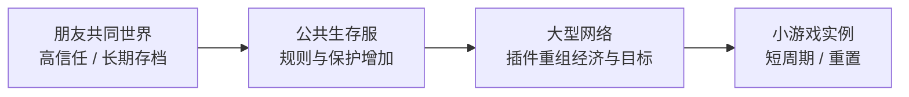

两个人第一次住进同一个 Minecraft 世界时，变化往往不是从“大型多人系统”开始的。

可能只是一个人出去挖矿，另一个人在家扩房子；回来以后，箱子的位置变了，门口多了一片农田，原本舍不得用的钻石已经被做成了镐。单人里，这些事情全部来自自己；多人里，同一个世界会在你没有操作的时候继续被别人改变。

于是一些原本不需要回答的问题突然出现了：这箱材料谁都能拿吗？这栋房子能不能改？农场产出的东西怎么分？谁决定开不开作弊？如果有人把别人的建筑拆了，游戏系统应该阻止，还是由玩家自己处理？

这些问题并不是 Minecraft 预先写好的“社会系统”。它们大多只是因为**多个玩家同时拥有对同一份世界的修改能力**而出现。

> **为什么只增加其他玩家，就会让同一套 Minecraft 规则产生合作、交换、财产、信任、冲突和共同规则？一个世界又是在什么时候从“我的存档”变成“我们的地方”的？**

## 第二个玩家改变了什么

多人最基础的变化，不是多一个战斗目标，而是世界里出现了另一个拥有行动能力的人。他和你一样可以移动、采集、建造、拿取物品，也能在你不注意时改变原本熟悉的空间。

### 同一份世界开始拥有多个行动者

单人里，世界的变化大体都可以追溯到自己：这里为什么少了一棵树、那面墙为什么多了一扇窗、箱子里的铁为什么只剩十块，玩家通常知道答案。

多人会打破这种确定性。你下线以后，别人仍然可能继续工作；Realms 甚至把“世界在主人离线时仍保持在线”作为核心功能，受邀成员可以在不同时间进入同一个活动世界。[^realms] 这让世界第一次真正拥有了**并行的作者**。

这种并行不一定带来冲突。很多时候，它首先带来的是惊喜：昨天还只有地基，今天上线发现朋友已经把屋顶盖完；自己在矿洞里待了半小时，回来以后农田已经扩大一倍。共同世界的吸引力，很大一部分就来自“世界里发生的事情不再完全由我安排”。

### 分工不需要职业系统才能出现

Minecraft 原版并没有要求团队一定有“矿工、建筑师、农夫”这样的正式职业，但多人很容易自然形成分工。有人喜欢找矿，有人愿意整理仓库，有人擅长红石，有人只想把基地修得好看。

这种分工来自兴趣和效率，而不是角色锁定。今天负责建房的人明天仍然可以去打龙，负责仓库的人也没有失去采矿能力。因此它更像临时协作，而不是 MMO 那种由职业系统预先分配的职责。

这会产生一种很有 Minecraft 特征的合作：大家使用的是同一套基本动词，却愿意把时间投入不同环节。资源章里那些采集、运输、储存和生产，在多人世界中因此可以被不同玩家同时推进。

### 建筑开始拥有观众和共同用途

单人建筑当然也可以为了表达而存在，但多人会让“别人怎样使用这块空间”立刻变成现实问题。公共仓库需要让别人看得懂，交通枢纽要让第一次来的玩家知道往哪里走，农场的开关和输出位置也需要比单人机器更清楚。

建筑于是多出一种沟通功能。一条铺好的道路不仅方便自己，也在告诉别人“这里经常有人走”；一个标好分类的仓库是在把个人整理习惯变成团队接口；出生点附近的广场，则可能慢慢成为所有玩家共同认识的中心。

这和[《建造与空间》](/design/building-space)讨论的“公共空间需要共享可读性”是同一件事在真正多人环境中的展开。

## 物品和土地怎样变成社会关系

Minecraft 的物品很容易转移：扔在地上、放进箱子、交给别人，都不需要额外交易界面。方块也可以被任何拥有相应权限的玩家拆掉。正是这种直接性，让合作很方便，也让“谁拥有它”变成一个游戏本身没有完全回答的问题。

### 礼物、交换和玩家经济都从可转移物品开始

朋友缺一把镐时，最简单的做法就是把自己的备用镐扔给他。再往后，一组钻石、几箱建筑材料、一次附魔服务，都可以变成交换对象。

这里并不需要官方货币系统。小型朋友服可能完全依靠赠送和互相帮忙；大型生存服则常常会自己选一种物品当作计价单位，或者通过服务器插件引入账户货币和商店。

重要的不是“钻石天然应该成为钱”，而是物品具有三个条件：可以拥有、可以转移、获取需要成本。只要这三件事成立，玩家就可能把资源关系进一步组织成交换关系。

### 普通箱子并不会自动回答“这是谁的”

原版里，普通箱子不会因为由某个玩家放下，就自动拒绝其他玩家打开。世界也不会因为一栋房子是你盖的，就阻止别人拆掉墙。

在朋友服里，这可能完全不是问题，因为大家默认“别随便拿别人东西”。到了陌生人更多的公开服务器，同样的默认就会迅速暴露局限。玩家开始需要锁箱、领地、日志、回档，或者至少更明确的规则。

这说明“财产”并不是一个方块属性，而是一层后来建立的关系。原版提供的是可修改的世界；玩家和服务器决定哪些修改被接受、哪些被认为越界。

### Grief 和建造使用的是同一套动作

在引擎看来，拆掉自己刚放错的墙和拆掉别人花十小时盖的房子，都只是破坏方块。所谓 grief，只有放到玩家关系和共同约定里才成立。

这也是多人沙盒最棘手的地方之一：创造自由和破坏能力往往来自同一套权限。如果默认谁都不能动别人的方块，公开服务器会安全很多，但共同施工、临时帮忙和共享设施也会需要更多权限管理；如果所有方块都自由修改，合作非常直接，恶意破坏同样直接。

因此，开放和保护并不是两个可以同时拉满的选项，而是一组需要根据社区规模和玩法重新取舍的关系。

## 共同世界怎样产生规则

只要多人共享一份长期世界，迟早会出现“我们这里怎么做”的问题。规则可以来自游戏本身、服务器软件，也可以只存在于玩家之间；三层经常同时工作。

### 游戏设置和权限先划出基础边界

最基础的一层来自 Minecraft 自己：难度、Game Rule、游戏模式、白名单、操作员权限，以及 Bedrock 中 Visitor、Member、Operator 等玩家权限等级。Bedrock 当前的官方 API 文档就明确区分：Visitor 只能观察，Member 可以建造、采矿和互动，Operator 还可以使用命令与传送。[^bedrock-permissions]

Realms 则把“谁能进来”做成非常直接的成员管理：世界始终在线，但由所有者通过邀请控制成员。[^realms] 这类设置并不定义完整的社区制度，却先决定了两个很基础的问题：谁能够进入，以及进入以后拥有什么级别的修改权。

这些官方开关已经足以显著改变玩法。允许所有人进入 Creative、开启 keepInventory、关闭 PvP，都会让同一张地图产生不同的风险和协作方式。但它们仍然只是比较粗的世界级规则。

### 插件可以把规则细化到区域和角色

Java 服务器生态长期发展出另一层工具：插件可以在不要求每个玩家安装客户端 Mod 的情况下，改变服务器如何处理权限、经济、领地和小游戏。

WorldGuard 就是很直观的例子。它允许服务器把世界划成 Region，为区域指定 owner、member、priority 和各种 flag；管理员可以禁止非成员进入、禁止 PvP、限制方块破坏，甚至单独控制箱子访问。[^worldguard]

一旦有了这种能力，原本“所有有建造权限的人都能改所有地方”的世界，就可以变成商业区、私人地皮、公共道路和禁止战斗的安全区。插件没有改变方块长什么样，却改变了**谁能在什么地方做什么**。

这也是为什么历史卷会把服务器看成一种新的游戏形态：同一个 Java 客户端进入不同服务器，可能面对完全不同的权限、经济和目标。[《服务器即新游戏》](/history/servers)讨论的是这种生态怎样形成；这里更关心它对多人设计意味着什么。

### 没写进程序的约定同样会影响玩法

朋友服里最常见的规则往往根本没有代码：公共农场随便拿，但记得补种；别在主城附近乱挖；不用 X-Ray；打龙等大家一起；别人家不要随便改。

这些约定如果被违反，Minecraft 本身可能什么也不会提示，但共同游戏仍然会受到影响。于是规则的有效性不只来自“系统能不能阻止”，也来自成员愿不愿意继续遵守。

可以把这三层简单地放在一起看：

| 规则来自哪里 | 典型例子 | 更适合解决什么 |
| --- | --- | --- |
| **游戏 / 世界设置** | 难度、Game Rule、模式、成员权限 | 全世界统一的基础条件 |
| **服务器 / 插件** | 领地、经济、商店、回档、PvP 区域 | 更细的权限和服务器玩法 |
| **玩家约定** | 不偷东西、不作弊、公共设施规则、建筑共识 | 很难或没必要完全写进代码的协作习惯 |

它们并不是互相替代。一个 Realm 可能几乎只靠成员邀请和口头约定；大型公开服则可能把大量规则写进插件，同时仍然需要无法自动执行的社区规范。

## 同一套 Minecraft 可以形成很不同的多人世界

多人不是一种固定玩法。“和两个朋友共同生存”和“进入万人小游戏网络”都叫 Multiplayer，但它们对持久性、信任和规则的要求完全不同。

### 小型朋友世界把信任当作主要基础设施

人数很少而且彼此认识时，很多保护机制没有必要。箱子不上锁、基地没有领地，甚至作弊权限也可能只靠一句约定管理。冲突出现以后，直接在语音里说一声通常比安装插件更便宜。

Realms 很适合这种规模：它强调私人邀请、持续在线和备份，而不是提供复杂服务器管理。官方目前也把它描述成“你的朋友、你的服务器”，受邀成员即使主人不在线也能进入。[^realms]

这种世界的特点不是“规则少”，而是很多规则靠关系本身执行。成员之间的信任代替了一部分软件保护。

### 公共生存服必须把信任问题工程化

陌生人增加以后，口头约定的成本会急剧上升。管理员无法认识每个玩家，也不可能靠实时沟通处理每一次箱子被偷或建筑被破坏，于是领地、日志、回档、权限和审核变得更重要。

这时共同世界会逐渐拥有明确的制度：哪里能建、哪里不能建，商店怎样运行，作弊怎样判定，违规以后是回档、警告还是封禁。它们听起来像管理问题，但会直接改变玩家策略，因此也属于玩法的一部分。

例如禁止 PvP 会改变装备竞争的意义；开放自由交易会形成市场；严格领地系统会鼓励个人地块，却可能减少随手协作。服务器管理与游戏设计在这里很难完全分开。

### 小游戏服务器甚至会重写“世界”的生命周期

多人服务器还可以彻底放弃“大家长期住在同一份存档”的前提。地图只存在十分钟，一局结束就重置；玩家不再关心这堵墙明天还在不在，而是关心这一轮谁先到终点。

这类玩法仍然利用 Minecraft 的移动、碰撞、物品和网络客户端，但通过服务端规则把持久世界重新组织成 Match、Lobby、Team、Score 和 Reset。玩家进入的已经不是一份共同生活的存档，而是一套不断重复的游戏流程。

所以“多人 Minecraft”更适合看成一条光谱：

这不是发展阶段，也不是规模越大越高级。每一种形态都在回答不同的问题：我们是在共同生活、共同建设，还是只是在同一个客户端里玩一场被重新编排的比赛？

## 多人世界最难平衡的几组关系

多人把单机里很多简单规则变成了需要长期权衡的问题。只要世界同时属于多个玩家，就很难让所有目标都无成本地成立。

| 关系 | 一边过头 | 另一边过头 |
| --- | --- | --- |
| **开放修改 vs 财产保护** | grief 成本过高 | 所有协作都要申请权限 |
| **个人自由 vs 公共一致** | 主城、道路和设施难以共同维护 | 玩家失去自行建造和表达空间 |
| **长期持久 vs 新人公平** | 老玩家积累越来越难追赶 | 频繁重置让长期建设失去意义 |
| **便利自动化 vs 玩家交换** | 每个人都能独立完成一切，合作需求下降 | 人为制造依赖，让单人行动变得烦琐 |
| **管理员控制 vs 社区自治** | 世界过度依赖少数管理者 | 出现问题时没人有能力修复或回档 |
| **规则明确 vs 社交弹性** | 每个行为都被系统许可框住 | 所有争议都只能靠人情解决 |

没有一套服务器规则适合所有社区。十个朋友的长期生存档可以依赖信任，大型公共服却很难照搬；小游戏需要快速重置，建筑服却可能把保存多年视为最重要的价值。

因此，多人设计最值得注意的并不是“加几个社交功能”，而是**玩家数量、彼此关系和世界寿命会共同决定需要什么规则**。技术上完全相同的箱子，在自己家、朋友服和陌生人公开服里，会因为上下文不同而拥有完全不同的意义。

## 这一章留下什么

第二个玩家进入以后，Minecraft 没有换掉基础动词，却会多出大量单人世界不必处理的关系。现在比较可靠的判断有这些：

- **多人最基础的变化，是同一份持久世界拥有多个能够修改它的行动者；合作和冲突都从这里开始。**
- **分工不一定需要职业系统。共享资源与长期工程已经足以让玩家按兴趣和效率形成临时角色。**
- **物品可转移、普通容器缺少天然产权，使礼物、交换和玩家经济很容易出现，也让“谁拥有它”需要由社区另外回答。**
- **Grief 和正常建造使用的是同一套破坏 / 放置能力，因此开放创作与财产保护之间天然存在取舍。**
- **共同世界的规则通常同时来自游戏设置、服务器插件和玩家约定；三层分别适合解决不同尺度的问题。**
- **朋友 Realm、公共生存服和小游戏网络虽然共享 Minecraft 客户端，却会因为信任范围、持久性与规则不同而形成完全不同的体验。**
- **多人系统不能只按人数设计。玩家彼此是否认识、世界是否长期保存、管理员能否介入，同样决定哪些保护和治理工具真正必要。**

下一章[《设计之外的玩法》](/design/emergent-play)会继续追问另一种“多人之外”的扩张：刷怪塔、Parkour、Speedrun、Skyblock、红石计算机和各种服务器玩法，为什么会不断从原本没有明确安排这些目标的规则中长出来？

[^realms]: Mojang Studios，《Minecraft Realms》，2026 年访问。官方把 Realms 描述为私人、持续在线的托管服务器；所有者通过邀请控制成员，受邀玩家即使所有者离线也可以进入当前活动世界。Bedrock 与 Java 的 Realms 分属各自版本，跨平台范围也不同。https://www.minecraft.net/en-us/realms

[^bedrock-permissions]: Microsoft Learn，《minecraft/server.PlayerPermissionLevel Enumeration》，2026 年访问。Bedrock 当前把玩家权限区分为 Visitor、Member、Operator 与 Custom：Visitor 只能观察；Member 可以建造、采矿和互动；Operator 还可以使用命令与传送。https://learn.microsoft.com/en-us/minecraft/creator/scriptapi/minecraft/server/playerpermissionlevel?view=minecraft-bedrock-stable

[^worldguard]: EngineHub，《WorldGuard Regions》与《Region Flags》，2026 年访问。WorldGuard 可以定义带 owner、member、priority 与 flag 的区域，并控制 build、block-break、chest-access、entry、PvP 等行为，用于把服务器空间进一步组织成不同权限区域。https://worldguard.enginehub.org/en/latest/regions/index.html https://worldguard.enginehub.org/en/latest/regions/flags/