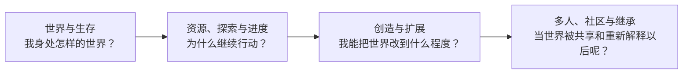

第一晚降临时，Minecraft 给玩家的问题很小。

天快黑了。手里没有什么东西。附近有树、有石头，也许远处已经能听见怪物。于是玩家砍木头、做工具、挖出一个入口，或者赶在黑夜完全落下以前搭起一间很简单的房子。

几天以后，这个问题已经变了。临时庇护所旁边多出农田和仓库，矿洞被道路连起来，箱子开始分类，新的装备让探索范围不断扩大。再过一段时间，玩家可能在 Nether 修交通，在基地下面藏红石机器，用 Creative 设计大型建筑，或者邀请其他人进入同一份世界。

这些活动看起来已经相去甚远，却没有要求玩家离开原来的世界重新开始。第一晚挖下的洞、后来盖起的房子、远方找到的村庄、服务器里共同修出的道路，都可以继续成为下一件事发生的条件。

这正是卷二想理解的问题：

> **为什么采集、探索、建造、自动化、创作和多人活动，能够长期作用于同一个世界，并不断改变彼此的意义？**

## 不是某一个机制，而是机制之间的关系

Minecraft 很容易被拆成一张功能表：方块、合成、生物、世界生成、红石、Creative、多人、Mod。单独看，每一项都不难在其他游戏里找到对应物。

真正值得研究的是它们连接以后发生了什么。

方块不仅构成画面，也可以被采集、放置、储存和长期保存；世界生成不仅提供风景，也决定资源、路线和探索；物品不仅是奖励，还会反过来改变玩家移动、建造和生产的效率；红石接触到容器、作物和方块以后，才从信号系统变成机器与基础设施。第二个玩家进入同一份世界以后，箱子、房屋和道路又会获得单人游戏里不存在的社会意义。

因此，本卷并不试图寻找一个隐藏在 Minecraft 背后的“万能设计公式”。它更关心这些关系怎样形成，又在什么条件下会失效。

同一个问题也会不断被其他游戏反问。Terraria 选择更明确的 Boss 与装备进度；Vintage Story 把生存和工艺模拟做得更密；Enshrouded 把可修改地形放进手工设计的 RPG 世界；Teardown 让体素更多服务于破坏和物理。它们并不是 Minecraft 的不完整版本，而是在相似问题上选择了不同答案。

## 从生活在世界里，到重新设计世界

卷二的四个部分不是四组互不相干的功能分类，而是一条逐渐扩大的观察尺度。

开始时，玩家主要在回应世界；随后开始经营资源、寻找远方并积累能力；再往后，玩家不仅使用世界，还会建造空间、设计机器、编排规则乃至修改游戏本身。当更多玩家和社区进入以后，这些能力又会形成交换、冲突、公共规则和原版没有逐项安排过的新玩法。

这条顺序不是 Minecraft 官方规定的成长路线。玩家完全可以第一天就进入 Creative，也可以从不碰红石或模组。它只是帮助我们逐层观察：**当玩家拥有越来越大的行动与创作范围时，原有系统怎样获得新的意义。**

## 四部结构

### 第一部 · 世界与生存

一切先从“这个世界是什么”开始。

[《方块与可修改世界》](/design/modifiable-world)讨论的不是方块美术为什么经典，而是空间为什么如此容易被指认、修改并保存。Minecraft 的世界不是只能经过的场景：一格土可以被挖掉，一面墙可以被补上，而这种变化会继续存在。

[《生存与玩家目标》](/design/survival-goals)随后处理另一个基础问题：在没有持续任务指引的情况下，玩家为什么仍然会自然产生下一步。黑夜、饥饿和死亡会制造优先级，但它们并不能解释 Minecraft 的全部目标；很多长期计划来自资源依赖、已经投入的工程，以及玩家自己决定想把这个世界变成什么样。

### 第二部 · 资源、探索与进度

当玩家活下来以后，世界开始从“眼前的危险”扩大成一张资源、路线和可能性的网络。

[《物品、合成与库存》](/design/items-crafting-inventory)研究材料怎样变成能力，以及库存为什么既是限制也是长期组织世界的工具；[《世界生成与探索》](/design/worldgen-exploration)讨论未知、距离、稀有性和种子怎样让离开基地变得有意义；[《生物、战斗与威胁》](/design/mobs-combat)则关注世界中那些会主动回应玩家的对象，以及战斗、交易、驯服和自动化为什么会彼此交叉。

最后，[《进度、维度与游戏后期》](/design/progression-dimensions)把这些关系重新放在时间线上。Minecraft 可以被“通关”，却不会因此要求玩家封存世界；新的装备、维度和基础设施既可以推进官方目标，也可以降低玩家继续经营旧世界的成本。

### 第三部 · 创造与扩展

第三部开始关注另一种变化：玩家不再只是解决世界提出的问题，而是越来越主动地设计世界本身。

[《建造与空间》](/design/building-space)从一间庇护所怎样变成基地、道路和具有记忆的地方开始；[《创造模式与创作工具》](/design/creative-tools)继续把编辑尺度从单个方块扩大到结构、选区、笔刷和地图级地形。

[《红石、机器与自动化》](/design/redstone-automation)研究信号、状态、时间和物流怎样被组合成机器；[《命令、数据驱动与地图创作》](/design/commands-data-maps)再把创作从空间推进到事件、规则与关卡；[《模组与玩法扩展》](/design/mods-expansion)则进一步观察，当作者能够增加新的系统、改变 progression、组织 Modpack 时，Minecraft 可以离原版玩法走多远。

这里没有一条“越往后越高级”的工具阶梯。逐块搭一面墙、用 WorldEdit 移动一座建筑、用 Data Pack 编排一张地图，解决的是不同尺度的问题。真正重要的是创作意图和工具能力能否匹配。

### 第四部 · 多人、社区与继承

当世界不再只有一个玩家，设计问题会再次改变。

[《多人游戏与共同世界》](/design/multiplayer-world)从最普通的共同生存开始：第二个玩家为什么会让箱子产生财产问题、让道路成为公共空间，又为什么朋友 Realm 与陌生人服务器需要完全不同的权限和保护。

[《设计之外的玩法》](/design/emergent-play)把视线再移向社区。刷怪塔、冰船高速路、Parkour、SkyBlock、Speedrun 和红石计算机并不是同一种“涌现”，却都说明玩家可以重新解释规则、设计新的目标，再通过 Wiki、视频、地图、服务器和比赛把个人发现变成公共玩法。

最后，[《Minecraft 值得继承什么？》](/design/what-to-inherit)回看整卷。它不试图把 Minecraft 整理成一套必须复制的规则，而是区分哪些只是具体做法，哪些关系在特定条件下可能具有更广泛的参考价值，以及哪些东西只有经过十几年的历史和社区积累才会出现。

<Cards>
  <Card title="世界与生存" href="/design/modifiable-world" description="从可修改的空间与第一批玩家目标开始。" />
  <Card title="资源、探索与进度" href="/design/items-crafting-inventory" description="看资源、未知世界与成长怎样不断产生下一步。" />
  <Card title="创造与扩展" href="/design/building-space" description="从建造空间，到机器、地图、脚本与模组。" />
  <Card title="多人、社区与继承" href="/design/multiplayer-world" description="当同一个世界被共享、传播和重新解释以后。" />
</Cards>

## 怎样判断哪些经验值得离开 Minecraft

研究一个成功了十几年的游戏，很容易产生后见之明。一个今天看起来理所当然的机制，可能来自早期技术限制；一个后来形成巨大文化的玩法，也可能从来不是最初的设计目标。

所以这一卷会尽量把三件事分开：**开发者曾经想做什么、游戏实际提供了什么规则、玩家后来把这些规则用成了什么。**

跨游戏比较也服务于同一个目的。它不是为了给 Minecraft、Terraria、Vintage Story、Enshrouded 或 Teardown 排名，而是用不同答案暴露选择背后的取舍。只有当一个判断经得住反例，我们才有理由把它从“Minecraft 的特点”进一步看成“值得其他沙盒考虑的关系”。

这也是为什么卷二的结论不会停在“开放”“自由”“涌现”这些听起来正确的词上。一个系统是否值得继承，还需要继续问：它依赖什么条件，会牺牲什么，又是否符合另一款游戏真正想让玩家做的事。

卷三会把这些关系带进实现层：一个可以持续修改、生成、保存、联机并被第三方扩展的世界，究竟怎样在数据结构、Tick、网络、渲染和兼容性上付出代价。

但在那之前，先从最基础的地方开始：

> **Minecraft 的方块究竟改变了什么？**

→ [《方块与可修改世界》](/design/modifiable-world)