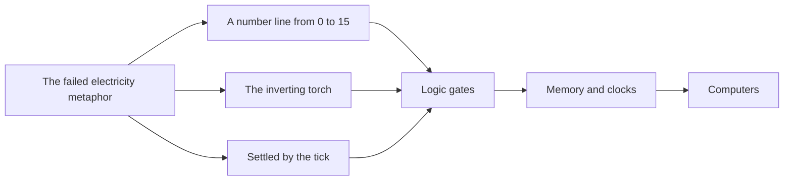

> **This chapter's thesis**: Redstone succeeded because of the failure of the electricity metaphor — the designer delivered composable rules of physics instead of a play list, so players misused its parts, one by one, into logic gates, clocks, flying machines, and computers; the misuse went unpunished by the system and was instead absorbed as gameplay. A system that meets the three conditions — physics rather than a list, correct usage invented by the community, misuse left unpunished — this book calls a **misusable system**. If the officials corrected redstone's quirks to match the documentation and the community felt the game had become more honest rather than mutilated, or if the correct usage of the gameplay ended up decreed by the officials, this thesis would be false.

## The problem

A new player who has just mined redstone ore almost always walks the same stretch of wrong road. Redstone is a dark-red ore in Minecraft; break it and it drops a glowing red powder — redstone dust. He sprinkles the powder on the ground and it lights up: isn't this the game's electrical wire? He hooks up a lever (a switch that emits a signal when flipped) and a redstone lamp, pulls the lever, and the lamp lights. Everything goes well, until he stretches the "wire" — a dozen-odd blocks out, the lamp refuses to light no matter what. He checks it over and over and cannot find a single break, because there is no such thing as "broken" on redstone dust — only "too weak to light the lamp."

Most people stop here, file redstone under "advanced stuff," and walk around it ever after. Until one day they scroll across a video of another kind of player, who has used the same powder to build a machine: it does addition and subtraction, a seven-segment display on its panel; you feed it numbers and it actually computes. Looking back from there at the lamp that never lit, the distance between is not skill. It is an entire unnamed discipline.

Change the scene. A redstone veteran goes to look at a piston-door blueprint someone posted — a piston is a mechanical arm that pushes blocks, and players commonly use it for hidden doors. The layman sees a pile of blocks and how to arrange them; the veteran takes one glance and starts talking: "Input is here, here it inverts, here a delay of two ticks." To him the drawing is a circuit diagram. It has symbols, a reading convention, right and wrong; and this convention is industry-wide — any veteran's diagram can be read by any other veteran.

How does a piece of game material become an engineering discipline? This chapter answers in five steps: first, tell apart the Wiki's redstone and the game's "redstone"; then see where the electricity metaphor failed, and why the failed metaphor grew logic circuits of all things; then ask what "the officials don't teach" actually means; next examine the four computations players invented; finally put redstone back among all the roads to "programmable" and see where exactly it stands.

## Redstone on the Wiki and "redstone" in the game are not the same thing

In the game, redstone is a set of materials. The core is redstone dust, and the official line gives it this first identity: "a mineral used for crafting, brewing, decoration, and as a placeable wire" — note the ordering: wire comes last, listed alongside crafting material and potion ingredient[^dust]. Around it sits a family of parts: the redstone torch, a small ever-lit light source that can also power a line; the lever and the button, switches that emit a signal; the iron door, a door that cannot be opened by hand and answers only to a redstone signal. This batch of things entered the game together in July 2010. Two details are worth remembering: first, redstone dust had no official name when it shipped; second, the way it entered was by substitution — it replaced the shelved "gear" block, and gear blocks already placed in old worlds turned into redstone dust overnight, because the two shared the same item id[^alpha-v101]. A system whose name was not even settled carried no manual from its first day.

What the game is willing to teach ends at the materials: dust can craft things, can lengthen a potion, can carry a signal across the ground. The next question — what can be built out of these parts — the game does not answer with a single word.

Open the community-maintained Minecraft Wiki, and "redstone" is another word entirely. Its main article reads like the table of contents of an engineering textbook: transmission circuits, logic gates, pulse circuits, clock circuits, memory circuits — each with its own chapter, its own terminology, its own standard drawing conventions[^circuits]. The memory circuits are named straight from real-world electronics — RS latches, T flip-flops — and the Wiki's own explanation is that these circuits "behave similarly to their real-world namesakes." The article even carries a whole vocabulary of design goals: aiming to be "flat" (hugging the ground as a whole), "silent" (running without a sound), "seamless" (hidden into a wall, invisible), down to a dedicated word for "deliberately achieving ordinary functions with obscure parts." Follow the table of contents to its deepest point and you arrive at a tutorial on building computers, whose first sentence reads: "This article is extremely complex, and is aimed at nerds."[^computers]

Vocabulary is a discipline's hardest credential. When a group of players can exchange jargon like "quasi-connectivity," "latch," and "clock" with precision, without describing each phenomenon from scratch every time, the knowledge has already been sorted and standardized — all that remains is expansion. And the scale of that standardization far exceeds what the game itself supplies. On the game's side, redstone's content is small: a few materials, a dozen-odd parts, one rule that "the signal decays" — measured by content volume, an ordinary update. On the Wiki's side, the same word unfolds into a thick textbook. The size gap between the two sides is the size of player authorship. No one planned this division of labor — the officials did not foresee a textbook while building parts, and the community did not wait for official approval while writing one. Who, and by what means, spread the material into a discipline: that is the true subject of the next three sections.

## It is not electricity: why the metaphor failed

At first glance redstone does look like electricity: there are sources (levers, torches), wires (redstone dust), loads (lamps, doors, pistons). Players bring the everyday intuition of electricity to it, and for the first three minutes it works; after that it fails at every step. The failures concentrate in three places, and each deserves a look of its own.

**Signal strength is not voltage.** A signal on redstone dust has fifteen levels, strongest at 15, losing 1 for every block it travels, reaching zero after fifteen blocks; to send a signal farther you need a repeater — a block that tops the signal back up and, along the way, adds a fixed delay — to relay it[^dust]. Real voltage does not drop block by block like that. More important is the correct reading of the design: voltage is a continuous physical quantity, and no one can count with voltage; redstone's fifteen levels are discrete integers that can be read out and compared. The comparator the officials added later — a part that reads signal strength and compares it — reads exactly this number: how full a chest is can become a block-by-block reading too. So the players thought they were using electricity when they were actually counting: what landed in their hands was not electricity but a number line from 0 to 15. Look back at the lamp at the top of this chapter: it did not light not because "the voltage was insufficient" but because the number line ran out. Ask "why is there no power" with electrical intuition and you will never get an answer; ask "where has the count reached" and the problem becomes computable on the spot. The metaphor's failure is not an abstract aesthetic judgment; it lands on every one of the players' wrong expectations.

<Constraint name="Fifteen blocks and it is spent" verdict="groundwork" chain="redstone dust decays → repeaters relay the signal → comparators read the number">
The constraint: a signal travels at most fifteen blocks along redstone dust, weakening with every block. The verdict: it looks like a defect and is in fact an interface — it forced two layers of invention, the repeater and the comparator, and handed redstone the only "analog quantity" in the game. The constraint is the depth; chapter 15 of this volume develops this thesis head-on (see [Constraints Are Depth](/design/constraints)).
</Constraint>

**The torch is not a power source; it is an inverter.** The redstone torch looks the most like a battery: stick it in the ground and it lights, and it can power a line. But its real behavior is this: the moment the block it attaches to becomes powered, it goes out; when the block loses power, it relights. Input "on," output "off" — the output is always the opposite of the input. In logic this is called inversion, and as a component it is a NOT gate: the thing that turns "is" into "is not." No torch in the real world holds this job, and no battery in the real world even less. That torch, mistaken for a battery, probably never knew its actual post was a logic component[^torch]. Better yet, if you switch it too fast it "burns out" — goes dark for a moment, then recovers on its own. A battery with built-in thermal protection. By this point the metaphor has gone bankrupt in public.

**Timing is the tick, not physical time.** The game world runs on a fixed beat: twenty steps of simulation per second, one step called a tick. Changes in redstone do not propagate continuously; they settle tick by tick — a repeater's delay is a whole number of ticks, and the torch's flipping keeps to the beat as well. A redstone network is therefore not a continuous current but a synchronous system sliced into even steps and settled in strict sequence; it resembles a clock-driven chip far more than wire inside a wall. For people who build machines, this difference is good news: every part listens to the same metronome, and who fires first, who waits how many ticks, all become things that can be designed — "before and after" in the redstone world is not mysticism; it is a countable resource. (The tick details are not identical across editions: a quirk like quasi-connectivity, for instance, exists only in Java Edition. The overall split between the two editions is covered in [Two Product Lines: Java and Bedrock](/history/java-bedrock), and the engineering ledger belongs to [Redstone's Implementation](/impl/redstone); this chapter deals only with the design layer the editions share.)

The three failures each left a piece of wreckage: a number line from 0 to 15, a ready-made inverter, a discrete beat. Taken one at a time, each is a crude imitation of electricity. But the three pieces of wreckage are exactly the three raw materials of logic circuits — data, judgment, clock; fitted together, they take the shape of another discipline's foundation.

Logic gates — the basic components that pass judgment on signals — need raw materials redstone lacks none of. The OR gate: two runs of redstone dust merge into one; if either run is powered, the whole run lights. The NOT gate: one torch, ready-made. The AND gate: assembled from an OR gate plus two NOT gates; output only when both inputs have arrived. Not one of these "standard drawings" was ever decreed by the officials; every one was tried out by players and later canonized by the Wiki[^circuits]. With gates, add feedback — route the output back into the input and let some state bite down and hold itself — and you have memory; circuits that lock a state, the players named after electronics: latches. With gates, memory, and one uniform beat, counters, arithmetic units, and storage became nothing more than a question of engineering effort.

Incidentally, let us decode a term: Turing-complete. Its plain meaning: if a set of things can make judgments (AND, OR, NOT), can remember state, and is given enough space, then in principle it can assemble anything computable — from an adder up to a machine that runs by program. In reality, programming languages and processors clear this bar. Redstone, with no one designing for it, using ore dust, torches, and arms that push blocks, crashed into those ranks.

The causal chain can now be written in a straight line: the metaphor failed, so there was no ready-made "electricity gameplay" to copy, and the players had to bend down and read the physics; the rules were composable, so every small discovery read out of them could be spliced without end. A failed metaphor plus composable rules handed the players a language with no author. This was not the deep foresight of the 2010 designer — that batch of parts shipped without even a name — but it did happen.

A counterfactual test can pry the two conditions apart. Suppose the metaphor had succeeded — redstone really were like electricity, and players were content lighting electric lamps and wiring electric doors — who would have bent down to read decay curves and inverting torches? It is precisely electrical intuition failing at every turn that forces the rereading. Suppose the rules were not composable — every part had one decreed use, the torch only for lighting, the piston only for doors — then any number of parts would be just a bigger bag of tools, and logic would never grow: logic's life lies in splicing small discoveries without end. Lacking either condition, the computer later in this chapter does not exist.

## What "the officials don't teach" means

First, confirm "not teaching" as a fact, not a rhetorical flourish. There is no redstone tutorial in the game: no guided quest, no encyclopedia, no explanation panel; the hints a player can get from the game itself amount to material uses and a handful of crafting recipes. The official posture toward redstone across more than a decade can be summed up in nine words: add parts, set physics, explain nothing. The single gesture that came close to taking a stance was naming the entire 1.5 version the "Redstone Update" in 2013, shipping the comparator, the hopper (a block that moves items automatically), and a whole batch of other parts in one go — plenty of parts added, still not one word of textbook[^redstone-update]. The naming was an acknowledgment; the not-teaching was a stance: with an entire version number the officials said "this thing matters," and with silence they held the line of "we do not decree usage."

More interesting is the direction. One of the most important parts in redstone's history — the piston — was not invented by the officials at all. It began as a mod published on a forum by a player; that player, named Hippoplatimus, handed the code to Mojang, the piston entered the game proper in 2011, and his name stands in the game's credits to this day[^piston]. The precedent set up a two-way loop: the community invents parts and the officials absorb them; the officials ship parts and the community invents uses. The textbook was only ever written on one side — the community's.

One piece of supporting evidence: the five major updates Microsoft gave Windows 10 between 2016 and 2018 carried the internal codename Redstone, publicly explained as borrowed from Minecraft[^dust]. That the name of a game material could keep traveling after leaving its material behind is evidence it had become a kind of public thing — by then nobody saw it as "some red ore" anymore.

"Not teaching" means at least three things.

**The first is power.** Whoever holds the textbook holds the right to revise it — invisible in ordinary times, clearest when versions turn over. Redstone's textbook is in the community's hands, so every time the officials ship a snapshot (a preview build released for public testing), the community's first reaction is not to wait for an authoritative reading but to take it and check it themselves: the textbook must be edited by their own hands, the answers produced by their own work. This knowledge is not stored on an official server; it is stored among the players.

<Memoir title="Snapshot day">
Every snapshot day, the technical community acts like a quality-inspection department: they read the changelog line by line, open test saves, and power up, one by one, every machine that depends on some quirk; within a few hours, a list of "which contraptions break in the new version" is hanging on the forums. The officials change one line of physics, and the community reconciles the accounts overnight — the textbook was written by the community, and only the community can revise it.
</Memoir>

**The second is legitimacy.** Imagine the officials one day deciding to teach, and issuing a "Standard Usage of Redstone." What happens? The uses written into it become the correct answers, and the uses left out are demoted to crooked tricks — the torch's profession is lighting, and using it as a NOT gate becomes "misuse" from that day on. Yet all of redstone's vitality lives precisely in that "misuse." Not teaching equals not decreeing; not decreeing equals all uses born equal. The officials' silence is not neglect; it is the premise on which this system exists.

Whether to fix the quirks is the other face of the same coin.

<Constraint name="Quasi-connectivity: fix it or not" verdict="groundwork" chain="MC-108 → the foundation of a decade of machines → fixing it per the docs means tearing the machines down">
Java Edition has a famous quirk: a piston can be driven by a signal sitting one block above its regular position, something that should not hold if you play the rules as written; early on a player formally filed the bug, and it was numbered MC-108. The community used it for ten years, and countless machines took it as their foundation; Mojang marked the report "works as intended" and chose not to fix it. To fix it would be to silently demolish a decade of accumulation; not to fix it is to leave documentation and behavior forever at odds. This is the sibling decision to "not teaching" — neither decree nor correct. The mechanism details are in [Redstone's Implementation](/impl/redstone); what is recorded here is only the design judgment: once a quirk has become an interface, the fix itself is the breaking change.
</Constraint>

**The third is the cost, and it must be admitted in full.** Where no one teaches, the barrier is real: entry runs through the Wiki, videos, and word of mouth, and the drop-off rate will not fall just because this chapter makes the story sound moving. The two editions behave differently, so the textbook has to carry version numbers. To praise this system is not to deny its steepness — keep that account on the books, and when the final section takes up the three-layer structure, it will be able to explain why a script layer must exist.

The concept can now be erected head-on. This book calls systems like redstone **misusable systems**, and it judges them by three criteria, all required.

One, **the designer delivers rules of physics, not a play list.** A part's built-in "job" covers only half of its uses — the torch's job is to glow; no one decreed that it could be a NOT gate. The designer neither explains nor forbids.

Two, **the correct usage is invented by the community and feeds back into the rules.** The correct answer does not live in an official textbook; it lives in more than a decade of the community's trial and error — and the output of that trial and error flows back into the game: the piston's road from mod to vanilla is a case of community gameplay rewriting the rules in reverse.

Three, **misuse is not punished by the system, and can settle into new gameplay.** No anti-cheat watches you "using the torch improperly," and no wall reads "not a designed use here"; misuse and proper use stand fully equal before physics — placed legally, a contraption enjoys the same right to run. And once a misuse is copied by enough players it enters the legends, enters the tutorials, and becomes the "normal" for the next batch of players — the flying machine is gameplay that graduated from misuse.

Each criterion binds a different party: the first constrains the designer, the second acknowledges the community, the third constrains the system itself. Drop any one and the concept degrades. With only the first you get "fiddlable physics" — plenty of sandbox games ship wires and mechanisms and still grow no discipline, because usage was pinned down by the manual long ago. With only the third you get "a tolerant sandbox" — messing around goes unpunished, but messing around settles into no correct answer either. The misusable system is the product of the three, not any one of them.

And the other way around: when would "redstone is a misusable system" be false? Three cases, any one of which would do it: the officials fix quirks like quasi-connectivity to match the documentation, and the community's general reaction is "the game is more honest" rather than "the machines were torn down"; the decreed usages attached to new parts are enforced — say, the torch genuinely permitted only to give light; community-invented gameplay never once gets an echo in the rules. Later chapters of this volume will produce further specimens, all judged by the same three criteria — and among them, redstone is the weightiest.

## Invented computation: gates, clocks, flying machines, computers

The concept is up; now look at the artifacts. The game directly provided none of the four things below; every one is assembled from parts "beyond their jobs." Each is a reinterpretation of physics, not a recitation of a tutorial. This section covers only what each one misused — not how to build it. One point to note in advance: not one of the four ever appeared in any update announcement — their "release channel" was always forum posts, videos, and Wiki pages.

### Gates: reading on and off as true and false

The first misuse is the most basic: reading the torch's and the dust's "on, off" as "true, false." The torch's job is lighting and power; the players read it as an inverter. The dust's job is conduction; its decay curve was read as a number line. Once on and off map onto true and false, redstone is grafted onto Boolean algebra — a mathematics of how truth values compute, already old in the nineteenth century — and the players' amateur inventions stood, from then on, on the foundation of a ready-made discipline. Today a veteran reads a piston-door blueprint at a glance: where the input is, where it inverts, where it delays — that drawing was a circuit diagram all along, drawn in a legend the community set itself[^circuits]. Most of this generation of players never studied circuits in school. They reinvented it themselves.

### Clocks: reading delay as rhythm

The second misuse is slyer: reading "slow" as "beat." It takes time for a signal to travel down a line, and repeaters carry inherent delay — a debt owed by the physics. Players wire several repeaters head to tail into a loop; the signal runs laps inside forever, and the output end receives a steady alternation of on and off: a metronome. Redstone players call it a clock circuit. It is the heartbeat of every automatic device: without it, a machine has only the states "on" and "off"; with it, the machine gains a "next step." The Wiki gives it a page of its own, ranked alongside logic gates and memory circuits[^circuits]. Turning physics' debt into rhythm's resource — no tutorial ever taught that move. It is a reinterpretation of the rules, not an execution of them.

### Flying machines: reading push and pull as propulsion

The third misuse is the boldest. The piston's job is pushing blocks, twelve at a time — the officials answered explicitly on the feedback site that this limit "is by design," not a technical shortfall[^piston]. In 2014, version 1.8 added the slime block, which sticks neighboring blocks into one mass and bounces creatures into the air; the official update notes say not one word about flight. But players quickly found the trick: a piston can push the whole stuck-together mass, and combined with the observer (a part that emits a signal the moment it detects a block change, born for automated farms), two "piston plus slime block" groups can be made to push each other along — and the machine leaves the ground. The game has no "vehicle" category, no thruster item, no rules for flight at all; the flying machine is a third mode of movement the players invented, ranked alongside walking and boating. The Wiki later collected it as a featured tutorial — a misuse, graduated in this way into gameplay.

### Computers: reading physics as instructions

The endpoint of misuse is the photograph below.

<Figure src="/images/redstone-computer.png" alt="A redstone computer on flat desert ground: rows of repeated logic-circuit modules laid out along straight lines, a seven-segment display on a black panel showing a digit" caption="A redstone computer. The black panel carries a seven-segment display — a digit reader assembled from glowing blocks; behind it, rows of repeated modules hold its arithmetic and storage circuits. This machine contains not one line of code; its 'program' is laid out in blocks. Source: Minecraft Wiki." />

The community's redstone computers can do arithmetic and light up a seven-segment display; more elaborate ones can load instructions and run step by step by program — and the Wiki's dedicated tutorial opens with self-mockery: "This article is extremely complex, and is aimed at nerds."[^computers] What deserves attention is not the feat "players really did build computers" but the feat's bill of materials: arithmetic by torches and dust, storage by latches, display by a row of lamps — every part holding a second job outside its own. The previous section put "in principle" next to Turing-complete; in this photograph, the principle lands on the ground.

Weightier still is how the craft is handed down. The community's computer tutorials neither discourage nor mystify; they cut the road into steps: one adder, four bits, eight bits; then memory, decoding, display; the whole machine last. At every step someone writes the explanation, records the video, answers the questions. The mark of a mature discipline is not how many geniuses it produces but whether it can convert the geniuses' results into a slope ordinary people can climb — redstone's computer tutorials are exactly such a slope, and they grow entirely outside the game.

Set the four examples in a row and the slope is clear: gates reinterpret a single part; clocks reinterpret the relation between parts; flying machines invent a category the system never had; computers take the whole of the physics as another machine's language. Misuse escalates all the way, and the system lets it pass all the way — which is precisely what the third criterion of the misusable system looks like in practice.

## Three ways to be programmable: mechanism / circuit / script — which one Minecraft chose

The word "programmable" has been used many times already; time to take it apart. For a game to let players "write programs" on it, there are in truth only three roads.

**Mechanically programmable.** The program is written into the shape of space. Piston doors, water-stream sorters (using currents to sort dropped items into piles by where they land), elevators — all of the logic is encoded in geometry: where the water flows, where the pistons push, how many gaps the wall leaves. To change the program you demolish the house. It predates redstone: without waiting for any circuit, a bucket of water and a few pistons are enough to start work — many players' first "machine" was nothing more than a trench dug at the right slope. It has no signal, no timing: writing code in stone.

**Circuit-programmable.** The redstone road. The program is written into signal and timing, laid over the surfaces of blocks, and works the way electronic engineering does: wire takes up blocks, routing has to detour around buildings, and even the aesthetics switched to engineering words — "flat," "silent," "seamless." A three-dimensional circuit board.

**Script-programmable.** The program is written into text. Command blocks — in-game blocks that execute game commands — and datapacks (the official data-layer extension) take this road, and mods (extensions that modify the game program itself) go further still; those are two other crafts, unfolded in chapters 8 and 13 of this volume respectively. This road resembles software engineering: there is syntax, there are error messages, there are versions.

In time Minecraft opened all three roads, but the order in which they opened says a great deal: what the game proper completed first were the first two — it delivered programmable physics. The script layer was added by the officials later, and added with restraint; the mod layer the community chiseled out entirely on its own. Most games build in the opposite direction: the script interface first, with physical interaction kept shallow. Giving physics first means putting "programming" into a medium everyone can touch and that has no grammar.

"Giving programming as a feature" and "giving programming as physics" are two design philosophies. The former assumes that what players want is to write code, and so embeds a scripting language and calls it done. The latter assumes nothing; it delivers rules and parts, and lets the usage called "programming" grow out of the physics by itself. Redstone belongs to the latter — and it belonged to the latter without its designers ever realizing; this is perhaps the most counterintuitive point of the chapter: the most successful "in-game programming language" was never designed as a programming language.

The difference in barriers hides here, and it is the psychological premise of the misusable system. Scripts have syntax: one wrong character and the program refuses to run — the error message itself is a door. Redstone has no syntax: put something in the wrong place and the only outcome is "it does not light"; no system popup corrects you that "this is not what the torch is for." Mistakes are cheap enough to squander, and only then can misuse grow from a slip of the hand into an invention.

<Note>Redstone dust dims as its signal decays: a veteran reads the color at a glance and knows which block the signal has reached. Everyone receives a free debugging display — though the officials never once used the word "debug."</Note>

So the accurate answer to "which road did Minecraft choose" is: it did not pick one of three; it stacked the three into three layers — mechanism the parts layer, circuit the logic layer, script the language layer. Redstone lives in the middle layer: more abstract than mechanism, with signal replacing shape as the encoding of logic; lower-barrier than script, with no syntax and no punishment for error. This three-layer structure makes one hard demand of anyone rewriting the game: misusability is the invariant, not a list of quirks. If a rewritten engine turns "rules of physics" into "a list of officially decreed uses," redstone dies — the exam question is written by Volume IV's [Design Invariants That Must Be Kept](/rewrite/invariants).

Now the question from the top of the chapter can be answered: how did a failed electricity metaphor become a successful logic circuit? The complete answer is four conditions interlocking. The metaphor failed, so players were handed no ready-made "electricity gameplay" and had to bend down and read the physics; the physics was composable, so every fragment read out of it could be spliced; the officials did not teach, so no reading was ever decreed correct; misuse was not punished, so the cost of misreading was only "it does not light." Take away any one condition and this discipline does not grow. It also explains why there are so many imitators and so few that grow: delivering parts is not hard; what is hard is restraining yourself from teaching, and restraining yourself from fixing during the years players took the quirks for foundations. This thing was not designed into existence; it was left alone into existence — and here the designer's restraint mattered as much as the designer's ability.

## What this chapter leaves behind

- **For players**: your experience of learning redstone is itself a history of misuse — the torch's first lesson to you was not lighting but inversion; and the next time you read a piston-door blueprint, what you are reading is a line of program written in blocks.
- **For developers**: what you can take away is the three criteria (deliver physics, not a list; correct usage invented by the community and fed back into the rules; misuse unpunished), along with the path by which "a failed metaphor can still grow logic." What you cannot take away is the community textbook a decade in the writing, and the tacit understanding between players and designers that was long since absorbed into the physics itself.

[^alpha-v101]: Minecraft Wiki, "Java Edition Alpha v1.0.1" (released July 2, 2010, the third Seecret Friday: adds redstone dust, redstone ore, redstone torches, levers, buttons, pressure plates, and iron doors; the dust was unnamed at the time and took over the "gear" block sharing id 55), minecraft.wiki, retrieved 2026-09-18: see https://minecraft.wiki/w/Java_Edition_Alpha_v1.0.1 .

[^dust]: Minecraft Wiki, "Redstone dust" (the official description calls it a mineral "used for crafting, brewing, decoration, and as a placeable wire"; redstone wire carries a maximum signal strength of 15, decaying 1 per block and needing repeaters to relay; Microsoft's five major Windows 10 updates of 2016–2018 carried the codename Redstone, citing Minecraft — The Verge, April 7, 2015), minecraft.wiki, retrieved 2026-09-18: see https://minecraft.wiki/w/Redstone_dust .

[^torch]: Minecraft Wiki, "Redstone torch" (a redstone torch turns off when its attached block is powered, so it serves as an inverter; switching too fast burns it out and it stays dark briefly), minecraft.wiki, retrieved 2026-09-18: see https://minecraft.wiki/w/Redstone_torch .

[^piston]: Minecraft Wiki, "Piston" (the piston originated as a forum mod by the player Hippoplatimus; after he handed the code to Mojang it entered the game in Beta 1.7, and he is listed in the credits; the push limit is 12 blocks, and a January 3, 2019 reply on the Minecraft feedback site called the current limit "by design"; slime blocks arrived in the 1.8 snapshots 14w18a/14w19a), minecraft.wiki, retrieved 2026-09-18: see https://minecraft.wiki/w/Piston .

[^circuits]: Minecraft Wiki, "Redstone circuits" (collects the transmission, logic gate, pulse, clock, and memory circuit categories; memory circuits are "named after real-world electronics circuits, because they behave similarly"; the page notes that calculators, digital clocks, and basic computers can be built in game), minecraft.wiki, retrieved 2026-09-18: see https://minecraft.wiki/w/Redstone_circuits .

[^computers]: Minecraft Wiki, "Tutorial:Redstone computers" (opens by declaring itself "extremely complex, and aimed at nerds"), minecraft.wiki, retrieved 2026-09-18: see https://minecraft.wiki/w/Tutorials/Redstone_computers .

[^redstone-update]: Minecraft Wiki, "Java Edition 1.5" (1.5 is the first release of the "Redstone Update," published March 13, 2013, adding the comparator, the hopper, and more), minecraft.wiki, retrieved 2026-09-18: see https://minecraft.wiki/w/Java_Edition_1.5 .
