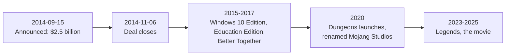

> **This chapter's thesis**: what Microsoft bought was the "gateway" and the IP, not the income from selling copies of a game; and precisely because of that, keeping the original free-to-update as before was the most rational choice available to the buyer. If Java Edition had stopped updating after the acquisition, started charging existing players, or been demoted to a second-class edition, this chapter's judgment would be wrong.

## The problem

On September 15, 2014, players opened the news to near-identical headlines: Microsoft would acquire Mojang for $2.5 billion. The Swedish studio behind Minecraft had been bought by a company that makes operating systems and office software. Financial media reported it as tech-industry news; players read a different layer into it — the world they moved into every day had become a line on someone else's balance sheet.

That day, Reddit's r/Minecraft pinned the acquisition discussion thread, and the replies kept flooding in for days.

<Memoir title="The community on September 15, 2014">In the pinned thread's comments, "RIP Minecraft" was a constant. On YouTube, nearly every Minecraft channel posted a reaction video, with titles ranging from "the game is over" to "maybe it won't be that bad." For weeks afterward, "what will Microsoft turn this game into" became the default opening line of every community discussion.</Memoir>

The fears were not groundless. In 2014, players had a concrete checklist for what "a platform company takes over a game" looks like:

- Would the one-time purchase turn into a subscription or in-app purchases?
- Would ads be stuffed into the game?
- Would Java Edition — the oldest PC product line, the one where you can freely run servers and install mods — be cut?
- Would free server hosting and free modding be ended by a lawyer's letter?
- Would the PlayStation edition be pulled from sale?

At the other end of the fear was Microsoft's image at the time. Just over a year earlier, the Xbox One had stumbled over a launch plan built on mandatory online checks and restrictions on used discs; earlier still, Windows 8 had tried to pull app distribution into its own store, and PC players remembered. Ask that company to take over a game famous for its freedom, and players could hardly imagine a good ending.

Five questions, and none had an answer that day. What this chapter answers is a different sentence: what exactly did this deal buy — a game, a platform, or a generation's gateway into digital worlds?

The method is neither indictment nor defense: list the fears as they stood in 2014, then check them one by one against what actually happened — which came true, which didn't, and which came true in a mutated form. That checklist is this chapter's skeleton.

## Why the "selling out" narrative is too shallow

The "selling out" story was everywhere that year: a genius author bows to a big corporation and hands over his own child. The story travels well, but it is too shallow, because it assumes a premise — that Minecraft in 2014 was still a work Notch alone had the final word on, and whether to sell was a question of the author's taste.

The premise fails. By mid-2014, paid sales across all platforms were approaching 54 million, and console sales had passed PC for the first time — PC/Mac accounted for roughly 16 million, with the bulk of the rest on consoles and phones[^sales-2014]. The player base was shifting from "forum geeks" to "kids with a game console." And much of the activity never passed through Mojang at all: players multiplayered on third-party servers, content videos lived on video sites, mods and texture packs came from community authors — not one byte of that distribution involved Mojang.

Mojang itself was only a Stockholm studio of a few dozen people (an order of magnitude; the company never published an exact headcount). The problems it faced: every console version had to pass Sony's and Microsoft's certification; age ratings ran by different rules in Germany than in North America; hundreds of knockoff clones hung in the phone stores, and the trademark had to be chased country by country; tens of thousands of servers were charging money to operate, and nobody had drawn the legal line around them.

Not one of these jobs is solved by "being able to write a game." They need a distribution network, a legal team, compliance experience — either hire an entire apparatus and learn from scratch, or find an owner who already has one. This is a capability problem, not a taste problem.

The options actually on the table were few. Going public was unrealistic: a company with a single product cannot support a stock offering. Not selling and hiring professional managers was the third road, but the steering wheel stays nominally in the founder's hands and the pressure does not disappear. What remained was finding an owner.

For Notch's departure, the official wording is enough: the Mojang announcement states that he no longer wanted to carry the responsibility of owning a company like this; the same day, he announced his departure together with CEO Carl Manneh and co-founder Jakob Porsér[^mojang-pr]. Why he left, and what came after, does not change the nature of the deal; this chapter stops here.

Why was the buyer Microsoft? First, the cooperation is on the record: the two companies had worked together on the Xbox edition since 2012, and the console line was one of Mojang's fastest-growing product lines[^mojang-pr]. Second, timing: Satya Nadella had just become Microsoft's CEO in February 2014, and the new management put "cloud and services" at the core; Xbox's new head, Phil Spencer, argued that Microsoft should follow players to whatever platform they are on. Buying a game that runs on iOS, Android, and PlayStation and not making it exclusive is itself a footnote to that strategy.

Finally, open the books: $2.5 billion for a one-time-purchase game. Even a rough estimate — 54 million copies at twenty-odd dollars each — means selling copies for many years just to fill the hole. Microsoft's own press release asked only that the deal "break even" in fiscal year 2015, promising no high growth[^ms-pr]. If the $2.5 billion had bought copy revenue, it would be a debacle; so the answer must lie elsewhere.

## The deal: structure, motive, timeline

First, the checkable timeline:

The deal's structure itself is not complicated: all cash, $2.5 billion; after closing, Mojang became a wholly owned subsidiary of Microsoft's games division (Microsoft Studios, today Xbox Game Studios), the Swedish legal entity remained, the development team was retained whole, and the three founders left[^deal-close]. What is actually worth writing is the motive — what three things was Microsoft paying for?

The first is the **gateway**. By gateway I mean a concrete position: where a generation's relationship with digital worlds begins. Children learn the creeper before they learn Xbox; they learn multiplayer, server administration, and modding inside Minecraft before they become long-term users of any platform. The numbers in the press release show how dense this gateway is: over 100 million PC downloads; nearly 90 percent of paying PC players had logged in within the previous 12 months — a game released in 2009 still retaining almost all of its paying users five years on; and on the Xbox 360 alone, more than 2 billion hours played within two years[^ms-pr]. For a platform company, this is the best user relationship money could buy.

The gateway's logic also explains the other half of this chapter's thesis. A gateway's value is in "entering the door," not in "raising the ticket price": keep the original as it is and affordable to everyone, and the flow of newcomers never breaks. Raise the price or lock the door, and you save small change while destroying the foot traffic itself.

<Note>The "100 million downloads" figure counts PC downloads and registrations, not paid sales; paid sales at the time were about 54 million. The two numbers were constantly conflated in coverage that year.</Note>

The second is **IP insurance**. Minecraft has no story protagonist, no established worldview conflict, and its blocky visual language fits into any carrier — classrooms, plush toys, film, spin-off games. None of it counts as "ruining the original," because the original's rule is "you build it yourself." Few IPs copy across media with so little friction. Picture the opposite: a story-heavy IP makes a movie, and the fandom spends three months arguing over whether the casting looks right. Minecraft's movie only has to answer "what does a blocky world look like," so the argument is naturally one layer lighter.

The third is **platform positioning**. Minecraft is enormous and runs on every platform — "not close enough" to any one company. Leave it alone and sooner or later some competitor grips it; grip it yourself, and you have told the entire industry that Microsoft's player strategy no longer depends on exclusives. There was also a more specific backdrop in 2014: the Xbox One had just lost the launch-window fight to the PS4. Holding Minecraft means that no matter who wins the console war, players cannot go around a Microsoft gateway. The PlayStation edition indeed kept updating after the acquisition, to this day — the cross-platform promise was honored.

Three motives — gateway, IP, positioning — point at the same conclusion: the money bought not the game itself but a position in the ecosystem around the game. It has a falsification condition too: if Microsoft had bought only copy revenue, the first move would have been to shrink cross-platform and milk the existing base. The actual direction was the opposite.

## Who did "protecting Minecraft" actually protect?

First, calibrate the wording. The Microsoft press release never actually uses the word "protect." Nadella's exact words: "Minecraft is more than a great game series — it is an open world platform, driven by a vibrant community we hold deep respect for." Spencer's exact words: "We will maintain Minecraft and its community, in all the ways people love today."[^ms-pr]

"Maintain" is a colder and more enforceable word than "protect": what it promises is unchanged terms, not an emotional guarantee. Half of the "protection" in the community's head that year was added by the community itself.

This is not quibbling over words: what a sentence promises, and does not promise, becomes the standard players check against later. The facts show that what got delivered was exactly the "maintain" tier — no more, and no less.

Now, item by item against that fear list.

**"Java Edition will be killed off."** Did not happen. After the acquisition, Java Edition kept updating on schedule: 1.9 reworked combat in 2016, 1.13 reworked the oceans and the command system in 2018, 1.18 reworked terrain generation in 2021, and 1.21 shipped as usual in 2024. In ten years, not one version update charged existing players a cent. Today, Java Edition is still the only edition where you can run your own server and mod freely, bypassing official servers entirely. There is harder evidence still: the mod ecosystem did not shrink — it is more flourishing than in 2014. Loaders and community content remain the game's biggest "free content department."

**"The one-time purchase will become a subscription or in-app purchases."** Did not happen on Java Edition. The transformation happened on the other product line: Bedrock Edition, merged upward from the phone version, built the official content store — the Marketplace — where players pay for maps, skins, and textures made by community creators. Monetization did not vanish; it was installed into the newborn line, and Java Edition was kept "as it was." The division of labor between the two lines is itself the most consequential act of product design since the acquisition (details in [Java and Bedrock](/history/java-bedrock)).

**"Ads will appear in the game."** Not in the most direct form: the vanilla game still has no pop-up ads. But it happened in mutated form: IP licensing spread everywhere — toys, books, courses, a movie. No ads inside the game; outside it, the shelves and the screens are full of Minecraft.

**"Our accounts will be taken away."** Half happened — the one most worth recording honestly. From June 2021, Java players were required to migrate their Mojang accounts into Microsoft accounts; from September 2023, unmigrated old accounts could no longer log in[^migration]. Who hosts the database your game entitlement lives in did, in fact, become Microsoft's. The official reasons were two-factor authentication and parental controls — the reasons probably hold — but "the database changed owners" does not become unimportant because the reasons are valid. Here is the boundary: the migration never asked you to pay another cent for what you already owned, and neither gameplay nor content was changed. Ownership penetrated to the account layer; it did not penetrate to the gameplay layer.

**"Cross-platform will be cut back."** Did not happen. The PlayStation edition kept updating after the acquisition and does to this day; the 2017 "Better Together" update instead wired phones, Windows 10, and several consoles into one interconnected network — and the PlayStation edition itself joined that network in December 2019.

The score: the three worst items on the list — kill a version, change the billing, break cross-platform — never happened; what transformed was the location of monetization (the store went into Bedrock, monetization moved outside the game); accounts half-happened. How to explain it? The answer is not Microsoft's kindness but aligned interests: Minecraft's gateway value is built on openness — free server hosting, free modding, pay once and play for ten years. Locking down openness means destroying the gateway with your own hands. "Keep the original as it is, move monetization to a new track" is not mercy; it is the buyer's rationality.

<Constraint name="The original stays untouched" verdict="groundwork" chain="the gateway's value depends on openness and stability → locking down the original destroys the gateway itself → keeping it free and unchanged is the buyer's rationality, not gratitude" />

Incidentally, the first shot of monetization was not fired by Microsoft either: in the summer of 2014, just weeks before the acquisition was announced, Mojang itself tightened its EULA, restricting how commercial servers could charge, and the aftershocks of that storm have never fully settled (see [The Grey Economy](/history/grey-economy)). By the time Microsoft walked in, the boundary was already half drawn.

Last, restate this chapter's falsification device: the day Java Edition announces its end, or existing players are asked to pay again, the "moderate" conclusion expires immediately.

## The Jeb era: a change in style

The handover of lead designer actually happened before the acquisition. In December 2011, alongside the game's full release, Notch handed development lead to his deputy Jens Bergensten, known in the community as Jeb. The "Jeb era" was therefore not Microsoft's arrangement but Mojang's own generational change; the acquisition merely prolonged it.

The Jeb era's style differs sharply from the Notch era's, in three main ways.

First, from "adding things" to "daring to redo." Notch-era updates mostly added content, and the ancestral feel was untouchable — the combat logic of "the faster you click, the faster you hit" had not moved since Alpha. The 1.9 combat update of 2016 added an attack cooldown, declaring that the author's seat has the right to revise the feel. The controversy was so large that Java and Bedrock still run two combat systems today — Java kept the cooldown, Bedrock largely kept the old feel — but "redoing" became normal from then on: the command system rewritten in 2018, terrain generation redone in 2021; every major version moved a piece of ancestral foundation.

Second, from personal taste to process governance. The update rhythm changed from "build whatever we feel like" into themed major versions: announce the theme first — the Nether Update, Caves & Cliffs, Trails & Tales — then advance quarter by quarter, with snapshots (test builds published weeks ahead) trying and failing throughout. The player-author relationship changed with it: from "waiting for the god to update" to "auditing a quarterly plan." The mob votes that began in 2017 are also a product of this era — the community received (limited) choice for the first time, and "should authors listen to players" became a public argument for the first time.

Third, dual-track consistency became a new engineering burden. The same design must land in both the Java and Bedrock technical lines, and every decision gains a layer of "can the other side implement it." The constraint existed before the acquisition and was sharply magnified after. It descends to trivia: one number in an attack cooldown — Java changed it; does Bedrock's mobile follow? Follow, and phone players protest that the feel changed; don't, and the two parameter tables begin to diverge. The Jeb team makes choices like this every week.

On personnel, one fact is worth writing: after the three founders left, there was no purge and no reorganization, and Jeb still leads Minecraft's creative direction today. For an "independent" studio bought by a giant, such personnel stability is rare — it is the most direct evidence that the "maintain" promise was honored.

The author's seat went from one person to a process — the same shift the mod community went through inside itself at the same time, from individual author to team; see [Mods as Second Authors](/history/mods-as-authors).

## Expanding the product line: Education, Dungeons, Legends, and the movie

After the acquisition, the family no longer consisted only of "the original and its ports." From 2015 onward, new products appeared one after another with startlingly consistent logic: each product opens a new gateway, serving a group the original could not reach. The test of whether this expansion was sober or blind is not "did they build it" but whether each product answered the same question: whom does it bring in the door?

Minecraft: Story Mode was the first shot. Its first episode launched in October 2015, with development outsourced to the narrative-game house Telltale Games[^story-mode]. It proved the block IP could fit inside "someone else's game," and it exposed the fatal flaw of the licensing model: Telltale collapsed in 2018, the Story Mode servers shut down in June 2019, and since then most platforms can no longer download the episodes you had paid for[^story-mode] — what players held became "something you once owned" overnight. That lesson directly rewrote later strategy: the core experience must be held in-house.

<Constraint name="Licensed-out IP spin-offs" verdict="passable" chain="narrative spin-offs exceeded the in-house team's ability → outsourcing to Telltale made the product real → Telltale collapsed and purchased content was pulled from sale → in-house development became the default afterward" />

Education Edition took another road: productizing a gateway that had grown wild. Before the acquisition, teachers were already using the vanilla game in class on their own; Minecraft Education Edition, officially launched in November 2016, made it official — built on Bedrock, plus classroom management tools and curriculum content, paid out of school budgets rather than player wallets[^education]. This is the gateway logic at its most literal: the game entered the timetable, and new players come in from the lectern.

Minecraft Dungeons (May 26, 2020, on Windows, Xbox, PlayStation, and Switch[^dungeons]) and Minecraft Legends (April 18, 2023, co-developed with Blackbird Interactive) were two in-house experiments in "IP plus new gameplay": one an action dungeon-crawler, the other an action strategy game. The first was a commercial success, proving the block IP can carry a whole new genre; the second landed with a thud, reminding everyone that an IP can amplify a genre but cannot turn lead into gold.

A Minecraft Movie (Warner Bros.), which premiered in London in late March 2025 and hit theaters on April 4, grossed about $960 million worldwide — behind only The Super Mario Bros. Movie among game adaptations[^movie]. Note the composition of the audience: most ticket buyers were people who already knew what a creeper was. The movie was not a one-time advertisement converting passersby into players; it was a monetization outlet for gateway assets — a generation had to enter the world first before a generation would buy tickets.

Put these product lines together and the conclusion coincides with the thesis: the gateway is still expanding — schools and cinemas are both new gateways; the IP is reusable — gameplay, narrative, education, and film each take what they need; and the original gameplay itself has barely been touched. What the buyer wanted was precisely "the original untouched" — touch it, and the gateway depreciates.

How these product lines fit into Mojang's revenue — what share licensing, the store, and subscriptions each hold — see [Revenue Structure](/history/revenue).

## What this chapter leaves behind

- **For players**: Java Edition's survival was not luck and not a favor — it was part of the buyer's interest. Knowing that, the next "Microsoft is about to make its move" rumor tells you exactly which things to check.
- **For developers**: you can take the gateway perspective — evaluate any project by asking first where users come in, whose database holds the accounts, who controls the distribution channel — and only then look at the gameplay itself. You cannot take the legal, compliance, and cross-platform operations machine behind the $2.5 billion.

[^ms-pr]: Microsoft, "Minecraft to join Microsoft," Microsoft News, 2014-09-15: see the archived copy at https://web.archive.org/web/20141101000000/http://news.microsoft.com/2014/09/15/minecraft-to-join-microsoft/ .

[^mojang-pr]: Owen (Mojang), "Yes, we're being bought by Microsoft," Mojang official blog, 2014-09-15: see the archived copy at https://web.archive.org/web/20141001000000/http://mojang.com/2014/09/yes-were-being-bought-by-microsoft/ .

[^deal-close]: Minecraft Wiki, "Mojang Studios," "History" section: see https://minecraft.wiki/w/Mojang_Studios .

[^sales-2014]: Engadget, "Minecraft reaching 54 million sold, console editions pass PC," 2014-06-26: see https://www.engadget.com/2014-06-26-minecraft-reaching-54-million-sold-console-editions-pass-pc.html .

[^migration]: Minecraft Wiki, "Java account migration": see https://minecraft.wiki/w/Java_account_migration .

[^story-mode]: Minecraft Wiki, "Minecraft: Story Mode": see https://minecraft.wiki/w/Minecraft:_Story_Mode .

[^education]: Minecraft Wiki, "Minecraft Education": see https://minecraft.wiki/w/Minecraft_Education .

[^dungeons]: Minecraft Wiki, "Minecraft Dungeons": see https://minecraft.wiki/w/Minecraft_Dungeons .

[^movie]: Wikipedia, "A Minecraft Movie" (box office figures cite The Numbers and Box Office Mojo): see https://en.wikipedia.org/wiki/A_Minecraft_Movie .
