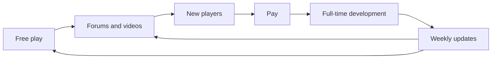

> **This chapter's thesis**: what the paid Alpha sold was not an unfinished game; it was a promise that the world would keep changing. Because of that promise, players became co-authors — and the author took on a debt of continuous delivery.

## The problem

One Friday in 2010, you open the Minecraft website and find the game has changed shape again: maybe boats this time, maybe rails. Nobody tells you what changed — the update notes are usually one cryptic line. To find out, you have to walk into a world yourself, or go to the forum and see what other people have dug up. By that evening, the first explainer videos are already online.

This scene repeated almost weekly through 2010. It was frequent enough that people forgot something strange: the game was not finished — and it charged money.

This chapter answers two questions. One comes first in time: why would anyone pay for an unfinished game? The other runs through the whole book: how did early updates turn players into co-authors?

## Why anyone would pay for an unfinished game

Start with the default practice of the time. Around 2009, the normal way to sell a game was: finish it, market it, ship it. Players paid for the finished product; the unfinished part belonged in the developer's office, not on the shelf.

Minecraft sold that sequence in reverse. On September 1, 2009, Survival Test went live — initially open only to paying members, at 9.95 euros. [^st] That was nine months before the "Alpha" label went up, and more than two years before the game's official release.

What did the people paying get? The list is short: a health bar, a few kinds of monsters that attack you, a bow, twenty arrows, and a score. Die, and you could never enter that world again. No crafting, no equipment — running a home was out of the question.

<Note>Alpha and Beta were the common development-stage labels of the day: an Alpha was playable but missing a lot; a Beta had most of its features and was being polished. Not an official certification — just a scale everyone had agreed on.</Note>

So why pay? Taken apart, the transaction had three defensible components.

First, you had already played it for free. Classic had been sitting on the website, free, playable in a browser. Paying was not a gamble from scratch; it was ratifying an experience you had already had: you knew breaking and stacking blocks was fun, and you paid to see what it could grow into.

Second, the price was public: earlier was cheaper, later was dearer. Beta later rose to 14.95 euros, the full release cost more, and early buyers never paid another cent. [^alpha] Early trust earned a discount, and that turned "wait until it's done" into arithmetic you could actually do.

Third — and easiest to miss — you could see who the money went to. Notch serialized development on his blog: what he would do next, where the money went, all on the table. Paying for a game with no publisher and no advertising was less a purchase than patronage — you gave money so he could keep going.

For contrast, look at the industry's "proper answer" at the time: the crowdfunding platform Kickstarter launched only in 2009, and "take the money first, build later" was still treated as fantasy in games. Minecraft never ran a crowdfunding campaign — it simply made crowdfunding the everyday state: no one-time goal amount, no backer rewards list, just a business that stayed open. Players were not supporters; they were customers. Customers are pickier than supporters, but they also last longer.

This claim is falsifiable: if players were paying for the current state of completeness, every price rise should have suppressed sales. The opposite happened — the figures published later show the overwhelming majority of sales came precisely when the game was cheapest and least complete. [^1m] What people bought was genuinely not a finished product.

## Survival Test → Indev → Infdev: from finite to infinite

<Note>In this era only Java Edition exists — Bedrock Edition and its predecessors were still years away — so when this chapter says "the game" from here on, it no longer splits the two editions.</Note>

Survival Test had a narrow question to answer: could "staying alive" carry a game's core loop. Health bar, monsters, death penalty — all in place; the scoreboard betrayed its lineage — at that point it was more an arena than a world.

The real watershed lies between two winters.

Indev launched on December 23, 2009, open only to players who had paid. [^indev] It brought three things that changed the game's identity: crafting (wood into planks, planks into tools), the furnace (ore smelted into metal), and torches with lighting (monsters appear in the dark, so you light your rooms). For the first time players began "accumulating possessions": stockpiling wood, stockpiling coal, building a proper base. The world itself was still finite — a bounded map, with selectable shape and theme, walkable from center to edge in a few minutes.

A finite world fixes the shape of the game's question: here is a plot of given size; your task is to "last long inside it." It is an arena, only bigger.

Note the order: first put the survival loop on a small plot and prove it is fun; only then remove the boundary and enlarge the space. The order cannot be reversed — infinity is only an amplifier; it amplifies what already exists. A loop that is not fun becomes infinitely boring; a loop that is fun makes infinity mean infinite possibility.

Infdev broke that premise. On February 27, 2010, Notch posted the new build on his blog: "There's a lot of bugs and a lot of missing features, but here, have some infinite maps." [^infdev]

Register the texture of that sentence. It is not announcing a technical achievement; it is shipping a half-finished thing. Infinite terrain could do far less than Indev at that moment; doors, minecarts, and the rest were moved in piece by piece over the following months. But the decisive design step had already been taken: the world's boundary was gone.

Why call it a design event rather than a technical achievement? Because it changed the question players ask. In a finite world you ask "how do I survive today"; in an infinite world that question soon stops being enough, and you start asking "where should I live," "what is past those hills," "should I go farther and find better ground." The world no longer reports a total to you — you can never clear it, so there is always another mountain over there. Your base turns from "a cell on the map" into "the origin of the infinite": the world does not revolve around you; you drive a stake into the boundless.

This is not rhetoric in new clothes — behavior really changed. Players began walking far to pick a site, building roads, warehouses, and landmarks, treating "going home" as part of the game's content. If infinity only meant "a bigger map," those behaviors would not appear — that is where this section's claim can be falsified.

The verbs dig and place came from Infiniminer; see [From Infiniminer to Cave Game](/history/infiniminer) for that story. This chapter cares about the next link: the verbs exist, the world is infinite — what remains is how to keep it changing.

<Impl title="How an infinite world fits in memory">In one sentence: slice the world into "chunks," generate wherever the player goes, and hand everything out of sight to disk. The details of that pipeline — generation order, light recompute, update scheduling — are Volume III's subject; see [Infinite World Generation](/impl/worldgen-pipeline).</Impl>

<Constraint name="The infinite world" verdict="groundwork" chain="boundary disappears → home changes meaning → content always has another mountain">Infinity is not a size parameter; it is a rewrite of the rules: exploration no longer has a checklist, building has an origin point, and all later content design — caves, ruins, biomes — assumes "the player can always take one more step forward." The whole content system that followed was built on this groundwork.</Constraint>

## The feedback loop: forums, YouTube, word of mouth — not advertising

Why no advertising? Half the answer is no money: no publisher, no budget. The other half is that it did not need any. The product's shape happened to coincide with the shape of person-to-person spread — it kept changing, every change was a new topic, and players already owned the channels topics travel through.

The loop looked like this:

No single link contains a miracle; the miracle is the links together.

Forums were the first link. Minecraft lived on forums from birth, Notch read feedback, and he often executed it to the letter — Indev's first build was released in response to the community asking to try the new features. [^indev]

But co-authorship had more than the one path of "request, then fulfilled." The creeper — the green thing that hisses and explodes when it gets close — came from a pig model gone wrong: the body proportions were mixed up, and Notch found the botched result interesting in itself and kept it. [^st] Requests answered, accidents embraced: two roads to the same outcome — players can recognize their own traces in the game, and the author can turn accidents into content.

The other half must be said too: co-authorship did not mean community voting. Notch took in a great deal of feedback, but the deciding hand stayed his — the loudest wishes on the forum were not always built, and things he added on his own initiative were not universally cheered. Because the author kept veto power, co-creation never decayed into a design committee. This was a fragile and crucial balance in the early relationship.

YouTube was the second link, and in 2010 the biggest. Minecraft videos already formed their own genre that year: screen capture plus commentary — some teaching, some showing builds, some just taking viewers on a stroll. For creators the game was near-perfect: it changed weekly, so there was always something new to film; worlds were infinite and everyone's world was different, so watching someone play meant seeing someone's world. For viewers, video incidentally solved a problem the official side never addressed: the game had almost no built-in teaching — recipes, tricks, and cautions all circulated through the community.

<Memoir title="There was no official textbook for this game">In 2010 a new player had essentially one path into Minecraft: other people's videos and forum posts. No tutorial in the game, no recipe book — how to craft torches, what to do on night one, all passed mouth to mouth by the community. Putting the recipe book into the game came many years later.</Memoir>

The way updates shipped oiled the loop too. The Alpha-era routine was the "Seecret Friday update": an update every Friday, almost no patch notes, and whatever changed was left for players to find in-game. [^alpha] An update became a collective puzzle — someone on the forum drew up the list, video authors raced to be first, and the onlookers clicked in to watch the commotion.

This section is falsifiable too: if growth had another engine, loop theory is mere decoration. But it had no other engine — no publisher, no advertising budget, no platform featuring. By January 2011, the game's announced cumulative paid users had passed one million, and the cost of distribution was near zero. [^1m]

## Early multiplayer: living in the same world as others

Multiplayer came even earlier than paying. The Classic stage already had multiplayer building: the server software was handed to players, anyone could run one, and you sent the address to friends. So even while Survival Test was validating "staying alive," a fleet of free, player-run servers was already online, accumulating player-built worlds.

What players played out on those servers exceeded any design list; the most famous example sits in the box below.

<Memoir title="Spleef: a sport players invented themselves">In the Classic multiplayer era, a few players on one server invented Spleef — the rules fit in a sentence: dig out the blocks under the other players' feet, do not fall yourself, and the last one standing wins. It never appeared in any design document, yet it became a fixture of that era's servers: some people built arenas, some codified rules, some ran tournaments. The gameplay was written by players; the author ratified it afterward.</Memoir>

The design implication sits here: multiplayer turned Minecraft from a "game" into a "place."

Singleplayer survival is a game: progress, goals, a growth line stretching ever outward. A multiplayer server is a place: your save is no longer just a progress bar but somewhere other people can walk into — friends know where your house is, remember the bridge you built, arrange to go mining together next time. The "inhabitable" quality this book keeps invoking first becomes literal here.

Multiplayer survival came later — the Alpha had been running for over a month before survival moved onto servers. [^alpha] From "building together" to "surviving together": lighting lamps together, mining together, keeping watch at the door through the night together.

One less cozy by-product: if others can enter your world, others can wreck it. Griefing — the players' own word for it — has been part of server life since the Classic era; server admins had to write their own rules, set up defenses, and keep ban lists. The question "who has the right to make the rules" was not imposed on Minecraft from outside; it grew the day multiplayer went online. How big it grew is a matter for the design volume.

## The paid Alpha: trust and lock-in happen together

On June 30, 2010, Minecraft formally put up the Alpha sign: from this build on, the game was for sale, not free — 9.95 euros. [^alpha] The same month, Notch quit his day job to work on Minecraft full time. [^persson] These are really one event: paying players' money replaced the paycheck.

The transaction structure deserves writing on the blackboard: one payment, all later updates free; the price would rise as development progressed — Beta at 14.95 euros, the full release dearer still. [^alpha] This price curve turned time into currency: early trust carried a clear discount, and "wait and see" carried a clear cost.

The real engine was still the updates. Alpha-era update density was abnormal: Seecret Friday updates fixed in place, changes left unclear for the community to discover. [^alpha] The sales curve tracked the updates: a mid-July build sold 1,000 copies within 24 hours of release — the Minecraft Wiki still labels that version "1K IN 24h." [^alpha] In September the authentication server broke once; Notch simply turned the failure into a free weekend, the press picked it up, and a wave of new buyers followed. [^alpha] Even accidents were digested into growth by the update rhythm.

The most honest entry lands in autumn. Biomes — the system that divides the world into deserts, forests, snowfields, and other distinct landscapes — was the feature Notch teased all summer, and it slipped all summer. On September 18, that week's update blog confessed in its own title: "Seecret Saturday 1! But I failed Biomes AGAIN!" What that build actually delivered was sneaking (hold Shift to move slowly and silently, and not fall off edges); biomes were owed once more; and the post closed by teasing that "hell biomes will be used for an alternate fast-travel dimension." [^ss1] Six weeks later, on October 30, the Halloween Update shipped: twelve biomes and the Nether, delivered in one stroke. [^halloween]

Read the three moves together: tease, self-mocking slip, delivery as promised. Updates here are not maintenance; they are serialization — with foreshadowing, with hiatuses, with double-length installments. Anyone who has followed a serial knows how this kind of loyalty forms: you followed it, so it owes you — and then it paid up.

<Figure src="/images/alpha-v1.2.6.png" alt="Minecraft Alpha v1.2.6 gameplay: a beach, the ocean, and distant trees, with the version number top left and the health bar and hotbar below" caption="The world of Alpha v1.2.6: beach, ocean, and distant trees after the Halloween Update — version number top left, health bar and hotbar below. Source: Minecraft Wiki." />

Now we can talk about the "lock." Trust and lock-in happened together, and what got locked was not a contract but opportunity cost.

For players, the save is a world. Every base you built during the Alpha grew inside a game that was itself still growing. Leaving is not uninstalling software; it is abandoning terrain you know well and that is still changing. Time invested is currency too: a hundred-hour world is harder to put down than a ten-hour world, and the countless "one more night" decisions since were that investment voting. The bigger the world, the dearer the exit — this lock was fastened by players on themselves; nobody forced it.

For the author, the promise is a debt. Once "visible change every week" becomes habit, it stops being a benefit and becomes an obligation: the moment updates slow down, trust starts accruing interest; a slipped date is no longer an internal schedule matter but a community event — that self-mocking title is both humor and a list of interest owed. The "update as festival" that players later knew, and the delay anxiety that came with it, were signed on the same contract: update rhythm became politics — see [Version Politics](/history/version-politics); and the engineering debt the infinite world took on began accruing at the same time — see [Technical Debt](/impl/tech-debt).

When does this loop go bankrupt? Two ways: early buyers being asked to pay again for a new version; or updates stalling for a long time while players do not care. If either happens, "co-authors" is self-flattery. By January 12, 2011, cumulative paying users stood at 1,003,151, most of whom had entered at the cheapest, most incomplete stage, with revenue above thirteen million dollars [^1m] — the first did not happen. As for the second, the history after this chapter keeps setting exams for that claim.

<Constraint name="Paid development in the open" verdict="groundwork" chain="cash flow replaces investors → the author answers only to players → update rhythm becomes the product">The Alpha's pricing structure let development funds come straight from players: no investors, so no direction bent for anyone. The cost was just as real — the author carried an implicit contract that updates cannot stop. This is groundwork; but groundwork grows its own debt.</Constraint>

## What this chapter leaves behind

- **For players**: much of what you take for granted — crafting, infinite terrain, the Nether, sneaking — did not arrive one day as an "update"; it grew in front of the first players' eyes. People who played the Alpha were not watching a finished product; they were watching a draft.
- **For developers**: what you can copy is the transaction structure — free entry, a rising-price expectation, all future updates bundled in, updates themselves as distribution. What you cannot copy is the bandwidth of a single author reading all the feedback personally; make the team bigger and this loop starts to distort.

[^st]: Minecraft Wiki, "Java Edition Survival Test", retrieved 2026-09-17; see https://minecraft.wiki/w/Survival_Test — Survival Test (Classic 0.24_SURVIVAL_TEST) launched September 1, 2009, initially open only to paid members at 9.95 euros, free for everyone from October 24, 2009; after death the world could no longer be entered; the creeper originated from a botched pig model.

[^indev]: Minecraft Wiki, "Java Edition Indev", retrieved 2026-09-17; see https://minecraft.wiki/w/Java_Edition_Indev — Indev launched December 23, 2009, open only to players who had purchased the game; maps were finite, with selectable shape, type, and theme; it introduced crafting, the furnace, and dynamic lighting; the first build (0.31) was released in response to community requests to try the new features.

[^infdev]: Markus Persson, "Here, try some infinite maps", The Word of Notch (Tumblr), 2010-02-27; see https://web.archive.org/web/20140427012038/http://notch.tumblr.com/post/415398931/here-try-some-infinite-maps — original: "There's a lot of bugs and a lot of missing features, but here, have some infinite maps." See also Minecraft Wiki, "Java Edition Infdev", https://minecraft.wiki/w/Java_Edition_Infdev — Infdev's first phase ran from February 27 to March 25, 2010, adding minecarts, doors, signs, and more, with the aim of bringing infinite terrain up to Indev's content, before being superseded by Alpha.

[^alpha]: Minecraft Wiki, "Java Edition Alpha", retrieved 2026-09-17; see https://minecraft.wiki/w/Java_Edition_Alpha — Alpha began June 30, 2010, priced at 9.95 euros; Beta began December 20, 2010, with the price raised to 14.95 euros; "Seecret Friday" updates shipped during this period, with changes left for players to discover; Alpha v1.0.15 first added survival multiplayer; version v1.0.13_01 is labeled "1K IN 24h" (1,000 copies sold in 24 hours).

[^persson]: Minecraft Wiki, "Markus Persson", retrieved 2026-09-17; see https://minecraft.wiki/w/Markus_Persson — Persson first moved from full-time to part-time at jAlbum, and left in June 2010 to develop Minecraft full time.

[^ss1]: Markus Persson, "Seecret Saturday 1! But I failed Biomes AGAIN!", The Word of Notch (Tumblr), 2010-09-18; see https://web.archive.org/web/2011/http://notch.tumblr.com/post/1144331509/seecret-saturday-1-but-i-failed-biomes-again — this build added sneaking; the author stated biomes had failed again, and teased that "hell biomes will be used for an alternate fast-travel dimension."

[^halloween]: Minecraft Wiki, "Java Edition Alpha v1.2.0", retrieved 2026-09-17; see https://minecraft.wiki/w/Java_Edition_Alpha_v1.2.0 — the Halloween Update was released on October 30, 2010, adding 12 biomes, the Nether dimension, fishing, and mobs such as ghasts and zombie pigmen.

[^1m]: GamesIndustry.biz, "Minecraft hits 1m sales", 2011-01-13; see https://www.gamesindustry.biz/minecraft-hits-1m-sales — the article records 1,003,151 cumulative paid users, with 7,438 copies sold in the previous 24 hours; Alpha priced at 9.95 euros, rising to 14.95 euros at Beta; corresponding revenue of at least 13 million US dollars.
