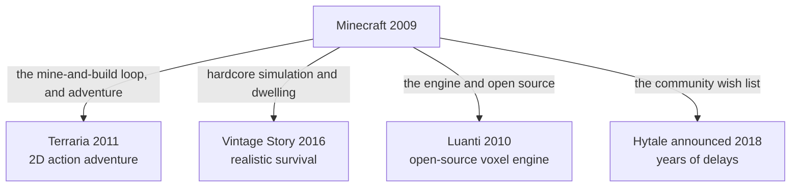

> **This chapter's thesis**: the "next Minecraft" is hard to produce not because its gameplay went uncopied — the gameplay was copied long ago — but because the circumstances of its rise cannot be replicated.

## The problem

Every year or two, gaming news produces a new "Minecraft killer." The list is long: one has finer graphics, one has punchier combat, one collects the title before it has even shipped. And then? Then it dissolves into the next news cycle, the title is vacated, and handed to the next candidate. A decade-plus on, Minecraft itself is still here: as of 2023 it had sold more than 300 million copies, the best-selling video game in history.[^wiki-minecraft]

Players know the cycle well enough to consume it ironically. Mobile-game advertising has long carried a breed of "fake Minecraft" ad: the footage shows mining, house-building, crafting — all of it — and tapping through usually leads to a different game, sometimes with nothing to do with blocks at all.

<Memoir title="The fake ads became a running joke">

Among the longest-lived complaints in the player community is exactly this false advertising: video footage borrowed straight from Minecraft's visuals and gameplay, packaged into a completely different product. Threads mocking it reappear year after year, and eventually the mockery itself became part of community culture — players warn each other "don't trust that ad." The flood of counterfeits thus became a shared experience of a whole generation of players.

</Memoir>

The question this chapter answers: imitators and challengers appear every year — why has the "next Minecraft" never come? Calibrate the question first. If "the next Minecraft" means merely "another game with blocks, crafting, and survival," there is nothing to wait for — there is one every year. The real question is: why has the gameplay long since scattered into countless products, while the successor never appeared?

## Every year brings a Minecraft-like

A definition first. In this book, a Minecraft-like is a game satisfying two conditions at once: visually, the world is assembled from regular blocks; in play, mining, placing, and crafting form the core loop. By this standard, new qualifying titles arrive every year. In the phone app stores, products with "craft" in the name grow in sheets year-round — too many for any meaningful precise count, so only the magnitude "in sheets" can be given.

But "many" does not mean "same." These products come in two kinds, with utterly different fates.

The first kind is the wholesale clone: copy Minecraft's mechanics checklist as literally as possible, swap in new art and names. Most of these die without a sound. The reason is not hard to see — they chose "resemblance" as their competitive dimension, and on that dimension Minecraft cannot be beaten. The more your blocks resemble the original's, the more the player thinks: if it's identical, why not play the original? The original has a decade-plus of accumulated servers, mods, tutorial videos, and a generation's muscle memory. The better the clone, the better it advertises the original.

The second kind is the lineage: take one layer of Minecraft, push it to its limit, and grow into a different creature. These live well. Terraria carried the loop into two dimensions and sold seventy million copies;[^wiki-terraria] Vintage Story pushed survival realism to the extreme; Luanti pushed engine open-sourcing to the extreme; Hytale tried to turn the community's wishes directly into a game. Not one of them is "a better Minecraft" — none of them ever competed on resemblance.

The fork between the two fates fits in one sentence from a member of the Re-Logic team. Terraria has been compared with Minecraft its whole life, and their answer was: people need to understand that Minecraft is no longer a game, but a genre.[^wiki-terraria] A genre can have countless members, but the seat of genre-definer is one. Imitators crowd onto the definer's seat; lineage members each go found their own hill.

How would this be wrong? If some future wholesale clone took Minecraft's mainstream player base by being "more alike," the judgment "clones die, lineage lives" would be false. So far, it has not happened.

## The lineage: which layer each inherited

Put the four points of comparison on one map, and you can see at a glance which layer each took from Minecraft and what it grew into. Note that Roblox is not on the map: it is not a branch off Minecraft's trunk but another road entirely, covered separately in the next section.

### Terraria: the loop and the adventure

Terraria is Re-Logic's two-dimensional game of mining, building, and combat, released on Steam on May 16, 2011.[^wiki-terraria] Before release, Notch introduced the still-in-development game to his Twitter followers.[^wiki-terraria] The imitated personally funneling players toward an imitator — the anecdote is a reminder that the early relationship between the two communities was far milder than the "killer" narrative.

What Terraria took from Minecraft is the loop of "mine–craft–grow stronger–go deeper," plus the adventure structure strung together by bosses and events; what it dropped is three-dimensional space and the free-building sandbox. It is side-view two dimensions: building is decoration; combat is the substance. On the road it chose, it went far — still updated more than a decade after release, with more than seventy million copies sold.[^wiki-terraria]

Its existence proves one thing: Minecraft's core need not be the block as a form; it is the loop of "resources become ability, ability opens a bigger world." Blocks are only the carrier. The carrier's shape can change; change the loop, and the game has a different ancestor.

### Vintage Story: hardcore simulation and dwelling

Vintage Story is a survival game by Anego Studios, on public sale since September 2016 and still in early access.[^wiki-vintagestory] What it does fits in one sentence: it restores every abstract step of Minecraft-style survival into a concrete procedure. Finding ore means learning to read geology; smelting iron means building your own kiln; food spoils; seasons and weather genuinely turn.

It inherits survival's weight and dwelling's depth: it refuses to treat survival as a gate to progress and makes the living itself the content. What it dropped is mass accessibility — the learning curve turned most players away, and those who stayed are intensely loyal.

For the lineage question, its value is that it reads like a deduction of a direction Minecraft never chose. Minecraft's crafting is abstraction you can use on pickup: three cobblestone plus two sticks equals a pickaxe. Vintage Story asks: if "making a pickaxe" is restored into the full procedure of prospecting, smelting, and forging, what does survival become? The answer is deep dwelling by a small group of players. On its chosen road it went extremely deep, and accepted being extremely narrow.

### Luanti: the engine and open source

Luanti was originally Minetest, started in October 2010 by the Finnish programmer Perttu Ahola (online name celeron55) as a free, open-source voxel game engine.[^wiki-minetest] Its radicalism: today the project does not even have "official gameplay" — releases ship no default game at all; every bit of content comes from community-maintained subgames and mods.

It inherits the redevelopability layer. Minecraft lets players modify the world; Minetest goes a step further and lets players modify the game itself; what it dropped is the packaging of "a game." In October 2024, the project renamed itself Luanti, partly out of the worry that new players would mistake it for a Minecraft clone when it is in fact an engine.[^wiki-minetest]

Of the four branches, it went the furthest: Terraria changed the content's form, Vintage Story changed the depth of realism, Luanti abandoned content altogether. "Can be redeveloped" itself became the product.

### Hytale: "what the community wanted"

Hytale is developed by Hypixel Studios. Hypixel itself is one of the largest servers in Minecraft, and when the studio announced Hytale in December 2018, players read it as "the game the Minecraft community always wanted": more varied biomes, snappier combat, built-in modding and server tools — the wish list was all but the design document.[^wiki-hytale]

What it inherited was not a layer of mechanics but the community's collective wish — which is precisely the hardest layer to deliver. After the trailer raised enormous expectations, scope kept swelling and release kept slipping; in April 2020, Riot Games acquired the studio outright; in June 2025, the project was cancelled and the studio shut down; that November, the founder bought the IP back and rehired some of the developers; and in January 2026, the game finally entered early access.[^wiki-hytale] From announcement to playable: eight years.

<Constraint name="The wish list as design document" verdict="passable" chain="community wishes become design goals directly → scope only ever grows → the release slips indefinitely → the backers lose patience and shut it down" />

The lesson is not "never build what the community wants." Hytale's wish list was not itself the mistake; the mistake was treating a wish list as an engineering plan deliverable in order of wishing. The community knows what it wants; it does not know how long it is willing to wait. The lineage's other three layers — loop, depth, engine — are design assets; "what the community wants" is a design liability.

## Roblox: platform versus game

Now the true fork. Roblox is not a member of the lineage; by this chapter's opening definition, it is not even a Minecraft-like. It is a game platform and creation system operated by Roblox Corporation: players use the platform's creation tool, Roblox Studio, to make games for other players to play; it opened to the public in 2006.[^wiki-roblox] Minecraft's players build houses inside a game; Roblox's players build games inside a platform. One is a game, the other a platform — that line is this section's axis of comparison.

Minecraft took the gamification road: the official side maintains one rule-bound world in which players survive and build; advanced players step past the official boundary to make mods and run servers, growing a second authorship (see ["Mods as the Second Author"](/history/mods-as-authors)). The subject of content production is the players, but the production tools and the rules stay in official hands; the ecosystem grows outside the product.

Roblox took the platformization road: the platform itself makes no content and supplies exactly three things — creation tools (Roblox Studio and the Luau language), an economy (the Robux currency and creator payout shares), and a distribution channel (homepage recommendations and age ratings). Creation turns from a player's hobby into an occupation and a business inside the platform; the ecosystem grows inside the product and inside the rules.

Set side by side, all three axes change. Who produces the content: on one side, the official team plus a grey-zone community; on the other, professional creators inside the platform. Who sets the rules: on one side, Mojang sets physics and crafting; on the other, the platform sets engine and revenue share, and each experience's author sets the gameplay. How money flows: on one side, a one-time purchase; on the other, a virtual currency plus revenue share. In scale, both are giants: Roblox had about 85.3 million daily active users in early 2025, was valued around 45 billion US dollars at its 2021 IPO, and the company says its monthly players cover more than half of American children under 16; creator payouts ran about 30 million dollars in 2017, about 100 million in 2019, and about 250 million in 2020.[^wiki-roblox] Minecraft's monthly actives over the same years number in the hundreds of millions — 112 million by the official figure of September 2019.[^wiki-minecraft] But the two magnitudes are not on the same track; comparing their daily actives is like comparing the blood circulation of two different organs.

So "Roblox-like" and "Minecraft-like" are two different roads, not two ways of pursuing one goal. The former competes for developers: whoever has the better tools to write, the easier distribution to obtain, the higher revenue share — thither the creators go. The latter competes for players: whose world is worth inhabiting and whose memories run deeper — there the players settle. The moats are entirely different: a game sells a world worth remembering; a platform sells a shelf of endless worlds.

Roblox did not kill Minecraft, and shows no apparent intent to. But it did one thing with lasting consequences for imitators: it annexed the "clone" niche. Minecraft-style experiences have long existed on the platform in numbers — blocks, mining, crafting, all present — and they no longer need their own release or their own storefront. The best habitat for the next Minecraft-like, it turns out, is Roblox itself.

<Alternative title="Platform or game: choose your side before you build">

A triage test for developers: if your conception has players coming each day to inhabit the same world, you are on the gamification road, and the center of gravity is the world's feel and the honesty of its rules; if players come each day to pick the next new world, you are on the platformization road, and the center of gravity is creation tools, the economy, and the recommendation algorithm. Nothing on one road substitutes for the other — setting out to platformize while spending three years polishing one level's story, or setting out to build a game while effort goes into a revenue-share system, is spending your strength inside the opponent's moat.

</Alternative>

How would this section's judgment be wrong? If Roblox's mainstream usage became players dwelling long-term in a single world, the line between gamification and platformization would blur, and this axis of comparison would fail. There is no such sign yet: the platform's daily use is still moving from one experience to the next.

## Concrete effects on open worlds, survival, sandboxes, and UGC

Saying "profound influence" in general carries no information. What is worth writing down is the spread of specific mechanisms. Pick the five that show most clearly, one at a time.

**Voxels: from expedient to genre promise.** Minecraft used blocks at first only so that an engine one person could write could hold a world players could change. Afterward, the voxel turned from a technical choice into a signal aimed at players: blocks on the screen tell the player "this world can be taken apart by you." On mobile, craft, sandbox, and a blocky art style became category keywords; one store search returns them in sheets. Most are of mediocre quality, but their existence en masse is itself the evidence of influence: a visual grammar being used as a market signal.

**Crafting: the universalization of a progression grammar.** "Punch a tree for wood, wood into a workbench, workbench into a wooden pickaxe, pickaxe into stone" — this curve is now the standard opening line of the survival genre. Crafting's form has kept mutating along the way: Minecraft's is a grid puzzle, Terraria simplified it to a list, and most games simply grow it into a tech tree. "Resources → intermediate goods → tools → a bigger world" rose from one concrete ruleset to the genre's universal grammar.

**Hunger: the standardization of a switch.** In September 2011, in Beta 1.8 — the "Adventure Update" released on the eve of the game's full launch — Minecraft added the hunger bar, and food changed from directly restoring health to maintaining satiety.[^wiki-minecraft] Since then, the hunger bar has been the survival game's default switch: add it and the game is not necessarily more fun; leave it out and players ask "and this calls itself a survival game?" Whether to flip the switch is each game's own design question, but that the switch exists at all is the trace of a genre defined by Minecraft.

**Procedural generation: from technique to trade-off.** Generating worlds by algorithm is not Minecraft's invention — roguelikes did it earlier. Minecraft's contribution was making it a mass experience: every player's world is different, and a world can be shared and reproduced with a string of seed characters. Open-world games since have had to answer a new question: is your content handmade or generated? In recent years, several massive-selling survival games have made procedural generation the default. Handmade uniqueness versus generated scale is now the first trade-off in green-lighting an open world.

**UGC: from grey zone to business model.** Minecraft proved that player-produced content could outgrow any content team — server economies, mods, maps, teaching videos. Roblox cashed that proof into a business model, and a line of "game-as-platform" products followed: Fortnite's creative mode, Core, Dreams. Today, "let players make content" is stock phrasing in commercial pitches — but most pitches copy the phrase without its premise: players are willing to create because the world was worth inhabiting first.

Put the five together: what spread was not the skin of blocks but a grammar — the world is modifiable, progression is customizable, the community can reproduce itself. Which parts of that grammar can move into your product and which cannot, the ["Checklist of Transferable Principles"](/design/transferable) takes up item by item.

## The conditions that cannot be copied

Return to the chapter's question: with the mechanics long since scattered, why has the "next Minecraft" not come? Because competitors can copy the mechanics and cannot copy these four things.

**First, timing.** In 2009–2011, while Minecraft rose, digital distribution for indie games had just matured, and an ordinary computer sufficed both to develop and to play. More important, YouTube's gaming section took shape in exactly the same window: the readability of blocky visuals made "watching someone else play" work as entertainment, videos brought players, players produced videos — growth and spread became each other's cause. That mechanism is developed fully in ["Video, Education, and a Generation's Medium"](/history/media-education). The same game released today faces not an empty information environment but attention shredded by recommendation algorithms; it would not spread by word of mouth — it would be drowned by the next ten-minute fad.

**Second, the media window.** Around 2010, Minecraft was many children's first "owned" game: no console needed — the family computer could run it; one purchase, and every later update was free. It thereby occupied a generation's gateway position. A gateway belongs to one game at a time — while the window is open, latecomers cannot get in; once it closes, the same product is just "another one." The second generation already has its own gateway, and most gateways do not open twice.

**Third, twenty years of toolchain.** For today's veterans, the cost of leaving Minecraft is not learning another game but rebuilding the entire downstream: servers, mods, datapacks, commands, tutorials, skins, maps. A decade-plus of official and community toolchains has pushed the marginal cost of "rebuilding a world" toward zero — and this redevelopability is the subject of the rewrite volume (see ["What Are We Actually Rewriting"](/rewrite/what-to-rewrite)). A competitor starts with no downstream at all. Players have never compared two games' rules; they compare the depth of two ecosystems.

**Fourth, undefined behavior absorbed as API.** The cobblestone generator is no designer's work — players found it in the crack between fluid and block behavior; the timing quirks of redstone, the workings of mob farms — half design, half fait accompli. After several changes triggered community protest, Mojang learned to maintain these "undesigns" as de facto standards. And so Minecraft's rules carry a layer of sediment found nowhere else: a decade-plus history of collusion between players and rules. A new game can copy the rulebook; it cannot copy the collusion history — without history there are no "things that must not be touched," and without those, no moat of this kind.

Put the four together and the answer takes shape. The "next Minecraft" is hard not because blocks and crafting are hard to make — every year has those — but because it would have to hold, all at once, a new grammar, an empty niche, a generation's gateway, and the decade-plus it takes for a downstream ecosystem to take root in you. Copying any one of the four is feasible; occupying all four simultaneously demands more than product ability — it demands historical luck. Luck accounts for at least half of Minecraft's success conditions.

The chapter's judgment can be overturned, and the method is explicit: should a future product satisfy all four conditions at once — even a non-game, some other form of creation platform — "the circumstances cannot be copied" is wrong. Such an overturn would have precedent: Roblox itself did it once. It did not win inside Minecraft's definition; it replaced the definition. If the next Minecraft truly comes, chances are it will not wear a blocky face.

## What this chapter leaves behind

- **For players**: stop asking who killed Minecraft — every heir carried off a single layer, and the layer carried off grew into a different creature. The lineage is far more interesting than the killers.
- **For developers**: mechanics can be copied; circumstances cannot. What you can carry off is the transferable grammar (["Checklist of Transferable Principles"](/design/transferable)); what you cannot — timing and ecology — will not fit in a project proposal. Before you start, decide which you are building: a game, or a circumstance (["What Are We Actually Rewriting"](/rewrite/what-to-rewrite)).

[^wiki-terraria]: Wikipedia, "Terraria," retrieved 2026-09-18, https://en.wikipedia.org/wiki/Terraria (developed by Re-Logic, published by 505 Games; Steam release 2011-05-16; Notch's tweets during development brought early attention; more than 70 million copies sold as of May 2026; "Minecraft is no longer a game, but a genre" — a Re-Logic team member speaking to The Guardian, as cited in the article)

[^wiki-minecraft]: Wikipedia, "Minecraft," retrieved 2026-09-18, https://en.wikipedia.org/wiki/Minecraft (more than 300 million copies sold as of 2023, the best-selling video game in history; Beta 1.8, the "Adventure Update," released 2011-09-14, adding the hunger bar and changing food from directly restoring health to maintaining satiety; 112 million monthly active players across versions in September 2019 — the sales and monthly-active figures are cited in the article to contemporaneous reporting by the BBC and Engadget)

[^wiki-vintagestory]: Wikipedia, "Vintage Story," retrieved 2026-09-18, https://en.wikipedia.org/wiki/Vintage_Story (developed and published by Anego Studios, founded by Tyron and Irena Madlener; development began 2016-04-05, public sale from 2016-09-27, long in early access)

[^wiki-minetest]: Wikipedia, "Minetest," retrieved 2026-09-18, https://en.wikipedia.org/wiki/Minetest (started October 2010 by Perttu Ahola, online name celeron55, with 0.0.1 released on November 2; a community-driven free and open-source voxel game engine; official releases no longer ship a default game — all content comes from community subgames and mods; renamed Luanti, announced 2024-10-13, the name taken from Lua and the Finnish "luonti" (creation))

[^wiki-hytale]: Wikipedia, "Hytale," retrieved 2026-09-18, https://en.wikipedia.org/wiki/Hytale (development from 2015; revealed 2018-12-13; originally planned to be playable in 2021, repeatedly delayed by scope growth; fully acquired by Riot Games 2020-04; engine migration announced 2024-07; cancellation and the shutdown of Hypixel Studios announced 2025-06-23; co-founder Simon Collins-Laflamme announced buying the IP back from Riot and rehiring 30 developers on 2025-11-17; early access from 2026-01-13)

[^wiki-roblox]: Wikipedia, "Roblox," retrieved 2026-09-18, https://en.wikipedia.org/wiki/Roblox (development by David Baszucki and Erik Cassel from 2004, opened to the public in 2006; IPO in March 2021 at a valuation around 45 billion US dollars; average 85.3 million daily active users as of February 2025; the company says its monthly players cover more than half of American children under 16; creator payouts totaled at least 30 million dollars in 2017, about 100 million in 2019, and about 250 million in 2020 — the developer-income figures are cited in the article to past Roblox developer conferences and reporting by TechCrunch and Screen Rant)
