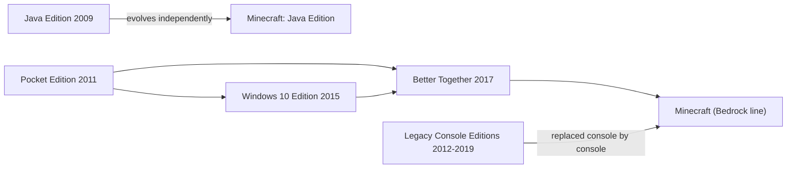

> **This chapter's thesis**: the coexistence of two Minecrafts is not a technical mistake but the normal result of product logic; yet every problem the product logic solved left a debt on the technical side and on the community side, and those debts ended up limiting the product in return.

## The problem

Start with a scene you may have lived through. A friend group, half playing on phones, half on computers. You agree to play together on the weekend; the voice chat is on, the game is open — and then you discover the two sides cannot enter the same world at all. The phone cannot see the world the PC opened; the PC cannot find the phone's room. Both are called Minecraft, both carry that grass-block icon, and they simply cannot meet.

Most people's first reaction is to treat it as a network problem: switch Wi-Fi? Use a hotspot? Neither works. These are two independently evolving games. The one on the computer is the 2009 original, written in the Java language, which everyone calls Java Edition; the one on the phone was first called Pocket Edition, and after the 2017 naming unification it is officially just Minecraft — to keep it distinct, the community names it after the engine it runs on, calling it Bedrock Edition. This book follows the community's usage: Java Edition and Bedrock Edition.

The two editions differ even in temperament. A piston contraption a Java player builds by following an online tutorial may simply sit dead on a phone — not because it was built wrong, but because the two sides have not even fully aligned on "how redstone signals propagate." These are not two skins of one garment; they are two bodies.

The split is not monolithic either. The two editions share a great deal: blocks, crafting, the basic approach of world generation, the skeleton of survival — because they implement the same design. The divergence concentrates in the corners of mechanics and the depths of systems, and those corners are exactly where players stay longest. This chapter is about how the divergence was manufactured, named, and priced.

If you have only ever played one edition, the other is nearly a different game to you. After this chapter, "two Minecrafts" will no longer be a rhetorical flourish but a list.

This chapter answers two questions: why are there two Minecrafts? And how did the split grow from "a fact" into "a debt"?

## Why "buy one, play it all" does not work

In 2011, Minecraft blew up. Its entire estate at the time was Java Edition: a game that ran on desktop computers — provided your computer could install the Java runtime (the base software the game stands on), and provided you were willing to wrestle through forum posts to get it working.

Then the phone arrived. Mojang, a company of a dozen-odd people, faced the question every peer faced: should it go mobile? And going mobile forced a prior question: "which codebase?"

The intuitive answer is "port Java Edition over." It could not be carried, for three stacked reasons. The first is the gate: no game console lets you bundle a Java runtime into your game and pass certification, and iOS layers restrictions on third-party runtimes — the platforms simply do not offer that road. The second is hardware: Java Edition, from controls to performance, was designed around mouse, keyboard, and desktop computers; touchscreens and the phone hardware of the day could not hold it. The third is people: in 2011 Mojang had no spare hands to port the desktop version line by line; the only thing it could afford was a fresh implementation designed from zero under phone constraints.

So on August 16, 2011, Pocket Edition launched on the Sony Xperia Play — a slider phone that reveals physical controls when you push the screen up, a "PlayStation phone." Launching on that machine was itself a statement: this is a new experiment for phones, not an extension of the desktop version[^pe]. On October 7 the same year it reached all Android devices; on November 17, iPhone and iPad.

<Note>Strictly speaking, Android ships with a runtime for a Java dialect, but it is neither desktop Java nor any help on consoles and iOS.</Note>

It is tempting to picture the rewrite as "saying the same things in another language." It is not. The rewrite's real consequence: from then on there were two "game manuals" in the world, each understanding itself. Java Edition was one; Pocket Edition was the other, and both claimed to implement Minecraft. From then on, aligning "what is Minecraft" could only be done by hand, item by item — the comparison always lags, and the error has been accumulating since day one.

Someone will ask: why not wait until the technology was figured out and unify then? Because the market does not grant that window. The mobile wave around 2011 was a door that opened once — by the time Java Edition had figured out how to move over, phone users' attention had long been claimed by other games. Mojang's choice was not between "a unified Minecraft" and "a split Minecraft," but between "a split Minecraft" and "a Minecraft absent from mobile." Once you see that, the debts that follow make sense: they are the entrance fee, not a fine.

Why not the reverse — rewrite Java Edition too and keep a single codebase? Because Java Edition's asset is precisely itself: years of accumulated old saves must keep opening, and the mod ecosystem then taking shape hangs on that code. Tearing Java Edition down means burning save compatibility and an entire creative ecosystem in exchange for "the code looking unified." No accounting makes that worthwhile. So "buy one, play it all" fails not as a procurement problem but as a structural one: each codebase is bound to something that cannot be sacrificed, and neither should vanish first.

Player resentment is not baseless either. In the console game industry, "buy one copy, the whole household plays" is usually not even a problem: the publisher ships one codebase and everyone plays the same game. Minecraft could not do that because it hit the wall of "platforms do not accept a unified runtime" earlier and harder than most games — and by the time it hit, it was already one of the most-played games on Earth and could not pretend not to notice.

<Constraint name="The mobile-first codebase" verdict="groundwork" chain="consoles and iOS do not accept a Java runtime → a from-zero rewrite in C++ under phone constraints → one engine covers every non-Java platform → it and Java Edition drift apart from then on" />

How could this judgment be wrong? If a realistic "one codebase, all platforms" path existed back then — say, if mainstream platforms had accepted a Java runtime — and Mojang refused it, then "the split is the normal result of product logic" would not hold. The evidence is on this chapter's side: that path did not exist.

## PE to Bedrock: the cross-platform logic

First, straighten out the family tree.

In its first years, Pocket Edition stood to Java Edition as a little brother: smaller worlds, fewer blocks, none of late-game survival; its job was to let people without a computer touch Minecraft. But it held one thing Java Edition did not: a C++ codebase designed from day one for "screens of every size, performance of every grade, no keyboard or mouse."

From 2012 through 2016 the pocket version was making up classes: redstone, the Nether, the End — the basics Java Edition had long had, it added block by block. During those years the gap was so wide that the community's default was "Pocket Edition does not count as full Minecraft," an impression that lasted years and became historical interest accruing on Bedrock's reputation among veterans.

<Memoir title="From toy to mainstream">For a long time the Java community treated the pocket version as a toy: rough visuals, few features, awkward touch controls — the version "for kids to kill time in the car." No one can name the turning day, but the direction is clear: after unification, this line became the fastest-updating and most widely installed of them all. When the veterans looked up again, it was standing in the middle of the shelf.</Memoir>

On July 29, 2015, the Windows 10 Edition entered beta[^win10]. The news looked minor at the time; in hindsight it was the watershed: the Windows 10 Edition and the phone version were the same code — in the words of a Mojang developer at the time, it was "basically 0.12" (the phone version's version number then). This cross-device codebase later got the name Bedrock engine. The name is a pun: bedrock is both the bottom-most block in the game that you cannot dig through, and the layer of code under the feet of every non-Java platform. For the engineering details of this complete rewrite as a second implementation, see [Bedrock as a Second Implementation](/impl/bedrock).

The pace picked up visibly: on December 19, 2016, the phone and Windows 10 versions entered 1.0 in sync; in June 2017, 1.1.0 introduced the in-game store, the Marketplace (more in the next section). Then came the decisive day: on September 20, 2017, the "Better Together" update shipped, merging the phone, Windows 10, Xbox One, and other versions into one game, and dropping all the subtitles — no longer "Minecraft: Pocket Edition," just Minecraft[^bedrock]. In the same renaming round, Java Edition became "Minecraft: Java Edition." "Bedrock Edition" has been the standard name for the product line among officials and community ever since.

Unification was not just a name change; it changed updating itself: from then on, every platform on the line — phones, Windows 10, Xbox One — got the same feature on the same day. For developers, new content is written once, tested once, and ships to every screen. For players, no more "my platform waits until next month." The cross-platform promise, in engineering terms, is those two sentences.

Here we should stop and look at the same moment from the Java player's side: you were not merged, and nobody touched your game. But the title "the official Minecraft" belonged, from that day, to the other product line. From then on, in store pages, press releases, and small talk, you have to ask one more question: which Minecraft? The brand is one; the referent is two.

The renaming also had a mundane side: the icon called Minecraft in the store is two different games on different devices. Parents buying the game for a child, and veterans answering questions on forums, both acquired a mandatory first question: which edition do you mean?

On the console side there is an older parallel line to settle. The Xbox 360 Edition shipped on May 9, 2012; the PS3 followed at the end of 2013; the Xbox One and PS4 editions arrived in September 2014. These legacy console editions were long second-tier: slower updates, each playing alone, no crossplay with phones. They were a separate full product line — the same content rebuilt to console habits — and they gradually faded; many players today no longer remember that the living room once had another Minecraft[^legacy]. The old console editions did not vanish; they stopped updating: people who bought them can still open those worlds, but nothing new grows there.

After Bedrock took shape, that line was replaced console by console: on September 20, 2017, the Xbox One Edition was swapped for the Bedrock version and delisted the same day; on June 21, 2018, the Switch switched to Bedrock; on December 10, 2019, the PS4 completed the switch. From the end of 2019, "the non-Java Minecraft" is finally one codebase.

The real gains of cross-platform unification deserve full weight, because for ordinary players they are concrete: the kid on the phone and the family member on the console can finally enter the same world; the world lives under an account, so the ore you mine on the phone today you keep mining tomorrow on the Windows 10 PC. The game itself is still bought once per platform, but multiplayer, friends, and the store run through one account system. This was a user-experience debt Minecraft had owed since it started charging money, and it was repaid in 2017.

Worth itemizing that debt. For an ordinary family in 2017: a child on a tablet, a father on the Xbox, a mother on a Windows laptop — before unification, three worlds that could not touch each other; after, one account, one friends list, one store. The convenience is real, and it does not stop being real because it also served Microsoft's platform strategy.

But this is also where unification's boundary lies: it happened inside the "non-Java world," and Java Edition stayed outside the wall. The two-Minecraft situation was not solved in 2017; it was formally named.

## Marketplace: monetization and community backlash

After unification, Bedrock had to answer a question Java Edition was never asked in quite this way: how do players modify this game?

Java Edition's answer took over a decade: modify it freely. Mods (short for "modifications") are player-written extension programs; installed into the game, they add new blocks, new machines, new worlds. There is no official store: authors post their work on forums and community sites, and anyone downloads it for free. That route grew an entire creative culture — how it grew is in [Mods as Second Authors](/history/mods-as-authors).

Bedrock's answer is another apparatus, in two pieces. The first is the add-on: an officially defined extension format that splits "modifying the game" into resource packs (appearance and sound) and behavior packs (how blocks and mobs behave) — data files the game reads directly, without touching the program itself — later joined by a scripting interface that writes logic in JavaScript[^marketplace]. An author who writes no Java and touches no engine can still add a new mob. This matters most for map makers: a Java map maker building custom mobs has long leaned on command blocks and assorted tricks; a Bedrock author writes a few behavior-pack files and is done.

The second is the Marketplace: an official store built into the game, selling skins, texture packs, worlds, mash-up packs, and add-ons, checked out with a token called the Minecoin — top up with real money first, then convert to tokens: the standard design of the app-store era. The token's meaning is not convenience but distance: what you see when you spend is not a price but a balance — the universal psychology of platform stores, carried into a world of blocks. Not everyone can list: only creators signed with the official side get in, and the Minecraft team reviews each item. These signed creators are mostly small studios; listing passes review, and updates must pass review again; most content is paid, a little is free. The store was announced on April 10, 2017, entered some versions first as a test, and fully launched with 1.1.0 in June[^marketplace].

The scale, in one sentence: on April 27, 2021, Microsoft CEO Nadella announced on the earnings call that creators had earned more than $350 million cumulatively from over 1 billion downloads[^payout]. Mind the accounting: this is store turnover ("generated," in the original), not what creators took home — Microsoft has said creators receive more than half. Even halved, this is the first time in video games that "players paying players for content" ran into the hundred-million-dollar scale.

The other side of that money also needs writing: for creators, the store provided, for the first time, stable income — no more living on donations, ads, and passion for the craft; making content itself could feed a small team. Commercializing player creations is not only a sneer; it is also a new livelihood for a whole group of people.

Why does the Marketplace stand on Bedrock? Look at the players. Bedrock players are mainly on phones and consoles: no habit of installing files, and many children do not even have their own email address. For these people the store is not a tax on transactions but a service — it solves three things for you: find content you can trust, install it in one click, and do not lose it when you change devices. Meanwhile, add-ons are data files, inherently reviewable: before listing, each item can be checked for out-of-bounds content — a natural fit with console certification regimes.

Why would the same thing be resisted on Java? Two reasons, one soft, one hard. The soft one is identity: Java Edition's community culture is built on "modding is free and sharing has no gate"; a decade and a half of the mod ecosystem simmered this from habit into ethics, and an official store, in the Java context, reads as a wall. The hard one is technical: Java mods are arbitrary code — a mod can in principle do anything, and "a program that can do anything" cannot go through a review pipeline. That no store was ever really built on Java Edition is a matter not of will but of format.

A concrete comparison is the skin. A Java player who wants their character to look a certain way draws an image and uploads it; it costs nothing. A Bedrock player opens the Dressing Room: most skins are priced in Minecoins, a few are free; uploading your own image is either unsupported, or buried under an entrance that varies by device. The same act, on one side a file operation, on the other a purchase off a shelf — the daily lives of the two player bases fork here.

The backlash must be written plainly, on both sides. After the Better Together announcement, what flooded the largest Java player community was not the new features but one worry: "Is Java Edition being abandoned?" Mojang repeatedly reiterated afterward that Java Edition would keep updating — true, in hindsight — but the panic at the time was not affectation: what had been taken away was precisely the title "the official Minecraft." In the other direction, Bedrock players have long absorbed the opposite disdain: in veteran circles it was fashionable to call Bedrock "the paid version" or "the castrated version" — even though what Bedrock players bought was a low barrier and after-sales support, and what Java players kept was freedom and depth. Both sides are holding something real.

The backlash also has a concrete handle: the content itself. Java players' criticism lands on structure: however polished the store's maps, they never reach the depth of the modding scene — the "industrial-grade" mods that rewrite mob behavior, add machinery systems, and reassemble world generation have no counterpart in the store. This is not to say the store's goods are bad; it is that what can enter the store is inherently shorter: the reviewable format draws the ceiling. One fairness note: on Windows and Android, Bedrock can also install add-ons around the store; the path is just far less smooth, and on consoles there is basically no such option. The store is the smoothest road, not the only one.

<Note>The same store also adapts its name locally: on PlayStation, Bedrock still calls the Marketplace the Store.</Note>

<Alternative title="If Bedrock were fully open too">In theory, Bedrock could allow arbitrary extensions the way Java does. But console platforms do not allow a game to load unreviewed executable content, and mobile has no healthy file-distribution ecosystem — "reviewable add-ons plus a signed store" is almost the only solution the platform institutions selected. Java's freedom is a dividend of the desktop's open ecosystem, not Mojang's moral choice; Bedrock's closure is the constraint of platform reality, not hostility toward players.</Alternative>

## The feature divergence table: redstone, combat, world format, modding capability

The last two sections covered how the two lines came to be. This one covers what the split itself looks like: the same name, the same block, different behavior. Four families of differences, one at a time, then a single table — each row noting which layer the difference belongs to: gameplay rules (how the game computes), data formats (how worlds are stored), or the extension ecosystem (how you modify and distribute).

Redstone first. Java Edition's pistons and dispensers have a famous behavior: they can be activated by a signal in the space above themselves, even when that space is empty. The behavior is called quasi-connectivity; it began as an accident of early implementation, and Mojang later marked it "works as intended" in its bug tracker (numbered MC-108) — the accident was promoted into a feature[^qc]. Java players built an entire design language of compact contraptions around it. Bedrock Edition does not have it: components respond only to signals they are actually wired to, so the same blueprint can sit dead on a phone. Note that this does not make either side more "correct" — each edition's physics is self-consistent and dependable within itself; the two just do not fit together. A footnote for "the split was not fated": the legacy console editions also had quasi-connectivity — they were not written in Java either, yet they aligned their behavior with Java Edition. Changing languages does not force changing behavior; behavioral differences are a decision each implementation line makes for itself. For redstone's design ideas, see [Redstone: Physics as Programming](/design/redstone).

Combat next. On February 29, 2016, Java Edition 1.9 turned attacking from a click-speed contest into a rhythm game: every attack now starts a cooldown, and damage climbs from twenty percent to full as the cooldown charges; the offhand and shields also debuted in this update[^combat]. Bedrock Edition kept click-spam combat. The consequence is direct: PvP on the two editions is two different sports, training two different kinds of muscle memory, and community tournaments must state the edition — one side is a rhythm game, the other a click-speed contest; sharing a stage is meaningless. Java Edition even split within itself over 1.9, producing a whole generation of nostalgia servers that keep the old combat. The combat divergence runs not only between the editions but between versions.

Then the world format. Java Edition stores worlds in the Anvil format: the map is cut into region files with the suffix .mca[^anvil]. Bedrock Edition uses LevelDB — a key-value database; think of it as one giant "position to content" lookup table — and specifically a modified fork of Google's LevelDB with its own compression added[^leveldb]. The two editions' saves do not recognize each other: copy the save folder over as-is and it will not open. Community converters exist, but complex contraptions often need hand repairs after crossing. The player's most practical sensation: change devices within one edition and the world follows you; cross editions and the world is stranded on the shore.

One Java Edition tradition deserves a note: old saves always open. When the game moved from the older formats to Anvil, it converted old worlds automatically — a promise of backward compatibility Java Edition has kept for over a decade. It is both the players' blessing and one reason Java Edition dares not touch its foundations lightly.

<Impl title="Even the byte order is reversed">The two editions differ in the very direction integers are laid down: the Java side writes multi-byte integers big-endian (high byte first), the Bedrock side little-endian (low byte first). Differences like this never enter a player's field of view, yet from day one they decreed that saves could not be read directly across.</Impl>

Finally, the extension ecosystem. Java's mod loaders — Forge appeared around 2011, Fabric around 2019 — load arbitrary code, with a ceiling close to "whatever the engine can do can be changed": new dimensions, new resource systems, connections to outside services. Out of this ecosystem grew another species, the modpack: dozens of mods tuned into one whole; you click once and step into almost a new game. Bedrock's add-ons are data plus restricted scripts: they can add new mobs and new blocks, but they cannot reach the same depth; stacked on top is the Marketplace's signing and review, so "what you can change" and "what you can sell" are both lines drawn by the official side. The result is a quiet stratification: Java players dig into the engine's depths; Bedrock players assemble content in the shallows. Both directions have value, but only one leads to "rewriting the game."

The table, put together:

| What diverges | Java Edition | Bedrock Edition | Which layer |
| --- | --- | --- | --- |
| Pistons sense the block above (quasi-connectivity) | Present, officially "works as intended" (MC-108) | Absent, only genuinely connected signals count | Gameplay rules |
| Attack rhythm | Attack cooldown, damage scales with the charge (since 1.9) | Click-spam, no cooldown | Gameplay rules |
| World saves | Anvil region files (.mca) | LevelDB key-value database (modified fork) | Data formats |
| Extension form | Mods: load arbitrary code | Add-ons: data files + restricted scripts | Extension ecosystem |
| Extension ceiling | In principle unbounded, engine-level changes possible | Data-driven, scripting limited | Extension ecosystem |
| Content distribution | Free circulation on community sites, no review | Marketplace signed access, item-by-item review | Extension ecosystem |
| Official rental servers (Realms) | No mod support, officially curated maps only | Realms Plus subscriptions include Marketplace content | Extension ecosystem |
| Third-party multiplayer servers | Anyone can run a server | Certified "Featured Servers" and Realms | Extension ecosystem |

What deserves most attention in this table is the last column. Differences in the gameplay-rules layer make experience non-transferable: the muscle memory and the contraptions trained on one side do not count on the other. Differences in the data-format layer make assets non-transferable: saves cannot swim across. Differences in the extension-ecosystem layer make works non-transferable: mods and add-ons are each other's foreign language. Three layers together: the two Minecrafts are each complete, parallel worlds.

For developers the table has another reading: it is not a list of differences but a list of synchronization costs. Behind every row is the work of implementing, testing, and debugging the same thing twice in two codebases — one company keeping two teams to do the same job twice for one name. Another name for the feature divergence table is the cost table.

<Note>The table deliberately omits a "which is better" column — every row is two answers to one question, not a contrast between correct and wrong.</Note>

A finer item-by-item comparison — controls, menus, mob behavior, command differences — exceeds this chapter's space; it lives in the appendix, [Java and Bedrock Compared](/appendix/java-bedrock).

## How accounts and distribution shape the design back

The previous four sections treated the split as something that already happened. This section runs the arrow backward: after the split, the arrangements for accounts and distribution keep shaping the two games themselves.

Java Edition first. For years a Java player had only a Mojang account: one email, one password, and third-party launchers could log in with it too. In autumn 2020, Mojang announced migrating all accounts to Microsoft accounts; migration opened in batches from 2021, in spring 2022 the game closed to unmigrated accounts, and the wrap-up dragged into autumn 2023. The official reason was security — mandatory two-step verification — and the reason holds. But the consequence outran security: Java Edition now lives inside Microsoft's account system too; third-party launchers were not banned, yet all of them must go through Microsoft's login interface. Even progress is booked on separate ledgers: Java's progress lives in the save and follows the world; Bedrock's achievements live in the account and follow the gamertag — beat the Ender Dragon on one side and the other keeps no record. The account is distribution's dam: the water has not changed, but from then on the flow is controllable.

Bedrock next. It was born inside the Xbox account: gamertag, friends list, achievements, Minecoin balance, Realms subscription (the officially rented multiplayer servers) are all facets of one account. What cross-platform unification means, concretely, is: the social graph of every platform, unified inside one company's account network. Product logic and account logic are the same thing here.

Console players feel this account system most directly: to switch on multiplayer for a child, manage friend requests, restrict voice chat, you go through the Xbox account's parental settings. Plenty of parents registered their first Xbox account precisely to unlock multiplayer in their child's Minecraft. "Cross-platform," landing in one household, is one set of account permissions.

Distribution channels then shape the default path. A Java player's first day is usually: pick a version, download a launcher — and many install a mod loader on top; the entry point is "the version." A Bedrock player's first day is: sign in, open the store, pick a map or a skin; the entry point is "the shelf." Ten years of this bred two kinds of players: one used to doing it themselves, one used to shopping the shelf. Neither took a wrong turn, but design follows the entry point, and the entry point flows back into design: Bedrock's main menu puts the Marketplace and Realms in prominent places and hangs achievements and friends under the Xbox name; Java's main menu has barely moved in years, its important entrances hidden in hotkeys and the mods folder. The two games differ even in the temperament of "how you start": one sets the table for you, the other waits for you to build.

The most obvious case is multiplayer: a Java Edition server means copying an address and adding it yourself; Bedrock's main menu lists certified Featured Servers directly — one click and you are in. From here, the two player bases' understanding of "what multiplayer is" diverges: on one side a club you build yourself, on the other an official mall.

<Constraint name="Same-day release on every platform" verdict="passable" chain="cross-platform multiplayer and the store require all ends on one version → new features wait on the slowest certification and the weakest device → design answers 'can it run on every device' before 'do we want it'" />

Java Edition lives under the opposite constraint: do not break ten-year-old saves, do not snap the mods hanging off this code — every new version walks the tightrope of backward compatibility. The two constraints point in opposite directions, setting different gravities for the two editions: Bedrock's new content passes the platform gate first; Java's new content passes the compatibility gate first. Two teams inside one company, governed long-term by two different physics. The same idea lands differently on each side: adding a new mob to Bedrock starts with "can it run on a phone" and "how does the store copy read"; adding a new mob to Java starts with "does the mod community lose a niche" and "can five-year-old saves still load it." The mob is the same mob; whichever version it is born into, it inherits that version's constraints.

From June 7, 2022, the PC edition became one price that includes both Java Edition and Bedrock Edition[^bedrock]. This is the chapter's best footnote: with a bundle, the officials admitted that unification cannot be done — "here, take both," not "merged into one." You cannot be more honest than that.

On the thesis: how did the split become debt? In three layers. Brand debt: the marketing says "one Minecraft," while support and documentation must forever explain two editions, two account systems, two rule sets — even Mojang's own update announcements are written separately for Java Edition and Bedrock Edition. Knowledge debt: player skill is bound to a product line; redstone blueprints fail across editions, and tutorials must be labeled by edition. Culture debt: the two communities discount each other — in Java's eyes, Bedrock is "the store's castrated edition"; in Bedrock's eyes, Java is "self-indulgence on aging hardware." What is relayed here is a real mutual attitude, not a verdict for either side.

The interest keeps compounding: every additional year, the saves, works, and habits on both sides thicken, and the price of any future "merger" grows with them. Imagine a merger announced tomorrow: who converts a decade and a half of two save systems? How do purchases from two stores settle? Two player bases that already snipe at each other — who absorbs whom? No answer is cheap, so the question is no longer asked. That is why the 2017 renaming did not open unification; it stamped the split shut.

How could this judgment be wrong? Two scenarios. One: if the two editions end up fully aligned, with interoperable saves, then "the debt limits the product" is over-pessimism. Two: if the split caused no real cost — tutorials do not need edition labels, blueprints work across editions, the two communities feel no friction — then the "debt" never existed. As of this book's writing (2026), the observed direction is the opposite: behavioral differences remain, tutorials still carry edition labels, and the official answer is a bundle, not a merger.

## What this chapter leaves behind

- **For players**: your redstone skills, your saves, and your mods are all bound to one product line — the next time you see "Minecraft update," first ask which one.
- **For developers**: cross-platform is not a porting problem, it is a forking problem: either press one implementation onto every platform, or accept two implementations and a permanent alignment cost; whether your extension format is data or arbitrary code decides how many options review and business models leave you. The alignment cost you can copy; the freedom dividend of the desktop's open ecosystem, you cannot.

[^pe]: Minecraft Wiki, "Pocket Edition," minecraft.wiki, retrieved 2026-09-18: see https://minecraft.wiki/w/Pocket_Edition .

[^win10]: Minecraft Wiki, "Windows 10 Edition," minecraft.wiki, retrieved 2026-09-18: see https://minecraft.wiki/w/Windows_10_Edition .

[^bedrock]: Minecraft Wiki, "Bedrock Edition," minecraft.wiki, retrieved 2026-09-18: see https://minecraft.wiki/w/Bedrock_Edition .

[^legacy]: Minecraft Wiki, "Legacy Console Edition," minecraft.wiki, retrieved 2026-09-18: see https://minecraft.wiki/w/Legacy_Console_Edition .

[^marketplace]: Minecraft Wiki, "Marketplace," minecraft.wiki, retrieved 2026-09-18: see https://minecraft.wiki/w/Marketplace .

[^payout]: Wes Fenlon, "Minecraft modders have sold a billion mods, made over $350 million," PC Gamer, 2021-04-28: see https://www.pcgamer.com/minecraft-modders-have-sold-a-billion-mods-for-more-than-dollar350m-since-microsoft-bought-it/ .

[^combat]: Minecraft Wiki, "Java Edition 1.9," minecraft.wiki, retrieved 2026-09-18: see https://minecraft.wiki/w/Java_Edition_1.9 .

[^qc]: Minecraft Wiki, "Quasi-connectivity," minecraft.wiki, retrieved 2026-09-18: see https://minecraft.wiki/w/Quasi-connectivity .

[^anvil]: Minecraft Wiki, "Anvil file format," minecraft.wiki, retrieved 2026-09-18: see https://minecraft.wiki/w/Anvil_file_format .

[^leveldb]: Minecraft Wiki, "Bedrock Edition level format," minecraft.wiki, retrieved 2026-09-18: see https://minecraft.wiki/w/Bedrock_Edition_level_format .
