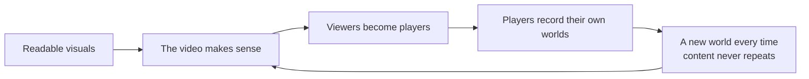

> **This chapter's thesis**: Minecraft is learned by watching before it is learned by playing. Readable blocky visuals, a world that never repeats, and a goal that was absent for years let player-made videos become the game's de facto teaching system; Education Edition and the recipe book are retroactive endorsements of an established fact, not its beginning.

## The problem

A six-year-old who has never touched Minecraft can already recite the rules: have torches before dark; never look an enderman in the eye; the moment you hear that hiss, run, and keep running. Not one of these lessons comes from the game itself — the game hasn't even been bought yet. They come from other people's games on a screen: commentary videos, Let's Plays, tutorials.

This is not one household's anecdote; it is how an entire generation entered the game. In the early 2010s the main place to learn Minecraft was not the game but the video: watch someone else survive the first night, then press the launcher yourself. A game that outsourced the whole "how to play" lesson to player-made video — and outsourced it this thoroughly — has few precedents in gaming history.

The chapter answers one question: how did a game become a generation's common language? "The video era arrived" will not do as an answer — video did not turn every game into a common language. Explaining why Minecraft specifically means going back into the design: the visuals, world generation, and goal structure each contribute one thing that props video up. Then come two acts of retroactive endorsement: Education Edition wired the classroom in, and the recipe book took the first lesson back.

## Most people learned to play in videos

First, the vocabulary. A Let's Play is a long recording of play with commentary — long, slow, companionable; a tutorial video is short and precise, dedicated to one step done right. Minecraft fills both forms completely, but the real question is not "Minecraft has videos." It is "why do Minecraft's videos work." Three design decisions each lent a hand.

**The first force: visuals built for readability.** Minecraft's world is assembled from one-meter cubes: few colors, large outlines, slow motion. Pressed into a low-resolution video stream, the picture still reads at a glance — that is a tree, that is a cave, a corner collapsed over there. Better-looking games of the same era often turned to mush under the same compression: viewers could see the special effects but not the structure. Blocks are not an aesthetic coincidence; they are a technical decision that lets the game survive being retold: discrete, finite, nameable. Nameability pays a second dividend — blocks and mobs have names, and communities even coined a pet nickname for the creeper. Names are the units that chants and comment sections run on: a scene must be callable by name before discussion can gather under it. Falsifiable, as ever: if Minecraft's visuals were high-frequency detail and fast camera cuts, the spread of video would not vanish, but the road of "learn to play by watching" would narrow sharply, because viewers could no longer tell what was happening on screen.

**The second force: every generated world is different.** Tutorials get stale; Let's Plays do not — because a Let's Play's true content is not the streamer, it is the world under the streamer's feet. Minecraft's terrain is generated on the fly by algorithms, and no two maps are alike (see [World Generation as Content Production](/design/worldgen)), so "watching someone else play" always equals "new content." The world generator absorbs the cost of content production: the streamer needs no script, because the game writes one.

**The third force: no goal means watching works too.** In a story-heavy game, finishing the video equals finishing the game, and viewers have no reason to buy; in a hard-goal game, video becomes a walkthrough, watched in order to be copied. Minecraft sits at neither pole: it has no plot to spoil and no "completion" to reach; death drops your items and the world goes on, so the show never airs its finale. Watching became a complete way of consuming — watch someone build a city, watch an expedition, watch someone get blown sky-high by a creeper — all without owing the game a single playthrough. Add the tiny verb set — walk, jump, dig, place (see [The Minimal Verb Set and Game Feel](/design/verbs-feel)) — and one viewing is enough to imitate, which is why tutorial videos can genuinely teach.

The three forces combine into one wheel:

<Note>
The chapter's falsification condition fits in one sentence: find a newcomer who has never watched a single video, never read a single guide, and still gets on fine — before 2017, that person almost did not exist.
</Note>

## The genres: Let's Plays, tutorials, animations, song parodies

Four kinds of video each do their own job; fitted together, they are the whole circuit of how the game spread.

**The Let's Play is company.** Recorded episode after episode, sometimes for years; viewers follow not for technique but for a long-running relationship. Even watching a streamer mine for three unhurried hours holds up — content no story-driven game could sustain. When YouTube's official blog took stock of fifteen years of Minecraft, the series it named — long-form Let's Plays begun in the early 2010s, Stampy's Lovely World, paced to a child's rhythm and updated until 2023, and the technical series running since 2011 — are all this form[^ytblog]. They prove one thing: this game cannot supply "finish and discard" content, because its content was never packed in by the official side in the first place — it is freshly made by every world generation and every player.

**Tutorials are infrastructure.** "How to survive the first night" was Minecraft video's first great genre: punch a tree, make a crafting table, wooden pick, stone pick, seal the cave before dark. The game itself teaches not one of these steps; all of it traveled by word of mouth. Tutorials filled the gap vanilla left, and in doing so set the community's default way to play — everyone punches the tree first, not because the game demands it, but because the first generation of tutorials decided it. Beside the tutorial sits a static knowledge layer: the Wiki. Video handles demonstration, the Wiki handles lookup, and the two layers add up to a folk textbook — without the officials writing a word of it.

**Animation treats the game as a studio.** The blocky world ships a free three-dimensional set: characters, props, lighting, and camera all live inside the game. The community used it to shoot sketches, commercials, and the seemingly immortal "Monster School." Gameplay hardly matters here — the engine became animation software, and the players became production companies.

**Song parodies wrote the game into pop culture.** The most famous arrived in August 2011: "Revenge," set to the tune of Usher's "DJ Got Us Fallin' in Love," with new lyrics about getting even with a creeper, released as a music video[^revenge]. The formula — borrow a hit song, rewrite it as game content — appeared in batches at the time, and "Revenge" cut deepest: more than a decade later, "Creeper, aw man" is still the community's secret handshake — the first half appears in a comment, the second half waits in the replies. When a parody song survives as community etiquette, the game has stopped being just a game.

Two milestones of scale, both from checkable data. At the end of 2014, Google's year-end roundup listed YouTube's on-platform search terms: "music" first, "minecraft" second — the only game word in the top ten — and by then the cumulative views of Minecraft videos had already passed 47 billion[^tf2014]. In December 2021, cumulative views crossed one trillion, making Minecraft the most-watched game in YouTube's history; by Microsoft's count at the time, more than 35,000 active creator channels were spread across 150 countries[^guardian]. By 2024 the official blog reported the figure past 1.5 trillion[^ytblog]. Note where these numbers come from: not the publisher's victory lap, but statistics from the platform and the search engine. What put Minecraft on the year-end charts was not ad buying; it was tens of thousands of ordinary players whose trade was recording their screens. This judgment is falsifiable too: if the spread had run mainly on bought media, the year-end charts would have been crowded with big publishers' games — in fact, that year's list held exactly one game word.

## Children, families, and the safe creation seen by parents

Among video viewers is a special class: children, and the parents choosing videos for them. Minecraft gets past parents not through a rating or a marketing line but through the safe creation seen by parents: pixel blocks carry no gore; combat is collisions and red numbers; death is items scattering across the ground. The pace can be paused at any moment; one person can play alone. In Creative mode a child is stacking toy blocks — built it wrong, tear it down, start over (see [Creative Mode Is Not a Level Editor](/design/creative-mode)). What parents see is closer to LEGO than to fighting. This impression of "safe" was filtered into being on the distribution side, not positioned by the official side — Mojang never built the game as a children's game; children chose it into one. And the family side holds one easily missed fact: the game is natively suited to cohabitation. Families put their saves into one world and raise their houses on the same map; child and parent inhabit the same digital space as equals — perhaps for the first time: you are more skilled, I have more money, and each of us does our own thing. That is rare in the history of the living-room console, too.

<Note>
While we are here, puncture a misunderstanding: Survival is not gentle. You can starve, you can be blown up, and a hoard gathered over weeks can vanish overnight. "Safe" is an effect seen from outside the screen, not a parameter inside the game.
</Note>

Once very young viewers became a mass audience, channels made specifically for children became a genre of their own, and Stampy's Lovely World is the most famous of them: tone, pacing, and each episode's small goal all designed around a child's attention[^ytblog]. The argument that "the game has become childish" has run for a decade, and both sides have a case. Parents say: the first language a child learns from video is the language of blocks — shareable, playable together, a better use of screen time than many. Veterans say: the community visibly grew younger; servers turned toward minigames and parkour; redstone and engineering talk was squeezed into the corner, and some felt "my Minecraft" had been diluted. Both are true: families gained a safe space to create, and the price was that the pitch of public discussion changed.

<Memoir title="Watching, never playing">
The community's longest-lived complaint comes from parents: the child spends a whole afternoon watching Minecraft videos and never once opens the game. That is not neglect; it is the medium's normal use — watching is a complete way of consuming, the child's chants, vocabulary, and taste in buildings all come from video, and the game is only the second venue. Later the term "cloud player" was coined precisely for these people: barely ever played, yet knows every mechanic by heart.
</Memoir>

## Education Edition: the classroom sandbox rewrote whose game it is

The classroom did not become Minecraft's second home because of Microsoft. In 2011 Joel Levin, a computer teacher in New York, brought Minecraft into his classroom and wrote a blog about the experience; a Finnish education startup saw it, reached out, began developing a classroom edition that June, and founded TeacherGaming that November — American teachers plus Finnish developers, six people in all[^mcw-edu]. The product was MinecraftEdu: a classroom client reworked on top of Java Edition, with teacher tools — freeze students, teleport them to a point, hand out blocks, fence in the play area. Schools bought their own licenses, teachers learned the tools themselves, and by 2016 classrooms around the world were using it to teach programming, city planning, languages, and history.

On January 19, 2016, Mojang announced it was buying MinecraftEdu from TeacherGaming[^mcw-edu]; on April 5 the original went off sale; on November 1 the same year, the official Minecraft: Education Edition launched[^mcw-education]. Note that this was not "MinecraftEdu with a new name": Education Edition was not built on Java but on the C++ codebase of the Pocket Edition line — the engine that became Bedrock. So the worlds schools had accumulated in MinecraftEdu could not be migrated into Education Edition: the old platform stored worlds in Java's save format, the new one in Bedrock's[^mcw-edu]. The school building a class raised over a term's lessons did not survive a version change. The official education product began with a platform switch that refused to honor old debts.

Why Bedrock specifically? Because the classroom wants the opposite of what enthusiasts want. Enthusiasts want modifiability: Java Edition takes mods and swapped mechanics, at the price of installing on every device and fixing for every version. Schools want manageability: dozens of devices deployed uniformly on one version, the teacher able to see what every student is doing, one-click recovery when something breaks. The Bedrock line — one codebase, natively cross-platform — picks up exactly that checklist: Education Edition shipped for Windows and macOS in 2016, reached the iPad in 2018, and ChromeOS in August 2020 — the device types most common in Western classrooms[^mcw-education]. However rich Java's mod ecosystem is, it cannot push one set of classroom rules to dozens of tablets at a button. The constraint compresses into one sentence:

<Constraint name="The classroom sandbox" verdict="groundwork" chain="schools require uniform deployment and control → Education Edition builds on Bedrock's single codebase → manageability across devices is gained, at the price of giving up Java's mod ecosystem">
This choice is falsifiable: if Education Edition had been built on Java plus Forge and still achieved uniform management of dozens of devices, then "Bedrock was inevitable for the classroom" would be wrong. The historical fact is that it did not take that road — the classroom's constraint was never "can it be modified" but "can it be managed."
</Constraint>

To write Education Edition off as pure corporate charity would be just as dishonest. It charges schools per license, and the classroom doubles as a channel: a generation of students met their first block game in a school computer lab, and it was the official one — in this setting, "whose Minecraft" admits no dispute at all. But teachers received real goods too: classroom management tools, cross-device multiplayer, ready-made lesson material; each side took what it needed. The significance of buying MinecraftEdu lies in neither charity nor business but in definitional power: before the deal, what Minecraft was had been settled by the player community; after it, school districts, ministries of education, and teacher-training systems also held a vote.

## What the base game still teaches: advancements and the recipe book as late make-up lessons

Now turn the camera back to the game itself. Before 2016 the base game said almost nothing about "how to play": recipes were secret — the arrangements of planks, crafting table, wooden pick, torch — so you asked a friend, or looked up a video and the Wiki; the goal system was thin enough to fit on a single achievements page. The game's whole answer was one word: watch. Watch videos, watch the Wiki, watch other people. The outsourcing ran superbly for years — so well that the officials felt no pressure to make up the lesson; community media carried the teaching bill for eight years.

The turn came on June 7, 2017, in 1.12: the recipe book and the advancement system shipped in the same version. The recipe book registers "how is this made" inside the game, unlocking step by step as conditions are met; advancements replaced achievements, giving players a visible path, and the same version added a hint sequence aimed at new players[^mcw-112]. It was the officials' first admission: not every new player happens to have a video-watching friend at hand. Java was not the only edition making up the lesson. The Pocket Edition line's touch crafting interface had been list-style since 2012 — open the crafting screen, and everything you can make is laid out in front of you; in 2017, Bedrock 1.2 switched to classic crafting plus the recipe book[^mcw-crafting]. On "telling players what they can make," Java was the edition catching up to the mobile line.

Why eight years late? Three reasons. First, Minecraft was born into a "watch someone else do it" culture: Notch's world generation learned from Infiniminer, players' architecture learned from one another's saves, and teaching was treated from day one as the community's own business. Second, the community carried the course well — interpretation videos appeared within days of every update, so the officials never felt the pain. Third, the audience's structure shifted around 2016: the body of new players became the generation raised on video, and the school market had just been opened by Education Edition — MinecraftEdu bought in 2016, recipe book and advancements shipped in 2017: that timeline is no coincidence.

What deserves attention is the restraint of the make-up lesson. The recipe book is not a cookbook of everything: recipes unlock by condition — what gets registered is what you have seen and made; nor does it explain why redstone connects this way or why a mob farm is designed like that. Deep mechanical knowledge, after 2017 as before, lives outside the game, in videos and the Wiki. So the precise statement is: **the base game took back the "first hour" and left the "next thousand hours" to community media.** The division of labor is not laziness. The first hour is a hard threshold — fail it and nothing follows; the knowledge after it is the community's content production, and if the officials reclaimed all of it, they would be cutting off the community's raw material. The border is drawn between "set no threshold" and "poach no content."

<Alternative title="If it had shipped as a forced tutorial level">
The contrasting route is the level-based game's: a forced tutorial island, a manual of every recipe, teaching pop-ups on every screen. For Minecraft this is the bad option. Half of its learning pleasure comes from "I don't know what else is out there," and opening every recipe would fill in the space to explore; forced teaching would break the "no goal" ground tone — players could have grown their own knowledge out of one wretched first night, the way the generation before them did. 1.12's choice — a register unlocked on demand — is the compromise that yields a step to each side.
</Alternative>

Back to the chapter's question: when the spread happens in video, what should the base game still teach? Answer: the minimal verb set and the first night. These two are the bedrock that watching cannot always supply — the feel in the hands and the cost of failure must be paid in person to be remembered (see [The Minimal Verb Set and Game Feel](/design/verbs-feel)); the rest of "teaching" belongs to the system that has been teaching for ten years. Does this division hold forever? Not necessarily. If the video ecosystem one day fails a new generation and the officials do not step in, outsourcing becomes cutoff; if instead the officials build every piece of mechanical knowledge in and video teaching withers, the structure of "learning happens in the community" is gone too. This chapter bets on neither end — it bets on one sentence: the make-up lesson is a retroactive endorsement, not a beginning. Had 1.12's recipe book and advancements appeared before the video ecosystem rose, this thesis would be wrong.

## What this chapter leaves behind

- **For players**: your first lesson probably wasn't in the game. The recipe book is the enrollment letter that arrived in 2017 — you had already graduated once, in somebody else's world.
- **For developers**: you can take three things: design visuals for readability, let generation carry the cost of content, and treat externalized knowledge as an architectural decision with tuition attached. You cannot take the window — the decade when a whole generation happened to treat the video platform as the family living room.

[^tf2014]: Tubefilter, Sam Gutelle, "Music, Minecraft Lead YouTube's Top Searched Terms Of 2014," 2015-01-07, retrieved 2026-09-18, https://www.tubefilter.com/2015/01/07/youtube-top-searches-2014-music-minecraft/ (citing Think With Google's December 2014 report: "music" first and "minecraft" second among YouTube's on-platform searches (trend index 80, with third-place "movies" at 45), the only game word in the top ten; cumulative views of Minecraft videos had already passed 47 billion. Verified against an archive.org snapshot)

[^guardian]: The Guardian, Keith Stuart, "Minecraft passes one trillion views on YouTube," 2021-12-15, retrieved 2026-09-18, https://www.theguardian.com/games/2021/dec/15/minecraft-passes-one-trillion-views-on-youtube (cumulative YouTube views passed 1 trillion, the most-watched game in the platform's history; Microsoft's count: more than 35,000 active creator channels across 150 countries)

[^ytblog]: YouTube official blog, "Celebrating 15 years of Minecraft," 2024-05-28, retrieved 2026-09-18, https://blog.youtube/culture-and-trends/minecraft-15/ (citing YouTube Data 2024: cumulative views above 1.5 trillion; naming the long-form Let's Plays of the early 2010s, Stampy's Lovely World (2012–2023), and the technical series updating since 2011)

[^revenge]: CaptainSparklez and TryHardNinja, "Revenge — A Minecraft Parody of Usher's DJ Got Us Fallin' In Love (Music Video)," YouTube, August 2011, retrieved 2026-09-18, https://www.youtube.com/watch?v=cPJUBQd-PNM (a Minecraft parody MV of Usher's "DJ Got Us Fallin' in Love"; the original upload is still up)

[^mcw-edu]: Minecraft Wiki, "MinecraftEdu," retrieved 2026-09-18, https://minecraft.wiki/w/MinecraftEdu (development began after outreach to teacher Joel Levin in June 2011; first licenses sold in October; TeacherGaming LLC founded in November; the team was three developers and three teachers from the US and Finland; Mojang announced the acquisition on 2016-01-19; sales ended 2016-04-05; old worlds cannot be migrated because Education Edition is built on Bedrock, not Java)

[^mcw-education]: Minecraft Wiki, "Minecraft Education," retrieved 2026-09-18, https://minecraft.wiki/w/Minecraft_Education (announced 2016-01-19; early access from June 9 to November 1; official release of the Windows/macOS version on 2016-11-01; built on the Bedrock codebase, written in C++; iPad version 2018-09-06; ChromeOS beta 2020-06-26, stable release 2020-08-07)

[^mcw-112]: Minecraft Wiki, "Java Edition 1.12," retrieved 2026-09-18, https://minecraft.wiki/w/Java_Edition_1.12 (released 2017-06-07: adds the recipe book and new-player tips; the advancement system replaces achievements)

[^mcw-crafting]: Minecraft Wiki, "Crafting," retrieved 2026-09-18, https://minecraft.wiki/w/Crafting (the Pocket Edition's MATTIS touch crafting interface presented a list from v0.3.0 (2012), and from 0.9.0 showed only currently craftable items; Bedrock 1.2.0 (2017) replaced MATTIS with classic crafting plus the recipe book)
