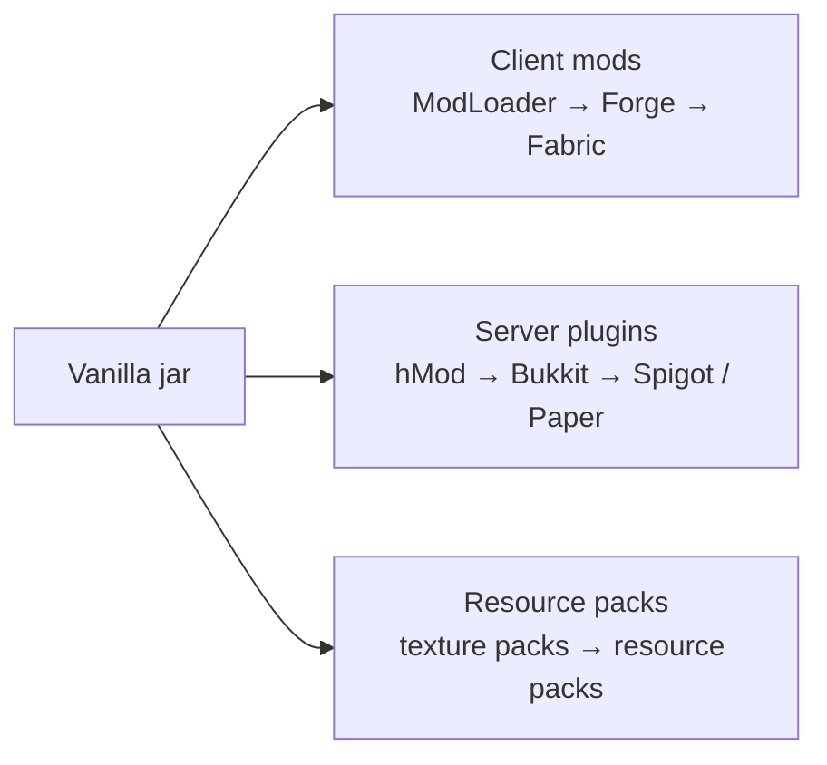

> **This chapter's thesis**: mods are not a freebie attached to Minecraft, nor merchandise around it — they are a second authorship that grew up alongside the game and materially rewrote its product boundary. Mojang accepted that the seat exists, yet almost never paid for it.

## The problem

In 2011, a deep Minecraft player usually had two "Minecrafts" on disk. One in single-player: files called mods that added power plants and processing chains, turning a mine-and-build game into a world with an industrial system. One on servers: administrators added "plugins," and friends played hide-and-seek, land claims, and minigames on a bare client. Neither set was Mojang's, and most of it was free. Same game, boundary stretched several rings outward.

Mods were not post-launch support; they grew up in lockstep with the game. The first sizable mods appeared in 2010, while the game was in Alpha; by the 2011 release, mod platforms had taken shape; every later major version had authors chasing it. **Why did mods grow in sync with the game, and rewrite its boundary?** When did "what does Minecraft have" stop being written by Mojang alone?

"Second authorship" needs establishing: whoever sits at the game's conference table decides what the game has. A traditional game seats one author — finish, seal, ship. Minecraft's table filled fast with mod writers, plugin writers, texture artists, server operators — no Mojang badges, but real additions players really used. This chapter runs three lines in time order — client mods, server plugins, resource packs — then the systems mods added that vanilla lacked, the official side's selective absorption of community inventions, and what sustains the seat: credit, governance, payment. Modding as a design method belongs to ["Mods as Design Method"](/design/mods-as-method); loader and plugin internals to ["Mod and Plugin Architecture"](/impl/mod-architecture); monetization's grey zones to ["The Grey Economy"](/history/grey-economy).

## "Vanilla Minecraft" was never a finished product

In May 2009, Notch put an unfinished game on public sale — not rhetoric: half price in Alpha, higher in Beta, higher still at release. "Under construction" was the sales method; players bought a long-term ticket into a construction process that changed shape every few weeks. By 2010, an alien idea had become normal: the game you buy is alive; it is growing. Some visitors wanted to change the blueprints.

The industry had no counterpart. The mainstream finished content, then sold it — DLC, expansions, annual sequels, one-way pipes. PC gaming's mod tradition is old but usually began after official updates stalled — mods as a game's second half. Minecraft inverted the order: mods and official updates ran in parallel, each watching the other.

The blueprints were never locked, because Minecraft is written in Java: programs ship as bytecode, and off-the-shelf tools can decompile it into text close to source. Obfuscation — class and function names replaced at build with gibberish like a, b, c — stopped eyes, not tools. The first to walk the path was Searge (Michael Stoyke, later hired by Mojang): his Minecraft Coder Pack, MCP, mapped every obfuscated name back to a readable one, and from 2010 on nearly every mod maker worked on it.[^w-modding] Mojang never authorized anyone to read its code, never sued anyone for reading it — the second authorship's first foundation block was a silence neither side named.

Sync growth took three conditions, all in place by 2010: weekly-to-biweekly updates kept the boundary moving, so "in sync" was a mod author's daily labor, not rhetoric; bytecode can be decompiled, so the entry cost was willingness to learn, not a license; and Survival multiplayer went live on August 4, 2010 — the player base exploded, and more people meant more who wanted to put things in.[^w-server]

Notch was not happy at first, fearing player creations would dilute his vision; by 2012 he called mods a big part of the reason Minecraft is Minecraft.[^w-modding] The shift tracked a product fact: in late 2010, as Alpha turned Beta, IndustrialCraft, Railcraft, and BuildCraft released in a burst, adding whole layers of system vanilla lacked.[^w-modding] What players had bought was redefined: the part Mojang makes, plus whatever the world stuffs in. "Finished product" lost its standing as referee — had vanilla been complete, mods would be mostly reskins and maps; history is the opposite. The earliest large mods were all system-fillers.

## Three rivers: ModLoader/Forge, Bukkit, and resource packs

First, separate two confusables. **Client mods** (usually just "mods") change the game itself — every player installs them. **Server plugins** change only the server — a bare vanilla client joins and finds the behavior transformed. One changes what the world looks like; the other, how people play. Bukkit in this chapter is the server-side authorship, not a line in a mods list.

**River one: client mods.** MCP solved reading, but two mods editing the same code overwrite each other. In 2010, Risugami's ModLoader took over installing a mod, prescribing where each enters — the first de facto mod loader, and conflicts dropped sharply.[^w-modding] By around November 2011 the problem had escalated from installable to coexisting: dozens of mods collide on block IDs and call each other's features. Minecraft Forge was born for this, led by authors of several large mods, its goal as plain as its GitHub description: "modifications to the Minecraft base files to assist with compatibility between mods."[^w-modding][^gh-forge] Forge bundled its own loader, FML, absorbing ModLoader's job; ModLoader stopped updating shortly before Minecraft 1.7 shipped, and the client river ran on Forge for a decade — Fabric followed in December 2018, NeoForge split from Forge in 2023.[^w-modding] Rivers fork; the riverbed is one: whoever provides stable installation rules holds the client seat. Forge's real contribution is division of labor — shared ID registration, inter-mod conventions, common tools — turning a pile of patches into an interlocking system where industry, magic, and RPG became stackable.

<Memoir title="Deleting META-INF: the 2012 mod-install ritual">
Around 2012, installing a mod meant unpacking the game's jar, deleting the META-INF folder inside — a seal to stop files being swapped — dragging the mod in, repacking, and praying for the main menu. Forge's launcher later absorbed the motions, but the essence never changed: installing a mod means modifying the program files the official side shipped.
</Memoir>

**River two: server plugins** — the older river. Multiplayer launched May 31, 2009 in the Classic phase, and server mods appeared immediately;[^w-server] hMod began September 3, 2010, giving servers a plugin interface all plugins followed — WorldEdit, still maintained today, began as an hMod plugin on September 28, 2010.[^w-modding][^w-server] When hMod stalled, five of its developers — Dinnerbone, Grum, EvilSeph, Tahg, sk89q — started Bukkit on December 21, 2010; it shipped in 2011.[^w-server] Bukkit has two layers: Bukkit proper, the GPL plugin interface, and CraftBukkit, the wrapper that makes Mojang's official server program run plugins. Authors code against the interface, never against Mojang's files — interface stable, plugins survive across versions. Tens of thousands of servers run on this stack.

Plugins add rules and venues, not blocks. A land-claim plugin makes protecting your house a server law; an economy plugin puts currency and shops between players; a minigame plugin turns a map into an arena — the social form of play: who may touch whose things, how players exchange, how a match starts and ends. Large servers became game platforms run by teams of dozens, supplied almost entirely by this river: the most code-fluent players, with no contract and no official interface, made a Minecraft server a game inside the game. The successors remain: Spigot, renamed from a CraftBukkit fork in January 2013, and Paper, a performance fork begun in June 2014 — by 2025, bStats counted over 130,000 Paper servers online at once, over sixty percent of the river.[^w-server] Note the landmine: CraftBukkit is open-source-licensed, but the Mojang server code it wraps is proprietary — open shell, closed core; the license does not legally hold. It exploded in 2014; the last section returns.

**River three: resource packs** — the lowest seat threshold. Alpha 1.2.2 in 2010 added official texture-pack support; before that, changing textures meant manually replacing terrain.png, the atlas of all block textures, or using a mod.[^mcw-tp] Version 1.6.1 (July 1, 2013) made them resource packs — sound swappable too.[^mcw-161] Seated here are artists and voice actors writing no code: hand-drawn looks, flat-color minimalism, re-recorded mob voices. The three rivers' authors differ — programmers, system designers, artists — but the act is one: adding a layer to the product beyond the part Mojang makes.

<Note>
Mods follow the client; plugins follow the server. If friends must install your file too, it is a mod; if it lives only on the server and friends join bare, it is a plugin.
</Note>

One contrast is not a river: all three flow in Java Edition only. Java bytecode can be decompiled; Bedrock is C++ compiled straight to each device's machine code — nothing readable to recover; a crowbar does not fit a welded-shut machine. Bedrock instead runs official add-ons and a reviewed store, the seat turned from volunteer to contract — that is the Bedrock chapter's story (see ["Java Edition and Bedrock Edition"](/impl/bedrock)). How loaders isolate conflicts and how plugin event systems are built, ["Mod and Plugin Architecture"](/impl/mod-architecture) takes apart.

## What industry, magic, and RPG mods filled in

Separate two words. A content gap is a few blocks or mobs short — the official side fills it eventually. A structural hole is a whole layer of systems missing — a class of things that can never be done, because the rules layer does not exist. Vanilla Minecraft in 2010 had at least three holes, each growing a family of mods.

**Hole one: no energy, so no industry.** Vanilla redstone supplies signal — on, off, push, pull — with no concept of energy: no generation, transmission, or machine chains, so a furnace burning coal to drive thirty machines is impossible. IndustrialCraft filled the energy layer, BuildCraft the logistics of pipes and automated mining, Railcraft railways as a freight industry. The late-2010 cluster was no accident: the player base was big enough to want automation, and the official side had no plan for it. Modded and vanilla are strictly two game forms — the difference is not block count but whether an automation economy exists.

**Hole two: crafting is a lookup table, with no discovery.** Vanilla crafting is a recipe grid; memorize it and graduate. ThaumCraft-style magic mods made it research — observe, gather clues, unlock knowledge, and knowledge unlocks stronger spells — a built-in curiosity loop: not assigned tasks, but structure rewarding finding things out.

**Hole three: the growth curve is too short.** Wood to diamond in five steps, and for a long time one boss. Aether-style dimension mods opened a sky world with new ores and bosses; RPG mods carried in levels, skills, and gear upgrades — vertical growth got a next layer.

One line: **Mojang supplied nouns and a few verbs; mods supplied complete grammar.** Falsifiably: were those mods "just content," vanilla without them would stand intact — in practice, players with industry mods cannot go back; what is missing is the whole automation layer. Scale agrees: by March 2025, CurseForge alone listed over 200,000 Minecraft mods.[^w-modding]

Stacked together: modpacks. Players assembled dozens or hundreds of mods by theme, tuned compatibility, added an installer — one pack holds industry, magic, and RPG, powering and feeding each other, playing like a new game. Modpack authors are a third layer: they write no mods; they curate. The boundary is no longer a line but a tree — the official side writes the trunk, mod authors the branches, modpack authors bonsai them. A note on people: many structure-fillers went professional on download-site ad revenue and crowdfunding — a minority; below the headliners, pure love; the accounting comes next section.[^w-modding]

## Selective absorption: the piston gets in, industry does not

The official side did not merely watch. Mojang picked community inventions and invited them in — the move has a name: absorption.

**The piston.** Before Beta 1.7, forum user Hippoplatimus published a piston mod: a block that pushes blocks. Jeb — the programmer who had taken over development — saw it; Hippoplatimus handed over the code; DiEvAl privately contributed the key idea of tracking pushed blocks with a hidden data structure, the block entity. Beta 1.7 shipped on June 30, 2011 with pistons, and Hippoplatimus was credited as "additional programming."[^mcw-piston][^mcw-b17] The most decently credited absorption on record: the thing entered the game, and the name with it. The impact cannot be overstated: before it, the redstone world was static — lamps and doors, never the structure itself moving. The piston gave redstone a new verb, **move**: hidden doors, elevators, retractable bridges, automatic farms all grow from "blocks can be pushed." A mechanism invented in a mod author's room became the foundation of a decade-plus of redstone engineering — absorption at its ideal: Mojang did not invent the piston; it recognized that it deserved to belong to everyone.

**Horses.** Version 1.6.1 (July 1, 2013) was literally the horse update; the horses came from the famous Mo' Creatures mod, original author Dr. Zhark assisting the adaptation.[^mcw-161][^w-modding] The same move: absorbed, author present.

**Command blocks.** Version 1.4.2 (October 25, 2012).[^mcw-142] No mod was called "command block"; what was absorbed was the practice of the plugin river and the map community — commands, an administrator's daily tool, became building blocks in map authors' hands.

**Datapacks.** Version 1.13 (July 18, 2018): no Java, no server plugins — edit configuration files to change loot tables and recipes, and run functions.[^mcw-113] Part of the plugin river's job became a lightweight official feature inside everyone's game, and changing the rules stopped requiring any third-party install. Absorption had opened the authorship seat itself to every player.

The reverse: industry mods never entered — not once in a decade-plus did the official side touch IndustrialCraft's power or BuildCraft's pipes. Why? The piston is a verb: pushing a block composes with everything, and absorbing it hands every player a new lever without moving the product's positioning. An industry mod is an economy: energy units, processing chains, logistics — absorbing one declares, for all players, that Minecraft's form is the industrial age, and claims mod authors' cultivated territory as official. Absorb verbs and formats; leave systems and industries — history drew this line steadily; where the ruler should sit, Volume II dissects. One refutable claim: were the principle "buy out whoever builds it best," industry would have entered long ago. History is the opposite.

<Constraint name="Selective absorption" verdict="groundwork" chain="verbs enter vanilla → systems stay third-party → the product boundary keeps being redrawn">
The absorbed piston, horses, command block, and datapack are composable actions or formats; industry, magic, and RPG — complete systems — never entered. The line keeps the vanilla game general-purpose and the mod ecosystem with something left to build. Run it backwards, and the second authorship dissolves on the spot.
</Constraint>

## Credit and governance: should Mojang have managed mods?

What sustains the second authorship? Not contracts — tacit consent plus community self-discipline, legally vague throughout. Mojang's policy sums to four "nots": it does not sue mod authors, does not pay them, long declined an official mod interface, and takes no responsibility for ecosystem quality. In 2012 it announced an official mod repository and hired the Bukkit team to prepare an official API — neither happened.[^w-modding][^w-server] What it did was smaller: permit, and pick people.

The picking reveals the taste: **poach people, not works.** Searge joined Mojang; Bukkit's Dinnerbone, Grum, and Tahg were announced hired on February 28, 2012 — for precisely that never-delivered interface;[^w-server] Dr. Zhark collaborated on the vanilla adaptation; Kingbdogz of the Aether mod was hired in January 2020 and now leads official dimension content.[^w-modding] People may come; systems stay — the piston author's credit was already the highest honor a work received. Complete systems left to the community spare the official side their maintenance costs and do not crowd out the ecosystem that created them; for the poached, it is loss and acknowledgment at once.

Then the account opened at the start: mod labor has long been unpaid — an industry fact needing no varnish. Mainstream distribution is free; earners live on download-site ad revenue and crowdfunding; full-timers are a tiny top tier; Forge and Bukkit maintainers mostly take nothing.[^w-modding] Two hundred thousand mods means much of Minecraft's product boundary is drawn by uncontracted amateur labor. Both sides: most authors were making a game for themselves — unpaid is not victimized; the seat was volunteer from day one. And the official side enjoyed that boundary for a decade without pricing it — no need to dress it as generosity. "Not banning" is not support; it is the cheapest governance. Selling this labor is the storyline of ["The Grey Economy"](/history/grey-economy).

The fragility surfaced in 2014 — the timeline only here; the storm belongs to the servers chapter. August 24: Bukkit co-founder EvilSeph announced the project's end, citing unclear legal status; Mojang staff answered that the project's rights had transferred to Mojang when the team was hired — the world learned the 2012 hiring was an undisclosed acquisition.[^w-server] Two weeks later, September 5: a contributor pseudonymed Wolvereness filed a DMCA takedown — CraftBukkit wraps proprietary code, his contribution infringes — and Bukkit with all forks, Spigot included, came off the code host.[^w-server] Legal paperwork hit the second authorship head-on, and a decade of tolerance protected no one.

One more unpaid labor deserves its name: **version chasing**. Every release breaks a batch of mods; over the following weeks, authors remap, patch, and update until the biggest mods work again — every major version, a decade-plus unbroken. Every step forward puts the whole second authorship through a rework — an obligation, self-imposed, unpaid. No stable API was ever promised, so no one is to blame; but the boundary's expansion is carried on exactly this endless redo.

The official side once filed a different answer. April 2017: the Marketplace for Bedrock — contracted authors, content review, revenue split; by 2021, contracted creators had earned on the order of 350 million US dollars.[^w-modding] The first true payment for authors, at the price of a contracted seat that can modify only officially exposed interfaces. Same years, equal work on Java Edition took nothing: one community, two identities, the line drawn by business model, not talent. Java traded consent for openness; Bedrock traded contracts for control — the Bedrock chapters compare directly.

On the Java side, the closing footnote lands in October 2025: Mojang announced removing obfuscation from the Java Edition source, to make mod development "faster and easier."[^w-modding] From the community compiling its own dictionary in 2010 to the official side removing the dictionary itself — fifteen years of decompilation acknowledged face-on by the code's own authors. The second authorship is no longer tolerated. It is an institution.

## What this chapter leaves behind

- **For players**: your mods folder is not decoration. Half the answer to "what does this game have" lives in Mojang's repository, half in the community's — and most of the authors on that side have never been paid.
- **For developers**: what you can copy is the three rivers' layered contracts — client, server, and resources each get a stable interface, none crossing another; authors each hold their seat; the official side absorbs verbs and never annexes industries. What you cannot copy is the ten-year window that made second authors willing to sit for free, and the habit of writing the piston's author into the credits.

[^w-modding]: Wikipedia, "Minecraft modding," retrieved 2026-09-17, https://en.wikipedia.org/wiki/Minecraft_modding (origins of MCP and ModLoader; IndustrialCraft/BuildCraft/Railcraft's late-2010 debuts; Forge's release around November 2011; CurseForge's Minecraft section opened in mid-2011; Notch's quoted shift in attitude toward mods; Fabric's December 2018 release; NeoForge's split in July 2023; CurseForge surpassing 200,000 mods in March 2025; the Dr. Zhark and Kingbdogz hiring and collaboration; roughly 350 million US dollars in Marketplace creator payouts as reported in 2021; obfuscation removal announced October 2025)

[^w-server]: Wikipedia, "Minecraft server," retrieved 2026-09-17, https://en.wikipedia.org/wiki/Minecraft_server (multiplayer's May 31, 2009 launch; Survival multiplayer on August 4, 2010; hMod started September 3, 2010; Bukkit begun December 21, 2010 and released in 2011; the team's hiring by Mojang announced February 28, 2012; the Spigot and Paper lineage; the August–September 2014 project termination and DMCA takedown; bStats Paper server statistics, June 2025)

[^mcw-piston]: Minecraft Wiki, "Piston," retrieved 2026-09-17, https://minecraft.wiki/w/Piston (Hippoplatimus's piston mod, the code handover and "additional programming" credit, DiEvAl's block-entity idea)

[^mcw-b17]: Minecraft Wiki, "Java Edition Beta 1.7," retrieved 2026-09-17, https://minecraft.wiki/w/Java_Edition_Beta_1.7 (released June 30, 2011, adding pistons and sticky pistons)

[^mcw-142]: Minecraft Wiki, "Java Edition 1.4.2," retrieved 2026-09-17, https://minecraft.wiki/w/Java_Edition_1.4.2 (released October 25, 2012, adding the command block)

[^mcw-161]: Minecraft Wiki, "Java Edition 1.6.1," retrieved 2026-09-17, https://minecraft.wiki/w/Java_Edition_1.6.1 (the July 1, 2013 "horse update")

[^mcw-113]: Minecraft Wiki, "Java Edition 1.13," retrieved 2026-09-17, https://minecraft.wiki/w/Java_Edition_1.13 (released July 18, 2018, adding datapacks)

[^mcw-tp]: Minecraft Wiki, "Texture pack," retrieved 2026-09-17, https://minecraft.wiki/w/Texture_pack (official texture pack support added in Alpha 1.2.2; before that, manually replacing terrain.png or using mods)

[^gh-forge]: MinecraftForge team, "MinecraftForge" repository description, GitHub, repository created January 30, 2012, retrieved 2026-09-17, https://github.com/MinecraftForge/MinecraftForge ("modifications to the Minecraft base files to assist with compatibility between mods")
