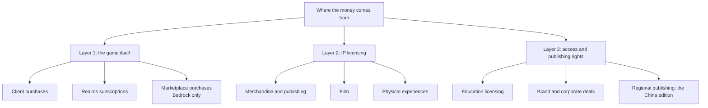

> **This chapter's thesis**: Minecraft stopped living on "selling once" long ago, yet the buy-once image still holds, sustained by a division of labor — the base game is responsible only for being cheap and open, and all the growth money lives outside it. If the base-game layer (client, subscriptions, in-app purchases) became the growth engine again, or if locking down Java Edition would actually raise total revenue, this chapter's judgment is wrong.

## The problem

In 2011, a player paid a bit over a hundred yuan for Minecraft and never paid for the game itself again. Across fourteen years he received hundreds of full releases free of charge: new blocks, new mobs, the Nether Update, the terrain rework of Caves & Cliffs. Every update cost nothing, and every one made that single payment worth more.

This defies common sense. A software company's standard moves are raising the price, adding in-app purchases, or going subscription. Mojang — later Microsoft — seems to have done none of them, yet the game carried a 2.5-billion-dollar acquisition price, carried a film to roughly 960 million dollars at the box office, and sustains a creator payout pool in the hundreds of millions of dollars.

Where does the money come from? That is the first half of this chapter. The second half is asked less often: where can the money **not** come from? Microsoft holds a property with users in the hundreds of millions and has never taken a cent off Java Edition's mods — even though players offer to pay, every day.

Answering these two questions means not reading the player's ledger but the company's. On the player's ledger there is one entry: the purchase. On the company's, the purchase is only layer one. This chapter pries the three layers apart from the inside out, draws the structure, and at the end explains the counterexample waiting there — a revenue source that looks like it sits on gold, and never existed.

## "Sell it once" stopped being the whole story long ago

Start with the pre-acquisition base. Sweden's public company registry shows that in 2013, the year before the acquisition, Mojang's annual revenue was already on the order of hundreds of millions of US dollars, with profit on the order of a hundred million — these are orders of magnitude; the exact figures rest on media retellings of that year's filings and are not quoted precisely here. The money had almost exactly one source: selling copies. Mojang in 2013 was a "sell it once" company: each player paid once, and the company used it to pay wages and make updates. The books were easy to read, and fragile — when sales stopped growing, revenue stopped.

After the acquisition, the books changed. Today the brand's income falls roughly into three layers, each answering a different reason to pay:

The layers divide not by product but by "who pays, for what." Layer one: players pay to play — buying the client, subscribing to official servers, buying content in the store. Layer two: others pay to use the IP — toymakers, publishers, and studios take Minecraft's imagery off into other things, and Mojang collects license fees and royalties. Layer three: institutions pay for access — schools buy a classroom tool, brands buy a marketing venue, a regional market's local company buys the operating rights.

The point of layering is risk isolation. A film flopping does not touch the update schedule; the store drawing fire does not touch Java Edition; however strict the China edition's review, it cannot reach server owners in the rest of the world. Each layer stands or falls alone, and the base game does one thing: stay cheap, stay open, keep updating. That is the mechanism by which a "buy-once" image and diversified monetization coexist — nobody is exercising restraint; the structure does it.

One ugly word up front: these layers are reverse-engineered from the product form, not read off a balance sheet. Microsoft never breaks out Minecraft's revenue — how much comes from the client, Realms, or the store is unknown outside; the only hard datum is the lone pre-acquisition figure left in the Swedish registry. So what this chapter can offer is not proportions but structure: which positions collect money, and why the money can be collected there.

<Alternative title="If you didn't layer it: make the base game a subscription">A monthly fee on the base game is the alternative everyone thinks of first, and the industry has a ready-made template: the online-game subscription. It would very likely collect more in the short term, but it raises the entrance by one story — children who cannot pay monthly, people who want to try before buying, all stopped at the door. Minecraft's real asset is "anyone can walk in"; subscription trades the entrance for revenue, a losing trade for Microsoft. This is arithmetic, not ethics.</Alternative>

The next three sections take the layers apart one by one, from the inside out.

## Layer one: the client, Realms, and the Marketplace

Layer one is the money players know best, in three forms: the client, Realms, and the Marketplace. Across the Java and Bedrock product lines they look nothing alike.

**The client.** Java Edition is the textbook buy-once: pay once, permanent entitlement, free updates, with pricing in the US tier long stuck at twenty-something dollars, barely moved in over a decade. Bedrock Edition is more complicated: on phones it was never buy-once — the app downloads free, a one-time in-app purchase unlocks the full mode, and various other purchases hang outside it; on consoles and the Windows store it appears as a one-time purchase. Strictly speaking, then, "buy-once" was always just this game's charging form on some of its platforms. What players take for "Minecraft is a buy-once game" is really Java Edition's contract.

**Realms.** Realms is the official monthly-rented server: pay a subscription and Mojang hosts a small multiplayer world for you — friends can drop in anytime, and you never have to run the machine, configure networking, or manage a whitelist. Both product lines have it, under different contracts: Java Edition has one tier, $7.99 a month for up to 10 players; Bedrock Edition splits in two — Core at $3.99 a month for 2 players, Plus at $7.99 a month for 10, with a bundle of store content packs and a larger storage allowance attached[^realms].

Realms does not sell content; it sells the absence of chore. Its capabilities are deliberately kept below third-party servers: no plugins, no mods, world settings hemmed in on every side. The weakness is designed — official hosting eats only the market of "a parent and child who want multiplayer without a project," and leaves "I want full control" to the third parties. Why would players pay this tier? Because the alternative is learning to run a server, and that learning cost is exactly Realms' pricing room.

**The Marketplace.** The Marketplace is Bedrock's exclusive official content store, launched in April 2017 with the mobile update[^marketplace]. Players exchange real money for a virtual currency, Minecoins, and spend Minecoins on maps, skins, textures, and gameplay made by community authors. Not everyone can list: content must come from members of the official partner program, and each piece passes review by the Minecraft content team. By mid-2026 the store held content in the tens of thousands, from more than three hundred creators (wiki figures)[^marketplace].

<Impl title="The Minecoin loop">The store's key mechanism is the currency loop: players first buy Minecoins with real money — one tier is $19.99 for 3,500 coins — then buy content with Minecoins. The money lands in Microsoft's account first and settles with creators afterward, by contract. The upside: pricing power, settlement power, and the user relationship all sit in the platform's hands. The cost: years of community complaints about balances that will not spend down and refunds that will not happen. Build the currency first when building a content platform — that step you can copy, provided you accept the settlement and compliance load that comes with it.</Impl>

The store's record has one official number: by April 2021, creators had been paid out more than 350 million dollars in total, against more than a billion content downloads — Microsoft's own figure, given on earnings calls, and still growing since[^payout]. For community authors, this is the thing the Java ecosystem long could not provide: a legal channel for getting paid.

<Note>The 350 million dollars is what was paid to creators, not Microsoft's revenue. Backed out through standard platform-cut conventions, the store's total flow must run higher; Microsoft has never published the exact split, so that sentence stands as an order-of-magnitude inference only.</Note>

Say the good and the bad evenly. The good: the Marketplace proved "players will pay players," and raised a cohort of full-time content teams. The bad: it is a closed ecosystem — reviewed entry, a proprietary format, bound to Microsoft accounts and a proprietary currency. What may list, in what format, at what price: the platform decides. How the data-driven architecture of the add-on (Bedrock's official content format) serves review and cross-device play is covered in ["Bedrock as a Second Implementation"](/impl/bedrock).

## Layer two: merchandise, film, publishing, theme parks

Layer two's money has one common name: licensing. Mojang does not make toys, shoot films, or write books; it licenses Minecraft's imagery out and collects fees and royalties. Others put up the capital and carry the risk; Mojang puts up the image and collects the rent.

This layer is older than many assume. In late 2011 a Minecraft proposal appeared on LEGO's crowdsourcing platform Cuusoo (later renamed LEGO Ideas); the votes hit the threshold fast, and the first LEGO Minecraft sets went on sale in 2012 — while the game was still the product of a small independent company. The LEGO line has been a long seller ever since, set generation after set generation. Publishing works the same: the officially licensed handbooks and annuals are long sellers in bookshops; a child can know the creeper from a shelf, no console required.

A Minecraft Movie in 2025 set this layer's yardstick: roughly 960 million dollars at the global box office against a production budget around 150 million, produced by Warner Bros.[^movie] Box office is not Mojang's revenue — studio and rights-holders split it by contract, proportions undisclosed — but the magnitude makes the point: this IP's ability to monetize no longer needs the game itself present. Much of the ticket-buying audience had known the creeper for years; the film was not an advertisement recruiting new players, but a harvest of existing recognition. Worth noting: Warner announced this project back in 2014, and it cycled through rounds of directors and scripts for eleven years before release — the licensing layer's other face: the rhythm is not the IP holder's to set, and the cost of a difficult birth is borne by the other side. Physical experiences run the same way: the LEGOland Minecraft themed areas, official merchandise stores in various countries — all of them turn "recognizing Minecraft" into a scene that can be charged for.

Why push monetization out to this layer instead of collecting inside the game? Because willingness to pay grows on different people. Parents pay for toys, holiday-season audiences pay for films, players pay for the game — three wallets, three venues; stuff them into one client and each crowd crushes the others. The sharper point is the position of risk: under licensing, the cost of failure falls on the licensee. A film flops, the studio eats the loss, Mojang collects a little less rent, and the game updates as usual.

<Note>Licensing also carries less quality-control risk than most IP: the block's visual language is simple enough that almost any toy still looks like Minecraft — low distortion across media.</Note>

## Layer three: education, corporate, and regional publishing rights

Layer three least resembles "selling a game": the buyer is not a player but an institution.

**Education.** Minecraft Education is the classroom edition built on Bedrock, formally launched in November 2016, descended from community-made MinecraftEdu — the wild growth of teachers using vanilla in class on their own initiative, later absorbed into a product[^education]. It is not priced like a game but like software: around 5 dollars per user per year for academic institutions, with volume pricing for whole-school purchases; the bigger move was bundling it in free as part of the Microsoft 365 Education A3 and A5 plans[^education]. The payer is the school budget, not a child's pocket money.

This layer's business logic deserves an honest write: Education is at once the entrance project for "games on the timetable" and Microsoft's hook for selling the whole subscription stack to schools — the free bundling presupposes the school is already inside a 365 contract. The two motives do not conflict; both can be true at once. It is also criticized as far from "that Minecraft": classrooms want controllable, manageable, gradeable — exactly the opposite of free modification. And that is precisely the condition of its existence: what institutions pay for is never freedom; it is certainty.

**Corporate and brands.** Using Minecraft as a medium: brands build experiences inside it, run marketing campaigns, and pay partnership fees. The sums per deal are modest and public cases are few, but the logic matches education — an institution borrows Minecraft to reach the young, and Mojang collects a venue fee. Mechanically it is the licensing layer with the toy factory swapped for a marketing budget. This layer's public cases are few not because it does not exist but because nearly every partnership contract carries a confidentiality clause: you can see the finished product; you cannot see the price.

**Regional publishing.** The heaviest piece of layer three: the China edition.

In May 2016, Microsoft, Mojang, and NetEase jointly announced that operation of Minecraft in mainland China would go to NetEase; that October, the agency contract for the Java Edition was added. In August 2017 the Windows client (Java Edition) launched, September iOS, October Android. The contract differs completely from the global one: free download, monetized by in-app purchases — one diamond exchanges for one fen of a yuan, membership 20 yuan a month — with all chat, sign, and book text passing content review, and rental servers that cannot even be given names, only numeric IDs. Registered users climbed on the official tally: 300 million in November 2019, past 400 million in November 2020[^china].

One brand, two contracts. Why can the China edition be a different shape? Because "publishing" has a different cost structure there. Mainland China's game market runs on its own set of institutions: license-number approval, content review, real-name and payment integration, channel distribution. Microsoft has no local capability in any of these links; forcing it means building a compliance and operations team from zero. NetEase has the licenses, the channels, the payment relationships. The optimal move was to grant the operation wholesale. **Regional publishing** names exactly this contract: a region's operating rights are priced and handed over, in exchange for a local company completing every act of local compliance on your behalf. NetEase pays nothing per copy; it collects from the Chinese market itself through free-plus-IAP, and Microsoft shares by contract.

<Constraint name="Regional publishing" verdict="groundwork" chain="local compliance and channel costs are high → operating rights granted wholesale to a local company → one brand, two contracts → each market gets its own optimum, at the price of a forked experience" />

Say the good and the bad evenly. The good: hundreds of millions of Chinese players walked in at zero threshold — any purchase price would have shut most of this market out. The bad: review reshaped the content ecosystem — anonymized servers, filtered chat, everything through approval — opening an experiential gap between the China edition and the rest of the world.

<Memoir title="Two worlds, two vocabularies">After the China edition launched, the community's most common comparison post was "one game, two worlds": international-server players' everyday words are modpack, whitelist, server address; China-server players' are diamond price, approval pace, rental-server ID number. What makes "a server has its own name" false on the China edition is not technology but review rules — rental servers may only use numeric IDs[^china].</Memoir>

Layer three's common denominator: the buyers are all buying "access" — to the classroom, to the young, to a market. That sets it apart from the first two layers: layer one sells experience, layer two sells an image, layer three sells a position.

## Where it cannot come from: why "a cut of mods" never stood

Finally, the question in reverse. First, the list — money that has never been taken:

- Java Edition's mods are overwhelmingly free; their authors live on donations and sponsorships, and the official side takes no cut.
- Third-party servers' memberships, maps, and top-up income: no official cut — only compliance red lines.
- The traffic and donations flowing through mod sites like CurseForge and Modrinth: no official cut.
- Java Edition itself: one payment, then no further charge points — not even optional in-app purchases.

Every few years, rumors circulate that "Microsoft is about to open an official mod store," and every time they meet a boycott. The curious part: a model treated as unremarkable everywhere else in the industry — the platform skimming thirty percent — has never once been formally attempted on Java Edition. Why?

Rule out the sentiment explanation first. "Microsoft respects the PC's open tradition" is not a mechanism; it cannot carry a business decision. The mechanism has three parts, each locking into the next.

The first: **the distribution chokepoints are not in Microsoft's hands**. Java Edition's mods are jar files, downloaded from CurseForge or Modrinth or the author's own web page, installed through free loaders — Forge, Fabric, and the rest. Taking a cut presupposes controlling the distribution chokepoint; but Java Edition's official launcher is only one entrance among many, and players can bypass it entirely. To take a cut you must first lock distribution — forced signing, forced store, sealing out sideloading (installing files directly, around the store). Technically reachable; the price is killing "free modification" itself.

The second: **the server is the players' asset**. The main body of Java multiplayer is the third-party server; the server software is published free, and the right to run one belongs to anyone. The world's paid-server ecosystems — memberships, map tickets, skins — all grow on machines Microsoft cannot touch. Along that line the official side cannot even collect a passage fee, let alone a cut. Compare Bedrock: Realms and the officially endorsed partner servers are the only legitimate multiplayer channels; with the passage in hand, the store's review-and-split machinery works. The two product lines' commercial difference is rooted in a technical-architecture difference — whether distribution is controllable precedes all commercial design (see ["The Server Is the New Game"](/history/servers) and ["Bedrock as a Second Implementation"](/impl/bedrock)).

The third: **the free alternative costs nothing**. Beside every potential pay point on Java Edition stands a free substitute: beyond official Realms, a landscape of third-party hosts; beyond the hypothetical official mod store, CurseForge and Modrinth. Taking a cut hands users a reason to move house — and this house has no lock. Bedrock users "do not move" not out of loyalty: mobile has no sideloading culture, the store is the only entrance, and assets are bound to Microsoft accounts. How locked-in the users are decides whether a cut is feasible; Java Edition's cannot-be-locked decides the cut cannot be.

Put the three together: a cut mechanism requires "the platform controls distribution"; Java Edition's design premise is "distribution cannot be controlled" — the two contradict. So "a cut of mods" never stood — not for want of wanting it, but because the books do not balance: the cost of locking distribution (community flight, the entrance devaluing) far exceeds the cut's yield. The Marketplace's success is the same judgment's counter-footnote: Microsoft did not take over Java's free ecosystem; it built a second ecosystem controllable from day one. For a Java author who wants to be paid, the realistic path is porting the work into an add-on and listing it on the store — at which point the author's identity shifts from "community member" to "contracted partner"; what that step costs is in ["Mods as the Second Author"](/history/mods-as-authors).

The official side's nearest approach to "a cut" was the 2014 tightening of the user agreement restricting how servers may charge — that storm's mechanics and aftershocks are in ["The Grey Economy"](/history/grey-economy).

<Constraint name="Java distribution cannot be locked" verdict="groundwork" chain="mods are free files, loaders are free, the launcher is bypassable → the official side has no purchase point on distribution → a cut mechanism cannot stand → the ecosystem's freeness is a structural outcome, not sentiment" />

Someone will ask: if Microsoft takes not one cut, what is it after? Beyond keeping the entrance valuable, there is an account that never enters the royalty ledger — talent. The Java mod and server communities are this industry's talent reservoir; Mojang itself absorbed a whole cohort of server plugin authors into its development team. That yield grows in the hiring market, and a cut mechanism would sever it.

This section's falsification condition, stated plainly: if Java Edition ever requires mods to be force-signed before loading, or an official proprietary format begins displacing jar distribution, the "distribution cannot be controlled" groundwork has been dismantled, a cut becomes possible again, and this section is void. As of writing: it has not happened.

## What this chapter leaves behind

- **For players**: to judge whether Microsoft will ever touch Java Edition, ignore the slogans and read the revenue structure — the growth money lives entirely outside the base game, and Java Edition's openness is the position that feeds the whole structure. Touching it does not pay.
- **For developers**: what you can copy is revenue layering — base game, services, IP, and access priced separately, none of them guaranteeing another, with the base game kept cheap to hold the entrance. What you cannot copy is the Marketplace's precondition: building controllable distribution from zero — a minted currency, review, account binding. If what you take over is an ecosystem that is already free, a cut mechanism cannot stand by nature — an architecture problem, not an operations problem.

[^realms]: Minecraft Wiki, "Realms," retrieved 2026-09-18, https://minecraft.wiki/w/Realms (subscription prices and tiers as queried September 2026: Java Edition $7.99/month; Bedrock Core $3.99/month, Plus $7.99/month)

[^marketplace]: Minecraft Wiki, "Marketplace," retrieved 2026-09-18, https://minecraft.wiki/w/Marketplace (launched April 2017 with the mobile update; the partner program, per-item review, and creator count)

[^payout]: PC Gamer, "Minecraft modders have sold a billion mods for more than $350m since Microsoft bought it," 2021, https://www.pcgamer.com/minecraft-modders-have-sold-a-billion-mods-for-more-than-dollar350m-since-microsoft-bought-it/

[^movie]: Wikipedia, "A Minecraft Movie," retrieved 2026-09-18, https://en.wikipedia.org/wiki/A_Minecraft_Movie (box office citing Box Office Mojo and The Numbers)

[^education]: Minecraft Wiki, "Minecraft Education," retrieved 2026-09-18, https://minecraft.wiki/w/Minecraft_Education

[^china]: Minecraft Wiki, "Minecraft: China Edition," retrieved 2026-09-18, https://minecraft.wiki/w/Minecraft:_China_Edition
