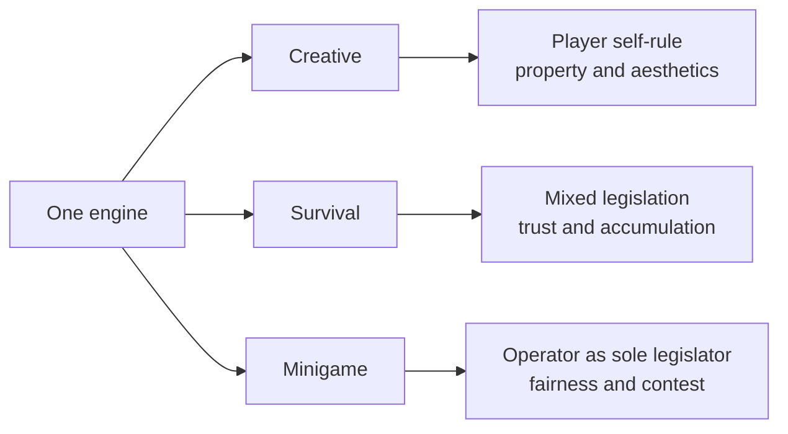

> **This chapter's thesis**: a large share of the "game" is not in the client — it lives on servers, created and maintained by operators drawn from the players; and that layer of infrastructure has long lacked official protection, which makes it more fragile than the game itself.

## The problem

Start with a scene. You spend an evening on a server playing BedWars: four teams guard their beds; while the bed stands, death is a respawn; once it falls, the next death is elimination. Iron and gold are money; the last team standing wins.

Now quit, open your installation folder, and search the files for "bed," "war," "BedWars." Nothing. The map, the prices, the respawn rule — none of it is on your disk. The program you paid Mojang for does not contain it: not untranslated, absent. It exists only on the server you joined.

This is not an exception. BedWars, SkyWars, SkyBlock — nearly every mode you can name was invented by servers[^skyblock]. Much of the "game" you paid Mojang for was built by someone else: charging you nothing, outside its jurisdiction.

So: **why is so much of the "game" not in the client? Who made it, what keeps it alive, and why did it nearly all collapse together in 2014?** That last half is not rhetoric. That year the game never missed an update, while a single legal notice nearly tore up the foundation under most of the world's multiplayer servers.

Boundaries: not a hosting manual, no recommendations — the questions are why the ecosystem grew this shape, what social experiments it ran, and what it teaches about redeveloping a game. And singleplayer and server players live in parallel worlds, receiving Mojang's game or an operator's; they cannot agree on what makes Minecraft fun. That fact is this chapter's subject.

## You buy the client, you play the server

Minecraft is really two programs: the client on your computer, drawing the world and taking input; the server on some machine, holding the world data, the mobs, the drops, and the execution of every rule. In multiplayer, everything on your screen is a broadcast from the server — when you lag, you still see yourself walk while others stand frozen and blocks take forever to break.

The key point: Mojang never required the server to be the official one. The message format between client and server — the protocol — has no official documentation, but it can be decoded message by message, and the community long ago wrote complete unofficial documentation. Anyone can build a server against it, and the official client will connect; details in [Servers and Scale](/impl/servers).

In September 2010 a project called hMod rebuilt the official server into one that could take "plugins" — small programs installed on the server that rewrite its rules: claim land, ban lava-dumping, add teleports. Players install nothing. The multiplayer boom was starting and the official server shipped almost no admin tools; on December 21 a fuller successor began work — Bukkit, soon the ruler of the Java server world[^wiki-server].

Mojang could have crushed third-party servers, as many companies would. Instead it let them grow, and on February 28, 2012 hired four core Bukkit developers — the blog announced "Minecraft Team Strengthened!" — to build an official server extension API[^mojang-2012]. Few ecosystems have been welcomed in the front door by their rights-holder.

<Constraint name="The server is replaceable" verdict="groundwork" chain="the client is only a terminal → rules and content live on the server → the server can be swapped out whole → which game you play is decided by the server" />

Hence the first judgment: **what you bought is a terminal for entering this world, and much of what you play is decided by the server you connect to.** How could it be wrong? If the official client offered the modes servers offer (for years it did not, at nothing like the scale); or if Mojang had attacked third-party servers as infringement (it hired their authors instead). Neither holds.

The structure also rewrote the one-time purchase: you buy a terminal; world content is produced elsewhere, renewed yearly, free. Other games sell expansions; Minecraft outsourced the production line to its own players.

## Three societies: creative, survival, minigame

The ecosystem grew three main forms on the same engine. The difference is not visual but legal — the rules, and under them, the relations between people.

**Creative servers** are themed "build together." Since in vanilla survival a newcomer can demolish a year's work in half an hour, the server must legislate: the land-claim plugin lets you stand on a plot, run one command, and nobody else can dig or blast it — a property deed in code. With property come districts, guild warehouses, and the daily politics of who repairs which road; mature servers grow into real cities, with road crews, free materials depots, holiday building contests, even rehearsed scripts for visitors. The relation is neighborliness; the conflict, property versus aesthetics.

**Survival servers** keep the official rules and layer a player society on top: economy plugins add currency — shops by command, diamonds sold at posted prices, money saved and lent — while claims protect property and admins adjudicate. What the server sells is "a world that will not vanish, and people who are always there." Its conflict is trust: in the official rules everything can be stolen or blown up, and only law fences that in. Run an economy long enough and textbook phenomena appear unaided — over-mined goods deflate, players adopt a rarer resource as hard currency: inflation and the gold standard, reenacted by teenagers; confederacies, non-aggression pacts, and spies appear between cities. None of it is designed gameplay. That the server is the load-bearing structure of multiplayer is argued in [Multiplayer Is the Default](/design/multiplayer); here we see it on the ground.

**Minigame servers** swap the mode out entirely: lobby, queue, matchmaking, scoring, in-round shops; a match of ten-odd minutes, then queue again. The relation is the stranger-opponent; the conflict is fairness, so the rules are densest — anti-cheat, balance, season resets. The short match is deliberate: losing costs little, winning pays instantly. Minecraft turns from "steward a world" into "play a round" — both pleasures real, but not the same game.

Why can't the client contain these societies? Their raw material is not code but "many real people" and "a referee." A client can simulate rules — SkyBlock circulated as a singleplayer map as early as 2011, starting from one lava bucket and one block of ice — but not opponents or administrators. They exist only on servers.

One other timeline: Bedrock Edition (phones and consoles) has its own rental service, Realms, and its own third-party server system, but the culture here — plugins, server owners, minigames — is almost entirely Java Edition's. That fork belongs to [Bedrock Edition](/impl/bedrock) and [Java and Bedrock](/history/java-bedrock).

## Two extreme samples: Hypixel and 2b2t

Beyond the three stand two names always paired — the two ends of the "operator" role: one takes legislation to its limit, the other abandons it.

**Hypixel is total operator supply.** Launched in April 2013 by Simon Collins-Laflamme and Philippe Touchette, already known for their adventure maps[^wiki-hypixel], it made minigames a product matrix — levels, currencies, quests, battle passes, all supplied by a professional team; you need not know Minecraft, since everything is a button. During the 2020 pandemic its daily peak reached roughly 150,000; in April 2021 it passed 216,000 concurrent players, and it holds the Guinness World Record as the most popular Minecraft server[^wiki-hypixel]. Its own later take on SkyBlock succeeded likewise, and in 2020 the studio grown from the community was acquired by Riot: a server became a game company.

The politics: a television network. The operator schedules the programming; players vote with their feet. Concentrated legislation buys stability and a zero barrier, at the price of near-zero power to shape the world — you cannot leave a single block behind. Its business runs strictly inside the EULA — the End User License Agreement, the contract you click "I agree" to at install — selling cosmetics and levels, never advantages that affect balance. After the 2014 monetization storm (below) it was the new rules' typical beneficiary: clearer rules favor the biggest players.

<Memoir title="The generation that never learned to craft">

A whole generation of Hypixel players has a "Minecraft" that is BedWars: they speed-run iron and break the enemy bed without thinking, yet cannot quite explain how a furnace smelts ore or what to do about creepers after dark. For them, vanilla survival is the unfamiliar "new mode." When one server's user base exceeds the population of many countries, its definition of "what Minecraft is" outweighs the official client's.

</Memoir>

**2b2t is operator absence.** Founded in December 2010 as 2builders2tools, it is generally acknowledged as "the oldest anarchy server in Minecraft" — an anarchy server having no admins to adjudicate: no rescue, no repayment, no bans. Its operator never appears; the community knows one ID, Hausemaster, and intervention stays near zero — patching exploits that would corrupt the world itself[^wiki-2b2t]. Safety means walking a hundred thousand blocks into the wilderness: human malice, however fast, moves one block at a time. Out of this grew factions and wars, chronicles and myths, griefers — players who destroy others' work for pleasure — and expeditioners who trek to ruined builds as to historical evidence. In 2016 a visit video flooded the server; veterans blockaded spawn in vain, and a queue system was installed — even anarchy needs a doorman, among its few interventions[^wiki-2b2t].

The politics: order does not vanish when legislation stops; it regresses to its primal form — whoever organizes more people, harder attacks, and stricter secrecy is the law. By this chapter's discipline, 2b2t appears only as a **limit experiment without rules**: rules are not a property Minecraft carries but a choice made by operators, and renouncing all rules is itself a political decision. Its lurid legends are out of scope — irrelevant to the thesis. Together the lesson completes: same day, same client, two entirely different "Minecrafts." Mojang decides what the game is called; the server's politics decides what the game is. Neither is fringe — one certified largest in the world, one oldest and still alive.

## Players become operators: admins, economies, rules

[Mods as Second Authors](/history/mods-as-authors) covered those who extend the game itself; this section is about server owners, also called admins — renting machines, running the software, picking plugins, fending off attacks, backing up, rising at midnight to restart, and above all adjudicating quarrels between people. Before 2014 this labor had almost no legal income; most ran a few-hundred-player server on spare time and their own wallets.

A plugin's mechanics come down to one pattern — the server announces events, plugins rewrite them before they land ("block breaks" becomes "denied: claimed land") — and the consequence is large: rules stop being code welded into the game and become case law.

<Impl title="Event listening: the smallest cut for rewriting rules">

This broadcast-register-rewrite pattern is event listening, one of Bukkit's most consequential inventions. Before each block break, each point of damage, each inventory click, the server packs "what happened, to whom" into an event object and hands it to plugins; a plugin returns "cancel" or altered parameters, and the server executes the amended result. Land claims, economies, minigames all grew from this one cut: power cut small, and exactly big enough.

</Impl>

What typical plugins do has one name: legislation. Claim plugins are property law — vanilla's default is the state of nature, and a claim strips "everyone else's right to destroy." Economy plugins are currency and market law: what money is, how prices form; some servers add taxes and bankruptcy relief. Minigame plugins legislate at the top, defining "what the game here is." Bans are criminal law; the admin is the judge.

Hence a rarely spoken conclusion: **inside one server, the admin's power over daily life is greater than Mojang's.** Mojang's code does not reach your land prices, interest rates, or criminal law; its one lever is how money between you and your players changes hands. A country runs center = defense and currency, localities = utilities and policing; Minecraft inverts this — the EULA is the constitution overhead, daily-bread lawmaking is private, and local governments outnumber Mojang's employees by orders of magnitude. That detonated the first crisis of 2014.

In June 2014, Mojang published "Let's talk server monetisation!" — the first systematic red lines. Entrance fees allowed, but only one kind of ticket, no split into paying and free tiers; ads permitted; charges declared unrelated to Mojang; the stated goal: stop "pay-to-win" — money buying advantages that affect balance[^mojang-2014-eula]. Details were clarified and loosened over the following months.

Three parties each had a case. **Owners**: hardware costs real money, returns on years of labor are fair, and VIP perks had been standard for years — overnight the industry learned it was "in violation." **Mojang**: "no profiting from our product" had sat unenforced in the EULA for years, and pay-to-win destroys new players, the ecosystem's bloodstream. **Players** split: some were done with big spenders, others considered paying for a server natural. No party acted in bad faith. The real problem: both sides had long treated silence as a contract — and that contract never existed.

The storm completes the structure: official commands and datapacks are official legislation (see [Who Makes the Rules](/design/who-makes-rules)); plugins are private law; the EULA is the constitution — and above it, copyright law and the discretion of one Swedish company.

<Note>Owners and Mojang were not the only ones treating silence as a contract — the next section shows the Bukkit ecosystem collapsing on exactly the same misunderstanding about Mojang.</Note>

## The Bukkit crisis: fragile infrastructure

Conclusion first: in the autumn of 2014 the game never missed an update, while the foundation under most Java servers was nearly torn up by a single legal notice. The game was fine; the infrastructure nearly died. That is the thesis's second half.

Bukkit's structure was a landmine from day one: interface definitions (Bukkit, under the GPL — anyone building on this code must open-source the result) plus the implementation (CraftBukkit, under the laxer LGPL). CraftBukkit worked by operating on Mojang's official server, so it necessarily mixed in proprietary code — legally unresolvable from the start, tolerated because nobody pressed.

The timeline tightened. February 2012: the four hires; the promised official API never arrived[^wiki-server]. June 2014: the EULA storm. On August 24, 2014, Warren Loo (community ID EvilSeph) announced the end of Bukkit development; Mojang replied that the project's rights had transferred with the original hiring arrangement and it would take over maintenance.

The earthquake came on September 5. A longtime contributor, Wolvereness, filed a DMCA takedown notice with GitHub — the takedown provision of the US Digital Millennium Copyright Act: a valid notice forces removal first, appeal after. His case was clean: his GPL contributions required complete source on distribution, while CraftBukkit and its derivatives — including the popular Spigot — shipped builds containing Mojang's proprietary code, which, as the notice quotes Mojang's chief operating officer, was not authorized under any open-source license. GitHub complied. Overnight, Bukkit, CraftBukkit, Spigot, and thousands of forks went down[^bukkit-dmca].

The consequences surfaced at once. Minecraft 1.8 — a major version — had shipped three days earlier; nobody could legally provide its server, so thousands froze on 1.7.10. The plugin ecosystem halted wholesale: 1.8 changed the network protocol, every plugin needed rewriting, and the toolchain for that had just been taken down. To be fair, the community did not scatter — forums filled with mutual advice, a strange calm inside the panic.

The way out was the community's own. On November 28, 2014, Spigot revived: no more finished builds — patches and a build tool, each server generating its own artifact, cutting "distributing an infringing product" from the legal chain — plus a contributor license agreement, making "another Wolvereness" structurally impossible[^wiki-server]. That repaired trust, not code. Paper, forked from Spigot in the summer of 2014 for performance, became most servers' default: by mid-2025, more than 130,000 were running at once[^wiki-server].

In retrospect, three pillars were soft: **the code combination was never licensed**; **the maintainers were volunteers without contracts**; **the rights-holder's goodwill was the only guarantee**. Why not wait for Mojang? Answered in 2012 — the hires meant to build the official API, still absent a decade later; official datapacks govern gameplay but cannot run queues, matchmaking, or cross-world scheduling. How could "infrastructure more fragile than the game" be wrong? If the ecosystem had died after the affair, the game would have been the more fragile; if Mojang had produced an equivalent at once, the infrastructure never needed the soft pillars. Neither happened: updates rolled on, the API stayed missing, and two years of turbulence passed before the ecosystem grew its own foundation.

Afterward came Realms — official rented servers, closed and paid monthly. But the real foundation of Java servers remains Spigot and Paper, and the official stance since: don't touch it, don't endorse it, don't demolish it. The previous chapter, [Mods as Second Authors](/history/mods-as-authors), met the mod version of this problem — labor extending the game, legal status never settled. This is the social version: labor extending a society, with bigger stakes — people live there.

## What this chapter leaves behind

- **For players**: most of the "Minecraft" you play is a different game living on some server — remember its name, and the people who keep it alive.
- **For developers**: you can take the architecture — a replaceable server and rules-as-data, so that "what the game is" can be re-legislated by third parties. You cannot take the ecosystem — the trust and volunteer labor that kept the plugin world alive; the Bukkit crisis proved that without the load-bearing wall of contracts and licenses, it really does fall down.

[^wiki-server]: Wikipedia, "Minecraft server," Wikipedia, retrieved 2026-09; hMod begun 2010-09-03, Bukkit begun 2010-12-21, Spigot's restoration on 2014-11-28, Paper's origins and bStats passing 130,000 online servers in June 2025: see https://en.wikipedia.org/wiki/Minecraft_server .

[^mojang-2012]: Jens Bergensten, "Minecraft Team Strengthened!", Mojang official blog, 2012-02-28; announces four core Bukkit developers joining Mojang: see the archived copy at https://web.archive.org/web/20120301162934/http://www.mojang.com/2012/02/minecraft-team-strengthened/ .

[^mojang-2014-eula]: Mojang, "Let's talk server monetisation!", Mojang official blog, June 2014; the original rules text — entrance fees "only one kind of ticket," ads permitted, preventing pay-to-win: see the archived copy at https://web.archive.org/web/20140617065433/https://mojang.com/2014/06/lets-talk-server-monetisation/ .

[^bukkit-dmca]: Wolvereness, "DMCA takedown notice: CraftBukkit," GitHub's official DMCA archive repository (github/dmca), 2014-09-05; the full notice text and the reply from Mojang's chief operating officer quoted within it: see https://github.com/github/dmca/blob/master/2014/2014-09-05-CraftBukkit.md .

[^wiki-hypixel]: Wikipedia, "Hypixel," Wikipedia, retrieved 2026-09; launch in April 2013, founders Simon Collins-Laflamme and Philippe Touchette, pandemic-era daily peak of roughly 150,000 in 2020, peak of roughly 216,000 in April 2021, and the Guinness certification as the most popular Minecraft server: see https://en.wikipedia.org/wiki/Hypixel .

[^wiki-2b2t]: Wikipedia, "2builders2tools," Wikipedia, retrieved 2026-09; founded December 2010, the oldest anarchy server, operator Hausemaster, the 2016 player influx and the introduction of the queue system: see https://en.wikipedia.org/wiki/2builders2tools .

[^skyblock]: SkyBlock appeared as a map on the Minecraft Forums in 2011 and spread widely, later adapted by servers into a multiplayer mode; this is a community-consensus account of magnitude — the original forum thread is lost, so no specific citation is given.
