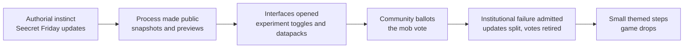

> **This chapter's thesis**: what version updates actually contest was never "what content to add" — it is who gets to define what Minecraft is.

## The problem

In 2012, a player saying "I'm playing Minecraft" meant a game whose Overworld hills rose a few dozen blocks at most, whose Nether was a red, one-landscape hell, and whose villagers traded a handful of useless items. In 2024, another player saying the same sentence faced a world stretching from deepslate depths more than sixty blocks below zero up to a sky at 320, lush caves hung with glow berries, basalt deltas housing a piglin civilization. Same name; utterly different contents.

By ordinary logic, the fuller game should feel more "like Minecraft." Spend a day in any player community, though, and you will hear both voices at once: veterans say "this isn't the game it used to be," newcomers say "this is Minecraft." Neither side is lying, and neither is merely homesick. They are arguing a more fundamental question: **when the game itself keeps changing, who has the right to say what Minecraft is?**

In the Notch era the question had a clean answer: the author decides. Notch wanted redstone, so redstone was Minecraft; he wanted an endgame dimension, so the End entered the game. After Microsoft acquired Mojang in 2014, authorial instinct left the stage and a vacuum opened around the right to define. Official staff, veterans, newcomers, streamers, the PvP community, mod authors all poured in to fill it — and Mojang spent roughly a decade building a whole set of institutions to cope: snapshots, experimental toggles, datapacks, themed versions, the mob vote, game drops.

This chapter is not a changelog. It asks one question: **how does the official side contest the right to define with its own community?** We dissect the decade's major collisions — the 1.9 combat update, the split of Caves & Cliffs, the successive mob votes — as governance specimens, and look at where this machinery succeeded and where it failed in public.

## Why a deeper game still hears "not the game it used to be"

First, admit a counterintuitive fact: over this decade Minecraft's systems only deepened. Redstone grew from a small craft into a Turing-complete logic system; terrain generation evolved from random scattering into an engine with climate and erosion simulation; the End and the deep dark filled in endgame content. By the naive logic of "more content = better game," the complaints should have faded. They did the opposite.

The reason: the standard for "is this still Minecraft" was never total content. It is **the version you arrived on**. Every player anchors to one: those who joined before mid-2011 anchor to a Beta without a hunger bar; those who joined in 2014 anchor to 1.8 and its click-spam combat; kids who joined in 2022 anchor to 1.19 and its deep dark. Every update moves somebody's origin point a little further away. When a change is big enough — combat rules rewritten, terrain rebuilt from scratch — the moved will shout that sentence.

Put another way, the complaint is not necessarily a nostalgia filter. It often points at specific, nameable changes: the old save whose terrain generator was swapped out, the clicking technique drilled for a decade, the iron farm the whole base depends on. The systems did get deeper, and some people's games were zeroed out by a patch — both true at once.

So "it's not the game it used to be" is, at bottom, an **appeal over the right to define**: the Minecraft I endorsed — on what authority did you change it without me? In the Notch era such appeals had no institutional outlet; players could only post angrily. After Notch, Mojang had to answer a new question: how does an authorless "author" face ten million players who each believe they have a say?

Here is a falsifiable judgment: if the discomfort were pure nostalgia, newcomers should never voice the same complaint. In fact each version's newcomers, a few years on, defend "their" version in their own way. The attachment is heritable across generations — which is exactly what shows it is not a filter but the structure of the contest itself.

## The co-creation interface: snapshots, experimental toggles, datapacks

Mojang's first answer was to turn the development process itself into an interface. The answer has three layers.

Layer one is the **snapshot**. It is a Java Edition mechanism: before each full release, Mojang ships the half-finished build weekly, and anyone may install, play, and report problems. The numbering is year + week + letter — 11w47a means the first development build of week 47 of 2011, the first snapshot ever put on the weekly scheme[^snapshot]. Before that, Notch was not one to hoard: through 2010's Infdev and Alpha stages he shipped ten "Seecret Friday Updates" — minecarts, redstone, boats, dungeons, and the fishing rod all appeared on some Friday with almost no warning[^seecret]. The snapshot system formalized the habit of tossing things in: content still reached players early, but it moved from "already in effect" to "open to inspection."

Why invent snapshots alongside the full version? Because Minecraft's player base hides the world's largest testing team — and the pickiest kind: they really will walk new terrain for hours, and really will build extreme structures out of new mechanics. Rather than have everyone meet the problems in the release a year later, spread the process out and let the most opinionated finish opining before release. The snapshot turned pre-update anxiety into pre-update participation. Bedrock Edition's counterpart is the **preview**: same logic — phone and console players can also play the in-development build early.

Layer two is the **experiment toggle**. Some changes are too unstable even for a snapshot, so Mojang gave them a dedicated channel. In Java Edition you check a box when creating a new world — and the implementation is blunt: each experiment is an official, built-in datapack shipped with the game; checking the box simply enables it[^datapack]. In Bedrock Edition you flip "Experiments" in the world settings, with the price printed on the label: a world with experiments on cannot earn achievements, and once on, it cannot be turned off.

Layer three is the **datapack**. The game's 2018 water update (Java Edition 1.13) introduced it: a datapack is a set of folders and functions that can change loot tables, recipes, advancements, dimensions, even terrain. It exists in Java Edition only; Bedrock's counterpart is the behavior pack[^datapack]. The datapack's real depth lies in another fact: **the vanilla game itself is a built-in datapack**. Loot tables, recipes, advancements — "vanilla content" is technically the same kind of thing as a player's datapack, sitting in the same place. The official side made "changing the game" part of the game's own construction: writing a datapack is not hanging something off the game; it is continuing to write along the official content's own extension line.

Together the three layers rearranged the positions of official and community. The Notch era was one-way broadcast: I build, you play. The interface era is a pipeline: new content passes public inspection on snapshots, the immature parts sit locked behind experiment toggles, and "vanilla" and "player-made content" have become technically indistinguishable. This is co-option of what the mod community had been doing for a decade — on how mod authors invented gameplay ahead of the official side, see ["Mods as the Second Author"](/history/mods-as-authors).

<Memoir title="The official side, racing the mods">

A fixed community pastime is comparing a snapshot's new mechanics against popular mods: "Doesn't this cave generation look like that mod?" "The official version of this mob is far worse than the mod's." Most comparisons cannot be proven, because the same gameplay imagination occurs in thousands of heads at once. But the direction is clear: players no longer only ask "what did the official side add" — they hold the entire mod ecosystem up as the reference frame and review the official work in its light. The official response has been to keep pushing the co-creation interface forward: rather than be outcompeted, move the comparison into your own house.

</Memoir>

## Themed versions: the Nether Update and Caves & Cliffs

The interface answers "how to change." The next question is "what to change, and how to announce it." Notch-era updates had no themes, only lists: this Friday redstone, next Friday boats. From 1.16 on, Mojang packaged updates as named, themed, manifesto-carrying events.

The Nether Update, released June 23, 2020 (Java and Bedrock alike at 1.16), was the turning point[^nether]. On its face it added much: four new biomes, piglins, netherite, the respawn anchor. Read the list to the end and you see what the update actually did: **it rewrote a dimension's worldview**. Before it, the Nether was a functional penalty space — you went in for quartz and zombie-pigman experience, then got out as fast as you could. After it, the dimension had the soul sand valley's desolation, the warped forest's wrong-colored vegetation, the basalt deltas' menace; it had piglins who would barter with you; it had the survival rule "do not approach without wearing gold." The Nether turned from a level into a place you could live in. That is a declaration of the right to define: the official side saying the Nether "was always supposed to" be this world, and the old red corridor was simply unfinished.

The update that truly sold "the generation system as the headline act" was Caves & Cliffs. It shipped in two parts: part one (Java Edition 1.17) on June 8, 2021, delivering new blocks and new mobs; part two (Java Edition 1.18) on November 30, 2021, delivering the real main event — an overall rework of Overworld generation[^caves]. The world's height limits stretched far up and down; caves went from narrow corridors to underground spaces at three scales — cheese, spaghetti, and noodle caves; biomes were distributed across height in three dimensions for the first time; ore veins replaced uniform scattering. Note what headlined: not new items, not new mobs, but "how the world grows" itself — the first time the official side put its underlying generation algorithm on stage as the star of the show, and players genuinely boiled over for it. How the generation system became a way of producing content is the subject of ["World Generation as Content Production"](/design/worldgen).

Caves & Cliffs also carries a governance detail that often gets missed: **it was never meant to split**. On April 14, 2021, Mojang announced the split, with the official reasons being content volume and complexity beyond expectations, and team health[^caves]. At that year's Minecraft Live the deep dark was then carved out of both parts and postponed further, to 1.19. This was the first time the official side so publicly admitted "we cannot finish this, and we are exhausted." At any other game company such an announcement might be read as an incident; in the Minecraft community of the time it drew mostly understanding. The snapshot system had long since taught players one thing: when you can see the process, you accept adjustments within the process more easily.

The themed version is the right to define in its new form. Notch's Friday updates said "the game has a bit more in it now"; themed versions say, on two-year cycles, "Minecraft is now a game about the Nether," "Minecraft is now a game about terrain." Every theme switch is a fresh official restatement of what the game's core is.

## Where "vanilla purity" comes from

Now the strangest spectacle on the players' side: **vanilla purity**. Great numbers of players insist on playing "vanilla" only — no mods, no cheats, no item duplication, no gameplay-altering changes of any kind — and wear it as self-identification; the habit has names everywhere, "pure survival" and "vanilla survival" tags on server lists and video titles. The strange part: GTA, CS, Roblox — games just as long-lived, with modification ecosystems just as large — never bred a purity culture of equal intensity. Why Minecraft alone?

The first reason is inside the game. Minecraft's core loop is highly self-sufficient: no quest list, no payment points, no external goals; all depth comes from constraints — tools wear out, death drops your items, resources are dug by hand. How constraints produce depth is the subject of ["Constraints Are Depth"](/design/constraints). What purity players guard is precisely these constraints: let yourself fetch things in Creative mode and scarcity disappears, and with it the floor under accomplishment. Purity is not aesthetic fastidiousness; it is the conscious maintenance of an in-game law — difficulty is what makes achievement mean something.

The second reason is communal. Mods number in the thousands, each server has its own rules; only vanilla is the one copy everyone shares. Playing vanilla means any technique you master, any mechanism you discover, holds for all players — communicable, comparable. A redstone machine that works in vanilla makes sense to everyone on the forum; dropped into some modpack, it becomes a small circle's dialect. **Vanilla is Minecraft's common language**, and the purity obsession is, in large part, the obsession with keeping that language common.

The third reason is the most ironic: "vanilla" itself moves. 1.9 rewrote combat; 1.13 redid water and commands; 1.18 flattened the terrain. The "vanilla" a player who joined in 2024 defends today contains every update purists once cursed — the attack cooldown, the water physics, the new chunk format. The object being defended is continuously rewritten by the very process of objecting. Vanilla purity guards not a fixed thing but a moving current snapshot.

The judgment is falsifiable here too: if purity were mere "refusal of change," purity players would collectively stay on old versions at every update. The observable fact is that the great majority upgrade as usual, then go on living cheat-free in the new world. What they refuse was never the update; it is the **shortcut around in-game constraints**.

<Constraint name="The vanilla contract" verdict="groundwork" chain="the constraints are self-sufficient → every player shares one rulebook → departing from them cuts off your own achievement → purity becomes the community's default contract">

Purity culture could arise spontaneously because vanilla provides a public contract nobody has to maintain: everyone knows you did not cheat, so everything you produce converts directly into honor. The contract needs no server admin, no mod loader, no third-party guarantor of any kind — it is the zero-cost act of "installing nothing" itself.

</Constraint>

## Votes and failed experiments: governance replaces authorial instinct

The contest over the right to define burns hottest where a change to a core mechanic cannot be undone. Here Mojang paid its most expensive tuition.

On February 29, 2016, Java Edition 1.9, the "Combat Update," shipped[^combat]. It introduced the **attack cooldown**: after each swing, damage recharges over a short time and scales with the charge — full damage only on a full bar, while click-spam swings land at roughly two-tenths damage — alongside shields, the offhand, and sweeping attacks. The official design judgment: clicking as fast as possible is mindless; rhythmic combat has more depth. The PvP community's rebuttal was equally sound: clicking speed (clicks per second) was precisely the craft they had drilled for six years; ruling that craft "mindless" voided the whole community's accumulated decade of skill. The split began there, and it was structural: a whole "1.8 PvP" ecosystem lives on today — mainstream PvP servers still run the old 1.8 combat rules — while Bedrock Edition never adopted the new combat at all, leaving the two official editions each holding a different combat philosophy. Between 2019 and 2020 Mojang shipped a string of "combat test" snapshots, released only on Reddit, trying to forge a combat both sides could accept; none of it ever entered the game. One update's aftershocks ran a decade — the largest recorded collision between "the official right to define" and "the community's vested craft."

<Memoir title="The people who stayed on 1.8">

In any PvP server network's version poll you can watch the same debate replay: one camp says the old combat is skill, the other says the new combat is depth, and between them scrolls an endless "nostalgia ghouls get out." The server owners' choice is usually the most honest one — make combat a toggle in the server's own settings and let the two communities each play their way. The players' solution beat the official one by ten years: if the right to define cannot produce a winner, partition.

</Memoir>

Core mechanics cannot be put to a vote — but what about new content? Mojang chose balloting. The **mob vote** began at MINECON Earth 2017: players elect one candidate mob, and the rest are shelved. The largest came at Minecraft Live on October 3, 2020: the choice was the glow squid (a squid that glows), the iceologer (an illager sorcerer who attacks by hurling ice), or the moobloom (a cow with flowers growing on it) — one of three. Round one eliminated the moobloom at 28.3%; the runoff went to the glow squid, 52.7% to 47.3%, on roughly 740,000 valid votes[^live2020]. This vote exposed every tension the institution carries: during voting, the biggest streamers of the day campaigned openly for the glow squid, mobilizing audiences in the tens of millions, and when the result landed, "traffic hijacked the vote" accusations flooded the feeds. The critics held that game content should be decided by gameplay value, not by streamer headcount; the defense was just as hard: a vote is mobilization by definition — whoever can mobilize, wins; that is "community vote" taken literally. Nearly every later vote replayed the same split, and even "when do the losing mobs arrive" became a long-running community grievance[^mobvote].

The governance experiment's endgame has a certain flavor. In September 2024 Mojang announced it would stop holding mob votes: the losing mobs were "not forgotten," but the vote itself kept manufacturing community division[^mobvote] — a participation mechanism shut down because participating cost too much; game history offers few parallels. The same year, the official side replaced "one big version a year" with the **game drop** — Mojang's term for a small themed update, "dropped" into the year: no more hoarded annual mega-release, but roughly one themed update a quarter, three to four a year. The system was confirmed on April 23, 2024 with Armored Paws, a content pack adding armor variants for wolves; a smaller release from December 5, 2023, Bats and Pots, was retroactively named the first drop[^gamedrop]. The logic of the new rhythm is of a piece with retiring the vote: the annual mega-version compressed the whole community's expectations into one annual burst, and both the expectation gap and the overturn risk ran too large; small quick steps shrink each act of official defining, and let feedback from snapshots turn into corrections sooner.

From Notch's instinct, to process transparency on snapshots, to risk isolation in the experiment toggle, to formal authorization by ballot, to admitting failure and falling back to small steps — that chain is the answer Mojang spent ten years composing: **if the right to define cannot be held by any one party, invent institutions under which each side holds it in turn.** The institutions are imperfect, of course: votes get captured by headcount, snapshots leak spoilers, experiments raise features that never leave the laboratory. But they turned a war that would have torn the community apart into a sequence of rounds with rules. The more general question of who writes the rules is asked again, from the gameplay-rules angle, in ["Who Makes the Rules"](/design/who-makes-rules).

## What this chapter leaves behind

- **For players**: the next time you want to shout "this isn't the Minecraft I knew," first work out which version you are anchored to — and whether you can let others anchor to theirs.
- **For developers**: what you can copy is making the development process itself a co-creation interface — snapshots open the process, experiment toggles isolate risk, and the data format makes "the game itself" and "the extension" the same kind of thing. What you cannot copy is the precondition under all of it: a player base large enough to organize itself; otherwise participation is only noise.

[^seecret]: Minecraft Wiki, "Seecret Friday Updates," retrieved 2026-09-18, https://minecraft.wiki/w/Seecret_Friday_Updates

[^snapshot]: Minecraft Wiki, "Snapshot," retrieved 2026-09-18, https://minecraft.wiki/w/Snapshot (the first weekly-numbered snapshot, 11w47a, and the naming scheme)

[^combat]: Minecraft Wiki, "Java Edition 1.9," retrieved 2026-09-18, https://minecraft.wiki/w/Java_Edition_1.9 (the Combat Update, released February 29, 2016; attack cooldown, shields, offhand)

[^nether]: Minecraft Wiki, "Nether Update," retrieved 2026-09-18, https://minecraft.wiki/w/Nether_Update (Java and Bedrock Editions at 1.16, released June 23, 2020)

[^caves]: Minecraft Wiki, "Caves & Cliffs," retrieved 2026-09-18, https://minecraft.wiki/w/Caves_%26_Cliffs (part one, Java Edition 1.17, released June 8, 2021; part two, Java Edition 1.18, released November 30, 2021; the split announced April 14, 2021, with content complexity and team health among the stated reasons)

[^datapack]: Minecraft Wiki, "Data pack," retrieved 2026-09-18, https://minecraft.wiki/w/Data_pack (introduced via snapshot 17w43a for Java Edition 1.13; Java only, with the behavior pack as Bedrock's counterpart; the vanilla game defined as a built-in datapack; experimental features enabled through built-in datapacks)

[^live2020]: Minecraft Wiki, "Minecraft Live 2020," retrieved 2026-09-18, https://minecraft.wiki/w/Minecraft_Live_2020 (held October 3, 2020; mob vote first round moobloom at 28.3%, runoff glow squid 52.7% to iceologer 47.3%, 741,145 runoff votes)

[^mobvote]: Minecraft Wiki, "Mob Vote," retrieved 2026-09-18, https://minecraft.wiki/w/Mob_Vote (first held at MINECON Earth 2017; winners and losers of each round; discontinuation announced September 9, 2024)

[^gamedrop]: Minecraft Wiki, "Game drop," retrieved 2026-09-18, https://minecraft.wiki/w/Game_drop (system confirmed April 23, 2024 with Armored Paws; Bats and Pots of December 5, 2023 retroactively named the first drop; three to four per year)
