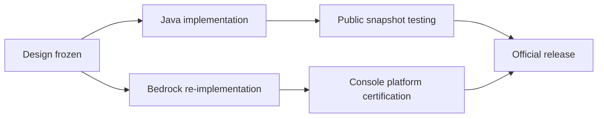

> **This chapter's thesis**: Bedrock is not a port of Java Edition but a parallel rewrite; the deadliest price of a parallel rewrite is not a performance gap but semantic divergence — the same blueprint, the same tutorial, the same world no longer refer to the same thing on the two sides. If the editions' differences stopped at speed while the rules agreed everywhere, this thesis would fail.

## The problem

A redstone blueprint that circulated in the Java community for years drew a piston door of the automatic kind: the signal was brought in "through the air" from one block diagonally above, saving a stretch of redstone dust. A Java player builds it as drawn, and the door opens. A Bedrock player builds it as drawn, and the door does not move — not half a beat late; it will never move. He checks the layout block by block and every block is right; what is wrong is the premise hiding behind the word "blueprint" — that the two sides are playing the same game.

Accidents of this kind do not stop at contraptions. Players of the two editions still cannot enter the same world directly; copy the world folder from one side to the other and the game will not open; the combat combos popular in Java server circles are not merely useless in Bedrock — they are a bad habit. If Bedrock were merely "the same Minecraft, only slower" — not the mobile version, not optimized Java, just the same rules at another frame rate — not one of these things should ever have happened. Slowness can be adapted to; difference voids knowledge outright.

The question this chapter answers is exactly there: **why is semantic divergence deadlier than a performance gap?** Before unfolding it, one piece of history needs settling — the name "Bedrock" did not become official until 2022[^bedrock]. In the great renaming of autumn 2017, the newly merged all-platform version was called just "Minecraft," with no suffix at all; it was the most senior line, Java Edition, that from that day carried the suffix "Java Edition." Which one looks more like "the original" — the officials had already voted once with naming. This chapter, however, cares only about implementation: how was that suffix-free version actually built?

## Another implementation, not a port

First, separate two words. A **port** carries the same code into a new environment: the code itself is the carrier of the rules, the rules travel with the code and deform nowhere — the only thing that changes is how fast it runs. A **parallel rewrite** restates the same set of rules in another language: every rule must be stated again, and the chance of error appears in every single one — you may even discover, in the act of restating, that some "rules" of the original implementation were accidents all along, flaws of the original implementation that grew into laws of the world.

Bedrock took the second road. Its predecessor was Pocket Edition, which shipped on Android in August 2011: the phones of that era could not hold a Java virtual machine, and Apple's phones never allowed one, so the game had to be written from zero in C++[^bedrock]. That code later grew into a common kernel covering phones, Windows, Xbox, PlayStation, and Switch, and the Wiki entry is unambiguous about it: it is not a port of the Java code but another codebase, aimed at the same game goals — survival, the Nether, the End. Same goals, different statements.

"Another statement" is not a rhetorical flourish. One and the same game rule — say, "a redstone torch powers the blocks adjacent to it" — is two different programs in the two codebases, each reading its own inputs, each maintaining its own state, each deciding on its own when to respond to change. The two sides behave alike the overwhelming majority of the time, because the rule's intent is the same; the divergence hides in the rule's dark corners: edge behaviors written into no document, subtle conventions of update order, trade-offs of numerical precision. A port never touches those dark corners, because the code runs as-is; a rewrite is dark corners end to end, because every stretch must be answered anew. How the two editions' history split and rejoined, and how the business side played its hand, [Two Product Lines: Java and Bedrock](/history/java-bedrock) has already told; this chapter carries on with what that fork left in the technical depths.

This section also leaves the thesis a checkable exit: if Bedrock really were a port, the editions' differences should show up only in speed and visuals. The divergence table below will show differences growing inside the rules themselves.

## The tech stack and the extension model

Bedrock's base is one C++ codebase covering every platform: the same game logic compiled separately per platform, with graphics, input, and storage each going through that platform's system APIs, and a single update pushed to phones, PCs, and every console nearly at once. The metronome of the release rhythm is console certification — every version must pass the platform holder's review. That is a constraint (the end of this chapter returns to it), and it also buys something real: players on all platforms are almost always on the same version.

<Alternative title="The old road: one implementation per platform">

Before Bedrock, Minecraft on consoles was a separate implementation per platform, developed by outside studios, with the console editions mutually incompatible even among themselves. That was the "one implementation per platform" route: every additional platform meant one more variant of the rules. Bedrock replaced it with "one implementation, all platforms" — cross-platform play is the direct dividend of that unification. The finer history of the split and the merger belongs to the two-editions chapter; here we weigh only the gains and losses at the implementation layer.

</Alternative>

One layer up, rendering, Bedrock changed outfits wholesale between 2019 and 2021. The new engine is called RenderDragon — in plain words, a rendering engine is the layer of the game that "draws the block world onto the screen," independent of the code that runs the game's rules. It was first shown in public by its developers in June 2019, first shipped with the closed beta of the augmented-reality mobile game Minecraft Earth, and then rolled out across Bedrock's platforms in batches: the Windows release carried a ray-tracing option from 1.16.200, and consoles and mobile completed the swap around 1.18.30[^renderdragon]. The meaning of the swap is not the visuals but the architecture: rendering became a track of its own, separate from the rules code and free to evolve alone — hardware ray tracing on Windows, a low-spec render path for low-end devices, and the later Vibrant Visuals (the official graphics upgrade) landed on Bedrock first — while the code that runs the world's rules did not have to move at all.

What truly shaped the ecosystem is the extension model. It has three tiers, each step up in capability:

**Resource packs** govern appearance: textures, models, sounds, interface — they change "how the world looks" and never touch "how the world runs." **Behavior packs** govern rules: JSON files — structured text of paired keys and values — define mob behavior, drops, spawn conditions, recipes, biomes. The author writes no code in the traditional sense; the author fills in parameters of officially preset components, and runtime value expressions are handed to a small language called Molang. **The Script API** governs logic: JavaScript placed inside the pack, reading and writing the world, listening to events, running custom loops through official modules. Which modules and which versions you intend to use must be declared as dependencies in the pack's manifest.json, and the game loads by the declaration[^addon]. This scripting capability had its embryo years ago — the oldest module in the family was originally built for automated testing — and today's second version of the Script API can register custom components and custom commands[^scriptapi].

Set Java's way of extending beside it, and the trade between the two routes stands out at once. Java mods inject compiled code into the game process; the only limit on how far they reach is the loader, so capability is close to unbounded. The price: re-adaptation for every platform and every loader version, and players must run third-party code that no official review has seen. Bedrock locks extensions inside "data definitions plus a script sandbox": what the API does not expose cannot be done; in exchange, the same add-on runs from phone to console without changing a line, and the risk of arbitrary code execution does not exist. This is not pure technical taste — it is the direct product of platform constraints: console platforms simply do not permit a game to load arbitrary outside programs.

<Constraint name="Legislating the extension boundary" verdict="groundwork" chain="console certification forbids arbitrary native code → extensions are confined to data definitions and the script sandbox → what can be done equals the exposed surface of the official API">The sandbox is not merely a ceiling drawn lower than Java's: it moves the decision of "what can be done" out of the community's hands and back into the hands of the interface designers. A Java mod author who lacks something goes and builds it; a Bedrock author who lacks something can only wait for the officials to expose it.</Constraint>

## The semantic divergence table

Every row of the table below is a behavior difference a player can observe — not benchmarks, not mysticism. Together they answer one question: when two implementations state the same set of rules each in its own words, where does the divergence land?

| Behavior | Java Edition | Bedrock Edition | What it means for players |
| --- | --- | --- | --- |
| Piston "quasi-connectivity" | Pistons, dispensers, and droppers can be activated by a signal in the block space directly above them, even when the signal never touches the component itself — the officials have kept the behavior as a feature | No such behavior; the signal must act on the component itself | An entire genus of Java contraptions — detectors powered through the air, wiring tricks that save redstone dust — does not get slower on Bedrock; it never triggers at all |
| Attack judgment | Since 2016, damage scales with the attack's charge; click-spamming deals only a fifth of the damage; swords sweep | No charge mechanic; click-spamming is never discounted | Movement rhythm, weapon tier lists, and muscle memory do not transfer; the "wait for the charge" rhythm trained on Java is pure wasted output on Bedrock |
| World files | The Anvil chunk format; many chunks packed into region files | A modified LevelDB key-value database; open the world folder and you find heaps of database files | Worlds cannot be copied straight across; community converters exist, but a complex world always loses something in transit, and precision engineering breaks almost every time |
| Random tick range | Crops and the like grow by random ticks in loaded chunks; since 1.18 there is a "simulation distance" setting, default 12 chunks, maximum 32 | Simulation distance defaults to 4 chunks and is measured in Manhattan distance; beyond the range, crops and ores stop random-growing | The same AFK farm blueprint's output collapses or stalls outright on Bedrock; farm dimensions must be redesigned per edition |
| Mob spawning and despawning | Spawning and despawning work off a fixed radius; mobs more than about 128 blocks away vanish instantly | Tied to simulation distance: at the default tier, mobs vanish beyond 44 blocks, and the spawning window is far narrower | A mob farm's height, its AFK spot, and its efficiency estimates must be computed per edition; "why doesn't my farm spawn mobs" has a different answer on each side |
| Redstone component timing | Pistons, observers, and hoppers have an update order of their own, with advanced instant-pulse techniques inside a single tick | A different update order; instant-pulse behavior differs | Timing-dependent advanced redstone does not carry over; plain wire and torches — low-speed circuits — still transfer more or less |

The first row deserves an extra word, because it best displays what "semantic divergence" is. Quasi-connectivity arises because in Java Edition the reach of "block updates" and the reach of the "power check" disagree: updates travel as far as two blocks away, while the power check looks at the block space directly above — so a piston can be switched on by a signal it cannot itself "feel"[^qc]. The behavior began as an accident of implementation; the community built an entire class of architecture around it; the officials ultimately registered it as "works as intended." Bedrock's implementation never had the accident, and so it never had the architecture. Note the direction of the causality: it is not that Bedrock cut a feature, but that **each of the two codebases grew accidents of its own, and one side's accident became the other side's blind spot in the rules**. The full analysis of redstone is in [Redstone: Physics as Programming](/design/redstone).

The remaining rows have checkable sources as well: the charge-decay mechanic was fixed by Java 1.9 in February 2016, click-spamming included, at a fifth of the damage[^combat]; the simulation-distance defaults and the despawn distances on the two sides differ, with the figures on record[^simdist].

<Note>The divergence is not one-way: Bedrock has also grown things Java does not have (the chemistry content descended from the Education Edition, for instance). The two editions evolve each on their own; neither is a subset of the other.</Note>

The chapter's question can now be answered head-on: **why is semantic divergence deadlier than a performance gap?**

First, a performance difference is a question of degree; a semantic difference is a question of right and wrong. Low frames, slow loads, a hot machine — the player's knowledge still holds: the same mob farm still works, the same mining route is still rich; only the experience is discounted. Semantic divergence voids the knowledge itself: the tutorial has not become slower, it has become false. The Bedrock player holding a Java blueprint is not "having a poor experience" — he is being steered by wrong information.

Second, the chief commodity this game circulates is rule knowledge. Minecraft has no forced path; what players actually pass among themselves is "how to play": tutorial videos, wiki entries, blueprints, muscle memory. A performance gap wears down a single experience; a semantic gap wears down this knowledge market — every piece of knowledge must be labeled by edition, or simply written twice, and the whole guide ecosystem carries a permanent double maintenance tax.

Third, performance problems have standard mitigations — a better device, lower settings, more memory — while semantic difference cannot be configured away. No settings menu carries an item called "enable quasi-connectivity"; a Java April Fools snapshot did once offer a vote on turning quasi-connectivity off[^qc] — which is precisely the proof that it belongs to the rules layer, not the performance layer. However good your hardware, it cannot buy another edition's rules.

Fourth, semantic divergence is silent. A performance problem is perceptible within three seconds — the picture stutters. A semantic problem waits until the contraption is built and the farm has run dry to reveal itself, and no interface message anywhere says "this edition behaves differently." It ambushes every journey of knowledge across the border.

This judgment also states what would make it wrong. If divergence lived only in deep-water contraptions and never touched core gameplay, "deadly" would be an exaggeration — but attack judgment and farm output sit exactly on core gameplay. If the community could drive the migration cost of the differences to near zero — tutorials rewritten automatically, parameters converted automatically — the deadliness would dissolve as well — in reality every tutorial must be labeled by hand. And if the performance gap were so large that the same device simply could not play, performance would again become the main contradiction — in reality fluency is genuinely one of Bedrock's strengths.

## The Marketplace's reverse constraint

Bedrock ships with an official, curated content store: the Marketplace. Its business face and its revenue splits belong to the two-editions chapter; here we look at one thing only: **how review shapes creation in reverse**. Store content is submitted by members of the official partner program — authorship here is a signed seat, where the Java community's second-author seat has always been a volunteer one — and each item goes up on the shelves only after review by the official content team[^marketplace].

This arrangement has a prehistory. Before the store, downloadable content on consoles had to pass each platform's certification separately — the same work, reviewed once each by Microsoft, Sony, and Nintendo. One of the store's original purposes was to erase that duplicated step for creators: list once, distribute on every platform. The unification of the channel thus defined, in reverse, the optimal shape of the content.

Then the mold began shaping what gets poured into it, in at least three places.

One: the categories are the capability boundary. In the store's taxonomy, a texture pack may only change looks — textures, sounds, interface, animations — and may not add mobs, blocks, or items; to add content you must go through the add-on category[^marketplace]. An author who wants to sell "new monsters" must first grow the work into the officially defined shape of an "add-on."

Two: the license rewrites the shape of the commodity. Before February 2024, an add-on could not be sold on its own; it had to be bundled with a world[^addon] — so for years the store's mainstay sales format was the "world template." It is not that authors all loved building entire worlds; the licensing terms had opened only this one door.

Three: the channel is the boundary. On consoles there is no importing add-ons downloaded from outside websites; outside content can be installed only into the phone and Windows versions[^marketplace]. A console player's entire playable universe is the store — not because the hardware could not do otherwise, but because the channel does not open. The point where capability is enforced moved from the code to the counter.

The three together yield the precise meaning of "reverse constraint": review's function is not "filtering out bad content" but **"the listable format" deciding "what authors make first."** When distribution requires content to cater to the weakest device, pass the content team's review, and appear in a prescribed category, the creator's conception takes shape inside the mold from the day the project is greenlit. What exceeds the mold is not rejected — it is simply never made, or made only for the free community channels. Compare the Java side: there the capability boundary is defined by technique — whatever the loader can inject exists, and distribution has neither review nor gate. One and the same "system that can be redeveloped," with the legislative power held differently on the two sides: Java Edition's legislative power rests in the community's technical capability; Bedrock's rests in the hands of the interface designers and the review process.

<Constraint name="Legislative power over the content boundary" verdict="passable" chain="console certification blocks arbitrary native code → the sandboxed API becomes the only channel → review and categories narrow the boundary further, to the listable subset">"Passable" because this is a bargain — creative freedom traded for distribution reach — and not the only solution: the API and the review could have been more open, with cross-platform safety underwritten by other means.</Constraint>

This judgment is falsifiable in the same way: if "nothing outside the sandbox" were a technical inevitability of C++ or of the sandbox, the store should never have been able to accept more open forms — yet add-ons have in fact grown able to add custom mobs, custom blocks, even scripted game loops, which shows the tightened layer is a policy choice stacked on top of the technical constraint, not the technical constraint itself.

## The engineering reality of two games

The officials maintaining two implementations means every new feature walks the road twice: once the design freezes, one side implements first and the other re-implements. Which side drafts varies with the feature — gameplay features are mostly polished in public through Java snapshots, graphics features land on Bedrock first — but whichever side walks first, the other side is not "copying": it is building the same rules again inside another engine, while dodging that engine's entire set of its own timing traps.

Consistency is itself a standing trade. Release notes have carried entries of the "bring into line with the other edition" kind for years — the officials treat them as daily work, not as an old debt paid off once. The engineering meaning is blunt: **any side's free change is the other side's alignment debt.** One side adjusts a number, a piece of timing, for feel or for performance, and the other side must decide whether to follow: follow, and it may break the ecosystem that grew up on its own side — the contraptions and farms that depend on local accidents; not follow, and the divergence table gains another row. This is not a matter of either team slacking; it is the structural cost of a parallel rewrite.

The community, meanwhile, pays the translation bill for both sides. The wiki splits almost every mechanics page into a Java column and a Bedrock column; every tutorial must state its edition; world-conversion tools haul data between two storage formats (the inside story of storage is in [Storage and Serialization](/impl/storage)), with incomplete coverage and edge cases without end; there are even community projects devoted to protocol-translation gateways (Geyser, for one), letting Bedrock clients connect to Java servers — the interoperability the officials never supplied, the players built themselves. The item-by-item comparison of differences is the appendix's job: see [Java and Bedrock Compared](/appendix/java-bedrock).

Return to the book's overall thesis. After the change of language, the fork grew into two games. They share a name, a brand, a slice of the servers and the attention market; but the code is two sets, the rule details are two copies, the extension legislation is two kinds. "Minecraft is not disposable content but a system you can inhabit, play beyond its design, and redevelop" — that sentence has one answer in each edition: Java Edition answers "yes, and the boundary is drawn by the community's technical capability"; Bedrock Edition answers "yes, and the boundary is drawn by official APIs and review." Both answers are correct, and both games are alive. That is the whole weight of "another implementation": it did not produce a better or a worse Minecraft — it produced a second Minecraft, complete with a second set of rules, a second kind of freedom, and a second ecological ledger.

## What this chapter leaves behind

- **For players**: before you carry a tutorial, a contraption, or a world across, first ask "which edition is this knowledge from" — the difference is not in speed; it is in the rules themselves.
- **For developers**: what you can take away is the extension model — data definitions plus a script sandbox, dependency versions declared in a manifest, one extension running across every platform. What you cannot take away is the review-gated store and the channels paved by multi-platform certification — a bargain that trades creative boundaries for distribution reach, and one that binds only those willing to sign the contract.

[^bedrock]: Minecraft Wiki, "Bedrock Edition" (an independent C++ codebase, not a port of Java Edition; the "Better Together" update of 2017-09-20 unified the naming; "Bedrock Edition" has been the official name since 2022-06-07), minecraft.wiki, retrieved 2026-09-18: see https://minecraft.wiki/w/Bedrock_Edition .

[^renderdragon]: Minecraft Wiki, "RenderDragon" (first shown publicly 2019-06-20 and launched with the Minecraft Earth closed beta; the Windows release shipped ray tracing from 1.16.200, with consoles and mobile rolled over around 1.18.30), minecraft.wiki, retrieved 2026-09-18: see https://minecraft.wiki/w/RenderDragon .

[^addon]: Minecraft Wiki, "Add-on" (three layers: resource packs, behavior packs, scripts; script modules must declare dependencies in manifest.json; from 2024-02-20 add-ons can be listed separately), minecraft.wiki, retrieved 2026-09-18: see https://minecraft.wiki/w/Add-on .

[^scriptapi]: Minecraft Wiki, "Script API" (JavaScript and TypeScript; @minecraft/server-gametest is the oldest module, descended from automated testing; the second version of the API added custom components and custom commands), minecraft.wiki, retrieved 2026-09-18: see https://minecraft.wiki/w/Script_API .

[^qc]: Minecraft Wiki, "Quasi-connectivity" (quasi-connectivity exists only in Java Edition and the legacy console editions; Mojang ruled MC-108 "works as intended"; the cause is the mismatch between the propagation range of block updates and the checking range of the power check; the Java April Fools snapshot 23w13a_or_b offered an option to turn it off), minecraft.wiki, retrieved 2026-09-18: see https://minecraft.wiki/w/Quasi-connectivity .

[^combat]: Minecraft Wiki, "Java Edition 1.9" (released 2016-02-29; the attack charge bar decays quadratically across 20%–100%, swords gained a sweep attack, and the offhand was added), minecraft.wiki, retrieved 2026-09-18: see https://minecraft.wiki/w/Java_Edition_1.9 .

[^simdist]: Minecraft Wiki, "Simulation distance" (Bedrock defaults to 4 chunks measured in Manhattan distance, and at simulation distance 4 mobs beyond 44 blocks despawn instantly; Java Edition received the setting in snapshot 21w38a, default 12, range 5–32), minecraft.wiki, retrieved 2026-09-18: see https://minecraft.wiki/w/Simulation_distance .

[^marketplace]: Minecraft Wiki, "Marketplace" (content is submitted by partner-program members and reviewed by the official content team; before the store, downloadable content needed per-platform certification; consoles cannot import external add-ons), minecraft.wiki, retrieved 2026-09-18: see https://minecraft.wiki/w/Marketplace .
