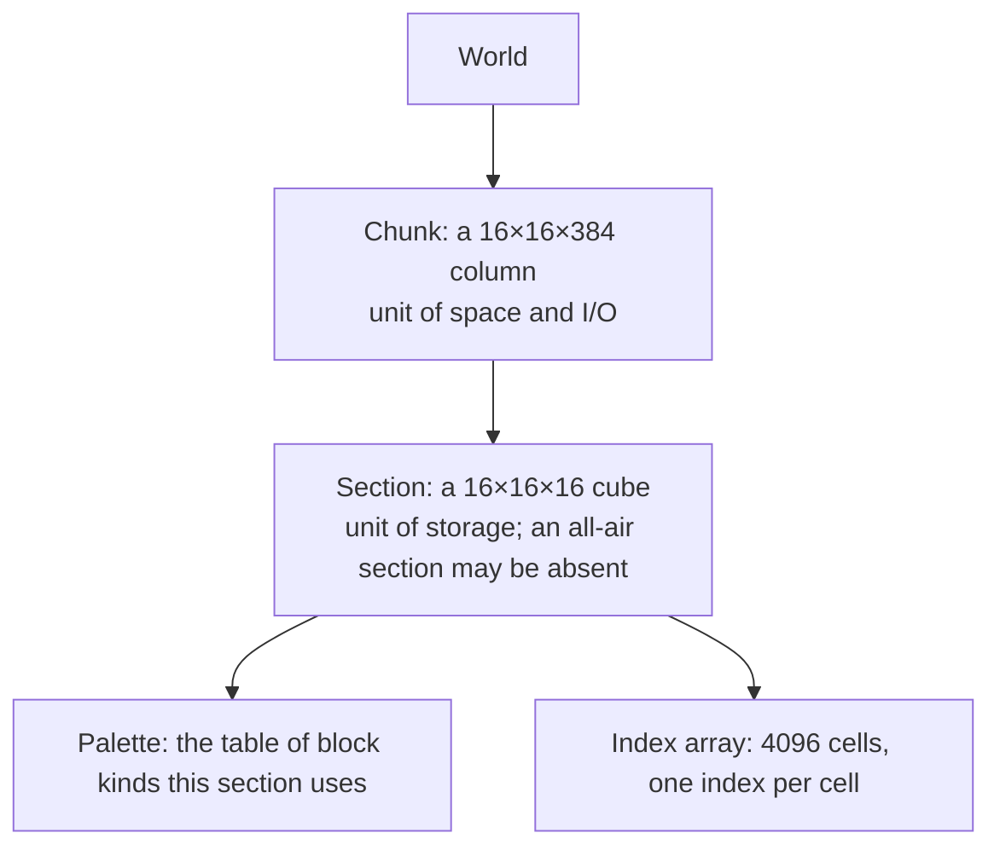

> **This chapter's thesis**: the world is a ledger, not a painted map — an account book kept cell by cell. The rules players can see, from "the world loads a piece at a time" to "height has a ceiling" to "even emptiness is a block," are all decided by the structure of that ledger. If air cost no data at all, and the height limit were a slider anyone could nudge, this chapter's thesis would not hold.

## The problem

You have watched new terrain arrive: not one scroll unrolling, but columns of blocks standing up out of the fog one by one. Hold F3 and a stream of numbers beginning with chunk scrolls past — the world really is managed in pieces. And there is something you may never have thought about: build a house upward from sea level, and at a certain layer no more blocks will go. Before 1.18 that layer was 255; after 1.18 the world digs down to -64 and builds up to 319, total height grown from 256 cells to 384 [^height].

Put these three things every player has touched side by side and the question surfaces: why must the world be chunked? Why does a place with nothing in it need a ledger entry too? And why does stacking blocks upward run into a ceiling — a ceiling that stood for over a decade before one major update finally raised it?

This chapter takes the world down to its smallest unit of bookkeeping and answers two questions head-on: **why is air data too? And what does a chunk actually mean?** Once those are answered, "why raising the height counted as a major event" explains itself.

## The block players see vs. the block in memory

The world model in a player's head is simple: every position either has a block or doesn't. Mine out the ore and the spot "isn't there" anymore.

The model in the machine adds one iron rule: **every position must have an answer, and the answer is always some kind of block.** "Nothing" is not in the vocabulary. Mine out the ore and what the position records is air — air is a block with exactly the standing of any other block; in Java Edition's data it has its own name, `minecraft:air`, an ID like everyone else's, and a ledger entry of its own.

Why must it be this way? Because "what is in this cell" is a question the game asks tens of thousands of times a second: whom does the light pass through, which way does the water flow, can a mob stand here, does this wall get drawn at all. A question-and-answer mechanism requires every position to connect. If "no answer" were allowed, the game would need a second bookkeeping system to tell "not saved yet" from "not computed yet" from "confirmed empty" — one entry saved, an entire family of special cases bought. Minecraft's choice is the dumb way, and also the good way: record every cell, empty ones included.

The second mismatch is subtler. When a player says "a block," they mean one whole thing — a furnace, say. In the machine it comes apart into at least two entries: one recording which way the furnace faces (light, read and written in whole batches), one recording how far the burn inside has gotten (heavy, changing with its contents). The first is called the block state, the second the block entity; the next section takes them apart.

First, align the whole chapter's accounts. For one sentence out of a player's mouth, here is the entry it becomes in the ledger:

| What the player sees or says | The entry in the ledger |
| --- | --- |
| A cell of stone | One block state: kind is stone, no extra properties |
| An oak staircase facing north | One block state: kind is oak stairs, property "facing = north" |
| "There's nothing here" | Air — an ordinary block that takes an entry like anyone else |
| Three stacks of supplies in a chest | Not in the block itself; in the block entity, the attached dossier |
| The patch of ground that just loaded underfoot | One chunk: a data column 16×16 across and the full height of the world down |
| The height limit | A size parameter of the data model: how many rows each column of this ledger keeps |
| The zombie that just swept past | Not a block — a separate body of entity data (given its own household in Volume III, chapter 6) |

The four sections that follow walk this table one row at a time.

## Block states, data values, and block entities

A **block state** is a block's list of properties. The metaphor: every kind of block wears a nameplate. Stone's nameplate carries only a name; a staircase's has blanks to fill in — which way it faces, upper half or lower, waterlogged or not. The properties are few, each with a fixed handful of settings, and that is exactly why it is "light": the nameplates up and down the street share one format, so the whole street can be copied in a single stroke.

This nameplate was not there from the start. **Before 1.13, properties had no names — only a number.** Each block, on top of its type ID, carried one "data value" from 0 to 15 — four bits, sixteen slots [^datavalues]. Wool's sixteen colors used the slots up exactly; wood's "standing upright or lying down" claimed a few; by the stairs, four facings times two halves took eight — and adding "waterlogged"? Sorry, no slots left. Worse was the semantics: the same number meant red on wool and east–west on wood — every block spoke its own dialect, and nobody could read another family's household register.

The 1.13 release of mid-2018 was the big cleanup, officially named "flattening": "type ID plus number" was pressed flat into "one kind of block, one name; properties listed explicitly" [^states]. From then on, block states lived in saves, commands, and the mod interface. The price was real: combinations of properties made the count of block kinds balloon, and every old save had to be migrated cell by cell. The return was just as real: "waterlogged" went onto stairs and fences in 1.13 as an ordinary property — under the old system that meant grabbing slots out of someone else's hand — and map and mod makers were released from memorizing incantations like "data value 15 means such-and-such on this block."

A **block entity** handles what the nameplate cannot hold. A chest's 27 inventory slots, the text on a sign, a furnace's half-finished burn — variable in length, complex in structure. Force them into block states and "a chest holding one stack of cobblestone" becomes a different kind of block from "a chest holding two stacks of dirt," and the ledger explodes. Minecraft's answer was to split the household: the block itself takes its cell as usual, and a dossier hangs beside it — the block entity [^be]. The dossier is written in a format called NBT — tagged, tree-shaped data, like an archive where every card fills in its own field names — and it goes to disk with the save.

<Note>The sign is the most visible block entity of all: two signs on the same street have identical block states and can carry entirely different text — because the words live in the dossier, not on the nameplate.</Note>

The dossier is not free. Block states share one format and can be read and written a whole column at a time; block entities are independent objects scattered across the world, and the game must track each one — the furnace has to run its own burn tick by tick, the chest has to remember what it holds. From this comes a rule difference every player knows: in Java Edition a piston pushes stone but not a chest — a piston can move a nameplate, not a dossier, so meeting a chest it can only smash it and spill the contents. In Bedrock Edition pistons do push chests; the two editions fork right here [^be].

So there is a clean criterion you can lift straight into your own voxel game: **properties with a fixed set of values that affect how the block looks belong in the block state; attached data with unbounded values and complex structure belongs in the block entity.** The day you see "a chest's contents" stuffed into a block state, the design is wrong — the count of block kinds will balloon with every combination of contents.

## Chunks, sections, palettes, and compression

A **chunk** is a column of data 16×16 across, running the full height of the world. Why cut the world into columns? Because loading, saving, generation, and sending all need a basic unit: as the player walks, what the game must replenish is "a ring of columns centered on me." Cut too fine and management overhead swamps the content; cut too coarse and each read or write moves too much. Sixteen is a negotiated engineering number.

So the full answer to "what does a chunk mean" is: it is **a stack of identities at once** — a unit of space (a patch of ground), a unit of I/O (saves are written and read by the column), a unit of generation (chapter 3's pipeline works column by column), a unit of networking (what goes to the client is packed by the column). You can verify the cut with your own eyes: press F3 + G and the world's chunk borders appear as wireframes; the block-by-block materializing of new terrain, the one-frame hitch as you cross a border — those are the column being produced and hauled. The column even stands watch for you: in Java Edition the chunks around the world spawn stay loaded year-round, so after you log off, the farms and furnaces on that ground keep running — it is the chunk standing watch, not magic.

A column runs from seabed to sky, mixing solid with void, so one more cut, vertical: the **section**, a 16×16×16 cube — the world's true unit of storage. Before 1.18 a column held sixteen sections; after it grew to 384 tall, twenty-four [^chunk]. The entire point of sections is to make laziness methodical: **a section that is all air simply is not stored.** On read, "this section is missing" is translated as "this section is all air." Here is the mechanism by which air is both data and not always costing data: it has a seat in the ledger, but when a whole page is blank, the page may be skipped.

The second space-saving device is the **palette**. A cell stores no block's full name — only an index into a "table of kinds" kept for this one section, like a painter's palette: lay out the few colors the picture needs first; the canvas records only "which number." A section is 4096 cells; if all it holds is stone and air, each cell costs one bit and the whole section fits in 512 bytes. More kinds, more bits — two kinds one bit, sixteen kinds four bits — but the growth follows the doubling of the kind count, not the number of blocks. The key is the words "this section": palettes are per-section, and a block that never appears in this section takes no seat in its table.

<Impl title="Bit packing">The indices are not byte-aligned; they are packed back to back into a stream of 64-bit integers: with two kinds of blocks, one bit per cell, sixty-four cells to an integer. This "palette plus bit packing" is the consensus at the bottom of modern Minecraft — the save on disk, the world in memory, and the packets sent to the client all run the same scheme. You need not copy every constant, but the move "look up the table, then record an index" is worth stealing.</Impl>

There is a third layer: before data reaches disk it goes through one pass of ordinary compression. The two layers divide the labor cleanly — the palette kills "repeated records of repeated content," compression kills "repeated patterns in what remains." In an ordinary save, a thousand-stone build may cost fewer bytes than the sorting system in your storage room — that is these two layers working together.

This chapter follows Java Edition's world format. Bedrock Edition keeps its worlds in a LevelDB key-value store — the ideas of chunking and palette are shared; the implementation details forked, and how that product line made the split, Volume I chapter 8 has already told (see [Two Product Lines: Java and Bedrock](/history/java-bedrock)).

## Sparse and dense

The world's fate runs in opposite directions on two axes. Vertically it is finite: 384 cells, one column recorded from bottom to top, computable and affordable — **dense vertically**. Horizontally it is nearly infinite: no one can store a complete map, so only the places you have been have data; an ungenerated chunk is not "blank," it "does not exist" — **sparse horizontally**.

One level down sits another pair. **Sparse between sections:** the sky's sections are absent whole. **Dense within a section:** a section that exists has all 4096 cells recorded — even if 4095 of them are air, keeping one lone torch company. What that torch enjoys is not waste but speed on the hottest path: lighting, collision, pathfinding, spawning are all asking "at this coordinate, what is this cell," and the answer must come in one step. A dense array — equal-length indices laid out cell by cell — guarantees one question, one answer, no table-hopping; the palette has already pressed each cell's cost down to a few bits; switching to a sparse "record only the exceptions" structure here would save space it cannot buy back in read speed — and the underground is mostly solid anyway; exceptions are no rarer than the rule. This is not "save wherever you can" design; it is "fastest where things happen most" design.

<Alternative title="Store only the seed and the player's changes">Another common design is "seed plus a change list": generate the world fresh from the seed each time and overlay the cells the player has touched; files can shrink to almost nothing. Minecraft effectively uses this scheme for ungenerated chunks — what does not exist takes no space — but for generated chunks it chooses full persistence: land that has been generated is stored as it stands. The extra space buys two things: reads no longer depend on the generator (a generator rewrite cannot touch your old homestead), and high-frequency random reads always take the shortest path. That account is settled in the next chapter, storage and serialization.</Alternative>

The chapter's first question can now be closed head-on. **Why is air data too?** Three reasons, stacked. First, every cell must have an answer, and air is that answer. Second, "not stored" does not mean "is air" — "this section does not exist" means "never generated," not "confirmed empty"; once generated, air takes its seat in the palette obediently. Third, air takes part in every rule — light passes through it, water takes it for a neighbor, mobs spawn inside it; every time a rule asks "what is this cell," air has to answer.

What would make that sentence wrong? If the game one day switched to a "whatever is not recorded counts as air" model, and lighting, fluids, and spawning produced no ambiguity because of it, then "air is data" would be out of date. Until then, it is the shortest correct description of this ledger. A postscript: the "table of kinds plus index" idea keeps expanding — since 1.18, biomes live in the same palette structure [^chunk].

## The height-limit event: how the data model constrains design

The Overworld's height limit stood at 0 to 255 for a very long time — hard-written by the data model: sixteen sections to a column, sixteen cells to a section. In November 2021, 1.18 — Caves & Cliffs Part II — extended the world 64 cells in each direction: -64 to 319, total height 384 [^height]. The cloud layer moved from 128 to 192 — even the clouds had to move house, because the sky got taller. The officials built an advancement to commemorate it: jump from the build limit (around Y=319), land below -59, and survive — the advancement is named "Caves & Cliffs" [^height].

Why was adding 128 cells a major version and not the changing of a number? Because height is not a property of the world; **height is the row count of every column in the ledger**, and it is written into every layer of the data model: columns went from sixteen sections to twenty-four; the heightmaps — the cache of each column's highest non-air cell, on which lighting and mob spawning both lean — had to track 128 more rows; every old save had to be migrated column by column — the old bedrock layer in an existing chunk was swapped for deepslate, the 64 cells beneath it were generated on the spot as new terrain, and the new bedrock settled between -64 and -60 [^height]. The upgrade logic even judged whether a column was old-format by "is its old bedrock still there." Veterans' feel for the old budget was just as concrete: a "mountain" topped out after a hundred-odd layers of climbing, a cave hit bottom after a few dozen cells of digging — the vertical drama could stage only half an act inside 256 cells. Move one dimension, and the entire system is conscripted to run alongside — a live photograph of what changing a data model costs.

<Constraint name="The height limit" verdict="groundwork" chain="a 256-cell vertical budget → mountains never tall enough, caves never deep enough, every piece of content bidding for height → design goals have nowhere to land, so the data model yields → 1.18 doubles the budget to 384, at the price of a full-format migration and a new bedrock layer">

The height budget is where all vertical design cuts the cake: peaks, caves, ore strata, and bedrock divide 256 cells between them. The design goals of Caves & Cliffs — deeper caves, taller mountains, caves threaded through mountainsides — simply do not fit in the old budget. In the end it was not the design that compromised; the data model was rebuilt: the budget doubled, and the vertical narrative became possible.

</Constraint>

Worth savoring is the manner of the concession. Why not simply go to "infinite height"? Because sections, palettes, heightmaps, and light arrays are all optimized against fixed sizes; once size becomes a runtime parameter, everything allocates dynamically and everything slows down. Minecraft chose "double once, then freeze again," not "adjustable from now on." Which is precisely the proof that the height limit is a foundation, not a parameter: a foundation can be re-poured, but not every day.

The design volume said the block is Minecraft's unit of measure, the smallest unit of its design grammar (see [The Voxel as a Design Primitive](/design/voxel-primitive)). This chapter adds the implementation half of that sentence: **the graduations of the measure are cut into the data model.** Changing the graduations means recasting the weights — which is why "make the world a bit taller" has never once been a light sentence in Minecraft. You will meet the same thing in your own voxel engine: world size is the hardest constant to change — either make it a parameter on the engine's first day, or accept surgery on the scale of 1.18. And if you truly mean to start over, Volume IV holds a rewrite proposal for world representation (see [World Representation](/rewrite/world-rep)).

## What this chapter leaves behind

- **For players**: the world under your feet is a ledger that keeps accounts cell by cell — air takes a row too, chunks are the ledger's page numbers, and the height limit is the ledger's row count; that is why "loading a piece at a time" is just the ledger being opened, and why "making the world taller" is major surgery.
- **For developers**: what you can take is the layering — chunks as the unit of I/O, sections as the unit of storage, dense within a section with a palette, sparse between sections, all-air sections standing in for air. What you cannot take, and need not, are the hard-coded sizes and the historical baggage: make world dimensions a parameter on your engine's first day, or accept a migration surgery that drags every save through with it.

[^chunk]: Minecraft Wiki, "Chunk format" (chunks of 16×384×16; sections of 16×16×16 with palettes and bit-packed index arrays; empty sections not saved; the history of the Region and Anvil formats; 1.13 merged Block and Data into BlockState; heightmap caches; since 1.18 biomes also use the palette structure), minecraft.wiki, retrieved 2026-09-18; see https://minecraft.wiki/w/Chunk_format

[^height]: Minecraft Wiki, "Java Edition 1.18" (released November 30, 2021; height raised to 384 cells, ceiling 319, floor -64; clouds moved from 128 to 192; the "Caves & Cliffs" advancement requires falling from Y≥319 to Y≤-59 and surviving; chunk format migration — old bedrock layers replaced with deepslate, new bedrock between -64 and -60), minecraft.wiki, retrieved 2026-09-18; see https://minecraft.wiki/w/Java_Edition_1.18

[^states]: Minecraft Wiki, "Block states" (block states entered the engine in 1.8's 14w11a, became usable in commands from 1.11, and went through flattening in 1.13's 17w47a; property values such as age 0–25 and level 0–15), minecraft.wiki, retrieved 2026-09-18; see https://minecraft.wiki/w/Block_states

[^datavalues]: Minecraft Wiki, "Java Edition data values" (before 1.13, blocks were recorded as an ID plus a data value; the old value system is described in that site's "Pre-flattening" entry), minecraft.wiki, retrieved 2026-09-18; see https://minecraft.wiki/w/Java_Edition_data_values

[^be]: Minecraft Wiki, "Block entity" (a block entity is an extra object tied to a specific block, storing what a block state cannot hold, and it can run on its own each game tick; in Java Edition a piston pushing one makes it drop its contents, while Bedrock lets pistons push it), minecraft.wiki, retrieved 2026-09-18; see https://minecraft.wiki/w/Block_entity
