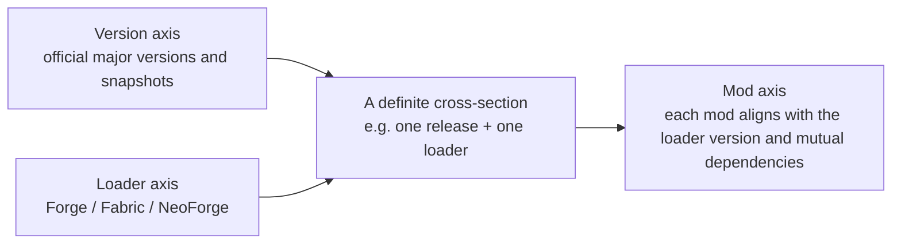

> **This chapter's thesis**: the ground mods survive on is not an official interface but injection — what a mod depends on is the internal implementation of official code, so a mod's maintenance cost is not decided by its own features but recalculated with every official update; this is why mods are harder to maintain than the engine itself. If mods could live long-term on nothing more than an official public interface promised to be stable, this thesis would not hold.

## The problem

On the release day of every major version, the Minecraft mod community punctually stages the same moving day. The official update ships as usual, and the game itself is fine — players without mods click update and keep playing. Players with mods do not dare click: they know that one click, and the dozens of mods in their mods folder will most likely fail together. Over the following week or two, mod authors release adaptations one after another — the large mods later, the niche ones later still — and the whole ecosystem, like a tide gone out and coming back, takes weeks to return to a state where it can be "lived in" again.

The strange part is this: **the officials changed the engine; it is the tenants who move house.** The engine itself runs perfectly well after every update — why is it always the mods that get shaken down? For any game with an official mod interface, the answer should be "the interface didn't change, the mods don't need to move." Minecraft's answer: it has never had such an interface.

This chapter takes the thing apart from the root. First, why every update is a forced rework — which brings out the single most important sentence this book has about this ecosystem: **when there is no stable interface, injection is the interface.** Then, two rivers, and how the community built houses on a foundation with no interface: the client-mod river ran from bytecode surgery to the stitching of Mixin to the side-by-side loading philosophies of Forge and Fabric; the server-plugin river answered with Bukkit's split between interface and implementation, and handed in the steadier paper. Next, what the loader actually solves — isolation, hook points, initialization order — and finally the full ledger: the compatibility matrix multiplied across version, loader, and mod, and why that multiplication is what makes mods harder to maintain than the engine.

Scope first: this is the architecture chapter of the Java Edition ecosystem. Java programs ship as bytecode that tools can restore and tools can rewrite — that is the only reason injection gets a stage at all. Bedrock Edition is written in C++; its counterpart is official add-ons plus a scripting API, a different road on which the officials supply the goods, handled in its own chapter (see [Java Edition and Bedrock Edition](/impl/bedrock)). The two rivers' history and people — MCP, Risugami, the birth of Forge, the Bukkit team's absorption — [Mods as the Second Author](/history/mods-as-authors) already told; this chapter borrows conclusions and deals architecture alone: why these things grew into this shape and not another.

## Why every major version is doomsday for mods

First, watch the machinery of "doomsday." Minecraft's program ships as bytecode — semi-finished machine instructions, halfway between source code and product — which tools can restore into readable text close to source. The officials set one guard: at release, every internal name in the code is replaced with meaningless letters, so that no one can read it. The community's answer was to compile a dictionary: MCP mapped each version's scrambled names, one by one, back to readable ones (Volume I chapter 4 told that story). Mod authors read the official code through the dictionary, write their mods, and compile back.

So one official major update is, for the mod ecosystem, a chain of four linked breaks: **the officials change internal implementation and the scrambled names reshuffle; the dictionary must be recompiled; the mods must be rewritten and recompiled against the new dictionary; and the conflicts among mods must be re-debugged.** Every ring of the chain takes human labor, and all of it is done by uncontracted volunteer workers. That is the entire content of "doomsday" — not some catastrophe; a tax collected quarterly.

Now answer head-on: why does the official side not provide an interface and be done with it? Imagine what that contract would look like: the officials publish a set of functions and data structures and state plainly, "use these as you like; we guarantee they will not change." Mojang never signed it — in 2012 it hired the Bukkit team to prepare an official mod API, and that API has still not been released to this day.[^w-bukkit] The reason for not signing is not complicated: neither end pays. **An interface made shallow is not enough**: what is truly valuable in the mod ecosystem is filling in whole layers of system — energy, logistics, dimensions (Volume I chapter 4's argument); a shallow interface cannot hold those, and if it did hold them it would not be an "interface" but "half an engine." **An interface made deep is ungovernable**: allowing outside code to depend on the engine's internals amounts to sentencing yourself to "the internals may never be refactored again." Yet internal refactoring is precisely the officials' main instrument for clearing their own technical debt — the 1.13 update of 2018 was, on the official side, a great cleaning of the data layer, and on the mod side it meant a great reshuffle of internal identifiers and a wholesale rework of every mod. Every repayment of official debt is a tax paid by mods; the two ledgers live in different books, and Mojang's ledger has no column for the mod community.

And so the de facto contract appeared, its terms the exact opposite of a real one: not the officials promising "we will not change," but the mods promising "if you change, we fix." **What a mod depends on stopped being "the interface the officials promised to give" and became "what the official code happens to look like at this moment" — the internal implementation is the interface; injection is the API.** This contract carries no stability promise, no changelog, no deprecation window; every clause is performed unilaterally by mod authors. When this book says "upgrading is politics," it means exactly this structure: one official update, and the labor arrangements of thousands of authors are unilaterally rewritten at once — who adapts first, which loader to bet on, which version to abandon all become decisions that require negotiation and the picking of sides. Technical questions become coordination problems.

How would this judgment fail? If the officials one day shipped a stable interface of sufficient depth, and the large mods genuinely migrated onto it and from then on survived across versions, then "injection is the API" would become a theory of a historical phase and this chapter's thesis void. Worth recording is the most recent step: in October 2025 the officials announced the removal of obfuscation from the Java Edition source.[^w-modding] That step removed the "reading" threshold — the dictionary no longer needs to be community-compiled; but nothing has been promised about the stability of "writing": the officials have not said which internal structures may not change. The threshold came down; the contract is still the same one-sided contract.

<Constraint name="Injection is the API" verdict="passable" chain="the officials provide no stable interface → mods come to depend on internal implementation instead → the compatibility burden shifts to authors with no contract → every official update recalculates it for everyone">
The arrangement has run for fifteen years and carried hundreds of thousands of mods, but it transferred the entire cost of compatibility to the party in the ecosystem with the least bargaining power. It rests on a rare precondition: enough people who are technically strong, unpaid, and willing to chase versions. In a game without that reserve of volunteers, the same architecture is the ecosystem dying outright.
</Constraint>

## The client-mod river: from bytecode surgery to Mixin

The client river's historical narrative belongs to Volume I chapter 4; here only the architectural evolution is taken apart — and every step of that evolution treats the same disease that injection brings: **the unstable surface is too large.** The unstable surface is the total amount of code that mods depend on and that the officials may move at any time.

The earliest method was bytecode surgery: open up the game's files directly, alter the classes inside, pack it all back. Surgery's problem is not difficulty but crowding — two mods that edit the same stretch of official code, and the later one overwrites the earlier; install three mods and two break. ModLoader set the rules of "where you may enter," and Forge upgraded the rules into a complete institution: **turn the surgery into hooking.** Forge pre-cut a batch of openings into the official code (hook points): mods no longer wield the knife themselves; they hang their logic on the openings; new blocks and items a mod registers are logged in Forge's registries, and collisions over IDs vanished from then on. The description on its GitHub repository says this as unassumingly and as precisely as it can be said — "modifications to the Minecraft base files to assist with compatibility between mods."[^gh-forge] The bundled loader, FML (Forge Mod Loader), took over the business of installing mods as well. From then on, "editing the official source" was demoted from a mod author's required course to an internal affair of the framework, and Wikipedia's summary of the step is: Forge ended the necessity of directly modifying the base code.[^w-modding]

Forge's philosophy thus set: **heavyweight, full-featured.** Loading, registration, renderer access, networking, configuration, save access — one framework covers everything; a mod author learns one toolkit and can do anything. The price: the whole toolchain is heavy, follows versions slowly, and when the officials ship a new version, this large body must finish adapting in full before downstream work can begin. That is the unstable surface's second form: you no longer wield the knife yourself, but you depend on the entire Forge layer — wherever Forge has adapted to, that is where your mod can live.

The architectural leap came from the server side. Sponge, a server platform begun around 2014, produced the tool called Mixin:[^w-modding] in plain words, **Mixin is the stitching that sews a small piece of logic into an official method.** You write an ordinary method and annotate which method of which official class it should be sewn into — at the head, at the tail, or over a particular line; at game launch, the moment the official class is loaded, the weaver sews your code in, and from then on the official class carries a stretch of logic it does not itself "know" about. Technically it is bytecode rewriting; the framework describes itself as "a mixin and bytecode weaving framework based on ASM," working by hooking into the runtime's class-loading process.[^mixin]

Mixin's architectural significance is not convenience; it is that the decision over hook points was taken back out of the framework's hands: Forge's openings are pre-buried by the framework, and where the official code has none, nothing can be hung; Mixin makes any line of official code eligible to become a hook point. Hooks went from "issued by the framework" to "chosen by the mod," and heavy work became doable without the full suite — which paved the road directly for the next loader.

In December 2018, Fabric shipped.[^w-modding] Its self-description is one line: the modular, lightweight loader.[^fabric] Architecturally it took Forge's full suite apart: the loader itself made as small as possible — it installs mods, manages order, runs the weaving; everything else — events, networking, commands — is packaged separately as an ordinary mod called Fabric API, installed by whoever needs it. The mapping dictionary changed its approach too: Forge-line dictionaries travel with that toolchain; on the Fabric side, the Yarn mappings are an openly licensed (CC0) independent project maintained by the FabricMC community, usable by anyone.[^fabric]

<Alternative title="Two loading philosophies: the full suite and the minimal core">
Forge's answer is "one framework solves every problem": a uniform path for newcomers, no service a large content mod lacks — but the chain is heavy, adaptation is slow, and everything is deeply bound to the framework's own rhythm. Fabric's answer is "a minimal core plus optionals": the loader is small and quick to follow official versions; the price is that base capabilities must be assembled yourself, and the ecosystem carries two parallel stacks. There is no referee here: large mods want Forge's full set of services; lightweight mods want Fabric's low burden. The criterion is not architectural superiority; it is which river your target population of mods lives on.
</Alternative>

In July 2023 the river forked once more: a large share of Forge's developers and contributors announced a split from the original project and founded NeoForge.[^w-modding] The proximate cause was a dispute over direction and licensing — the original project subsequently tightened its license terms, while the new project raised the flag "free, open source, community-oriented" and continued under the permissive LGPL.[^neoforge] Who was right will not be adjudicated here — that is a question of governance, not architecture — but the structural consequence must be recorded: **the layer that provides mods their stable surface became unstable itself.** "Upgrading is politics" here takes flesh: a Forge mod author wakes up facing two incompatible "Forges," and must pick a side, must port, must explain to players why the two versions cannot interoperate. The loader went from public utility to camp that demands allegiance.

## The server-plugin river: the interface layer and the implementation layer

The plugin river gave a different answer to the same problem, and structurally a far cleaner one: **confine the instability to a single layer.**

Bukkit was two layers from day one. The upper layer is Bukkit proper, a pure interface — a "grammar book for the server" that prescribes what a plugin may ask of the server and what events it may hear, open-sourced under the GPL; the lower layer is CraftBukkit, the wrapper that makes Mojang's official server program actually run plugins, open-sourced under the LGPL.[^w-bukkit] Plugin authors write code against the upper layer and never touch a line of official server code; all the dirty work — decompiling the official code, cutting hooks, sewing in — is concentrated in the implementation layer below, done once, shared by every plugin. The unstable official internals are locked inside the cage of the implementation layer, and outside the cage stand tens of thousands of tranquil plugins.

The most valuable component in this structure is the event system. Plain version: **whenever something happens on the server, it posts a bulletin; a plugin pre-registers "I care about this class of bulletins," and on receiving one it may read the details, rewrite the outcome, even cancel the event outright.** A player joining is a bulletin; a block being broken is one; a mob taking damage is one. Mechanically, a plugin implements a listener interface and annotates which method handles which class of event; the server files events by type, queues and dispatches them by priority, and cancellable events uniformly carry a cancel switch.[^spigot-javadoc] The value of this subscribe-and-dispatch model has three layers: plugins do not invade the game's main loop, and the server walks its ticks as usual (chapter 5); plugins by nature do not step on each other, each registering for its own bulletins; and official behavior can be intercepted and rewritten without one character of official code changing. Bukkit made this model the common language of the entire river — every implementation that came after on this river inherited it unchanged.

The interface/implementation split paid its dividend at once: **the implementation layer can have its blood swapped wholesale, and the layer above never notices.** CraftBukkit stalled; Spigot took over (renamed in January 2013); in June 2014, out of dissatisfaction with Spigot's refusal of community contributions, Paper forked from Spigot to concentrate on large-scale performance optimization of the implementation layer.[^w-bukkit] Plugin authors never changed a line of code for those optimizations — they do not even need to know what Paper changed. By mid-2025, public statistics recorded over 130,000 Paper servers online at once, more than sixty percent of this river.[^w-bukkit] The layer users cannot see optimizes at will; the visible interface does not move a hair — that is the entire return on "confine the instability to one layer." To be sure, this river has its own legal landmine: an open-source shell wrapped around Mojang's proprietary core, a license that does not legally hold — the DMCA takedown of 2014 detonated it (the end of Volume I chapter 4, and [The Server Is the New Game](/history/servers), tell it in full). The mine is legal, not architectural — the architecture itself still runs today.

Put the two rivers side by side and the difference is plain. In the client river, every mod faces the official internals alone, and the unstable surface multiplies with the number of mods; in the plugin river, a single implementation layer faces the official internals, and the unstable surface is pressed down to a constant. Client mods need everyone to retrain with each official version; plugins often run unchanged across several versions — not because plugin authors are more diligent, but because they stand on an interface layer where someone else has already borne the instability for them. To "injection is the API," the plugin river's answer is not denial but confinement: since injection must exist, let it happen in exactly one place.

<Note>
The two rivers each built a layer of "counterfeit interface": the Bukkit interface is not promised by Mojang, and neither are Forge's hooks. They are stable not because the officials guarantee them but because the whole river sustains them together — the community writing contracts for the community.
</Note>

## Class loading, events, lifecycles: what the loader actually solves

First, a ground-floor job in plain words. A running Java program does not read all of its code into memory at once; it loads each "class" at the moment of use — and the role that does the loading is called the class loader. It decides which class comes from where, when it comes, and whose wins when names collide. The job sounds tedious, but for the mod ecosystem it is the jugular: **all injection happens at the moment a class is loaded.** Once a class is loaded it is set; to change it afterward is to operate on a running program.

What does the loader actually solve? Taken apart, three things.

The first: **manufacture hook points, and guard the timing of the needle.** The official code contains no openings left for mods — not one. Every hook point this ecosystem uses was manufactured by the loader, in two ways. One is static pre-burial: Forge buries hooks while modifying the official code — the registries and the event dispatcher belong to this kind; the server calls out "something happened" at fixed spots, and plugins can hear it. The other is dynamic stitching: Mixin weaves code in at the instant before a class loads — one step later and the class is set. This answers directly why the loader is a necessity and not an accessory: so long as mods work by injection, some role must own the timing of class loading — without an owner there is nowhere to plant the needle, and if every mod scrambles to plant its own, you are back in the surgical era of mutual overwriting.

The second: **hard-code the order of entrance.** With dozens of mods on the same stage, precedence is not etiquette but life and death: a block registered by mod A must be recognized by mod B's machine, so B must initialize after A; two mods share a base library, so that library must be in place first. Every loader therefore prescribes a lifecycle: discover the mods, read the dependency declarations, sort by dependency, construct, register content, initialize — whoever's configuration declares a dependency queues behind it. What the player sees is only "the mod installed"; behind the scenes, the loader has arranged the code of dozens of mutually unacquainted authors into an entrance sequence that does not trip.

The third: **isolation and arbitration.** Plain version: class-loader isolation means every mod brings its own bookshelf and the books never wander between shelves — two mods may use the same library under the same name and version, each reading its own copy, neither overwriting the other. But Minecraft's reality is more subtle than the textbook: mods also need to call one another and share content, and total isolation would dissolve the ecosystem, so the actual loader is closer to a partitioned library — content on separate shelves, a shared lending hall. Isolation is selective: the ones that would fight are kept apart, and the ones that cooperate are seated in the same hall. Add arbitration over same-named resources and adjudication over duplicate classes, and the loader is in effect this ecosystem's registry office and notary.

The three mechanisms fold into one view: **events are hooks at runtime, Mixin is the hook at load time, the registry is the hook of content registration — the loader's proper job is to manufacture and administer the entire ecosystem's hook points in the place where the officials provided nothing.** The final answer to "what does the loader solve" is a little deflating: it solved "the officials solved nothing."

## The compatibility matrix: the three-dimensional explosion of version × loader × mod

With the parts above on the table, the mod ecosystem's true maintenance object comes into view. It is not a line; it is a three-dimensional space, and all three axes are unruly.

The **version axis** is decided unilaterally by the officials: a major version every few months, snapshots threaded between, and every move reshuffles the internal implementation once. On the **loader axis** stand Forge, Fabric, and NeoForge — three lines, each with its own version numbers, each adapting to the officials' new versions at its own pace; after 2023, this axis forked once more on its own. The **mod axis** is the most crowded: CurseForge alone lists more than 200,000 mods (March 2025),[^w-modding] and each mod declares which loader it wants, which versions, and which other mods it depends on. Installing a set of mods means picking a point on three axes simultaneously:

The three axes multiplied together are the compatibility matrix's true size. Every player's "the mods are installed" is one verified point in the matrix; any axis moves, and every related point is voided and must be re-verified. The officials ship a new version and the version axis moves; the three loaders chase the officials each at its own pace; mod authors wait on the loaders — one axis moves, and the other two move in a chain.

Modpack authors are this equation's human solvers. Their workflow is, in essence, pinning down two axes first — choosing one version and one loader yields a cross-section — and then solving the mod axis inside it: dozens or hundreds of mods, whose dependency gaps, whose ID collisions, whose features clash with whose, leveled one by one. The modpack's rise to popularity in the 2010s is itself social evidence of how hard the matrix is: ordinary players gave up assembling on their own and outsourced the solving to curators.

For a mod author, the matrix is a release-strategy problem. Support two loaders and the cost doubles — the same logic written once against each of two interfaces, testing doubled; back only one, and you shut the door on the other side's user base. After NeoForge's fork the problem got harder: "Forge mod" used to be a single point; now a port and an allegiance are required between Forge and NeoForge. Here is the last layer of "upgrading is politics" — even "which loaders does my mod support" becomes a stance question to be answered in public.

Now the chapter's question can be closed head-on: **why are mods harder to maintain than the engine?** The engine's maintainer faces a codebase under his own control: informed before a change, able to run tests after, the rhythm self-set, the cost accruing with his own features. The mod maintainer faces the product of three uncontrollables: a foundation that changes without notice (official internals), a middle layer with rhythms of its own (loaders, which may split), and a neighborhood of mutually dependent peers (other mods — someone else abandons ship, and you take on water). **The engine's costs are additive; a mod's costs are reset to zero** — with every official major version, a mod's maintenance cost is not increased by a block but recomputed wholesale. Which side is harder depends on whether the number of times other people move exceeds the number of lines you write; for fifteen years, the former has never lost.

How would this judgment fail? An official stable interface appears, the large mods migrate onto it, the matrix collapses to two dimensions — maintenance difficulty falls back to the level of ordinary software, and this chapter's conclusion expires. It has not happened: the obfuscation removal of October 2025 lowered the "reading" threshold, and the version axis's turbulence is not one notch less. The rewrite volume will give this question a design answer head-on — [The Two Layers of Scripts and Mods](/rewrite/scripting) proposes splitting explicitly into two layers, a "stable interface layer" and an "injection layer," each minding its own; and this chapter's two rivers are precisely that proposal's existing evidence, pro and con: the plugin river demonstrates what confinement buys, and the mod river demonstrates what refusing to confine costs.

## What this chapter leaves behind

- **For players**: when a mod is slow to update, it is usually not the author being lazy — the officials moved one axis of the matrix, and every author is re-solving. Before installing mods, align three things: the game version, the loader, and the dependencies the mod declares — get one wrong, and the whole set crashes.
- **For developers**: what you can take away is the plugin river's confinement structure — interface and implementation in separate layers, so that optimization passes down to all upstream at zero cost; event subscription, so that extensions which have never met do not fight; lifecycle declarations, so that load order can be predicted. What you cannot take away is the river itself: the order of "injection is the API" rests on people who draw no wage and are willing to rework every quarter — that is not something architecture can design.

[^w-modding]: Wikipedia, "Minecraft modding," retrieved 2026-09-18, https://en.wikipedia.org/wiki/Minecraft_modding (Forge and FML released around November 2011, "ended the necessity of directly modifying the base code"; Mixin introduced by Sponge around 2014; Fabric released December 2018; NeoForge split from Forge in July 2023; CurseForge surpassing 200,000 mods in March 2025; removal of source obfuscation announced October 2025)

[^gh-forge]: MinecraftForge team, "MinecraftForge" repository description, GitHub, retrieved 2026-09-18, https://github.com/MinecraftForge/MinecraftForge (the description text: "modifications to the Minecraft base files to assist with compatibility between mods")

[^mixin]: SpongePowered, "Mixin" repository README, GitHub, retrieved 2026-09-18, https://github.com/SpongePowered/Mixin ("a mixin and bytecode weaving framework based on ASM"; weaves by hooking into the runtime's class-loading process)

[^fabric]: FabricMC, "Fabric" official website, retrieved 2026-09-18, https://fabricmc.net/ (the "modular, lightweight loader" positioning; Fabric API distributed separately as an ordinary mod; Yarn as openly licensed (CC0) Minecraft mappings maintained by FabricMC)

[^neoforge]: NeoForged team, "NeoForge" repository, GitHub, retrieved 2026-09-18, https://github.com/neoforged/NeoForge ("a free, open-source, community-driven mod API, based on Forge"; licensed under LGPL-2.1)

[^w-bukkit]: Wikipedia, "Bukkit," retrieved 2026-09-18, https://en.wikipedia.org/wiki/Bukkit (Bukkit open-sourced under GPL and CraftBukkit under LGPL; the licenses do not legally hold because of the mingled Mojang proprietary code; the team joined Mojang announced February 28, 2012, and the official mod API was never released; Spigot renamed January 15, 2013; Paper forked June 23, 2014 after Spigot refused community contributions; bStats recorded over 130,000 Paper servers online in June 2025, over sixty percent of the ecosystem)

[^spigot-javadoc]: SpigotMC, "Spigot-API: org.bukkit.event package documentation," Javadoc, retrieved 2026-09-18, https://hub.spigotmc.org/javadocs/spigot/org/bukkit/event/package-summary.html (the Listener interface, the EventHandler annotation, EventPriority execution order, the Cancellable event-cancellation mechanism)
