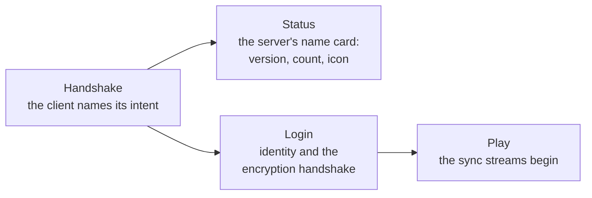

> **This chapter's thesis**: the network protocol is Minecraft's unacknowledged public API — the officials never promised its stability, yet third parties (alternative servers, cross-version proxies, anticheats) depend on it at scale for their very survival; and the architecture of "singleplayer is a local server" decides that the protocol is not an accessory to the game but the skeleton of the game itself. If the officials one day sealed the protocol and rewrote it from scratch without triggering an ecological earthquake, this thesis would be wrong.

## The problem

The overwhelming majority of players have never once performed the action "connect to a server" in their entire singleplayer lives. Yet open a singleplayer crash report, or press F3 for the debug overlay, and you will meet an unfamiliar character: the **integrated server** — and it is running on your computer.

That is right: your "singleplayer" Minecraft is a server. Every key you press, every block you mine walks the complete network flow — the cable is merely short enough to stay inside the machine. This seemingly over-engineered architecture is the key to every network behavior in the game: why the root disease of multiplayer latency can be observed in singleplayer, why anticheat is difficult by birth, why the protocol became the lifeline of a third-party ecosystem. Holding this key, the chapter spreads out the never-ending conversation between client and server for a close look.

## Why singleplayer needs a "server"

First, take the counter-intuitive design apart properly. Minecraft puts "world simulation" wholesale into the server program and "presentation and input" into the client program; singleplayer mode simply lets the two programs talk to each other inside one computer, over the loopback — a short circuit in the network stack that points back at the machine itself.

The list of this architecture's gains runs much longer than its costs. **First, one code path.** Singleplayer and multiplayer run the same world-simulation logic — the redstone machine you tested in singleplayer behaves identically on any server (same version, that is). Had singleplayer taken a "local direct connection" shortcut instead, the divergence between two logics would be a bug factory that never finished producing. **Second, multiplayer came free as a by-product.** Click "Open to LAN" in a singleplayer world and your singleplayer instantly becomes a real multiplayer server — because the ability had grown inside the architecture from day one. **Third, one anticheat model.** There are no "singleplayer trust rules" and "multiplayer anticheat rules" to reconcile; authority sits on the server side, always. The cost is the one chapter 5 already billed: the singleplayer player also carries two clocks and eats two overheads (see [The Game Loop and the Tick](/impl/tick)). On balance this is a textbook architecture decision — **one unified abstraction, the server, digesting an entire product dimension, multiplayer.**

## The authority model: who holds the truth

The conversation between client and server obeys one iron law: **the server is the only truth.** What the world looks like, what your backpack holds, which cell the creeper is standing on — the final answers to these questions exist only on the server's ledger; what the client holds is "a copy from the last reconciliation" plus its own optimistic guesses.

The concrete shape of the division of labor: the client uploads **intents** (I am holding the forward key; I swung the pickaxe; I put this iron ingot into the furnace), the server hands down **verdicts** (was the intent legal; what was the outcome) and broadcasts the results. Adjudication sits almost entirely on the server — the one major exception is the player's own **movement**: for the sake of feel, the client is allowed to act first and report after, and the server runs only loose sanity checks (is the speed plausible; did you phase through a wall). This exception is the wellspring of the anticheat predicament later in this chapter — hold the thought.

The authority model explains a shelf of phenomena every player knows. Mining on a bad network, the block "breaks and then grows back" — that is the client's optimistic rehearsal overruled by the server and rolled back (the inventory plays the same trick, as [Items, Inventory, and Crafting](/impl/items) accounted). Mobs "twitch" under latency — that is the local copy's interpolation derailing while it waits for fresh snapshots. And it explains why the essence of nearly every cheat is "lying to the server": since the truth lives on the server, cheating has no road other than poisoning the information source.

## What gets synced: chunks, entities, inventories

The two ledgers keep each other consistent through three kinds of sync streams.

**Chunk data.** When a player enters a region, the server packs the corresponding chunks whole (compressed) and sends them over — the largest one-way transfer there is, and the real substance of that loading bar when you walk into new terrain. The chunk inside your client is a read-only copy: you can see it, your changes to it must be reported, and once it leaves view distance it is discarded.

**Entities** run on "spawn notice plus continuous deltas": when an entity enters your view distance you receive a spawn packet (what it is, where it is, which way it faces), and after that a small packet of position and state updates every tick (chapter 6 priced this "entities × viewers" network tax). When the entity leaves your view distance the sync stops and the local copy is destroyed — which is why an x-ray hack cannot, in principle, obtain the data behind a wall: what was never sent to you does not exist in your client at all.

**Inventories and interfaces** are the window protocol of [Items, Inventory, and Crafting](/impl/items) — rehearsal on the client, adjudication on the server. Around these run thinner streams — chat, scoreboards, particles, sounds — plus one reverse, upward stream of player intent. The protocol's overall shape is a hybrid of "state synchronization" and "event notification": world state reconciled on a schedule, player behavior reported item by item.

The conversation also has an opening ceremony most players never notice: the protocol is a **state machine**. Once the connection is up, the two ends first idle in the status state — what the client sends here is an inquiry, and the server answers with its name card (version number, online count, icon); that is where the information in your multiplayer server list comes from. Then comes the switch to the login state: identity is verified (an online-mode account goes through the encryption handshake) and the player's place is settled. Then the switch to the play state — and only now do all the sync streams above actually begin. The three states have a strict order and a negotiated encryption between them; every detail of this opening etiquette is liturgy that a third-party implementation must reproduce verbatim.

A word in passing: chat, inside this protocol, is no longer "text sent freely." Since 1.19, every Java Edition chat message carries a cryptographic signature, for use in governance and reporting — the jurisdiction storm that Volume I, chapter 13 recorded has its technical footing exactly here (see [Minecraft as Cultural Heritage](/history/heritage)). Every field at the protocol layer can, in the end, grow social meaning.

## Latency, prediction, and anticheat's congenital difficulty

Network latency is this architecture's natural predator: the intent is delayed going up, the verdict is delayed coming down, and by rights every player action should "feel laggy." Engineering's life raft is **client prediction**: perform the result locally first (you press W and you move at once), then reconcile when the server's verdict returns; when the two disagree, roll back. That famous rubber-banding — running along, then yanked back to where you were — is a failed prediction replayed in public.

Prediction can save the feel of movement; it cannot save anticheat. Minecraft's anticheat predicament has three layers, each one structural. **Layer one: the client knows everything.** To render at all, the client must hold every piece of world data inside view distance — an x-ray hack does not need to crack a single server; it only displays "what was sent to you" in a different way. Once the data is in your hands, the secret is no longer a secret. **Layer two: movement authority is, in fact, the client's.** As established above, movement is "the client reports first, the server spot-checks" — speedhacks and flyhacks work by filing false accounts, and the server can only guess at the ledger's honesty with statistical heuristics (you cannot cross thirty blocks in a second). Guess loose and cheats run rampant; guess tight and legitimate players get rubber-banded — a scale with no perfect setting. **Layer three: freedom and the cheat surface grow in proportion.** A competitive shooter can collapse movement into "a few legal actions" and inspect them hard; Minecraft's core is free building and free movement — the space of legal behavior is nearly infinite, and cheating hides inside it the way a grain of sand hides in a desert. What server-side anticheat plugins (one of the mainstays of chapter 16's server ecosystem, see [Servers and Scale](/impl/servers)) can do is, in essence, the optimal guerrilla campaign in this asymmetric war: statistics, profiling, batch comparison — raising the cost of lying until it is not worth it.

## Protocol versions and multi-version servers: the unacknowledged public API

The protocol's final piece concerns its relation to the third-party ecosystem — the home ground of this chapter's thesis.

First the facts: Minecraft's network protocol has **no official documentation and no stability guarantee**[^protocol], and it changes with nearly every version, casualty of internal refactors. By the software industry's standard script, this is a purely private interface. Yet it happens to have grown up on the foundations of an open ecology: the entire third-party server lineage that chapter 16 enumerates (Bukkit, Spigot, Paper — see [Servers and Scale](/impl/servers)) must implement this protocol completely before a vanilla client will connect; cross-version proxies (translation gateways that let new clients into old servers) must translate between two protocols field by field; anticheats must parse it byte by byte; statistic sites, bots, tool sites — all of them feed on the protocol.

So a singular institution formed: **the officials do not acknowledge this API, and the ecosystem treats it as a constitution.** Every internal refactor — even moving a field inside the engine — lands on the protocol as a constitutional amendment, and the whole ecosystem pulls an all-nighter to keep up. The officials' long-standing posture is acquiescent non-commitment: they do not obstruct (third-party implementations have never been banned), do not endorse (protocol compatibility has never been vouched for), and occasionally refine (login encryption and status queries have gradually been formalized). This is the same pattern as the mod governance of Volume I, chapter 4, projected onto a different wall: **the officials trade "no promises" for "no burdens"; the community trades "reverse-engineering it themselves" for "de facto freedom"** — the protocol became a contract neither side signed and both sides observe.

The contract even bred a species invented purely by the community: the **cross-version proxy**. The officials never promised that a new client could join an old server (the protocol changes with every version), yet the reality of servers is that client versions always move faster than server plugins can follow — players upgrade, and the plugins lag behind. The community built translation gateways: software that sits between client and server and translates protocol A into protocol B, field by field. A species the officials never planned, cannot outlaw, and need not — the most practical fruit borne by the "unacknowledged public API": the compatibility debt the officials owed is being serviced, on schedule, by a folk translation layer sitting on the protocol.

Return to this chapter's falsification condition: if the protocol were truly a dispensable accessory, sealing and rewriting it would carry no ecological consequence at all. The historical record reads the opposite way — every major protocol change is an overtime week for the entire ecosystem. "Unacknowledged public API," an identity that sounds like a contradiction in terms, is the deepest structure of this game's openness.

## What this chapter leaves behind

- **For players**: your singleplayer is an online game with a population of one — the latency, the rubber-banding, and the "broke and grew back" all have their mechanism names now.
- **For developers**: what you can take away is the architecture template of "singleplayer is a local server" — one unified abstraction digesting the multiplayer dimension, one code path, the capability thrown in for free; and the authority model's bookkeeping discipline — rehearsal to the client, truth to the server. What you cannot take away is anticheat's war posture: the freer the world, the larger the cheat surface; this problem has no solution, only a continuing guerrilla budget.

[^protocol]: Minecraft Wiki, "Protocol" (the client–server communication format changes between versions, with no official stability guarantee; the community maintains complete unofficial protocol documentation), minecraft.wiki, retrieved 2026-09-18: see https://minecraft.wiki/w/Protocol .
