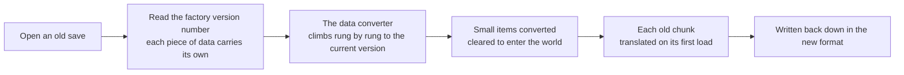

> **This chapter's thesis**: the world must outlive the engine, so what the storage layer really maintains is not a file format but migration — every change to the save format settles its cost in player time and player risk. If some upgrade leaves a large share of old saves unopenable or irreversibly damaged, this promise is bankrupt; conversely, if migration is ever so cheap that players cannot feel it at all, then dragging in the word "ethics" is grandiosity.

## The problem

A save generated in March 2012 still opens today, on a double-click. That month, Minecraft had just completed a wholesale swap of its save format; in the decade-plus since, the interface has been redone, the renderer rewritten, and the world generator touched in nearly every major release — yet the format of the world files carried through to the present day. In the software industry, a format that stays in use for a dozen years, data that still opens after the engine underneath it has been swapped out, can be counted on one hand — plenty of games' saves do not outlive the game's own delisting.

Then there is the thing every player has seen: carry an old save into an upgraded version, and the first launch makes you wait at a "Converting world" screen. What is the game doing during those tens of seconds? Why is the wait unavoidable? Why does it sometimes stretch into minutes?

To understand either, start with one word: **serialization**. While the game runs, the world is one great tangle of live objects — blocks, light, mobs, the contents of chests — scattered through memory, referencing one another, changing every instant. Whatever lives in memory dies with the power, so it all has to be turned into a stream of bytes that can be written to disk and turned back next time; that round trip is serialization, and the save format is what the bytes look like on the way out. Minecraft's peculiarity is that this byte stream is required to do more than "read back" — it is required to still read back **ten years later, under a different engine**. This chapter follows that requirement and asks: why must the world outlive the engine? And what has keeping that promise cost the engine?

## The world outlives the client

Begin with an asymmetry. The client's lifespan is counted in weeks: a snapshot every week, a major version every year. A save's lifespan is counted in years: one save can be opened across a decade, upgraded in turn by four or five major versions. The data required to be "readable forever" is precisely the data that changes most slowly and tolerates error least.

Why must it be this way? Because a Minecraft save is not a "level" designed by the developer; it is the sediment of player time. A castle built over hundreds of hours, a railway laid across the map, a calculator assembled out of redstone — none of it lives in the game's program; it lives only in the blocks of that world. For most games, deleting a save costs "progress." For Minecraft, deleting a save costs the hundreds of hours themselves. The game's core pleasure is accumulation and remodeling — the save is the product. A multiplayer world co-inhabited by dozens of people for years carries far more than the word "progress" can hold (see [Minecraft as Cultural Heritage](/history/heritage)).

The storage format thus became the only contract between past and future. The engine can be rewritten — an entire volume of this book discusses how — but nothing inside the contract may be voided. How could this premise be wrong? If players at large accepted "upgrade means throw away your save," or if the community had never written a single migration tool for old saves, "the world outlives the engine" would be wishful thinking. Reality is the exact opposite: this is probably the most stubbornly defended line in the whole game.

The previous chapter split a world into "the remembered past" (chunks already generated) and "the reinterpreted future" (regions not yet generated). This chapter concerns itself only with the first half: what cashes out the word "remembered" on a hard disk.

## A short history of the region file

In the earliest versions the world was small; one map was one compressed file, storable anywhere. Then the world went infinite, and the question arrived: where do you put a world with no edges?

The first answer was straightforward: slice it into chunks, store each chunk as its own little file, scatter them through layers of subdirectories by coordinate. The scheme is logically impeccable and a disaster on the file system. A hard disk does not manage files by "content"; it manages them by "file": every file open carries a fixed overhead, hundreds of thousands of small files bloat every directory, a mechanical drive shuttles its heads back and forth, and backup software copies the little files one at a time — torture for both. When saves of that era loaded slowly, most of the bill belongs here.

The opposite direction fails too. Pack the whole world into one gigantic file, and chunks can no longer be compressed or replaced independently — otherwise knocking out a single grass block means rewriting the entire map. So the answer is a compromise: **make the files bigger, but not too big; keep every chunk individually findable and individually replaceable.**

In 2010 the community developer Scaevolus wrote a mod called McRegion that supplied the standard form of this compromise: pack 32×32 — 1,024 — chunks into one file (covering 512×512 blocks), put a "directory card" at the head of the file recording where each chunk lives inside it, and let every chunk compress on its own and occupy its own slot, none disturbing another. In early 2011, Beta 1.3 took it in as the official save format.[^region]

<Note>Adoption was nearly verbatim; the only change was the addition of a chunk-timestamp table — a community solution became the official foundation outright.</Note>

<Impl title="What a .mcr file looks like">The file opens with two sectors (about 8 KB) of header. The first table holds 1,024 entries, one per chunk, four bytes each: the first three bytes are where the chunk's data starts inside the file, counted in sectors; the last byte is how many sectors it occupies. The second table stores the last-updated time of each of those 1,024 chunks. To find a chunk, compute its entry number as "x + 32 × z" and jump straight to it. Chunk data is compressed independently, so tools can swap out a single chunk without touching the rest of the file. This skeleton — directory card plus sector allocation — no later format change has ever touched.</Impl>

A year and a bit later, the format changed again. Version 1.2.1 in March 2012 introduced Anvil to replace McRegion; the extension went from .mcr to .mca — one letter apart, but the inside was restructured: the world's height limit doubled from 128 to 256, and every chunk column was sliced vertically into sections (16 blocks tall each), with block and light data stored per section, so you read only the section you need.[^j121]

Why swap again so soon? Because the height wall was lethal. The 128-block cap is, to players, a design limit; to the storage layer, it is an array size hard-coded into the layout — without tearing the structure open, height cannot double. Anvil's "sections" were the structural renovation this doubling demanded, and they incidentally cleared room for the larger cast of block states still to come. What deserves the ink is the stability of the packing idea: from McRegion to Anvil, what changed was the arrangement inside the file, not the act of "packing plus a directory card." A save generated in March 2012 has lived, from that very cell onward, all the way to today.

## NBT as the universal layer

Region files settle where things go, but the contents of each chunk inside the packing still need one uniform way of being written down. That is where NBT enters.

NBT — Named Binary Tag — is a one-page specification Notch wrote early on. The idea reads as "storage boxes with labels": every compartment carries a tag with a name and a type, boxes nest inside boxes, and layer upon layer they compose a tree. The compartment holding coordinates is labeled "this is a coordinate"; the one holding a name is labeled "this is a name." A reader need not know the whole; it follows the tags. The whole tree is gzipped when it lands on disk. The world's level.dat, every player's data file, every chunk's contents, exported structure templates — all of it lives in these boxes.[^nbt]

How did it hold down the universal layer's job for over a decade? The key is **self-description**: a program that knows the dozen-odd basic compartment types can read any NBT file — when it meets a name it does not recognize, it skips by type, and nothing scrambles. Adding fields is therefore safe: the new version puts new compartments in the box, and the old version skips them and goes on working. The other direction changed even less: counting from the basic types inherited from the Indev era, a decade-plus added only two integer-array types (one in 2012, one in 2017); not once was it all torn down and rebuilt. When the types are stable, the format can be stable.

<Constraint name="Self-description before compactness" verdict="groundwork" chain="the format must keep the world company for a dozen years → fields will be added, dropped, and renamed → readers must be able to skip safely past what they do not recognize → pay in size and parse time to buy evolvability">NBT's tags give every value its own instruction manual; files come out wordier than a fixed-length compact format and slower to parse — a premium priced in the open, buying old versions that can read new files and new versions that can read old ones. Take the clause away and see what happens: switch to the most byte-frugal fixed layout, and every added field forces every version to upgrade in lockstep; the lifespan of the save and the lifespan of the engine collapse to whichever is shorter.</Constraint>

Self-description, of course, only guarantees "the structure reads correctly"; it does not guarantee "the contents still match" — the compartment that once said "wool" may have been renamed "white wool" in the new version. The semantic drift beneath the structure is a debt repaid by the converter in this chapter's final section.

<Alternative title="Hand the world to a database">The other road is to stuff the whole save into a database and read and write chunks by primary key. Bedrock Edition really did this: it houses its worlds in LevelDB, a key-value database, and the price is that its saves have essentially no room to be reopened by older versions (see [Bedrock as a Second Implementation](/impl/bedrock)). Java Edition stayed on the "loose files plus labeled boxes" side, for pragmatic reasons: a save is a folder players can see and copy; when something breaks, community tools can open it and fix it directly; with no extra services installed, a double-click runs. The scatter of small files is a flaw — and it is the openness itself.</Alternative>

## World, player, structure: three bodies of data, three jobs

Now the save folder can be opened and inspected — it is not a file but a small database. level.dat holds the world's identity card (the seed, the game time, which data version wrote this world), with an old level.dat_old backup lying beside it; region/ holds the packed terrain; playerdata/ holds each player's position, health, and inventory; advancements/ and stats/ hold progress and statistics; generated/ holds the templates exported by structure blocks. Who lives in which room is a division of labor that grew layer by layer across a dozen years.

**The world itself** is the largest share: packed chunk by chunk into the region files, growing as it is explored, converted at every version — the most expensive thing to migrate.

**Player data** is the smallest: in the early days it was stored by login name as `players/<name>.dat`. In April 2014, version 1.7.6 added support for changing your name; the login name ceased to be a reliable identity, and player data moved to UUID-named files in the playerdata/ folder, while advancements and statistics likewise became files of their own, named by UUID.[^j176] This change deserves a pause: the storage layer understood early that "names change; identity must not" — a lesson many internet products had to relearn years later, and a game got it right in 2014.

**Structure files** are the youngest: structure blocks arrived in 1.9 (at first an internal block with no interface, truly handed to players in 1.10), and they can export a stretch of building, block data included, as an .nbt template stored in the world's generated/ folder.[^struct] Templates are small; they can be shared, pasted into other worlds — the only one of the three bodies of data whose purpose is exchange, and for that very reason the most fragile: every compartment in a template names a block, and when a block is renamed the template has to depend on the same converter for rescue.

Three bodies of data, three fates: the world is large and grows slowly; player data is small and read and written at high frequency (position changes every instant); structures are light and move in whole and out whole. Writing them, reading them, and migrating them each keep their own rhythm — forcing all three into one container would be the real waste.

## The cost of version migration: what the engine does when it upgrades a world

Return to that "Converting world" progress bar. With every notch it advances, the engine is doing one and the same thing: translating data written by an old version into the current version's language.

The translation relies on a "factory label" and a ladder. When data lands on disk, it is stamped with the data version that wrote it. Mojang turned the translation work between versions into an independent open-source library, DataFixerUpper, self-described as "created to convert Minecraft: Java Edition game data between versions"[^dfu]: each fix handles one small step between two adjacent versions — "this block is renamed that name," "this number moves into that compartment." On read, the engine takes the version number on the save and climbs the ladder one rung at a time until it reaches the current version. A decade or so, spanning hundreds of versions, strung into one automatic ladder in this way.

<Impl title="How the ladder is built">The library has two core concepts: a Schema, the specification of "what a given version's data looks like," and a DataFix, one rewrite rule between two adjacent versions. At build time, all the schemas and rules are handed to a builder, which pre-optimizes the long chain into a single direct converter. The whole library is open-sourced under the MIT license, so mod loaders, map tools, and save editors all migrate data with the same logic — when the officials mend one translation, the entire ecosystem benefits with them.</Impl>

Why is migration expensive? Lay the bill out, and it has three layers.

**Layer one: what changes is often not fields but meaning.** The "Flattening" of 1.13 in July 2018 is the canonical case: for years, one block's variants had been distinguished by a numeric "extra value" — one wool record, with values 0 through 15 standing for sixteen colors. The Flattening abolished that layer of numbers outright; the sixteen wools each became a named block, and large numbers of blocks were split, merged, and renamed.[^j113] To the engine this was debt repayment; to saves it meant every piece of old data had to pass through again: the contents of every chest, the configuration of every mob spawner, every instruction written into a command block, all rewritten one by one. Once a format change touches semantics, it becomes a carpet-search translation of every world in existence.

**Layer two: the translation is a one-way door.** From the moment of the upgrade, the save speaks the new engine's dialect; old versions have no converters built to go back — they either refuse to open the file at all or read out a scrambled world. The player's only means of retreat is a folder copied in advance, by hand — the game has never promised that this road runs both ways.

<Constraint name="Upgrading is a one-way door" verdict="passable" chain="old engines have no backward converters → old engines cannot read the new format → the upgrade is irreversible → the only fallback is the player's manual backup → the whole bill for compatibility lands on the moment of upgrade">It held for over a decade, but it handed the risk to the party least fit to carry it: for the player who does not know to back up, upgrading is a gamble. Take the clause away and see what happens — if the format allowed two-way translation, every version would have to maintain a complete two-way conversion chain forever, an unbearable burden; so only one genuine way out remains: make the forward step careful enough.</Constraint>

**Layer three: scale is billed by the chunk, and by the year.** The translation is automatic, but it passes chunk by chunk. The engine's answer is lazy migration: small items such as level.dat are converted once, before you enter the world; each old chunk waits until its first load to be translated individually. This is why an old save occasionally hitches when you walk into a place you have not visited in years — that piece of ground is being translated. The bigger the save and the longer it sat, the further this layer stretches out.

The 1.18 update of November 2021 collected all three layers of the bill at once. The world's height went from 0–255 to −64 to 319, and every old chunk's block data had to be rearranged; the seam between old and new terrain had to be "blended," so that newly grown mountains would join your 2015 plains without a scar; and the official release notes went so far as to state that player builds inside old chunks "may be intact, buried, or eroded."[^j118] This is a rare piece of honesty in the history of save compatibility: the promise was never "without a scratch," but "save what we can, confess what we lose."

Now the ethical claim can be faced head-on. **Why is save compatibility an ethic toward player time?** The argument has three steps. First, a save is congealed player time, and hundreds of hours do not regenerate. Second, the gains of a format change — a cleaner data model, a taller world, faster reads and writes — accrue almost entirely to the engine's future, while the costs land on players in three ways: the wait is time deducted outright, the risk is the stake riding on an irreversible step, and the rollback is homework that never needed to exist. Gains and bearers are misaligned, so "do we change the format" has never been a purely technical decision; it is a decision held accountable to player time. Third, precisely because of that, a legitimate format reform must deliver four things at once: automatic migration, so no player translates by hand; lazy migration, so no player is pinned to a progress bar for an hour; blending and preservation, so old terrain and old builds stay as close to untouched as possible; and an open-source converter, so community tools share one translation with the officials and a player's backup stays useful outside the game. Mojang delivered all four — not as a favor, but as the repayment of a debt.

How would the claim fail? If any one of three situations comes to pass, it is bankrupt: an upgrade causes mass save corruption with no means of retreat; migration grows so cheap that players never notice, and the word "ethics" becomes self-flattery; or players vote with their feet, staying on old versions in such numbers that the compatibility strategy has lost. A decade and more have passed and none of the three has materialized: Anvil has run from 2012 to the present day, the 1.18 blend bands kept the old terrain, and the open-source converter keeps the mod community's save tools in step with the official ones. The thesis holds to this day — but every major-version upgrade is a fresh examination of it. And how the same bill should be reckoned when "the whole engine gets rewritten" — Volume IV has a chapter for that (see [Compatibility Strategy](/rewrite/compat)).

## What this chapter leaves behind

- **For players**: the next time you see "Converting world," you know it is the engine translating your past; copying the save folder whole before you upgrade is the cheapest insurance those few hundred hours can buy — on the far side of the one-way door, only that backup can bring you back.
- **For developers**: what you can take away is the contract itself: a self-describing format, a version number written to disk alongside the data, per-step converters, an open-source migration chain. What you cannot take away is the discipline: every rung needs someone who will write a translation for each rename and each structural change across a dozen years, and write it the day the new feature lands — migration cost is decided the day you change the format, not the day the player upgrades.

[^region]: Minecraft Wiki, "Region file format" (the save system is "based on the McRegion mod by Scaevolus"; it became the official Java Edition format as of Beta 1.3, "adopted almost as-is, only adding a chunk-timestamp table"; Anvil changed the extension from .mcr to .mca), minecraft.wiki, retrieved 2026-09-18: see https://minecraft.wiki/w/Region_file_format .

[^j121]: Minecraft Wiki, "Java Edition 1.2.1" (released March 1, 2012; "added the Anvil file format, replacing MCRegion"; the height limit raised from 128 to 256), minecraft.wiki, retrieved 2026-09-18: see https://minecraft.wiki/w/Java_Edition_1.2.1 .

[^nbt]: Minecraft Wiki, "NBT format" (Named Binary Tag, "described by Notch in a short specification"; "an NBT file is a compressed compound tag," usually gzipped; level.dat, player data, chunk contents, and saved structures are all NBT; in use since Indev, with one new tag type added in 1.2 and one in 1.12), minecraft.wiki, retrieved 2026-09-18: see https://minecraft.wiki/w/NBT_format .

[^j176]: Minecraft Wiki, "Java Edition 1.7.6" (released April 9, 2014; "implemented a new skin system with support for player name changes"; player data was thereafter archived by UUID in the playerdata/ directory), minecraft.wiki, retrieved 2026-09-18: see https://minecraft.wiki/w/Java_Edition_1.7.6 .

[^struct]: Minecraft Wiki, "Structure Block" (added in 15w31a of the 1.9 cycle, "at the time obtainable only by command and without an interface"; usable in-game from 16w20a of the 1.10 cycle; from 17w47a of the 1.13 cycle, structures are saved to the world's generated/ folder with the .nbt extension), minecraft.wiki, retrieved 2026-09-18: see https://minecraft.wiki/w/Structure_Block .

[^dfu]: Mojang, "DataFixerUpper" (GitHub repository; self-described as "created to convert Minecraft: Java Edition game data between versions"; centered on Schema and DataFix; open-sourced under the MIT license), GitHub, retrieved 2026-09-18: see https://github.com/Mojang/DataFixerUpper .

[^j113]: Minecraft Wiki, "Java Edition 1.13" (released July 18, 2018; "the Flattening": numeric block metadata fully retired in favor of block states; large numbers of blocks, block states, and items split, merged, and renamed), minecraft.wiki, retrieved 2026-09-18: see https://minecraft.wiki/w/Java_Edition_1.13 .

[^j118]: Minecraft Wiki, "Java Edition 1.18" (released November 30, 2021; the height limit extended to 384 blocks, from −64 to 319; terrain and biomes "blend seamlessly" between old and new chunks; player builds "may be intact, buried, or eroded"), minecraft.wiki, retrieved 2026-09-18: see https://minecraft.wiki/w/Java_Edition_1.18 .
