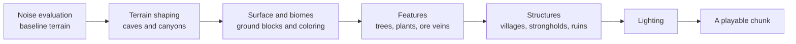

> **This chapter's thesis**: the seed's determinism is a contract with boundaries — the generator promises "same version + same seed = same world," and honors it only for chunks already generated; once the version changes, unexplored regions are reinterpreted by the new algorithm. What players experience as "an old save growing new terrain" is not a bug; it is the contract's boundary clause taking effect. If, after some version update, an old save's unexplored regions went on generating exactly as they would have before the update, this thesis would be false.

## The problem

Every veteran has run into it: carry a save from a few years ago into today's version, walk in a direction you have never been — and the terrain that grows in feels nothing like the terrain of that era. Caves go deeper, mountains climb steeper, beautiful in a way that stings. The seed never changed, yet the world has "changed generators."

To understand this, you have to see world generation as a **pipeline**: the "one world" a player experiences is not shaped in a single pass inside the machine; it is produced chunk by chunk, stage by stage, the way a line turns out a product. The seed decides the random numbers fed to every stage, while the writing of the stages themselves — the "recipe" that produces the world — is rewritten with every version. This chapter walks the pipeline end to end: how the design contract becomes implementation obligations, which stations a chunk passes through in its life, why structures (villages, strongholds) always quarrel with the terrain, and where exactly the boundary of determinism falls.

## Generation is the design contract implemented

Volume II, chapter 6 fixed the design contract for world generation: produce "qualified difference," not content (see [World Generation as Content Production](/design/worldgen)). At the implementation layer, that contract becomes three engineering obligations, and each one shapes the pipeline's form in return.

**First: any coordinate must be evaluable on its own (locality).** A player may walk in any direction, so the terrain of any one place must be computable independently, without "first finishing the whole world." This immediately rules out every global scheme (running the physics of the entire world up front, say) and forces the basic arrangement: chunks as the unit, each produced independently.

**Second: the result must be settled (reproducibility).** Same seed, same coordinates — the result must come out identical whenever it is computed; otherwise seed sharing, map tools, and speedrun verification all break at once. This forces the design in which "every random number derives from the seed": the machine has no real dice, only deterministic hashes taken from the seed and keyed by coordinate (read it as: seed as raw material, position as the recipe, pseudorandom numbers as the product).

**Third: increments on demand (lazy loading).** The world is infinite and memory is not, so only the parts that are needed may be generated — near the player first, with the distance forever left at "does not exist yet." This forces the chunk's lifecycle management, which the next section takes up.

The three obligations together fix the pipeline's outline: **cut the world into chunks, produce each independently, split the production into parallelizable stages, and trace every random number back to the seed.** Before these three obligations, chapter 6's poetic design language — "the rhetoric of infinity," "qualified difference" — is all converted into concrete engineering shape.

## Pipeline stages: one process, one world concept

Take a chunk from nothing to something and split it into the stages of the main pipeline (the details differ by version; this is the common skeleton):

**Noise evaluation**: the pipeline's first process. Taking coordinates as input, several layers of noise functions (read them as "waves of undulation" of different coarseness, stacked) compute the baseline height and density of this column — the run of the mountains and the depth of the valleys are settled here. What comes out is "raw terrain": no material yet, no life.

**Terrain shaping**: carving into the terrain. Caves, canyons, and lakes are "dug" or "filled" at this step. This is the step that most tests the contract's "qualified difference" clause — carve too regularly and it looks like a maze; carve too randomly and it looks like a sore.

**Surface and biomes**: dressing the terrain. Biomes decide here what blocks the surface uses — grass, sand, snow — and the rules that distribute climate and height take effect at this layer too. The "semantic layer" chapter 6 spoke of lives here.

**Features**: batch installation of the small fittings — trees, flowers and grass, ore veins, lakes. Their placement uses deterministic randomness: under the same seed, this tree growing here is "computed," not "stored."

**Structures**: installation of the large fittings — villages, strongholds, shipwrecks, ruins. This is the pipeline's most peculiar station, peculiar enough that the next section gives it a section of its own: because one village can span four chunks while the pipeline turns over chunk by independent chunk.

**Lighting**: the final whistle. Skylight and block light propagate through the blocky world one last time; before this step the terrain merely "is dark" — after it, it "is lit." Lighting is the player's most immediate display of engineering quality: it is the implementation site of Volume II, chapter 1's sentence "light can be computed."

What deserves a pause and some appreciation is the pipeline's **division of semantic labor**: geometry (noise), carving (shaping), semantics (biomes), detail (features), narrative (structures), readability (lighting) — chapter 6's design division of labor, translated intact into a process sheet at the implementation layer. Every noun in the design contract has a workstation on the pipeline.

## The life of a chunk: lifecycle and multithreading

The pipeline produces to order, and the order is the player's position. A chunk's life is a state machine:

**nonexistent → generating → decorating → loaded → visible → interactive**, with unloading running in reverse. The player moves; new chunks ahead enter the queue and start work according to the view distance; chunks behind are saved and unloaded, retiring from memory back to disk. Two different distance parameters govern the two segments of this line: **render distance** decides how far chunks get drawn, **simulation distance** decides how far chunks actually run (crops growing, mobs going about)[^simulation] — the two were split apart around 1.18 precisely so that "seeing far" would no longer carry the expensive bill of "computing far."

Multithreading is this pipeline's modern form. Generation is pure computation (it never touches the world the player is editing), so it can be handed to background threads to work in parallel; the main thread only receives finished goods and runs the game logic. The two stutters every player knows map exactly onto the pipeline's two bottlenecks: the judder when entering new terrain is "orders flooding in, the line at full capacity"; the intermittent stutter of long sessions is often "the decoration and structure stages queuing on the main thread." "Stuck on a chunk border," the player's idiom, is technically exact — you are stepping onto ground whose production has not finished.

## Structures and terrain: a conflict pretended not to happen

The pipeline's most awkward station is structures. The awkwardness comes from a chicken-and-egg problem: **chunks are produced independently at 16×16, while a village routinely spans several chunks.** The chunk generating a village needs to know what "its own" other half looks like on the neighboring chunk — but the neighbor may not exist yet.

The engineering answer is an ingenious reservation system: before a chunk starts work it "checks the table" — using the seed to compute whether this region holds a structure and which chunks that structure occupies — and the chunks a structure needs reserve its place in advance. The mechanism works well enough that players barely feel it exists; but its cracks are just as familiar: **the conflict between structures and terrain.** Villages generated on cliffs, houses hanging in midair over makeshift platforms; strongholds cut in half by caves; the terrain around a woodland mansion looking as if it had been forcibly ironed flat. These are the patches the reservation system never finished: structure placement and terrain shaping are two independent processes on the pipeline, and the coordination between them relies on one post-hoc "adaptation" — the structure raises its own foundation, paves its own platforms, and pretends the surrounding terrain was always cooperative.

Chapter 6 called structures "narrative told by the generator"; this chapter adds the implementation layer's plain truth: **that narrative is stitched into the world.** You have seen the stitching with your own eyes — those floating villages are the loose threads. Why not solve it once and for all? Because a real solution means coupling terrain and structures into a single integrated generation step, which sacrifices independence and performance and could destroy the reproducibility of existing seeds. Living with the patches is the most typical of all this pipeline's pragmatic decisions.

## The boundary of determinism: the seed contract's exemption clause

Now the opening question can be answered. The seed contract carries an exemption clause few players ever read closely: **determinism holds only for "the same recipe."** Same seed + same version = same world, as is only right and proper; but what a version change rewrites is the recipe itself — the noise swaps layers, the caves swap their way of digging, the biomes swap their distribution. And so, in an old save:

**Chunks already generated** (the ground you walked and changed) stand as saved data — they are part of the world file, and no recipe change can move them; **chunks never generated** (the directions you never went) will be produced anew under the new recipe — the seed is still that seed, but what grows is the new algorithm's world.

Old terrain and new meet in your save along a seam: a "version freeze line" drawn, without your ever meaning to, on some old expedition. Veterans call such a save "the seam between two worlds," and locating the line is easy — wherever the terrain style changes abruptly along a straight edge, that is where you turned back that year.

This is not a design flaw; it is the necessary price of an infinite world: nobody can maintain an old generator forever for the sake of one player's save (a compatibility burden with no bottom to it — Volume III's storage chapter and Volume IV's compatibility chapter both reckon this bill). The contract's true terms are therefore: **the world consists of two parts — a remembered past (the saved chunks) and a reinterpreted future (the ungenerated chunks).** The seed gives you determinism, the version gives you evolution, and the sum of the two is the particular nostalgia Minecraft players know best: on the old map there will always be new continents you have never seen and your memory does not hold.

Worth noting: in recent years this boundary has been opened deliberately, from the official side — experimental world-generation datapacks let players replace the pipeline's recipe itself (custom biomes, custom terrain)[^datapack-gen]. For the first time, the contract allows a signatory to rewrite the recipe sheet — Volume II, chapter 8's judgment that "data-driven design is the gentle mod" has just received its freshest testimony at the generation layer. The process that made the opening possible — development itself turned into an interface the community co-writes — has its own chapter in Volume I (see [Version Politics and the Philosophy of Updates](/history/version-politics)).

## What this chapter leaves behind

- **For players**: the seam between old and new terrain in your save is a fault line of version history — wherever it runs, that is where you once put the game down.
- **For developers**: what you can take away is contract-first method — write down, before anything else, "what randomness promises to whom" (locally evaluable, reproducible, incremental on demand), and the pipeline's structure will grow out of the obligations on its own; plus the reservation-system approach to structures that cross unit boundaries, and a clear-eyed sense of its price. What you cannot take away is the tolerance for patches: structure–terrain seams were patched for over a decade on the strength of a culture that treated the patches as scenery — that is a lesson no public-relations department can learn.

[^simulation]: Minecraft Wiki, "Simulation distance" (render distance and simulation distance are separate settings; simulation distance governs the range in which block entities, random ticks, and mobs run), minecraft.wiki, retrieved 2026-09-18: see https://minecraft.wiki/w/Simulation_distance .

[^datapack-gen]: Minecraft Wiki, "World generation" (datapacks can customize biomes, terrain, and structures; experimental world generation opened up gradually from 1.16.2), minecraft.wiki, retrieved 2026-09-18: see https://minecraft.wiki/w/World_generation .
