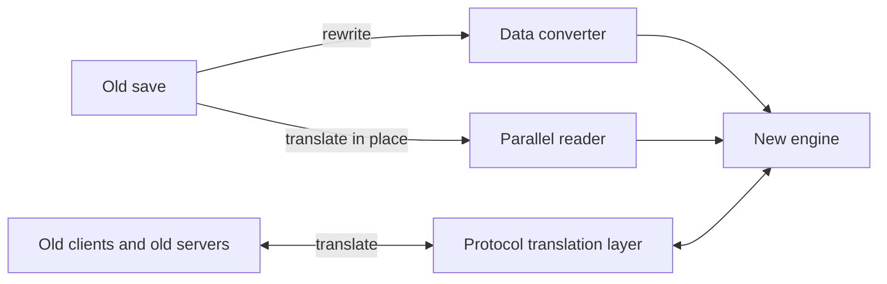

> **This chapter's thesis**: for a rewrite, reading old saves is an ethical obligation, not an optional feature — players invested their time against an established promise that "worlds do not expire," and the new engine must either honor that deposit or repudiate it unilaterally.

## The problem

The most common death of a rewrite project is not failing to write the new engine — it is that on launch day nobody can move in. A player opens the new version, drags in the world folder that has kept them company for years, and meets one of three outcomes: it will not read; it reads and the farms do not run; the farms run and the machines behave differently — the player stands before a contraption they built over three years and cannot recognize its temperament. All three outcomes lead to the same ending: back to the old version. The rewrite wins the demo and loses the population, and ends up a hardbound ghost town. Old saves and the old ecosystem are therefore the rewrite's ticket of admission; the previous chapter settled rendering and authoring tools, and this chapter handles how that ticket gets issued. Chapter 4 already seated old-save reading as the new representation's own import interface — that was the architectural position; this chapter supplies the policy. First it argues why reading old saves is an obligation and not a feature, then it designs the three channels that honor the obligation, handles the thorniest tenant, redstone, explains the door-plate discipline — the cheapest item and the least forgivable to break — and finally writes the whole bill into the product's scope.

## Player time lives in the save

Propping up the word "obligation" takes four steps, and not one of them can be skipped.

**Step one: the player's past exists in the form of a save.** What does a survival world hold after three years of play? A mountainside hollowed out by mine tunnels, a railway half-circled around the village, an automated farm harvested on schedule, a redstone clock with years of service, that bridge beside the End portal that was never finished. Added up, that is hundreds, thousands of hours of investment. A save is not a progress bar — a progress bar records only how far you have gotten; a save is a ledger — it records how much of your life you exchanged for blocks. [A Checklist of Transferable Principles](/design/transferable), Volume II chapter 16, made this principle eleven: the world must outlive the engine; Volume IV chapter 2 translated it into an invariant. What remains to add here is why, for a rewrite, it constitutes an obligation rather than a wish.

**Step two: an investment must be portable, or ownership is only a lease term.** Hand the world to a friend, move it to a new computer, upload it to a server, open it in a version ten years on — portability is not a convenience; it is the precondition for daring to invest at all. A person will spend three weekends digging a winding aqueduct to their base only because they believe the investment will still be there tomorrow. If a rewrite announces that the new engine does not read old saves, what happens is not "one feature fewer" — it is the player's banked assets being declared void unilaterally: ownership quietly turned into tenancy, and the new lease not drafted by the tenant.

**Step three: this promise was not invented by this chapter on anyone's behalf; a decade and more of accomplished fact raised it.** Java Edition today still opens saves from more than ten years ago; through every version change, the officials have never once said "old worlds have expired, please discard." Volume I chapter 13 read this "official back door for old saves" as part of the game's cultural heritage (see [Minecraft as Cultural Heritage](/history/heritage)) — server worlds carry more than personal investment; they carry a community's shared memory. Accomplished facts create legitimate expectations: players dared long-term investment precisely because they believed worlds do not expire; legitimate expectations accumulated over ten years and more constitute an obligation, even if it was never written into any user agreement. Inheriting this promise, like inheriting those code assets, is a liability signed together with the estate when the rewriter signs for the inheritance.

**Step four: from here, the criterion separating feature from obligation.** A feature's marks: it can be declined, deferred, or differentiated. Test reading old saves against each. It cannot be declined — for the installed base of players the world either opens or is locked shut; there is no middle ground of "not offered for now." It cannot be deferred — players will not pause their lives while the rewrite makes up its ticket; lock the door for three years and three years of new memories have long since gone their separate ways. It cannot be differentiated — selling old-save migration as a premium-tier selling point means charging your most loyal users a second time, and confiscating precisely their loyalty. Anything that passes all three gates is not a feature. An obligation's mark: doing it earns no credit; failing to do it constitutes harm.

How could that judgment be wrong? Three directions can falsify it. One: the obligation comes from the structure of time investment, not from a moral law as such — for a game whose rounds are mutually independent and whose investment does not accumulate across rounds (competitive matchmaking, per-round survival), reading old saves really is just a considerate feature. Two: if the product said from day one that saves are temporary, the obligation does not hold — an informed-consent change of season is not a betrayal; Volume IV chapter 2 already passed the same verdict on periodically reset server worlds. Three, and the darkest: nominally readable, effectively changed. The bytes come in, the machines no longer work as they did, the farm has become a sculpture — "can open the file" is not "can read the save." This one leads directly into the redstone section. The Minecraft family satisfies neither of the first two exemptions, so for it, the obligation stands.

## Converters and protocol adaptation

The obligation is admitted; next comes the technical shape of honoring it. What is "old," it turns out, is three different things — old data, old formats, old clients and old servers — and each corresponds to one channel.

**Channel one: the data converter — rewrite the past into the present.** When an old save loads, upgrade the data to the new format in one pass. Volume III chapter 2 ([Storage and Serialization](/impl/storage)) covered the status quo: Mojang built this mechanism as a standalone library, DataFixerUpper,[^dfu] and with every release it appends one more link to the end of the chain — "from the previous version to this one, how each kind of data changes" — and reading an old save executes the chain from the head, level by level. The famous 1.13 flattening, in which numeric IDs were replaced wholesale by namespaced strings, was this chain rewriting every player's old save in a single pass. The converter's advantage is blunt: convert once, benefit for life, and the new engine faces only one format. The cost is equally blunt: conversion is a one-way door — convert wrong and there is no way back, so the automatic backup taken before conversion is not a courtesy; it is the other half of this procedure's morality. The converter is also a history book that never stops adding pages — every data defect of every historical version must leave a patch in the library; the chain only grows, and it needs periodic compaction and merging, or loading slows for old saves and new alike.

**Channel two: the parallel reader — let the past stay the past.** Change not a byte: keep an old-format reader beside the new engine and translate inward at runtime. Advantages: old saves stay exactly as they are and can retreat at any moment; if the converter errs, there is a way back; and the two readers can cross-check each other. Costs: permanent double maintenance — every read path is, in effect, written twice; and the old reader may never be deleted — existing worlds do not retire. This channel fits the fault line of a format generational change and the transition period while the converter is still unfinished. In practice the two channels are usually combined: the reader holds the floor, and the converter annexes.

**Channel three: the protocol translation layer — saving the ecosystem, not the save.** Saves lie on disk; the ecosystem lives online. A rewrite cannot swap out every server, client, and plugin overnight, so the migration period needs a layer of translation: the new engine's server speaks the old language to old clients, and old clients join as they always did. Volume III chapter 10 covered how the protocol is the most sensitive nerve in version politics; and the community has already proven how far this road goes — the ViaVersion plugin gets new clients into old servers by exactly this field-by-field protocol translation.[^via] The translation layer's advantage: the ecosystem does not bleed out and the migration period does not fall apart. Its costs: it can translate only the concepts both sides share — old clients never see the new content, and new mechanisms degrade, in translation, to the lowest common standard; and the translation layer itself becomes a de facto standard, demanding the same freezing, testing, and long-term maintenance — it is not scaffolding to be torn down once construction ends.

The three channels, seen together:

<Note>Java Edition and Bedrock Edition saves are not interchangeable: on one side the Anvil family of chunk formats, on the other a LevelDB key-value store. For a rewrite, "reading old saves" is therefore not one obligation but two — and on the Bedrock side there is a second ecosystem, already forked, of add-ons and the official marketplace, which cannot be papered over with Java's solution.</Note>

## Redstone's two paths: the simulation layer and the new semantics

Three channels solve "getting in"; they do not solve "living as before once in." The hardest tenant is redstone. Volume III chapter 8 ([Redstone's Implementation](/impl/redstone)) left behind a dilemma: the most depended-upon parts of redstone's semantics — quasi-connectivity and the various quirks of update order — were accidents of implementation that players took as contract, and countless machines were built on them. Correct the semantics and the existing machines fail en masse; freeze the semantics and the new engine carries the entire historical baggage. Volume IV chapter 3, auditing the list of accidents, gave the demolition principle — pay off the dependence first, then demolish the structure itself — and the officials' precedent was to build a front door (the observer block's answer to the BUD). But the front door helps only players willing to rebuild; lying in the saves are countless anonymous machines whose authors may have long since left, and no one rebuilds on their behalf. To untie the dilemma, first dismantle its shared premise — that the whole world can hold only one physics.

The untangling is to demote physics from a property of the engine to a property of the world. The new engine ships with two redstone semantics, traveling with the save. New worlds use the new semantics — a deterministic recomputation order, clean signal shapes; this is where the rewrite's entire progress on redstone is redeemed. Imported old worlds are flagged as legacy physics, taken over by a simulation mode — replicating the old engine's observable behavior inside the new engine: quasi-connectivity still works, the timing quirks stay as strange as ever, and the acceptance criterion is one sentence: the old machines run exactly as before. Per this volume's discipline, what is given here is the shape of a proposal, not construction drawings.

<Alternative title="Could one physics alone suffice">

Two single paths can both be imagined. Keep only the new semantics: cleanest, no historical baggage ever again — the cost is a generational break. Existing machines fail en masse, "the world outlives the engine" defaults wholesale on redstone, and the redstone community is the first to leave — and they are precisely the people who played the physics beyond its design. Keep only the old semantics, run the simulation for new worlds too: most faithful — the cost is that the rewrite's redstone is voided forever. Every improvement the new semantics promised loses its footing, and the dilemma stands untouched. The two paths are not a compromise; they are an acknowledgment that two accounts are entered under different names: existing machines are owed the old physics, and future worlds are owed the new semantics.

</Alternative>

Two sets of semantics surviving together has three premises; lacking any one, the two-path plan comes apart. First, the physics version must be written into the save's metadata, fixed at the moment the world is opened, with no mid-life switching — switching physics equals tearing down every machine the player owns for a rebuild, precisely the injury this chapter exists to avoid. Second, the two semantics must hide behind one and the same interface; the redstone update knows the interface, not the implementation — otherwise the code grows "if legacy physics" branches everywhere, and the two paths exist in name only. Third, no cross-physics merging: chunks of legacy physics cannot be stitched into a new-physics world, and structure imports are rebuilt under the target world's physics, with an explicit warning that they may deform.

The costs must be counted even more clearly than the conditions; the two paths do not pretend to be free. First, doubled testing: every redstone-related change must be verified under both semantics, and "runs as before" requires evidence — build a specimen library of old machines, replay tick sequences, compare tick by tick; this work has no end point. Second, the simulation layer is amber: legacy physics can thenceforth only be preserved, never improved — genuine defects in the old semantics must be copied too, because they have long been part of the contract. Third, drift risk: what is replicated is behavior, not code; if the old behavior itself depended on the nondeterminism of concurrency, the simulation can reproduce only statistical behavior, and a few edge machines (old-style BUD detection and the like) may still need the player's hands-on fine-tuning — this is the simulation layer's honest ceiling. Fourth, and the longest entry: existing worlds only increase, never decrease; the simulation layer has no "done" day — it is a perpetual expense. How a perpetual expense is governed is left to the final section.

## The long-term compatibility of namespaces

One more item on the compatibility checklist costs almost nothing and is the least forgivable to break: the door plates. Volume III chapter 13 covered how every block, item, and entity in Java Edition carries a namespaced address such as `minecraft:stone`, and how mods and datapacks register under their own prefixes. A design that looks plain today is the foundation of the entire compatibility system: every cell of data in every save, every line in every command block, every recipe in every datapack, machines sealed inside structure blocks — all of them recognize one another by door plates. The string is the pointer.

Why must the new engine inherit them verbatim, and never change them? Because renaming is not refactoring — it is burning road signs. Rename one block and every cell it ever appeared in, in every save, must be rewritten; every command, recipe, advancement, and structure that referenced it mismatches; one escapee anywhere and that world can no longer be read whole. And the mistake rewriters are most prone to is exactly here: "we're rewriting anyway — might as well give the names nicer ones." The entire lesson of the door plates runs the other way: a name's value comes from its immutability, not from its prettiness. It is also the only line on the compatibility bill that gets cheaper the better you keep it: the converter pays year by year; freezing the door plates costs doing nothing, every day. Break them once, though, and the damages can never be fully reckoned.

The discipline can be written as three rules. One: names already registered under the `minecraft:` prefix only grow, never change — an old name may be pointed at a new implementation; the old name itself may not be deleted or rewritten. Two: deprecate, do not delete — content being retired receives a placeholder implementation so that loading does not explode, rather than being wiped from the table. Three: custom prefixes belong to the communities that registered them, and the new engine promises to resolve them forever — this is the formal commitment to the mod ecosystem; that dizzying compatibility matrix of Volume III chapter 12 is this course's transcript of failed exams.

<Constraint name="Door plates only grow, never change" verdict="groundwork" chain="a rename → references mismatch → saves cannot be read whole → ecosystem reset">

The namespace is the address system shared by the whole ecosystem, and an address's value stands in inverse proportion to its rate of change. On this matter a rewrite has no room to create: the more it creates, the more it pays.

</Constraint>

## Writing the costs into scope

Compatibility is not free, and the bill is not one-time: three channels, two paths, and the door-plate discipline all occupy engineering budget over the long term. They usually die in one of two ways. In the open: they are the first thing cut when the budget tightens — and nobody feels a default at the moment of cutting, because the obligation never formally appeared on the roadmap. In the dark: compatibility without acceptance quietly rots — from some version onward the converter quietly breaks a class of machine; no test intercepts it, no owner notices, until the players do — and by then what is forfeited is not just hours but reputation. Both deaths point at the same gap: the obligation was never written into the product's scope.

Written into scope, it takes the form of three documents. The first is the budget: give compatibility an explicit share of equal standing with new features, and name an owner — "everyone is responsible" means no one is. The second is acceptance: honoring the obligation has a launch gate, not an after-the-fact ticket. Write one line into the launch standard: the sample-world library passes in full — collect real saves from every era (ten-year-old formats, from before and after the flattening, packed with redstone arrays, the broken-off remains of modded servers), convert or read them, compare item by item; one item fails, no release. An obligation must be auditable, or it is only an honorific pinned to a wish. The third is the boundary: an honest promise has a horizon. Announcing "saves from after such-and-such a year are no longer officially guaranteed" is not a betrayal — a boundary drawn in advance is itself part of the promise; the betrayal is the silence afterward. Three disciplines govern the line: draw it by save format, not by calendar — formats are decidable, dates are arbitrary; leave ample notice before the line, so players have time to migrate, the way a server posts notice ahead of a change of season; and what the line downgrades should be the tier of "official conversion," not necessarily "readable" itself — the parallel reader can live on, or hand the baton back to the community the way ViaVersion does, on one condition only: do not weld the door shut.

Here the thesis can be re-examined. The full argument of "reading old saves is an ethic toward player time" is a chain of four links: the player's past lives in the save, so the investment must be portable, or the product is tenancy; portability has been promised by a decade and more of accomplished fact, so legitimate expectations constitute an obligation; and the obligation does not run on sentiment — its operable form is an engineering institution with a budget, an acceptance gate, and a boundary. Conversely, a rewrite project that can produce none of the three will only repeat the sentence "we take compatibility seriously" — a sentence that does not even qualify as a feature. It is decoration.

## What this chapter leaves behind

- **For players**: the next time you see a rewrite advertised on a "brand-new engine," ask one question first — can it open that world of yours from 2013? And once open, are your machines still running?
- **For developers**: what you can take away is the institution — three channels, two paths, door-plate discipline. What you cannot take away is the resolve to write them into the budget alongside the features and to hold the launch gate — an obligation that never makes the schedule was never acknowledged at all.

[^dfu]: Mojang Studios, "DataFixerUpper," open-source repository on GitHub, MIT-licensed, self-described as "created to convert game data between different versions of Minecraft: Java Edition"; retrieved 2026-09-18: see https://github.com/Mojang/DataFixerUpper .

[^via]: The ViaVersion Team, "ViaVersion," open-source project on GitHub, self-described as "allows the connection of higher client versions to a lower server version," implemented by protocol translation; retrieved 2026-09-18: see https://github.com/ViaVersion/ViaVersion .
