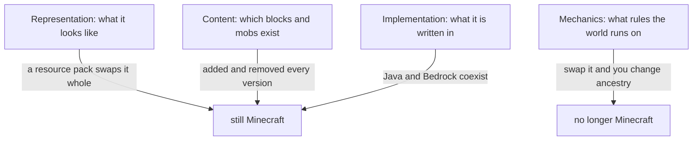

> **This chapter's thesis**: the substance of "the Minecraft feel" lies neither in representation, nor in content, nor in implementation, but in seven invariants at the mechanics layer. Any product that keeps all seven remains, in players' eyes, a Minecraft-like under any art style, any content, any codebase; and conversely, if any single one of them can be removed while the player community still recognizes the result as a Minecraft-like, that entry is falsified.

## The problem

The rewriter's first exam question is not "how to write it" but "what must not move." The previous chapter answered "what exactly are we rewriting"; this chapter steps one pace closer and asks what the thing being rewritten must, at minimum, still have left before it deserves the original's name.

The trouble is that the answer first shows up only as a feeling. A veteran needs about ten seconds to judge whether a product "has the Minecraft feel," but ask for evidence and what comes out is the art style, the blocks, some familiar sound effect. A feeling cannot be written onto an answer sheet; an answer sheet needs sentences that can be checked item by item and overturned item by item. This chapter's entire work is translating that feeling into a list of mechanics, in answer to one question: **remove which things, and it is no longer Minecraft?**

One rule before the translation. This volume is the exam, not the work order: every invariant below comes with two attachments — a concrete scenario of "what players would notice at once if it were removed," and a falsification criterion of "how this entry could be wrong." The criterion is uniform, one sentence: **if a product removed it and the player community still recognized the result as a Minecraft-like, the invariant is overturned.** The judge is the players' long-run consensus, not this chapter's a priori authority.

## Which part of the "Minecraft feel" is rules

The feeling of "like Minecraft" is actually a blend of four different things, and they must be taken apart first.

**Representation** is what it looks like: pixel textures, block shapes, that interface. Representation is plainly not the essence — resource packs have swapped stone for watercolor and mobs for paper cutouts, and players still call the result Minecraft. The skin-swap test of Volume II chapter 16 is about exactly this: the representation can be swapped whole and the product is still itself.

**Content** is what exists in the world: how many kinds of blocks, which mobs, how much bonus each enchantment gives. Content is not the essence either — every version adds things to the world, deletes things, changes things, and the community will tear itself apart over a given change, but the quarrel is over "was the change good," never "is this still Minecraft."

**Implementation** is what it is written in: which language, which architecture, which rendering pipeline. Implementation is still not the essence — Java Edition and Bedrock Edition are two independent implementations whose save formats are not even interchangeable, yet players on each side grant that the person over there is playing Minecraft.

**Mechanics** is what rules the world runs on: is space cut into cells, where does the dug-up material go, how many basic actions does the player have, who supplies the goals. Only here do we touch the essence. Swap the one-meter grid for smooth continuous terrain and mining for "press and hold to delete the object," and no matter how identical the visuals, the veteran concludes within five minutes: this is a different game that resembles Minecraft.

The four layers can be drawn as one picture:

The invariants live on the mechanics layer. But one special kind of tenant is embedded even there: implementation details the community has come to depend on — the specific number of twenty ticks per second, for instance, or redstone's famously quirky behaviors. Half mechanics, half implementation, they are not collected in this chapter; they are left for the next chapter's list of "accidents."

Last, the relation among the three lists, lest the reader think this book has issued three sets of answers that fight one another. The [twelve transferable principles](/design/transferable) of Volume II chapter 16 are **methodology**: they answer "how to think when designing products of this kind," each with its premise of application. The [five-item minimal kernel](/impl/modifiable-engine) of Volume III chapter 18 is **architecture**: it answers "which parts the engine must keep" — in Volume III's own metaphor, a one-block ledger (world data), a deterministic clock (the simulation beat), a referee (where authority lives), a form (content registration), and several swinging doors (the replaceable boundaries). This chapter's seven invariants are the **product-layer translation** of both: they answer "what must the finished product in the player's hands keep, to still deserve the name." The three lists are three views of one thing: think with the principles, build keeping the kernel, verify by counting the invariants.

The alignment can be checked entry by entry:

| Invariant in this chapter | Principle it comes from (Vol. II) | Kernel item it comes from (Vol. III) |
| --- | --- | --- |
| The one-meter grid and breakability | Two (the world is the inventory), and its premise | One (the voxel ledger) |
| The world is the inventory | Two | One (addressable, persistent) |
| The minimal verb set | One and Twelve | — |
| Goals are outsourced | Three | — |
| The physical openness of the misusable system | Four | Two (the deterministic tick loop) |
| The world outlives the engine | Eleven | One (persistence) |
| Redevelopment as a first-class citizen | Ten | Four and Five (the slots and the swinging doors) |

The two lists and this chapter do not conflict; they differ only in grain — principle two spreads into two entries at the product layer, one for the grid and one for conservation. Kernel item three (the authoritative server) has no matching invariant, because it is a purely architectural verdict that players cannot test directly from experience; its answer sheet gets submitted by Part Two's chapter on "network and authority." As for the principles that did not make the table — growth attached to things, the procedural contract, constraints are depth, modes are permissions, the social contract — they are methods for "how to do it well," not criteria for "is it still itself"; players cannot verify them at a glance, so they cannot enter this answer sheet, and each will be examined at its own place in Part Two.

## Seven invariants, examined one by one

The seven below each walk the same four beats: what it is, why it is essential, what players would notice at once if it were removed, and how this entry could be wrong.

### One: the one-meter grid and breakability

**What it is.** The world is composed of one-meter cells; every cell has an address, and almost any cell can be altered by the player — dug out, or filled with something else. [The Voxel as a Design Primitive](/design/voxel-primitive) spends an entire chapter on it; here we take only the product-layer conclusion: the grid is the game's system of measurement, and breakability is the promise made to every player entering the door — this world is yours to alter.

**Why it is essential.** Because every piece of shared language stands on it. The player is two cells tall, jumps one cell high, a torch lights seven cells — you may never have counted these numbers, but your hand long ago learned to estimate distances in cells. More important still is speech: tutorials write "leave two cells above the doorway," friends shout "fill in the cell above my head," building contests rule "height capped at thirty cells." Without cells, not one of these everyday sentences of builders could be said.

**Remove it, and** the world turns beautiful and mute at the same moment. You cannot point at a piece of terrain and say "the third cell," only "a little above that slope"; digging no longer leaves a tidy scar, alterations leave no trace, and the world becomes a backdrop no one can write on. It degenerates into a handsome exploration game: however fine the scenery, not one spot of it is yours to change, and the player slides from resident to tourist.

**How this entry could be wrong.** If a product on continuous terrain grew, spontaneously, a spatial language just as natural and just as capable of being passed mouth to mouth, and anyone could rewrite the world at will with every alteration recognized — then "must be a grid" is overturned, and the grid was only Minecraft's own historical choice, not the essence of the type.

### Two: the world is the inventory

**What it is.** The first invariant says the world can be changed; this one says where the changed-away material goes. The answer: into your inventory, and back out into the world. The block you dig does not vanish; it becomes an item that travels with you until you place it somewhere else. The world's matter cycles between world, inventory, and world again, almost never created or destroyed.

**Why it is essential.** Because it gives "changing the world" both consequence and accumulation. Mining is not deleting scenery; it is moving house. Every stone in your tower came from somewhere else, and so every stone has a history. It also quietly rewires the motive for doing things: to level this hilltop you need no reward issued by the system — the materials are themselves what you have earned, and the world is itself the ledger.

**Remove it, and** what you dig dissolves into a wisp of light, harvest turns into points, and building becomes ordering from a shop. You will no longer plan a quarrying route, because matter no longer needs hauling; you will no longer mourn a demolished house, because nothing ever belonged to anyone. What the player notices at once is that the reasons for doing things have all changed: from "what do I want this place to become" to "what does the quest tell me to do." It degenerates into a venue for consumption — destruction is a special effect, building is shopping.

**How this entry could be wrong.** If a product skipped conservation and built by point-and-order, and the player community still recognized it as a Minecraft-like without feeling that anything was missing, this entry is overturned. One clarification: creative mode is not a counterexample. Conservation is the world's default contract, and modes are only permission settings on that one and the same world; a player switching the contract off on purpose is a different thing from a design that never had the contract at all.

### Three: the minimal verb set

**What it is.** The player's basic actions can be counted on one hand: move, dig, place, craft, attack, plus a little periphery. Expressiveness comes not from many actions but from combination: the same dig is gathering in survival, cutting a window in building, wiring in redstone, and on a multiplayer server maybe demolition, maybe self-defense.

**Why it is essential.** With few verbs, the rules interlock tightly, the player can carry the whole grammar in memory, and attention goes entirely to "combining" rather than "operating." Volume II called it depth from combination: a handful of rules bears all of the gameplay. A veteran can chat while building a house precisely because those few actions in the hands long ago stopped needing to pass through the brain.

**Remove it, and** every new system adds a panel of buttons, a resource bar, a sheet of keybinds. Each time you come back you relearn the menus, and gradually you find that what you have mastered is not the world but the interface. The ugliest signal shows up at version updates: the change happened in a menu rather than in the physics, what you learned no longer matches what the person next to you holds, and the community's shared language slowly shatters. It degenerates into a pile of systems with separate functions, each with its own tutorial, none of them talking to one another.

**How this entry could be wrong.** Strictly speaking, what is easily falsified is the phrasing "few enough to count on one hand," not the judgment behind it. If a product had visibly more verbs yet the rules still interlocked, the community still finished its teaching by word of mouth, and gameplay beyond the design still grew, then the invariant should be rewritten as "rules must interlock and their total must fit inside a player's head," not "verbs must be very few." The phrasing can die; the judgment need not.

### Four: goals are outsourced

**What it is.** The game does not hand you a quest list. It supplies environmental pressure — night falls, the body hungers, monsters roam the wilds — and a short string of advancements, but "what to play this session, and where done counts as done" the player brings. The officials supply verbs and physics; the player supplies goals and story.

**Why it is essential.** A world can be "lived in" only if it belongs to the people who supply the goals. Once goals are issued by the system, the world is demoted into a level, and a level's fate is to be cleared and discarded — finish-and-forget is exactly what the book's thesis stands against. Goal outsourcing also makes one and the same world ten thousand different games for ten thousand people: some tame animals, some build cathedrals, some build computers out of redstone, and the world itself need not patch for any one preference.

**Remove it, and** you enter the game to find quests hanging in the corner of the screen: build five houses, restore the village to the blueprint, escort the caravan. Everything you build bears a task's receipt, and free building is demoted to errand-running. Worse is the sense of an ending: the night the checklist is finished, the game suddenly "has nothing left in it" — the designer used up your "why" for you before you had learned to find your own. It degenerates into a quest-driven game wearing a sandbox's clothes.

**How this entry could be wrong.** First, an obvious rejoinder: the vanilla game itself has advancements and an Ender Dragon — does that breach the contract? No: they are signposts, not contracts. Killing the dragon brings no curtain call, no credits roll; the world keeps running, and your half-finished house is still there waiting. The real falsification condition follows: if a product shipped with strong goals and a strong through-line, yet after the ending the world still opened outward with the same gravity — no settlement, no clearing of the stage, long-term investment still recognized — then "no goals allowed" is overturned, and the invariant should be restated "no endings allowed."

### Five: the physical openness of the misusable system

**What it is.** The world's physics serves no official list of sanctioned play; it is a pile of parts that can be taken apart and recombined: signals, wires, switches, fluids, light. [Redstone: Physics as Programming](/design/redstone) covered this system's every strange temperament: the officials gave components, not instructions, and players used them to build doorbells, automatic farms, and eventually machines that do arithmetic. Volume III chapter 5 supplied the ground it stands on — the deterministic tick loop: the same input always yields the same result; slow, but never chaotic.

**Why it is essential.** The middle clause of the book's thesis — "play beyond its design" — is wagered entirely here. If every component responded only to the scenarios its designer imagined, "beyond the design" would have nowhere to happen. Not one of the machines redstone players are proudest of appears in any official manual; they exist precisely because the physics promises rules, not uses.

**Remove it, and** the redstone components remain, with thicker manuals: a torch lights only the scenes torches are meant to light, a repeater works only inside officially preset chains. You rig up a crooked new circuit and it does not error, does not short — it simply does not respond, because your use of it was never defined. In that moment you understand with perfect clarity that your creativity requires official approval in advance. It degenerates into a set of unrelated minigame mechanisms, with creativity fenced inside officially sanctioned combinations.

**How this entry could be wrong.** It can be overturned from two directions. One: a product officializes every component's uses so that none can be repurposed, and the community still recognizes it as a Minecraft-like — void. Two: a product's physics is equally open yet does not rest on a deterministic beat — a fully asynchronous simulation, say — and the community still settles into reliable engineering; then the foundation claim "must be deterministic ticks" is falsified. Whether open physics must stand on a deterministic clock is exactly the kind of question only such a counterexample, grown in the wild, can answer.

### Six: the world outlives the engine

**What it is.** The save belongs to no version. However many rounds of internal restructuring the engine has been through, the world you started five years ago still opens today, and you can keep building in it. Volume III called compatibility an ethics toward the player's time; Volume II listed it as principle eleven. At the product layer it is one sentence: your world is not voided by an official update.

**Why it is essential.** Dwelling has a time axis. The only reason you will plant a tree that fruits in thirty days, raise a cathedral that takes a month, or lay a winding railway through the mountains is that these investments will still be there tomorrow. "Living in" is a long-term verb; where the world can be zeroed at any moment there is only camping, never dwelling.

**Remove it, and** the major update pops a notice: old worlds incompatible, please start over. The first time you replay in earnest; by the third time you have learned your lesson — no more planting trees, no more long roads, no more naming buildings. The bond between player and world is not weakened; it is severed. You slide from resident to tenant, and the kind of tenant who never intends to renew the lease. It degenerates into a sandbox with an expiry date; servers, family saves, and worlds handed down across a decade would never even become possible.

**How this entry could be wrong.** The criterion lies not in "is the world eternal" but in "can it be voided unilaterally." Plenty of long-running servers keep a tradition of periodic world resets, and their communities thrive all the same — that is the residents' informed consent to a change of season, not a landlord picking the lock at midnight. Only if a product voided old worlds unilaterally on every update, and players still recognized it as a Minecraft-like and kept investing long-term, would this entry be overturned.

### Seven: redevelopment as a first-class citizen

**What it is.** Modifying the world, adding content, rewriting rules — not a grey zone but a declared part of the product: Java Edition's mods and datapacks, Bedrock Edition's add-ons, plus the command system both editions share, all running through the regular channels of official registration and official loading. The officials monopolize physics and cede gameplay legislation to the community layer by layer — Volume II chapter 13 called it the mod method, and Volume III delivered its feasibility proof with two kernel items, the slotted data plane and the replaceable boundaries.

**Why it is essential.** It is the direct redemption of the thesis's third clause — "redeveloped through mods and servers" — and the insurance policy on the first six: the first three make the world modifiable, this one makes the rules modifiable. It also decides where the product's right of definition flows: whoever you allow to rewrite the rules is whoever you allow to define what the product will become. Volume III chapter 18's two thought experiments already showed it: a client that cannot be redeveloped is a show home, and the redevelopable composite is what holds the product's future.

**Remove it, and** you want an elevator, wait for the officials; you want a new mob, wait for the officials; you want survival harder, wait for the officials. The community's entire creative output exists only as videos and screenshots, never arriving in your hands as playable content. The product may remain excellent, but it is a finished good — and a finished good has exactly one road left: waiting to go out of date.

**How this entry could be wrong.** Of the seven, this one is likely the hardest to overturn: in community usage, "Minecraft-like" almost naturally carries a question inside it — can it take mods? The criterion stands regardless: if a fully closed product, offering no channel of redevelopment whatsoever, were recognized by players over the long run as part of this family, the entry would be void.

<Constraint name="The seven invariants, tallied" verdict="groundwork" chain="grid → conservation → verbs → goals → physics → persistence → slots">
The seven are not seven switches in a row; they are one chain. The grid gives change a unit; conservation gives change accumulation; the verbs give change a grammar; goal outsourcing gives change an owner; open physics gives change its surprises; a long-lived save lets change be remembered; open slots let change exceed official imagination. Pull out any one link and the neighboring links lose their support at once — which is also why imitators' failures collapse in whole swathes, rather than missing exactly one tile.
</Constraint>

## What this chapter strikes off

The previous section drew the seven inside the circle; this section is responsible for everything outside it. If the outside went unnamed, rewriters would treat nostalgia as an obligation and enshrine every familiar thing onto the list. The following are explicitly struck off by this chapter — and struck off means: remove them, and it is still Minecraft. The arguments come in the next chapter; here, only the roll call.

- **The pixel art style and that set of sound effects.** Representation-layer goods; resource packs have swapped the layer whole, round after round — the case law is thorough.
- **Specific content items.** Creepers, endermen, the exact numbers on a given enchantment — all content layer. The community will grieve; grief does not change the layer.
- **Java itself.** Bedrock Edition is not written in Java, and no player refuses it the name on that account. Which language to write in is implementation's business.
- **The number of twenty ticks per second.** Determinism is the essence; the number is not. The specific value "twenty" belongs to the accidents the next chapter examines.
- **Special-case behaviors.** Implementation quirks the community has depended on for years, quasi-connectivity among them, were judged by Volume III to be "debts converted to assets." But an asset is not an invariant: remove them and Minecraft is still Minecraft — the redstone community would simply be the first to protest. Assets must pass the security check; they need not enter the list.
- **The two editions' coexistence.** That is distribution history, not design.

The four-layer model shows its second use here: it tells you not only which layer the invariants live on, but which layer every "hard-to-part-with thing" lives on. Whatever lives on the representation layer can be swapped; whatever lives on the content layer can be added or removed; whatever lives on the implementation layer or the boundaries is handed to the next chapter; only what lives on the mechanics layer enters this chapter's list. The next chapter takes custody of everything struck off and examines it piece by piece: why it can be thrown out, and who must be compensated for what when it goes.

## What this chapter leaves behind

- **For players**: "the Minecraft feel" now has seven clauses you can take and check against — the next time someone says a game "only copied the skin," ask them which of the seven are missing.
- **For developers**: what you can take away is this list with its falsification criteria, and the method behind it — sort into four layers first, then talk about what to keep; what you cannot take away is the discipline that held all seven true at once, with not one official release in over a decade betraying any single one of them.
