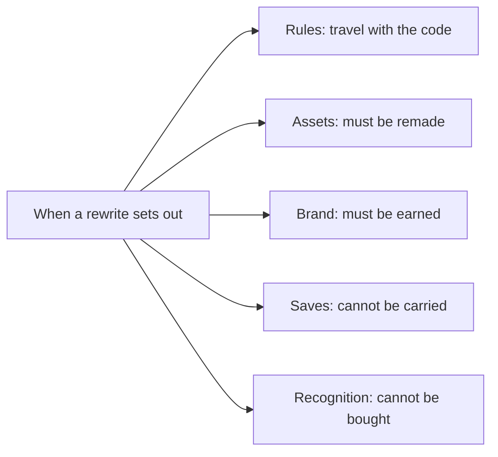

> **This chapter's thesis**: no single party can promise a rewrite whole — community projects lack the assets and the long term, the officials lack the motive, the open-source community lacks the saves and the recognition; and whether a rewrite counts is judged not by "more alike" but by whether those few invariants still hold.

## The problem

The preceding chapters examined their questions all the way down, and the technical volume has handed in its answer: it can be rewritten. The data model stands up, the beat can be carried over, the protocol can be accounted for, rendering has a road to follow. From the engineering angle, "can it be rewritten" has an answer, and the answer is a hopeful "yes."

But "can it be done" and "may it be done" are two questions. The first asks whether it is technically achievable; the second asks whether the rules and the ethics allow it. Half of the second question is legal: may the behavior rules be followed? May the textures be taken? May the name be used freely? The other half is ethical: even if the rules allow it, what has a rewrite project promised its users — and which of those promises can it actually keep?

This chapter says what can be said clearly. First it takes apart the thing being rewritten into three pieces — protocol, assets, brand. Then it divides the doers into three subjects — community projects, the officials, the open-source community — and the users into three kinds — mod authors, server owners, educators. Then it inventories, party by party, what each side can promise and what it is fated never to promise. The whole chapter answers a single question: **who can promise what?**

First, the ugly part, up front:

<Note>This chapter is not legal advice. It discusses boundaries of capability and the scope of promises; it does not answer whether any particular course of action is lawful in any particular jurisdiction. For practical questions of copyright and trademark, consult a professional.</Note>

## Three things that must not be conflated

Conflation is the source of every muddle at this layer. Behind the sentence "I rewrote Minecraft" may hide three entirely different undertakings, and they have to be taken out one at a time. What follows describes common practice and public guidance only; it constitutes no legal judgment.

### The protocol: the rules of how the world runs

The protocol is the behavior rules: what drops when you dig away a block, what happens when water meets lava, how far a single torch carries light, what the client and the server say to each other. It is the set of conventions governing "how this game runs."

The protocol has one special property: it lives in the effects, not in the files. Watch a player dig a piece of stone, watch water flow into a pit, and most of the rules can be reverse-engineered. This is exactly why the preceding chapters of this volume dared to examine it piece by piece — the rules can be observed, understood, and reimplemented.

### The assets: textures, sounds, and the code text

The assets are the concrete expression: the texture on the top of a grass block, the sound of a chest opening, every mob's model — plus one item easy to overlook, the code text itself. A concretely written code file is likewise protected expression, even if what it describes is rules.

Set the protocol beside the assets and the difference is immediately clear. You may write your own light propagation whose resulting behavior matches the original exactly — that is reimplementation of the rules. You may not bundle the official texture files into your own distribution — not even a single one, even with "original artwork from the original game" noted beside it. The former redoes "how it runs"; the latter hauls off "what someone else drew."

### The brand: the name and the public recognition it points to

The brand is trademark plus public recognition. The name "Minecraft" is itself trademark-protected — and so is the public impression accumulated behind it over twenty years: what surfaces in people's minds when those characters are spoken is no small matter. The official usage guidelines for players and creators state plainly that third-party products must not use "Minecraft" as a primary name or title, only as a secondary name or descriptor.[^usage]

In everyday discussion, the confusion runs in both directions. One sort assumes that replicating the protocol gets you everything, and so bundles the official textures and ships under the original name — running headlong into two of the three locks at once. The other sort assumes that because even the name is protected, the behavior rules must be locked too, and concludes that rewriting is hopeless — when in fact the first lock never locked the rules. Take the three things apart and both roads come into view: the rules can be redone, the expression must be self-made, the name must be newly chosen.

The three things can be verified separately. A project that replicates the protocol exactly can put you on a server whose behavior is identical — but it cannot call itself Minecraft, and it cannot bundle the official textures into its installer. Conversely, the officials hold every asset and the entire brand, and still cannot stop anyone from writing a block world with similar rules. Three locks, three keys — they never locked the same door.

## What the three subjects can promise

### Community projects: code yes, assets no, the long term unlikely

What a community rewrite project can promise is code and rules: its own implementation, its own textures, its own license terms — all in writing, all checkable.

What it cannot promise is, first, the assets: the official textures and sounds are not its to use, and every scrap of presentation material must be remade from scratch. Then, the long term: a volunteer project's lifespan follows its maintainers' enthusiasm, and when the enthusiasm goes, the updates stop — the promise of "long-term maintenance" carries no penalty clause, because it can never be written into a contract. Even save compatibility hangs by a thread: the world format is its own invention, the project stops, and the worlds in players' hands become a fresh batch of unopenable archives.

Common naming practice falls in this section too: clone projects almost all avoid the name "Minecraft" and prefer to mint their own. This is not an order handed down by anyone; it is a sense of boundary proven again and again across twenty years.

### The officials: they can promise anything — except that they have no motive

The officials are the only subject holding all three things: the protocol they understand best, the assets they own outright, the brand is theirs to say. On "the right to rewrite" they rank first — and they have the least motive of anyone. A rewrite means interrupting their own most valuable continuity: versions succeed one another, and players' saves, mods, and servers are all wagered on this timeline that must not break. Asking the officials to rewrite Minecraft is a little like asking the post office to rewrite the address system — its greatest asset is precisely that the addresses never changed.

It is not that the officials have never rewritten. Bedrock Edition is a complete rewrite the officials themselves once performed: a new implementation from the ground up, assets and brand carried over whole, the two editions coexisting to this day. That rewrite happens to confirm this section's judgment — when the officials move, they can carry all three things across; they simply rarely feel the need to carry them a second time.

### The open-source community: rules can be copied, recognition cannot

What the open-source community can promise is that the rules are copyable: the code is public, anyone may take it, modify it, redistribute it, and the rules travel with the code. What it cannot promise is, on one end, the saves, and on the other, the recognition — the next section takes those up. Here, one ready-made footnote: in 2024 the long-running open-source project Minetest renamed itself Luanti, and the official blog said outright that the old name was often read as "an imitation of a certain well-known game," while the project is in fact an engine.[^luanti] The rules it wrote itself long ago; the shadow cast by the name followed it for over a decade — the brand does not travel with the code, and a reputation has to be earned for oneself.

Set the three ledgers side by side and the conclusion surfaces on its own:

<Constraint name="No rewriter with full powers" verdict="groundwork" chain="community projects have code, lack assets, can barely secure the long term → the officials have everything except the motive → the open-source community has rules, lacks saves and recognition → promises are fated to be scattered across subjects, and any claim of 'I have it all' deserves one extra question" />

## The different needs of three kinds of users

Whoever a rewrite is staged for decides whom it courts; and whoever it courts, it fatedly loses the others.

**Mod authors** want interface stability. What they have staked is hundreds of lines of code and years of maintenance, on the bet that "next year my mod still runs." Their first question about a rewrite is not "how alike" but "does the interface change" — change the interface, and the entire mod ecosystem depending on it goes back to the workbench. The deepest offense a rewrite can give this group is the phrase "tear it down and start over" itself.

**Server owners** want performance and governance tools. What they have staked is a service that cannot stop once started: hearing players' appeals by day, backing up world files at midnight — and when a plugin breaks, the forum fills with a queue of complaints. For them, "more like the original" is worth nothing, and "one fewer outage" is worth a fortune. A rewrite with identical behavior that stutters into a slideshow at peak hours is out with them on the spot.

**Educators** want control and compliance. A classroom is not a public server: it needs a whitelist, it needs to govern what students say to one another, and it needs to explain to the school and to parents where the data lives and who can see it. An open-source rewrite holds a natural appeal for them — everything is auditable; but the boundaries of assets and brand cannot be skirted all the same: decking a classroom out with someone else's drawn material steps on the same line as a commercial company profiting from it.

Three groups, three wagers, mutually incompatible. Court the mod authors and you carry the baggage of interface compatibility, changing as slowly as an old ship; court the server owners and you bet the entire budget on performance, cutting interfaces at will; court the educators and you pile on controls, and the mod authors protest first. **Whoever a rewrite courts, it loses the others** — and the one that tries to court everybody usually courts nobody.

<Alternative title="Rewrites that do not aim at 'the whole of Minecraft'">The three user groups have each bred more focused rewrites: server implementations chasing performance and nothing else, controlled builds facing the classroom and nothing else, compatibility layers keeping one mod ecosystem alive and nothing else. They give up "alike in everything" and answer for one group's wager only — and they often live solidly. The full-fidelity rewrite is not the only honest choice; focus is honest too.</Alternative>

## The limits of open source

Return to the most common line of all: "The code is open source — what's left that can't be copied?" The answer: there is some, and it is exactly the two heaviest things.

The first is the saves. Open source copies the rules, and the rules travel with the code — but the worlds accumulated over twenty years do not travel with the code. Volume I's chapter on cultural heritage ([Minecraft as Cultural Heritage](/history/heritage)) put it on the record: versions have their rescuers, while **the large-scale archiving of servers and mods remains, to this day, nearly blank** — a server's most valuable possessions were never the world files; they were the people online together at the same time. The files can be copied; the society cannot. A perfect open-source rewrite, opening a 2012 server save, is every bit as helpless: the mods of that year cannot be rounded up, and the players of that year cannot be called back. It got the engine; it did not get those twenty years.

The other is the recognition. The judgment "this is Minecraft" lives in no code repository; it lives in the player community's long-run consensus — Volume IV chapter 2 wrote that judge onto the answer sheet. A repository can be forked into a copy; recognition cannot be copied: Luanti spent a decade and more getting "it is not a knockoff" generally accepted, and the price it paid was precisely giving up a name that rode on the original. A new name has to be worn familiar, and new trust has to be accumulated one session at a time — and a service that hosts code can deliver neither.

What a rewrite can carry away when it sets out, and what it cannot, drawn as one list:

Of the five items, only the first is open source's free gift. Of the remaining four, one takes hands-on work, one takes money and time, and two take years.

## The acceptance standard: the invariants still hold

The last question is acceptance. A rewrite project is finished — by what right is it called a success?

The most common answer is "more alike": the pixels closer, the blocks more convincing, even the crafting table's grid faithfully reproduced. That standard is precisely the one that cannot stand, and Volume IV chapter 2 has already falsified half of it: the representation can be swapped whole and the product remains itself — resource packs swapped stone for watercolor and nobody stopped recognizing Minecraft; conversely, a screenshot can fool a veteran for five seconds, and if the mechanics have gone crooked, five minutes exposes it. "Alike" was always a property of the skin. "More alike" also has one practical advantage: it can be accepted by screenshot — post one and harvest the applause — while the invariants take dozens of hours of play to verify. The low standard runs fast not because it is right but because it is cheap.

The real acceptance standard is whether those seven invariants are still there. The one-meter grid and breakability, the world is the inventory, the minimal verb set, goals are outsourced, the physical openness of the misusable system, the world outlives the engine, redevelopment as a first-class citizen — [chapter 2's list](/rewrite/invariants) writes out, entry by entry, what happens when each is removed and what players would notice at once. The sign of a successful rewrite is not a screenshot that fools a veteran; it is the veteran playing some new play the original never had, and saying: "this is what Minecraft was supposed to be."

Beyond the product layer there is the architecture layer. Volume III's close ([An Engine That Can Be Modded Is the Complete Product](/impl/modifiable-engine)) left five minimal kernel items — a ledger, a clock, a referee, a form, several swinging doors — and of them "the world outlives the engine" is the most lethal for a rewrite: if your rewrite leaves old saves unopenable, you have killed with your own hands the very thing you most owed protection. A qualified rewrite hands in two answer sheets at once: the kernel stands up, and the invariants can all be counted.

<Constraint name="Acceptance counts the invariants" verdict="groundwork" chain="a screenshot fools a veteran for five seconds at most → mechanics gone crooked are exposed in five minutes → the seven invariants are audited one by one → only passing earns the right to inherit this play, even if legally the name is never used" />

This also explains why the chapter never once answers "should it be rewritten." This volume is a thought experiment, not a work order: taking the promises apart and counting the invariants is so that anyone may first see clearly, before ground is broken, what contract they are signing — what is promised, what is given up, and by what the result will finally be accepted. Having seen clearly, then decide; to do or not to do, either way is clear-eyed. Start without seeing clearly, and the product usually wants all three things and ends up holding none of them fast. As for what this exam is finally for, the book's closing word ([Rewriting to See the Original Clearly](/rewrite/seeing-the-original)) gives the answer: a rewrite is not the building of a substitute — it is seeing the original through.

## What this chapter leaves behind

- **For players**: the next time you see "a perfect replica," count three things first — of protocol, assets, and brand, which has it promised? And the two it lacks — how does it plan to make them up, or does it never plan to at all?
- **For developers**: what you can take away is this promise list — before ground is broken, write down which promises you can make and which you give up, and accept by counting invariants, not similarity. What you cannot take away is other people's unmade promises, counted into your own budget.

[^usage]: Mojang Studios, "Minecraft Usage Guidelines" (usage guidance for players and creators), minecraft.net, official website, online documentation, retrieved September 2026; see https://www.minecraft.net/en-us/usage-guidelines . The guidelines state expressly that third-party products must not use "Minecraft" as a primary name or title, only as a secondary name or descriptor.

[^luanti]: The Luanti Team, "Introducing Our New Name," official Luanti blog, October 13, 2024; see https://blog.luanti.org/2024/10/13/Introducing-Our-New-Name/ . The post explains the reason for the rename: the old name "Minetest" was often read as an imitation of a certain well-known game, while the project is in fact a voxel game engine.
