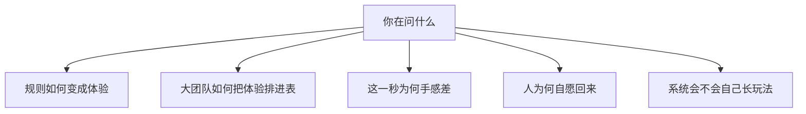
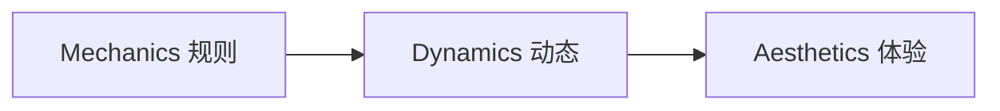

> **本章命题**：专业理论是透镜，不是定律。先问自己在分析什么，再选词；把它们当成可替换的「正确理论」，分析会先错在选工具。

## 问题

有人看完一晚上的生存录像，评论区写：「这游戏没有设计，全靠玩家自己玩。」另有人在设计课上说：「Minecraft 没有难度曲线，也进不了心流通道，所以它是玩具，不是游戏。」

两句话用的词都像专业。两句话都把工具当成了判决。

「没有设计」通常只是没看见关卡作者写好的第二幕。心流通道来自心理学，本来就不是「好游戏」的充分条件。把它们叠在同一句里，会得到一种干净的误判：凡是目标外包、节奏由玩家自己派的系统，都像还没做完。

本篇是番外，不承担三卷的证明。正编已经用玩家可观察的场面去钉：创造不是关卡编辑器，涌现是约束下的必然，深度来自穷规则而不是内容量。这里要做的更窄——把业界和学界常用的那几套词摊开，说明它们各自回答什么问题，以及拿去读 Minecraft 时会在哪一格卡住。

可被证伪的说法是：只要掌握一套「最专业」的理论，就能判断所有成功的游戏。只要 *Rayman Origins* 仍是 Rational Game Design 的样板，而 Minecraft 仍能在同一套评分表上不及格、却被一代人住进去，这句话就不成立。工具会在它照不见的地方说谎。

<Cards>
  <Card title="体例与方法" href="/prelude/method" description="正编的口径：现象开篇，判断要能被存档砸穿。" />
  <Card title="留白与涌现" href="/design/emergence" description="目标不在软件里。理论若要求主线，会先判错。" />
  <Card title="约束即深度" href="/design/constraints" description="不真实的物理往往更好玩。停手尺在加动词还是加菜单。" />
</Cards>

## 透镜不是定律

游戏设计没有像物理学那样的统一理论。课上和工作室里传来的，多半是三种东西叠在同一个抽屉里：

- **分析词汇**：帮你把「玩起来怎样」拆成可讨论的层。MDA 是这一族的代表。
- **生产方法**：帮大团队把体验拆成可排期、可打分、可辩护的参数。Rational Game Design 是这一族的代表。
- **动机模型**：从心理学进口，解释人为什么愿意继续。心流、自我决定理论走这里。

三种都能专业。三种不互相替代。把生产方法拿去当存在证明，会把沙盒读成做坏的平台跳跃；把动机模型拿去当关卡表，会把发呆盖房子读成掉出通道；把分析词汇拿去当功能清单，会在策划案里写「请增加两种 Aesthetics」。

<Constraint name="透镜不是定律" verdict="地基" chain="场面 → 问题 → 选词 → 找反例">
先钉住你见过的一幕，再写出你在问的那一句，然后才选词。选完必须再问：这套词解释不了什么。解释不了的那一块，往往才是 Minecraft 的骨。
</Constraint>

更早的玩理论——Huizinga 的魔圈、Caillois 的竞争与狂放、Suits 的「自愿去克服不必要的障碍」——不是关卡手册。它们给后面所有透镜垫底：玩是自愿的，规则是额外的，障碍可以是自己找的。Minecraft 里「不用命令方块、自己挖」，很贴最后一句。贴，不等于能从这句话推出红石该不该修准连接。哲学给许可。正编给机制。

<Note>
本篇列的是分析用的词。正编的口径仍然是现象开篇、可被资深玩家证伪。理论不能代替存档。存档不能代替选对词。
</Note>

## 先问问题，再选词

同一款游戏，问题不同，该用的词就不同。把「这游戏好玩吗」当成唯一问题，所有理论都会被拧成星级评分。

| 你真正在问的 | 更合适的词 | 拿去读 Minecraft 时容易错在 |
|---|---|---|
| 改这条规则，玩家会感到什么？ | MDA、二阶设计、元素四元组 | 把八种乐趣当成功能清单 |
| 新手夜、教学、难度该怎么排？ | Rational Game Design、心流 | 把目标外包判成宏观心流失败 |
| 挖和放为什么「手感对」？ | Game Feel、技能原子、动词 | 把手感写成皮肤，漏掉格子的时间形状 |
| 人为何愿意住十年？ | PENS、Koster 的模式掌握 | 用胜任感解释完，漏掉自主 |
| 刷怪塔、冰道从哪来？ | 涌现、内部经济、系统式设计 | 写成作者藏关，或写成没有设计 |

<Steps>
  <Step>

### 钉住一个场面

不要从「这游戏有没有设计」起笔。从你见过的一幕起笔：第一晚、悬空的家、红石门没亮。场面是证伪装置。理论若解释不了这一幕，先怀疑词，再怀疑游戏。

  </Step>
  <Step>

### 写出你在问的那一句

是在问规则如何变成感觉，还是在问难度该怎么排进表，还是在问人为何愿意继续住。一句问不清，就先别选词。选词是为了让下一句可被拆穿，不是为了给评论区镀金。

  </Step>
  <Step>

### 找这套词解释不了的反例

透镜的价值在它照得见的地方，也在它照不见的地方。RGD 解释不了发呆盖房子；心流解释不了观看别人的世界；MDA 的八种乐趣解释不了为什么同样的乐趣在别的沙盒里没长成媒介。照不见的那一块，写进判断里。

  </Step>
</Steps>

## 规则如何变成体验

这一族解决的是沟通：策划、程序、评论者说「玩法」时，常常不在说同一层。

**MDA**（Mechanics–Dynamics–Aesthetics）把游戏拆成三层。Mechanics 是规则、数据、算法，设计者能直接改。Dynamics 是玩起来之后，系统和玩家互相作用长出来的行为。Aesthetics 是玩家的情绪反应。Hunicke、LeBlanc、Zubek 2004 年的论文把它写成正式词汇，源头是 GDC 的设计与调参课。[^mda]

关键不是三个英文词，是**箭头方向**。设计者从规则走到体验；玩家从体验走回规则。你改不了「感觉」，只能改规则，再观察涌现。

玩家的阅读顺序反过来：先感到什么，再看见模式，最后才碰到底下的规则。所以「增加乐趣」不是在表上加一项 Aesthetics，是去改能长出那种动态的规则。LeBlanc 还列过八种乐趣：感觉、幻想、叙事、挑战、社交、发现、表达、服从。清单有用，当配方会设计出「每一种都来一点」的拼盘。

MDA 后来被补过两次常见的亲戚。**DDE**（Design–Dynamics–Experience）抱怨 Mechanics 太宽、Aesthetics 太窄，把界面、叙事、技术收进 Design，把体验从乐趣类型里放开。[^dde] Jesse Schell 的 **元素四元组** 则把 Mechanics、Story、Aesthetics、Technology 画成互相咬合的四块——MDA 几乎不谈技术和叙事，四元组把这两块拉回来。Schell 真正好用的往往不是四块本身，是配套的百镜：一串具体的提问，而不是一条定律。[^schell]

和 MDA 同一家族、但对沙盒更咬合的，是 Salen 与 Zimmerman 的 **二阶设计**。设计者设计的是规则，玩家产生的是玩。所谓有意义的玩，是行动与结果之间要有可辨认、可被带进下一决定的关系。[^rop] 你控制不了玩家会玩成什么样，只能控制规则会奖励什么、惩罚什么、对什么沉默。沉默也是设计。正编把目标外包写成地基，用的就是这一种结构，而不是 MDA 的八宫格。

Doug Church 更早的 Formal Abstract Design Tools、Tracy Fullerton 的形式元素与戏剧元素、Playcentric 的反复试玩，都是同一抽屉里的课上方法：给词，逼你把「好玩」说清楚，然后去做能玩的原型。它们不负责解释为什么 Minecraft 没有第二幕仍然成立。

<Callout type="warning" title="不要在策划案里写「请增加 Aesthetics」">
Aesthetics 是结果。你能改的是 Mechanics。Dynamics 只能被观察、被调，不能被直接安装。把三层当成三张功能表，MDA 会先在你手里坏掉。
</Callout>

## 大团队如何把体验排进表

**Rational Game Design** 是育碧内部方法。公开文本里，它常和 *Rayman Origins*、关卡教学、可读性、微观心流与宏观心流绑在一起。[^rgd] 名字听起来像在宣布别的设计都是非理性的。它实际做的更窄：把机制拆到不能再拆的原子参数，给难度、信息密度、多样性打分，再排「这一秒的手感」和「整关的学习曲线」。大团队、高预算时，它首先是风控——让「这一关为什么这样」可以被辩护，而不是只存在于某个关卡设计师的手里。

它擅长的游戏，教学顺序清楚、失败可立即读、挑战可以按表抬升。平台跳跃是它的主场。任务结构清楚的动作冒险也常请它来管节奏。

它不擅长、也不该被当成宪法的，是高度涌现的沙盒。参数表填不满「玩家自己发明目标」。宏观心流假定：技能在涨，挑战必须跟着涨，否则掉进无聊。Minecraft 允许你在学会挖之后，连续三个月只盖屋顶。按表，这是掉出通道。按居住，这是通道本身。

**Rational Level Design** 是同一家族的关卡侧写法：用表管关卡难度和教学节奏。许多工作室口头上的「设计支柱」，则更轻：先钉三句「这游戏是什么、不是什么」，后续功能拿支柱过滤。支柱不是理论，是对齐工具。Barwood 与 Falstein 的 400 Project、Björk 与 Holopainen 的设计模式，是启发式清单：分析现成游戏很顺，直接当配方会做出正确但没有空隙的东西。

<Alternative title="若只用 Rational Game Design 读 Minecraft">
你会得到一份看起来很专业的差评：第一晚信息过载，重力例外不可读，没有按技能原子展开的教学关，宏观心流在创造模式里直接断裂。差评里有真问题——新手确实会懵，Java 与 Bedrock 的战斗手感也确实分叉成两套难度。差评丢掉的是合同：这套系统把「今晚干什么」写在玩家手里。把合同误读成没做完的关卡表，你会建议补主线、补必做第二幕、补更光滑的难度坡。补完，得到更好卖的内容游戏。居住会塌成通关。
</Alternative>

Java 与 Bedrock 还把「排进表」这件事拆成两套账。同一套 RGD 表填 1.9 之后的 Java 战斗和 Bedrock 的战斗，填出来的难度曲线不是一张。红石的准连接只活在 Java 一边，涌现的教学更无法跨产品线共用一份宏观心流。删掉句中的「Java」或「Bedrock」，关于「新手该在第几晚学会什么」的句子对另一边就不成立。理论若假定只有一个玩家、一种手感，会在分叉口说空话。

## 这一秒为何手感差

这一族把镜头拉近到输入和反馈。

**技能原子**是 Daniel Cook 的说法：最小可玩单元是心智模型 → 行动 → 反馈 → 更新模型。原子串起来成为技能链。掌握完就无聊，所以要持续给新模式。[^atom] Raph Koster 的《A Theory of Fun》是同一家族：乐趣来自模式掌握。用它看工具进阶很顺——木镐到铁镐是同一动词被放大。用它看十年存档会不够：有人早就不在掌握新模式，只是还住在已经掌握的格子里。

业界口语里的 **核心循环**（采集、合成、升级、再采集）是把原子收成最常重复的那一圈。好用，但「有循环」不等于「有深度」。Minecraft 的短循环成立，是因为地上的方块和背包里的方块是同一种对象；抄成「打怪掉装备再打怪」，循环还在，搬运没了。

**动词**是 Anthropy 与 Clark 更硬的切口：先问玩家能做哪些动词，再问动词如何组成句子。[^verbs] 正编把看、走、挖、放、合成、攻击、使用写成七个就够，用的就是这一种语法。技能树会把动词锁进职业；建造模式会把造从玩里请出去。少，不是穷，是拒绝给组合先设门。

**Game Feel** 管的是输入、动画、镜头、粒子、音效如何合成「手感」。Steve Swink 把它写成可拆的层。[^feel] 正编说手感是规则的时间形状，不是皮肤：吸附、破坏时间、那一声「咔」，都在教格子有地址。手感理论解释这一秒。它不解释为什么悬空的家仍然合法。

Adams 与 Dormans 把游戏看成资源的生产、转换、消耗，并用图来画内部经济。对合成、饥饿、经验、村民交易这一层很贴。红石不完全是资源经济——它更像把物理读成逻辑。经济透镜照得见熔炉，照不见准连接。

## 人为何自愿回来

心流把挑战与技能的匹配画成一条通道：过难焦虑，过易无聊。Csikszentmihalyi 的原模型有清楚的前提——目标清楚、反馈及时、难度跟着技术涨。Jenova Chen 的 *flOw* 和大量关卡课把它转译进游戏。[^flow] RGD 的微观 / 宏观心流，就是把这张图画进关卡表。

它解释「这一夜好险、刚好活下来」。它解释不了「今晚不想冒险，只想把屋顶铺平」。后者不是掉出通道，是通道假设失败：目标并不清楚，也不该由软件写清楚。把心流当成唯一成功标准，会把居住判成缺陷。

更经得起追问的，往往是 **自我决定理论** 在游戏里的版本。Rigby 与 Ryan 的 PENS 说：人愿意回来，常常是因为胜任、自主、关系被满足；操作别扭会直接压胜任感。[^pens] Minecraft 三样都给，但权重不均匀。胜任是第一晚活下来、门会开、灯会亮。关系是多人默认、服务器立法、一起盖。真正贵的是自主：进度可以不勾，龙可以不打，家可以盖十年。用胜任感解释「刷成就」，用关系解释「开服」，用自主解释「我不知道要干什么也可以是好评」。三者拆开，才不会把心流通道误认成全部动机。

Bartle 的成就者 / 探索者 / 社交者 / 杀手来自 MUD，当人格真理会误导，当「服务器里会同时存在的压力」有用。Quantic Foundry 后来的动机模型更细，仍然是切片，不是设计算法。Koster 的模式掌握解释学习的快感，解释不了学会之后为什么还不走——还不走的那一段，正编写成居住。

<Callout type="idea" title="发呆也是有效体验">
盖房子时的发呆、挂机、看别人的世界、把镜头停在自己的屋顶上，都可能是有效体验。心流通道里没有它们的位置，不表示它们是设计失败。位置不在通道里，在自主里。
</Callout>

## 系统会不会自己长玩法

Jesper Juul 把游戏分成更偏涌现和更偏进度：规则少、组合多，对关卡、剧情、内容关卡化。大多数商业游戏是混合物。Minecraft 明显偏涌现，再慢慢加进度层——进度、维度、村庄交易。混合物会变。变的方向，正编写成停手尺：下一刀加的是动词，还是菜单。[^juul]

Juul 还有一句更底层的：**半真实**。游戏同时是真实规则和虚构世界。规则在运行，故事在被扮演。Clint Hocking 后来说的 **Ludonarrative Dissonance**，就是两者打架：机制在奖励一件事，叙事在说另一件事。Minecraft 的主线很淡，这种打架较少发生在官方剧情里，较多发生在「说明书说红石该怎样」和「社区把准连接当 API」之间——那是规则与后来被承认的用法在打架，不是过场动画与射击手感在打架。

系统式设计、Immersive Sim 那一条实践传统（Spector、Smith、Hocking）给的是一致的模拟规则，让玩家用系统组合解决问题。它和 RGD 的「可读、可控、按表教学」是两种专业。Minecraft 像这一族的穷亲戚：模拟不密，空隙更大。密的模拟（《矮人要塞》那一类）会长出另一种故事；穷的约束会长出能被儿童和影像用同一把尺学会的误用。正编的对照已经写过：不像的那一点，往往才是涌现寄生的梁。

Ian Bogost 的程序修辞把规则本身看成论证。合成代价、死亡掉落、创造模式仍吃生存的方块尺寸，都在说话。适合分析，不太适合当制作手册。桌面 RPG 的 GNS（Gamism / Narrativism / Simulationism）偶尔被借用，原语境是跑团争论，硬套电子游戏会先吵定义。

下面是词条速查。正文已经把家族说完；展开只为核对名字、出处、以及它照不见什么。

<Accordions>
  <Accordion title="MDA：规则 → 动态 → 体验">

Hunicke、LeBlanc、Zubek，2004。设计者改 Mechanics，Dynamics 在运行时出现，Aesthetics 是情绪结果。玩家的阅读顺序相反。八种乐趣是美学清单，不是功能清单。照不见：生产排期、叙事与技术的独立重量、目标外包之后「没有第二幕」为何仍成立。

  </Accordion>
  <Accordion title="DDE、DPE、元素四元组：MDA 的补丁与并列">

DDE 把 Design 写宽，Experience 写宽。Winn 的 DPE 把学习、叙事、技术画进同一张图，偏严肃游戏。Schell 的四元组补上 Story 与 Technology，百镜是提问清单。它们修的是词汇的盲区，不推翻「你只能改规则、不能直接安装感觉」。

  </Accordion>
  <Accordion title="二阶设计：规则是你的，玩是玩家的">

Salen 与 Zimmerman，《Rules of Play》。有意义的玩要求行动与结果可辨认、可被带进下一决定。沉默、空隙、不发任务栏，都是二阶设计的材料。照不见：大团队如何在两年排期内把一百个关卡做成同一张难度表——那是 RGD 的主场。

  </Accordion>
  <Accordion title="Rational Game Design：让设计决策可辩护">

育碧方法。原子参数、可读性、微观心流、宏观心流、教学顺序。*Rayman Origins* 是公开样板。风控工具，不是创造力公式。照不见：玩家自己派目标、同一动词住十年、Java / Bedrock 分叉之后无法共用一张难度表。

  </Accordion>
  <Accordion title="技能原子、循环、动词、手感">

Cook 的原子是学习的最小闭环。核心循环是最常重复的那一圈。Anthropy 的动词问「能做什么」。Swink 的 Game Feel 问「这一秒的输入如何变成身体感觉」。正编的七个动词和手感章走这一族。照不见：学会之后为什么还不走。

  </Accordion>
  <Accordion title="心流与 PENS：回来的两种解释">

心流：挑战与技能匹配，目标清楚、反馈及时。PENS：胜任、自主、关系。分析 Minecraft 时，PENS 的自主往往比心流更硬——「我不知道要干什么」可以是好评。照不见：媒介窗口、模组河、二十年存档这些历史条件。动机模型解释人，不解释产业。

  </Accordion>
  <Accordion title="涌现、半真实、系统式设计">

Juul 的涌现对进度、规则对虚构。Hocking 的机制–叙事失调。Immersive Sim 用一致模拟换玩家解法。Bogost 的程序修辞把规则当论证。正编的涌现章是这一族在 Minecraft 上的展开：穷、空、硬，组合必然从普通手里长出来。照不见：具体哪一格流体、哪一条准连接——那要回机制，不要停在类型学。

  </Accordion>
  <Accordion title="魔圈、四种玩、不必要的障碍">

Huizinga：玩与日常分开。Caillois：竞争 / 机遇 / 模仿 / 眩晕，以及 paidia 对 ludus。Suits：自愿去克服不必要的障碍。给许可，不给关卡表。Minecraft 的「自己给自己派活」贴 Suits；红石该不该修，还得回到准连接和社区 API，不能从魔圈推出来。

  </Accordion>
</Accordions>

## 同一场面，三套透镜

取一幕人人见过的：在空中盖一座没有支撑的房子。沙会掉，石头不掉。你把石头悬在半空，插上床和门，天亮以后从门口跳下去采矿。

三套词看的不是三种游戏。它们看同一座岛，问出三种可被拆穿的话。

<Tabs items={['MDA', 'Rational Game Design', '二阶设计']} groupId="sky-island">
  <Tab value="MDA">

**你在问**：改「不是所有方块都认坠落」这条规则，玩家会感到什么？

Mechanics 很薄：少数方块有重力，多数没有；挖和放是同一只手；门和床仍是方块。Dynamics 立刻变厚：空岛、桥、机房的地板、从门口跳下去的交通。Aesthetics 走的是表达和幻想，其次才是挑战——你不是在过作者写好的平台关，你是在住进一条物理例外。

MDA 在这里有用，因为它逼你承认：乐趣不在「漂浮」这个幻想标签上，在重力例外长出来的动态上。若把石头也改成真重力，Aesthetics 不会单独留下「建造的乐趣」，Dynamics 会先把岛收成土木工程。

它照不见的是：为什么官方后来没有补一个「建造模式」来把这座岛盖得更专业。那一问要换动词那一章的合同，不是换八种乐趣。

  </Tab>
  <Tab value="Rational Game Design">

**你在问**：这一幕的可读性和难度，该不该被收进教学表？

按 RGD，重力例外是噪音。玩家无法从「真世界」读出哪一块会掉。第一晚如果还要同时学挖掘、合成、黑夜和这座岛的合法性，信息密度过高。宏观心流也很难画：盖岛不抬挑战，只抬自主。表会建议你要么删掉例外，要么做一座教学关，让玩家先看见沙子掉、石头不掉，再发「漂浮许可」。

这些建议在平台跳跃里是负责任的。搬到这里，教学关会把例外收成彩蛋：只有读完说明书的人才配住在天上。原版把例外做成默认法律，让迷茫的人也能先放一块石头。不可读，是空隙。空隙是梁。

RGD 仍能帮上一个真忙：Java 与 Bedrock 的坠落伤害、潜行、脚手架，确实该被当成不同的原子参数来调。调手感，不是调掉这座岛的合法性。

  </Tab>
  <Tab value="二阶设计">

**你在问**：官方到底设计了什么？玩家到底设计了什么？

官方设计的是规则：多数方块不掉，挖和放不切换身份，世界就是库存。玩家设计的是玩：这座岛、这条跳下去的路线、今晚住在天上而不是山洞。有意义的玩在这里很硬——你放的每一块石头都改变以后能走的路，失败能指到那一格。

涌现不是奇迹。约束够硬（格子、可数的坠落例外），空隙够空（没有建造模式把造锁门外，没有主线把今晚锁进第二幕），空岛是必然。文档里没有「空岛」这一条，不等于规则里没有。

二阶设计照不见的是：这一秒的吸附和破坏时间要调成什么样，门的碰撞箱如何骗人。那是 Game Feel。透镜换了，场面还是这一座岛。

  </Tab>
</Tabs>

用 PENS 再扫一眼同一座岛，权重会更清楚。胜任：我没掉下去，门会开。关系：把坐标发给朋友，让他们传送到一座不该存在的房子。自主：我可以不盖岛，也可以把岛当成唯一的家，游戏两边都不拦。三套透镜加上自主，才能解释为什么这座「设计课上不该存在的房子」会成为影像里最常见的镜头之一。

<Impl title="若要往下读原论文和公开课">
先读短的、能当词汇表的。MDA 原文十几页，够用。Schell 的书当提问清单翻，不必从头背到第 100 个透镜。RGD 读 McEntee 写 *Rayman Origins* 的那篇公开文章，比找育碧内部讲义有用。Cook 的技能原子读 Lost Garden 上的《The Chemistry of Game Design》。动机读 PENS 综述，心流读懂通道图即可，不必把整本《心流》搬进关卡表。系统观读 Juul《Half-Real》的涌现 / 进度那一节，再回正编的[《留白、涌现与玩家作者性》](/design/emergence)。

读的时候带着场面。没有场面的理论，会在评论区里变成形容词。
</Impl>

## 这一章留下什么

- **爱好者**：下次有人说 Minecraft「没有设计」或「不符合心流」，先问他在用哪一套词。词往往没有错，只是问错了问题。空岛、第一晚、十年屋顶，是三套不同的证伪装置。
- **开发者**：能抄走的是选词纪律——先场面、再问题、再透镜、再反例。抄不走把 RGD 的表或 MDA 的八宫格填满就能得到下一个能住的系统。生产方法能帮你管教学和手感；分析词汇能帮你改规则之前先说清改的是哪一层。居住、误用、再开发，还是正编那三句话，理论只负责别先选错工具。

[^mda]: Robin Hunicke, Marc LeBlanc, Robert Zubek，《MDA: A Formal Approach to Game Design and Game Research》，AAAI Workshop on Challenges in Game AI，2004。见 <https://users.cs.northwestern.edu/~hunicke/MDA.pdf>。

[^dde]: Wolfgang Walk, Daniel Görlich, Mark Barrett，《Design, Dynamics, Experience (DDE): An Advancement of the MDA Framework for Game Design》，收录于 *Game Dynamics*，Springer，2017。公开简述见 Walk，《From MDA to DDE》，Game Developer，<https://www.gamedeveloper.com/design/from-mda-to-dde>。

[^schell]: Jesse Schell，《The Art of Game Design: A Book of Lenses》，CRC Press，初版 2008。元素四元组为 Mechanics / Story / Aesthetics / Technology。

[^rop]: Katie Salen, Eric Zimmerman，《Rules of Play: Game Design Fundamentals》，MIT Press，2003。meaningful play 与 second-order design 见该书规则–玩–文化的论述。

[^rgd]: Chris McEntee，《Rational Design: The Core of Rayman Origins》，Gamasutra / Game Developer，2012。见 <https://www.gamedeveloper.com/design/rational-design-the-core-of-i-rayman-origins-i->。方法渊源在文中记为 Lionel Raynaud、Eric Couzian 与育碧内部 Design Academy；Olivier Palmieri 将之用于 *Rayman Origins* 关卡。

[^atom]: Daniel Cook，《The Chemistry of Game Design》，Lost Garden，2007-07-19。技能原子：心智模型、行动、反馈、更新。见 <https://lostgarden.com/2007/07/19/the-chemistry-of-game-design/>。

[^verbs]: Anna Anthropy, Naomi Clark，《A Game Design Vocabulary: Exploring the Foundational Principles Behind Good Game Design》，Addison-Wesley，2014。

[^feel]: Steve Swink，《Game Feel: A Game Designer's Guide to Virtual Sensation》，Morgan Kaufmann，2009。

[^flow]: Mihaly Csikszentmihalyi，《Flow: The Psychology of Optimal Experience》，Harper & Row，1990。游戏转译的公开样本见 Jenova Chen，《Flow in Games》（MFA 论文，2006）及 thatgamecompany 的 *flOw*。

[^pens]: Scott Rigby, Richard M. Ryan，《Glued to Games: How Video Games Draw Us In and Hold Us Spellbound》，Praeger，2011；PENS 量表见 Immersyve / Self-Determination Theory 站点，<https://selfdeterminationtheory.org/player-experience-of-needs-satisfaction-pens/>。

[^juul]: Jesper Juul，《Half-Real: Video Games between Real Rules and Fictional Worlds》，MIT Press，2005。涌现型与进度型、规则与虚构的双重性见该书。Ludonarrative dissonance 一语见 Clint Hocking，《Ludonarrative Dissonance in Bioshock》，Click Nothing，2007-10-07。
