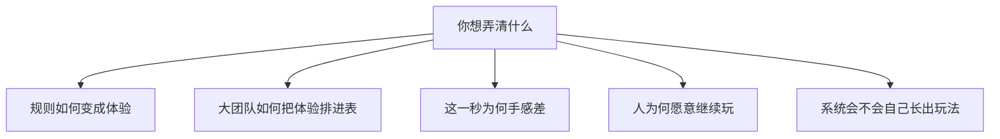

游戏设计没有像物理学那样的统一理论。业界和学界用的，多半是**分析词汇、工作室方法和从心理学借来的模型**。MDA、Rational Game Design 都是其中较成体系的一套，但回答的问题不一样：前者帮你拆「规则怎么变成体验」，后者帮大团队把体验拆成可排期、可量化的参数。

本篇按谱系列常用的专业框架，而不是按热度堆名词。每套词说什么、从哪来、通常拿来干什么。番外只做介绍，不要求你用某一套当宪法。

三种东西经常被塞进同一个抽屉，但并不互相替代：

- **分析词汇**：帮你把「玩起来怎样」拆成可讨论的层。MDA、《The Art of Game Design》的四元组是这一族。
- **工作室方法**：帮大团队把体验拆成可排期、可打分、可辩护的参数。Rational Game Design 是代表。
- **动机模型**：从心理学进口，解释人为什么愿意继续。心流、自我决定理论走这里。

<Cards>
  <Card title="1. 结构分析" href="#structure" description="MDA、四元组、二阶设计、课上方法" />
  <Card title="2. 工作室方法" href="#studio" description="RGD、RLD、支柱、模式" />
  <Card title="3. 微观语法" href="#micro" description="技能原子、循环、动词、手感" />
  <Card title="4. 体验与动机" href="#motivation" description="心流、PENS、Bartle、八种乐趣" />
  <Card title="5. 玩法形态" href="#systems" description="涌现、半真实、Immersive Sim" />
  <Card title="6. 玩的哲学" href="#play-theory" description="魔圈、Caillois、Suits" />
</Cards>

## 1. 结构分析：从规则到体验 [#structure]

这一族解决沟通问题：策划、程序、评论者说「玩法」时，常常不在说同一层。

### MDA

**MDA**（Mechanics–Dynamics–Aesthetics）由 Robin Hunicke、Marc LeBlanc、Robert Zubek 在 2004 年写成正式词汇，源头是 GDC 的 Game Design and Tuning Workshop（2001–2004）。[^mda]

把游戏拆成三层：

- **Mechanics**：规则、数据、算法（设计者能直接改的）
- **Dynamics**：玩起来之后，系统与玩家互相作用产生的行为
- **Aesthetics**：玩家的情绪反应

关键洞察不是三个词，而是**箭头方向**：设计者从 M→D→A 工作，玩家从 A→D→M 感受。你改不了「感觉」，只能改规则，再观察涌现。

所以「增加乐趣」不是在表上加一项 Aesthetics，是去改能长出那种动态的规则。

<Callout type="warning" title="不要在策划案里写「请增加 Aesthetics」">
Aesthetics 是结果。你能改的是 Mechanics。Dynamics 只能被观察、被调，不能被直接安装。把三层当成三张功能表，MDA 会先在你手里坏掉。
</Callout>

### 八种乐趣

LeBlanc 给 Aesthetics 列过一份非穷尽清单，常被单独拿出来当策划对齐工具：我们到底在卖哪一种爽。[^mda]

1. **Sensation** 感觉：作为感官愉悦
2. **Fantasy** 幻想：作为假装
3. **Narrative** 叙事：作为戏剧
4. **Challenge** 挑战：作为障碍赛
5. **Fellowship** 社交：作为游戏圈
6. **Discovery** 发现：作为未知领域
7. **Expression** 表达：作为自我展现
8. **Submission** 服从：作为消遣（把时间交出去）

清单有用。当成配方，容易做出「每一种都来一点」的拼盘。它是 MDA 的美学层，不是另一套完整理论。

### DDE

**DDE**（Design–Dynamics–Experience）是 Walk、Görlich、Barrett 对 MDA 的修订。[^dde]

他们批评 MDA 把「Mechanics」说得太宽（规则、代码、界面、叙事全塞进去），把「Aesthetics」收得太窄（像在列乐趣类型，而不是完整体验）。改成：

- **Design**：含机制、界面、叙事、技术
- **Dynamics**：运行时行为
- **Experience**：玩家的完整体验

更像在修词汇，不是另一套世界观。不推翻「你只能改设计、不能直接安装感觉」。

### DPE

**DPE**（Design–Play–Experience）由 Brian Winn 提出。把学习、叙事、用户体验、技术都画进同一张图，偏严肃游戏 / 教学游戏。[^dpe] 课上常用它来同时盯玩法和学习目标，商业动作游戏圈里不如 MDA、RGD 常见。

### 元素四元组与《The Art of Game Design》

Jesse Schell 的《**The Art of Game Design: A Book of Lenses**》（《游戏设计艺术》）给出 **Elemental Tetrad**（元素四元组）：游戏由四块互相咬合，缺一块就不是完整的游戏。[^schell]

- **Mechanics** 机制：规则、目标、玩家如何行动与推进
- **Story** 故事：事件如何展开；可以线性、非线性，甚至很淡
- **Aesthetics** 美学：玩家的感官——看起来、听起来、摸起来怎样。这里的 Aesthetics 比 MDA 更偏「呈现」，不只是情绪类型
- **Technology** 技术：载体及其限制（引擎、输入设备、网络、平台）

和 MDA 的对照很清楚：MDA 几乎不谈技术和叙事；四元组把这两块拉回来。Schell 也不把三层写成单向因果，四块是同时在场、互相约束的。

Schell 真正好用、也是这本书比四元组更出名的部分，是配套的 **百镜（Lenses）**：上百个提问清单，不是一条定律。常见的镜子包括：

- 目标之镜：玩家立刻知道要干什么吗？
- 反馈之镜：行动之后，世界有没有立刻说话？
- 兴趣曲线之镜：这一段的张力是在涨还是在掉？
- 内在价值之镜：玩家在乎这个目标，还是只在乎分数？
- 玩具之镜：拿掉目标，它还有没有可玩的？

四元组帮你看见游戏由哪几块做成；百镜帮你在具体功能上提问。读法是当工具书翻，不必从头背到第 100 个透镜。

### Rules of Play / 二阶设计

Katie Salen 与 Eric Zimmerman 的《Rules of Play: Game Design Fundamentals》。核心句：设计者设计的是**规则**，玩家产生的是**玩**。[^rop]

所谓 **meaningful play**（有意义的玩），是行动与结果之间要有可辨认、可整合进后续决定的关系。按了按钮却不知道发生了什么，就没有 meaningful play。

这叫 **second-order design**（二阶设计）：你控制不了玩家会玩成什么样，只能控制规则会奖励什么、惩罚什么、对什么沉默。沉默也是设计。对沙盒和系统游戏特别有杀伤力——目标外包、误用、涌现，用的都是这一种结构，而不是八种乐趣的格子。

### Playcentric Design

Tracy Fullerton 的《Game Design Workshop》。把游戏拆成：[^fullerton]

- **形式元素**：玩家、目标、程序、规则、资源、冲突、边界、结果
- **戏剧元素**：前提、角色、故事

方法叫 **Playcentric Design**：尽早做能玩的原型，反复试玩，让玩的人（而不是文档）来改设计。这是北美院校最常见的「课上怎么做游戏」方法。它给过程，不太给「这款游戏在类型学上属于什么」。

### Formal Abstract Design Tools

Doug Church，1999 年发表于 Gamasutra 的短文。MDA 之前的重要一步：试图给设计建立可复用词汇，而不是只说「手感」和「好玩」。[^church]

他当时推的几个抽象工具包括：

- **Intention** 意图：玩家能形成并执行计划
- **Perceivable Consequence** 可感知后果：行动的结果能被看见、被读懂
- **Story** 故事：不一定是过场，而是玩家能复述的因果链

后来的 MDA、Fullerton、Schell 都还在还这笔「先把词立住」的债。

## 2. 工作室方法：把体验做成可生产 [#studio]

这一族的问题不是「游戏在哲学上是什么」，而是「五十个人、两年、怎么把体验做成能排期、能验收的东西」。

### Rational Game Design

**Rational Game Design**（RGD）是育碧内部方法，由 Lionel Raynaud、Eric Couzian 等人推动，内部有 Design Academy。Montpellier 的 *Rayman Origins* 有 Chris McEntee 的公开长文，是最常被引用的样本。[^rgd]

目标不是「更有创意」，而是**让设计决策可辩护**：把机制拆到不能再拆的原子参数，给难度、可读性、多样性打分，再排两层节奏——

- **Micro Flow**：每秒的手感
- **Macro Flow**：整关 / 整盘的学习与难度曲线

大团队、高预算时，它首先是**风控工具**。名字听起来像在宣布别的设计都是非理性的；它并不保证更好玩，只保证「这一关为什么这样」可以拿到桌面上商量，而不是只存在于某个关卡设计师的脑子里。

它擅长平台跳跃、任务结构清楚、要控制「什么时候教什么」的游戏。它不擅长、也不该被当成万能公式的，是高度涌现的沙盒——参数表填不满「玩家自己发明目标」。宏观心流假定技能在涨、挑战必须跟着涨；有人学会之后连续三个月只盖房子，按表是掉出通道，按另一种设计合同却完全合法。

### Rational Level Design

**Rational Level Design**（RLD）是 RGD 的关卡侧亲戚：用表和数值管关卡难度、信息密度、教学节奏。名字还叫 Level Design，实际常被用到系统 tuning 上。公开介绍见 Alexis Jolis-Desautels 等人后来写的 RLD handbook 系列。[^rld]

和 RGD 的关系：RGD 管「机制拆成什么参数」，RLD 管「这些参数在空间和时间上怎么铺」。大工作室里两套常常一起用。

### The 400 Project

Hal Barwood 与 Noah Falstein。收集「设计法则」，每条带前置条件和例外，接近启发式清单，不是封闭理论。[^400] 例如「给玩家一个明确目标」在谜题游戏里成立，在沙盒里就要加例外。读法是当备忘录，不是当公理系统。

### Game Design Patterns

Staffan Björk 与 Jussi Holopainen 的《Patterns in Game Design》。把常见玩法结构写成模式：资源竞争、石头剪刀布、完美信息、纸石头剪刀的克制、时间压力……[^patterns]

分析现有游戏很顺：你能指着「这是信息不对称」说话。直接当配方书，会设计出「正确但没灵魂」的东西——模式保证的是可辨认，不是有趣。

### 设计支柱

许多工作室的实践，不一定写成论文：**Pillars**（设计支柱）。先钉 3 条左右「这游戏是什么、不是什么」，后续功能都拿支柱过滤。

例如：「战斗要读得懂」「世界可以走回头路」「不靠技能树分职业」。不是学术理论，但是专业流程里最常见的对齐工具。和 RGD 可以并存：支柱管方向，RGD 管某一关为什么这样排。

## 3. 微观语法：循环、原子、经济 [#micro]

镜头拉近到输入、反馈和资源。

### Skill Atoms

Daniel Cook，《The Chemistry of Game Design》。最小可玩单元：心智模型 → 行动 → 反馈 → 更新模型。原子串起来成为技能链。[^atom]

一个原子通常还包含：目标、行动、规则、代币（你操作的对象）、反馈、挑战、玩家当前的模型。掌握完就无聊，所以要持续给新模式，或把已掌握的原子嵌进更大的原子里。

Raph Koster 的《A Theory of Fun for Game Design》是同一家族：乐趣来自**模式掌握**，掌握完就无聊，所以游戏必须持续给新模式。[^koster] 用它看工具进阶、教程、战斗成长很顺；用它看「已经会了还继续玩」会不够——那一块更常要换 PENS 的自主，或二阶设计。

### Core Loop / Nested Loops

业界口语理论，不一定有一篇经典论文。玩家最常重复的那一圈（采集–合成–升级–再采集，或打怪–掉落–强化–再打怪），以及它外面套的中循环、长循环。

好用，因为能逼你画出「玩家每三十秒、每十分钟、每一小时在重复什么」。但「有循环」不等于「有深度」。循环只说明重复被设计过；深度还要看这一圈里有没有有意义的决定，以及圈与圈如何咬合。

### 内部经济 / Machinations

Ernest Adams 与 Joris Dormans，《Game Mechanics: Advanced Game Design》。把游戏看成资源的生产、转换、消耗、反馈。[^mach]

**Machinations** 是 Dormans 做的图示语言：节点表示池、来源、消耗、转换、门，用来画经济怎么转。对养成、建造、生存、卡牌资源很贴。对格斗的帧数据和平台跳跃的落点，就要换 Game Feel 或技能原子。

### Verbs

Anna Anthropy 与 Naomi Clark，《A Game Design Vocabulary》。先问玩家**能做哪些动词**，再问动词如何组合成有意义的句子。[^verbs]

比「功能列表」更接近玩。技能树、建造模式、战斗姿态，往往是在给动词分家：造的时候不能打，打的时候不能造。动词少不一定穷，可能是故意让组合发生在世界上，而不是发生在菜单里。

### Game Feel

Steve Swink，《Game Feel: A Game Designer's Guide to Virtual Sensation》。输入、动画、镜头、粒子、音效如何合成「手感」。[^feel]

它几乎不谈系统和叙事，但动作游戏离开它就没理论可讲。常见拆法包括：实时控制、空间模拟、波兰（juice）、隐喻（这一下看起来像在干什么）。手感理论解释这一秒。它不解释关卡该怎么排，也不解释玩家为什么愿意住十年。

## 4. 体验与动机（从心理学进口） [#motivation]

### 心流

**Flow** 来自心理学家 Mihaly Csikszentmihalyi。挑战与技能匹配时进入专注；过难焦虑，过易无聊。[^flow]

游戏里常经 Jenova Chen 的 MFA 论文和 *flOw*、以及大量 GDC 课转译。前提通常是：

- 目标清楚
- 反馈及时
- 难度跟着技术涨

RGD 的 Micro / Macro Flow 就是把这张图画进关卡表。心流解释「刚好活下来」很顺。它不太解释发呆、闲逛、看别人玩、或目标本来就不该由软件写死的那些体验。把通道当成唯一成功标准，会把很多有效的玩法判成缺陷。

<Callout type="idea" title="通道外面也可以很好玩">
发呆、闲逛、观看、把目标交给自己，心流图里不一定有位置。没有位置，不等于设计失败。PENS 的「自主」往往更适合谈这一块。
</Callout>

### PENS / 自我决定理论

自我决定理论（SDT）说人有三种基本心理需求。Scott Rigby 与 Richard Ryan 把它做成游戏向的 **PENS**（Player Experience of Need Satisfaction）。游戏让人「上瘾」——更准确：让人自愿回来——往往是因为满足：[^pens]

- **Competence** 胜任：觉得自己有效
- **Autonomy** 自主：有意义的选择，行动像是自己的
- **Relatedness** 关系：和别人（或有分量的角色）有连接

PENS 还补了 **presence**（临场感）和 **intuitive controls**（直觉操作）：操作别扭会直接压胜任感。解释力比 Bartle 分类更稳，也更经得起问卷和实验。三者可以拆开看——刷成就偏胜任，一起玩偏关系，自己决定今晚干什么偏自主。

### Bartle 类型

Richard Bartle 把 MUD 玩家分成四类：[^bartle]

- **Achiever** 成就者：打进度、刷收集
- **Explorer** 探索者：把系统摸清楚
- **Socializer** 社交者：为了人来
- **Killer** 杀手：对人施加影响（不一定是 PK，也包括扰乱）

分类直觉强。当作人格真理会误导——同一个人今晚可以刷成就、明晚闲逛。当作「服务器里会同时存在的压力」更有用：你做的系统会同时喂这四种胃口，它们会互相打架。

Nick Yee / Quantic Foundry 后来的玩家动机模型更细（行动、社交、精通、沉浸等一簇因子），仍然是切片，不是设计算法。[^yee]

### 八种乐趣（再作为动机切片）

MDA 那份美学清单也常被从框架里抽出来，单独当「我们卖哪一种爽」的对齐工具。它和 Bartle、PENS 不在一层：Bartle 切的是人，PENS 切的是需求，八种乐趣切的是体验类型。策划会上三种会混着说，分析时最好分开。

## 5. 玩法形态与系统观 [#systems]

### Emergence vs Progression

Jesper Juul 区分两种组织玩法的方式：[^juul]

- **Emergence** 涌现型：规则相对少，组合多，有趣的局面从系统里长出来（大部分棋类、许多模拟、沙盒）
- **Progression** 进度型：设计者排好一串挑战 / 关卡 / 剧情，玩家走过去（大部分动作冒险、视觉小说）

大多数商业游戏是混合物。Minecraft 明显偏涌现，再慢慢加进度层（进度、维度、村庄交易……）。混合物会变；往哪边加一刀，游戏的「作者是谁」就会跟着变。

### Half-Real

还是 Juul，《Half-Real: Video Games between Real Rules and Fictional Worlds》。游戏同时是真实规则和虚构世界。规则在运行，故事在被扮演。[^juul]

后面 Clint Hocking 说的 **Ludonarrative Dissonance**（机制–叙事失调），就是两者打架：机制在奖励一件事，叙事在说另一件事。他当初的例子是 *BioShock*：故事要你成为家人的反对者，机制却在奖励你把什么都收进背包。[^hocking]

不是所有打架都是失败。有的游戏故意让规则和虚构拧着。要先能叫出它的名字，才谈得上是不是问题。

### 系统性设计 / Immersive Sim

Harvey Smith、Warren Spector、Clint Hocking 等人的实践传统（*Deus Ex*、*Thief*、*Dishonored*、*System Shock* 这一河）：给一致的模拟规则，让玩家用系统组合解决问题，而不是走设计师预写的解。

和 RGD 的「可读、可控、按表教学」是两种专业，不是对错。系统式设计接受「有些解法关卡作者没写」；RGD 接受「这一关必须教完这一个原子再往下」。很多游戏两边各借一点。

### Procedural Rhetoric

Ian Bogost，《Persuasive Games》。规则本身在「论证」：税收模拟、战争伤害、合成代价都在说话。[^bogost] 适合分析（这套规则在主张什么世界），不太适合当制作手册（下一步该加哪一个系统）。

### GNS

Ron Edwards，桌面 RPG 理论圈（The Forge）：**Gamism / Narrativism / Simulationism**——一局该优先服务竞争、故事，还是模拟的自洽。[^gns] 电子游戏圈偶尔借用。原语境是跑团争论，硬套电子游戏会先吵定义。

## 6. 更早的玩理论（设计课常当源头） [#play-theory]

这些不是「怎么做关卡」的手册，但是专业讨论的地基。

### Huizinga 与魔圈

Johan Huizinga，《Homo Ludens》（《人：游戏者》，1938）。玩是自愿、有界限、与日常分开的活动。后来常被叫做 **magic circle**（魔圈）：进圈之后，额外的规则临时生效——棋盘上的国王不能真的下令征税。[^huizinga]

魔圈是分析起点，不是物理围墙。线上游戏、赌博、体育职业化，都在讨论圈有没有破、破了会怎样。

### Caillois

Roger Caillois，《Man, Play and Games》。两种松紧：[^caillois]

- **Paidia**：狂放、即兴、胡闹
- **Ludus**：有规则、有训练、有难度的玩

以及四种倾向，可以混合：

- **Agon** 竞争
- **Alea** 机遇
- **Mimicry** 模仿
- **Ilinx** 眩晕（旋转、高速、失去稳定）

用它给游戏做气质判断很顺：竞速偏 Agon + Ilinx，化妆舞会偏 Mimicry，老虎机偏 Alea。它不管这一关的蘑菇该放几只。

### Suits

Bernard Suits，《The Grasshopper》。一句常被引用的定义：游戏是「自愿去克服不必要的障碍」（**lusory attitude**）。[^suits]

跑步可以直接穿过草坪，你却同意绕跑道。规则把更有效的办法关掉，乐趣往往就从这里来。Minecraft 里「不用命令方块、自己挖」，很贴这句——贴，不等于能从这句话推出某一条机制该不该修。哲学给许可。关卡表还得另请一套词。

## 同一场面，三套词

取一幕很普通的：平台跳跃里，玩家第一次跳上一个会左右移动的平台。

<Tabs items={['MDA', 'Rational Game Design', '心流']} groupId="moving-platform">
  <Tab value="MDA">

Mechanics：跳跃高度、空中控制、平台的速度和碰撞。Dynamics：玩家开始预判、等拍子、失败后调整起跳时机。Aesthetics：多半是挑战，也可能带一点「我算准了」的感觉。

MDA 在这里有用，因为它逼你承认：爽不在「有跳跃」这个功能标签上，而在时机博弈长出来的动态上。把平台改成静止，Mechanics 几乎还在，Dynamics 薄了一截，Aesthetics 跟着变。

  </Tab>
  <Tab value="Rational Game Design">

RGD 会问：玩家现在会哪些原子技能？静止跳跃教过了没有？移动平台的可读性够不够（速度、体积、是否在落地前给预告）？这一下的失败能不能立刻读懂（是跳早了还是跳晚了）？

典型排法是先教跳，再教移动目标，再叠加伤害或时间压力。信息一次不要上太多。它关心的是教学顺序和难度表，不是「跳跃在哲学上意味着什么」。

  </Tab>
  <Tab value="心流">

心流会问：这一下的挑战是否刚好卡在当前技能边上。全程静止平台会无聊；一上来就是带刺的高速平台会焦虑。目标（跳上去）和反馈（落地 / 掉下去）都很清楚，所以这张图很好画。

它不太问「这个跳跃在叙事里代表什么」，也不问「玩家会不会用跳跃做出关卡作者没写的用法」。那些要换二阶设计或涌现。

  </Tab>
</Tabs>

同一跳，三套词看到的不是三款游戏，是三种问题。选哪一套，取决于你此刻要改什么、要和谁商量。

## 怎么选用，而不是怎么信 [#how-to-choose]

它们回答的问题不同：

| 你想问的 | 更合适的工具 |
|---|---|
| 改这条规则，玩家会感到什么？ | MDA / DDE / 二阶设计 |
| 游戏由哪几块做成？故事和技术放哪？ | 元素四元组、Schell 的百镜 |
| 大团队怎么把难度和教学排进表里？ | RGD / RLD / Flow |
| 这一秒为什么手感差？ | Game Feel / Skill Atom |
| 玩家为什么愿意一直玩？ | PENS、Koster、心流 |
| 系统会不会自己长出设计师没写的玩法？ | 涌现、内部经济、系统式设计 |
| 机制和故事是否在互相拆台？ | Half-Real、Ludonarrative Dissonance |

没有哪一套能覆盖全部。MDA 几乎不谈生产和叙事；四元组补上了，却不给你关卡表。RGD 很会管 *Rayman* 式教学，却容易把沙盒管死；心流解释不了「发呆盖房子」为什么也成立；Bartle 解释不了为什么同一个人今晚在刷成就、明晚在闲逛。

对 Minecraft 这类「能住进去、能玩出设计之外」的系统，通常 **MDA 的动力学层、Salen / Zimmerman 的二阶设计、Juul 的涌现、PENS 的自主** 比 RGD 更咬合——RGD 仍然有用，但用在「新手夜、死亡惩罚、教程节奏」这类可控段，而不是拿来证明整个沙盒。做关卡动作游戏时，顺序几乎反过来：RGD、心流、Game Feel 先上，涌现放到「我们允许误用吗」那一问再请。

## 若要往下读

先读短的、能当词汇表的。

- Hunicke、LeBlanc、Zubek，MDA 原文，十几页。
- Schell，《The Art of Game Design》：四元组看一遍，百镜当提问清单翻。
- Salen 与 Zimmerman，《Rules of Play》：先读 meaningful play 和二阶设计。
- Fullerton，《Game Design Workshop》：课上怎么做原型。
- McEntee，《Rational Design: The Core of Rayman Origins》。
- Cook，《The Chemistry of Game Design》（Lost Garden）。
- Koster，《A Theory of Fun》；Swink，《Game Feel》。
- Juul，《Half-Real》里涌现 / 进度、规则 / 虚构那两节。
- 动机：心流通道图 + PENS 的三个需求即可，不必先把 Csikszentmihalyi 全书搬进关卡表。

没有具体场面的理论，很容易在讨论里变成形容词。带着「你想改哪一下」去读，会清楚得多。

[^mda]: Robin Hunicke, Marc LeBlanc, Robert Zubek，《MDA: A Formal Approach to Game Design and Game Research》，AAAI Workshop on Challenges in Game AI，2004。见 <https://users.cs.northwestern.edu/~hunicke/MDA.pdf>。

[^dde]: Wolfgang Walk, Daniel Görlich, Mark Barrett，《Design, Dynamics, Experience (DDE): An Advancement of the MDA Framework for Game Design》，收录于 *Game Dynamics*，Springer，2017。公开简述见 Walk，《From MDA to DDE》，Game Developer，<https://www.gamedeveloper.com/design/from-mda-to-dde>。

[^dpe]: Brian Winn，《The Design, Play, and Experience Framework》，收录于 *Handbook of Research on Effective Electronic Gaming in Education*，IGI Global，2008。

[^schell]: Jesse Schell，《The Art of Game Design: A Book of Lenses》，CRC Press / Elsevier，初版 2008。元素四元组为 Mechanics / Story / Aesthetics / Technology；百镜见书中各章的 Lens。

[^rop]: Katie Salen, Eric Zimmerman，《Rules of Play: Game Design Fundamentals》，MIT Press，2003。meaningful play 与 second-order design 见该书规则–玩–文化的论述。

[^fullerton]: Tracy Fullerton，《Game Design Workshop: A Playcentric Approach to Creating Innovative Games》，CRC Press，初版 2004，后多次再版。形式元素与戏剧元素、Playcentric 过程见该书。

[^church]: Doug Church，《Formal Abstract Design Tools》，Gamasutra，1999-07-16。存档见 Game Developer，<https://www.gamedeveloper.com/design/formal-abstract-design-tools>。

[^rgd]: Chris McEntee，《Rational Design: The Core of Rayman Origins》，Gamasutra / Game Developer，2012。见 <https://www.gamedeveloper.com/design/rational-design-the-core-of-i-rayman-origins-i->。方法渊源在文中记为 Lionel Raynaud、Eric Couzian 与育碧内部 Design Academy。

[^rld]: 公开介绍见 Game Developer 上的 Rational Design / RLD 系列，例如 《The Rational Design Handbook: An Intro to RLD》，<https://www.gamedeveloper.com/design/the-rational-design-handbook-an-intro-to-rld>。

[^400]: Hal Barwood, Noah Falstein，The 400 Project（GDC 起持续收集带例外的设计法则）。公开说明见作者后来的设计写作与 GDC 演讲。

[^patterns]: Staffan Björk, Jussi Holopainen，《Patterns in Game Design》，Charles River Media，2005。模式库亦见 <https://www.gameplaydesignpatterns.org/>。

[^atom]: Daniel Cook，《The Chemistry of Game Design》，Lost Garden，2007-07-19。见 <https://lostgarden.com/2007/07/19/the-chemistry-of-game-design/>。

[^koster]: Raph Koster，《A Theory of Fun for Game Design》，Paraglyph / O'Reilly，初版 2004。

[^mach]: Ernest Adams, Joris Dormans，《Game Mechanics: Advanced Game Design》，New Riders，2012。Machinations 工具见 Dormans 相关工作。

[^verbs]: Anna Anthropy, Naomi Clark，《A Game Design Vocabulary: Exploring the Foundational Principles Behind Good Game Design》，Addison-Wesley，2014。

[^feel]: Steve Swink，《Game Feel: A Game Designer's Guide to Virtual Sensation》，Morgan Kaufmann，2009。

[^flow]: Mihaly Csikszentmihalyi，《Flow: The Psychology of Optimal Experience》，Harper & Row，1990。游戏转译见 Jenova Chen，《Flow in Games》（MFA 论文，2006）及 thatgamecompany 的 *flOw*。

[^pens]: Scott Rigby, Richard M. Ryan，《Glued to Games: How Video Games Draw Us In and Hold Us Spellbound》，Praeger，2011；PENS 见 <https://selfdeterminationtheory.org/player-experience-of-needs-satisfaction-pens/>。

[^bartle]: Richard Bartle，《Hearts, Clubs, Diamonds, Spades: Players Who Suit MUDs》，1996。见 <https://www.mud.co.uk/richard/hcds.htm>。

[^yee]: Nick Yee，Quantic Foundry Gamer Motivation Model。综述见 <https://quanticfoundry.com/>。

[^juul]: Jesper Juul，《Half-Real: Video Games between Real Rules and Fictional Worlds》，MIT Press，2005。涌现型与进度型、规则与虚构的双重性见该书。

[^hocking]: Clint Hocking，《Ludonarrative Dissonance in Bioshock》，Click Nothing，2007-10-07。

[^bogost]: Ian Bogost，《Persuasive Games: The Expressive Power of Videogames》，MIT Press，2007。

[^gns]: Ron Edwards，《GNS and Other Matters of Role-playing Theory》，The Forge，2001。

[^huizinga]: Johan Huizinga，《Homo Ludens》，1938。英译多种；魔圈是后人对其中「玩与日常分开」的常用概括。

[^caillois]: Roger Caillois，《Les jeux et les hommes》，Gallimard，1958。英译 *Man, Play and Games*。

[^suits]: Bernard Suits，《The Grasshopper: Games, Life and Utopia》，University of Toronto Press，1978。
