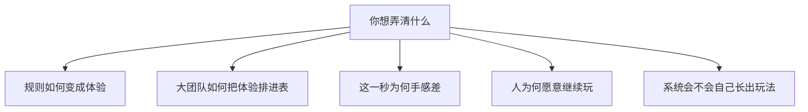

游戏设计没有像物理学那样的统一理论。课上和工作室里传来的，多半是几套**分析词汇、生产方法和从心理学借来的模型**。MDA 和 Rational Game Design 都常被叫做「专业理论」，但它们回答的问题并不一样。

本篇只做介绍：每套词说什么、从哪来、通常拿来干什么。不拿它们去证明 Minecraft，也不要求你用某一套当宪法。

| 你在想的问题 | 更常被用到的框架 |
|---|---|
| 改这条规则，玩家会感到什么？ | MDA、二阶设计、元素四元组 |
| 新手教学、难度、可读性怎么排？ | Rational Game Design、心流 |
| 这一下为什么「手感对」？ | Game Feel、技能原子、动词 |
| 人为何愿意一直玩？ | PENS、心流、Koster 的模式掌握 |
| 预料之外的玩法从哪来？ | 涌现、内部经济、系统式设计 |

三种东西经常被塞进同一个抽屉，但并不互相替代：

- **分析词汇**：帮你把「玩起来怎样」拆成可讨论的层。MDA 是代表。
- **生产方法**：帮大团队把体验拆成可排期、可打分、可辩护的参数。Rational Game Design 是代表。
- **动机模型**：解释人为什么愿意继续。心流、自我决定理论走这里。

<Note>
下面按家族介绍。文末的折叠是词条速查，正文已经把意思说过一遍。
</Note>

## 更早的玩理论

这些不是「怎么做关卡」的手册，但是后面许多框架的地基。

**Huizinga** 在《人：游戏者》里把玩写成一种自愿、与日常分开的活动，后来常被叫做**魔圈**（magic circle）：进圈之后，额外的规则临时生效。[^huizinga]

**Caillois** 把玩拆成四种倾向：竞争（Agon）、机遇（Alea）、模仿（Mimicry）、眩晕（Ilinx）；又用 paidia（狂放）对 ludus（有规则的玩）来区分松紧。[^caillois]

**Bernard Suits** 有一句常被引用的定义：游戏是「自愿去克服不必要的障碍」（lusory attitude）。跑步可以直接穿过草坪，你却同意绕跑道。规则把更有效的办法关掉，乐趣往往就从这里来。[^suits]

它们给许可：玩是自愿的，障碍可以是自己找的。它们不告诉你这一关的蘑菇该放几只。

## 规则如何变成体验

这一族解决沟通问题：策划、程序、评论者说「玩法」时，常常不在说同一层。

### MDA

**MDA**（Mechanics–Dynamics–Aesthetics）由 Hunicke、LeBlanc、Zubek 在 2004 年写成正式词汇，源头是 GDC 的设计与调参课。[^mda]

- **Mechanics**：规则、数据、算法。设计者能直接改。
- **Dynamics**：玩起来之后，系统和玩家互相作用长出来的行为。
- **Aesthetics**：玩家的情绪反应。

关键不是三个英文词，是**箭头方向**。设计者从规则走到体验；玩家从体验走回规则。你改不了「感觉」，只能改规则，再观察涌现。

LeBlanc 还列过八种乐趣：感觉、幻想、叙事、挑战、社交、发现、表达、服从。清单有助于对齐「我们到底在卖哪一种爽」；当成配方，容易做出「每一种都来一点」的拼盘。

<Callout type="warning" title="Aesthetics 不是功能表上的一项">
Aesthetics 是结果。你能改的是 Mechanics。Dynamics 只能被观察、被调，不能被直接安装。
</Callout>

### MDA 的亲戚

**DDE**（Design–Dynamics–Experience）认为 Mechanics 太宽、Aesthetics 太窄，把界面、叙事、技术收进 Design，把体验从「乐趣类型」里放开。[^dde]

Jesse Schell 的 **元素四元组** 把游戏看成 Mechanics、Story、Aesthetics、Technology 四块互相咬合。MDA 几乎不谈技术和叙事；四元组把这两块拉回来。Schell 真正好用的，往往是配套的**百镜**（Lenses）：一串具体的提问清单，而不是一条定律。[^schell]

Brian Winn 的 **DPE**（Design–Play–Experience）把学习、叙事、用户体验、技术画进同一张图，在严肃游戏 / 教学游戏课上更常见。

Doug Church 更早的 **Formal Abstract Design Tools**（1999）试图给「意图、可感知因果」这类词立定义。Tracy Fullerton 的《Game Design Workshop》把游戏拆成形式元素（目标、规则、资源、冲突、边界、结果）和戏剧元素（前提、角色、故事），强调原型和反复试玩，是北美院校最常见的课上方法之一。

### 二阶设计

Salen 与 Zimmerman 的《Rules of Play》有一句很硬的话：设计者设计的是**规则**，玩家产生的是**玩**。所谓 **meaningful play**，是行动与结果之间要有可辨认、能被带进下一个决定的关系。[^rop]

这叫**二阶设计**：你控制不了玩家会玩成什么样，只能控制规则会奖励什么、惩罚什么、对什么沉默。沉默也是设计。沙盒、模拟、开放世界讨论里，这一套往往比八种乐趣更贴。

## Rational Game Design

**Rational Game Design**（RGD）是育碧内部方法。公开文本里，它常和 *Rayman Origins*、关卡教学、可读性、微观心流与宏观心流绑在一起。[^rgd]

它实际做的是：把机制拆到不能再拆的**原子参数**，给难度、信息密度、多样性打分，再排两层节奏——

- **Micro Flow**：这一秒的手感
- **Macro Flow**：整关 / 整盘的学习与难度曲线

大团队、高预算时，它首先是**风控**：让「这一关为什么这样」可以被辩护，而不是只存在于某个关卡设计师的脑子里。名字听起来像在宣布别的设计都是非理性的；它并不保证更好玩，只保证更好商量。

它擅长教学顺序清楚、失败可立即读、挑战可以按表抬升的游戏。平台跳跃是主场；任务结构清楚的动作冒险也常请它来管节奏。

它不那么擅长高度涌现的沙盒：参数表填不满「玩家自己发明目标」。宏观心流假定技能在涨、挑战必须跟着涨；有人学会之后连续三个月只盖房子，按表是掉出通道，按另一种设计合同却完全合法。

同一家族里还有：

- **Rational Level Design**（RLD）：用表管关卡难度和教学节奏。
- **设计支柱**（Pillars）：先钉三句「这游戏是什么、不是什么」，后续功能拿支柱过滤。不是学术理论，是工作室对齐工具。
- **The 400 Project**（Barwood、Falstein）：收集带例外的设计启发式。
- **Game Design Patterns**（Björk、Holopainen）：把常见玩法结构写成模式。分析现成游戏很顺，直接当配方容易做出「正确但没空隙」的东西。

## 循环、原子、手感

镜头拉近到输入和反馈。

**技能原子**是 Daniel Cook 的说法：最小可玩单元是心智模型 → 行动 → 反馈 → 更新模型。原子串起来成为技能链。掌握完就无聊，所以要持续给新模式。[^atom] Raph Koster 的《A Theory of Fun》是同一家族：乐趣来自**模式掌握**。

业界口语里的 **核心循环**（打怪、掉落、升级、再打怪；或采集、合成、再采集）是把原子收成玩家最常重复的那一圈。外面还可以套中循环、长循环。「有循环」不等于「有深度」，只说明重复的那一圈被设计过。

**动词**是 Anna Anthropy 与 Naomi Clark 的切口：先问玩家能做哪些动词，再问动词如何组成句子。[^verbs] 比功能列表更接近「玩」。技能树、建造模式、战斗姿态，往往是在给动词分家。

**Game Feel** 管输入、动画、镜头、粒子、音效如何合成「手感」。Steve Swink 把它写成可拆的层。[^feel] 它几乎不谈系统和叙事，但动作游戏离开它就很难把「这一秒」说清楚。

Ernest Adams 与 Joris Dormans 把游戏看成资源的生产、转换、消耗，并用 **Machinations** 这类图来画内部经济。对养成、建造、生存很贴；对格斗的帧数据和平台跳跃的落点，就要换手感或技能原子。

## 人为何愿意继续玩

**心流**（Flow）来自 Csikszentmihalyi：挑战与技能大致匹配时进入专注；过难焦虑，过易无聊。常见前提是目标清楚、反馈及时、难度跟着技术涨。Jenova Chen 的 *flOw* 和大量关卡课把它转译进游戏。[^flow] RGD 的微观 / 宏观心流，就是把这张图画进关卡表。

心流解释「刚好活下来」很顺。它不太解释发呆、闲逛、看别人玩、或目标本来就不该由软件写死的那些体验。把通道当成唯一成功标准，会把很多有效的玩法判成缺陷。

**自我决定理论**在游戏里的常用版本是 Rigby 与 Ryan 的 **PENS**：人愿意回来，常常是因为 **胜任、自主、关系** 被满足；操作别扭会直接压胜任感。[^pens] 三者可以拆开看——刷成就偏胜任，一起玩偏关系，自己决定今晚干什么偏自主。

其他常被提到的切片：

- **Bartle 类型**（成就者 / 探索者 / 社交者 / 杀手）：来自 MUD。当人格真理会误导，当「服务器里会同时存在的压力」比较有用。
- **Quantic Foundry** 的玩家动机模型（Nick Yee）：比 Bartle 更细的问卷切片。
- **八种乐趣**：MDA 的美学清单，单独拿出来也常当策划对齐工具。

<Callout type="idea" title="通道外面也可以很好玩">
发呆、闲逛、观看、把目标交给自己，心流图里不一定有位置。没有位置，不等于设计失败。PENS 的「自主」往往更适合谈这一块。
</Callout>

## 涌现、虚构、系统

Jesper Juul 区分更偏 **涌现**（规则少、组合多）和更偏 **进度**（关卡、剧情、内容关卡化）。大多数商业游戏是混合物。[^juul]

他还提出游戏是 **半真实**（Half-Real）的：同时是真实规则和虚构世界。规则在运行，故事在被扮演。Clint Hocking 后来说的 **Ludonarrative Dissonance**（机制–叙事失调），就是两者打架：机制在奖励一件事，叙事在说另一件事。

**系统式设计** / **Immersive Sim**（Warren Spector、Harvey Smith、Clint Hocking 等人的实践传统）给一致的模拟规则，让玩家用系统组合解决问题，而不是走设计师预写的唯一解。它和 RGD 的「可读、可控、按表教学」是两种专业，不是对错。

Ian Bogost 的 **程序修辞**（Procedural Rhetoric）把规则本身看成论证：税收模拟、伤害公式、合成代价都在「说话」。适合分析，不太适合当制作手册。

桌面 RPG 圈的 **GNS**（Gamism / Narrativism / Simulationism，Ron Edwards）偶尔被电子游戏借用。原语境是跑团争论，硬套会先吵定义。

## 同一场面，三套词

取一幕很普通的：平台跳跃里，玩家第一次跳上一个会左右移动的平台。

<Tabs items={['MDA', 'Rational Game Design', '心流']} groupId="moving-platform">
  <Tab value="MDA">

Mechanics：跳跃高度、空中控制、平台的速度和碰撞。Dynamics：玩家开始预判、等拍子、失败后调整起跳时机。Aesthetics：多半是挑战，也可能带一点「我算准了」的感觉。

MDA 在这里有用，因为它逼你承认：爽不在「有跳跃」这个功能标签上，而在时机博弈长出来的动态上。把平台改成静止，Mechanics 几乎还在，Dynamics 薄了一截，Aesthetics 跟着变。

  </Tab>
  <Tab value="Rational Game Design">

RGD 会问：玩家现在会哪些原子技能？静止跳跃教过了没有？移动平台的可读性够不够（速度、体积、是否在落地前给预告）？这一下的失败能不能立刻读懂（是跳早了还是跳晚了）？

典型排法是先教跳，再教移动目标，再叠加伤害或时间压力。信息一次不要上太多。它关心的是教学顺序和难度表，不是「跳跃在哲学上意味着什么」。

  </Tab>
  <Tab value="心流">

心流会问：这一下的挑战是否刚好卡在当前技能边上。全程静止平台会无聊；一上来就是带刺的高速平台会焦虑。目标（跳上去）和反馈（落地 / 掉下去）都很清楚，所以这张图很好画。

它不太问「这个跳跃在叙事里代表什么」，也不问「玩家会不会用跳跃做出关卡作者没写的用法」。那些要换二阶设计或涌现。

  </Tab>
</Tabs>

同一跳，三套词看到的不是三款游戏，是三种问题。选哪一套，取决于你此刻要改什么、要和谁商量。

## 词条速查

<Accordions>
  <Accordion title="MDA">

Hunicke、LeBlanc、Zubek，2004。规则 → 动态 → 体验。设计者与玩家的阅读方向相反。八种乐趣是美学清单，不是功能清单。

  </Accordion>
  <Accordion title="DDE、DPE、元素四元组">

DDE 把 Design 和 Experience 写宽。DPE 偏严肃游戏。Schell 的四元组补上故事与技术，百镜是提问清单。它们修 MDA 的盲区，不推翻「你只能改规则」。

  </Accordion>
  <Accordion title="二阶设计 / 有意义的玩">

Salen 与 Zimmerman，《Rules of Play》。你设计规则，玩家产生玩。行动与结果要可辨认、可被带进下一决定。

  </Accordion>
  <Accordion title="Rational Game Design">

育碧方法。原子参数、可读性、微观 / 宏观心流、教学顺序。*Rayman Origins* 是公开样板。大团队风控工具，不是创造力公式。

  </Accordion>
  <Accordion title="技能原子、循环、动词、手感">

Cook：学习的最小闭环。核心循环：最常重复的那一圈。Anthropy：先问能做什么。Swink：这一秒的输入如何变成身体感觉。

  </Accordion>
  <Accordion title="心流与 PENS">

心流：挑战与技能匹配，目标清楚、反馈及时。PENS：胜任、自主、关系。通道解释「刚好」；自主更适合谈自己派目标。

  </Accordion>
  <Accordion title="涌现、半真实、系统式设计">

Juul：涌现对进度、规则对虚构。Hocking：机制与叙事打架。Immersive Sim：用一致模拟换玩家解法。Bogost：规则本身在论证。

  </Accordion>
  <Accordion title="魔圈、四种玩、不必要的障碍">

Huizinga：玩与日常分开。Caillois：竞争 / 机遇 / 模仿 / 眩晕。Suits：自愿去克服不必要的障碍。给许可，不给关卡表。

  </Accordion>
</Accordions>

## 若要往下读

先读短的、能当词汇表的。

- MDA 原文十几页，够建立共同语言。
- Schell 的书当提问清单翻，不必从头背到第 100 个透镜。
- RGD 读 McEntee 写 *Rayman Origins* 的那篇公开文章。
- Cook 的技能原子读 Lost Garden 上的《The Chemistry of Game Design》。
- 动机读懂心流通道图，再看 PENS 的三个需求即可。
- 系统观读 Juul《Half-Real》里涌现 / 进度那一节。

没有具体场面的理论，很容易在讨论里变成形容词。带着「你想改哪一下」去读，会清楚得多。

[^huizinga]: Johan Huizinga，《Homo Ludens》，1938。英译多种；魔圈是后人对其中「玩与日常分开」的常用概括。

[^caillois]: Roger Caillois，《Les jeux et les hommes》，Gallimard，1958。英译 *Man, Play and Games*。

[^suits]: Bernard Suits，《The Grasshopper: Games, Life and Utopia》，University of Toronto Press，1978。

[^mda]: Robin Hunicke, Marc LeBlanc, Robert Zubek，《MDA: A Formal Approach to Game Design and Game Research》，AAAI Workshop on Challenges in Game AI，2004。见 <https://users.cs.northwestern.edu/~hunicke/MDA.pdf>。

[^dde]: Wolfgang Walk, Daniel Görlich, Mark Barrett，《Design, Dynamics, Experience (DDE): An Advancement of the MDA Framework for Game Design》，收录于 *Game Dynamics*，Springer，2017。公开简述见 Walk，《From MDA to DDE》，Game Developer，<https://www.gamedeveloper.com/design/from-mda-to-dde>。

[^schell]: Jesse Schell，《The Art of Game Design: A Book of Lenses》，CRC Press，初版 2008。元素四元组为 Mechanics / Story / Aesthetics / Technology。

[^rop]: Katie Salen, Eric Zimmerman，《Rules of Play: Game Design Fundamentals》，MIT Press，2003。

[^rgd]: Chris McEntee，《Rational Design: The Core of Rayman Origins》，Gamasutra / Game Developer，2012。见 <https://www.gamedeveloper.com/design/rational-design-the-core-of-i-rayman-origins-i->。方法渊源在文中记为 Lionel Raynaud、Eric Couzian 与育碧内部 Design Academy。

[^atom]: Daniel Cook，《The Chemistry of Game Design》，Lost Garden，2007-07-19。见 <https://lostgarden.com/2007/07/19/the-chemistry-of-game-design/>。

[^verbs]: Anna Anthropy, Naomi Clark，《A Game Design Vocabulary》，Addison-Wesley，2014。

[^feel]: Steve Swink，《Game Feel: A Game Designer's Guide to Virtual Sensation》，Morgan Kaufmann，2009。

[^flow]: Mihaly Csikszentmihalyi，《Flow: The Psychology of Optimal Experience》，Harper & Row，1990。游戏转译见 Jenova Chen，《Flow in Games》（MFA 论文，2006）及 thatgamecompany 的 *flOw*。

[^pens]: Scott Rigby, Richard M. Ryan，《Glued to Games》，Praeger，2011；PENS 见 <https://selfdeterminationtheory.org/player-experience-of-needs-satisfaction-pens/>。

[^juul]: Jesper Juul，《Half-Real: Video Games between Real Rules and Fictional Worlds》，MIT Press，2005。Ludonarrative dissonance 见 Clint Hocking，《Ludonarrative Dissonance in Bioshock》，Click Nothing，2007-10-07。
