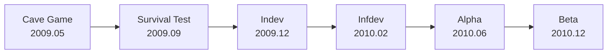

> **本章命题**：早期更新把「未完成」收成一种可见的周更。玩家付钱，不是因为游戏做完了，是因为他们看见自己正在把它写成游戏——信任和锁定同时发生。

## 问题

上一章把 Cave Game 停在一个姿态上：能跑就给人玩，玩的人会告诉你这是什么游戏。姿态还不是产业。产业需要有人反复回来，并且愿意先付钱。

2010 年 6 月底，Minecraft 进入 Alpha，标价 9.95 欧元，承诺：现在买，后面所有更新——包括所谓的正式版——都算在这一次里。游戏没有结局，没有过场，没有广告预算，客户端也谈不上防盗。按当时的产品常识，这不像能卖的东西。

可它卖了。开卖头一个月，Notch 就在博客里数到了两万份销量。有人愿意给一份明显没做完的程序付钱。本章要解释的不是「独立游戏感动了玩家」这种气氛，而是一套具体的机制：更新节奏如何把玩家变成共同作者，以及共同作者为什么会变成付费用户。

## 为什么有人愿意给未完成游戏付钱

未完成通常是折扣的理由，不是加价的理由。Alpha 能反过来，是因为未完成被做成了**可观察的增量**。

Notch 几乎把工作台搬到了街上：博客、Twitter、论坛截图。合成和熔炉先来，然后世界变大、变无限，再往后能和朋友进同一张图——每一件都落在马上就能玩到的客户端里。买家看见的不是路线图上的承诺，是昨天还能玩、今天又多了一点的客户端。增量可见，信任才有东西可绑。看不见增量的未完成，只是跳票。

第二件，付出的钱买的不是「通关权」。Cave Game 已经把通关卸掉了。钱买的是**继续住在这个正在变的世界里的资格**，外加一张事后会被证明很值钱的票：正式版不必再买一次。住过的人明白，存档比客户端贵。付钱，有一部分是在保自己已经改过的那块地，还有一部分是在赌这块地还会被允许继续改。

第三件，付钱的人同时在买作者席的入场券。更新不是从封闭工作室里扔出来的补丁包，是一场可以插嘴的公开施工。你骂、你建议、你录视频给别人看，都可能在下一周变成方块。共同作者当然也可以白玩；但当时那圈人很小，付钱更像把「我在场」说清楚——赞助开发，也给自己发一张工地通行证。

可被证伪的说法是：他们付钱只是因为没法白玩。Classic 浏览器版还在，盗版几乎没有门槛。支付行为更接近可见施工下的自愿购票，而不是被锁死的消费。若当时有的是三年一张的 PPT 和无法游玩的预购，这一章的解释就垮了。

这件事后来被讲成「先卖再修」的神话。它证明过一种很窄的情况可以成立：**循环已经完整、增量人人看得见、作者本人还在回帖。** 它没有证明你可以在任何品类里卖空气。卷三会拆这张神话的限度；本章只记下它第一次成功时，成功的是什么。

## 从有限到无限

公开开发不是在原地打磨同一张图。世界本身被改写了几次。先把这一年的路铺开：

Survival Test、Indev、Infdev——这三个名字值得当成设计事件读，而不是版本号清单。名字本身就在剧透：Indev 是 in development（开发中）的缩写，Infdev 是 infinite development（无限开发）。这一年真正的事，是把世界本身的形状改了三次。

**Survival Test**（2009 年 9 月）往空循环里加进了压力：生命、怪物、死亡。上一章说目标被卸掉了；这里加回来的不是任务，是节奏。没有人发给你「今晚请活下来」的纸条，天黑了一样会来。玩家开始给自己找事做——挖洞、点火、垒墙——因为世界开始会咬人。这是生存作为意义机器的雏形，不是关卡设计师把第一关摆好了。

**Indev**（2009 年 12 月）把世界收成一个盒子。有限，有边，做完一圈你能知道自己住在哪。合成、物品栏、熔炉、最初的种植，把「挪方块」变成了工作台。盒子很重要：它让家成为可能。无限的荒野上，家只是一个姿势；看得见边的盒子里，家是对这张图的占领。Indev 的有限不是技术没做好，是让居住有一圈临时的墙。

**Infdev**（2010 年 2 月）把墙拆了。无限——更准确说，是「走下去还会有地方」这句修辞——把游戏从一张地图改成一个地平线。你再也无法用「我把这张图看完了」当结束条件。探索不再是清房间，而是承认「别处」永远存在。内容的主要生产者也换了：盒子里是作者和玩家一件件摆出来的东西；无限世界里，内容由地形噪声成批生产，群系随后把「别处」染上不同的气候和样子。

这是设计事件，不是性能演示。无限一旦成立，官方就更没有理由给你摆关卡：关卡在无限里会显得像几粒沙子。玩家的目标外包被地理放大了——不是没事可做，是做不完。卷三会写区块怎样流式加载、噪声怎样铺地形、极远处的裂缝怎样把修辞撞回实现；本章只取结论：Infdev 让「世界比一局游戏活得长」从姿态变成了空间契约。你走不完，所以你只能住。

<Figure src="/images/alpha-v1.2.6.png" alt="Minecraft Alpha v1.2.6 的游戏画面：海滩、海洋与岛屿，左上角显示版本号，底部是生命值与物品栏" caption="Alpha v1.2.6（2010 年 12 月，Beta 前夕）。无限地形已经铺开，生存的节奏（生命条）与居住的雏形（空着的物品栏）同框。图源：Minecraft Wiki。" />

后来的世界边界、高度上限，乃至离出生点极远处因浮点精度失真而长出的扭曲地形——玩家叫它「远地」——都是这句契约的脚注：契约许诺得越远，实现就迟早在哪里裂开。脚注裂的时候，契约本身早已写在 Alpha 的公开施工里。

## 反馈闭环：论坛、YouTube、口碑

共同作者不是荣誉称号，是一条比广告便宜也比广告硬的管子。

管子的一端是 Notch 还在亲自看的地方：TIGSource 的帖、博客留言、Twitter。有人嫌水奇怪，有人要更多的块，有人把游戏玩断。下一周的客户端里，常常能指认出这些声音。不是每一条都采纳——采纳得太多，空规则会被填满，起源处的减法会废掉——但采纳发生得足够频繁，玩家会形成一种预期：说话可能有用。

管子的另一端很快变成影像。Minecraft 在烂画质下仍然可读：方块是整数，动作是「对着那一格」，教程不必靠字幕才能跟。有人把自家的洞、第一夜、莫名其妙的建筑录下来，别人照着做，做完再改。传播的不是欣赏，是可执行的指令。YouTube 在这里不像营销渠道，像第二套说明书，而且说明书是玩家写的。

没有投放。没有代理公司把「方块游戏」卖给目标受众。口碑搬运的是存档和手法，不是卖点句。这解释了为什么后来官方一旦改手感、改合成、改世界生成，会有人觉得被偷走了作者权——他们确实在场施工过。卷一后面写版本政治，会回到这个预期：共创一旦成立，更新就不再是礼物，是对共同作者的立法。

闭环的风险也在这里。听得见的声音，永远不是全体用户。当时那圈人偏电脑、偏论坛、偏愿意看开发者说话。Alpha 的 Minecraft 被写成什么样，有一部分是这圈人的合成。儿童、家庭、教育、主机——那些后来涌进来的人，并没有参加这次施工。把 2010 年的共识当成永恒的「社区意愿」，是把第一批共同作者误认成全体人民。

## 和别人住在同一个世界

Classic 很早就有多人，但那是创造式的：同一张沙盘上堆方块。生存多人到 2010 年 8 月才真正能玩，Alpha 把这件事从「共用积木」推进成「在同一套会咬人的规则里过夜」。

差别很大。创造式的多人更像共用一套积木。生存多人会逼出政治：食物、洞穴、箱子、谁拆了谁的墙。游戏几乎不提供法律——没有领地，没有日志，没有管理员面板——于是法律以最原始的形式出现：信任，或者不信任。Grief 不是外挂发明的玩法，是开放世界的缺省。有人因此离开，有人因此发明规则，有人把无规则本身玩成实验。服务器作为另一种游戏，种子已经埋下；第 5 章再展开。

多人还把「世界即库存」社会了。你挖走的山，是别人明天的风景。你放下去的方块，可能被当成邀请，也可能被当成挑衅。单人档里，改地形只对自己负责；多人里，改地形是发言。Cave Game 卸掉的作者关卡，并没有留下真空——关卡设计师的位子，被每个拿着镐的人轮流坐。

早期多人很烂：掉线、物品复制、毫无门槛的破坏，管理工具几乎为零。烂并不妨碍它成为理由。许多人付钱，是因为听说能和朋友进同一张图。产品演示不是过场动画，是另一个人的角色在你的地平线上走。

## 付费 Alpha：信任与锁定同时发生

把上面几件事收成交易，就是 Alpha 的价格。

**信任这一侧。** 施工可见，作者还在回帖，循环已经能玩，承诺「买一次覆盖到正式版」。钱像是把开发从爱好变成职业的那根杠杆。买家不是在买成品，是在为一种他们已经参与的写法续命。价格后来涨过——越早买越便宜——这把「我当时在场」做成了可炫耀的时间戳，也把早期用户绑进利益：游戏死了，他们的票先作废。

**锁定这一侧。** 存档、熟人、已经学会的手法、已经拍过的视频，都是沉没成本。客户端越好盗，社会成本越沉：你的家不在盗版里，在你跟别人共同记得的那张种子里。付钱因此不只是道德，是把自己的世界登记进官方还认的那一套更新里。共同作者被买成了安装量。安装量反过来要求更新不能停。停更就等于驱逐已经住进去的人。

两边是同一枚硬币。没有信任，锁定是勒索；没有锁定，信任只是好评。Alpha 让它们同时发生，所以能在没有广告的情况下长成后来的体量。这也是为什么「Minecraft 卖的是游戏」这句话从一开始就不准。它卖的是继续参与施工的资格，外加一块会被你自己越改越贵的地。

下一章工作室化和正式版，会把这枚硬币交给组织：设计权离开一个人的 Twitter，周更变成版本政治。起源部在这里收束——空循环已经证明自己能活成生意。活成生意之后，它还会不会愿意继续空着，是另一件事。

## 这一章留下什么

- **爱好者**：你（或你看过的那些人）不是「抢先玩了内测」。Alpha 把说话、录像、同住一张图，收成了正式的作者工作。后来你对更新发脾气，脾气的根在这儿：你曾经真的在场。
- **开发者**：能抄走的是可见增量 + 已能玩的循环 + 买一次覆盖到完成。抄不走的是第一批共同作者恰好愿意给施工现场付钱，以及无限世界把「做完」从地理上取消掉。先卖再修不是许可，是一份很窄的合同；合同条款写在这一年的公开开发里，不写在鸡汤里。
