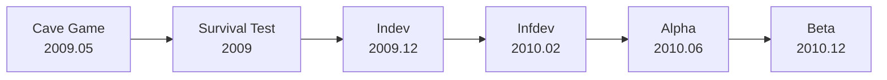

上一章停在 2009 年 5 月：一个很小的方块原型已经能让玩家直接改变世界，但 Minecraft 还远没有成为后来那款游戏。

接下来一年，它变化得快得有些不像同一个项目。生命值、怪物、物品栏、合成、熔炉、昼夜、程序生成的无限世界先后出现；版本名也直白得像开发日志——Survival Test、Indev、Infdev，直到 2010 年 6 月才正式进入 Alpha。

这些名字后来很容易被我们读成一条早就规划好的路线。可站在当时，玩家看到的更像是一份不断改写的程序：今天还能玩的东西，下个月可能已经换了一套世界规则。

特别的是，他们不必等到这一切完成以后才进场。

## 游戏还没定型，玩家已经进来了

Minecraft 很早就把开发中的版本公开给玩家。Classic 可以直接在浏览器里玩；到 Indev 时，继续开发中的生存分支已经和 Premium 账号绑定。游戏还在不断试验自己的规则，玩家就已经可以付费进入这条仍在变化的版本线。[^paid-history]

这改变了开发和玩家之间的时间关系。

传统上，玩家接触到的是某个相对稳定的版本：设计过程发生在前面，体验发生在后面。早期 Minecraft 则把两件事叠在了一起。玩家昨天刚学会一套规则，今天可能就出现新配方、新地形或新的生存压力；而开发者也能很快看到这些变化被怎样使用。

这种公开并不意味着玩家集体设计了 Minecraft。Notch 仍然做了大量带有个人判断的选择，论坛意见也不会自动变成下一版功能。但玩家与开发过程之间的距离确实非常近：更新日志、博客、论坛讨论和实际游玩几乎同时发生。对早期玩家来说，“Minecraft 是什么”并不是一个已经写好的答案。

## 生存让世界开始反抗玩家

2009 年下半年的 **Survival Test** 给原本偏创造式的方块空间加进了另一种关系：生命、敌对生物、伤害和死亡开始出现。

这一步重要的地方，不只是 Minecraft “终于像游戏了”。此前，改变世界主要由玩家主动发起；加入生存压力之后，世界也开始反过来要求玩家回应。黑暗、敌人和受伤会打断原本随意的行动，于是挖洞、封门、寻找安全位置不再只是造型选择。

这里还没有后来完整的生存循环，也没有必要把它提前总结成一套成熟设计哲学。更直接的变化是：**可修改的空间第一次和风险结合起来了。** 同样一堵墙，在纯创造环境里可能只是建筑；在有怪物的世界里，它也可能是庇护。

## Indev：越来越多的东西开始互相连接

到 2009 年底和 2010 年初的 **Indev** 阶段，Minecraft 开始长出后来非常熟悉的一些中间层：物品栏、合成、熔炉、火把、农作物，以及更多可以被采集和加工的资源。合成系统在 2010 年 1 月底加入，农业等系统也很快跟上。[^indev-crafting]

这些功能单独看都不神秘，放在一起却改变了玩家和方块的关系。挖下一块石头不再只是让墙上少一个立方体，它可能进入物品栏，再被加工成工具或建筑材料；世界里的东西开始在“地形”“资源”“物品”之间来回转换。

Indev 的世界仍然是有限的。今天回头看，很容易把这种有限解释成某种精心设计的“居住感”，但没有必要替当时的技术阶段补上这种意图。它首先就是开发中的世界生成方案：规模、形状和规则都还在变化。

真正值得注意的是，Minecraft 已经不再只是一个放方块的空间。不同系统开始互相接上：地形提供资源，资源进入库存，库存又支持新的行动。后来所谓“生存”“建造”“探索”之所以很难完全拆开，雏形正是在这里慢慢出现。

## Infdev：地平线不再是地图边缘

2010 年 2 月进入 **Infdev** 后，变化发生在更大的尺度上：世界生成开始朝近乎无限的方向发展。版本名本身就是 *infinite development* 的缩写。2 月 27 日前后的版本已经开始生成无限世界。[^infdev]

```mermaid
flowchart LR
    A["Cave Game<br/>2009.05"] --> B["Survival Test<br/>2009"] --> C["Indev<br/>2009.12"] --> D["Infdev<br/>2010.02"] --> E["Alpha<br/>2010.06"] --> F["Beta<br/>2010.12"]
```

有限地图和不断向前生成的世界，给玩家的感觉并不一样。前者总有一个隐含的问题：这张地图还有多大？后者则把注意力从“把地图看完”转向“我还要不要继续走”。探索不需要作者提前摆满关卡，只要地平线后面仍然可能出现新的地形。

这当然不是字面意义上的数学无限。区块、坐标、存储和数值精度都会把“无限”拉回工程现实，后来甚至会出现著名的 Far Lands。技术细节留到第三卷再讲。这里更重要的是体验上的变化：**世界第一次显得比一次游玩大得多。**

而且，程序生成的世界一旦可以持续展开，开发者和玩家之间也出现了另一种分工。开发者不可能手工制作玩家将看到的每一座山和每一个洞穴，他更多是在写“世界如何产生”的规则；玩家面对的，则是一块连开发者本人也没有逐格看过的地形。

## 更新本身也成了值得等待的东西

进入 2010 年以后，Minecraft 的更新频率很高。Notch 在 6 月开始全职开发 Minecraft；Alpha 阶段还出现了著名的 **Seecret Friday Updates**，矿车、地牢、红石、船等系统在很短时间里陆续进入游戏。[^alpha-timeline]

对玩家来说，这意味着“回来看看这周又多了什么”本身就成了一种节奏。新版本不只是修复旧游戏，也可能明显改变旧世界里的行为：多一种材料、多一种机制、多一种生成方式，都足以让已经熟悉的存档重新出现值得尝试的东西。

论坛、博客和后来越来越多的视频又把这种变化传播得更快。一个人发现的新机制，很快会被别人复现；某个奇怪行为可能先成为论坛话题，再变成服务器玩法。这里不必把社区浪漫化成“共同开发团队”，但可以确认一点：Minecraft 的更新从很早开始就不是只发生在下载页面上，它会立刻进入玩家之间的讨论和实验。

这也为后来的版本文化埋下了一个很深的习惯：玩家不仅在玩 Minecraft，也在持续比较“这一次 Minecraft 又变成了什么”。

## 一个还没完成的游戏，为什么已经有人付钱

到 2010 年 6 月 17 日，Minecraft 已经超过 20,000 份销量；6 月 30 日进入 Alpha 时，价格从约 €5 提高到约 €10。[^alpha-sales] 这时它已经同时具备了几个很特别的条件：有人愿意付钱，开发仍在高速推进，而玩家每天接触到的产品本身也还在明显变化。

当时的购买页面也很特别：玩家购买的是**当前就能玩的版本**，同时早期 Alpha 购买者还得到一个后来影响很长的承诺——未来版本和更新无需再次付费。到 2010 年 12 月进入 Beta 时，Notch 专门说明这个承诺会继续对 Alpha 买家有效。[^alpha-promise]

为什么这种模式能工作，没必要神秘化成“玩家愿意为梦想买单”。更现实的条件是：买家已经能看到和玩到东西，而且变化是连续可见的。昨天的版本不是一张概念图，今天的更新也不是几年后的路线图；产品虽然没有完成，但已经有足够具体的体验让人判断自己喜不喜欢。

另一方面，低价也把“现在加入”和“以后再买”做出了差别。Alpha 比未来正式版便宜，购买又包含后续更新。这既帮助开发获得收入，也让早期玩家更容易接受一个仍在变化的产品。

它后来会成为 Early Access 最常被提起的成功故事之一，但这里最容易学错。Minecraft 并没有证明“未完成也可以卖”；它最多说明，在某些情况下，**已经成立的核心体验、持续可见的开发和清楚的购买承诺，可以让未完成不再等于不可购买。**

## 多人把世界从“我的”变成“我们的”

Classic 很早就有多人建造，但 Alpha 时期生存多人逐步可玩，意义发生了变化。2010 年 7 月出现了通过互联网测试 Survival Multiplayer 的版本，之后多人功能继续完善。[^alpha-multiplayer]

在创造式多人里，两个人主要是在同一张沙盘上搭东西；在生存世界里，他们还共享资源、危险和时间。你挖掉的一面山壁，会成为别人回来时看到的地形；箱子里的东西、门口的坑、通往矿洞的路，也开始拥有社会意义。

这时 Minecraft 仍然几乎没有后来服务器熟悉的领地、权限、日志和经济系统。规则缺席带来的问题很快就会出现：合作、偷窃、破坏、管理员权力，以及“这个世界到底属于谁”。这些会在后面的服务器章节展开。

这一章只需要看到，多人让公开开发形成的另一种关系变得更具体：玩家不只是在等待开发者改游戏，也开始在彼此的世界里制造变化。

## 到 Alpha 结束时，Minecraft 仍然没有定型

2010 年 12 月，Minecraft 从 Alpha 进入 Beta。Notch 当时把 Beta 描述为一个会更强调 polish、content、testing 和 stability 的阶段，同时价格从 €9.95 上涨到 €14.95。[^beta-announcement]

这很像一道自然的分界线：前一年多里，Minecraft 的基本形状还在快速长出来——生存、合成、无限世界、多人、红石、下界都陆续出现；到了 Beta，问题开始慢慢从“它还能长出什么”变成“这些东西怎样被组织成一个更完整的产品”。

但 Alpha 留下的影响已经很难倒回去了。Minecraft 的玩家是在游戏尚未定型时认识它的，他们习惯了版本变化，也习惯了开发过程本身公开可见。以后每一次大改动，都会面对这段历史留下的预期：玩家会把更新当成自己长期生活的世界被重新书写。

下一章，个人项目开始真正变成工作室，Minecraft 也会第一次更认真地面对“完整游戏”意味着什么。

## 这一章留下什么

- **爱好者**：Alpha 之前和 Alpha 本身不是等待“真正 Minecraft”到来的过渡期。生存、合成、无限世界和多人就是在这些公开版本里逐渐接到一起的，玩家也因此习惯了 Minecraft 会不断改变。
- **开发者**：公开开发最值得学的不是高频更新本身，而是尽早让一个已经有判断价值的核心体验进入真实玩家手中。收费、反馈和版本节奏可以支持这个过程，但不能代替核心体验本身。

[^paid-history]: Minecraft 的付费访问早于 Alpha 正式阶段。Indev 已要求 Premium 账号访问；到 2010 年 6 月 30 日进入 Alpha 时，价格从约 €5 提高到约 €10。参见 Minecraft Wiki 的事件年表：<https://theminecraftwiki.com/wiki/chronology-of-events/>。

[^indev-crafting]: Minecraft 官方后来回顾，合成系统在 Java Edition Indev 0.31 的 2010 年 1 月 29 日版本中加入；农业系统随后在 2 月加入。参见 Minecraft 官方 Taking Inventory：<https://www.minecraft.net/en-us/article/taking-inventory--string>、<https://www.minecraft.net/fi-fi/article/taking-inventory--wheat>。

[^infdev]: Infdev 于 2010 年 2 月进入开发阶段，2 月 27 日前后的版本开始引入无限地图。参见 Minecraft Wiki 事件年表：<https://theminecraftwiki.com/wiki/chronology-of-events/>。

[^alpha-timeline]: 2010 年 6 月 1 日 Notch 开始全职开发 Minecraft；6 月中下旬连续更新矿车、地牢等内容，7 月初加入红石。参见 Minecraft Wiki 事件年表与 Alpha 条目：<https://theminecraftwiki.com/wiki/chronology-of-events/>、<https://theminecraftwiki.com/wiki/java-edition-alpha/>。

[^alpha-sales]: 2010 年 6 月 17 日 Minecraft 超过 20,000 份销量；6 月 30 日正式进入 Alpha，价格从 €5 提高到约 €10。参见 <https://theminecraftwiki.com/wiki/chronology-of-events/>。

[^alpha-promise]: Alpha 购买者曾被承诺获得未来版本与更新。2010 年 12 月宣布 Beta 时，Notch 明确表示这一承诺继续对 Alpha 买家有效。归档见 The Word of Notch：<https://blog.omniarchive.net/post/2175441966/minecraft-beta-december-20-2010/>。

[^alpha-multiplayer]: 2010 年 7 月 22 日进行了通过互联网的 Survival Multiplayer 测试，之后 Alpha 生存多人继续迭代。参见 <https://theminecraftwiki.com/wiki/chronology-of-events/>。

[^beta-announcement]: Notch 于 2010 年 12 月 11 日宣布 Minecraft 将在 12 月 20 日进入 Beta，并说明 Beta 会更重视打磨、内容、测试和稳定性；价格上调至 €14.95。见 <https://blog.omniarchive.net/post/2175441966/minecraft-beta-december-20-2010/>。
