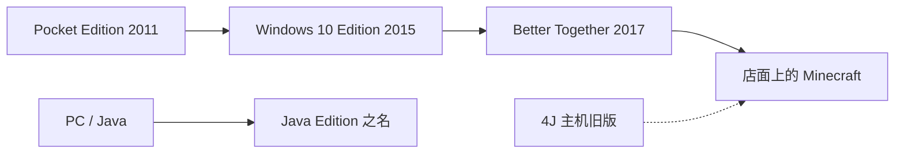

> **本章命题**：两个 Minecraft 不是同一游戏的两个皮肤。跨平台需要一条可进商店、可管账号、可卖内容的产品线；Java 那条第二作者河进不去这张桌子。分裂一旦被品牌说成「都叫 Minecraft」，就变成债：每次更新都要解释，为什么买一份仍然不是全部。

## 问题

最常见的误会发生在收银台。

家长买了手机上那个叫 Minecraft 的东西，以为电脑上的模组世界也能进去。Java 玩家把红石机器截图发给主机上的朋友，机器在那边不亮。Windows 商店里有一个「Minecraft」，minecraft.net 上曾经另卖一个「Java Edition」。2022 年以后电脑端终于捆成一份，官方仍要补一句：它们还是两款游戏。[^bundle]

上一章写过：收购真正先落地的是分发，不是战斗更新。分发一旦落到微软自己的商店和账号上，就会逼出一条问题——买一份，为什么不能玩全部？可被证伪的说法是：这只是移植损耗，把 Java 再写一遍 C++，两边就会长成同一个游戏。只要还看见准连接只活在一边、存档打不开、模组进不了 Marketplace，这句话就不成立。损耗可以补。语义分叉补不掉。

本章要回答的不是「两边差在哪几个方块」。要回答：为何存在两个 Minecraft，以及分裂如何从权宜变成品牌债。

<Callout type="warning" title="禁止的读法">
Bedrock 不是「C++ 版 Java」，也不是「优化过的正作」。删掉句中的 Java 或 Bedrock，句子对另一边仍成立，才可以合写。否则拆开。[《体例与方法》](/prelude/method) 把这条写成纪律；本章把它写成史实。
</Callout>

## 「买一份能玩全部」为何做不到

「Minecraft」这个词在货架上做过偷换。2017 年之后，能跨设备联机的那条线占用了光秃秃的名字；原来的 PC 版被改名为 Java Edition。官方自己定下口诀：能玩到一起的，叫 Minecraft；玩不到一起的，带 Edition。[^bt-faq] 于是出现一种日常错位：孩子在 Switch 上玩的是「Minecraft」，父母在电脑上装模组时发现那不叫这个名字，或者叫了也进不去。

错位不是客服话术没写清。错位是产品结构。一份购买对应的是一份客户端、一套存档格式、一张作者席、一种联机范围。手机买的是 Bedrock 的触控客户端，进的是 Xbox 账号和 Marketplace；Java 买的是 jar 和那条模组河。两边都挖、都放、都看。度量衡看起来一样。合同不一样。

2022 年 6 月 7 日，PC 上的 SKU 被焊在一起：一份钱拿两套客户端，已有其中一份的人免费领取另一份。官方同时写明：Java 与 Bedrock 仍是各自带独特功能的分离游戏；你只是默认两份都有，从同一个启动器进。[^bundle] 焊的是收银台。没焊世界、没焊红石、没焊模组。商店页还要另写一行：Java 存档与 Bedrock 不兼容。[^store-incompat] 所以「买一份」在 2022 年之后对 Windows 电脑大致成立，对「玩全部」仍然不成立。手机、主机、课堂许可，各是各的合同。

<Note>
PC 捆绑改变的是谁还需要再付一次钱。它不改变两个世界是否同一份物理。后文的债，都写在「名字已经统一、机制还没有」这一层。
</Note>

做不到，还有一层更硬的：作者席。Java 的完整产品从来不是货架上的客户端，是内核加上模组、插件、资源包。[《模组作为第二作者》](/history/mods-as-authors) 写过三条河。Bedrock 的扩展面是附加包、脚本 API、以及必须经过审核的 Marketplace。河岸不同，水权不同。你无法用一份购买，把 Forge 那种共同立法，送进 iOS 的审核和主机的内容分级。不是懒。是两条产品要进的房间，对「谁可以改程序」的答案相反。

## Pocket Edition 到 Bedrock：跨平台是产品逻辑

双引擎不是 2014 年才发明的。2011 年 8 月 16 日，Pocket Edition 作为 Xperia Play 独占上架，定价 6.99 美元；同年 10 月铺开其他 Android，11 月上 iOS。[^pe] 它从第一天起就不是 Java 客户端的缩小版。它是另一份程序：C++、触控、无线局域网里的短会话。收购之前，这条河已经在手机付费榜上替 Minecraft 说话。[^ms-announce]

2015 年 7 月 29 日，Windows 10 上市当天，Windows 10 Edition Beta 走进微软商店：同一条 C++ 河，Java 玩家可免费领取，并预告与 PE 联机。[^win10] 这是交割后第一份产品级声明。声明的内容不是「我们更懂方块」，是「Minecraft 现在可以出现在我们的分发管道里」。管道一旦分开，移植就结束了，产品线开始了。

真正的命名仪式在 2017 年 9 月 20 日。Better Together Update 把手机、Windows 10、VR 和 Xbox One 收进同一份 Bedrock 引擎，跨平台联机，DLC 跟账号走，游戏在这些设备上只叫 Minecraft。[^bt] 官方 FAQ 把话说明白：这条引擎他们从 2012 年就在养；能玩到一起的，占用光秃秃的名字；Java 继续更新，并且为此加人。[^bt-faq] Nintendo Switch 于 2018 年 6 月 21 日跟上；PlayStation 4 于 2019 年 12 月 10 日以 1.14 进入同一张桌子。[^ports] 4J 那条主机旧版变成遗物：还能开，不再是「Minecraft」这个词默认指向的东西。

跨平台的逻辑很干净，干净到像一句正确的商业句子：家庭里有手机、平板、主机、电脑，孩子要在同一张世界里见面。要见面，就得有同一套协议、同一套身份、同一套可在各商店上架的二进制。Java 做不到这件事——不是因为它「老」，是因为它的第二作者河要求改程序，而应用商店和主机平台不允许你把共同立法装进审核过的包。教育版选 Bedrock，[《影像、教育与一代人的媒介》](/history/media-education) 已经下过这一刀：课堂要设备矩阵，不要 Forge。

<Alternative title="为什么不把 Java 做成跨平台">
把 jar 搬上手机和主机，看起来能少养一条引擎。代价是把模组河一并搬进 App Store 和主机认证，或者在搬的路上把河填掉。填掉，Java 就不再是 Java；搬进去，商店审核、内容分级、账号与家长控制会先把河掐死。Bedrock 不是对 Java 的优化，是对「可上架、可联机、可管」的另一次实现。另一次实现从第一天就接受：有些误用，进不了这张桌子。
</Alternative>

可被证伪的说法是：双产品线是微软不会做游戏的证据。时间线反对它。PE 在收购前三年就存在；Bedrock 引擎官方自己说从 2012 年养起。[^bt-faq] 微软改变的是规模和命名权：把可治理的那条线做成默认的「Minecraft」，把不可治理的那条线做成带姓氏的 Edition。规模是真的。发明权不是 2014 年才有。

<Constraint name="可治理的那条线占用本名" verdict="凑合" chain="跨平台 → 商店与账号 → 功能分裂">
这条约束解决了家庭设备矩阵，也解决了教育、主机、手机的上架。它同时把品牌词交给了语义更窄的那一份实现。名字统一，机制不统一，利息按版本结算。
</Constraint>

## Marketplace：货架不是模组河

2017 年 4 月 10 日，Marketplace 被写成一件善事：让创作者靠地图、材质、皮肤过日子；Pocket 和 Windows 10 的玩家在游戏里就能买到经过策展的社区作品；应用商店抽成 30% 之后，创作者拿大头。[^mp-announce] 6 月 1 日随 Discovery Update 上线。[^mp-launch] Better Together 再把它铺到主机。句子听起来像承认第二作者。合同不是。

货架要的是可审核、可定价、可跟账号走、可对家长交代的商品。模组河要的是改物理、改法律、每个大版本自己续命——1.13 的世界扁平化把方块的编号与数据值整个重排过一遍，那一年大半模组要重写才能跟上——署名在论坛 ID 上。Marketplace 上线时的门槛写得很清楚：启动阵容是有名有姓的工作室，后续投稿需要注册过的公司。[^mp-announce] 这不是「社区变现」的中性接口。这是把第三条河——换皮、换地图、换皮肤——收进客厅，把第一条河留在院子里。附加包可以改行为和外观，仍然过审核；Forge 那种新动词，没有对应的货架 SKU。

Better Together 还做了另一件事：把服务器收进游戏内浏览器。上线时的合作服是 Lifeboat、InPvP、Mineplex；要进这张名单，同样需要注册公司，并且接受 Xbox Live 账号、家长控制和内容安全条款。[^bt-faq] 主机上甚至不能随便填 IP。Java 那边，「服务器即新游戏」发生在任意地址上，立法者是服主。[《服务器即新游戏》](/history/servers) 写过那种宪法。Bedrock 这边，宪法要先通过商店和合作计划。Hypixel 那种东西缺少的不是方块，是进浏览器的资格。

<Memoir title="创作者拿到的是货架席，不是作者席">
Java 模组作者改的是世界里可以发生什么，报酬长期是署名和捐赠。Marketplace 伙伴改的是可以上架什么，报酬是 Minecoins。两件事都被叫做 UGC。一个卖的是立法权，一个卖的是商品。社区反弹冲着「官方在卖我们以前免费做的东西」；更准确的怒气是：官方在用货架，替换作者席，还让品牌假装这是同一件事。
</Memoir>

反弹不是因为创作者不该吃饭。吃饭是正当的。反弹是因为吃饭的那张桌子，顺便改写了「谁可以当作者」。你仍可以在 Java 里免费分发模组；你不能把那套立法权，装进叫 Minecraft 的默认客户端。默认客户端现在跟孩子的平板是同一个词。词一旦被货架占用，工地要自己解释自己不是盗版、不是危险、不是「不给孩子的那种」。解释本身就是债。

可被证伪的说法是：Marketplace 只是模组文化的移动版，审核只是为了安全。只要附加包仍不能稳定地提供工业电网那种新陈代谢，而皮肤包可以，审核的选择就写在货架上：安全是理由，作者权是结构。[《模组、服务器与灰色经济》](/history/grey-economy) 会把礼物河、Rank 和影子账本放在同一张桌上；这里先钉死：两种 UGC 不能兑换。

## 功能分裂：不是皮肤，是两套物理

「总有些小差异，我们会尽量同一窗口发更新。」这是 2017 年的官方句子。[^bt-faq] 句子把分裂说成进度问题。有些差异确实是进度：某个生物群系晚几个月。有些不是。不是的那一批，才是债。

| 层 | Java | Bedrock | 债 |
| --- | --- | --- | --- |
| 红石 | 准连接被官方标成「就是这样」 | 无准连接，时序与活塞另一套 | 同一名词，两套因果 |
| 战斗 | 1.9 起攻击冷却、盾、双持 | 长期更接近冷却前的连点手感 | 手感成为版本身份，不是数值补丁 |
| 世界 | Anvil / 区域文件 | LevelDB | 一份购买仍迁不了十年存档 |
| 作者席 | 模组、插件、数据包 | 附加包、脚本、Marketplace | 第一河没有货架 SKU |
| 联机 | 任意 IP、社区服务端 | 账号、合作服、主机限制填 IP | 「服务器即新游戏」被收编进浏览器 |

红石是最干净的样本。Java 里，活塞、发射器、投掷器可以被上方那一格的信号激活，哪怕那一格是空气。社区叫准连接；Wiki 把它标成 Java 独有；Mojira 把对应 Java 行为标成 Intended。[^qc] Bedrock 没有这套。玩家的经验不是「那边优化更好」，是「我的门在朋友的世界里是坏的」。红石在卷二要写成可误用系统。可误用一旦分叉，误用就无法跨产品线传播。官方可以说差异很小。对把世界当成计算机的人，差异就是两种语言。

战斗是第二种身份。Java 1.9 把冷却、盾和双持捆进 Combat Update。[^combat] 喜欢的人得到更像战斗的战斗；不喜欢的人把 1.8 做成一种政治。Bedrock 长期没有把这套手感当成同一件事来执行。于是出现一种奇怪的版本身份：有人用「还能连点」辨认自己在哪条产品线上。手感本该是设计。在双端里，手感是护照。

世界格式是第三种。Java 把区块写进区域文件；Bedrock 把世界放进 LevelDB。转换器后来出现，官方商店仍把不兼容写进购买说明。[^store-incompat] 十年存档比引擎活得久——这是后文技术卷要反复说的话。双产品线把这句话收成悲剧：活得久的那份记忆，可能活在另一条买不到、迁不走的河里。

<Impl title="为什么转换器补不了产品线">
转换器处理的是方块和实体的近似映射。它不处理准连接是否存在，不处理模组添加的方块实体，不处理插件写在服务端里的法律。能把地形搬过去，不等于把游戏搬过去。所以「有转换器」不能写成「其实是一个游戏」。它证明需求真实：人们想住在同一份记忆里。它也证明产品拒绝把记忆当成同一份合同。
</Impl>

作者席和联机，前面已经写过。表里再出现一次，是为了禁止一种懒惰的总结：把分裂收成「手机版比较简单」。手机版早就不简单。它简单的是治理。治理简单的产品，才会被放进默认的名字。

## 账号与分发如何反过来塑造设计

分发看起来像管道。管道会回流到设计桌上。

Bedrock 的联机从一开始就长在 Xbox 身份上。Better Together 的 FAQ 写明：进服务器要 Xbox Live 账号；家长可以关聊天、把多人限制成仅好友或完全关掉；合作服要执行 Xbox 行为准则。[^bt-faq] 这不是附加选项。这是这条产品线能进家庭和课室的条件。条件一旦成立，设计就必须提供：可关闭的聊天、可举报的玩家、可跟随账号走的皮肤和地图、可在审核里活下来的扩展面。Marketplace 不是后来贴上去的商店。它是这条身份管道的商品层。

Java 长期活在另一套身份里：Mojang 账号、自己的会话服务器、任意 IP。2020 年 10 月，官方宣布 Java 也要搬进微软账号：强制，否则几个月后登不进去；好处写成双重验证、家长控制、同一账号玩所有 Minecraft 游戏。[^migrate] 自愿迁移在 2022 年 3 月 10 日结束为「不迁就玩不了」；整场搬家在 2023 年 9 月 19 日关门。[^migrate-end] 搬家不是技术偏好。搬家是把 Java 也接上那条已经在 Bedrock 上跑通的治理管道。

管道立刻有了设计形状。2022 年 7 月 27 日，Java 1.19.1 加上玩家举报和聊天签名；官方解释：私服他们并不监听流量，但任何规模的服务器都受 EULA 和社区准则约束，玩家仍可向 Mojang 举报。[^chat] 工地听见的是：立法权从服主桌上，分出一角给平台。对了或错了，本章不管。要管的是因果：账号体系一旦统一，Java 也无法再假装自己只是一份离线的 jar。跨平台的那套「保护孩子」句子，会要求所有叫 Minecraft 的东西交出抓手。抓手改变聊天，改变启动器，改变谁还进得去老账号里的世界。

分发还改变更新政治。两条线要在「相似的时间窗口」发同一主题版本。窗口一旦成为承诺，Java 的快照实验和 Bedrock 的 Preview 就不再只为自己的玩家服务，还要为品牌的同一张海报服务。海报需要同一只生物、同一句口号。口号不需要同一套准连接。于是出现一种稳定的不满意：Java 玩家觉得被拖去迁就主机；Bedrock 玩家觉得功能总是晚一拍；两边都觉得对方才是被偏爱的孩子。不满意的对象其实是同一张海报。海报是分发的语言。语言要求一个 Minecraft。桌上有两个。

<Callout type="info" title="下一章的桌子">
版本投票、主题更新、实验玩法，都在这张双端海报上开会。官方与社区抢的不是某一个方块，是谁有权说「这还是不是同一个游戏」。本章只把会场摆好：会场有两套物理，却只有一个名字。
</Callout>

## 这一章留下什么

- **爱好者**：你没有买错。你买到的是合同写明的那一份：Java 的作者席，或 Bedrock 的设备矩阵。红石机器搬不过去，不是你不会打方块，是因果在另一条产品线上根本没被实现成同一种东西。名字叫 Minecraft 的，不必能进你的存档。
- **开发者**：能抄走的是「跨平台是产品选择，不是移植任务」——要进商店、课室和家庭设备，你往往得另做一条可治理的实现，而不是把模组河塞进审核。抄不走的是：你没有一个已经被一代人说会的名字，可以让两条语义不同的客户端共用；没有这个名字，双端就是两次产品。有了这个名字，双端就是债。你若把 Bedrock 写成 C++ 版 Java，会看不懂货架、账号和准连接为什么不能一起修好。

[^bundle]: 2022 年 6 月 7 日起，*Minecraft: Java & Bedrock Edition for PC* 成为 Windows PC 上原版 Minecraft 的标准且唯一售卖形式；已有其中一版的玩家免费获得另一版。官方写明：「To be clear, Java and Bedrock will remain separate games with their own distinctive features. The only difference is that now you get both by default when buying Minecraft for your Windows PC」。见 Mojang，<https://www.minecraft.net/en-us/article/java---bedrock-edition-pc-out-june-7>。

[^store-incompat]: Xbox / Microsoft Store 商品页注明：「Worlds/saves from Minecraft: Java Edition are not compatible with Minecraft: Bedrock Edition。」Java 可运行于 Windows、macOS、Linux；消费级 Bedrock 的 PC 端为 Windows。见 <https://www.xbox.com/en-us/games/store/minecraft-java-bedrock-edition-for-pc/9nxp44l49shj>。

[^bt-faq]: Better Together FAQ（2017 年 9 月 20 日）。关键口径包括：用于统一主机、移动与 Windows 10 的是 2012 年起开发、当时已用于移动 / VR / Windows 10 的 Bedrock Engine；「if a version can play together with the others, it's called Minecraft」；Java 改名是为了与可联机的版本区分，并承诺继续支持且已为 Java 团队加人；与 Java 的差异「There will always be small differences」，更新计划在相近时间窗口；进服务器需要 Xbox Live 账号，主机联机遵循平台政策；上线合作服为 Lifeboat、InPvP、Mineplex，申请者须为注册企业。见 <https://www.minecraft.net/en-us/article/better-together-faq>。

[^pe]: Minecraft: Pocket Edition v0.1.0 alpha 于 2011 年 8 月 16 日作为 Sony Ericsson Xperia Play 独占发布，Android Market 标价 6.99 美元；同年 10 月 7 日开放其他 Android 设备，11 月 17 日发布 iOS。当代报道见 Wired，<https://www.wired.com/2011/08/minecraft-pocket-edition/>；Engadget，<https://www.engadget.com/2011-08-16-minecraft-pocket-edition-hits-android-market-only-xperia-play-u.html>。版本年表见 [Pocket Edition v0.1.0 alpha](https://minecraft.wiki/w/Pocket_Edition_v0.1.0_alpha)。

[^ms-announce]: 2014 年 9 月 15 日微软收购公告称 Minecraft 已是美国 iOS / Android 付费应用前列、Xbox 上最热门的在线游戏，并写明将继续在 PC、iOS、Android、Xbox、PlayStation 上提供。见 <https://news.microsoft.com/source/2014/09/15/minecraft-to-join-microsoft/>。

[^win10]: Minecraft: Windows 10 Edition Beta 于 2015 年 7 月 4 日 Minecon 宣布，7 月 29 日随 Windows 10 进入 Windows 商店；已有 Java / PC 版的玩家可免费领取。Owen Hill 说明其带有 Pocket Edition 特征，并预告与 PE 联机。见 Windows Experience Blog，<https://blogs.windows.com/windowsexperience/2015/07/04/announcing-minecraft-windows-10-edition-beta/>。

[^bt]: Better Together Update（Bedrock Edition 1.2.0）于 2017 年 9 月 20 日发布，统一 Xbox One、移动、VR 与 Windows 10 上的跨平台联机，并将这些版本的消费名改为 Minecraft。见 Mojang，<https://www.minecraft.net/en-us/article/better-together-update-here>；Windows Experience Blog，<https://blogs.windows.com/windowsexperience/2017/09/20/better-together-update-minecraft/>。

[^ports]: Bedrock 于 2018 年 6 月 21 日登陆 Nintendo Switch；于 2019 年 12 月 10 日随 1.14.0 登陆 PlayStation 4。见 [Bedrock Edition](https://minecraft.wiki/w/Bedrock_Edition)。

[^mp-announce]: 2017 年 4 月 10 日 Mojang 宣布 Marketplace：Pocket 与 Windows 10 将可在游戏内浏览、下载社区制作的冒险地图、材质与小游戏；启动伙伴包括 Noxcrew、BlockWorks 等；投稿须为注册企业。关于分成的原话：「when a cool skin or map gets purchased, the app store platforms take a 30% cut, but creators get the majority after that。」见 <https://www.minecraft.net/en-us/article/its-time-discover-marketplace>。The Verge 同日报道，<https://www.theverge.com/2017/4/10/15242732/minecraft-marketplace-announced-user-generated-content>。

[^mp-launch]: Marketplace 随 Pocket / Windows 10 的 Discovery Update（1.1）于 2017 年 6 月 1 日上线。见 Mojang，<https://www.minecraft.net/en-us/article/marketplace-quick-guide>。

[^qc]: 准连接（quasi-connectivity）使活塞、发射器、投掷器可被「上方那一格若存在机构方块时会被激活」的信号激活，即使该格为空气；Wiki 标为 Java Edition only。Java 端对应行为在 Mojira 以「works as intended」结案（MC-108）。Bedrock 侧有多条「没有准连接」的工单。见 [Tutorial:Quasi-connectivity](https://minecraft.wiki/w/Tutorial:Quasi-connectivity)、[Redstone mechanics](https://minecraft.wiki/w/Redstone_mechanics)；Bedrock 工单如 [MCPE-14664](https://bugs.mojang.com/browse/MCPE/issues/MCPE-14664)。

[^combat]: Java Edition 1.9（Combat Update）于 2016 年 2 月 29 日发布：攻击冷却、双持 / 副手、盾等。见 [Java Edition 1.9](https://minecraft.wiki/w/Java_Edition_1.9)。攻击冷却为 Java 机制，Bedrock 战斗模型与此长期分叉；概述见 [Damage](https://minecraft.wiki/w/Damage)。

[^migrate]: 2020 年 10 月 Mojang 宣布 Java Edition 将强制迁移至微软账号，否则数月后无法登录；新购从当年秋季起直接创建微软账号。见 <https://www.minecraft.net/en-us/article/java-edition-moving-house>。

[^migrate-end]: 自愿迁移于 2022 年 3 月 10 日截止为「不迁移则无法游玩 Java」。见 <https://www.minecraft.net/en-us/article/last-call-voluntarily-migrate-java-accounts>。账号搬家于 2023 年 9 月 19 日关闭，此后未迁移账号无法再迁。见 <https://www.minecraft.net/en-us/article/account-migration-last-call>。

[^chat]: Java Edition 1.19.1 于 2022 年 7 月 27 日加入玩家举报与聊天签名。官方说明：私服流量不被监听，但任何规模服务器仍受 EULA、商业使用准则与社区准则约束；举报由人工审核。见版本说明 <https://www.minecraft.net/en-us/article/minecraft-java-edition-1-19-1>；政策说明 <https://www.minecraft.net/en-us/article/addressing-player-chat-reporting-tool>。
