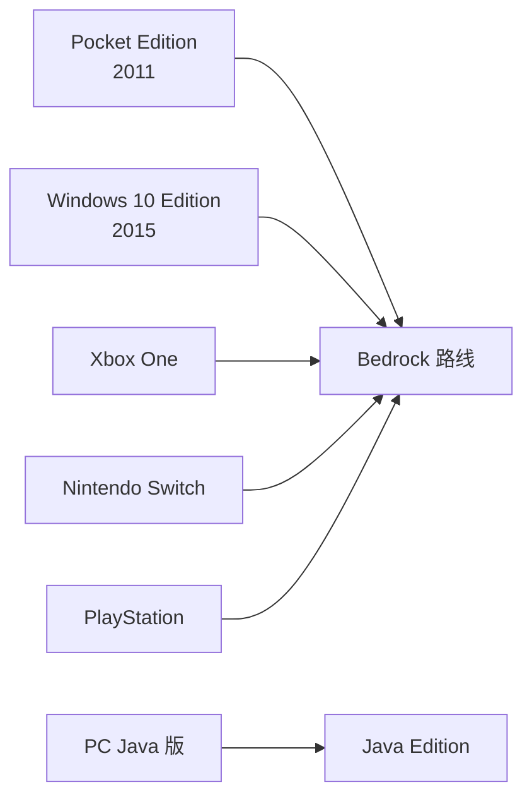

今天在 Windows PC 上购买 Minecraft，会同时得到 **Java Edition** 和 **Bedrock Edition**。

它们可以从同一个启动器打开，也会在相近时间收到同一批新方块、生物和大型更新。但真正点进去以后，很多东西仍然无法互通：Java 存档不能直接拿到 Bedrock 里继续玩，Java 玩家不能直接加入 Bedrock 世界，模组生态不同，一些红石和战斗行为也不同。

2022 年把两版捆绑销售时，Mojang 自己说得很清楚：**Java 和 Bedrock 仍然是两款独立游戏，只是 Windows PC 玩家默认同时拥有两款。**[^bundle]

这可能是理解两条产品线最好的起点。

问题已经不是“为什么还没有合并”。更值得问的是：**Minecraft 为什么会走到需要长期维护两套实现的地步？**

## 第二个 Minecraft 早于微软收购

两条产品线的起点并不是 2014 年微软收购。

2011 年，Minecraft 还在 Beta 时，**Pocket Edition** 就已经出现在 Xperia Play，随后登陆其他 Android 设备和 iOS。[^pe] 手机显然不能直接照搬当时的 Java PC 客户端：硬件更弱，输入是触摸屏，平台 API 不同，应用也要经过移动商店发布。

于是 Pocket Edition 从一开始就是另一份实现。

早期 Pocket Edition 功能非常少。没有无限世界，没有完整的生存系统，也缺少大量 PC 版内容。它更像是在回答一个很实际的问题：**Minecraft 最少需要保留什么，才能在手机上仍然像 Minecraft？**

后来手机性能提升，Pocket Edition 逐渐把生存、无限世界、红石、命令等系统补回来。但代码基础和平台环境已经与 Java 版分开了。

与此同时，Xbox 360、PlayStation 等主机上还有由 4J Studios 维护的 Console Edition。也就是说，在微软收购 Mojang 之前，“Minecraft”其实已经不是一份代码跑遍所有设备，而是多个团队让相似的游戏体验分别适应不同平台。

这点很重要。后来 Bedrock 的出现，并不是大公司突然决定“重写 Java”，而是把一条已经存在多年的非 Java 路线逐渐做大、做统一。

## 从 Pocket Edition 到 Bedrock

2015 年，Windows 10 Edition Beta 进入 Microsoft Store。它和 Pocket Edition 属于同一条技术路线，并很快开始支持彼此联机。[^win10]

真正的大合流发生在 2017 年的 **Better Together Update**。

Mojang 当时宣布，移动设备、Windows 10、Xbox One 和 VR 上的版本将逐渐统一到同一个 Bedrock Engine，并实现跨平台联机。官方还给出了一条很直白的命名规则：能够彼此联机的版本直接叫 **Minecraft**；原来的 PC 版则正式使用 **Minecraft: Java Edition** 这个名字。[^bt-faq]

```mermaid
flowchart LR
  PE["Pocket Edition<br/>2011"] --> Bedrock["Bedrock 路线"]
  Win10["Windows 10 Edition<br/>2015"] --> Bedrock
  Xbox["Xbox One"] --> Bedrock
  Switch["Nintendo Switch"] --> Bedrock
  PS["PlayStation"] --> Bedrock
  Java["PC Java 版"] --> JE["Java Edition"]
```

Bedrock 的价值很好理解。

一个家庭里可能同时有手机、平板、Windows PC、Xbox、Switch 和 PlayStation。如果这些设备使用同一套协议、账号和内容体系，玩家就可以更容易地进入同一个世界。Mojang 在 Better Together 的说明里也反复强调 cross-platform play、Realms 和大型服务器。[^bt-faq]

这不是单纯的代码优化问题，而是产品边界发生了变化。Minecraft 不再只需要在不同设备上“都能运行”，还要让这些设备上的玩家能够彼此连接。

## 那为什么 Java 没有被淘汰

如果 Bedrock 能覆盖这么多平台，一个很自然的问题就是：为什么不干脆停止 Java Edition？

最简单的答案是：**Java Edition 已经积累了太多自己的历史。**

到 Bedrock 真正统一平台时，Java 已经运行了八年。无数存档、服务器、模组、插件、资源包、地图、启动器和开发工具都建立在这条线上。它不是一份可以无成本替换的旧客户端。

更重要的是，Java 的开放运行环境形成了一种非常特殊的社区生态。玩家可以运行自己的服务端、修改客户端、安装第三方加载器和模组，也可以长期停留在某个旧版本。这些行为并不都是 Mojang 正式设计出来的，但已经成为大量玩家理解 Minecraft 的方式。

Bedrock 面对的环境则完全不同。它要进入 iOS、Xbox、PlayStation、Nintendo Switch 等平台，而这些平台对程序分发、账号、安全和可执行代码都有自己的限制。Minecraft 不可能简单把 Java 的整个模组生态原封不动搬进去。

所以 Java 与 Bedrock 的差别，不只是 Java 和 C++ 两种语言。

它们背后连接的是两种不同的历史环境：

| | Java Edition | Bedrock Edition |
| --- | --- | --- |
| 主要平台 | Windows、macOS、Linux | Windows、Xbox、PlayStation、Switch、Android、iOS 等 |
| 联机范围 | Java 玩家之间 | Bedrock 支持的平台之间跨设备联机 |
| 存档 | Java 自己的世界格式 | Bedrock 自己的世界格式 |
| 社区扩展 | Mod Loader、模组、插件、数据包、资源包 | Add-On、Script API、资源/行为包、Marketplace |
| 服务器入口 | 社区服务端、任意地址等 | Realms、合作服务器；具体入口受平台限制 |
| 开发预览 | Snapshot | Preview / Beta |

这张表不是为了判断哪边“更好”。它说明的是：**两边要解决的问题本来就不完全相同。**

Java 更像一条历史连续性很强的 PC 产品线；Bedrock 更像一条围绕设备覆盖、跨平台联机和统一服务扩展出来的产品线。

## 共享内容，不等于共享实现

今天打开 Java 和 Bedrock，会发现它们表面上已经非常接近。

大型版本通常会在相近时间发布，新生物、新方块、新群系也大多同时出现。Mojang 在 2017 年就明确表示，两边会继续存在一些差异，但未来计划让更新处在相近时间窗口。[^bt-faq]

这种内容同步很容易给人一种感觉：既然看起来差不多，剩下的差异迟早都会被修掉。

有些确实可以。

某个 UI 晚一点加入、一种方块状态暂时缺失、一项功能先在某一边测试，这些都可能通过后续更新逐渐拉平。

但还有一些差异已经进入玩家长期使用的规则里，修复它们反而会破坏兼容。

### 红石就是最典型的例子

Java Edition 的红石存在 **准连接（quasi-connectivity）** 等历史行为。它最初并不像一套刻意设计好的电子学规则，却被社区长期利用，最终成为大量机器的基础。Bedrock 并没有完全复现同一套行为。[^qc]

于是同一个“活塞门”，可能在 Java 正常运行，在 Bedrock 需要重新设计。

从引擎开发角度看，这似乎只是两个实现的差异；对玩家来说，它却是已经积累十多年的知识和作品。要让两边完全一致，并不是把一个布尔值改成相同这么简单，还要考虑多少旧世界会因此失效。

这也是 Minecraft 很特殊的一种兼容问题：**Bug、边缘行为和更新顺序，只要被玩家长期拿来创造东西，就可能变成事实上的接口。**

### 战斗也曾长期不同

Java 1.9 在 2016 年加入攻击冷却、盾和副手系统。[^combat] Bedrock 很长时间没有采用完全相同的战斗节奏。

这种差异比“少一个方块”更难统一，因为它直接改变输入手感、PvP 习惯和服务器规则。一个版本长期形成的玩法社区，会反过来提高修改成本。

所以所谓 parity——两版功能一致——并不是简单的待办清单。越靠近基础规则，历史兼容的重量越大。

## 两套世界，也意味着两套记忆

最直观的分裂其实发生在存档上。

Java 和 Bedrock 使用不同的世界存储方式，官方商店也明确注明两边的世界/存档并不直接兼容。[^store-incompat]

第三方转换工具可以搬运大量方块、实体和地形，但转换不是等价执行。模组添加的内容怎么办？红石时序不同怎么办？插件写在服务器里的规则怎么办？

因此，把世界从一边转换到另一边，更像是在尽量翻译，而不是把完全相同的游戏状态复制过去。

这件事之所以重要，是因为 Minecraft 的存档寿命可能比一台电脑、一套引擎甚至一个平台周期都长。

对普通游戏来说，玩家换版本通常只是重新下载客户端；对 Minecraft 来说，玩家可能带着十年前的建筑、服务器和红石机器一起迁移。两条产品线于是意味着：**同一个品牌下面，也存在两种不同的世界历史。**

## Marketplace 不是 Java Modding 的替代品

Bedrock 还有一个 Java 没有的核心产品层：**Minecraft Marketplace**。

2017 年，Mojang 宣布 Marketplace，让经过合作计划的创作者可以在游戏内出售皮肤、材质、地图和小游戏等内容。平台商店抽成之后，创作者获得剩余收入中的主要部分。[^mp-announce]

这让 Bedrock 的社区内容第一次拥有了一条直接进入官方客户端、跨设备购买和更新的商业渠道。

它和 Java 模组文化很容易被放在一起比较，但两者实际上解决的是不同问题。

Java 模组生态允许开发者深度修改游戏，甚至增加新的机器体系、世界生成和核心规则；代价是版本兼容、安装复杂度和平台碎片化。

Marketplace 更强调**可分发、可购买、可审核和跨设备使用**。它非常适合地图、皮肤、资源包以及 Bedrock 支持的 Add-On 内容，却不是 Forge 或 Fabric 的官方替代品。

<Note title="两种 UGC">
Java Modding 更接近“给游戏增加或修改系统”；Marketplace 更接近“通过官方渠道分发社区内容”。它们有重叠，但并不是同一种作者权限。
</Note>

这也是为什么“Bedrock 有 Marketplace，所以 Java Modding 已经被官方化”并不准确。Marketplace 确实让创作者获得了正式销售渠道，但 Java 的第三方模组生态仍然在解决另一类需求。

反过来也一样：把 Marketplace 简单说成“收费模组”也会漏掉它真正的产品价值——主机和手机用户不需要自己下载第三方文件、处理版本和依赖，就能直接获得经过平台分发的内容。

## 一个名字，两套入口

2017 年以后，Bedrock 路线在大多数平台上直接使用 **Minecraft** 这个名字，而传统 PC 版本叫 **Java Edition**。这会让产品关系看起来有点奇怪：为什么“Java”要特别说明版本，另一边却不用？

答案主要来自 Better Together 的品牌逻辑：能够互相联机的那些平台被收在同一个名字下面。[^bt-faq]

但品牌统一并不会自动消除技术差异。

2022 年，Mojang 在 Windows PC 上进一步把购买层统一：购买 Minecraft 会同时得到 Java 和 Bedrock，拥有其中一版的玩家也会免费获得另一版。[^bundle]

这是一个很有意思的产品决定。

它没有强迫 Mojang 在技术上立刻合并两套游戏，也没有要求玩家选择哪一边“才是真的 Minecraft”。它只是把最容易令人困惑的一层先处理掉：**至少在 Windows PC 上，不必为了尝试另一版再买一次。**

于是 Java 与 Bedrock 出现了一种少见的关系：

> **商业上可以作为一个购买项，技术上仍然是两个客户端。**

这可能也是目前最现实的折中。

完全统一意味着必须处理大量存档、服务器、模组、平台认证和机制兼容问题；完全放弃其中一边，又会失去已经长期存在的玩家和创作者生态。于是两条线继续并行，同时尽量共享更新主题与内容。

## 两条产品线留下的不是一道简单的技术债

把 Java / Bedrock 分裂称作“技术债”并没有错，但只说技术债还是太窄。

如果 Minecraft 只是一个普通软件项目，维护两套实现当然显得浪费；可它早已不是只有代码需要兼容。

Java 背后有十多年的 PC 存档、模组和服务器文化；Bedrock 背后有移动端、主机、跨平台家庭联机、Marketplace 和不同平台的发行要求。

所以真正难合并的不是两份源代码，而是两边已经各自拥有的**用户历史**。

这也解释了为什么同一个更新可以看起来几乎一致，却仍然有人坚持自己是“Java 玩家”或“Bedrock 玩家”。Edition 不只是程序版本，也逐渐变成一种使用环境。

下一章会进一步讨论这个问题的另一面：[《版本演进与更新策略》](/history/version-evolution)。当一个拥有十多年旧世界、不同平台和不同玩家习惯的游戏继续更新时，官方究竟怎样决定哪些旧规则要保留、哪些又可以改掉？

## 这一章留下什么

- **爱好者**：Java 与 Bedrock 不是“正版和简化版”的关系，也不是同一个程序换了两种皮肤。它们共享 Minecraft 的大部分内容，却各自带着不同的平台历史、社区工具和存档，因此很多差异不能只靠等待下一次更新消失。
- **开发者**：跨平台不是把已有程序编译到更多设备上那么简单。平台限制、联机协议、账号、分发、UGC 与历史兼容都会反过来塑造实现；当两套产品都积累了真实用户和作品以后，“统一”本身也会变成需要权衡破坏面的产品决策。

[^pe]: Minecraft: Pocket Edition v0.1.0 alpha 于 2011 年 8 月 16 日首先在 Xperia Play 发布，随后扩展到其他 Android 设备与 iOS。版本历史见 [Pocket Edition v0.1.0 alpha](https://minecraft.wiki/w/Pocket_Edition_v0.1.0_alpha)；当代报道见 Wired：<https://www.wired.com/2011/08/minecraft-pocket-edition/>。

[^win10]: Microsoft / Windows Team，《Announcing: Minecraft: Windows 10 Edition Beta》，2015 年 7 月 4 日。Windows 10 Edition 于 7 月 29 日进入 Windows Store，并基于 Pocket Edition 路线继续发展。见 <https://blogs.windows.com/windowsexperience/2015/07/04/announcing-minecraft-windows-10-edition-beta/>。

[^bt-faq]: Mojang，《Better Together FAQ》，2017 年 9 月 20 日。官方说明 Bedrock Engine 自 2012 年起用于移动、VR 与 Windows 10，并以 Better Together 统一 Xbox One 等平台；能够互相联机的版本统一使用 Minecraft 名称，传统 PC 版改称 Java Edition，同时承诺继续支持 Java。见 <https://www.minecraft.net/en-us/article/better-together-faq>。

[^bundle]: 2022 年 6 月 7 日起，Windows PC 上推出 *Minecraft: Java & Bedrock Edition for PC*。官方明确表示 Java 与 Bedrock 仍是两款拥有各自特性的独立游戏，只是购买其中一个 PC 产品即可同时获得两版。见 <https://www.minecraft.net/en-us/article/java---bedrock-edition-pc-out-june-7>。

[^store-incompat]: Microsoft Store / Xbox 商品说明明确指出 Java Edition 与 Bedrock Edition 的世界/存档并不直接兼容。见 <https://www.xbox.com/en-us/games/store/minecraft-java-bedrock-edition-for-pc/9nxp44l49shj>。

[^qc]: Java Edition 的 quasi-connectivity（准连接）是红石系统的历史行为之一，并未在 Bedrock 中以相同方式实现。参见 Minecraft Wiki：[Tutorial:Quasi-connectivity](https://minecraft.wiki/w/Tutorial:Quasi-connectivity) 与 [Redstone mechanics](https://minecraft.wiki/w/Redstone_mechanics)。

[^combat]: Java Edition 1.9（Combat Update）于 2016 年加入攻击冷却、盾牌和副手等机制。见 [Java Edition 1.9](https://minecraft.wiki/w/Java_Edition_1.9)。

[^mp-announce]: Mojang，《It's time to discover Marketplace!》，2017 年 4 月 10 日。Marketplace 允许合作创作者在 Bedrock 生态内出售地图、皮肤与材质等内容；官方说明应用商店平台抽取 30% 后，创作者获得剩余收入中的主要部分。见 <https://www.minecraft.net/en-us/article/its-time-discover-marketplace>。
