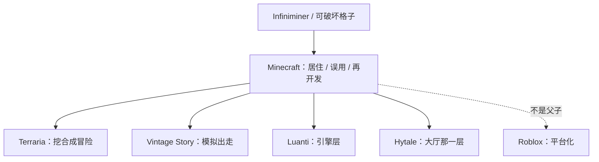

> **本章命题**：「下一个 Minecraft」难，不是因为方块被人抄走了。每年都有人抄皮。难的是抄不走时机、工具链和一代人已经会说的口语。真正的品类分叉不是另一个体素生存，是 Roblox 把世界收成商品、把工具收进编辑器、把分成收进商城——平台化对游戏化。

## 问题

每年都有人宣布自己在做「下一个 Minecraft」。宣传片里有格子、有镐、有无限、最好再加一句「这次我们会做对」。十年后，格子还在。口语没有换人。

上一章把开放和抽成写成互相排斥的一层：要河，就很难装覆盖全部 UGC 的收银台；要收银台，作者席就要进门。覆盖全部的那张单，会把媒介收成平台。有人把这张单开出来了。不是某个体素克隆。是 Roblox。它比 Minecraft 更早公开，也不靠抄格子起家。它走的是另一条路：世界是可以上架的体验，工具在 Studio 里，创作者从商城领分成。两边都能长出生态。不是同一品类里抢同一个冠军。

本章要回答：「下一个 Minecraft」为什么很难出现？可被证伪的说法是：只差一个画得更好、系统更密、宣发更猛的体素生存。只要还看见每年的 Minecraft-like 停在「像」，Roblox 长成另一代人的入口，而方块口语仍叫 Minecraft，这句话就不成立。像，可以做到。媒介，不行。

<Cards>
  <Card title="丢掉目标之后" href="/history/infiniminer" description="Cave Game 的关键不是加上方块，是减法。克隆常把减掉的东西加回去。" />
  <Card title="河还是收银台" href="/history/grey-economy" description="覆盖全部 UGC 的抽成单，会把媒介收成平台。" />
  <Card title="全书对照" href="/prelude/thesis" description="Roblox 是再开发的真正对照，不是画风不同的 UGC。" />
</Cards>

## 每年都有 Minecraft-like

影子来得很早。2011 年 7 月，Ars Technica 已经在写「方块阴影下的世界」：一堆游戏被叫成克隆，其中有的只是共用了 Infiniminer 那套可破坏格子，有的几乎是在描。[^ars-clones] Notch 当时把谱系和描摹拆开：Terraria 即便受过启发，仍是自己的游戏，他玩、他高兴；FortressCraft 那种公开否认、描得很像的，他觉得尴尬，但仍然认为别人有权那么做。[^ars-clones] 拆开这件事，比任何销量榜有用。谱系是承认父亲。描摹是想继承名声，不想继承减法。

后来每年都有新的描摹。Steam 标签上的生存、合成、体素、沙盒，足够让发行页看起来像同一句话。有的加了枪，有的加了载具，有的把格子换成更密的体素，有的把第一夜做成更狠的塔防。它们可以好玩。它们很少变成别人能住进去、改一改、再拿去给别人住的语言。语言需要被一代人说会，需要模组河和服务器宪法，需要影像把它教成口语。[《影像、教育与一代人的媒介》](/history/media-education) 写过那一层。克隆通常买得起格子，买不起口语。

描摹最常见的动作，是把 Cave Game 减掉的东西加回去：更明确的目标、更密的模拟、更像作者关卡的进程。[《从 Infiniminer 到 Cave Game》](/history/infiniminer) 把关键写成减法。加回去之后，得到的是一款更像「游戏」的游戏。这不丢脸。丢脸的是还把它叫做下一个 Minecraft——那个词指的是媒介，不是一箱更好的系统。

抄的人还经常把两个 Minecraft 画成一个座位。海报上的模组河、私人服、可改的 jar，是 Java；家长货架上、课室里、主机上的那一份，常常是 Bedrock。[《两条产品线》](/history/java-bedrock) 写过：它们不是两个皮肤。要取代口语，先要说清你取代的是哪一份。说不清，就只是在抢一张被说混了的海报。

可被证伪的说法是：只要体素生存够多，口语会自动换人。口语没有换。换的是货架上的同类项。同类项可以繁荣。媒介只有一个座位。座位不在画质上。

## 谱系：各继承了哪一层

对照不要做成评测。评测问谁更好玩。谱系问：各从 Minecraft 这套规则里拿走了哪一层，放下了哪一层。

**Terraria** 拿走的是挖、合成、夜、以及「世界里有东西可找」。它放回了大量游戏：Boss、进程、角色成长更像一条能打完的线。2011 年 5 月 16 日发售，和 Minecraft 的 Beta 重叠；两边共享更早的父亲，包括格子和生存，而不是互相抄作业那么简单。[^ars-clones] 它证明：同一套启发可以长成更像游戏的游戏，而且长得很好。它不证明「2D Minecraft」。它证明谱系可以分叉成冒险，而不必再开发成模组河。

**Vintage Story** 拿走的是再开发之后的不满。Tyron 先做总转换模组 Vintagecraft，觉得第三方模组 API 不够用；2015 年进过 Hypixel 做 Hytale，仍不是他要的体验；2016 年 2 月离开，自写引擎，把模组里的愿景做成独立游戏。[^vs] 这是模组河最硬的一种结局：河岸不够，就换河床。它继承的是「引擎限制了文明」，放下的是「空循环必须继续空着」。模拟更密、地质更真、进程更慢。密，是设计选择。密完之后，误用的空隙变窄。这不是攻击。这是承认：从模组出走的人，常常带走深度，留下空洞。

**Luanti**（原 Minetest）拿走的是引擎层。官方自己写过：celeron55 最初的计划就是做一个同类；社区后来把它长成可被再开发的体素平台；2024 年 10 月改名，就是为了摆脱「Minecraft 克隆 / 很像 Alpha」这句问候。[^luanti] 改名是谱系自觉。它继承再开发，放下那套已经被一代人说会的口语——口语仍叫 Minecraft。开源引擎可以让人住、让人改。它很难抢走课室、影院和家庭里已经教过的方块。引擎不是入口。入口是语言。

**Hytale** 拿走的是[服务器即新游戏](/history/servers)那一层。Hypixel 证明过：同一引擎上可以长出另一款被上万人同时玩的游戏。2018 年它把自己写成沙盒 RPG，2020 年卖给 Riot，2025 年 6 月开发停摆、工作室收摊，11 月创始团队买回，2026 年 1 月 13 日以抢先体验上线。[^hytale] 时间线不是八卦。时间线说明：最成功的大厅品牌，加上一家会做平台的发行商，仍然可以把「更好的 Minecraft」做成七年交不出媒介的项目。交得出的，是一款还在长的游戏。游戏可以复活。媒介窗口不会因为你曾经拥有大厅，就自动打开第二次。

<Note>
Hytale 此刻是抢先体验，不是结论。本章不评它好不好玩，只取它从哪一层出发、以及「大厅成功」为什么仍不等于「下一个 Minecraft」。
</Note>

四条谱系有一个共同点：它们都承认父亲，并且在某一层上长出自己。描摹不承认父亲，只想要座位。谱系有用。描摹每年都有。有用的对照到此为止。真正的分叉在旁边，而且年纪更大。

## Roblox：平台化对游戏化

Roblox 不是 Minecraft-like。2006 年由 David Baszucki 与 Erik Cassel 创办，比 Cave Game 更早。创始问题不是「如何挖方块」，是「人如何通过玩连在一起」。[^rb-rdc] 体验（他们后来把游戏改叫这个词）是上架的商品；Studio 是创作者的编辑器；Robux 是商城货币；2013 年 10 月的 DevEx 让合格创作者把赚到的币兑成法币。当时的门槛是 10 万 Robux 兑 100 美元。[^devex] 世界在这里是可以标价、可以分成、可以在推荐流里竞争的 SKU。工具不在那只放方块的手里。工具在编辑器里。玩家进的是别人做好的体验，很少是一块还可以被误用成计算机的物理。

收银台后来越来越像商店。2024 年 RDC，付费体验改成按美元标价：9.99、29.99、49.99 三档，创作者分成 50%、60%、70%。[^rb-rdc] 创作者吃饭被写进产品定义，这是平台化的诚实处。分成可以讨价还价，收银台从第一天就在。上一章说，覆盖全部 UGC 的抽成单会把媒介收成平台。Roblox 把这句话做完了。做完之后，再开发变成上架；居住变成「在这个体验里待多久」；误用变成平台规则允许的脚本。三者都还在，只是被收进商城的语法里。语法很强。它养得起职业创作者。它很难长出 Forge 那种每个大版本自己续命的立法权——立法权在 Studio 和平台政策里，不在玩家磁盘上的第二份程序里。Java 的第二份程序在磁盘上。Bedrock 的 Marketplace 已经朝货架走了一步。整条走完，就是这一节的对照。

Minecraft 走的是游戏化。世界是可居住的规则，工具就是挖放看那只手，作者席长期无法被平台抽成。[《全书的命题》](/prelude/thesis) 把 Roblox 写成再开发的真正对照。对照不是画风。对照是：商品对规则，编辑器对手，商城对礼物河。两边都能成为一代人的入口。Roblox 的入口是「去玩别人做的体验」；Minecraft 的入口是「去住一套还可以改的规则」。入口一旦说会，就很难互相翻译。翻译失败时，家长会把两个都叫成「孩子在方块里玩」。方块在 Roblox 里早就可以不是立方体。叫错的是品类。

<Alternative title="如果 Minecraft 当初做成平台">
把模组河收进官方编辑器和分成商城，2011 年就能看起来更像一门生意。代价是：作者席变成货架席，服务器宪法变成上架体验，误用要先过平台政策。你会得到更干净的抽成，失去那条没有 SKU 的河。Bedrock 的 Marketplace 是这条路的局部实验。Java 的院子还在，是因为标本禁止把立法权标价。整条做成 Roblox，Minecraft 就不再是这本书写的那个对象。对象变了，销量可以更大。那是另一个命题。
</Alternative>

可被证伪的说法是：Roblox 只是画风不同的 UGC，和模组河是同一件事。只要体验仍是上架商品、模组仍不能卖钱，这句话就不成立。同一件事不会一边强制抽成、一边把抽成写成对标本的背叛。

所以「下一个 Minecraft」若指的是下一个体素生存，名单每年都有。若指的是下一种被一代人说会的可居住规则，名单上最像的竞争者，往往根本不长方块。它长成平台。平台可以赢走时间。它赢不走那套已经被说会的挖放看——除非你把两个词混成一个品类。混，是营销。分，才是产业。

## 对开放世界、生存、沙盒、UGC 的具体影响

影响要写具体。具体到能被一款游戏证伪，而不是「开创了沙盒」这种谁都对的句子。

对**开放世界**：它证明世界可以没有主线仍被当成产品。无限不是地图面积，是「看不完也不必看完」。后来许多开放世界把面积做大，把任务做密，把空洞填成图标。图标是另一种加法。加法很有效。它不是 Minecraft 传下去的那一刀。传下去的是：居住可以当作结束条件的替代。谁把世界做成赛季清空的通行证，谁就在反对这一刀。

对**生存**：它把「活过今晚」做成大众语法，但不是发明者。Dwarf Fortress、Wurm Online 更早。[《从 Infiniminer 到 Cave Game》](/history/infiniminer) 写过父亲。它做的是把生存从重模拟和要塞管理里抽出来，收成挖、放、看加第一夜。之后十年的生存合成浪潮——收集、合成、撑过威胁——大量借用这套轻量循环，再把目标加回去。ARK、Rust、许多「第一夜」更狠的游戏，继承的是生存作为意义机器，不一定继承体素。体素不是生存的必要条件。空洞才是。

对**沙盒**：它把沙盒从关卡编辑器和玩具箱，推向「沙盒本身就是游戏」。创造模式后来被写成权限，不是另开一款关卡编辑器。[《Mojang、Beta 与正式版》](/history/mojang-beta) 写过 1.8 把创造合法化。后来的沙盒若只提供编辑器、不提供可住的物理，会更像工具。工具可以伟大。工具不是媒介。媒介要求误用有东西可误。

对 **UGC**：它把第二作者写成产品的一半，又拒绝把这一半收成商城。产业后来分叉：一条路把 UGC 做成平台抽成（Roblox、以及各种创意工坊）；一条路继续礼物河（模组、插件、地图）。Minecraft 两个都沾一点——Marketplace 是前者，Java 院子是后者——所以它看起来像谁都能抄。抄货架，得到皮肤店。抄院子，得到付不起房租的作者和影子账本。抄「既要又要」，得到双产品线那种债。[《两条产品线》](/history/java-bedrock) 写过债。债不是克隆者的错。债是既要河又要收银台的利息。

可被证伪的说法是：没有 Minecraft，开放世界、生存、沙盒、UGC 不会变成今天这样。没有它，这些词仍会存在，父亲也在。变的是大众入口和口语。口语一旦形成，后进者必须决定：跟它说话，还是另起一种语言。跟它说话的，成为谱系。另起语言且做成平台的，成为分叉。只描格子的，成为每年都有的那一页。

## 不可复制条件

「下一个」难在条件，不在秘密配方。配方可以写进卷二的原则清单。条件写在历史上，抄不走。

第一是**时机**。2009 到 2012，独立游戏还能靠浏览器和论坛活成共同作者；YouTube 正把实况收成一种新的说明书；付费 Alpha 把更新本身做成社交。[《Alpha 的公开开发》](/history/alpha) 写过信任加锁定。窗口关了。今天再做一次公开施工，面对的是商店算法、直播分成和已经会说方块的一代人。他们不会把你的 Alpha 听成创世。他们会听成「又一个方块游戏」。

第二是**工具链**。模组河不是发一张 SDK 就能有的。MCP、Forge、Bukkit、Fabric，是十几年把断裂当成生存条件养出来的。Luanti 证明引擎可以开源。开源不等于口语。没有那条被版本年年打断仍有人续命的河，再开发只是功能列表上的「支持模组」。

第三是**入口**。影像、课室、家庭把方块教成通用语。通用语一旦教完，座位就被占了。你可以做更好的物理、更美的光、更干净的 API。你很难让家长在说「孩子在玩方块」时，指的是你。微软 2014 年买的是这个入口，不是又一种生存循环。[《微软收购》](/history/acquisition) 写过。入口被买走之后，「下一个」还要同时赢过口语和拥有口语的公司。

第四是**标本**。一次买断、商品停在门口，让礼物河在伦理上说得通。没有标本，抽成是正经生意，开放是还没来得及装收银台。有了标本，抽成会像背叛，开放会像性格。性格抄不像。你可以宣布买断。你抄不走 2011 年当众铸好、又被[超过三亿份入场券](/history/revenue)反复证实的那句听成性格的话。

<Constraint name="媒介窗口不可复制" verdict="地基" chain="时机 → 工具链 → 口语入口">
原则可以迁移：最小动词、世界即库存、目标外包。窗口不能。窗口是历史里的一次性对齐：公开开发、影像说明书、可改的程序、买断伦理、还没有被占住的儿童语言。对齐过一次。下一次对齐会是别的东西，不会再叫 Minecraft。
</Constraint>

所以开发者若把原则当配方，会做出像但不长的东西。像，因为格子和生存可抄。不长，因为没有河、没有口语、没有那句不能拆的门。卷二第 16 章会把可拿走的十二条和抄不走的条件分开写。卷四才会禁止把「再做一遍 Minecraft」写成开工令。本章只把钉子钉在产业史上：每年都有人做出「像」。像不是失败。把「像」叫做下一个，才是看错对象。窗口关了。分叉已经发生。

Hytale 的七年、Luanti 的改名、Vintage Story 的出走、Terraria 的分叉、Roblox 的商城，从五个方向指向同一句：媒介不招标。招标的是游戏。游戏可以很多。媒介窗口关了，座位还在原来那套规则上。规则还允许被居住、误用、再开发。下一章问的是：谁来保存这些已经被住过的世界。能保存，媒介还在。只剩商标，就只剩 IP。

## 这一章留下什么

- **爱好者**：你玩过的「很像 Minecraft」可以很好玩。好玩不自动等于它会取代口语。Roblox 若占过你的时间，占走的是另一种入口：体验是商品。方块口语仍叫原来那个名字，不是因为克隆不够努力，是因为语言已经教完。
- **开发者**：能抄走的是品类选择——做成可居住的规则，或做成可上架的平台；两条路都能长生态，不要假装在做同一件事。抄不走的是 2009–2012 的窗口、十几年把断裂养成生存条件的工具链、以及已经被家庭和课表说会的入口。你若只抄格子和第一夜，会加入每年都有的那一页。你若做成平台，赢的是 Roblox 的座位，不是 Minecraft 的座位。两个座位都真。坐错的人，才会把「下一个 Minecraft」写成开工令。

[^ars-clones]: Andrew Webster，《Living under a blocky shadow: The world of Minecraft clones》，Ars Technica，2011 年 7 月 27 日。Terraria 开发者承认与 Minecraft 共享更早的 Infiniminer 谱系，同时强调自己是不同的游戏；Notch 公开说他爱玩 Terraria，并把 FortressCraft 一类近乎描摹的作品与谱系分开，同时仍认为别人有权那么做。见 <https://arstechnica.com/gaming/2011/07/living-under-a-blocky-shadow-the-world-of-minecraft-clones/>。

[^vs]: Vintage Story 官方 About：Tyron 与 Saraty 先做模组，再做成总转换模组 Vintagecraft；第三方模组 API 的限制越来越明显。2015 年 Tyron 受雇于 Hypixel 参与 Hytale，仍不是他们要的体验；2016 年 2 月离开，自写引擎，把 Vintagecraft 的愿景做成独立游戏。见 <https://www.vintagestory.at/aboutus.html/>。

[^luanti]: Luanti 官方博客，2024 年 10 月 13 日《Introducing Our New Name》：承认常被问「是不是 Minecraft 克隆 / 很像 Alpha」，并写明那就是 celeron55 最初的计划；改名是为摆脱这一影子，把项目写成可被再开发的游戏平台。见 <https://blog.luanti.org/2024/10/13/Introducing-Our-New-Name/>。

[^hytale]: 官方时间线：2025 年 6 月 23 日宣布停研、Hypixel Studios 收摊；2025 年 11 月 17 日创始人从 Riot 买回，并回到预告片所用的旧引擎。见 <https://hytale.com/news/2025/11/hytale-is-saved>。2026 年 1 月 13 日抢先体验上线：<https://hytale.com/news/2026/1/hytale-is-finally-here>。

[^rb-rdc]: David Baszucki，RDC 2024 开幕稿：与 Erik Cassel 于 2006 年创办 Roblox，驱动问题是 “How do humans connect through play?”；并宣布付费体验在桌面端按美元定价（9.99 / 29.99 / 49.99 美元），创作者分成分别为 50% / 60% / 70%。见 <https://about.roblox.com/newsroom/2024/09/rdc-2024-robloxs-next-frontier>。

[^devex]: Roblox，《Introducing Developer Central and the Developer Exchange》，2013 年 10 月：DevEx 上线，合格开发者可将赚到的 Robux 兑法币；当时门槛 100,000 Robux 兑 100 美元，单日兑付上限 500 美元。存档：<https://web.archive.org/web/20161225080352/http://blog.roblox.com/2013/10/introducing-developer-central-and-the-developer-exchange/>。
