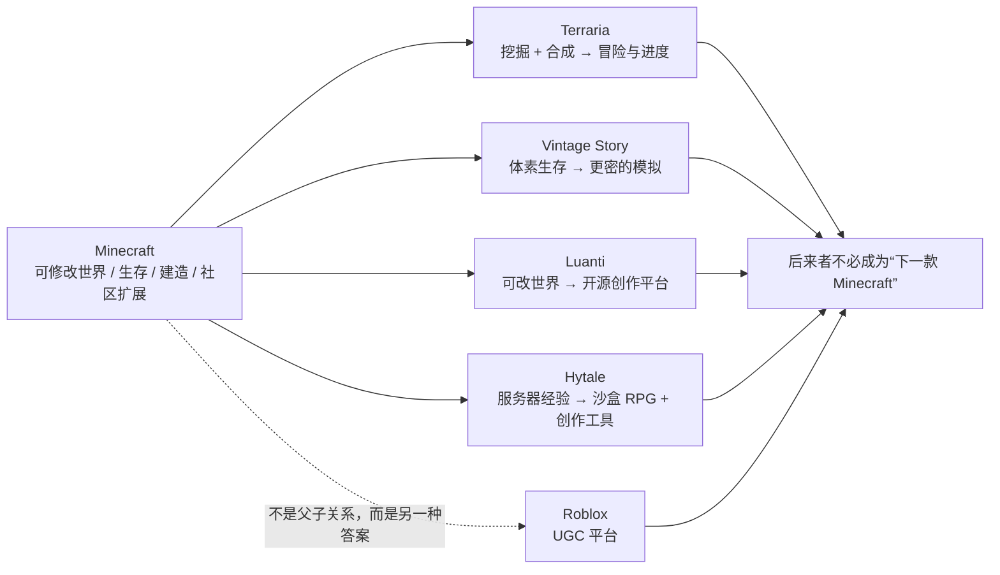

Minecraft 成功以后，“像 Minecraft”很快变成一种方便、也很粗糙的描述。

只要画面里有方块、挖掘、合成、程序生成或多人建造，一款游戏就可能被贴上 Minecraft-like 的标签。这个标签对商店分类很有用，对理解游戏却常常没什么帮助。

Terraria、Vintage Story、Luanti、Hytale 和 Roblox 都可以和 Minecraft 放在同一章讨论，但原因完全不同：有的继承挖掘与生存，有的从模组文化出走，有的直接把“可改的体素世界”做成引擎，有的从大型 Minecraft 服务器经验出发，也有的根本不是 Minecraft 后代，却提供了另一种 UGC 平台答案。

所以这一章不排“谁更像、谁更强”。

它要问的是：**Minecraft 之后，哪些设计和产品思路真的扩散到了整个行业？而哪些东西看起来容易复制，实际却依赖十几年积累出来的历史？**

## “Minecraft-like”其实混了很多不同的继承关系

2011 年，Minecraft 还没正式发布，媒体已经开始讨论大量所谓“Minecraft clones”。当时 Notch 自己也区分过两件事：受同一种设计谱系启发，和直接描摹另一款游戏，并不是一回事。[^ars-clones]

这个区别今天仍然有用。

一款游戏可以继承 Minecraft 的某一层，然后在别处彻底分叉：

- 继承**挖掘、采集与合成**，但做成更明确的冒险游戏；
- 继承**可修改的体素世界**，但把模拟密度做得更高；
- 继承**模组与脚本能力**，干脆把游戏做成创作引擎；
- 继承**服务器和社区玩法**，再把它重做成独立产品；
- 或者根本不继承体素，而是解决同一个更大的问题：怎样让玩家也成为内容生产者。

这样看，“Minecraft-like”就不再是一个类型，而是一组可能的亲缘关系。

```mermaid
flowchart LR
  MC["Minecraft<br/>可修改世界 / 生存 / 建造 / 社区扩展"]

  MC --> TE["Terraria<br/>挖掘 + 合成 → 冒险与进度"]
  MC --> VS["Vintage Story<br/>体素生存 → 更密的模拟"]
  MC --> LU["Luanti<br/>可改世界 → 开源创作平台"]
  MC --> HY["Hytale<br/>服务器经验 → 沙盒 RPG + 创作工具"]

  RB["Roblox<br/>UGC 平台"]
  MC -. "不是父子关系，而是另一种答案" .-> RB

  TE --> Q["后来者不必成为“下一款 Minecraft”"]
  VS --> Q
  LU --> Q
  HY --> Q
  RB --> Q
```

这张图故意没有画成“Minecraft 在上、所有后来者在下”的进化树。影响可以是真的，后来者也可以拥有完全独立的目标。

## Terraria：共享语言，不必共享方向

Terraria 是最早经常被叫作“2D Minecraft”的游戏之一。

这个称呼能帮助第一次见它的人理解一些表面特征：挖掘、方块、合成、昼夜、生物、程序生成世界。但真正玩下去以后，两者的重心很快分开。

Terraria 更愿意给玩家明确的装备梯度、Boss、区域门槛与战斗成长。探索经常服务于“我下一步能获得什么、打败什么”；世界可以被长期建设，但角色战斗能力和内容进度比 Minecraft 更强地组织着游玩。

这也是为什么把 Terraria 简化成“Minecraft 的二维版”会丢掉最重要的东西。

它更像一个很早就证明成功的分叉：**挖掘与合成并不天然要求开放式目标，它们也可以支撑一款进度非常明确的冒险游戏。**

2011 年关于 Minecraft 模仿与影响的讨论里，Terraria 开发者就承认过 Minecraft 与 Infiniminer 等作品带来的启发，同时强调 Terraria 有自己的方向；Notch 本人也公开表示喜欢它。[^ars-clones]

这类关系比“谁抄谁”更接近游戏设计真正的传播方式：动词和结构可以进入公共语言，组合以后却长成不同的作品。

## Vintage Story：从模组不满走向独立引擎

Vintage Story 和 Minecraft 的关系更直接，因为它真的从 Minecraft Modding 里长出来。

开发者 Tyron 和 Saraty 先制作 Minecraft 模组，后来发展出总转换模组 Vintagecraft。随着他们想修改的东西越来越深，第三方 Mod API 的限制也越来越明显。Tyron 在 2015 年还曾进入 Hypixel 团队参与后来成为 Hytale 的独立项目，但最终在 2016 年离开，开始为 Vintage Story 自己写引擎。[^vs]

这段历史很适合说明一种后来者为什么会出现。

它不一定是因为开发者觉得“Minecraft 做得不好”，更可能是因为**他们想改的那一层已经超出了 Mod 能舒服承担的范围**。

Vintage Story 最明显的分叉是模拟密度。

地质、气候、食物保存、陶器、金属加工和季节都获得了更细的规则。Minecraft 经常把现实过程压成几个很容易操作的方块与配方，Vintage Story 则愿意让过程本身成为玩法。

这不是“更真实所以更先进”。

更密的模拟会给玩家更多需要理解和准备的因果，同时也会提高学习成本、节奏和系统依赖。Minecraft 的简化与 Vintage Story 的细化，是两种不同的沙盒取舍。

所以 Vintage Story 最值得继承的历史意义，不是“Minecraft 玩家终于做出了完整版 Minecraft”，而是：**模组生态能够成为独立游戏的研发前史。**

## Luanti：把“可改”推进到引擎层

Luanti 的路线又不同。

它最初叫 Minetest。项目自己在 2024 年改名时非常坦率地回顾：创始人 celeron55 一开始确实是在 Minecraft Alpha 之后尝试做类似实验，但十多年后，项目已经从一个“像 Minecraft 的游戏”逐渐变成一个可以承载不同体素游戏、Mod 和脚本的开源平台。[^luanti-rename]

改名本身就很能说明这次转变。

Minetest 这个名字长期让外界先问“是不是 Minecraft 克隆”；Luanti 则希望把注意力放到 creation 和 Lua 上。官方今天把它定义为一个用于各种体素游戏的 game engine / platform，而不只是某一款默认游戏。[^luanti-docs]

如果说 Minecraft 的模组生态是在一个具体游戏周围长出第二层作者能力，Luanti 则把这件事进一步提前：

> **引擎本身就把“做另一款游戏”当作正常用法。**

玩家可以安装不同游戏和 Mod，开发者可以使用 Lua API 写内容，平台还提供统一内容浏览器。这让它和 Minecraft Java Modding 很像，却又少了一层必须围绕 Mojang 原版规则工作的约束。

代价也同样明显：平台能力并不会自动产生一个和 Minecraft 同等规模的默认世界、玩家文化或内容入口。

Luanti 因此是一个特别好的反例：**开放性可以被重新实现，生态规模却不是一个 API 特性。**

## Hytale：服务器经验并不会自动变成独立游戏

Hytale 是这几条谱系里最戏剧性的一条。

它来自 Hypixel 背后的团队。Hypixel 已经证明，他们非常擅长在 Minecraft 服务器上做地图、小游戏、运营和大规模多人内容。2018 年公开 Hytale 时，项目希望把沙盒 RPG、多人服务器、创作工具和 Modding 能力放进一款独立游戏。

这使它天然会被拿来和 Minecraft 比较。

但 Hytale 的开发史也提醒我们：**会在既有游戏上创造内容，和从头维护一整套引擎、客户端、工具链与产品，并不是同一种工作。**

项目后来经历长期开发、引擎重写、Riot 收购与 2025 年取消。随后原始创始团队重新买回 Hytale，放弃那次跨平台引擎重写，回到较早的代码基础，并在 2026 年 1 月 13 日把游戏以真正意义上的 Early Access 形式交给玩家。官方自己也明确提醒，当前版本仍然不完整、粗糙，许多功能缺失。[^hytale-ea]

这段经历不适合被拿来证明“Hytale 失败了”——它现在已经真正可以被玩家使用和继续观察。

反而更值得看到它暴露出的工程尺度：一款沙盒如果同时想要冒险内容、多人、服务器、Modding、创作工具和跨平台，就不是“把 Minecraft 加强一下”那么简单。这些能力彼此之间会形成巨大的技术和产品耦合。

有趣的是，2026 年 Early Access 的 Hytale 又回到一种非常早期 Minecraft 式的状态：游戏还没完成，创作者和服务器作者已经被邀请在第一天进入。[^hytale-ea]

它最终会长成什么，现在还不适合替它下结论。

## Roblox：不是 Minecraft 后代，却是最重要的 UGC 对照

Roblox 常常和 Minecraft 放在一起，因为两者都拥有大量年轻玩家、多人社交与用户创作。

但把 Roblox 称作 Minecraft-like 并不准确。Roblox 早于 Minecraft，并不是从体素生存游戏发展出来的。

它更适合回答另一个问题：**如果一开始就把“玩家创作内容”作为平台核心，而不是让创作生态在游戏周围慢慢长出来，会发生什么？**

Roblox 把创作工具、内容发布、账号、推荐、虚拟货币和创作者收入放进同一套平台。创作者在 Roblox Studio 中制作体验，用户在平台内发现和消费这些体验，符合条件的创作者还可以通过 Developer Exchange 把 Earned Robux 兑换成法币。[^roblox-devex]

这和 Minecraft Java 的路径差异很大。

Minecraft 的 Mod、服务器、整合包和工具链长期分散在 Mojang 官方之外；Roblox 则从产品结构上就更接近一个统一的创作与分发平台。

| | Minecraft Java 生态 | Roblox |
| --- | --- | --- |
| 基础对象 | 一款长期更新的游戏 | 承载大量体验的平台 |
| 创作工具 | Mod Loader、插件、地图工具、第三方 IDE 等分散存在 | Roblox Studio 是官方核心工具 |
| 分发 | 社区网站、服务器地址、第三方平台并存 | 平台内发现与发布 |
| 支付 | 多数交易发生在不同平台与服务器里 | Robux / DevEx 统一在平台体系中 |
| 作品与底层关系 | 创作通常仍依赖 Minecraft 本体规则 | 每个体验可以拥有非常不同的玩法 |

这不是说 Roblox“更平台”、所以一定更先进。

统一平台让发现、支付和创作者商业化更直接，也意味着创作者更依赖平台政策、推荐系统和官方工具。Minecraft 的分散生态更难统一管理和抽成，却允许很多东西在官方产品边界之外发展。

两条路线都形成了巨大生态，只是回答了不同的问题。

## Minecraft 真正影响了哪些东西

如果把“产业影响”写成“Minecraft 发明了开放世界、生存和 UGC”，会非常不准确。

这些东西都有更早的历史。

Minecraft 更重要的影响，是把一些原本相对分散或小众的结构，以非常容易理解的方式组合起来，并推到巨大的大众规模。

### 生存与合成变成大众语法

采集资源、制作工具、搭建避难所、度过危险夜晚，这套循环并不是 Minecraft 首创。

但在 Minecraft 之后，**survival crafting** 很快成为极其常见的产品描述。Rust、ARK、The Forest、Subnautica 等作品都没有复制 Minecraft 的方块，却会让玩家理解“先收集、再制作、再建立更安全基础设施”这套节奏。

影响不在于每款游戏都应该有工作台，而在于一整代玩家已经不需要别人解释“为什么我要捡木头”。

### 程序生成世界变成可以直接卖的内容

Minecraft 也让更广泛的玩家习惯了：开发者不必手工放置自己会看到的每一座山。

种子、程序生成、探索未知地形本来早就存在，但 Minecraft 把“生成本身就是内容”变成了一个非常大众的体验。世界可以巨大甚至近似无穷，而玩家仍然会因为“前面可能有什么”继续移动。

这种影响后来进入各种开放世界和 Roguelike / survival 产品，只是每款游戏选择的生成粒度完全不同。

### “建造”不再只是编辑器功能

在很多早期游戏里，创造内容意味着进入独立编辑器。

Minecraft 让大量玩家习惯了另一种方式：**建造就是正常游玩动作。**

玩家不需要从“玩家模式”切换成“关卡设计师”才能改变世界。哪怕在 Survival 里，修路、挖洞、盖房和造机器都发生在同一套角色与世界规则中。

后来许多生存、基地建设和开放世界游戏都把“建设”放进正常循环，而不是单独留给关卡工具。

### UGC 不一定先有官方编辑器

Minecraft 的另一层影响更微妙。

它证明一个产品可以先成为游戏，再在长期使用中长出模组、服务器、地图、视频和第三方工具生态。UGC 不一定从“我们要做一个创作者平台”开始。

这和 Roblox、Fortnite Creative / UEFN 等后来更明确的平台化路线形成对照。

两边都说明玩家创作可以极大延长产品寿命，但创作能力放在哪里，会决定完全不同的商业和治理结构。

## 为什么“下一个 Minecraft”总让人失望

到这里，“为什么没有另一款游戏简单取代 Minecraft”就可以说得更具体，而不需要诉诸“一个时代只能有一个媒介”这种太大的判断。

第一，**现有玩家投入具有累积性。**

一个 Minecraft 世界可以保存十年；服务器有自己的地图、规则和社区；玩家已经学会红石、配方、命令和 Mod 工具。新游戏做出更好的光照或物理，并不会自动搬走这些投入。

第二，**生态不是发布时可以同时交付的功能。**

Forge、Fabric、Bukkit、Spigot、整合包、Wiki、YouTube 教程、地图工具和服务器社区都是多年以后才逐渐形成的。新产品可以发布 SDK，但不能在首发日直接发布“十年的社区经验”。

第三，**Minecraft 已经覆盖了太多入口。**

PC、手机、主机、学校、服务器、视频、玩具和电影让不同的人从完全不同的地方认识它。后来者不只是和一个游戏客户端竞争，还要和一个已经被广泛认识的品牌与文化习惯竞争。

第四，**后来者往往根本不需要取代它。**

Terraria 没有因为没有成为 Minecraft 而失败；Vintage Story 的价值也不依赖它拥有三亿用户；Luanti 可以作为开源创作平台存在；Roblox 更是走出另一种规模巨大的路线。

“下一个 Minecraft”这个问题本身就容易把成功定义得太窄。

真正值得开发者问的不是：

> 我要怎样把 Minecraft 再做一次？

而是：

> **Minecraft 已经证明了哪些可能性，其中哪一条仍然值得继续往前推？**

这正是本书第四卷 Reinvention 真正应该接住的问题。

不是把方块、苦力怕和工作台换成更漂亮的版本，而是重新考虑：可修改世界、物理、多人、创作工具、脚本、角色与社区，在今天还可以怎样重新组合。

## 竞争留下了什么

Minecraft 的影响越大，“竞争”这个词反而越难定义。

Terraria 争夺的是一部分探索与冒险时间；Vintage Story 面向更喜欢深度模拟的人；Hytale 想同时做沙盒 RPG 和创作者生态；Luanti 更接近基础设施；Roblox 则在 UGC 平台层面争夺创作者和年轻玩家的时间。

它们并不都在同一条赛道。

对 Minecraft 真正重要的压力，也不只来自另一款“方块生存游戏”。玩家可以把时间转向 Roblox、Fortnite、GTA Online、VRChat、短视频或者完全不同的创作工具。竞争的是时间、关系和创造欲，而不仅是货架上的类型标签。

所以产业影响最终不是“所有游戏都变得像 Minecraft”。

更准确的说法是：**Minecraft 让行业更认真地相信，世界本身可以成为长期内容，玩家可以在正常游玩中创造，而社区能够把一款游戏继续写到开发者原本没有设计的地方。**

后来者真正继承的，就是这些可能性。

下一章[《作为文化遗产的 Minecraft》](/history/heritage)会把历史卷收回来：当一个游戏已经拥有旧世界、旧服务器、旧模组和几代玩家，保存什么才算保存 Minecraft？

## 这一章留下什么

- **爱好者**：一款“很像 Minecraft”的游戏并不需要取代 Minecraft 才有价值。Terraria、Vintage Story、Luanti、Hytale 与 Roblox 最有意思的地方，恰恰是它们从不同方向把某些可能性继续推远。
- **开发者**：不要把 Minecraft 的成功压缩成体素、合成和第一夜。可迁移的是某些结构——可修改世界、低门槛动词、程序内容、多人和外部创作；不可直接打包交付的是十几年积累出来的存档、工具链、社区知识、内容网络和品牌入口。

[^ars-clones]: Andrew Webster，《Living under a blocky shadow: The world of Minecraft clones》，Ars Technica，2011 年 7 月 27 日。文章记录了早期 Minecraft 模仿与影响讨论，也包含 Terraria 开发者与 Notch 对“启发”和“克隆”的不同看法。见 <https://arstechnica.com/gaming/2011/07/living-under-a-blocky-shadow-the-world-of-minecraft-clones/>。

[^vs]: Vintage Story 官方 About 页面回顾：开发者先制作 Minecraft 模组与总转换 Vintagecraft，随后因第三方 Mod API 限制以及对独立体验的追求，于 2016 年开始自研引擎。见 <https://www.vintagestory.at/aboutus.html/>。

[^luanti-rename]: Luanti 官方在 2024 年 10 月宣布从 Minetest 改名，并回顾项目最初确实源自“做一个 Minecraft clone”的实验，后来逐渐成为拥有游戏、Mod、脚本 API 和内容库的平台。见 <https://blog.luanti.org/2024/10/13/Introducing-Our-New-Name/>。

[^luanti-docs]: Luanti 官方文档将其描述为面向多种体素游戏的自由开源引擎 / 平台，而不只是 Minecraft 克隆。见 <https://docs.luanti.org/about/luanti/>。

[^hytale-ea]: Hypixel Studios 于 2020 年被 Riot Games 收购；2025 年开发被取消后，原始创始团队重新买回 Hytale，并宣布放弃此前的跨平台重写、回到旧代码基础。Hytale 于 2026 年 1 月 13 日正式进入 Early Access，官方同时强调当前版本仍不完整，并邀请 Modder、服主和创作者从早期参与。见 <https://hytale.com/news/2020/4/announcement-faq-april-16-2020>、<https://hytale.com/news/2025/11/hytale-is-saved>、<https://hytale.com/news/2025/11/hytale-early-access-january-13-2026>、<https://hytale.com/news/2026/1/hytale-is-finally-here>。

[^roblox-devex]: Roblox Developer Exchange（DevEx）允许符合条件的创作者把 Earned Robux 兑换成法币，体现了创作、支付与分成被纳入同一平台体系。当前规则见 Roblox Creator Hub：<https://create.roblox.com/docs/production/monetization/developer-exchange>。
