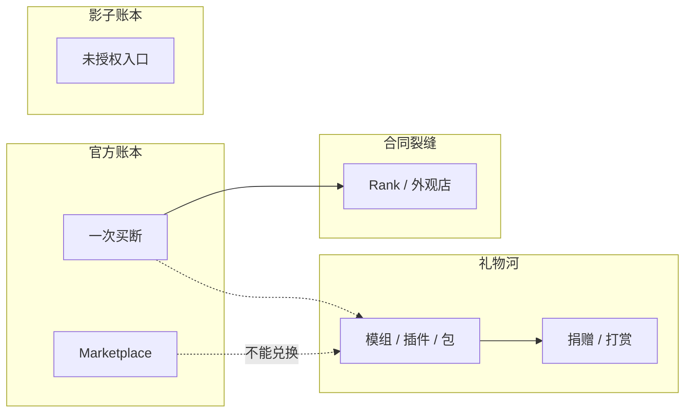

> **本章命题**：最开放的 UGC，往往最难被平台抽成。模组卖的是作者席，Marketplace 卖的是商品；服务器 Rank 走在合同裂缝里。灰色层不是附录，是这套规则允许被再开发之后，必然长出的影子账本。

## 问题

上一章把官方收据拆成三层：门口一次买断，路上订阅和货架，更远的地方是课表、授权和银幕。拆完之后，账本仍缺最大的一块——正作卖出去的深度，很大一部分从来没进过这三层。

工业包让空循环长出产线。大厅服把挖放看收成另一款游戏。有人用从未出现在微软商店里的客户端进了某台不校验账号的服务器。三件事都叫「在玩 Minecraft」。钱的流向完全不同。第一件，作者长期靠捐赠和下载分成活；第二件，服主靠 Rank 和外观店活；第三件，官方账本里是零，有时是一封 DMCA。

本章要回答：为何它同时是最开放、又最难抽成的 UGC？可被证伪的说法是：模组只是爱好，服务器只是联机，未授权副本只是小麻烦，官方只要愿意，随时能像应用商店那样抽成。只要还看见 EULA 禁止出售模组、Rank 店在 2014 年之后仍开着、以及官方更常去打分发游戏本体而不是去给 Forge 装收银台，这句话就不成立。开放是真的。难抽成也是真的。两者是同一件事的两面。

<Callout type="warning" title="本章不写方法">
灰色层只作为生态事实出现：它改变谁进得去作者席，改变官方抽得走什么。不提供未授权客户端、不校验服务器、绕过商店或私服搭建的步骤、软件名单与配置。要玩，走你买过的那份合同。
</Callout>

<Cards>
  <Card title="第二条作者席" href="/history/mods-as-authors" description="正作卖掉的是内核。可玩表面长期由无偿第二作者撑着。" />
  <Card title="服务器即新游戏" href="/history/servers" description="立法权在 IP 里。服主要吃饭，饭钱不在客户端价目表上。" />
  <Card title="抽不成的那一层" href="/history/revenue" description="官方抽成发生在货架上，不发生在模组河里。" />
</Cards>

四条河不要混。混在一起，就会把捐赠写成盗版，把 Rank 写成模组，把货架写成作者席。分述之后，才能看见：开放发生在礼物河；抽成发生在货架；裂缝养活了大厅；影子决定谁还需要买票。

## 免费模组养活了付费游戏

许多人付钱，是因为看见过模组世界。YouTube 上的「Minecraft」经常已经是某套工业、某套魔法、某张整合包的语法。[《影像、教育与一代人的媒介》](/history/media-education) 写过说明书外包给影像。外包出去的，经常不是原版合成表，是第二作者的文明。文明把空循环教成「还能长成这样」。教完之后，有人去买客户端。买单落在 Mojang。劳动落在私人时间里。

这不是互惠的童话。这是成本结构。[《模组作为第二作者》](/history/mods-as-authors) 把无偿写成产业安排：客户端卖一次，可玩表面靠第二条作者席撑到十倍。安排能维持，因为作者席本身就是报酬——你改了别人正在住的世界。报酬很真。它付不出房租。于是出现一种稳定的不对称：正作的畅销，部分建立在没有发票的深度上。没有工业包，Minecraft 仍会卖。边界会窄一圈。窄掉的那一圈，才是许多人愿意把三十美元当成性格的原因。

Bedrock 没有对等的河。附加包能换皮、换行为、过审核；Forge 那种新陈代谢进不去货架。[《两条产品线》](/history/java-bedrock) 已经钉过：两种 UGC 不能兑换。所以「免费模组养活付费游戏」主要是 Java 的句子。Bedrock 养活正作的，是跨设备家庭和课表，以及那条可抽成的货架。同一品牌。两套劳动。两套账。

可被证伪的说法是：去掉所有模组，销量曲线不会变，公众对「Minecraft 能做什么」也不会变。只要教程、整合包和「原版」这个词本身仍在，这句话就不成立。「原版」是事后长出来的立场。立场能成立，是因为旁边有一条更完整的河。

## 模组劳动：无偿、捐赠、打赏

EULA 把模组劳动锁进礼物。你从零做的 Java 模组属于你；你可以分发；你不能拿它卖钱，也不能分发「模组版游戏」。[^eula] 属于你，是版权句。不能卖，是收银台句。两句叠在一起，作者席被承认，发票被没收。没收不是因为模组不值钱。没收是因为一标价，门口那句「不要卖铲子」就要解释，为什么作者可以卖新陈代谢、官方却不能卖耐久。[《收入结构》](/history/revenue) 把这写成买断形象的保险。本章看保险底下的人怎么活。

活法有三层，没有一层等于上架立法权。

第一层是署名。credits、崩溃日志、整合包名单。第二作者长期靠这个被记住。记住不能当工资。

第二层是捐赠和打赏。Patreon、Ko-fi、直播分成，把「请我吃饭」写成可持续的一小部分人。加载器自己也是这样长出来的：Fabric 2018 年公开时，口径是从 2016 年起的爱好项目，感谢名单是一长串不领 Mojang 工资的人。[^fabric] 工具链是礼物河的河床。河床也要人养。养的方式仍然不是 SKU。

第三层是平台打赏。2020 年 6 月，Overwolf 从 Twitch 接手 CurseForge，把模组分发从一家直播公司的附带功能，收成专门抽流量的生意。[^curse-ow] 作者页后来写：按月下载计点、可兑现金，宣称营收七三分成。[^cf-rewards] Overwolf 全平台打给创作者的数以亿美元计，里面混着许多游戏，不能直接当成 Minecraft 模组的年薪。[^ow-payout] 有用的是结构：钱不是来自「买这个模组」，是来自「有人经过这块下载页」。EULA 禁止卖模组。它没有禁止模组托管站卖广告，再把一部分回流作者。于是出现一种绕路：模组仍免费，作者开始有一张不是 Mojang 开的工资单。绕路没有把作者席变成货架。下载仍不必付钱。付钱的是流量。流量一旦被平台计量，礼物河就有了看不见的抽成者——不是微软，是托管站。

<Constraint name="作者席不能上架" verdict="地基" chain="可改程序 → 礼物经济 → 官方抽不成">
能被注入、能被每个版本打断、能改物理的东西，一旦标价，就不再只是皮肤。它会变成「官方不卖的那一半游戏」。买断标本禁止这一半成为商品。禁止之后，劳动不会消失，只会改走捐赠、打赏和广告回流。官方抽不成，不是因为没有收银台技术，是因为收银台一开，标本就碎。
</Constraint>

所以模组劳动的政治不是「该不该吃饭」。吃饭正当。政治是：谁有权把吃饭写成商品。Java 把吃饭写成礼物和绕路。Bedrock 把吃饭写成 Minecoins。两句话都叫 UGC。一个仍是作者席。一个已经是货架席。

## 服务器变现与 Pay-to-win

服务器是另一张发票。立法权在服主手里，电费也在服主手里。[《服务器即新游戏》](/history/servers) 写过：买的是客户端，玩的经常是某串地址。地址要 24 小时开着，就要有人付钱。2014 年 6 月以前，许多服把付钱写成 Rank：花钱获得飞行、踢人、多一块地、进满员时插队。那不是化妆品。那是法律的分级。

2014 年 6 月，Mojang 把这件事从默许收成例外清单：可以卖统一门票，可以接受不换独享玩法的捐赠，可以卖纯外观；不可以卖影响玩法的剑、药和「吃人的猪」。理由写得很家长：已经买过游戏的人，不该再被锁住功能。[^eula-2014] Notch 同期抱怨过家长来信要回孩子在某服花掉的钱——那笔钱 Mojang 从未经手。[^notch-eula] 句子听起来像保护玩家。结构是：官方承认服主要吃饭，但不承认吃饭可以变成 Pay-to-win。

Hypixel 公开改过商店：弱化直接影响对局的付费项，转向外观与便利，并把旧 Rank 的部分利益改成需要刷的精通。[^hypixel-eula] 这是大服把合同裂缝缝上一针。针没有缝死。后来的 Usage Guidelines 比 2014 年那篇博客宽一截：仍要求进服的人持有正版；允许卖「不影响他人体验、不给竞技优势」的玩法权益；外观可以卖，披风不行；虚拟货币不能像 Minecoins。[^guidelines] 「不给竞技优势」是一道可以由品牌临时解释的门。门一松，Rank 改名成 VIP、会员、礼包，继续收钱。有的只卖粒子和称号。有的仍把传送、地皮、排队写成便利。便利是不是优势，取决于你问的是家长，还是那个没付钱、在大厅里等了二十分钟的人。

<Memoir title="2014 年那一周">
论坛把 Mojang 写成 EA。服主把八月一日写成死期。玩家把 Rank 写成童年被没收。一周里三方都觉得自己在保卫 Minecraft。保卫的其实是三张不同的发票：官方要门口标本还在；服主要电费有出处；玩家要进门之后不要再被分成两等。三张发票至今没有一张被取消。被取消的，只是公开把飞行写进价目表的那种坦率。
</Memoir>

Pay-to-win 没有从生态里消失。它学会了穿外观的衣服，学会了把优势说成便利，学会了在「我们保留最终解释权」后面继续营业。官方很少按服去开罚单。不是因为裂缝不存在。是因为真要执行，等于去审计每一台私人进程里的法律——而很大一部分游戏，恰恰不在客户端里。抽不成，又是同一句：开放的立法权，没有可安装的收银台。

Bedrock 这边，大厅被收进游戏内浏览器，合作服要注册公司、要 Xbox 账号、要家长控制。[《两条产品线》](/history/java-bedrock) 写过那张名单。名单里的变现，更接近货架加订阅，更不像 Java 任意 IP 上的夜间政权。裂缝仍在——便利礼包不会因为进了浏览器就自动变成纯外观——但门禁先在。Java 的 Rank 店开在任意地址上。Bedrock 的 Rank 店要先通过商店和合作计划。难抽成的程度不一样。开放的程度也不一样。

## 灰色层作为生态事实

还有一层正式收据不愿写：未授权的入口。

Java 的完整产品是一份可改的程序、一套可抄的协议、一台别人可以开的服务端。买断卖的是许可。许可挡得住商店页，挡不住磁盘上的字节。于是长期并行着：不校验正版账号的服务器；不经过官方渠道分发的客户端；把模组、版本和「先玩起来」捆在一起的非官方启动器。有人用这些东西是因为付不起或付不了；有人是因为学校电脑装不了商店；有人是因为只想进某服，觉得三十美元买的是另一款游戏。动机不重要。结构重要：再开发被允许之后，复制也变得便宜。便宜的复制，就是影子账本。

官方打的，主要是把游戏本体再分发出去的人。2023 年 2 月，Mojang 向 GitHub 发出针对浏览器端重制的 DMCA，理由是反编译、重用代码与资源、违反 EULA。[^eagler] 这不是模组治理。这是版权治理。打分发本体，比打每一个 Rank 店、每一份注入后的 jar 更像公司会做的事。结果是一种不对称的执法：礼物河被默许，裂缝被口头禁止，影子里分发客户端会被锤，影子里「先玩起来」往往还在。不对称不是无能清单。不对称是选择：保护门口标本和商标，比把整个再开发层收进收银台更符合这套产品的自我理解。

<Note>
第三方启动器不是一种颜色。有的只是用正版账号管理模组列表；有的把「不必先买」写进自己的卖点。本章关心的是后一种如何改变入口，不评价、不推荐任何软件。正版账号进官方启动器，仍然是合同写明的路。
</Note>

Bedrock 的影子是另一副形状。商店、账号、加密过的包，让「复制一份客户端」变贵。灰色层更多表现为：绕过商店的安装包、泄露的 Marketplace 内容、以及仍想把 Java 那套任意 IP 搬进主机审核的尝试。贵，不等于消失。贵，等于影子更碎、更依赖另一条产品线的锁。锁是抽成的前提。Java 少了这把锁，才既开放又抽不成。

中国大陆把影子和合同叠在一起。国服是另一份免费进门的授权；国际 Java 仍按买断卖。两套入口并存时，未授权的国际客户端不会自动消失，只会和本地化运营抢同一代人。[《收入结构》](/history/revenue) 写过同一品牌两份合同。灰色层是第三份没人签字的合同：它不出现在新闻稿里，却决定许多人第一次见到的方块，到底经过哪一个收银台。

可被证伪的说法是：灰色层只是道德失败，与设计无关。只要还承认产品是可改的程序加可抄的协议，影子就是设计的后果。你可以讨厌它。你不能把它写成与体素和空循环无关的意外。意外不会稳定存在十几年。

## 两种 UGC：Marketplace 对模组

现在可以把货架和河放在同一张桌上。桌上还有 Rank，作为裂缝里的第三种。

| | 模组 / 插件 | Marketplace | 服务器 Rank |
| --- | --- | --- | --- |
| 卖什么 | 作者席：世界里可以发生什么 | 商品：皮肤、地图、过审的附加包 | 法律的分级：便利、外观、有时是优势 |
| 谁准进 | 会改程序的人；加载器是河床 | 注册过的伙伴；审核是门 | 有一台进程的人；地址是门 |
| 钱怎么走 | 礼物、捐赠、托管站广告回流 | Minecoins，应用商店先抽一刀 | 服主的店；官方很少开票 |
| 官方抽成 | 抽不成，抽了标本碎 | 抽得成，这是货架存在的理由 | 口头禁止 P2W，执行像品牌脾气 |
| 版本命运 | 每个大版本自己续命 | 跟账号走，跟引擎走 | 服一关，宪法作废 |

Marketplace 宣布时，句子像承认第二作者。合同是货架席。[《两条产品线》](/history/java-bedrock) 写过启动阵容要有公司。公司可以吃饭。吃饭的代价是：能上架的，是可审核的商品；能立法的，仍在院子里。院子里的人可以同时给 CurseForge 贡献下载、给 Patreon 贡献订阅、给某服贡献插件。三张小收据加起来，往往仍不如一个 Marketplace 爆款皮肤包。这不是市场失效。这是两种东西的价格：商品有标价，作者席被许诺成礼物。

<Alternative title="如果官方开一家 Java 模组店">
收银台可以装在加载器上，像创意工坊：下载可收费，平台抽成，安全扫描，按版本下架。技术不是问题。问题是两句合同会打架。EULA 说属于你但不能卖；店一开，这句话必须改。一改，门口标本就要解释，为什么官方不卖镐、作者可以卖电网。解释的终点不是更公平的礼物河。终点是第二条 Marketplace：审核、分成、可治理的扩展面。河还在的话，只会变成店外面那条未被收编的野河。野河加上官方店，就是今天 Bedrock 货架加 Java 院子的关系，只是院子也被收了租。
</Alternative>

所以「最开放又最难抽成」不是赞美。它是一句工程事实。开放：程序可改，协议可抄，服务器可开，第二作者不必先注册公司。难抽成：可抽的东西一旦可改到立法权，标价就会拆掉买断性格；不可改到立法权的东西，才能安心抽成。微软抽 Marketplace。托管站抽下载流量。服主抽 Rank。模组作者抽捐赠。没有一张抽成单覆盖全部。覆盖全部的那张单，会把媒介收成平台。下一章的 Roblox，就是把这张单开出来之后的对照。本章先停在这里：Minecraft 选择了河，所以必须忍受裂缝和影子。忍受不是道德。忍受是产品定义。

## 这一章留下什么

- **爱好者**：你装过的整合包、进过的 Rank 服、以及某次「先玩起来」的灰色入口，不是正史外面的脏边。它们是这套规则被居住、误用、再开发之后，账本必然裂开的缝。讨厌 Rank 或讨厌货架，都有理由；把它们说成同一件事，会看错缝在哪。模组仍是作者席。皮肤包不是。
- **开发者**：能抄走的是「开放与抽成互相排斥的那一层」——允许改程序、抄协议、私开进程，你就很难再装一个覆盖全部 UGC 的收银台；想抽成，就要把扩展面收成可审核的商品，并接受作者席被关在门外。抄不走的是：你没有一份当众铸好的买断标本，去禁止自己对镐收费、同时禁止第二作者卖电网；没有两条产品线，你也不能一边抽货架、一边把礼物河留作品牌性格。你若只抄「让玩家做模组」，会得到影子账本、Rank 店和一群付不起房租的作者，而不是一张干净的平台报表。真正的选择是：你要河，还是要收银台。Minecraft 两个都要，所以两个都不干净。

[^eula]: Minecraft EULA：从零创建的 Java Edition 模组属于作者，「as long as you don't sell them for money / try to make money from them and so long as you don't distribute Modded Versions of the game」。见 <https://www.minecraft.net/en-us/eula>。

[^fabric]: Fabric 工具链于 2018 年 12 月 10 日公开，口径为可追溯到 2016 年的爱好项目，面向 1.14 及之后版本。见 <https://fabricmc.net/2018/12/10/announcement.html>；两周后的回顾，<https://fabricmc.net/2018/12/22/two-weeks-of-fabric.html>。

[^curse-ow]: 2020 年 6 月 22 日，Overwolf 宣布从 Twitch 接手 CurseForge。见 Overwolf 博客，<https://medium.com/overwolf/a-new-home-for-curseforge-44cbb3add844>；TechCrunch，<https://techcrunch.com/2020/06/22/in-game-app-development-platform-overwolf-acquires-curseforge-assets-from-twitch-to-get-into-mods/>。

[^cf-rewards]: CurseForge 作者页宣称按月下载计点、可兑 PayPal / 礼品卡，并写营收 70% 归创作者、30% 归平台。见 <https://authors.curseforge.com/welcome/>。奖励计划条款由 Overwolf 运营，积分规则可单方调整。见 <https://support.curseforge.com/en/support/solutions/articles/9000197898-rewards-program-terms-of-service>。此为托管站广告 / 流量回流，不是出售模组 SKU。

[^ow-payout]: Overwolf 称 2023 年向其生态创作者打款逾 2.01 亿美元、2024 年 2.40 亿美元，覆盖多款游戏的模组、应用与私人服运营者，不能直接当作 Minecraft 模组年收入。见 GamesBeat，<https://gamesbeat.com/overwolf-pays-201m-to-in-game-modders-and-creators-in-2023/>；Forbes，<https://www.forbes.com/sites/mattgardner1/2024/12/23/in-game-creators-earn-big-overwolf-pays-out-240-million-in-2024/>。

[^eula-2014]: 2014 年 6 月 Mojang《Let's talk server monetisation》：允许统一门票、不换独享玩法的捐赠、纯外观；不允许出售影响玩法的物品。档案见 <https://web.archive.org/web/20190221061149/https://mojang.com/2014/06/lets-talk-server-monetisation/>。

[^notch-eula]: Notch 当时称多年来规则本就不允许出售（含外观），只是未严格执行；并提到家长来信要求退回孩子在服务器上花费、而 Mojang 并未经手这些钱。见 Polygon，<https://www.polygon.com/2014/6/18/5819274/mojang-multiplayer-servers/>。

[^hypixel-eula]: Hypixel 论坛 2014 年 8 月说明：为符合 EULA 调整商店，弱化直接影响对局的付费项，转向外观与便利。见 <https://hypixel.net/threads/august-update-eula-changes-positive-outcome.149055/>。

[^guidelines]: 现行 Usage Guidelines：进服须持有正版；允许统一票价；允许出售「不破坏他人体验、不给竞技优势」的玩法权益；允许外观（披风除外）；虚拟货币不得仿 Minecoins。并保留对变现方式是否符合品牌的最终判断。见 <https://www.minecraft.net/en-us/usage-guidelines>。

[^eagler]: 2023 年 2 月 TorrentFreak 报道：Mojang 向 GitHub 发出针对浏览器端 Minecraft 重制（Eaglercraft 相关仓库）的 DMCA，指反编译、重用代码与资源、违反 EULA。见 <https://torrentfreak.com/mojang-targets-repositories-of-browser-based-minecraft-copy-eaglercraft-230224/>。此处只取「官方打的是分发本体」这一执法形状，不讨论该项目。
