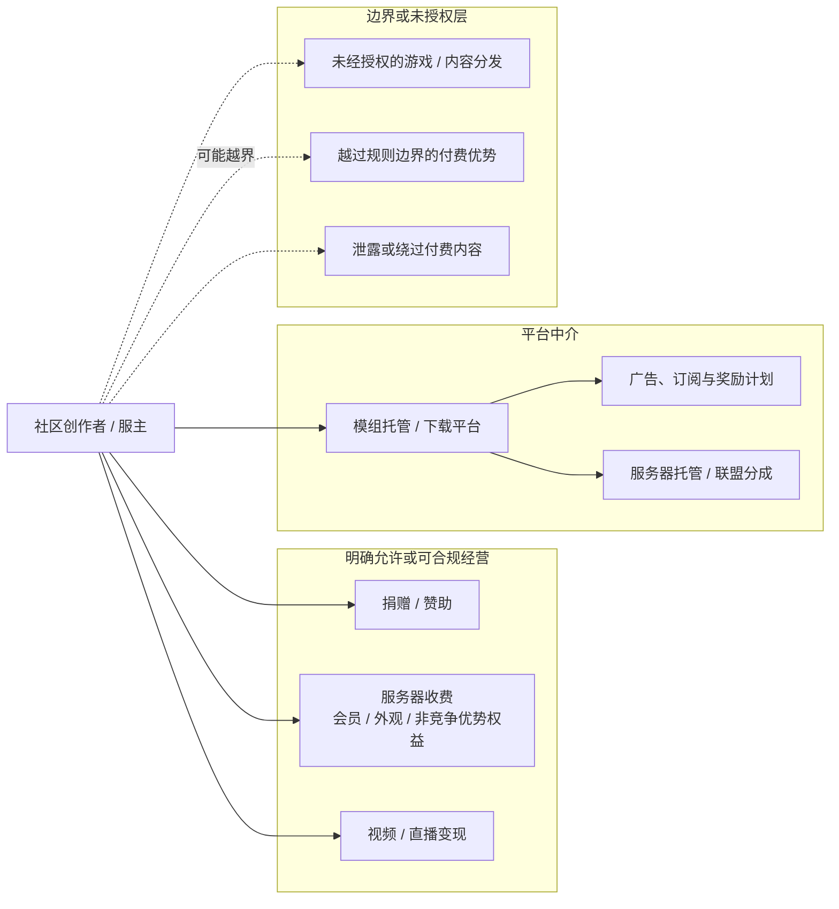

上一章画的是 Mojang 和正式合作体系里的收入：客户端、Realms、Marketplace、Education、区域发行与 IP 授权。

但如果只看那张账，仍然会漏掉 Minecraft 很大一部分经济活动。

模组作者会收到捐赠和平台奖励，服务器会出售会员、外观或便利功能，模组分发站靠广告和订阅维持基础设施，托管商围绕整合包卖服务器。与此同时，也长期存在未授权分发、绕过正版许可或泄露付费内容的灰色甚至侵权活动。

这些事情经常被一句“灰色经济”混在一起，其实并不属于同一层。

<Callout type="warning" title="先把“灰色”分开">
社区赚钱本身不等于灰色。Minecraft 当前规则明确允许一部分服务器收费、捐赠和商业使用；Java Mod 也可以合法创建和分发，只是直接出售 Mod 受到 EULA 限制。本章真正称为“灰色”的，是规则边界模糊、未经授权或明确违反许可的部分。这里只讨论它们怎样影响生态，不提供绕过正版、未授权分发或规避平台限制的方法。
</Callout>

```mermaid
flowchart LR
  Creator["社区创作者 / 服主"]

  subgraph Allowed["明确允许或可合规经营"]
    Donate["捐赠 / 赞助"]
    Server["服务器收费<br/>会员 / 外观 / 非竞争优势权益"]
    Video["视频 / 直播变现"]
  end

  subgraph Platform["平台中介"]
    Host["模组托管 / 下载平台"]
    Reward["广告、订阅与奖励计划"]
    Hosting["服务器托管 / 联盟分成"]
  end

  subgraph Grey["边界或未授权层"]
    Redistribute["未经授权的游戏 / 内容分发"]
    P2W["越过规则边界的付费优势"]
    Leak["泄露或绕过付费内容"]
  end

  Creator --> Donate
  Creator --> Server
  Creator --> Video
  Creator --> Host --> Reward
  Host --> Hosting
  Creator -. "可能越界" .-> P2W
  Creator -.-> Redistribute
  Creator -.-> Leak
```

这张图里最重要的不是哪一格更“正义”，而是**钱为什么会从不同路径流动**。Minecraft 的社区创作没有被一座统一商店包住，因此也不存在一张覆盖所有模组、服务器和第三方工具的统一收银台。

## 免费模组不等于没有经济

Java 模组生态最容易让人产生一个错觉：既然 Mod 大多免费下载，那么它就是纯粹的无偿爱好。

事实要复杂得多。

Minecraft EULA 明确承认，作者从零创建的 Java Edition Mod 属于作者自己；但同时规定，不得直接出售这些 Mod 或通过 Mod 本身赚钱，也不能分发包含 Minecraft 客户端或服务端代码的“Modded Version”。[^eula]

这使 Java Modding 长期形成一种很特别的商业边界：**代码可以属于作者，分发可以很自由，但 Mod 文件本身通常不是一个可以直接标价出售的商品。**

于是作者的收入往往发生在 Mod 之外。

有人接受自愿捐赠或会员支持；有人通过视频、教程和社区获得收入；也有人把作品发布到 CurseForge 一类平台，由平台根据下载、广告、订阅等收入向作者返还奖励。

CurseForge 当前公开的作者页面显示，其奖励体系按项目流量向作者支付，并声称平台整体已有超过 3.3 万名作者获得过支付、累计支付超过 2000 万美元，同时把约 70% 的相关收入分给创作者。[^curseforge] 这些数字覆盖 CurseForge 的多个游戏，不能直接当成“Minecraft 模组作者收入”，但它很清楚地展示了一种模式：

> **用户仍然免费下载 Mod，钱却可以在分发平台这一层流动。**

这和“卖 Mod”不是一回事。

对作者来说，区别却非常现实。一个项目下载量足够大时，它可能从纯爱好变成能够补贴开发时间的工作；但收入通常和平台规则、广告市场、下载量以及会员体系绑定，而不是作者自己给每个版本定一个售价。

所以“免费模组”更准确的理解不是“没有商业”，而是**商业被放到了作品之外的基础设施和支持关系里**。

## 工具链本身也需要有人养

模组生态还依赖大量玩家平时看不见的劳动。

加载器、映射、构建工具、兼容层、文档、Wiki、崩溃分析、整合包工具，这些东西本身未必增加一个新方块，却决定作者能不能继续在新版本上开发。

Fabric 在 2018 年公开时，就把自己描述为一个从更早的个人实验发展出来的社区项目。[^fabric] Forge、Fabric、NeoForge 等工具链能够长期存在，并不是因为它们发布一次以后就结束了；Minecraft 每次更新，都可能要求维护者重新适配。

这也是为什么模组生态不能简单按“某个 Mod 值多少钱”理解。

很多价值产生在公共基础设施里，而公共基础设施最难逐份收费。它更像开源软件：大量项目免费可得，真正支撑它们的可能是捐赠、赞助、托管平台、企业合作或开发者自己的时间。

这种结构既给了 Java Modding 很强的开放性，也让收入非常不均。热门整合包和平台项目可能拥有可观流量，大量小 Mod 则始终只是作者的业余劳动。

因此，“社区创造了很多价值”与“社区创作者普遍能靠它生活”完全是两句话。

## 服务器：从电费问题变成商业规则问题

服务器的经济逻辑和 Mod 又不一样。

服务器需要持续运行。机器、带宽、数据库、反作弊、客服、地图制作和开发都可能产生成本；规模大以后，它本身就是一项长期服务。

所以服主收费并不奇怪。真正困难的是：**收费可以买到什么？**

2014 年，Mojang 因大量服务器出售明显影响游戏平衡的道具和权限，专门收紧并解释服务器商业化规则。当时官方明确允许统一的服务器门票、无专属回报的捐赠和纯外观内容，同时限制直接出售影响玩法公平性的优势。[^server-2014]

这次变化在社区里引起很大争议，因为很多服务器此前已经把 Rank、装备、权限和虚拟货币做成自己的收入来源。

后来规则并没有永远停在 2014 年。

2020 年 Mojang 再次更新商业使用规则，公开表示希望给社区服务器更多灵活性；当前 Usage Guidelines 允许服务器收取统一入场费、接受符合条件的捐赠，也允许出售会影响玩法、但**不能破坏其他玩家体验或给予竞技优势**的权益。[^server-2020][^usage]

这比“所有非外观内容都不能卖”更宽，也更难机械判断。

比如额外地皮、排队优先、传送次数、服务器内便利功能，到底只是便利，还是已经变成优势？不同服务器类型会给出不同答案。

于是 Pay-to-win 并没有因为一份规则文件就从 Minecraft 消失。更准确地说，Mojang 给出了边界，而每台服务器仍然需要把自己的商品放在这条边界附近解释。

大型服务器往往因此把收入拆成多个部分：外观、会员身份、便利功能、季节内容、活动或服务器自己的非竞争性商品。规模越大，商业设计和游戏设计越难完全分开。

这也是[《服务器即新游戏》](/history/servers)的另一面：服务器既然能设计自己的玩法，就也必须设计自己的经济。

## 第三方平台开始成为社区经济的一部分

模组和服务器中间还有一层经常被忽略：**平台。**

CurseForge、Modrinth 一类站点并不创作每一个 Mod，却提供发现、版本管理、依赖关系、下载分发与整合包基础设施；服务器托管商则把“这套模组怎么跑起来”进一步包装成可以按月购买的服务。

这些平台能赚钱，是因为 Minecraft 的社区扩展已经复杂到需要基础设施。

玩家愿意为省掉维护成本付钱，作者愿意把作品放到能带来流量的平台，平台再通过广告、订阅、托管合作或奖励计划把一部分收入返还给作者。

2026 年 CurseForge 甚至开始把服务器托管收入的一部分直接纳入作者奖励体系：如果一个托管服务器运行某个整合包和其中的 Mod，相关作者可以从托管净收入中获得奖励。[^cf-server]

这不是 Minecraft 官方 Marketplace，却说明社区经济正在出现越来越成熟的中间层。

重要的是，这些平台没有改变一个基本事实：Java 模组仍然可以存在于 Mojang 官方商店之外。平台可以集中流量，却没有天然垄断创作者入口。

这和 Marketplace 的结构差异非常大。

## Marketplace 与 Java Modding 是两种商业化方式

上一章已经讲过 Marketplace 是 Minecraft 正式收入的一部分。放到社区经济里，它和 Java Modding 的区别会更清楚。

| | Java Modding | Bedrock Marketplace |
| --- | --- | --- |
| 进入方式 | 第三方加载器、平台、作者自行分发 | 官方 Creator / Partner 体系与游戏内商店 |
| 内容能力 | 可以深度修改系统，能力取决于加载器与版本 | 使用 Bedrock 官方支持的内容与 Add-On 能力 |
| 价格 | Mod 本身通常免费；收入多在捐赠、平台与周边服务 | 内容可以直接作为商品出售 |
| 分发 | 多个平台并存 | 官方客户端内统一分发 |
| 兼容风险 | 作者自己承担版本迁移与依赖 | 更受官方平台和版本体系约束 |

这不是“一个自由、一个邪恶”，也不是“一个先进、一个落后”。

它们解决的是两种不同问题。

Java Modding 优先保留了深度修改和第三方工具链，代价是安装、兼容与收入路径都更碎；Marketplace 优先保证商品可以被审核、购买并在受支持的平台上分发，代价是创作能力必须处在官方允许的扩展面里。

从商业角度看，Marketplace 更容易形成直接交易，因为内容、账号、支付和分发都在同一个平台里。

Java Modding 很难形成同样统一的抽成，不只是因为 Mojang“不想赚钱”，也不只是因为 EULA 有一句禁止出售。更现实的原因是：**作者、加载器、分发站、服务器和玩家并不经过同一个入口。**

要让所有 Java Mod 进入统一付费商店，意味着同时改变许可、加载方式、审核、版本依赖和社区习惯。技术上并非不可想象，但那已经是在重新设计 Java Modding 的生态，而不是简单加一个付款按钮。

## 真正的灰色层在哪里

到这里才能谈真正意义上的“灰色经济”。

一类是**许可边界模糊的商业化**。某些服务器商品、会员权益或创作者收费方式可能处在官方规则的解释空间里：形式上不是直接卖竞技优势，却可能实际改变玩家体验。这些问题通常需要结合具体产品判断，而不是靠“Rank”“会员”几个字就能定性。

另一类则更明确：**未经授权重新分发 Minecraft 本体或其修改版本、绕过正常许可提供游戏访问、泄露本应付费或受限的内容。** Minecraft 当前 EULA 和 Usage Guidelines 都明确禁止未经授权分发游戏及其修改版本。[^eula][^usage]

这里需要把第三方工具和未授权分发分开。

第三方启动器、模组管理器或服务器工具本身并不天然违规。它们可以只负责管理用户已经合法拥有的游戏、模组和版本。真正的问题在于工具是否重新分发受版权保护的游戏内容、绕过许可，或者让用户获得本来无权访问的内容。

这种区分很重要，因为 Minecraft 的开放生态本来就高度依赖第三方工具。如果把“一切不是 Mojang 官方客户端的东西”都叫灰色，Forge、Fabric、Prism 一类正常社区基础设施也会被错误地塞进同一类。

反过来，也不能因为社区长期存在未授权入口，就把它浪漫化成“开放文化的一部分”。开放 Mod API、允许私人服务器，与允许未经许可复制游戏本体并不是同一件事。

所以灰色层真正告诉我们的，不是“开放必然导致盗版”，而是：

> **当游戏允许大量外部工具、服务器和内容围绕自己生长时，合法扩展与未授权分发之间必须长期维护一条边界。**

这条边界不会因为社区规模大就自动消失。

## 为什么官方账本永远只看得到一部分

上一章的收入结构有一个共同特点：交易发生在 Mojang 或正式合作伙伴能看见的渠道里。

而社区经济恰好相反。

一笔 Patreon 赞助不会进入 Minecraft Marketplace；一个服主向玩家收的会员费不会自动出现在微软财报里；一个托管平台给模组作者返还的广告收入，也不是 Mojang 的创作者分成。

这并不意味着官方完全得不到好处。

模组、服务器和视频会延长 Minecraft 的寿命，给玩家制造重新回来的理由，也可能推动客户端销售、Realms、品牌曝光和其他正式收入。只是这种关系很难精确拆账。

同样，社区也依赖官方持续维护游戏、账号、协议和品牌。

因此更准确的关系不是“官方免费吸血社区”，也不是“社区只是搭 Mojang 的便车”。它是一种长期互相依赖、但账本彼此分离的生态。

这也是 Minecraft 和许多完全平台化 UGC 产品很不一样的地方。

在一个所有创作、发布、支付和用户账号都必须经过官方平台的产品里，平台可以看到更多交易，也更容易抽成；Minecraft 尤其是 Java Edition，则长期允许大量价值在官方渠道之外产生。

这种结构带来了开放性，也带来了 Mojang 无法统一管理的经济、兼容和治理问题。

下一章[《竞争、模仿与产业影响》](/history/competition)会把 Minecraft 和其他沙盒、UGC 平台放在一起比较。Roblox 一类产品最值得对照的地方，未必是“更像 Minecraft”，而是它们从一开始就把创作工具、内容分发、账号和支付放在了同一套平台里。

## 这一章留下什么

- **爱好者**：模组免费、服务器收费、Marketplace 卖内容、第三方平台给作者分成，这些不是同一种商业模式。真正的“灰色”只占其中一部分；很多社区商业活动本身就在官方规则允许的范围里。
- **开发者**：开放 UGC 不只意味着“允许用户创作”，还要决定创作者如何分发、如何获得收入、平台是否必须经过、服务器能卖什么，以及谁来承担兼容与审核。越去中心化，平台越难统一抽成；越集中到官方商店，交易越清楚，但创作边界也会更多由平台定义。

[^eula]: Minecraft 当前 EULA 对 Java Mod 的规定：作者从零创建的 Mod 属于作者，但不能直接出售或通过 Mod 本身赚钱，也不能分发包含 Minecraft 客户端 / 服务端的 Modded Version。见 <https://www.minecraft.net/en-us/eula>。

[^curseforge]: CurseForge 官方作者页面当前公开其奖励计划与平台数据，包括超过 3.3 万名作者获得过支付、累计支付超过 2000 万美元，并称约 70% 的相关收入归创作者。该统计覆盖 CurseForge 平台多个游戏，并非 Minecraft 专属。见 <https://authors.curseforge.com/welcome/>。

[^fabric]: Fabric 于 2018 年 12 月公开，并在公告中回顾其更早的社区开发过程。见 <https://fabricmc.net/2018/12/10/announcement.html>。

[^server-2014]: 2014 年 Mojang 公开解释服务器商业化政策，允许统一服务器门票、无独享玩法回报的捐赠与纯外观内容，同时限制出售直接影响玩法公平性的权益。归档见 <https://web.archive.org/web/20190221061149/https://mojang.com/2014/06/lets-talk-server-monetisation/>。

[^server-2020]: 2020 年 Mojang 再次更新 Commercial Usage Guidelines，并明确表示新规则为社区服务器提供更多灵活性和清晰度。见 <https://www.minecraft.net/en-us/article/commercial-usage-guidelines-updated>。

[^usage]: Minecraft 当前 Usage Guidelines 允许符合条件的服务器统一收费、接受捐赠，以及出售不会破坏其他玩家体验或提供竞技优势的玩法权益；同时禁止未经授权重新分发游戏及其修改版本。见 <https://www.minecraft.net/en-us/usage-guidelines>。

[^cf-server]: 2026 年 CurseForge 推出的服务器托管整合进一步把托管收入和作者奖励关联：官方说明部分服务器净收入会通过 Rewards 体系返还给整合包与其中的 Mod 作者。见 <https://blog.curseforge.com/the-easiest-way-to-play-modded-minecraft-with-your-friends-curseforge-servers-are-here/>。
