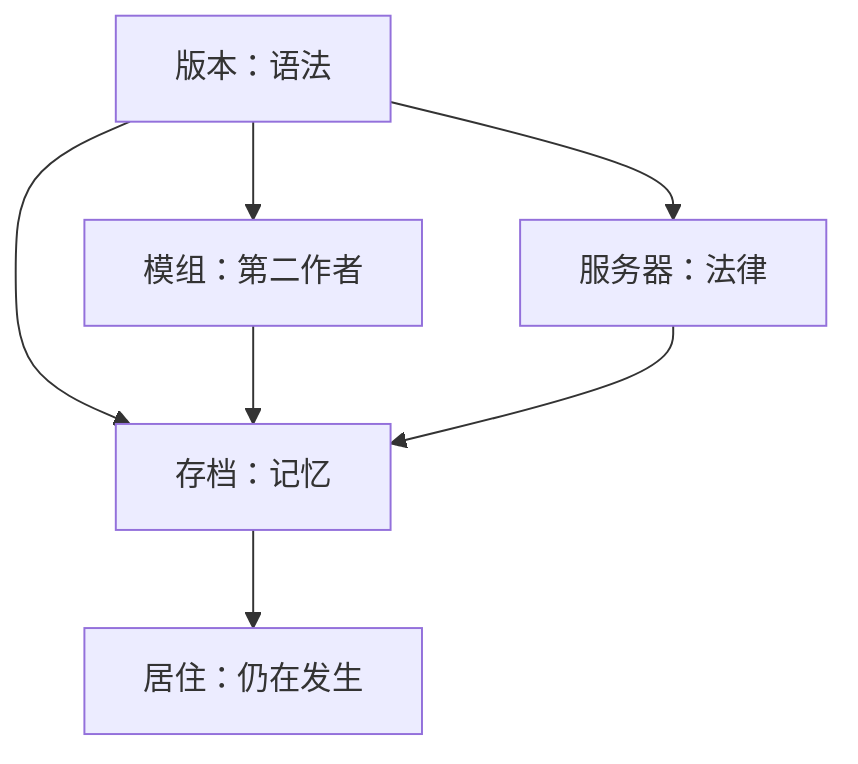

> **本章命题**：Minecraft 作为文化遗产，保的不是客户端光盘，是还能被打开、还能被误用、还能被续命的那一叠层——版本、存档、服务器、模组。引擎可以还在更新；层一旦断了，口语还在，居住却没了。当童年被收进 IP，保存就变成治理：博物馆收的是可展出的软件，公司保的是可管理的品牌。谁来保存世界，答案不是一个机构，是一张没人签全约的桌子。

## 问题

你硬盘里可能还有一个文件夹：某个整合包的名字，某个服主给的地图，某次更新前匆忙备份的 `world`。点开启动器，版本列表里找不到那一格；找到了，模组缺一半；模组齐了，世界能进，机器不转，羊也不刷。世界还在。世界已经不对了。

上一章说媒介窗口关了，座位还在原来那套规则上。规则还允许被居住、误用、再开发——**能**保存，媒介还在；只剩商标，就只剩 IP。本章要问：谁来保存已经被住过的世界、模组与服务器？可被证伪的说法是：官方还在更新，存档自然能打开；博物馆收了游戏，遗产就有归宿；品牌保护只是外壳，不伤创作。只要还看见旧整合包进不去、Mineplex 一夜下线、聊天举报牵动全服封禁、以及 MoMA 收的是软件而不是你的 `.minecraft`，这句话就不成立。更新保的是引擎。遗产活在层里。层没有单一主人。

<Cards>
  <Card title="世界比客户端活得长" href="/history/java-bedrock" description="双产品线把十年存档收成迁不走的悲剧。" />
  <Card title="模组作为第二作者" href="/history/mods-as-authors" description="文明写在 jar 外。jar 停更，文明先死。" />
  <Card title="服务器即新游戏" href="/history/servers" description="立法权在进程里。进程关机，法律蒸发。" />
</Cards>

## 一个旧模组世界现在还打得开吗

先做一个实验。不必怀旧。实验只问因果。

找一张 2014 年左右的 FTB 整合包存档，或任何带工业、魔法、电网的老世界。你需要：那一版的 Minecraft、那一版的 Forge、那一套模组 jar、可能还有旧版 Java。官方启动器能列出许多历史版本，却不保证模组仍能从同一入口下载；CurseForge 上的旧文件时有时无；作者删帖，链就断。就算 jar 齐了，区块里摆着的方块 ID 可能已在某次大版本迁移里改名；机器方块变成未知方块，不是美学，是语义断了。红石还能亮，因为红石语义稳定；工业不能转，因为第二作者的语义挂在版本上。

可被证伪的说法是：想玩旧版，装个旧客户端就行。旧客户端是必要条件，不是充分条件。充分条件还包括：模组作者当年写下的那一版 API、那一版世界生成、那一版与隔壁模组的默契。默契不在 jar 里，在**当时**所有人的磁盘上同时存在。磁盘散掉，默契就散。

社区因此长出影子档案馆。Betacraft 把 Pre-Classic 到 1.5.2 的旧客户端做成可启动的遗产，补皮肤、补声音、补那些在官方列表里「能下但不能好好玩」的版本。[^betacraft] Internet Archive 有人把 Beta 1.7.3 的模组收成上千个文件的集合，因为那一版的模组站不会永远在线。[^ia-mods] Omniarchive 一类项目抢救的是更早、更碎、差点从互联网上消失的快照。Histolauncher、MultiMC 及其后继者做的，是把「版本 + 加载器 + 模组列表」封成可导出的实例——遗产单位不是 `.exe`，是**一整包 Dependencies**。[^histolauncher]

官方并非全无动作。启动器里的版本页越来越长，快照、预发布、远古 Alpha 都能下。那是**客户端**遗产。客户端能下，不代表**你的世界**仍生活在原来的物理里。活塞在 Beta 1.7 炸过存档；1.13 扁平化重写了方块宇宙；1.18 地形生成换过算法，旧种子仍是数字，山不再是那座山。[^flat] 每一次「升级世界」，都是一次温和的翻译。翻译成功，你得到新版本里的近似；翻译失败，你得到博物馆里的尸体——能走进去，不能继续住。

<Note>
本章不教你怎么开旧档。教的是：开旧档失败时，失败的不是你的记忆，是一套从未被任何人承诺永久维护的层叠依赖。
</Note>

所以「旧模组世界现在还打得开吗」的答案要拆开。纯原版旧档，往往打得开，代价是接受官方迁移或停在旧版。模组旧档，**有时**打得开，代价是考古。服务器旧档，**常常**打不开，因为服务器不是文件夹，是进程加插件加人在线。可被证伪的说法是：微软既然收购，就该对全部玩家存档负责到底。收购买的是入口与商标，不是对你 2013 年整合包里的格雷星球的托管合同。[《微软收购》](/history/acquisition) 写过：交割那天，模组仍在别人的 jar 里。jar 的续命，从来不在收购条款里。

## 保存对象：版本、存档、服务器、模组

遗产不是单数。至少四层。四层寿命不同，主人不同，死法也不同。

**版本**是语法。语法规定方块叫什么、更新顺序如何、数据包怎么读。Java 与 Bedrock 各有一套语法，互不翻译。[《两条产品线》](/history/java-bedrock) 把不兼容写进商店页。语法还在变：Combat Update、扁平化、世界高度、聊天签名。变语法时，官方想的是向前兼容多少、向后欠多少债。债可以赖。赖债的受害者，是选择「不升级」的人——他们不是在抵制新内容，是在保卫某一版物理。物理被收编进新版本那天，旧物理就变成方言。方言没有错。方言只是不再被主线程维护。

**存档**是记忆。记忆躺在区域文件、LevelDB、NBT 里。[《存储与序列化》](/impl/storage) 会把格式拆开写；本章只取政治：存档属于玩家，却依赖公司的迁移工具。工具好心，会改你的山；工具缺席，你的 1.6.4 世界就锁在旧 Java 上。记忆因此比版本更私密，也更脆弱——私密到没人义务替你备份，脆弱到硬盘坏一次就少一座城。影像层保存的是**看过**的世界；存档保存的是**住过**的世界。 trillion 次观看救不回一个删档的下午。[《影像、教育与一代人的媒介》](/history/media-education) 写过口语先于教程。口语能传播种子，不能传播箱子里的物品实体。

**服务器**是法律。法律写在插件配置、权限组、经济表、大厅规则里。Mineplex 2013 年开张，2015 年创下三万四千多人同服的纪录；2023 年 5 月，网站与进程静默，Discord 管理员说：这次下线是 forever。[^mineplex] 法律没有随世界文件一起捐给博物馆。员工说：他们为这家公司工作，不拥有公司，也没做导致关门的决定。[^mineplex-pcg] 玩家失去的不是一个 IP 地址，是一套被几代人当作默认多人经验的宪法。宪法可以迁移——Hypixel 还在。宪法也可以蒸发——没有法条要求大厅必须永续。服务器遗产最难，因为它从来不是「一份存档」，是**仍在缴费的文明**。电费停，文明停。

**模组**是第二作者的文稿。文稿量往往超过正作。工业、魔法、群系、生物，写在 jar 里，关系写在作者之间的默契里。Forge 换 API，Fabric 另起炉灶，旧 jar 不会自动学会新钩子。[《模组作为第二作者》](/history/mods-as-authors) 写过：无偿是产业安排。安排能维持，是因为每个大版本都有人续命。续命断一次，整合包就进档案馆。档案馆不等于墓地，但墓地不需要作者在线。模组遗产的死法最常见：**作者走了，版本过了，下载页 404**。比 404 更狠的，是作者还在，但官方把某一类误用封死了——那属于下一节的品牌摩擦。

四层叠在一起，才是玩家口中的「我的 Minecraft」。只保客户端，保的是壳。壳能启动，四层不全，就不是在住，是在参观自己的过去。

可被证伪的说法是：只要 Mojang 还在，四层就安全。Mojang 在，保证的是**还在卖的那一支**会继续发版。不保证你的服不停电，不保证你的模组作者不转行，不保证 CurseForge 上 2012 年的链仍有效。安全是分层外包的：官方外包给迁移工具，模组外包给加载器社区，服务器外包给服主和主机商，存档外包给玩家的备份习惯。习惯不是制度。制度会写进博物馆征集说明；习惯不会。

<Constraint name="遗产是层叠依赖" verdict="地基" chain="版本 → 模组/服务器 → 存档 → 居住">
引擎可以换壳更新。居住要求每一层同时活着。任何一层默认「有人会替我省心」，都会在十年后变成考古题。能抄走的是备份意识；抄不走的是：没有人对四层全体签过托管约。
</Constraint>

## 博物馆与研究（点到为止）

机构也在收。收法暴露它们能保什么、不能保什么。

2012 年，纽约现代艺术博物馆宣布把电子游戏纳入建筑与设计收藏，愿望清单里包括 *Minecraft*。[^moma-wish] 2013 年，馆方入藏 Markus Persson 的 *Minecraft*（2011），载体是「电子游戏软件」，赠方为 Mojang，馆藏编号 702.2013。[^moma-object] 馆方策展人 Paola Antonelli 写过：收藏不仅拿光盘和主机，还想要源代码，以便原技术过时后仍能翻译。[^moma-blog] 这是博物馆逻辑：**可展览、可编目、可写进图录**。图录里的 Minecraft，是设计史上的一个节点——体素、开放、低门槛。图录里没有你的多人档，没有 Hypixel 的起床战争记录，没有 FTB 的电网截图。那些东西太大、太散、版权太碎。

美国国会图书馆的游戏收藏数以千计，策略指南、光盘、主机，通过版权与采购进入馆藏；研究员在阅览室申请，访问常受硬件、模拟与版权限制。[^loc-games] 2025 年，国会图书馆国家录音登记处把 C418 的 *Minecraft: Volume Alpha* 收入名录，与《Hamilton》原声、微软 Windows 重启音并列。[^nrr-c418] 登记的是**声音**，不是方块。声音值得留，因为一代人听到旋律就想起洞穴；声音留住了，不代表红石机关留住了。登记处擅长保存可复制的音频文件，不擅长保存「某一版合成表旁边的误用」。

大学与实验室做游玩、模组、教育的研究，论文里会出现 Minecraft。论文保存论证，不保存世界。研究可以告诉后人「2014 年社区如何理解版权」，不能让人真的走进 2014 年的服。学术和博物馆共用一种谦卑：**它们保存关于游戏的叙述，不默认保存游戏的社会层**。

点到为止，是因为本章不是机构指南。机构有用。它们把「电子游戏值得留」变成公共结论。结论帮不了你的整合包。整合包要的是分布式影子档案馆——论坛帖、启动器、Internet Archive、私人网盘、某个服主偷偷导出的地图——和一套「违法也可能发生」的复制伦理。礼物河里的模组，遗产状态取决于作者是否允许镜像；EULA 禁止卖模组，没禁止后人为了开档去寻已经消失的 jar。[^eula] 伦理和合法在这里故意不重合。重合了，很多世界就打不开了。

## 品牌、审查、家庭友好 vs 创作自由

童年一旦被收进 IP，保存就开始和治理打架。打架不是因为微软邪恶，是因为**入口**已经不只是论坛老用户的工地。[《影像、教育与一代人的媒介》](/history/media-education) 写过：影像把方块教成儿童语言之后，客厅和课表就成了客户。客户要安全、要可采购、要家长听得懂的故事。故事和工地天然紧张。

紧张的第一种形状，是**spin-off 的生杀**。Minecraft Earth 2021 年 7 月停服，COVID 与商业模式都被写过；停服后，增强现实那套居住从官方时间线上擦掉。[^earth] Minecraft Dungeons 2023 年 9 月宣布不再更新；游戏还在，内容冻结。[^dungeons] Minecraft Legends 2024 年 1 月宣布停更，最后补丁到 2023 年 12 月，联机仍维持，但不会再有新传说。[^legends] 三部曲的共同点是：它们可以死，因为它们是**品牌实验**，不是那套允许误用的主世界。主世界不能轻易死——三亿份入场券还在。[《收入结构》](/history/revenue) 写过门口标本。标本不死，实验会死。实验死了，玩家失去的是一种**被官方承认的玩法变体**；主世界还在，失去的是「官方也曾这样住过」的记忆。记忆短，IP 长。

紧张的第二种形状，是**主世界的门禁**。2022 年 6 月起，Java 1.19.1 引入玩家举报：聊天消息可带加密签名，提交给 Mojang 人工审核，严重违规可导致**全多人封禁**，不限于某一服。[^reporting] 服主多年习惯自己立法；现在多了一层联邦法。Mojang 说：不监控私服聊天，但玩家可以举报；审核看上下文；伪造举报本身可罚。[^reporting-faq] 社区仍爆发 #SaveMinecraft：怕误报、怕上下文丢失、怕私人服的宪法被账号层否决。[^kotaku-save] 技术上，有人做「No Chat Reports」类模组，剥签名，让旧式私服继续存在。[^kotaku-save] 政治上是：**家庭友好**要求账号可追责；**创作自由**要求服主可放逐、可脏话、可成人服。两边都要，就只能在账号层统一执法。统一执法保的是品牌，不是每一台私人进程里的法律。

紧张的第三种形状，是**内容边界**。Marketplace 有审核；教育版有课堂模式；电影和乐园把方块收成可售叙事。[《收入结构》](/history/revenue) 写过园区门票。审核不是坏事。坏事是假装审核只影响货架，不影响对「什么是 Minecraft」的公共定义。公共定义越来越像练习簿，工地里的 2b2t、工业包、成人笑话服，就被说成「不是给孩子的」——它们仍是 Minecraft，只是不再被品牌部门代言。代言权收缩时，再开发不会停，只会更灰：河还在，岸上的牌子换了。

<Alternative title="如果完全不管私服">
不举报、不签名、不账号封禁，私服宪法回到 2014。家长与课表客户会听见另一种新闻：儿童在某某服遭遇某某话。品牌部门有动机干预。干预来了，创作自由派说 Minecraft 死了；家庭客户说 Minecraft 终于安全了。两边说的不是同一款游戏。Java 院子和 Bedrock 货架本来就不是同一款。遗产争论，其实是**谁有资格定义哪一支才是正统**。
</Alternative>

可被证伪的说法是：品牌管理只动皮肤和电影，不动规则。举报系统动的是**联机资格**——资格是居住的必要条件之一。Earth 停服动的是**一整种居住**。乐园开业动的是**口语的视觉默认值**。三层都在缩「误用」的合法舞台，同时扩大「安全创造」的舞台。舞台没有对错。对错是：你若把文化遗产等同于 Mojang 商标，就会用货架的生死去判断 Minecraft 是否还活着；你若把文化遗产等同于四层依赖，就会看见：**品牌活，不代表你的整合包活；整合包活，不代表官方代言。**

## 卷一结语：卖的是可居住的媒介

卷一从 Infiniminer 的影子走到微软的入口，从模组河走到灰色账本，从 Roblox 的分叉走到本章的档案馆。路径很长。结论可以很短。

**Minecraft 卖的不是关卡，是一套允许被居住、误用、再开发的规则。** 这句话在序章写下，在卷一用商业与史实填满。填满之后，它多了一句卷一才有的尾巴：**这套规则一旦停止被再开发，就只剩 IP。**

IP 仍然值钱。商标、电影、乐园、Minecoins、教育许可，都是 IP 的兑现。兑现不丢脸。丢脸的是把兑现说成「社区一直在」，却默认模组作者、服主、档案志愿者替你付四层依赖的账单。账单付不动时，Mineplex 关机，整合包 404，旧种子生成新山，玩家说「我的童年没了」——童年若只存在于公司服务器上，它从来就不是你的；童年若存在于你可复制的存档与可寻回的 jar 里，它才可能成为遗产。遗产不是感伤。遗产是**能否在无官方续命的情况下，仍住得进去**。

卷一因此不是销量史。销量是结果。卷一是**媒介如何变成产业**：

- 公开开发把信任写成付费 Alpha。[《Alpha 的公开开发》](/history/alpha)
- 模组与服务器把正作改成平台，却拒绝把平台收成唯一收银台。[《模组作为第二作者》](/history/mods-as-authors)、[《服务器即新游戏》](/history/servers)
- 影像与课堂把方块教成一代人的口语。[《影像、教育与一代人的媒介》](/history/media-education)
- 收购把入口收进账号、商店与合规。[《微软收购》](/history/acquisition)
- 双产品线把同一口语拆成两条合同。[《两条产品线》](/history/java-bedrock)
- 收入与灰色经济证明：最开放的 UGC，往往最难抽成。[《收入结构》](/history/revenue)、[《模组、服务器与灰色经济》](/history/grey-economy)
- 竞争说明：像可以每年都有，窗口不能；Roblox 赢的是另一种入口。[《竞争、模仿与产业影响》](/history/competition)

产业没有背叛媒介。产业是媒介长大的代价。代价落在**保存**上：谁付电费，谁续 jar，谁把旧版语法教给下一代启动器，谁决定私服里什么话该罚——这些问题，没有写进 25 亿美元，却写进了 Minecraft 能否在三十年后仍能被居住。

所以「谁来保存世界、模组与服务器？」的答案是一张桌子：

- **官方**保存引擎与品牌，选择哪些语法继续、哪些实验退场；
- **模组与加载器社区**保存第二作者语法，用断裂当常态；
- **服主与玩家**保存法律与记忆，用备份与镜像对抗关机；
- **机构**保存叙述与少数可馆藏的对象；
- **影子档案馆**保存那些不宜上架、不宜开票、却开档必需的碎片。

没有人对全体签约。签约的是局部。局部叠起来，才叫 Minecraft。拆任何一层，另三层可能还在，但**居住**会塌成参观。

卷二要问另一件事：这套规则**为何**能让人愿意住、愿意误用、愿意再开发。那是设计的中轴——最小动词、体素度量、目标外包。卷四还会问：若重写，兼容代价写进哪一行预算。[《兼容性策略》](/rewrite/compat) 卷一只证明：规则变成了产业，产业仍在为规则付保存税。税交不足，口语还在，机器不转；税交足了，也不是公司单独交的。

媒介活着的证据，不是新闻稿里的「月活」，是你今晚能否打开那个旧世界，且世界仍按你记忆中的物理运转。打不开，不是你不怀旧。是文化遗产在提醒你：**引擎更新不等于记忆自动续期。**

## 这一章留下什么

- **爱好者**：你的整合包、你的服、你的种子，比任何馆藏的「游戏软件」更接近你说的 Minecraft。备份不是矫情，是给四层依赖交税。官方、博物馆、论坛镜像，各管一层；没有一层能替你包办。童年若锁在别人的服务器上，关机就会没；童年若在你会复制的存档里，才有可能是你的。
- **开发者**：能抄走的是「层叠依赖」意识——版本、模组、服务器、存档是四种寿命，别假装一次迁移能救全部。抄不走的是：没有人会对玩家的全部居住史签托管约；品牌越要家庭友好，越会在账号层统一执法；UGC 越开放，越难抽成，也越难被官方保存。你若做可居住的规则，先问四层里你会替用户保哪一层；你若只做 IP，至少别谎称社区会替你保存剩下的三层。

[^betacraft]: Betacraft Launcher 项目说明：面向旧版 Minecraft（Pre-Classic 至 1.5.2 等），修补皮肤、声音、联机与若干崩溃。见 <https://github.com/betacraftuk/betacraft-launcher>。

[^ia-mods]: Internet Archive，《Minecraft Beta 1.7.3 Mod Archive》，2020 年 2 月上传，自称收录该版本模组逾千。见 <https://archive.org/details/minecraftbeta1.7.3modarchive>。

[^histolauncher]: Histolauncher 项目说明：支持官方全版本与 Omniarchive 等遗产构建，实例可导入导出为 `.zip`、`.hlmp`、`.mrpack` 等。见 <https://github.com/KerbalOfficial/Histolauncher>。

[^flat]: Java Edition 1.13「世界更新」引入扁平化（The Flattening），大量方块与物品 ID 重组，旧模组与世界迁移成本显著上升。见 [Java Edition 1.13](https://minecraft.wiki/w/Java_Edition_1.13)。

[^mineplex]: 2023 年 5 月，Mineplex 网站与服务器下线后，管理员在 Discord 称停机将「forever」。综合报道见 Dexerto，2023 年 5 月 17 日，<https://www.dexerto.com/minecraft/why-is-mineplex-shutting-down-popular-minecraft-server-comes-to-shock-end-2147650/>。

[^mineplex-pcg]: PCGamesN 引述管理员 Dean 称员工不拥有公司、未参与导致关门的决策，2023 年 5 月 16 日，<https://www.pcgamesn.com/minecraft/mineplex-shut-down>。

[^moma-wish]: Paola Antonelli，MoMA 博客《Video Games: 14 in the Collection, for Starters》，2012 年 11 月 29 日，宣布首批 14 款入藏并计划扩展至约 40 款，愿望清单含 *Minecraft*。见 <https://www.moma.org/magazine/articles/798>。

[^moma-object]: MoMA 馆藏，Markus "Notch" Persson，*Minecraft*，2011，Video game software，赠予 Mojang，编号 702.2013。见 <https://www.moma.org/collection/works/169919>。

[^moma-blog]: 同上 Antonelli 文：馆方争取源代码以便技术过时后翻译，并收藏原版软件与硬件。

[^loc-games]: 美国国会图书馆保存技术专题《Would You Like To Save Your Game?》（2020）称移动影像部约藏 7000 款电子游戏，并讨论版权、硬件与模拟访问限制。见 <https://www.loc.gov/preservation/outreach/tops/pres_week2020/game_tops2020.pdf>；《The Signal》对馆员 David Gibson 的访谈，2012 年 9 月，<https://blogs.loc.gov/thesignal/2012/09/yes-the-library-of-congress-has-video-games-an-interview-with-david-gibson/>。

[^nrr-c418]: 美国国会图书馆新闻稿，2025 年国家录音登记处入选名单含 Daniel Rosenfeld（C418）*Minecraft: Volume Alpha*（2011）。见 <https://newsroom.loc.gov/news/national-recording-registry-inducts-sounds-of-elton-john--chicago--broadway-s--hamilton---mary-j.-bl/s/986b2312-27dd-4b66-bd41-3113e0cb2e57>。

[^eula]: Minecraft EULA：模组可免费分发，不得出售模组或分发「模组版游戏」。见 <https://www.minecraft.net/en-us/eula>。

[^earth]: Mojang，《Minecraft Earth is Coming to an End》，2021 年 1 月 5 日：2021 年 6 月 30 日起停止服务，7 月 1 日删除玩家数据。见 <https://www.minecraft.net/en-us/article/minecraft-earth-coming-end>。

[^dungeons]: Mojang，《Minecraft Dungeons: 25 million players and counting》，2023 年 9 月 28 日：1.17 为最终内容更新，团队转向新项目，游戏仍可联机。见 <https://www.minecraft.net/en-us/article/dungeons--25-million-players>。

[^legends]: Mojang，Cristina Anderca，《Lost Legends: Snow vs Snouts》，2024 年 1 月 10 日：宣布「take a step back from development」，不再发布新内容，联机与技术支持维持。见 <https://www.minecraft.net/en-us/article/lost-legends-snow-vs-snouts>。最终技术补丁 Legends 1.18.19068 于 2023 年 12 月 7 日发布，见 [Legends:1.18.19068](https://minecraft.wiki/w/Legends:1.18.19068)。

[^reporting]: Mojang，《Addressing Player Reporting Tool》，说明 Java 1.19.1 起玩家可举报聊天与危险行为，由人工审核。见 <https://www.minecraft.net/en-us/article/addressing-player-chat-reporting-tool>。

[^reporting-faq]: 同上及 Player Reporting FAQ：不监控私服聊天，但可对违规行为举报；伪造举报可致封禁。

[^kotaku-save]: Kotaku，《‘Save Minecraft!’ Cry Players After Mojang Starts Moderating Private Servers》，2022 年 6 月 29 日，报道 #SaveMinecraft 与「No Chat Reports」等反应。见 <https://kotaku.com/save-minecraft-private-server-ban-mojang-microsoft-1849345188>。
