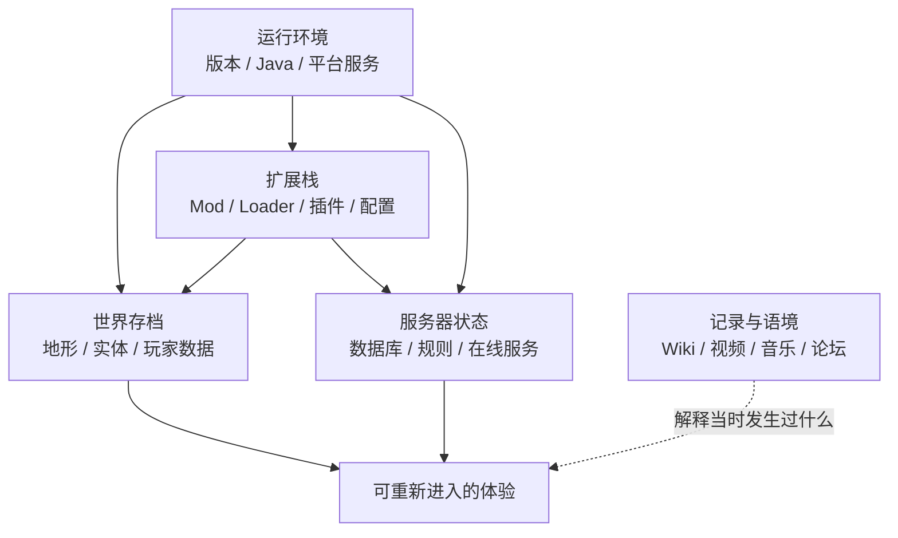

一个十几年前的 Minecraft 世界，通常不会像一张照片那样“保存成功”或“保存失败”。

它可能仍然躺在硬盘里，文件也没有损坏，但你已经很难重新进入当时那个世界。

缺的也许不是存档，而是那一版 Minecraft、那一版 Java、Forge、几十个 Mod、配置文件、服务器插件，甚至某个已经关闭的网站提供的资源。客户端还能启动，机器却不再运转；地图还在，原来的服务器经济和玩家关系却早已消失。

所以到了 Minecraft 这样寿命足够长的游戏，**保存游戏**和**保存一个曾经存在过的世界**已经不是同一件事。

这一章不试图证明 Minecraft 已经应该被封进博物馆。恰恰相反，它真正有意思的地方在于：Minecraft 仍然活着、仍在更新，而它过去的版本、玩法和社区已经开始需要被保存。

## 到底要保存什么

一款传统单机游戏，保存对象常常比较明确：程序、资源文件、运行平台。

Minecraft 多出很多层。

| 保存对象 | 里面真正有什么 | 只保留客户端够不够 |
| --- | --- | --- |
| 运行环境 | 游戏版本、Java / 系统环境、旧服务依赖 | 不够，旧版本也可能依赖已经变化的外部服务 |
| 世界存档 | 地形、建筑、物品、实体、玩家数据 | 对原版世界经常是核心，但行为仍取决于版本 |
| 扩展栈 | Mod、Loader、插件、资源包、配置 | 不够，缺一个依赖就可能改变整个世界 |
| 服务器状态 | 地图、数据库、权限、经济、插件、运营规则 | 远远不够，它本来就是持续运行的服务 |
| 记录与语境 | Wiki、论坛、视频、音乐、截图、教程 | 不能让世界重新运行，却能解释当时的人怎样理解它 |

把这些层放在一起，会更容易理解为什么“我还有那个存档”并不等于“我还能回去”。

```mermaid
flowchart TB
  R["运行环境<br/>版本 / Java / 平台服务"] --> W["世界存档<br/>地形 / 实体 / 玩家数据"]
  R --> E["扩展栈<br/>Mod / Loader / 插件 / 配置"]
  E --> W
  R --> S["服务器状态<br/>数据库 / 规则 / 在线服务"]
  E --> S
  W --> X["可重新进入的体验"]
  S --> X
  C["记录与语境<br/>Wiki / 视频 / 音乐 / 论坛"] -. "解释当时发生过什么" .-> X
```

这里有一个很重要的区别：**保存并不只有一种目标。**

<Note title="三种不同的保存">

- **延续（continuity）**：让旧世界继续升级、继续玩。重点是迁移成功，即使部分行为发生变化。
- **重现（reproducibility）**：尽量还原当时的版本、依赖和规则。重点不是最新，而是“和当时一样”。
- **记录（documentation）**：保存视频、截图、音乐、文档和研究资料。它未必能让世界重新运行，却能让后来的人知道当时发生过什么。

</Note>

这三件事经常互相冲突。

把 2012 年的世界升级到今天，可能最适合继续居住，却最不适合研究 2012 年的世界生成和红石行为；把它完整锁在旧版本里，可以保留旧规则，却失去了继续更新的便利。

所以文化遗产不是一句“永远向后兼容”就能解决的要求。

## 旧世界：迁移和重现是两回事

原版 Minecraft 在长期存档兼容上已经做得相当少见。

很多很老的 Java 世界可以经过版本迁移继续打开。1.13 的扁平化重做了大量方块和物品内部表示，1.18 又扩展了世界高度并更换地形生成方式，但开发团队仍然需要让已有区块和新生成区域尽可能共存。

这类工作保存的是**连续性**。

玩家可以继续住在同一个世界里，即使底层格式和附近新生成的地形已经属于另一个时代。它的目标不是精确复刻旧版本，而是让玩家投入的建筑和物品继续有未来。

但模组世界很快会暴露另一种问题。

一个 1.7.10 整合包世界需要的不只是 `level.dat` 和 region 文件，还可能需要完全一致的 Forge、Mod 版本、配置、脚本和 Java 环境。某个机器方块即使名称相同，只要作者后来改了数据格式，迁移也可能失去原来语义。

因此，保存模组世界越来越像保存一个**可复现的软件环境**。

社区项目 Betacraft 就很能说明这种需求。它并不只是列出旧 Minecraft 版本，而是专门修复现代系统上运行旧版时遇到的声音、皮肤、登录和兼容问题；其早期版本覆盖大量 1.6 之前的 Minecraft，新的 v2 还在继续扩展支持范围。项目也明确提到，一部分历史版本来源于 Omniarchive 的保存工作。[^betacraft]

这说明“旧 jar 还在”只是第一步。

真正的重现还要知道：它当时依赖什么 Java、访问什么资源服务、怎样读取资源、哪些外部文件已经失效。

官方启动器能让大量玩家方便地回到旧 Java 版本，这是很重要的连续性基础；社区档案项目则更关注那些官方产品没有必要长期维护的细节。

两边做的不是同一件事。

## 服务器最难保存，因为服务器本来就不是一个文件

如果模组世界已经很复杂，服务器会更难。

一台长期运营的 Minecraft 服务器通常至少包含地图、插件、配置、权限、数据库、经济数据、封禁记录、网站、Discord，以及一群知道“这里一直怎么玩”的玩家。

关服时，把 `world` 文件夹复制出来只能保存其中一部分。

这也是为什么服务器历史很容易在几年内变得只剩视频和回忆。

Mineplex 是一个很好的例子。它从 2013 年开始运营，后来成为最著名的 Minecraft 小游戏网络之一；2023 年突然关闭，随后原有成员参与的新团队取得品牌并尝试复活项目。[^mineplex-2023]

到 2026 年，Mineplex 已经重新上线，并重新推出旧玩法和新活动。[^mineplex-2026]

这件事反而说明：

> **复活一个服务器品牌，不等于保存了一段不间断的服务器历史。**

品牌可以回来，游戏模式可以重做，老成员也可以重新加入；但 2023 到 2026 之间的服务连续性确实断了。一个网络要真正被“保存”，需要保存的不只是名字，还包括代码、地图、数据库、运营知识和社区记录。

服务器因此很像一种现场表演。

源文件当然重要，但真正的作品还包括它运行时发生的事。

这也是为什么视频、论坛存档和 Wiki 对服务器历史特别重要。它们不是替代服务器，而是在服务器无法再次完整运行时，留下它曾经怎样工作的证据。

## 在线服务甚至可能没有“旧版可以启动”这条退路

Minecraft Earth 把这个问题推到了极端。

2021 年，Mojang 宣布结束 Minecraft Earth 服务。官方明确说明：6 月 30 日之后结束全部内容和服务支持，游戏不再可下载和游玩；7 月 1 日还会删除除角色创建器和 Minecoin 相关项目之外的玩家数据。[^earth]

这和“Dungeons 停止更新”是完全不同的结局。

Minecraft Dungeons 在 2023 年宣布 1.17 为最终更新，但官方同时明确表示游戏仍然可以继续玩，只是不再新增功能和内容。[^dungeons]

Minecraft Legends 在 2024 年也宣布不再发布新的更新、Lost Legends 和 Marketplace DLC，但现有游戏仍然存在。[^legends]

三者放在一起，会得到一条非常清楚的保存光谱：

| 产品 | 停止发生了什么 | 玩家还能否进入原体验 |
| --- | --- | --- |
| Minecraft Earth | 在线服务与下载终止，玩家数据删除 | 基本不能 |
| Minecraft Dungeons | 内容开发停止 | 可以继续玩现有游戏 |
| Minecraft Legends | 内容开发停止 | 可以继续玩现有游戏 |

这说明现代游戏的“寿命”越来越取决于架构。

只要关键逻辑和数据必须依赖官方在线服务，保存难度就会远高于一份可以离线启动的客户端。

对未来想做长期沙盒世界的开发者来说，这是一个比“有没有备份”更根本的产品决定：**你的世界离开公司服务器以后，还剩下多少？**

## 博物馆保存的是另一种东西

机构保存同样重要，但它的目标和玩家备份硬盘不同。

纽约现代艺术博物馆（MoMA）的馆藏里已经有 *Minecraft*：馆藏对象标为 Markus “Notch” Persson 的 *Minecraft*（2011），媒介是 video game software，由 Mojang 捐赠，馆藏编号 702.2013。[^moma]

它还曾出现在 *Never Alone: Video Games and Other Interactive Design* 等展览中。

这件事的价值并不是“从此 Minecraft 不会丢失”。

MoMA 在保存的是一个可被编目、研究和展览的设计对象。它确认 Minecraft 值得进入设计史，但它并不会替玩家保存每一个服务器数据库、每一个旧 Mod 和每一个家庭硬盘里的世界。

2025 年，美国国会图书馆又把 C418 的 *Minecraft – Volume Alpha* 选入 National Recording Registry，理由是其文化、历史或审美重要性。[^loc]

这保存的是另一层：声音。

未来的人即使从来没有运行过 Minecraft，也可以通过这些收藏知道这款游戏在视觉设计、交互与音乐上为什么重要。

所以机构保存和社区保存不是竞争关系。

博物馆擅长建立**公共记录与文化认可**；社区档案更擅长抢救那些细碎、版本化、没人会单独立项收藏的依赖。

两者合起来，才比较接近电子游戏真正的历史。

## 活着的游戏不应该为了“保存”而停止变化

讨论文化遗产很容易滑向另一个极端：既然旧规则有价值，那是不是就不应该再改？

当然不是。

如果 Minecraft 因为要保护 2011 年所有行为而停止更新，它保存下来的反而只会是一件冻结的旧软件。

前面的[《版本演进与更新策略》](/history/version-evolution)已经看到，长期更新的核心问题就是在新功能和旧投入之间分配破坏成本。文化保存需要的不是“永远不改”，而是让过去仍然有被访问、被理解和被迁移的机会。

这也是为什么 **旧版本可访问** 和 **新版本持续发展** 可以同时成立。

有些历史行为值得继续兼容；有些更适合留在旧版本里；还有一些只需要被记录下来，而没有必要永久成为当前游戏的规则。

玩家举报系统就是一个很好的例子。

Java 1.19.1 在 2022 年加入 Player Reporting 和安全聊天相关能力，允许玩家把特定聊天消息和上下文提交给 Minecraft 的审核团队。[^reporting]

它当时引起大量争议，因为私人服务器长期习惯由服主自己制定和执行社区规则。

无论赞同还是反对，这件事说明一个事实：**Minecraft 不是只有历史需要被保存，它还是一个现在仍然需要治理的产品。**

保存 2015 年私人服务器文化，并不意味着 Mojang 今天必须永久维持 2015 年的安全政策；反过来，今天的账号和安全规则也不应该让我们忘记过去服务器曾经怎样运作。

这两个目标可以同时存在。

## 保存工作的责任不会落在一个机构身上

如果没有一个主体能够保存全部 Minecraft，那么谁来负责？

答案只能是分工。

- **Mojang / Microsoft** 最适合维护当前游戏、迁移工具、官方版本、账号与正式文档；
- **玩家**最适合保存自己的世界、截图、服务器备份和私人历史；
- **Mod / Loader 社区**最了解旧依赖怎样组合、哪些版本需要特殊运行环境；
- **服务器团队**掌握地图以外的数据库、插件、规则与运营记录；
- **档案项目与互联网社区**会抢救消失的客户端、网页、论坛、Mod 和文档；
- **博物馆、图书馆与研究机构**则把其中一部分整理成稳定的公共文化记录。

没有任何一方单独足够。

这其实和 Minecraft 自己的发展史非常像。

这款游戏之所以能长成今天这样，本来就不是 Mojang 单独写完以后交给玩家消费。官方更新、服务器、Mod、Wiki、视频和玩家世界一直在共同构成它。

保存它也只能采用类似的分布式方式。

## 第一卷走到了哪里

第一卷从 2009 年的 Cave Game 开始。

那时 Minecraft 还只是一个很小的实验：方块世界可以被直接修改，开发者快速更新，玩家也快速反馈。

后来发生的事情越来越大。

公开开发让玩家在游戏没有完成时就参与它的成长；Mojang 的成立把个人项目变成长期产品；模组和服务器让外部作者继续扩展游戏；视频把玩法变成可以学习和追更的文化；跨平台和微软收购又让 Minecraft 进入手机、主机、课堂和更大的发行体系。

再往后，Java 与 Bedrock 形成两条产品线，更新开始承担越来越重的兼容成本，收入也从单纯出售客户端扩展到 Realms、Marketplace、Education 与 IP 授权。

而竞争章节最后看到，Minecraft 的影响也早已不限于“方块游戏”。后来者把它打开的不同可能性分别推向冒险、深度模拟、创作平台、写实沙盒、手工 RPG 世界和物理破坏。

走到这里，第一卷真正留下的并不是一条“Minecraft 成功公式”。

历史更适合告诉我们两件事。

第一，很多后来被认为理所当然的特征，并不是 2009 年就存在的完整蓝图。它们是在更新、社区使用、技术限制、商业扩张和偶然事件里逐渐形成的。

第二，一款游戏一旦允许玩家长期保存世界、建立服务器、写 Mod、制作视频，它的历史就会开始超出开发公司的版本日志。

这也是为什么本卷最后要停在“保存”上。

因为只有当玩家投入的东西能够比某一次客户端、某一台服务器甚至某一家公司的产品周期活得更久，我们才真正面对一种长期存在的沙盒世界。

## 从历史走向设计

历史能回答 Minecraft **怎样变成今天这样**，却还没有回答一个更困难的问题：

> **这些看似分散的选择，为什么放在一起会成立？**

为什么世界可以比任务更重要？为什么挖和放这样简单的动作能产生这么多玩法？为什么生存没有强剧情仍然能给建造意义？为什么红石的怪癖可以成为创造工具？为什么 Mod、服务器和玩家自己制定的规则没有把游戏拆散，反而延长了它的寿命？

这些问题不能只靠时间线回答。

下一卷会暂时离开公司、销量和版本史，进入 Minecraft 的**游戏设计**：从世界为什么可以成为材料开始，看这些系统怎样互相咬合，又有哪些原则真正值得下一代沙盒继承。

<Cards>
  <Card title="第二卷 · 游戏设计" href="/design" description="从历史事实转向设计关系：世界、动词、生存、红石、多人、模组与玩家作者性为什么能够同时成立。" />
  <Card title="世界作为材料" href="/design/modifiable-world" description="从最基础的问题开始：为什么 Minecraft 的世界不是背景，而是玩家可以直接操作的材料。" />
</Cards>

## 这一章留下什么

- **爱好者**：保存 Minecraft 不只是保存一个安装包。真正属于你的历史，可能同时存在于世界文件、旧版本、Mod、服务器记录、截图、视频和一群人的记忆里。
- **开发者**：如果玩家会在一个世界里投入几年甚至十几年，存档格式、离线能力、版本迁移、Mod 依赖和服务端架构都会变成文化保存问题。长期产品最珍贵的资产之一，是让玩家过去的投入仍然可以被访问。

[^betacraft]: Betacraft 项目专门让旧 Minecraft 版本在现代与复古环境中保持可玩，并修复旧客户端的声音、皮肤、崩溃等兼容问题；项目也注明大量早期版本由 Omniarchive 保存提供。见 <https://betacraft.uk/>、<https://betacraft.uk/downloads>。

[^mineplex-2023]: Mineplex 于 2023 年 5 月关闭；随后前成员 Sam Dawahare 收购项目并组织原有成员尝试重建。见 PC Gamer：《Venerable Minecraft server gets shuttered, before the old guard got back together to save it》：<https://www.pcgamer.com/venerable-minecraft-server-gets-shuttered-before-the-old-guard-got-back-together-to-save-it/>。

[^mineplex-2026]: Mineplex 在 2026 年重新正式上线。官方 6 月 Launch Weekend 公告记录了重新开放后的稳定性扩容与后续内容计划；之后官方也把阶段描述为从“reviving Mineplex”进入长期产品开发。见 <https://mineplex.com/threads/mineplex-launch-weekend.3019/>、<https://mineplex.com/threads/creative-sub-team.15306/>。

[^earth]: Mojang 于 2021 年 1 月宣布 Minecraft Earth 将在 6 月 30 日结束全部内容与服务支持，之后无法下载或游玩，并计划在 7 月 1 日删除除 Character Creator 与 Minecoin 相关项目之外的玩家数据。见 <https://www.minecraft.net/en-us/article/minecraft-earth-coming-end>。

[^dungeons]: Mojang 于 2023 年 9 月宣布 Minecraft Dungeons 的 1.17 为最终更新，不再计划新的功能与内容，但现有游戏仍然可以继续游玩。见 <https://www.minecraft.net/en-us/article/dungeons--25-million-players>。

[^legends]: Mojang 于 2024 年 1 月宣布停止为 Minecraft Legends 发布新的更新、Lost Legends 与 Marketplace DLC，但现有游戏继续保留。见 <https://www.minecraft.net/en-us/article/lost-legends-snow-vs-snouts>。

[^moma]: MoMA 馆藏记录：Markus “Notch” Persson, *Minecraft*, 2011，媒介为 video game software，Publisher 为 Mojang，Gift of Mojang，Object number 702.2013。见 <https://www.moma.org/collection/works/169919>。

[^loc]: 美国国会图书馆在 2025 年将 C418（Daniel Rosenfeld）的 *Minecraft – Volume Alpha*（2011）选入 National Recording Registry，作为具有文化、历史或审美意义的录音保存。见 <https://newsroom.loc.gov/news/national-recording-registry-inducts-sounds-of-elton-john--chicago--broadway-s--hamilton---mary-j.-bl/s/986b2312-27dd-4b66-bd41-3113e0cb2e57>。

[^reporting]: Java Edition 1.19.1 于 2022 年加入 Player Reporting、安全聊天签名与多人暂停 / 封禁提示等能力；Mojang 同时发布说明，强调报告会提交特定消息与上下文供人工审核。见 <https://www.minecraft.net/en-us/article/minecraft-java-edition-1-19-1>、<https://www.minecraft.net/en-us/article/addressing-player-chat-reporting-tool>。
