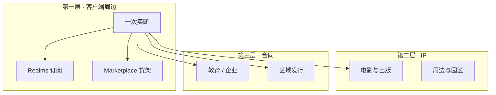

> **本章命题**：收银台仍写着一次买断，账本早已不是这一行。钱不能从镐和天空来，所以从订阅、货架、课表、授权和银幕来。买断形象能维持，不是因为后来没人收费，是因为收费被拆到了不会当场拆掉居住权的层。

## 问题

家长记得的价格是：买一次，更新一直有。玩家记得的伦理是：不要对铲子和下一片陆地单独开价。[《Mojang、Beta 与正式版》](/history/mojang-beta) 把这句话铸成标本。标本还在店面上。收据已经不是那一张。

打开 Bedrock，Minecoins 在买皮肤和地图。打开 Realms，按月付一台永远在线的小世界。打开课室，按年按头采购。打开中国大陆的应用商店，《我的世界》可以免费下载。打开影院，方块变成两个小时的票。同一套口语，五份合同。可被证伪的说法是：Minecraft 仍然只靠卖客户端活着，其余都是周边热闹。只要还看见 Realms 的订阅页、Marketplace 的货架、教育版的许可证和另一套区域发行，这句话就不成立。热闹可以有。结构管的是：哪一层允许被标价，哪一层必须继续假装免费。

本章要回答：钱从哪里来，不能从哪里来。微软不把 Minecraft 从 Gaming 里拆出来报。[^no-breakout] 所以这里不用假装有一张官方利润表。用可核对的销量、价目、创作者口径和合同形状，把账本的层画出来。量级不够的，就标明是量级。

<Note>
数字只用来自官方稿、价目表或可回溯的财报发言。二手网站的「年收入多少亿」不进正文。电影票房是发行账，不是 Mojang 分到多少；Marketplace 的「创作者产生了多少」是货架流水，不是微软把沙盒拆出来的利润。
</Note>

<Cards>
  <Card title="一次买断的钉子" href="/history/mojang-beta" description="商品停在客户端门口，是 2011 年铸成的伦理标本。" />
  <Card title="货架不是模组河" href="/history/java-bedrock" description="Marketplace 只活在可治理的那条产品线上。" />
  <Card title="课表是另一份合同" href="/history/media-education" description="教育版按年按头收费，选的是 Bedrock。" />
</Cards>

三层不是时间顺序。LEGO 比 Marketplace 更早；教育版比电影更早。层的意思是：离「住进去的规则」有多远。越远，越不容易被听成「你们开始卖铲子了」。买断形象靠的就是这点距离。

## 「只卖一次」早已不是全貌

店面句子没改：PC 上现在一份钱拿 Java 和 Bedrock 两套客户端，标价仍是一次买断那一类，大约 30 美元量级；已有其中一份的人，2022 年 6 月起免费领取另一份。[^bundle-price] Game Pass 把同一份再收进微软自己的订阅池，买断变成「包含在内」。[^gamepass] 句子听起来仍像 2011 年。账不是。

2011 年的标本管的是内核：不要把居住权拆成可重复出售的道具。它不管三件事。第一，联机世界可以另卖托管。第二，换皮和换地图可以另卖商品。第三，口语一旦离开客户端，可以另卖给课室、影院和另一个国家的发行商。三件事都不碰镐的耐久。于是出现一种稳定的错觉：游戏还是买断的；钱从旁边漏进来。错觉对品牌有用。对开发者有用的是：漏进来的位置，全是 2011 年故意没标价的层。

销量把错觉撑得很厚。2023 年 10 月 Minecraft Live，Helen Chiang 公开：超过 3 亿份。[^300m] 2021 年 4 月 Nadella 在财报会上说，月活跃接近 1.4 亿，同比高三成。[^mau] 3 亿份是入场券的累计；1.4 亿是还住在里面的人。入场券可以只卖一次。住在里面的人，每个月都可能再买一次世界、一次皮肤、一张电影票。买断卖的是资格。资格越便宜、越像性格，周边层越好卖。

<Constraint name="商品停在客户端门口" verdict="凑合" chain="一次买断 → 信任 → 变现外溢">
这条约束保护的是「规则可以住」。它没有禁止后来对托管、皮肤、课表和银幕收费。所以它是品牌上的地基，账本上的凑合：门口不设收费站，收费站修在门外的路上。路上一旦修多了，门口那句话仍真，收据已经不像那句话。
</Constraint>

可被证伪的说法是：买断已经名存实亡，内核早就按次计费。只要镐、方块和无限世界仍不单独标价，名就还在。亡的是「这一行等于全部收入」。后文三层都在证明：全部，在旁边。

## 第一层：客户端、Realms、Marketplace

第一层最靠近游戏，也最容易被听成背叛。必须分述。Java 和 Bedrock 不是同一张收据。

| | Java | Bedrock |
| --- | --- | --- |
| 入场 | 一次买断；PC 上与 Bedrock 捆成一份收银台 | 各商店各一份客户端；手机、主机、Windows 各走各的管道 |
| 托管 | Java Realms，约每月 8 美元量级，十人席 | Realms / Realms Plus，约 4 / 8 美元量级；Plus 绑 Marketplace 目录 |
| 货架 | 没有 Minecoins 那种官方内容店 | Marketplace：皮肤、地图、材质、附加包，创作者走伙伴计划 |
| 作者席 | 模组河仍在 jar 外，EULA 禁止拿模组直接卖钱 | 扩展面要过审核，才能变成货架 SKU |

客户端这一行仍然像标本。Realms 从一开始就不是标本里的东西。2013 年 3 月，Carl Manneh 把服务对象说成「不想再替孩子当管理员的家长」，并预期 Realms 将来能比游戏本身带来更多钱。[^realms-2013] 预期是否兑现，微软没拆账。结构已经写明：官方承认，很大一部分游戏发生在别人的服务器上；家庭要一份更安全、更笨、永远在线的小世界，愿意按月付。Realms 不是 Hypixel。它故意不是。[《服务器即新游戏》](/history/servers) 写过那种立法权。Realms 卖的是托管，不是宪法。卖托管，就可以不碰镐。

Bedrock 把订阅再拧紧一扣。Realms Plus 不只给十人席，还把 Marketplace 目录捆进来。[^realms-price] 按月付的，已经不只是机器，是一篮子过审的地图和皮肤。Java Realms 没有对等的货架。订阅在两边都存在；货架只活在可进商店、可管账号的那条线上。[《两条产品线》](/history/java-bedrock) 写过：Marketplace 不是模组河的移动版。收入结构把那句话收成账：Java 继续靠买断养活作者席的入口；Bedrock 在买断之上，另开一层可审核的商品。

2017 年 4 月 Marketplace 宣布时，分成被写成善事：应用商店先抽约 30%，之后创作者拿大头。[^mp-announce] 2021 年 4 月 Nadella 的口径是：创作者已从超过 10 亿次下载的模组、附加包和其他体验中产生逾 3.5 亿美元——并且这还没算货架外面的活动。[^mau] 2022 年五周年，行业报道转述的官方量级是创作者侧超过 5 亿美元、伙伴约 300 家。[^mp-500] 这些数字证明货架能养职业创作者。它们不证明货架等于模组文化。能上架的，是皮肤、地图、换皮；能立法的，仍在 Java 那条没有 SKU 的河里。

<Alternative title="如果对镐收费">
最直的路是：耐久、传送、下一片陆地都做成内购。路很短，标本当场碎。2011 年公开庆祝过「商品停在门口」之后，再对居住权标价，争的就不再是分成，是「你们还卖不卖那套可以住的规则」。Realms 和 Marketplace 选择绕路：一个卖托管，一个卖外观和过审的世界。绕路不是良心发现。绕路是承认门口那句话已经贵到不能拆。
</Alternative>

第一层的结论很硬：买断形象要维持，第一层就必须看起来像可选。可选托管、可选皮肤、可选地图。内核继续免费更新。更新越勤，入场券越值，货架越好卖。勤，是设计政治；也是这张收据的利息。

<Impl title="价目会过期，结构不会">
以下只作量级，方便对照，不是报价单。PC 捆绑约 29.99 美元一次；Bedrock Realms 约 3.99 美元/月，Realms Plus 与 Java Realms 约 7.99 美元/月。[^bundle-price][^realms-price] 教育版合格学校约 5.04 美元/用户/年，商业许可约 36 美元/用户/年。[^edu-price] 标价变动不改层：门口一次，路上按月或按头。
</Impl>

## 第二层：周边、电影、出版、主题公园

第二层更远。远，所以更不像在卖游戏。方块离开客户端，变成可被认出的口语：苦力怕、格子、那种一看就知道的人。口语能离开，IP 才能在不玩游戏的人那里继续值 2014 年那 25 亿。[《微软收购》](/history/acquisition) 把第二曲线写成入口的复制。复制要变现，就落在这一层。

LEGO 比收购更早。2012 年 1 月，CUUSOO 过审，夏季发出第一套 Micro World。[^lego] 积木不是 DLC。积木是把度量衡再做一遍：1×1 贴片去近似一格。孩子可以不装游戏，先认识格子。认识格子的人，以后更好买客户端，也更好买下一盒。周边不是游戏的附属纪念品。周边是入口的学前班。

书、服装、电影走同一条逻辑。2025 年 4 月 4 日公映的 *A Minecraft Movie*，全球票房收到约 9.6 亿美元量级。[^movie-bo] 票房是华纳和传奇的发行账。Mojang 分到多少，没有拆开的官方数。对本书有用的不是分成比例，是规模本身：两个小时的笑话能收到这个量级，说明被买走的是已经教过的口语，不是另一套挖放看。Nadella 的祝贺是「from block to blockbuster」。[^movie-quote] 第二曲线在银幕上结账。结的不是镐。

园区把口语再做成可走路的地方。Merlin 与 Mojang 宣布，2027 年在伦敦郊外的 Chessington 开出 Minecraft World：过山车、积木游乐、主题餐饮零售，项目口径 5000 万英镑。[^park] 园区还没开门。合同已经说明问题：入口铺到内核到不了的房间之后，房间开始收门票。门票可以很贵。它仍然不像在对存档收费。

第二层会反咬第一层。电影和积木需要一个更好拍、更好卖、更适合儿童货架的 Minecraft；工地需要误用和没人的走廊。品牌保护前者。保护成功时，后者会被说成「不是给孩子的」。收购没有发明这句。第二层给这句发工资。

## 第三层：教育、企业、区域发行权

第三层是合同。合同可以让同一个词变成另一种商品，而不改方块的尺寸。

教育版最干净。合格学校按用户按年，大约 5 美元量级；进不了教育机构资格的商业许可，大约 36 美元。[^edu-price] 课室买的不是一次居住权。买的是可管理的白天政权：传送、发放物品、看见学生在哪。[《影像、教育与一代人的媒介》](/history/media-education) 写过立法者换成老师、引擎换成 Bedrock。收入结构只补一句：按年按头，是因为课表按年按头。一次买断对学校不好采购。订阅对学校才像软件。Minecraft 在客厅里是游戏；在采购单上是许可证。许可证选更好管的那条产品线，不是审美。

企业向的工作坊、活动授权、品牌合作，走的是同一张桌子的边。Usage Guidelines 把商业使用写得很宽：用名字和资产去跟别人分享，就算商业。[^guidelines] 宽，是为了卡住未授权的货。宽的另一面：官方可以另开许可证，把方块卖进培训、展览和活动。细节留给法务。结构是：内核仍买断，品牌可以按次出租。

中国大陆把第三层写到最大。2016 年 5 月 20 日，微软、Mojang 与网易宣布：中国大陆移动与 PC 版五年独家授权，并由 Mojang 做适合中国市场的版本。[^china-2016] 2017 年 10 月 12 日全平台公测：Java、iOS、Android，**免费畅玩**。[^china-f2p] 国际版门口一次买断；国服门口免费，钱在实名、防沉迷、内购、联机服务和本地化运营里。同一品牌。两份合同。可被证伪的说法是：Minecraft 在全世界卖的是同一种商品。只要还存在「这边付 30 美元拿走客户端、那边免费下载再走内购」，这句话就不成立。免费不是更慷慨。免费是另一种发行权的定价。

第三层证明：买断是一种地区性的伦理标本，不是物理定律。标本在西方店面上仍然值钱，因为它被听成性格。到了必须有版号、实名和未成年人限额的市场，性格要让路给可运营的合同。让路之后，方块还在。收据换了税法。

## 不能从哪里来

还有一层永远进不了这张图的左边：Java 的模组河。

EULA 写得很干脆。你从零做的 Java 模组属于你；你可以分发；你不能拿它卖钱，也不能分发「模组版游戏」。[^eula] Usage Guidelines 把话说成：模组必须单独分发，不能做成外挂客户端，不能拿局外资产去锁局内功能。[^guidelines] 2014 年 6 月，Mojang 把服务器变现从「法律上你根本不该靠我们的游戏赚钱」收成一套例外：可以卖统一门票，可以卖纯外观，不能卖影响玩法的道具。[^eula-2014] 例外承认服主要吃饭。例外不承认模组作者可以把工业电网做成货架 SKU。

所以官方抽不成模组的成。不是技术做不到——Forge 的下载量比许多货架更显眼。是合同做不到：模组一旦允许标价，门口那句「不要卖铲子」就要解释，为什么作者席可以卖新陈代谢、官方却不能卖耐久。解释会把标本拆掉。标本比抽成值钱。于是抽成发生在 Bedrock 的货架上，发生在皮肤和过审地图上，不发生在活塞变成工业的那条河里。河里继续是礼物、捐赠和署名。[《模组、服务器与灰色经济》](/history/grey-economy) 写那张影子账本。本章只钉死：最养活正作的劳动，正式账本抽不到。抽不到，不是疏忽。抽不到，是买断形象的保险。

<Callout type="warning" title="不要把这层写成道德胜利">
模组无偿，不等于官方高尚，也不等于作者必须永远不吃饭。它只说明：在「规则可以住」被公开庆祝之后，对立法权抽成会比卖皮肤更像背叛。Marketplace 是绕路成功。绕路成功的代价是，两条产品线再也不能假装是同一个作者席。
</Callout>

可被证伪的说法是：只要开一个 Java 官方模组店，抽成问题就解决了。店一开，EULA 那句「属于你但不能卖」就要改；一改，门口标本和货架就会抢同一套词。抢过之后，你得到的不是 Steam 创意工坊。你得到的是第二条 Marketplace，以及一条被收编后不再像河的河。[《模组、服务器与灰色经济》](/history/grey-economy) 把桌子铺开。这里只要记住：钱不能从这里来，是因为品牌已经把这里许诺成礼物。

## 这一章留下什么

- **爱好者**：你买的那一次仍然算数。镐没有开始计费。后来多出来的钱，走的是托管、皮肤、课表、授权和银幕。讨厌某次货架，是在讨厌某一层；不必再假装整张收据都是「卖身」的续集。中国版若让你觉得「这还是不是同一个游戏」，你的感觉很准——合同确实不是同一份。
- **开发者**：能抄走的是「买断形象靠变现外溢」——内核继续像性格，收费修在托管、外观、许可证和 IP 上，家长仍能把产品听成一次购买。抄不走的是：你没有一份已经被家庭和课表说会的口语，可以让第二层值一张电影票；没有一条可治理的产品线，货架就开不出来；没有 2011 年当众铸好的标本，你对立法权抽成时，不会被拿去和「不要卖铲子」对照。你若只抄 30 美元买断，会看不懂为什么创作者流水已经以亿美元计，模组河却仍被合同锁在礼物里。真正值钱的，是那道不能拆的门，和门外面那些可以拆的路。

[^no-breakout]: 微软 10-K / 财报将游戏并入 More Personal Computing 下的 Gaming 等口径，不单独列出 Minecraft。Nadella 在电话会上会点名 Minecraft 的月活与创作者流水，仍不是一条可逐年对照的特许经营权利润表。见 2021 财年第三季度电话会转写，<https://www.fool.com/earnings/call-transcripts/2021/04/28/microsoft-msft-q3-2021-earnings-call-transcript/>。

[^bundle-price]: 2022 年 6 月 7 日起，Windows PC 上的标准售卖形式为 *Minecraft: Java & Bedrock Edition for PC*，已有其中一版者免费获得另一版。官方写明两款游戏仍分离，只是默认两份都有。见 Mojang，<https://www.minecraft.net/en-us/article/java---bedrock-edition-pc-out-june-7>。美国微软商店该 SKU 价目约 29.99 美元量级，随地区与捆绑包变动；本章取量级，不作报价。商店页见 <https://www.xbox.com/en-us/games/store/minecraft-java-bedrock-edition-for-pc/9nxp44l49shj>。

[^gamepass]: 同商店页可将该 PC 捆绑标为 Game Pass 包含。这是把一次买断收进微软订阅池，不是另做一款游戏。

[^300m]: 2023 年 10 月 15 日 Minecraft Live，Mojang Studios 负责人 Helen Chiang：「over 300 million copies sold」。官方综述见 <https://www.minecraft.net/en-us/article/minecraft-live-2023--the-recap->；The Verge 同日报道，<https://www.theverge.com/2023/10/15/23916349/minecraft-mojang-sold-300-million-copies-live-2023>。

[^mau]: 2021 年 4 月 27 日微软财报会，Satya Nadella：「Minecraft is nearly 140 million monthly active users, up 30% year over year」；「Creators have generated over $350 million from more than 1 billion downloads of mods, add-ons, and other experiences in Minecraft. This is not counting … activity outside of our marketplace.」见电话会转写，<https://www.fool.com/earnings/call-transcripts/2021/04/28/microsoft-msft-q3-2021-earnings-call-transcript/>。Xbox Wire 同年 6 月再引 3.5 亿与 10 亿次下载，<https://news.xbox.com/en-us/2021/06/10/satya-nadella-and-phil-spencer-on-gaming-at-microsoft/>。

[^realms-2013]: 2013 年 3 月，Mojang CEO Carl Manneh 称 Realms 面向「tired of trying to act as server administrators on behalf of their kids」的家长，并预期该服务将来能「bring in more money than Minecraft itself」。见 GamesIndustry.biz，<https://www.gamesindustry.biz/mojang-targets-families-with-minecraft-realms-subs-service>。这是动机与预期，不是已兑现的拆账。

[^realms-price]: 官方 Realms 页（Bedrock）：Realms 约 3.99 美元/月（你 + 2 人同时在线），Realms Plus 约 7.99 美元/月（你 + 10 人），Plus 含 Marketplace Pass 目录；Java Realms 约 7.99 美元/月、10 人。价目随地区变动。见 <https://www.minecraft.net/en-us/realms>。

[^mp-announce]: 2017 年 4 月 10 日 Mojang 宣布 Marketplace。分成原话：「when a cool skin or map gets purchased, the app store platforms take a 30% cut, but creators get the majority after that。」见 <https://www.minecraft.net/en-us/article/its-time-discover-marketplace>。

[^mp-500]: 2022 年 Marketplace 五周年，GamesIndustry.biz 转述：内容下载超 17 亿次，创作者社区产生超过 5 亿美元收入，当时约 295 家伙伴、43 家累计分成逾 100 万美元。见 <https://www.gamesindustry.biz/lessons-from-minecraft-marketplace>。GDC 2024 演讲简介亦称自 2015 年起超 5 亿美元 gross revenue、17 亿次下载，<https://www.gdcvault.com/play/1034211/Building-the-Minecraft-Creator-Platform>。此为货架 / 创作者流水量级，不是微软 Minecraft 利润。

[^lego]: 2012 年 1 月 LEGO CUUSOO 上的 Minecraft 方案过审；2012 年夏发售 21102 Micro World。当代报道见 The Guardian，<https://www.theguardian.com/technology/gamesblog/2012/feb/17/lego-launch-minecraft-sets>；The Brothers Brick 对发售信息的转述，<https://www.brothers-brick.com/2012/02/16/lego-minecraft-set-officially-unveiled-news/>。

[^movie-bo]: *A Minecraft Movie* 于 2025 年 4 月 4 日北美公映。Box Office Mojo 累计全球票房约 9.60 亿美元（其中国内约 4.24 亿）。见 <https://www.boxofficemojo.com/title/tt3566834/>。票房属发行账，不代表 Mojang 分成。

[^movie-quote]: Satya Nadella 2025 年 4 月 3 日：「From block to blockbuster. Huge congrats to Mojang, Warner Bros., and Legendary on crafting something truly epic.」见 LinkedIn，<https://www.linkedin.com/posts/satyanadella_from-block-to-blockbuster-huge-congrats-activity-7313705351453806592-pkpg>。

[^park]: 2026 年 3 月 21 日 Merlin Entertainments 与 Mojang Studios 宣布 Minecraft World 将于 2027 年在 Chessington World of Adventures 开幕，口径为 5000 万英镑的主题园区。见 Merlin 新闻稿，<https://www.merlinentertainments.biz/newsroom/news-releases/2026/minecraft-chessington/>；园区页，<https://www.chessington.com/minecraft/>。

[^edu-price]: Minecraft Education：合格教育机构约 5.04 美元/用户/年；非此资格的商业许可 2025 年 9 月 4 日起为 36 美元/用户/年（到期后续订生效）。见教育版支持，<https://edusupport.minecraft.net/hc/en-us/articles/360047119092-FAQ-Availability-Pricing-and-Licensing>、<https://edusupport.minecraft.net/hc/en-us/articles/38684236168980-FAQ-Commercial-License-Changes>。

[^china-2016]: 2016 年 5 月 20 日，微软、Mojang 与网易宣布五年独家协议，授权网易关联公司在中国大陆发行 Minecraft 移动与 PC 版，并由 Mojang 开发适合中国市场的版本。见网易投资者关系稿，<https://ir.netease.com/news-releases/news-release-details/minecraft-will-officially-enter-china-mobile-and-pc-netease>。

[^china-f2p]: 2017 年 10 月 12 日网易宣布《我的世界》中国版全平台公测：PC Java、iOS、Android「免费畅玩」。见网易游戏，<https://game.163.com/news/2017/10/12/18467_717849.html>。中国区 App Store 商品页亦标为免费 + App 内购买，<https://apps.apple.com/cn/app/%E6%88%91%E7%9A%84%E4%B8%96%E7%95%8C-%E7%A7%BB%E5%8A%A8%E7%89%88/id1243986797>。

[^guidelines]: Minecraft Usage Guidelines：商业使用包括用名称、品牌与资产去和别人分享；允许在统一票价、全员同一模组的前提下为服务器收费；模组须单独分发、不得做成 play-to-earn 或用局外资产锁局内功能。见 <https://www.minecraft.net/en-us/usage-guidelines>。

[^eula]: Minecraft EULA：从零创建的 Java Edition 模组属于作者，「as long as you don't sell them for money / try to make money from them and so long as you don't distribute Modded Versions of the game」。见 <https://www.minecraft.net/en-us/eula>。

[^eula-2014]: 2014 年 6 月 Mojang《Let's talk server monetisation》：允许统一门票、捐赠（不给独享玩法）、纯外观道具；不允许出售影响玩法的物品或用法币买游戏内货币。档案见 <https://web.archive.org/web/20190221061149/https://mojang.com/2014/06/lets-talk-server-monetisation/>；Kotaku 同月报道，<https://kotaku.com/mojang-is-trying-to-kill-pay-to-win-on-minecraft-server-1591663994>。
